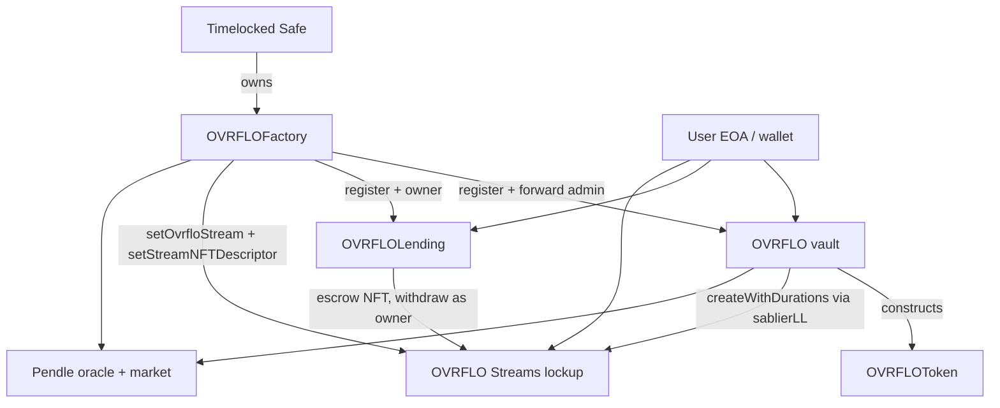

# Agent onboarding — OVRFLO protocol

Audience: coding agents. Not a user manual. Not a marketing brief.

Purpose: take a new agent from zero to two jobs:

1. Ship code that matches the live contracts and the settled design.
2. Advise what this codebase must do and must not do, for this change and for the mid and long term.

Verified against `src/` on 2026-08-14. Treat every claim below as a hypothesis until the agent re-opens the named file. Line numbers drift. Function names and immutables drift less.

---

## Before writing code

Binding for every agent, every change. Do this before the first code write. Do not skip it because the ticket looks small.

Solidity source: `docs/solutions/patterns/solidity-implementation-discipline.md` Sequence 6–9. Frontend source: `docs/maps/SCHEMAS.md` §4 (intent capsule). Template: `.scratch/decisions/template.yaml`.

1. **Record intent first.** Write the assumptions, the predicted blast radius (files and callers), and the verification that will fail if the change is wrong. Post that record in the session. For a Markets change that reads or writes mapped state keys, also write `.scratch/decisions/YYYY-MM-DD-*.yaml`. Author the record *before* the code. Do not reconstruct the record later and present it as pre-authored intent. Missing intent stays missing. Do not invent it.
2. **Log deviations.** If execution disagrees with the active plan, stop when the choice is unpinned and surface it. When a deviation is forced, write the deviation and the reason on the ticket or in the session. Do not edit the plan while implementing. Do not silently change the plan in code.
3. **Review the actual diff.** Before calling the work done, run `git diff --stat` and compare the file list to the predicted blast radius. A miss is a `docs/solutions/` learning candidate. Scratch YAML `diff_hints` names where a reviewer looks first. `rejected_alternatives` names approaches that lost and why.

Campaign tickets under `.scratch/` copy this sequence into the session prompt. Onboarding here is the standing rule when no ticket exists.

---

## 0. How to read this repo

This repository holds years of plans, audits, glossaries, and UI briefs. Many are true. Some are superseded. Some mix live state with a future name. Some contradict `src/` in one sentence.

### Trust ranking (highest wins)

1. **`src/` and the test that would fail if the claim were wrong.** Open the function. Open the test. Do not trust a citation of either.
2. **The active plan** in `docs/plans/` when the agent is implementing that plan. Plans are read-only during implementation. A session-settled Key Decision in that plan beats a minimality argument.
3. **`docs/solutions/patterns/ovrflo-critical-patterns.md`** — but only entries marked ALWAYS REQUIRED. Entries marked SUPERSEDED-BY-DESIGN are history. The "Considered and rejected" section (R-01..R-07) is binding: do not re-raise those findings without new evidence.
4. **This file** — a briefing. Re-verify against (1) before a deploy or a security verdict.
5. **`x-ray/`** — entry points and invariants as of a named commit. IDs were renumbered at the v1-lite rewrite. Cite as `x-ray/invariants.md` plus the commit, never as a timeless ID.
6. **`CONCEPTS.md`** — glossary. Use the live "OVRFLOLending v1-lite" terms. The earlier "OVRFLOLending" section is labeled superseded. Some live-looking entries already use the unbuilt stream-fork name.
7. **`PRODUCT.md`** — product identity for the Markets app. `docs/maps/` puts this above UI code for *meaning*. It does not outrank `src/` for what the chain does.
8. **`AGENTS.md`, `README.md`** — orientation. Both lag. Both still name deleted functions in places, or mix flash-loan reentrancy facts.
9. **Historical plans, `.scratch/`, old audit writeups, model memory.** Use as leads. Never as authority.

### Conflict rule

When two documents disagree, name both, open `src/`, and report the code. Do not average them. Do not pick the newer markdown by date alone — until ticket 07, `CONCEPTS.md` had a stale rebrand/`setMinter` paragraph; the streams plan (R1/R9/R2b) wins over any stale glossary.

When this onboarding file disagrees with `src/`, `src/` wins. Patch this file or record the contradiction. Do not silently follow the briefing.

### Dead names (do not revive)

These do not exist in `src/`:

`sellStreamToLiquidity`, `postSaleListing`, `cancelSaleListing`, `buyListing`, `createBorrowerLoanPool`, `claimLoanPoolShare`, `liquidityPositions`, `saleListings`, `loanPools`, `deployOvrflo`, `deployLending`, `configureDeployment`.

A grep hit in `docs/` or `CONCEPTS.md` (superseded section) is history. A grep hit in a new patch is a defect.

---

## 1. What the protocol is

OVRFLO turns a Pendle principal token (PT) discount into two usable legs, then lends against the streamed leg.

A PT trades below face before maturity. A depositor puts PT into an OVRFLO vault. The vault mints ovrfloToken for the TWAP value immediately, and streams the remaining discount as a non-cancelable linear lockup in ovrfloToken until PT expiry. That stream is deterministic collateral. A borrower pledges the stream NFT to OVRFLOLending and draws underlying at a fixed APR tick. The stream pays the lender on schedule. There is no health factor and no liquidation, because the collateral cannot underperform.

A full borrow (draw the whole discounted price) is economically a sale: obligation equals remaining stream face. There is no separate sale-listing mechanism.

The public statement is: **OVRFLO enables self-repaying loans.**

### The cycle

1. Deposit approved PT. Receive immediate ovrfloToken plus a stream of the discount.
2. Borrow the stream's discounted value on OVRFLOLending (or hold the stream).
3. Exit ovrfloToken via unwrap (wrap-reserve path) or via post-maturity `claim` of PT, or via a DEX.

The vault stays solvent on the combined check in §5. The deposit adds PT backing. Unwrap consumes wrap-reserve backing. Cross-origin ovrfloToken fungibility is a design feature.

---

## 2. Live contract map

Six Solidity files in `src/`. Nothing else is a protocol contract.

| File | Role |
|---|---|
| `OVRFLOFactory.sol` | Registry and sole admin hub. Deploys nothing. `Ownable2Step`. Owner is a timelocked multisig. |
| `OVRFLO.sol` | Vault for one underlying. PT deposit, claim, wrap/unwrap, PT flash loan. Admin is the factory. |
| `OVRFLOToken.sol` | ERC20 the vault constructs and owns. Mint and burn are vault-only. |
| `OVRFLOLending.sol` | Loan-only fixed-rate tick book. One lending per registered vault. Owner is the factory from construction. |
| `StreamPricing.sol` | Pure library: APR factor, gross price, obligation, fee, stream eligibility. |
| `TickTree.sol` | Packed prefix-sum tree for one tick epoch. Height 4→7. |

External bindings:

- Pendle market, SY, PT, and the factory-wide Pendle TWAP oracle (`0x9a9Fa8338dd5E5B2188006f1Cd2Ef26d921650C2` in `script/OVRFLO.s.sol`).
- **OVRFLO Streams** lockup — fork of Sablier v2-core v1.1.2. Solidity contract `SablierV2LockupLinear`; deployed ERC721 identity `OVRFLOStream`. Vault getter name stays `sablierLL()` (constructor-bound). Factory storage is `ovrfloStream` (set once). Lending constructor arg stays `sablier`. **`sablierLL` no longer resolves to canonical `0xAFb979d9afAd1aD27C5eFf4E27226E3AB9e5dCC9`.** `registerOvrflo` / `registerLending` require the candidate binds `factory.ovrfloStream()`. `SablierMismatch` still proves vault and lending bind the same stream.

Not in this repo's `src/` today:

- Fork source for OVRFLO Streams (lives in sibling GPL repo `OVRFLO-Streams`; this repo never compiles it).
- Proxies. This protocol has never deployed a proxy.
- A second principal-token protocol. Pendle-only.

Interfaces live in `interfaces/`: `IFlashBorrower`, `IPPrincipalToken`, `IPendleMarket`, `IPendleOracle`, `ISablierV2LockupLinear` (name kept; members include fork additions), `IStandardizedYield`.

---

## 3. Actors and trust



| Actor | Can call | Must not call |
|---|---|---|
| User | Vault `deposit` / `claim` / `wrap` / `unwrap` / `flashLoan`. Book `supply` / `withdraw` / `borrow` / `repay` / `close` / `claim` / `advanceEpochCursor`. Stream lockup as NFT owner. | Factory admin. Vault `onlyAdmin`. Book `onlyOwner`. Lockup fee/admin setters. |
| Safe | Factory `onlyOwner` (register, `setOvrfloStream`, `setStreamNFTDescriptor`, addMarket, prepareOracle, sweeps, flash pause/fee, lending forwarders). | Vault, lending, or lockup directly. Pattern #8. |
| Factory | Vault admin and lending owner functions, after `_requireKnownOvrflo` / `_requireKnownLending`; lockup `setNFTDescriptor` via forwarder. | User money paths. Lockup `transferAdmin` / fee setters (no forwarder). |
| Unregistered vault or lending | Its own bytecode, inert to the protocol. | Factory forwarders refuse unknown addresses. |

Multisig verifies off-chain: creation code vs the audited artifact, token name/symbol prefixes, treasury and underlying intent. The factory re-checks constructor bindings on-chain (factory, oracle, owner, `sablierLL`/`sablier` == `ovrfloStream`, one vault per underlying). Matching vault bytecode alone is not a safe stream-binding predicate after KTD6. Do not duplicate the off-chain checklist as new `require`s.

The bound lockup preserves Sablier v1.1 `withdraw` ACL byte-for-byte (plan R3): reverts unless the caller is the stream sender, the NFT owner, or an approved operator. The vault has no withdraw path. The lending market approves no operator. Newer Sablier Lockup docs describe a public withdraw-to-recipient path. That is a different version. Do not "fix" third-party withdrawal. See `docs/audit/rejected-findings-record.md` and `docs/audit/sablier-interface-contract.md`.

---

## 4. Factory: register, do not construct

Constructor: `OVRFLOFactory(address _owner, address _oracle)`.

The factory embeds no child creation code (EIP-170). Any EOA can `new OVRFLO(...)` and `new OVRFLOLending(...)`. Those candidates are inert until the owner registers them.

**`registerOvrflo`** checks, in order: nonzero, not already registered, `factory.ovrfloStream()` set, `vault.sablierLL() == ovrfloStream`, `vault.factory() == this`, `vault.oracle() == factory.oracle`, no vault already mapped for that underlying. Then writes `ovrfloInfo`, `underlyingToOvrflo`, and the enumerable `ovrflos` list.

**`registerLending`** checks: core is a known vault, no lending yet for that vault, `lending.factory() == this`, `lending.owner() == this`, `lending.sablier() == vault.sablierLL()`, `lending.sablier() == factory.ovrfloStream()`. The lending constructor already called `_transferOwnership(factory_)` and pulled treasury/underlying/ovrfloToken from `ovrfloInfo(core)`. Registration does not re-check `stream.factory()` / `stream.admin()` / `comptroller.admin()` — those live on `setOvrfloStream` only.

Deploy order:

1. `new OVRFLOFactory(multisig, pendleOracle)`
2. Deploy OVRFLO Streams lockup + comptroller + descriptor (sibling repo artifacts); `setOvrfloStream(lockup)`
3. `new OVRFLO(factory, treasury, underlying, name, symbol, oracle, stream)` — vault constructs its token; `stream` becomes `sablierLL`
4. `registerOvrflo(vault)`
5. `new OVRFLOLending(factory, vault, stream, launchAprBps)` — `aprMaxBps` starts at `launchAprBps` (multiple of 25 bps, capped at `APR_MAX_CEILING`); `aprMinBps` starts at 0
6. `registerLending(lending)`
7. `prepareOracle(market, twap)` then `addMarket(vault, market, twap, feeBps)`
8. `setLendingTickSpacing(lending, market, spacing)` — **once per market**. No on-chain default. Supply and borrow revert `SpacingUnset` until this lands.

TWAP bounds: 15 minutes minimum, 30 minutes maximum. `prepareOracle` and `addMarket` share `_validateTwapBounds`. Deposit fee max is `FEE_MAX_BPS = 100` (1%) on the factory. Flash-loan fee max is `FLASH_FEE_MAX_BPS = 100` on the vault.

`addMarket` reads PT and expiry from the Pendle market, requires `SY.yieldToken() == vault.underlying`, then calls `vault.setSeriesApproved`. Series config is write-once (`SeriesAlreadyConfigured`, `PtAlreadyMapped`). Do not add `disableSeries` / `enableSeries`.

`setMarketDepositLimit`: `0` means unlimited.

Local Anvil: `bash script/seed-local.sh` (via `npm --prefix web run bootstrap:local`). Do not `forge script --broadcast` against `127.0.0.1` (Foundry #11714). Production / Tenderly: `forge script script/OVRFLO.s.sol --rpc-url … --broadcast` with `PRIVATE_KEY` and `MULTISIG_ADDRESS`. Size gate: `test/DeploySize.t.sol`.

---

## 5. Vault mechanics

One vault per underlying. One ovrfloToken per vault. Many Pendle series (markets) under that vault. ovrfloToken is fungible across deposit origin and wrap origin, and across series of the same underlying.

### PT deposit (`deposit`)

Pre-maturity only. `ptAmount >= MIN_PT_AMOUNT` (1e6). TWAP-fresh oracle. Optional per-market cap.

Split: immediate `toUser` from the PT→SY rate; remainder `toStream`. Fee is `StreamPricing.fee(toUser, feeBps)` in **underlying**, paid to treasury. Vault mints `toUser` to the depositor and `toStream` to itself, then `sablierLL.createWithDurations`: sender = vault, recipient = user, asset = ovrfloToken, cancelable = false, cliff = 0, end = series expiry.

The stream face is the discount, not the PT amount.

### Claim (`claim`)

Post-maturity. Burn ovrfloToken, transfer PT 1:1. Bounded by `marketTotalDeposited`. The user redeems PT on Pendle. The vault must not redeem PT to underlying on the user's behalf (R-05): SY redeem is 1:1 in the accounting asset (stETH), not in wstETH. Protocol-level redeem would break wrap/unwrap 1:1.

### Wrap / unwrap

Permissionless, 1:1, no stream, no fee, no maturity gate. Bounded by tracked `wrappedUnderlying`, not raw `underlying.balanceOf(vault)`. Direct transfers do not increase the wrap reserve. `sweepExcessUnderlying` can recover the gap. `sweepExcessPt` must reject a non-PT address (`UnknownPT`) or a call with the underlying address drains the wrap reserve (pattern #11). Sweep `to` is trusted to the multisig (R-02).

### PT flash loan (`flashLoan`)

EIP-4531. Sends PT, calls `onFlashLoan`, pulls PT back, then pulls an oracle-adjusted fee in underlying. Capped by `marketTotalDeposited`. Pre-maturity. Pausable. **`nonReentrant` on `flashLoan`.** Nested flash loans revert. `deposit` / `wrap` / `unwrap` carry no reentrancy guard, so the callback can still deposit. Several docs say the opposite of this paragraph. Code wins: `OVRFLO.flashLoan` is `external nonReentrant`.

### Combined solvency

```
ovrfloToken.totalSupply() <= underlying.balanceOf(vault) + ptToken.balanceOf(vault)
```

Individual checks (`wrappedUnderlying <= underlying.balanceOf`, `marketTotalDeposited <= pt.balanceOf`) can fail after maturity when fungible ovrfloToken exits through the other pool. The combined check is the real invariant. Established in the 2026-07-01 fuzz campaign.

Underlying for the live design is **wstETH**, not stETH. `ovrfloToken = PT = SY yieldToken = wstETH` at 1:1. stETH rebasing plus the ~22% stETH/wstETH gap would transfer value from depositors to wrappers.

Pendle PT is always 18 decimals. No on-chain `decimals()` check (R-01).

---

## 6. Lending mechanics (v1-lite)

Loan-only tick order book. Bound to one vault and one OVRFLO Streams lockup instance.

Lenders `supply(market, aprBps, amount)`: escrow underlying, append a leaf on that tick's current epoch tape. Amounts are exact `UNIT` (1e12 wei) multiples and at least `MIN_LIQUIDITY_AMOUNT` (1e15). `withdraw` refunds the unfilled suffix only; filled coordinates never move.

Borrowers `borrow(market, aprBps, targetBorrow, streamId, minAcceptable)`: pledge the stream NFT, blind-fill one tick by advancing `filled`. No lender IDs. Fill gas does not grow with positions crossed. Net proceeds must meet `minAcceptable`. Fee in underlying at fill time, paid by the borrower, emitted as `Borrowed.feeAmount` because `feeBps` is owner-mutable with no per-loan snapshot (pattern #25).

A tick is a fixed APR. Spacing is set once per market. Every fill at a tick uses `1 / factor(aprBps, ttm)`.

**Frozen history:** cancellations (withdraw of unfilled span) never alter coordinates below `filled`. Loan intervals live entirely below `filled`. Lender share is overlap of position interval with loan interval, computed at claim time, never stored at fill.

When a tree hits height cap, the tick opens a new epoch. Fills drain older epochs first via `oldestLiveEpoch`. `advanceEpochCursor` is a permissionless recovery valve past `CURSOR_CAP`.

**Obligation:** `StreamPricing.obligationForFill`. Full borrow (`borrowAmount == grossPrice`) sets obligation to remaining stream face. Partial borrow ceils via `obligation`. `grossPrice` floors. Do not flip rounding without re-reading the repay-equality analysis.

**Eligibility** (`StreamPricing.requireEligible`): market series approved and not matured; stream sender = vault; asset = ovrfloToken; end time = cached expiry; no cliff; not cancelable; remaining > 0.

Servicing:

| Call | Who | Effect |
|---|---|---|
| `repay(loanId, amount)` | Anyone | Face-value ovrfloToken in. Full repay returns the stream to `loan.borrower`. Third-party repay is a donation. |
| `close(loanId)` | Anyone | When stream withdrawable covers outstanding, draw it, return the stream. |
| `claim(loanId, positionId, amount)` | Position lender | Pro-rata of **cumulative** recovery (`drawn + repaid` + harvest of open-stream withdrawable) minus `received[loan][position]`. Harvest draws from the stream when the pot is short. |

`Closed` fires on both close and full repay. A returned stream can be re-pledged. Cumulative withdrawn on the stream spans every loan that used it.

Self-match is not checked. Blind fill cannot see the lender. A self-fill is self-neutral minus the protocol fee. Do not re-add a self-match guard (pattern #4 superseded; audit L-12 rejected).

Named views `tickState` / `positionState` / `loanState` revert on missing entities. Raw auto-getters `positions` / `loans` return zeros. Tests must not `expectRevert` on the auto-getters (pattern #7 / #17).

Book quantities must stay within the UNIT / uint64 packed-node bound. Series onboarding verifies underlying total supply ≤ `2^54 × UNIT` (documented at `setLendingTickSpacing`).

---

## 7. Invariants an agent must not break

Use `x-ray/invariants.md` for the numbered lending catalog (I-1 frozen-history tiling, I-2 frozen history, escrow solvency, pot conservation, claim caps, unit alignment, cursor soundness, tree integrity). Re-open the cited test. Do not treat a "covered by" sentence as proof.

Vault-side, keep all of:

- Combined solvency.
- Wrap reserve ≤ underlying balance; unwrap cannot spend PT.
- `marketTotalDeposited` tracks PT that backs claim and caps flash loans.
- Series write-once; one PT maps to one market.
- One registered vault per underlying; one lending per vault.
- Factory is vault admin and lending owner.
- Stream sender is the vault; stream asset is ovrfloToken; stream is non-cancelable and cliff-free.
- `obligation <= remaining` at origination.
- No tape coordinate below `filled` ever changes.
- Claim entitlement is pro-rata of cumulative recovery, order-independent.

---

## 8. Horizon: what to do and what not to do

### Now (any patch in this repo)

Do:

- Record intent before the first code write; log plan deviations; compare the final diff to the prediction (§ Before writing code).
- Keep admin as Safe → factory → child.
- Keep Pendle-specific types and checks.
- Keep Sablier v1.1 ACL semantics.
- Keep loan-only ticks, blind fill, lazy attribution.
- Keep wrap reserve separate from PT backing.
- Keep wstETH as the vault underlying.
- Add errors and events only from the closed catalog, or with a dated user decision (pattern #21).
- Narrow through `SafeCast`. Use `Math.mulDiv` for overflow-prone math. No PRB-Math in this repo's `src/` (fork exception).
- Assert token balances for every party in money-movement tests (pattern #6).
- Discover stream NFTs as candidates, then `ownerOf` / `getStream` as authority (pattern #1).
- Run `forge build` then `forge test` after Solidity changes. Use `FOUNDRY_PROFILE=invariant` for a real invariant campaign.

Do not:

- Add proxies, extra roles, or adapters "for later protocols."
- Generalize off Pendle.
- Call vault or lending admin from the Safe.
- Construct children inside the factory.
- Add on-chain PT decimal checks, `to == address(0)` sweep guards, `disableSeries`, claim-time fees on lenders, or protocol-level PT→underlying redeem.
- Re-add sale listings, loan pools, or self-match.
- Put health factors or liquidations in the UI. OVRFLO has neither.
- Treat a discovery log or indexer as ownership.
- `forge script --broadcast` against local Anvil.
- `git add -A` in a shared checkout (pattern #24).
- Paraphrase working code into a plan. Cite `file:line` or point at the function.
- Skip the Before writing code sequence: intent record, deviation log, final-diff comparison.

### Mid term — OVRFLO Streams (partially shipped)

Canonical plan: `docs/plans/2026-08-13-001-feat-ovrflo-streams-plan.md`. Campaign tickets: `.scratch/ovrflo-streams/`. Every ticket posts the intent record before the first code write (this file, § Before writing code).

**Shipped in `src/` (U5):** vault/lending bind the fork by constructor; factory `ovrfloStream` / `setOvrfloStream` / `setStreamNFTDescriptor`; registration requires `factory.ovrfloStream()`. Solidity names stay upstream (`SablierV2LockupLinear`, `sablierLL`). Mint gate is `ovrfloInfo(msg.sender)` treasury != 0 — no `setMinter`. Fees immutable at zero by construction (SC13).

**Shipped in Markets:** Enumerable held-stream discovery (`useStreams`: `balanceOf` → `tokensOfOwnerIn` → hydrate). Watch-surface ledger paint. Seed/fork wiring binds `factory.ovrfloStream()`. Log-scan is not live and is not a fallback.

LockupDynamic stays in the fork tree unrenamed and is never deployed. Own GPL repo; this repo stays MIT. Stop the streams work if the v1.1 withdraw ACL cannot be preserved, if Enumerable changes withdraw/transfer semantics, or if a fork deployable misses EIP-170.

Do not fork newer Sablier Lockup (public withdraw). Do not keep log-scan as a fallback. Do not put PRB-Math into *this* repo's `src/`; the fork keeps `@prb/math` 4.0.2 as a scoped exception.

### Long term — durable shape

The protocol stays a small immutable surface:

- Registry factory, one vault per underlying, one book per vault.
- Deterministic stream collateral. No liquidations.
- Loan-only book. Full borrow = economic sale.
- Fungible ovrfloToken with two backing pools.
- Multisig delay, not an on-chain timelock on the factory.
- Size-gated deployables. Register, do not embed creation code.

Growth that fits: more Pendle series under the same vault, more underlyings as separate vaults, the streams fork, Markets UI that tells the truth about schedule vs events.

Growth that does not fit: other PT protocols in-process, Sablier V4, upgradeable vaults, pooled loans, sale listings, protocol PT redemption, health-factor lending, an indexer as an authority, a second admin path around the factory.

When a proposal fights that shape, say so. The right move is often "no" or "new adapter repo," not a clever extension of `src/`.

---

## 9. How to ship objectively correct code

Precedence when sources conflict (`docs/solutions/patterns/solidity-implementation-discipline.md`):

1. Active plan.
2. Critical patterns (live entries).
3. The minimality ladder in that same file.

Before writing Solidity: read https://ethskills.com/SKILL.md, the discipline doc, `ovrflo-coding-standard.md`, `ovrflo-style-guide.md`. Before Markets UI: `ovrflo-web-standard.md` and the region brief under `docs/maps/ui/`.

Implementation sequence:

1. Read the affected contracts, tests, interfaces, and pinned dependency versions.
2. Trace every entry point: inheritance, flash callback, Sablier, multicall.
3. Name assets, actors, privileges, and invariants.
4. Climb the ladder. Stop at the first rung that preserves the invariants.
5. Record assumptions and predicted blast radius *before* the patch.
6. Smallest safe change. Smallest test that would fail if the change were wrong.
7. `forge build`, then `forge test`. For UI: the region's tests plus `npm --prefix web run lint:maps` when maps apply.

A plan is not build-ready until the ignorance-lens sweep in `docs/solutions/patterns/ignorance-lens-sweep.md` has run.

Security review: read `docs/audit/rejected-findings-record.md` first. Finding IDs collide across the internal review and the 2026-07-28 audit. Qualify every ID with its audit. The three hydra findings (third-party Sablier withdraw, PT decimals, self-match) are listed at the top of `AGENTS.md`.

`BASE_SECURITY.md` and `VAULT_SECURITY.md` are generic primers. They will suggest liquidations, decimal plumbing, and extra guards this protocol rejected. Filter them through the settled-design list in §8.

Frontend authority for Markets meaning: `PRODUCT.md` / `CONCEPTS.md` → region briefs → Gherkin → `DESIGN.md` → `web/` code. Comps can contain generative noise. Health-factor chrome in a mock is not product. On-chain facts stay on-chain; projections never gate.

---

## 10. Known contradictions (do not thrash)

Use this table when two sources collide. Re-verify the "Live" column if `src/` moved.

| Topic | Stale / mixed claim | Live |
|---|---|---|
| Stream layer name | Stale CONCEPTS rebrand / `setMinter` paragraph (rewritten in U7) | Getter `sablierLL` / interface `ISablierV2LockupLinear` bind the OVRFLO Streams fork (`factory.ovrfloStream()`). Canonical `0xAFb979…` is not the bound address. |
| Stream discovery | Browser log-scan candidates, then on-chain hydrate (`web/lib/discovery/`). Enumerable is ticket 08 — unbuilt. | Enumerable holder lists in `useStreams` (`balanceOf` + `tokensOfOwnerIn`). Log-scan is not live. |
| `flashLoan` reentrancy | `CONCEPTS.md` and the discipline doc: no `nonReentrant` | `nonReentrant` on `flashLoan`; deposit during callback still works. |
| Factory constructor | Older seed snippets: `(sablier, owner)` | `(owner, oracle)`. Stream address is admitted via `setOvrfloStream`; vault/lending take it as a constructor arg. |
| Lending shape | Sale listings, loan pools, `createBorrowerLoanPool` | `supply` / `withdraw` / `borrow` / `repay` / `close` / `claim`. |
| Pattern #4, #10, #16 | Text still shows old guards | SUPERSEDED-BY-DESIGN. Blind fill has no ID array and no self-match. |
| Pattern #7 vs named views | "all views return zeros" or "all views revert" | Auto-getters return zeros. `tickState` / `positionState` / `loanState` revert. |
| `ovrfloInfo` | "is the stream" | Three fields: treasury, underlying, ovrfloToken. The stream contract is not in this mapping. After the streams plan, `create*` *reads* `ovrfloInfo(msg.sender)` to prove the caller is a registered vault. |
| Factory "deploys" lending | Comments still say "deployed by this factory" | External deploy + `registerLending`. |
| UI visual world | Clearing Ledger | Watch surface / three-bay workbench. Clearing Ledger is a retired name. |
| Ponder | Off-chain indexer | Deleted. Discovery is Enumerable holder lists. |
| Claim-all | Global CLAIM ALL | Per-position `claim` on the supplied detail. |

---

## 11. First session

1. Read this file.
2. Open `src/OVRFLOFactory.sol`, `src/OVRFLO.sol`, `src/OVRFLOLending.sol` headers and external functions. Confirm the live map in §2.
3. Read `CONCEPTS.md` **v1-lite** entries and skip the superseded lending section.
4. If the task is a security finding: read the hydra list in `AGENTS.md` and `docs/audit/rejected-findings-record.md` before writing the finding.
5. If the task is Solidity: read the discipline doc and coding standard, then the active plan if one exists.
6. If the task is Markets UI: read `docs/maps/README.md` and the region brief for the surface.
7. If the task is the stream layer: read the streams plan. Treat `sablierLL` / `ISablierV2LockupLinear` names as intentional (R9). The value is the fork (`factory.ovrfloStream()`), not canonical `0xAFb979…`. Do not invent a Solidity rename or `setMinter`.
8. Grep before inventing: function names, error selectors, and dead names in §0.

After that, the agent can advise. "I have not opened `src/`" is not a complete grasp.
