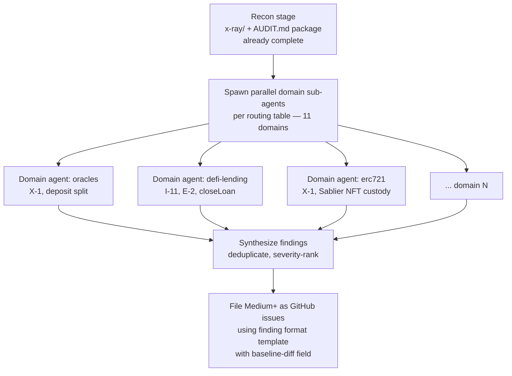

# AI Auditor Methodology Overlay for OVRFLO

> This doc tells you **how** to audit OVRFLO as an AI agent. `AUDIT.md` tells you **what** the protocol is and where risk concentrates. Read this before the dependency contracts and internal model so you internalize the methodology first. The recon stage is already complete: `x-ray/` (entry-point map, invariant derivations, git forensics, test analysis) and the `AUDIT.md` package (scope snapshot, interface contracts, internal model, trust ledger, rejected findings) serve as your recon input. Start at the routing table.

---

## Conceptual lens

Three mental models from [ethskills.com/concepts](https://ethskills.com/concepts/SKILL.md) that frame how to think about OVRFLO. Each maps to a concrete OVRFLO surface and a probe direction.

| Model | OVRFLO mapping | Probe direction |
|-------|---------------|-----------------|
| **Nothing is automatic** — contracts are state machines; every transition needs a caller with incentive to pay gas | `closeLoan()` is permissionless and liveness-critical: anyone can call it because the lender benefits from drawing the remaining stream value (G-23). Oracle freshness is not rechecked per deposit (X-1), but external Pendle traders/LPs write observations continuously — OVRFLO is not the sole AMM user. A keeper bot via `prepareOracle()` is the fallback if external activity drops. | For every state transition in the system, verify someone has incentive to call it. Flag any transition that depends on an admin or an external actor with no profit motive. |
| **CROPS** — Censorship Resistance, Open Source, Privacy, Security | **Censorship resistance**: no on-chain timelock or pause; the multisig can cap a market's deposits by setting a positive deposit limit (0 = unlimited) but cannot pause claims, wraps, or unwraps. **Open source**: yes (MIT, verified). **Privacy**: all flows are public onchain. **Security**: audited (point-in-time, not ongoing). | What can the multisig do unilaterally without delay? Can they front-run a user by changing config mid-transaction? What happens if the multisig disappears — do any liveness-critical paths break? |
| **Hyperstructure test** — could this run forever with no team? | OVRFLO is a **service**, not a hyperstructure. The multisig admin can change deposit limits (I-6), APR bounds (I-4, I-5), fees, and treasury. If the multisig disappears, existing deposits, claims, wraps, unwraps, and loan servicing continue (they are permissionless or role-gated), but no new markets can be onboarded. | Identify which functions require the multisig and which are permissionless. The permissionless paths must be incentive-aligned to be liveness-safe. |

---

## Security-pattern checklist

Curated from [ethskills.com/security](https://ethskills.com/security/SKILL.md). Only patterns that apply to OVRFLO are inlined, each mapped to a concrete surface and invariant ID. Full external checklist linked for depth.

> **Out of scope — do not waste time:** Token decimals and fee-on-transfer are explicitly excluded. Only standard ERC-20 tokens with 18 decimals and exact-transfer semantics (no fee-on-transfer, no rebasing) will ever be used. The multisig validates canonical Pendle PTs at `addMarket()`. Do not raise findings about non-18-decimal tokens, fee-on-transfer tokens, or rebasing tokens — these are accepted by design and outside the protocol's threat model.

| Pattern | OVRFLO surface | Status / probe | Invariant ID |
|---------|---------------|----------------|--------------|
| **No floating point / precision** | `StreamPricing` uses PRB-Math `mulDiv`; fees and APR in basis points; obligation/price rounding is directional (floor price, ceil obligation) | Enforced: mulDiv avoids precision loss. Probe: verify multiply-before-divide in every calculation path; confirm rounding directions in `obligationForFill` favor the protocol, not the borrower. | I-3, I-5, E-2 |
| **Reentrancy (CEI)** | `OVRFLOLending` uses `nonReentrant` on all entry points. `OVRFLO` vault (`deposit`, `claim`, `wrap`, `unwrap`) does **not**. | Partial: Lending is guarded; vault is not. Probe: trace external calls in vault paths (`safeTransferFrom`, `createWithDurations`) — can a malicious PT or Sablier callback re-enter? State updates before or after external calls? | — (gap) |
| **SafeERC20** | All token transfers use `safeTransfer` / `safeTransferFrom` (OpenZeppelin SafeERC20) | Enforced. Probe: grep for raw `transfer` / `transferFrom` / `approve` calls that bypass SafeERC20. | — |
| **Oracle safety (no DEX spot)** | Uses Pendle TWAP (`getPtToSyRate`) with `twapDurationFixed` in `[15m, 30m]` (G-29). Not a DEX spot price. | TWAP is manipulation-resistant over the window. Freshness/cardinality checked at onboarding only — not revalidated per deposit (X-1). Low practical risk: external Pendle activity keeps observations fresh; keeper bot via `prepareOracle()` as fallback. Probe: flash loan manipulation across the TWAP window; extreme staleness if market becomes completely inactive. | X-1 |
| **Vault inflation** | OVRFLO is **not** ERC-4626, but `wrap()`/`unwrap()` have a reserve model: `wrappedUnderlying` tracks exact deposits (G-16 balance-delta). Donating underlying directly to the vault increases `balanceOf` but not `wrappedUnderlying`. | Donation does not inflate shares: `unwrap` is bounded by `wrappedUnderlying` (G-15), not raw balance. `sweepExcessUnderlying` removes the excess. Probe: confirm no path lets a donor inflate the claimable reserve. | I-7, E-1 |
| **Access control** | Multisig → `OVRFLOFactory` → `OVRFLO` vault (`onlyAdmin`, G-1). `OVRFLOLending` has `onlyOwner`. Two-step ownership on factory and lending. No on-chain timelock. | Enforced via ownership chain. But `setMarketDepositLimit` can lower below current deposits (I-6) and `setAprBounds` does not revalidate existing orders (I-4, I-5). Probe: what can the multisig do without delay that harms users? | I-6, I-4, I-5, G-1 |
| **MEV / sandwich** | Lending pricing is time-dependent (`block.timestamp` vs `expiryCached`). Deposit split depends on oracle rate. | Deposit is not a swap (no AMM slippage), but the `toUser`/`toStream` split depends on the TWAP rate. Probe: can a sandwich attacker manipulate the rate within a block to skew the split? | X-1 |
| **Input validation** | Guards G-5 (dust gate), G-6/G-10 (maturity gates), G-7 (deposit limit), G-8/G-9 (slippage), G-17/G-18 (APR bounds), G-19 (fee ceiling), G-20 (per-post APR) | Enforced at call sites. Probe: check for missing zero-address or zero-amount validation on admin paths (`setTreasury`, `setSeriesApproved` parameters). | various G-* |
| **Infinite approvals** | `OVRFLOLending` approves Sablier for `transferFrom` (escrow of stream NFTs). | Probe: check whether the approval to Sablier is `type(uint256).max` or scoped. If max, a Sablier vulnerability could drain escrowed NFTs. | — |

### Patterns considered but not applicable

| Pattern | Why not applicable |
|---------|-------------------|
| **Token decimals vary** | Only 18-decimal tokens will be used. The multisig validates canonical Pendle PTs at `addMarket()`. Non-18-decimal tokens are outside the threat model. |
| **Fee-on-transfer** | Only standard exact-transfer ERC-20s will be used. Fee-on-transfer and rebasing tokens are outside the threat model. `deposit()` trusts user-supplied `ptAmount` without a balance-delta check — this is accepted by design. |
| **Delegatecall** | `multicall` uses `delegatecall` to self only; no external delegatecall targets. Not a vulnerability. |
| **UUPS proxies** | No upgradeable contracts. All contracts are immutable (no proxy pattern, no initializer, no storage layout concerns). |
| **Standard ERC-4626 share inflation** | OVRFLO is not ERC-4626 (no `deposit`/`redeem`/`convertToShares`). The wrap-reserve donation angle above is the analogous surface, and it is mitigated by G-16 (balance-delta) and G-15 (reserve bound). |

---

## Standards context

Light reference to [ethskills.com/standards](https://ethskills.com/standards/SKILL.md) for live EIP awareness.

- **ERC-20**: `ovrfloToken` is a standard OpenZeppelin ERC20. PT and underlying tokens are ERC20. `mint`/`burn` are owner-restricted (vault only). Standard `transfer`/`transferFrom`/`approve` are inherited.
- **ERC-721**: Sablier Lockup Linear streams are ERC721 NFTs. `transferFrom` moves custody into/out of the Lending escrow. Eligibility checks (`StreamPricing.requireEligible`, X-1) validate stream properties at pledge time.
- **ERC-4626**: **Not used.** OVRFLO's vault uses a custom `deposit`/`claim`/`wrap`/`unwrap` model, not the 4626 `deposit`/`redeem`/`convertToShares` interface. The vault-inflation attack pattern still applies via the wrap reserve (see security-pattern table above), but the standard 4626 share-price manipulation does not because `wrap()` uses a balance-delta check (G-16) and `unwrap()` is bounded by `wrappedUnderlying` (G-15), not by `totalSupply`-to-`totalAssets` ratio.

---

## evmresearch drill-down

[evmresearch.io](https://evmresearch.io/index) is a 400+-note linked knowledge graph across seven areas. The four most relevant to OVRFLO:

- **vulnerability-patterns** — general catalog of vulnerability classes; use to cross-check the security-pattern table above.
- **exploit-analyses** — post-mortems of real exploits; focus on lending, oracle-manipulation, and NFT-custody exploits.
- **economic-security** — economic attack vectors; directly relevant to the self-repaying-loan no-liquidation design and the dual-backing solvency model.
- **protocol-mechanics** — how lending and vault protocols work; use to validate assumptions about Pendle PT behavior and Sablier stream mechanics.

---

## Multi-agent audit pipeline

Prescribed by [ethskills.com/audit](https://ethskills.com/audit/SKILL.md). Adapted for OVRFLO below.

1. **Recon** — already complete. The `x-ray/` package (entry-point map, invariant derivations, git forensics, test analysis) and the `AUDIT.md` package (scope snapshot, interface contracts, internal model, trust ledger, rejected findings) are your recon input. Do not re-derive what is already documented.
2. **Spawn** — dispatch one sub-agent per applicable domain from the routing table below (11 domains). Each agent receives its OVRFLO focus and the invariant/entry-point IDs to hand it. Each agent walks its ethskills checklist against the OVRFLO source.
3. **Synthesize** — collect findings from all agents. Deduplicate across domains (the same invariant may be probed by multiple agents). Severity-rank using the definitions below.
4. **File** — file Medium-and-above findings as GitHub issues using the finding-format template. Include the baseline-diff field.

**Single-process fallback**: if your runtime cannot spawn parallel sub-agents, walk the routing table as a linear checklist. The 11 domains are ordered by priority (oracles and lending first, governance last).

---

## OVRFLO domain routing table

19 specialized audit domains from [ethskills.com/audit](https://ethskills.com/audit/SKILL.md). 11 apply to OVRFLO; 8 are excluded.

### Applicable domains — spawn one sub-agent each

| Domain | OVRFLO focus | Invariant / entry-point IDs to hand |
|--------|-------------|-------------------------------------|
| `evm-audit-general` | Overall code quality, event emission, error handling, state-machine completeness | All 45 entry points; I-9, I-11, I-13, I-17 |
| `evm-audit-precision-math` | `StreamPricing` mulDiv, rounding direction in `obligationForFill` and `grossPrice`, basis-point math, `MIN_PT_AMOUNT` | I-3, I-5, E-2; G-17, G-18, G-19, G-20 |
| `evm-audit-erc20` | `ovrfloToken` mint/burn, PT transfers, SafeERC20 usage, `sweepExcess` correctness | I-1, I-7; G-11, G-16, G-15 |
| `evm-audit-defi-lending` | Self-repaying loans, no health check, no liquidation, `createBorrowerLoanPool`/`repayLoan`/`closeLoan` lifecycle, `outstanding` relation | I-11, I-13, E-2; G-24, G-23; `closeLoan()`, `claimLoanPoolShare()`, `repayLoan()` |
| `evm-audit-erc4626` | Vault-inflation via wrap-reserve donation (not standard 4626), `wrap()`/`unwrap()` reserve model, `sweepExcessUnderlying` | I-7, E-1; G-16, G-15; `wrap()`, `unwrap()`, `sweepExcessUnderlying()` |
| `evm-audit-oracles` | Pendle TWAP freshness, flash loan manipulation, `getPtToSyRate` consumption, `twapDurationFixed` bounds, deposit split skewing | X-1; G-29; G-6, G-7, G-8, G-9; `deposit()` |
| `evm-audit-erc721` | Sablier stream NFT custody, `transferFrom` escrow, `requireEligible` checks, NFT ownership through loan lifecycle | X-1; `sellStreamToLiquidity()`, `postSaleListing()`, `buyListing()`, `createBorrowerLoanPool()`, `closeLoan()` |
| `evm-audit-access-control` | Multisig → factory → vault chain, `onlyAdmin`/`onlyOwner`/`onlyOwner` gating, two-step ownership, no on-chain timelock, `setMarketDepositLimit` lowering, `setAprBounds` non-retroactivity | I-6, I-4, I-5, I-9; G-1, G-2, G-3; admin entry points |
| `evm-audit-flashloans` | Flash loan manipulation of Pendle TWAP, deposit split skewing within a single transaction, cross-market flash loan paths | X-1; `deposit()` |
| `evm-audit-dos` | Unbounded liquidity/listing/loan ID growth, dust griefing via `MIN_PT_AMOUNT`, gas limits in `multicall` loops, stale-order accumulation | I-17; G-5; `supplyLiquidity()`, `multicall()` |
| `evm-audit-governance` | Multisig + two-step ownership, no on-chain timelock/pause, admin key compromise, no vault admin migration path | I-6, I-4, I-5; `transferOwnership()`, `acceptOwnership()` |

### Excluded domains — not routed

| Domain | Reason |
|--------|--------|
| `evm-audit-defi-amm` | OVRFLO has no AMM; the Lending is an orderlending, not a liquidity pool. |
| `evm-audit-defi-staking` | No staking, liquid staking, or restaking. |
| `evm-audit-erc4337` | No account abstraction, paymasters, or session keys. |
| `evm-audit-bridges` | Mainnet only; no cross-chain interactions. |
| `evm-audit-proxies` | No upgradeable contracts; all contracts are immutable. |
| `evm-audit-signatures` | No EIP-712, permits, or off-chain signatures. |
| `evm-audit-assembly` | No inline assembly or Yul in scope. |
| `evm-audit-chain-specific` | Mainnet only; no L2-specific concerns. |

---

## Finding format

Use this template for every finding. File Medium-and-above as GitHub issues.

| Field | Description |
|-------|-------------|
| **Title** | One-line summary of the vulnerability. |
| **Severity** | `High` — funds can be stolen or permanently locked. `Medium` — funds can be lost under specific conditions, or protocol accounting can be corrupted. `Low` — state or accounting drift that does not directly cause loss but degrades protocol integrity. `Gas` — optimization that does not affect correctness. `Informational` — code quality, style, or documentation issue. |
| **Affected contract + entry point** | Contract name and function name (e.g., `OVRFLO.deposit()`). |
| **Violated invariant ID** | The `G-/I-/X-/E-` code from `x-ray/invariants.md` that this finding violates or challenges. |
| **Precondition + attack path** | What state must hold, what the attacker does step by step, and what breaks. |
| **Recommendation** | Concrete fix or mitigation. |
| **Baseline-diff** | Check `docs/audit/rejected-findings-record.md` — does this finding re-litigate a settled conclusion (H-2, M-5, L-1, M-4, audit-report I-3, I-4)? If so, reference the rejected finding and explain why this new evidence supersedes it. If not, state "No prior-review overlap." |

> **Before filing**: consult `docs/audit/rejected-findings-record.md` to avoid re-raising findings the internal review already closed. The rejected-findings record captures H-2 (Sablier v1.1 withdraw ACL), M-5 (cross-market fungibility by design), L-1 (uint128 narrowing), M-4 (oracle freshness), and audit-report I-3 (permissionless closeLoan by design) and I-4 (operational trust concentration). Token transfer assumptions (fee-on-transfer, non-18-decimal) are explicitly out of scope — do not raise findings about them. Each entry includes the reasoning that closed it — challenge the evidence, not the conclusion.
