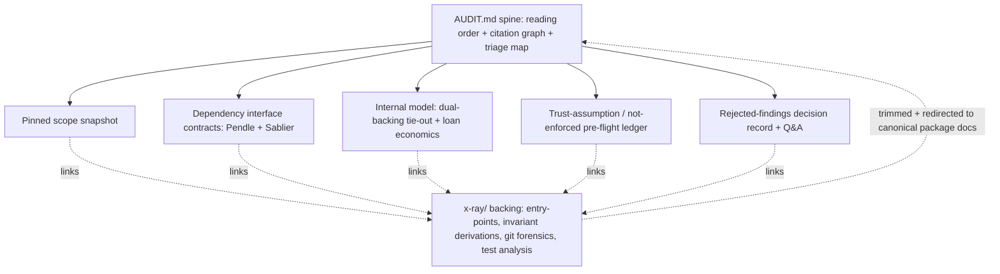

# Auditor Context Package for OVRFLO

## Summary

Build an auditor onboarding package rooted at a canonical `AUDIT.md` spine that fronts five focused companion docs: Pendle + Sablier dependency interface contracts, a trust-assumption / not-enforced-on-chain pre-flight ledger, a rejected-findings decision record + Q&A bank, a dual-backing + self-repaying-loan internal-model explainer, and a pinned scope snapshot. The package docs are canonical; overlapping `x-ray/` sections are trimmed and redirected to them. This round is the doc/content layer only; all runnable work is deferred.

## Problem Frame

The repo is already unusually audit-prepared (`README.md`, `CONCEPTS.md`, security guideline docs, and the full `x-ray/` suite), but the context an external auditor needs is scattered and unsequenced. The material the brief most emphasized, the external-protocol mental models, is the thinnest: there is no dependency-scoped explainer of Pendle or Sablier tied to what OVRFLO actually calls. Trust assumptions live across `x-ray/x-ray.md`, `x-ray/invariants.md` (X-2, X-5), and `x-ray/multi-agent-audit-report.md`; the four invariants flagged not-enforced-on-chain (I-2, I-7, X-2, X-5) are where residual risk concentrates but are buried; and there is no single entry point telling an auditor what to read in what order. An auditor today reconstructs all of this manually, and re-derives conclusions the internal review already settled (the Sablier v1.1 withdraw-ACL distinction that flipped a "High" to rejected).

## Key Decisions

- KD1. Package docs are canonical. Where a package doc overlaps an existing `x-ray/` artifact, the package doc owns the content and the x-ray section is trimmed and redirected to it. x-ray's unique analysis (entry-point map, invariant derivations, git forensics, test analysis) stays as linked backing evidence.
- KD2. Doc/content spine only this round. The runnable layer (invariants-as-properties suite, one-command fork env, committed traces, sandbox) is a separate follow-up.
- KD3. Rooted at `AUDIT.md`, sitting alongside `x-ray/` rather than replacing it. The package is a curated, canonical front door over a body of evidence that mostly already exists.
- KD4. The citation graph reuses the stable IDs that already exist (`G-/I-/X-/E-` codes and entry-point names) rather than inventing a new ID namespace.
- KD5. No standalone lifecycle walkthrough (deferred I7). The minimum load-bearing dynamic context, who owns the Sablier NFT at each lifecycle step and when the oracle split is computed, is folded into the dependency-contract and internal-model docs where it is needed.
- KD6. Companion docs live under a new `docs/audit/` directory; `AUDIT.md` stays at repo root as the front door. Citation-graph links use `docs/audit/...` paths and repo-root-relative links into `x-ray/`.

## Requirements

**Spine and navigation (I2)**

- R1. `AUDIT.md` is the package front door and prescribes a reading order: scope snapshot → dependency interface contracts → internal-protocol model → trust-assumption / not-enforced ledger → rejected-findings record → reproduction notes.
- R2. `AUDIT.md` carries a citation graph that links every package section and the backing `x-ray/` artifacts by their existing stable IDs and entry-point names, plus a scope-exclusion log stating what is out of scope and why (e.g. Sablier internals = bounded external, trusted at v1.1).
- R3. `AUDIT.md` includes a one-screen triage map relating the 37 entry points to their invariant IDs and the x-ray adversary ranking, flagging reentrancy-guard presence and the four not-enforced invariants so an auditor's first hour targets oracle and Book-settlement risk.

**External dependency mental models (I1)**

- R4. A Pendle interface contract scoped to exactly the calls OVRFLO makes (`getPtToSyRate`, `yieldToken`, PT 18-decimal and maturity-convergence assumptions), each as assumed property → where enforced or not (with `file:line`) → failure mode, pinned to the deployed market/oracle.
- R5. A Sablier interface contract scoped to OVRFLO's usage (`createWithDurations`, `withdrawableAmountOf`, `transferFrom`, non-cancelable + no-cliff), including the verified v1.1 withdraw ACL and how NFT ownership/recipient moves through the Book lifecycle, pinned to the deployed address and v1.1 tag.

**Security-reasoning scaffolding (I4, I5)**

- R6. A trust-assumption / pre-flight ledger consolidating every off-chain-trusted belief: the four not-enforced invariants (I-2, I-7, X-2, X-5), the bounded-external actors, and the documented trust boundaries, each framed as a line item an auditor can mark ACCEPT or CHALLENGE.
- R7. A rejected-findings decision record + Q&A bank capturing the internal review's settled conclusions (H-2 rejected via the v1.1 ACL evidence, M-5 by-design, H-1 downgraded to L-1) and the five resolved open questions, each with the reasoning that closed it, framed as evidence to challenge rather than conclusions to accept.

**Internal protocol model (I6)**

- R8. A dual-backing solvency tie-out presenting one fungible `ovrfloToken` as backed by two separately-accounted pools (PT claims via `marketTotalDeposited`, wrap reserve via `wrappedUnderlying`) as conservation identities (I-1, I-3, E-3) an auditor can tie out against on-chain state, framed insolvency-first.
- R9. A self-repaying-loan economics explainer covering why there is no health check or liquidation; the `outstanding = obligation − (drawn + repaid)` relation; and why permissionless `closeLoan()` is liveness, not exploit.

**Reproduction and scope (scope snapshot, docs-only slice of I3)**

- R10. A pinned scope snapshot document: in-scope commit and file paths, excluded paths, code-freeze declaration, deployed Sablier and Pendle market/oracle addresses, and `lib/` submodule commits. Document only this round; environment automation and runnable coverage are deferred.

**x-ray reconciliation**

- R11. Overlapping `x-ray/` sections (the X-2/X-5 trust framing in `x-ray/invariants.md`, the rejected-findings and ACL content in `x-ray/multi-agent-audit-report.md`) are edited in place to point forward at the canonical package docs, with no duplicated source of truth remaining.

## Key Flow

- F1. Auditor cold-start
  - **Trigger:** An external auditor opens the repo for the first time.
  - **Steps:** Open `AUDIT.md` → confirm scope from the pinned snapshot → read the Pendle and Sablier interface contracts → read the dual-backing / loan-economics model → start attack work from the not-enforced pre-flight ledger and triage map → consult the rejected-findings record before raising a finding → follow citation links into `x-ray/` for derivations.
  - **Outcome:** The auditor knows what the protocol assumes, what to attack first, and what has already been settled, without reconstructing it from scattered docs.
  - **Covered by:** R1, R2, R3, R4, R5, R6, R7, R8, R9, R10.

## Diagram

## Scope Boundaries

**Deferred for later**

- The runnable layer: invariants-as-properties Foundry/Halmos suite, one-command fork environment resolving the `MAINNET_RPC_URL` friction, and committed annotated lifecycle traces / interactive sandbox.
- A standalone lifecycle walkthrough document (I7); only minimal dynamic context is folded into R4/R5/R8 this round (see KD5).

**Outside this package's identity**

- No new protocol features or contract code changes; this packages existing context only.
- The ideation candidates already rejected: a machine-readable index for an AI auditor agent, subsystem-partitioned packs, threat-model-as-code tooling, and an adversarial economic simulation lab.

## Dependencies / Assumptions

- Builds on existing artifacts: `README.md`, `CONCEPTS.md`, `BASE_SECURITY.md`, `4626_SECURITY.md`, and the `x-ray/` suite.
- Pinned dependency facts (Sablier V2 Lockup Linear v1.1 at `0xAFb979d9afAd1aD27C5eFf4E27226E3AB9e5dCC9`) are sourced from the verified `x-ray/multi-agent-audit-report.md`; the snapshot must re-confirm them against the audited commit.
- Editing `x-ray/` artifacts in place (not just adding new files) is accepted per KD1/R11.
- `AUDIT.md` lives at repo root; companion docs live under `docs/audit/` (KD6).

## Outstanding Questions

**Deferred to planning**

- The exact citation-anchor mechanism (heading anchors vs explicit ID tags) for the cross-document graph.
- The rendering format of the one-screen triage map (table vs diagram) and whether it lives inline in `AUDIT.md` or as a linked figure.

## Success Criteria

- An auditor can reach "I know what the protocol assumes, what to attack first, and how scope is pinned" from `AUDIT.md` and its linked docs alone, without reconstructing context from scattered sources.
- Settled items (H-2, M-5) are not re-derived during the engagement because the decision record pre-empts them.
- No package doc and `x-ray/` artifact assert the same fact as two independent sources of truth.
- Each companion doc reads standalone while the spine sequences them into one path.
