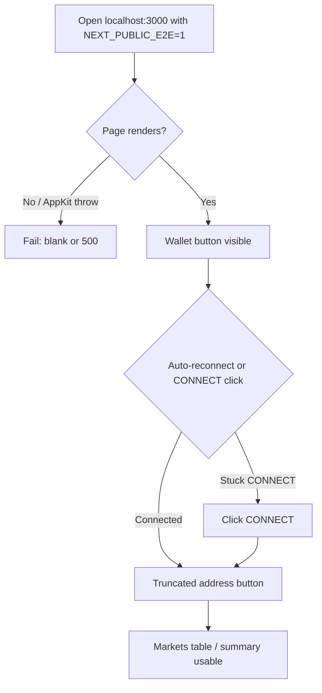
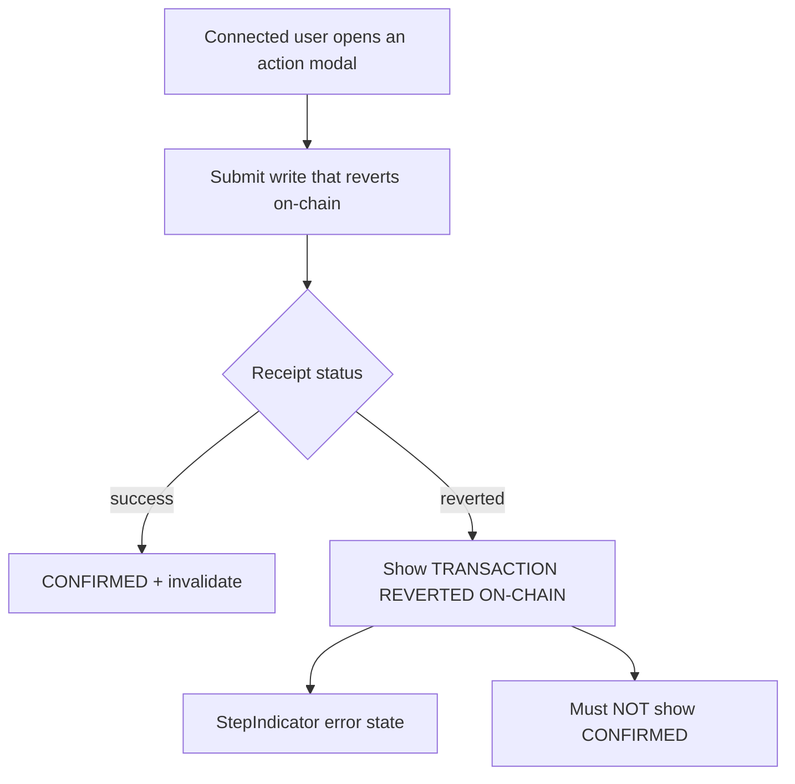
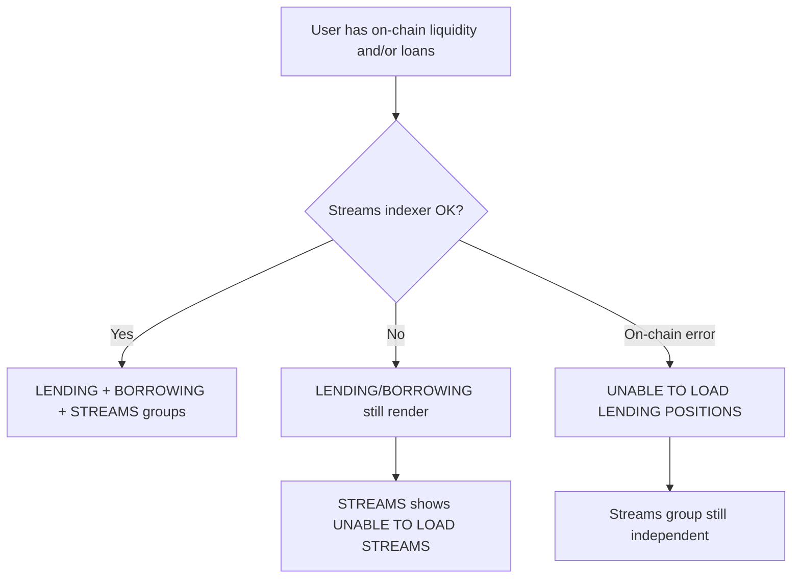
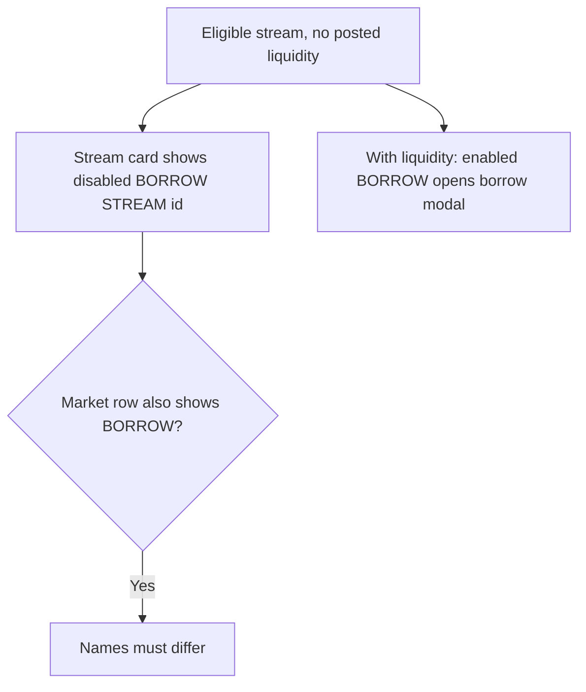
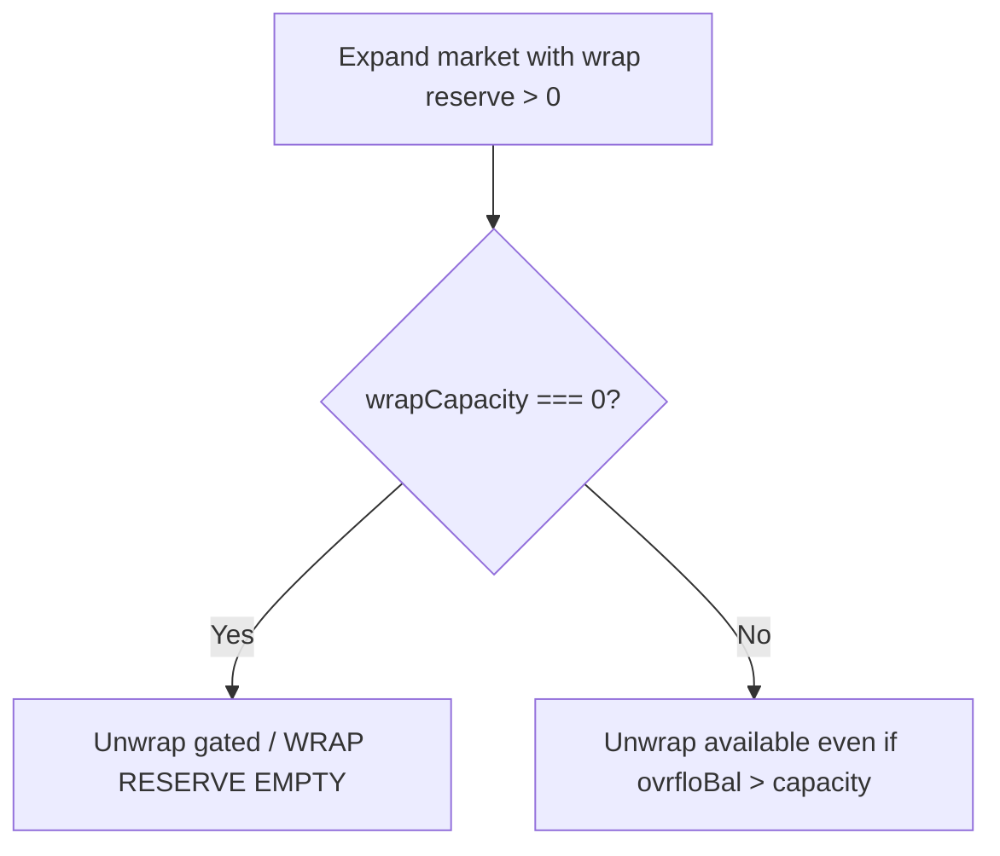
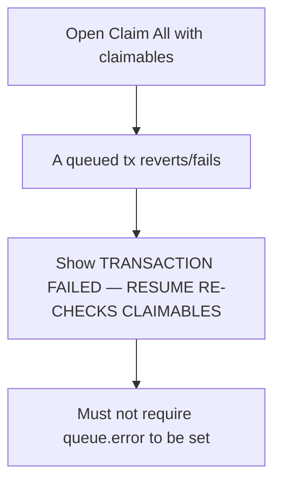
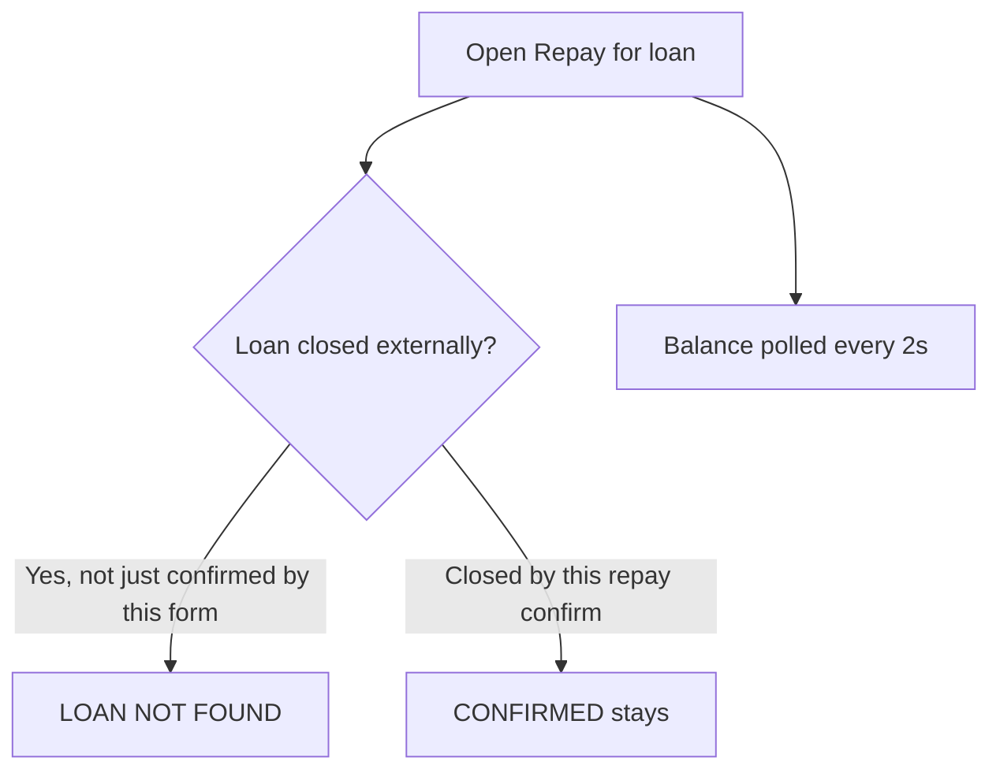

# Dogfood Report — c1024d9

> Diff-scoped browser QA of commit `c1024d9` (`c1024d9^..c1024d9`) on `main`. Generated by `/ce-dogfood` on 2026-07-28.
>
> Note: invoked with a commit SHA (not a feature branch). Scope is the user-visible delta in that commit vs its parent `f981db2`, exercised at current `HEAD` (later `4c0d2b6` is docs/harness-only and does not change product UI). Environment: `bootstrap:e2e` (Anvil + seed + Ponder + `NEXT_PUBLIC_E2E=1` Next on `:3000`).

## Diff Summary

- **On-chain revert UX:** `useWriteFlow` / `useTxQueue` distinguish receipt fetch success from tx status; ActionModal / ClaimAllModal show revert/failure instead of falsely confirming.
- **E2E wallet split:** `WalletButton` avoids mounting `useAppKit` under `NEXT_PUBLIC_E2E=1`; wagmi E2E config sets `ssr: true` to stop CONNECT hydration mismatch.
- **Position list degrade:** streams (Ponder) errors no longer blank the whole list; on-chain lending/borrowing can still render with a streams-specific error.
- **Stream borrow a11y:** disabled no-liquidity stream action renamed to `BORROW STREAM {id}` so it doesn’t collide with market-row `BORROW`.
- **Unwrap gate:** `wrapReserveShort` only when wrap capacity is zero (not when capacity &lt; ovrflo balance).
- **Repay resilience:** poll ovrflo balance + borrower loans; treat externally closed loans as `LOAN NOT FOUND` without flashing that after a successful repay.

## Personas

Inferred (no `STRATEGY.md` / `VISION.md` / persona docs) from OVRFLO product + CONCEPTS.md:

- **Yield cyclist (depositor)** — deposits PT, holds stream + ovrfloToken, unwraps/claims; cares that unwrap isn’t falsely gated and reverts aren’t shown as success.
- **Liquidity lender** — supplies/withdraws/adjusts rate, claims pool shares / claim-all; cares that positions stay visible if the indexer hiccups and failed claim-all steps are honest.
- **Stream borrower** — borrows against a stream, repays/closes; cares about clear borrow CTAs and repay not lying about closed loans or reverts.

## Flows Tested

### F1 — E2E wallet connect / page boot

### F2 — Action modal on-chain revert

### F3 — Position list partial degrade

### F4 — Stream borrow accessible name

### F5 — Unwrap gate

### F6 — Claim-all failure messaging

### F7 — Repay closed-loan handling

## Test Matrix & Results

| # | Flow | Journey / Scenario | Status | Issue | Fix | Commit |
|---|------|--------------------|--------|-------|-----|--------|
| 1 | F1 | E2E boot: markets page loads without AppKit crash | Pass | - | - | - |
| 2 | F1 | Wallet shows connected address (auto or CONNECT) | Pass | Auto-connected as `0x7099…79C8` | - | - |
| 3 | F1 | Disconnect then CONNECT reconnects mock wallet | Pass | - | - | - |
| 4 | F5 | Unwrap not falsely gated when wrap reserve > 0 but bal > capacity | Pass | After wrap 0.1 with bal ~0.90, `UNWRAP` enabled (old gate would show WRAP RESERVE EMPTY) | - | - |
| 5 | F4 | Stream card no-liquidity: `BORROW STREAM #23049` vs market-row `BORROW` | Pass | Distinct accessible names observed | - | - |
| 6 | F3 | Happy path: STREAMS render without blanket UNABLE TO LOAD POSITIONS | Pass | STREAM #23049 + NO LIQUIDITY caption | - | - |
| 7 | F2 | On-chain revert shows TRANSACTION REVERTED ON-CHAIN (not CONFIRMED) | Pass | Live revert not induced (UI preflight gates common paths); `useWriteFlow`/`useTxQueue` unit tests assert `isReverted` vs `isConfirmed` | - | - |
| 8 | F6 | Claim-all failed step shows TRANSACTION FAILED banner | Blocked (needs human verify) | Needs a mid-queue on-chain revert / drained claimable arrange | - | - |
| 9 | F7 | Externally closed loan in Repay → LOAN NOT FOUND | Blocked (needs human verify) | Needs an open loan then external close while modal mounted | - | - |
| 10 | F1 | Desktop + mobile viewport: wallet + markets layout intact | Pass | 390×844 still shows wallet, markets, expanded detail actions | - | - |
| 11 | Cross | Console clean on boot + market expand | Pass | `agent-browser errors` empty (Lit/HMR/React DevTools noise only) | - | - |

## What Was Fixed

None — no product regressions found that warranted an autonomous code fix in this commit’s scope.

## Paper Cuts (by persona)

- **Yield cyclist** — Deposit path can stick on `APPROVE wstETH` after a successful exact-fee approve when the live fee quote drifts above the approved amount by a few wei (observed: step showed CONFIRMED but button remained `APPROVE wstETH` until a cast `approve(max)`). Severity: medium. Deferred — adjacent to convert approval design, not introduced by `c1024d9`; fixing means MaxUint vs buffer vs requote product choice.
- **Stream borrower** — Market-row `BORROW` enables once a stream exists even with `NO LIQUIDITY` on the stream card; borrower may open a borrow modal that can’t fill. Severity: low. Deferred — pre-existing UX, not this commit’s change (commit correctly renamed the stream-card control).

## Console Errors

None from the app. Dev-only: Lit dev-mode warning, React DevTools hint, Next HMR logs.

## Human Verifications

- Production AppKit CONNECT modal (non-E2E) — not exercised; E2E mock path verified instead.
- Matrix #8 (claim-all failure banner) — needs arranged mid-queue revert.
- Matrix #9 (repay externally closed loan) — needs arranged counterparty close while modal open.

## Decisions for a Human

### Exact-fee wstETH approve can strand deposit on APPROVE wstETH
- **What's broken:** After `APPROVE wstETH` mines successfully for the then-current `feeAmount`, a slightly higher re-quoted fee leaves `needsUnderlyingApproval` true again; UI stays on approve instead of DEPOSIT.
- **Why escalated:** Fix options change product/wallet UX (infinite approve vs fee buffer vs freeze quote) — not a safe one-line autonomous fix.
- **Options:** (A) approve `type(uint256).max` for fee token on deposit; (B) approve `fee * buffer`; (C) freeze fee at first quote and pass that into deposit.
- **Recommendation:** Prefer (A) for E2E/dev friction and common ERC-20 UX, unless treasury/policy wants exact allowances.

## Learnings

- Dogfooding OVRFLO UI meaningfully requires `bootstrap:e2e` (mock wallet + seeded fork); plain `npm run dev` cannot exercise write-path changes from this commit.
- `agent-browser` needs a writable `~/.agent-browser` (sandbox blocks it); run outside the sandbox.
- Commit-scoped dogfood on trunk is viable when later commits are non-UI; matrix should still be limited to the commit’s delta, not whole-app exploration.
- Live on-chain revert UX is hard to hit in-browser because Convert/forms preflight the common failure modes — unit tests remain the primary regression net for `isReverted`.

## Final Status

**Ready for the `c1024d9` UI delta**, with two blocked human-verify legs (#8 claim-all failure banner, #9 external repay close) and one deferred paper-cut (exact-fee approve drift).

Automated suite: `npm --prefix web run test` — **37 files / 313 tests passed**. Targeted write-flow/tx-queue/position-cards tests included.
