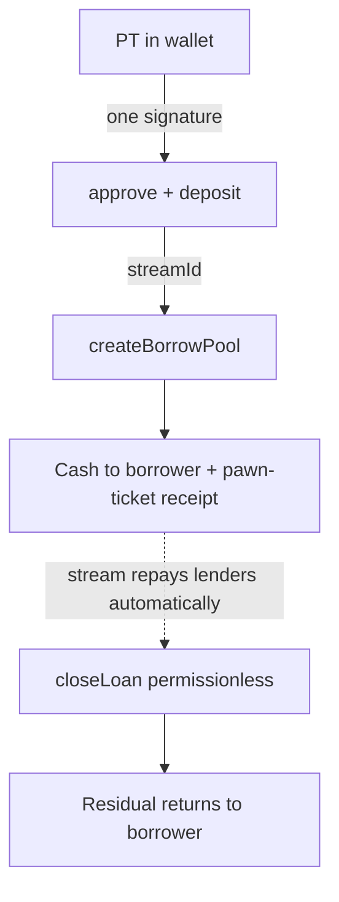

# Ideation: OVRFLO Landing Page and Lending Frontend

## Grounding Context

**Codebase Context.** The frontend must drive: vault `deposit(market, ptAmount, minToUser)` (PT approve + underlying approve for fee) returning `(toUser, toStream, streamId)`; Book `createBorrowPool(offerIds[], streamId, targetBorrow, minAcceptable)` as the only lending mechanism, with `offerIds` assembled via `gatherOfferCapacities`; `postOffer(market, aprBps, capacity)` for lenders (consumable as sale or loan); the sole claim channel `claimPoolShare` (cumulative-recovered pro-rata via `_claimFair`, harvests deficit from open loan streams); sale-side `sellIntoOffer` / `postSaleListing` / `buyListing`; `quote()` returning `(grossPrice, obligation, fee, netToBorrower, residual)`. Key verified constraint: offer aggregation is exact-`aprBps` only (`src/OVRFLOBook.sol:826`, `:868`). Book views revert on non-existent IDs and contracts expose no per-user enumeration, so the Envio indexer (`tools/envio`) is the mandatory discovery surface (critical pattern #1). `closeLoan` is permissionless once covered. Sablier `withdrawMax` is payable. OVRFLOBook is `Multicall`. Existing `web/` (Next.js 16 / React 19 / Tailwind 4 / wagmi 2 / viem 2) is being discarded as UI but its infra (Envio query, hooks, tx-error mapping, local seeding) is reusable; no OVRFLOBook ABI exists yet. Brand: navy `#0b1221`, cyan `#5dc0f5`, IBM Plex Mono numerics, neo-brutalist hard shadows, logo `web/public/brand/overflow-mark.png`.

**External context.** Alchemix (canonical self-repaying prior art): one-sentence-mechanism hero, live counters, one diagram per concept. NFTfi: negative-risk framing ("no auto-liquidations!"). Pendle app: market-list idiom, Simple/Pro toggle; OVRFLO's audience arrives from Pendle holding PTs. Morpho/Euler era: lender side is a "deposit and forget" surface. EIP-7702 live since Pectra (5/2025): batch approve+deposit+borrow in one signature. LI.FI widget for any-token zaps. Analogies: Pipe revenue-advance slider, pawnbroking, bearer-bond coupons, LendingClub/Airbnb role-split entries. User-supplied design references (paper.design shaders, typeui doodle, refero GIC/Hyperstudio) signal editorial, type-led, restrained taste.

**Infrastructure prerequisites (adopt regardless of chosen direction):** extend the Envio indexer with Book entities (Offer, Loan, Pool, PoolContribution, Listing) before any screen; generate the Book ABI + hooks from Foundry artifacts instead of hand-writing `uint16`/`uint128` literals; make all position reads indexer-first and revert-safe (Book views revert on unknown IDs); carry forward ModalErrorBoundary, tested `.env.example`, and graceful USD-price degradation.

## Topic Axes

1. landing-narrative — communicating the self-repaying-loan USP
2. borrower-flow — stream-collateral creation, offer assembly, repay/close
3. lender-flow — offers, claim channels, buying listings
4. positions — display + management of streams/loans/pools/offers
5. visual-system — brand evolution, aesthetic direction

---

## Ranked Ideas

### 1. The Advance: one-signature borrow where collateral is a byproduct

**Description:** The borrower's primary surface is not a deposit form plus a borrow form — it is a single "Advance" action: pick underlying, pick series, drag a Pipe-style slider from "PT in wallet" to "cash now". Behind it, the UI chains approve → `deposit()` → wire the returned `streamId` into `createBorrowPool()` as one EIP-7702 batch (fallback: a stepper with per-step status for legacy wallets; Book-side calls batch via `Multicall` regardless). Stream creation is never a step the user performs — it is a line item on the pawn-ticket receipt shown before signing: what was pledged (stream), what you got (`netToBorrower`), what it costs (`obligation` + fee + ETH stream fee), when it self-redeems, and the `residual` that comes back. The receipt is a reusable `QuoteCard` component rendering `quote()`'s five fields, reused on position detail and the landing widget.

**Axis:** borrower-flow
**Basis:** direct: `deposit(...) returns (uint256 toUser, uint256 toStream, uint256 streamId)` (`src/OVRFLO.sol:372`) chains directly into `createBorrowPool(..., uint256 streamId, ...)` (`src/OVRFLOBook.sol:550`); `contract OVRFLOBook is Ownable2Step, ReentrancyGuard, Multicall` (`src/OVRFLOBook.sol:25`); external: EIP-7702 live since Pectra 5/2025.
**Rationale:** This is the literal fulfillment of "collateral creation should be one button press", taken to its logical limit — the whole loan is one button, and collateral is an implementation detail. It collapses the protocol's biggest onboarding cliff (deposit-then-borrow as two mental models) into the one gesture Pendle PT holders arrive wanting: advance my fixed yield.
**Downsides:** EIP-7702 batching needs a wallet-capability detection layer and a well-tested stepper fallback; the itemized receipt must surface the second (underlying-fee) approval and payable Sablier fee honestly or the "one button" promise reads as hiding costs.
**Confidence:** 90%
**Complexity:** Medium

### 2. Live rate ladder: the order book as an executable depth curve

**Description:** Offer matching is exact-rate only — a borrower who free-types an APR that no lender posted gets a revert or an under-filled pool. Replace the rate input everywhere with a live ladder/curve scanned from the book: each rung shows a posted rate and aggregate fillable capacity ("450 bps — 12.4k available"), the UI pre-selects the cheapest rung covering `targetBorrow`, and the rung's `offerIds` feed straight into `createBorrowPool`. The same data hook powers three surfaces: the borrower slider (snaps to real depth), lender placement guidance ("post at 7.2% to be first in line"), and the landing page's live proof-of-liquidity number. At scale, discovery runs indexer-first with `gatherOfferCapacities`'s `startId` cursor as the trust-minimized verifier at submit time.

**Axis:** borrower-flow (payoffs on lender-flow and landing-narrative)
**Basis:** direct: `if (offer.active && offer.market == market && offer.aprBps == aprBps && offer.capacity > 0)` (`src/OVRFLOBook.sol:826`) and `require(offer.aprBps == aprBps, "OVRFLOBook: apr mismatch")` (`:868`) — capacity only aggregates at an exact rate; `gatherOfferCapacities(market, aprBps, targetAmount, startId)` (`:809`).
**Rationale:** This is the single sharpest contract-imposed UX cliff in the product. Without the ladder, the main event (creating a position) fails silently for anyone who does not already know the book's rate distribution. It also shapes market microstructure: focal rates concentrate liquidity, which improves fill rates for everyone.
**Downsides:** Sweeping the APR axis client-side is chatty — needs the indexer to materialize depth (prerequisite work); a thin early book makes the ladder look sparse, so the empty state needs design attention.
**Confidence:** 95%
**Complexity:** Medium

### 3. Positions are self-advancing bars, and the default state is "nothing to do"

**Description:** Answer both open questions ("how to display positions? how to manage them?") with one grammar. Display: every position renders as the same horizontal fill bar — streamed-vs-total for streams, recovered-vs-obligation for loans, claimed-vs-share for pool contributions, consumed-vs-capacity for offers. The loan bar advances by itself, which is the USP made visible; an optional bond-certificate skin (coupon stubs clipping as the stream draws, `streamId`/`loanId` as the mono serial number) gives it an identity no competitor has. Management: the default card state is an autopilot readout — "Self-repaying: 64% covered · closes itself ~Aug 14 · nothing to do" — computed from `drawn + repaid` vs `obligation`. The only controls are overrides: "Repay early" (`repayLoan`) and, once covered, a "Close now" button anyone can press (surface the permissionlessness: "even we can close it for you"). A full bar is a button.

**Axis:** positions
**Basis:** direct: claimable math `contribution * (drawn + repaid) / totalContributed - poolReceived` (`src/OVRFLOBook.sol:657-658`) gives every bar a truthful on-chain numerator; `closeLoan` is permissionless once covered; external: NFT-lending position UX ("stream progress bar can BE the thumbnail") + autonomous-device status language (Roomba/autopilot).
**Rationale:** Most lending UIs are health-factor anxiety machines; OVRFLO contractually cannot produce that anxiety, and a conventional dashboard would import it visually anyway. "Nothing to do" as the default state is the USP restated as interface, and the self-advancing bar is a screenshot that markets the protocol.
**Downsides:** Four data sources behind one visual grammar demands the Book indexer schema up front; the bond-certificate skin risks kitsch if overdone — treat it as a skin decision, not a commitment.
**Confidence:** 85%
**Complexity:** Medium

### 4. Rate-sheet lender surface: post an amount, claim everything with one button

**Description:** The default lender never sees the words "pool", "channel", or a `uint128` amount field. Entry: type an amount; the UI reads book depth and proposes a rate (or a 2-3 rate split posted atomically via `Multicall`), framed as an annuity desk's rate sheet — "publish your rate, capital works while you sleep." Exit: a single shelf showing total deployed and total claimable across all pools, with one "Claim all" that precomputes each pool's claimable using the contract's own fairness formula and multicalls `claimPoolShare`. The order-book view and manual rate entry live behind a Pro toggle (Pendle's idiom). The c5de575 pro-rata fix is the unlock that makes this honest: claim timing no longer matters strategically, so a passive surface is now contractually truthful.

**Axis:** lender-flow
**Basis:** direct: `postOffer(address market, uint16 aprBps, uint128 capacity)` (`src/OVRFLOBook.sol:323`); both claim channels share `_claimFair` (`:651`); commit c5de575 replaced FCFS with cumulative-recovered pro-rata; `Multicall` at `:25`; external: Morpho/Euler-era deposit-and-forget lender surfaces.
**Rationale:** The two claim channels and raw-amount claims are the most confusing part of the protocol — asking a lender to choose between two functions and type a `uint128` is where trust dies. Auto-suggested rates also concentrate liquidity at focal rungs, feeding idea 2.
**Downsides:** Rate suggestion is an opinionated market intervention — a bad heuristic misprices lenders; the split between "simple shelf" and "Pro book" doubles the lender surface to design and test.
**Confidence:** 85%
**Complexity:** Medium

### 5. Personalized live landing: the hero computes your number

**Description:** The audience is unusually knowable — PT holders arriving from Pendle. So the hero does not describe OVRFLO; it answers the visitor. One input (connect wallet or paste an address) and the page responds with real reads: "You hold PT-wstETH June-27. Borrow up to X today, repaid by your own yield by maturity." Visitors without PTs get the zap path as their CTA. Below: one sentence ("Fixed Yield Is Now Collateral" survives), one animated diagram — a cyan stream (paper.design waves shader) visibly draining a debt figure to zero with the residual arrow returning — three struck-through risk words (~~liquidations~~ ~~health factor~~ ~~margin calls~~), live book depth from idea 2's hook, and docs links. Every number on the page is a real on-chain read; the current fake dashboard widget is replaced by the app's actual QuoteCard running `previewDeposit`/`quote`.

**Axis:** landing-narrative
**Basis:** direct: `previewDeposit` (`src/OVRFLO.sol:575`) and `quote` (`src/OVRFLOBook.sol:698`) make the personalized number computable read-only, no signature; external: Alchemix hero grammar (one sentence + numbers + one diagram), NFTfi negative-risk framing, Airbnb dual-path hero.
**Rationale:** "Here is your number" is the strongest message this protocol can send — no explanation of self-repaying loans lands harder than one computed about your own wallet. It satisfies "explain but do not over-explain" by making the explanation about the visitor, and live reads are brand-consistent with a deterministic-math lending protocol.
**Downsides:** Needs mainnet RPC reads on a marketing page (rate-limit and latency budget); a pre-liquidity launch shows small numbers — the empty-book state needs a story; address-paste has privacy optics to handle gracefully.
**Confidence:** 75%
**Complexity:** Medium

### 6. Keep the palette, change the register: editorial app, mono as on-chain truth

**Description:** What the brand actually protects is navy `#0b1221` + cyan `#5dc0f5` + Plex Mono numerics (they align with the logo) — the hard-black-shadow neo-brutalism is a costume, and it conflicts with the editorial restraint your own references (Hyperstudio, GIC) signal. Rebuild on the Hyperstudio grammar mapped onto the existing palette: weight-400 oversized headlines, hairline dividers (`#1a2740` on navy), one cyan pill CTA, no shadows in the app. Two refinements: (a) two registers — the landing may keep louder brutalist punctuation; the app, where users read five-figure positions, stays quiet; (b) a rendering rule with teeth — IBM Plex Mono is reserved exclusively for values that came from a `view` call or the indexer, so typography itself tells users "this is on-chain truth" (optionally with provenance on hover). Add two semantic token families (`--rail-borrow` cyan, `--rail-lend` counterpoint) so role orientation is ambient on every card and CTA. Ship as Tailwind v4 `@theme` tokens consumed identically by landing and app.

**Axis:** visual-system
**Basis:** direct: user constraint "keep color scheme (aligns with logo) unless a better representation" — color, not shadow language, is the stated invariant; existing tokens in `web/app/globals.css`; external: refero Hyperstudio system (editorial-tech on near-black, weight-400 headlines, hairline dividers) maps nearly 1:1 onto the navy palette.
**Rationale:** A no-liquidation protocol should feel calm and inevitable; hard shadows shout. The mono-equals-truth rule gives users an honest visual contract and resolves the tension inside your own reference set without a rebrand.
**Downsides:** Two registers risk drift without discipline (one token file, two elevation scales); "better representation" is a taste call you should ratify against real mockups before committing.
**Confidence:** 80%
**Complexity:** Low

### 7. Verbs on objects, not role doors

**Description:** The A/B role split (Borrower/Seller vs Lender/Buyer) survives as landing copy, not as app architecture. In the app, the user picks an object — a market, a stream they own, a listing — and the UI presents the verbs that object affords: a stream affords "borrow against / sell / withdraw" (with a one-screen comparison from a single `quote()` call: "worth X as a sale, nets Y as a loan"); a market affords "advance / post offer / buy listings". This matches the contracts, which are object-centric: the same stream object feeds both `createBorrowPool` and `sellIntoOffer`, and the same offer liquidity is consumable as sale or loan.

**Axis:** borrower-flow (restructures both flows)
**Basis:** direct: `createBorrowPool(offerIds, streamId, ...)` (`src/OVRFLOBook.sol:550`) and `sellIntoOffer(offerId, streamId, minNetOut)` take the same stream object; offers are dual-consumable by design; reasoned: real users are both roles across time (depositor → borrower → post-close lender), so role-gated navigation forces mode-switching the data model never required.
**Rationale:** The sell-vs-borrow decision is the most valuable comparison the app can offer a stream holder, and it is only possible on one screen if navigation is object-first. Role doors would bury it.
**Downsides:** Directly softens the A/B framing in your spec (kept as onboarding, dropped as architecture) — deliberate deviation to ratify; object-first IA is less familiar than role tabs and needs careful empty states for users who arrive owning nothing.
**Confidence:** 70%
**Complexity:** High

---

## Rejection Summary

| # | Idea | Reason Rejected |
|---|------|-----------------|
| 1 | Itemized cost receipt before every signature | Merged into #1 (the pawn-ticket receipt is the Advance's confirmation surface) |
| 2 | QuoteCard as single design primitive | Merged into #1 (receipt) and #5 (landing widget); strong, but a component decision inside larger directions |
| 3 | One claim button, two channels hidden | Merged into #4 (Claim all) |
| 4 | Auto-laddered deposit-and-forget offers | Merged into #4 (rate suggestion) |
| 5 | Landing hero as annotated loan receipt / zero-text animated ledger / live simulator | Three variants merged into #5's hero (personalized number + one animated diagram) |
| 6 | Landing IS the order book / no-mocks provenance rule | Merged into #5 (live reads) and #6 (mono-equals-truth) |
| 7 | Invoice-factoring "advance on yield you already earned" language | Copy direction absorbed into #1/#5 naming ("Advance"); not a standalone build direction |
| 8 | Coupon-bond certificate card / Roomba autopilot / postcards rail / loans finish themselves | Merged into #3 (skin + management language) |
| 9 | Split brand registers / rail tokens | Merged into #6 |
| 10 | Pawnshop one-button flow / wizard-mirrors-intent / shared prerequisite state machine | Merged into #1 (same move from three frames) |
| 11 | LI.FI zap any-token → offer | Kept as a component of #1/#5's "lacks underlying" branch, not a direction on its own |
| 12 | Departure-board series selection (split-flap maturity board) | Charming skin on series selection; below direction-level — revisit inside a brainstorm of #6 |
| 13 | One-screen app with a two-sided drag slider | Demo-worthy but risky as the sole architecture; its slider gesture is absorbed by #1, its ledger layout competes with #7 |
| 14 | Revert-safe indexer-first positions / Book indexer schema first / ABI codegen | Reclassified as infrastructure prerequisites (see Grounding Context) — necessary under every direction, so not ranked as directions |

Process note: the independent basis-verification pass was skipped at the user's token-economy request; all `direct:` bases were verified by the generating agents' targeted repo reads instead.
