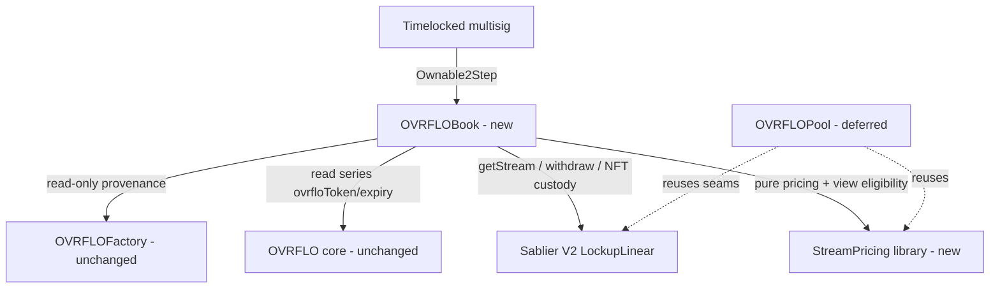
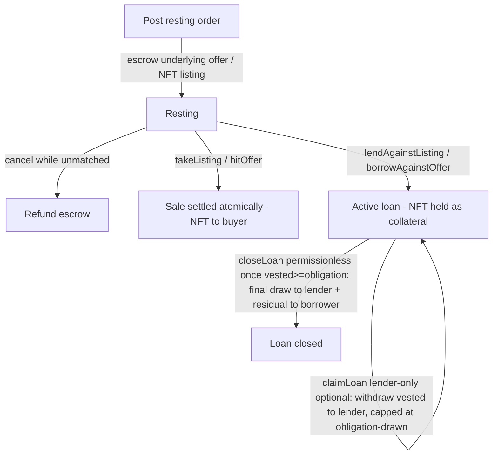

# feat: OVRFLO Secondary Market — Book (sale + loan)

## Summary

Build `OVRFLOBook` — a standalone, fully on-chain, two-sided order market that lets
holders of OVRFLO yield streams (Sablier streams paying `ovrfloToken`, where
1 OVRFLO = 1 unit of the series underlying) get the underlying now, and lets capital
providers earn a fixed return by buying streams outright (**sale**) or lending against
them (**loan**). Both verbs share one priced primitive, a per-order APR validated
against admin-set `[aprMinBps, aprMaxBps]` bounds, and read-only OVRFLO-core/Sablier
provenance. No change to `src/OVRFLO.sol` or `src/OVRFLOFactory.sol`. The Pool (§3 of
the origin) is deferred; this plan only preserves the seams it will attach to later.

---

## Problem Frame

OVRFLO mints holders an immediate `ovrfloToken` payout plus a Sablier stream that vests
the remaining discount until PT maturity. Today that streamed discount is illiquid until
it vests. The secondary market makes it liquid two ways: a holder can sell the stream for
a discounted lump of underlying, or borrow against it over-collateralized. Because the
streams are deterministic and non-cancelable, the loan needs no liquidation machinery —
the lender draws a fixed obligation and the residual returns to the borrower.

The two source specs conflicted on loan semantics, settlement, and provenance; the origin
document reconciled them into two verbs (sale, loan) over a single loan core, with the
sale expressed as the limiting case of a loan where `borrowAmount == grossPrice`. This plan
implements that reconciled model for the book only.

---

## Scope Boundaries

**In scope (the book, active build):**
- Sale path (offers + listings) and loan path (lend offers + borrow listings).
- Shared `StreamPricing` primitive: pure pricing + view eligibility/provenance.
- Per-order APR with `setAprBounds`, launch-locked to 10% (`1000/1000`), plus an
  immutable `APR_MAX_CEILING`.
- `Ownable2Step` admin (multisig), `multicall`, non-payable, reentrancy-guarded.
- One `OVRFLOBook` deployment bound to one OVRFLO core; series-keyed storage so multiple
  PT-wstETH maturities under that core are supported.

**Deferred to a later phase (origin §3 — captured, not built):**
- `OVRFLOPool.sol` (closed-end aggregation, lifecycle, lazy seal, pro-rata claims). The
  only obligation now is to keep the pricing/provenance/Sablier seams reusable so the pool
  attaches later with no `src/OVRFLO.sol` change and prices off the book's market APR.

**Outside this product's identity (origin §9, v2 candidates):**
- Auto-matching of crossed orders, early loan repayment, NFT/4626 wrappers over positions,
  additional underlyings beyond the registry-driven model.

---

## Key Technical Decisions

- KTD1. One Book per OVRFLO core, series-keyed storage. The book is constructed with a
  single OVRFLO core address (verified present in the factory registry) and caches that
  core's `ovrfloToken` + `underlying`. Multiple maturities (markets) under the core are
  supported by having the order poster supply the `market` and the book verify it. This
  matches "series-keyed for v2-compat," keeps one underlying per book, and keeps APR
  bounds / fee / treasury governance scoped to one core. (Confirmed with user.)

- KTD2. A sale is the limiting case of a loan (`borrowAmount == grossPrice`), but the code
  keeps two explicit verbs for clarity and custody differences (a sale transfers the NFT to
  the buyer permanently; a loan escrows it as collateral). The shared pricing functions are
  reused; only settlement/custody differ.

- KTD3. Taker-targets-a-specific-order-ID; no matching engine. Offers (capital side) and
  listings (asset side) rest; a taker brings the counter-asset and references a resting
  order ID. An order ID is an immutable commitment to its terms, so a taker racing a cancel
  reverts against a dead ID and loses only gas. Auto-matching of crossed orders is a v2
  concern (only meaningful once APR bounds widen).

- KTD4. Everything fixed at origination. `remaining = getDepositedAmount −
  getWithdrawnAmount` is read from Sablier once, at fill, to compute
  `grossPrice`/`obligation`/`fee`/`residual`. It is the total un-withdrawn locked amount (not
  the vested-only `withdrawableAmountOf`), so pre-fill withdrawals by the original recipient
  are correctly netted out. Thereafter the `Loan` object is the only source of truth — no
  re-reading the stream, no re-pricing.

- KTD5. Rounding always favors the capital provider. `grossPrice` floors down (taker/lender
  commits less); `obligation` ceils up (lender draws up to it); `residual = remaining −
  obligation` floors down. `borrowAmount ≤ grossPrice` guarantees `residual ≥ 0` even after
  ceiling `obligation` (proof: `grossPrice = floor(remaining·WAD/factor)` ⇒
  `borrowAmount·factor ≤ remaining·WAD` ⇒ `ceil(borrowAmount·factor/WAD) ≤ remaining`).

- KTD6. APR is a per-order `uint16` bps field. The `uint16` type itself caps the rate at
  655.35% (mirroring `feeBps`); an immutable `APR_MAX_CEILING` constant pins the governable
  ceiling below that for pricing-domain safety. `setAprBounds` enforces only
  `aprMaxBps >= aprMinBps` (anti-brick) and `aprMaxBps <= APR_MAX_CEILING`. "Min too high /
  max too low" is left to the timelocked multisig (origin §2.4).

- KTD7. Provenance reads three already-existing sources and adds no core storage: the
  factory registry (`ovrfloInfo`, `isMarketApproved`), the core's `series(market)`
  (`ovrfloToken`, `expiryCached`), and live Sablier stream metadata. Eligibility is the
  most security-critical check; it lives in `StreamPricing` as a `view` (not `pure`)
  function so the deferred pool reuses it verbatim.

- KTD8. Two servicing functions, with `closeLoan` as the liveness backstop. `claimLoan`
  (lender-only) is an optional convenience letting the lender draw vested `ovrfloToken` as it
  streams: `amount = min(withdrawable, obligation − drawn)`, `withdraw(streamId, lender,
  amount)`, `loan.drawn += amount`. `closeLoan` (permissionless) finalizes the loan: once the
  stream has vested enough to satisfy the lender in full (`drawn + withdrawable ≥
  obligation`), it draws the outstanding `obligation − drawn` to the lender, then returns the
  residual stream NFT to the borrower. Folding the final claim into `closeLoan` means the
  borrower's residual is never held hostage to the lender choosing to claim — anyone
  (typically the borrower) can call it. The book never withdraws past `obligation`, so the
  residual is never touched and returns inside the NFT. Two zero-amount footguns must be
  guarded, because Sablier `withdraw` reverts on a zero amount: `claimLoan` and `closeLoan`
  call `withdraw` only when `obligation − drawn > 0`; `closeLoan` still sets `closed` and
  transfers the NFT unconditionally (so a lender who already drained via `claimLoan` does not
  brick the residual return). The `closed` flag is written before the external draw/transfer
  (checks-effects-interactions).

- KTD9. No separate `minStreamSize`. `OVRFLO.MIN_PT_AMOUNT` already bounds stream size at
  origination; the book enforces only `remaining > 0`. (Confirmed with user.)

- KTD10. Fee is borrower/seller-paid in the underlying, bounded by an immutable
  `MAX_FEE_BPS` (mirroring the factory's `FEE_MAX_BPS = 100`). 100% of the fee → treasury;
  no close/seal bounty. OVRFLO is never taken as fee — every wei of drawn OVRFLO belongs to
  the capital provider.

- KTD11. NFT custody via `transferFrom` (not `safeTransferFrom`), so the book needs no
  `IERC721Receiver`. Listers approve the book for the stream NFT before listing; the book
  treats the Sablier Lockup address as both `ISablierV2LockupLinear` and `IERC721`.

---

## High-Level Technical Design

### Component topology



### Pricing (origin §2.1, shared & pure)

```
remaining     = getDepositedAmount(streamId) − getWithdrawnAmount(streamId)  // un-withdrawn locked amount; refunded == 0 for non-cancelable streams
factor        = WAD + apr·timeToMaturity·WAD / (YEAR · 10000)   // 1 + apr·t/YEAR in WAD
grossPrice    = floor(remaining · WAD / factor)                 // floors toward capital provider; a fill reverts if grossPrice == 0
fee           = floor(borrowAmount · feeBps / 10000)            // borrower-paid, in underlying
netToBorrower = borrowAmount − fee
obligation    = ceil(borrowAmount · factor / WAD)               // OVRFLO the lender side draws
residual      = remaining − obligation                          // ≥ 0 since borrowAmount ≤ grossPrice
```

A sale is `borrowAmount = grossPrice` ⇒ `obligation = remaining` ⇒ `residual = 0`.

### Order lifecycle (sale + loan)



### Eligibility check (origin §4 — most security-critical)

Caller supplies `market`; the book verifies, against its single cached core:

```
require(factory.isMarketApproved(core, market))
SeriesInfo s = core.series(market)
Stream st    = sablier.getStream(streamId)
require(st.sender == core)
require(st.asset  == s.ovrfloToken)
require(st.endTime == s.expiryCached)   // pins the exact maturity (cross-market fungible asset)
require(getCliffTime(streamId) == 0)    // mirrors deposit()'s durations.cliff == 0; rejects cliffed streams
require(!st.cancelable)
require(remaining > 0)
// transferable is NOT checked here: a non-transferable stream reverts when the book
// takes custody (transferFrom), so the flow fails anyway — no explicit check needed.
```

---

## Requirements

### Pricing & APR

- R1. The book prices every fill from `remaining = depositedAmount − withdrawnAmount`, read
  once at fill, using the order's stored `apr` and `timeToMaturity = seriesMaturity −
  block.timestamp`.
- R2. Rounding always favors the capital provider (`grossPrice` floors, `obligation` ceils,
  `residual` floors); `residual ≥ 0` always holds. A fill reverts when `grossPrice == 0`,
  preventing a free stream transfer for dust `remaining`.
- R3. Every order stores its own `apr`, validated at post time against
  `aprMinBps ≤ apr ≤ aprMaxBps`; a post outside the band reverts.
- R4. Launch bounds `1000/1000` admit only 10%; after the multisig widens the band the same
  code admits a range, with no special-casing.
- R5. Bounds changes are not retroactive — resting orders keep their original `apr`;
  repricing is cancel-and-repost via `multicall`.

### Provenance & eligibility

- R6. A stream is eligible only if `sender == core ∧ asset == series ovrfloToken ∧
  endTime == series expiry ∧ cliffTime == 0 ∧ !cancelable ∧ remaining > 0`, with the supplied
  `market` approved in the factory for the book's core. The `cliffTime == 0` and `!cancelable`
  checks mirror the exact stream shape `OVRFLO.deposit` mints (`durations.cliff == 0`,
  `cancelable == false`), so a stream crafted with a cliff is rejected. Transferability is
  enforced implicitly at custody-transfer time, not as an explicit eligibility check.
- R7. Eligibility is reconstructed live from the factory + core + Sablier with no new
  storage on `src/OVRFLO.sol` or `src/OVRFLOFactory.sol`.
- R8. The eligibility function is reusable by the deferred pool without modification.

### Sale path

- R9. `postOffer`/`hitOffer` (capital rests) and `listStream`/`takeListing` (stream rests)
  settle a sale atomically: buyer pays `grossPrice` underlying, seller receives
  `grossPrice − fee`, fee → treasury, stream NFT transfers to the buyer.
- R10. Takers carry slippage guards (`minNetOut` for sellers hitting offers, `maxPriceIn`
  for buyers taking listings).
- R11. A listed stream is never drawn from while it rests.

### Loan path

- R12. `postLendOffer`/`borrowAgainstOffer(borrowAmount, minNetOut)` and
  `postBorrowListing`/`lendAgainstListing(maxPriceIn)` originate a loan: borrower receives
  `netToBorrower`, fee → treasury, the stream NFT is escrowed as collateral, and a `Loan`
  is created with `obligation` fixed and `drawn = 0`.
- R13. `borrowAmount ≤ grossPrice` is enforced at origination (choosing the max reduces to a
  sale); there is no protocol LTV cap.
- R14. `claimLoan` is lender-only and optional; it withdraws `min(withdrawable, obligation −
  drawn)` from Sablier directly to the lender and increments `drawn`, never past `obligation`.
  It reverts early when the draw amount is zero (Sablier reverts on zero-amount withdraws).
- R15. `closeLoan` is permissionless: once `drawn + withdrawable ≥ obligation` it draws any
  outstanding `obligation − drawn` to the lender (skipping the draw when that amount is zero)
  and always returns the residual stream NFT to the borrower. The borrower's residual never
  depends on the lender choosing to claim, and a lender who already fully drained via
  `claimLoan` does not block the NFT return.
- R16. `closeLoan` reverts before the loan is closable (`drawn + withdrawable < obligation`),
  never draws past `obligation`, and cannot double-close (the `closed` flag is set before the
  external draw/transfer).

### Custody, cancellation & admin

- R17. Posting escrows the asset (underlying for offers, stream NFT for listings); the book
  holds escrow under fixed, non-discretionary settlement only.
- R18. Resting orders never expire and cancel anytime while unmatched (offers full/partial,
  listings whole); once an order becomes an active loan or settles as a sale there is
  nothing to cancel. A taker racing a cancel reverts against a dead order ID.
- R19. There is no early loan repayment in v1; an active loan returns collateral only via
  `closeLoan` after full draw.
- R20. `setAprBounds` requires `aprMaxBps >= aprMinBps` and `aprMaxBps <= APR_MAX_CEILING`;
  `setFee` requires `feeBps <= MAX_FEE_BPS`; both are `onlyOwner` (multisig).
- R21. `setTreasury` is `onlyOwner`; 100% of fees route to the current treasury; no bounty.
- R22. The book is `Ownable2Step`, non-payable on every external function, supports
  `multicall`, and guards state-mutating functions against reentrancy. The `multicall`
  entrypoint is itself NOT `nonReentrant`, so batching guarded calls (e.g. cancel-and-repost)
  does not trip the nested guard.

### Forward-compat & non-goals

- R23. The book introduces no change to `src/OVRFLO.sol` or `src/OVRFLOFactory.sol`; the
  only edit to an existing file is extending `interfaces/ISablierV2LockupLinear.sol`.
- R24. The pricing + eligibility seams are demonstrably reusable by a future pool that
  prices off the book's market APR; the pool is not built in this phase.

---

## Implementation Units

### U1. Extend the Sablier interface

**Goal:** Give the book the Sablier reads/writes it needs for provenance, claims, and NFT
custody.
**Requirements:** R6, R14, R16, R23.
**Files:** `interfaces/ISablierV2LockupLinear.sol`.
**Approach:** Add the following, with signatures verified against
`tools/envio/abi/SablierV2LockupLinear.json` (the deployed V2 LockupLinear is immutable):

```solidity
function getSender(uint256 streamId) external view returns (address sender);
function getAsset(uint256 streamId) external view returns (IERC20 asset);
function getEndTime(uint256 streamId) external view returns (uint40 endTime);
function getCliffTime(uint256 streamId) external view returns (uint40 cliffTime);
function isCancelable(uint256 streamId) external view returns (bool result);
function getDepositedAmount(uint256 streamId) external view returns (uint128 depositedAmount);
function getWithdrawnAmount(uint256 streamId) external view returns (uint128 withdrawnAmount);
function withdraw(uint256 streamId, address to, uint128 amount) external;
function withdrawMultiple(uint256[] calldata streamIds, address to, uint128[] calldata amounts) external;
function transferFrom(address from, address to, uint256 tokenId) external; // ERC721 custody
function ownerOf(uint256 tokenId) external view returns (address);
```

Keep the existing `createWithDurations` and `withdrawableAmountOf`. Prefer these individual
getters over `getStream` (which returns a `LockupLinear.Stream` tuple) so the book does not
couple to the struct layout. `getDepositedAmount`/`getWithdrawnAmount` supply the pricing
input `remaining = depositedAmount − withdrawnAmount` (the un-withdrawn locked amount) — NOT
`withdrawableAmountOf`, which is only the vested-but-unwithdrawn slice and would underprice a
freshly minted stream to near zero. `withdrawMultiple` uses a single shared `to` (verified) — it is
not used by the book's per-loan `claimLoan` but is kept for the deferred pool's batch claim.
`isTransferable` is intentionally omitted (the explicit transferability eligibility check was
dropped — see R6/U3); add it only if a view later needs it. Custody uses `transferFrom`
(not `safeTransferFrom`), so the book needs no `IERC721Receiver` (KTD11).
**Patterns to follow:** existing minimal-interface style in `interfaces/`.
**Test scenarios:** Test expectation: none for the interface itself (no behavior) — exercised by U11's fork test reading real stream fields. Compilation must succeed against the deployed Sablier ABI.
**Verification:** `forge build` succeeds; U3/U11 consume the new selectors against a real stream.

### U2. StreamPricing — pure pricing math

**Goal:** Shared, pure pricing usable by book and (later) pool.
**Requirements:** R1, R2, R13.
**Files:** `src/StreamPricing.sol` (new library); `test/StreamPricing.t.sol` (new).
**Approach:** Pure functions `grossPrice(remaining, apr, timeToMaturity)`,
`obligation(borrowAmount, apr, timeToMaturity)`, `fee(borrowAmount, feeBps)`. Use WAD math
(`PRBMath.mulDiv`) with explicit rounding per KTD5. Define `WAD`, `YEAR`, `BASIS_POINTS`
consistently with `src/OVRFLO.sol`.
**Patterns to follow:** `PRBMath.mulDiv` usage in `src/OVRFLO.sol`; `BASIS_POINTS`/`WAD`
constants.
**Test scenarios:**
- Happy path: known `(remaining, apr, t)` → expected `grossPrice`/`obligation`/`fee`.
- Boundary case `borrowAmount = grossPrice` → `obligation == remaining`, `residual == 0`.
- Rounding direction: `grossPrice` never rounds up; `obligation` never rounds down;
  `residual ≥ 0` for all `borrowAmount ≤ grossPrice` (fuzz).
- `apr = 0` → `grossPrice == remaining`, `obligation == borrowAmount`.
- Dust amounts near `remaining = 1` and large `t` near `APR_MAX_CEILING` — no overflow. Note
  `grossPrice` legitimately floors to 0 for tiny `remaining` at `apr > 0`; the fill path
  guards this with `require(grossPrice > 0)` (exercised in U5–U8) rather than a minimum size.
- `remaining` is computed as `deposited − withdrawn`, so a stream with prior withdrawals
  prices off the un-withdrawn balance, not the original deposit.
- `fee` floors; `fee == 0` when `feeBps == 0`.
**Verification:** unit + fuzz tests pass; invariant `residual ≥ 0` never violated.

### U3. StreamPricing — view eligibility/provenance

**Goal:** The single most security-critical check, reusable by the pool.
**Requirements:** R6, R7, R8.
**Files:** `src/StreamPricing.sol` (extend); `test/StreamPricing.t.sol` (extend) with mock
factory/core/Sablier.
**Approach:** Add a `view` function taking `(factory, sablier, core, market, streamId)` that
runs the eligibility predicate in the HTD. Returns `(seriesMaturity, ovrfloToken, remaining)`
on success, reverts with a precise reason on each failure mode. Reads only existing
factory/core/Sablier views (KTD7).
**Patterns to follow:** factory views `isMarketApproved`, `ovrfloInfo`; core `series(market)`.
**Test scenarios:**
- Eligible stream → returns correct maturity/ovrfloToken/remaining.
- Reject: wrong `sender`, wrong `asset`, `endTime != expiry`, `cliffTime != 0`,
  `cancelable == true`, `remaining == 0`, unapproved market, core not in registry.
- Non-transferable stream is not an eligibility rejection here — verify the list/borrow flow
  reverts at the custody `transferFrom` instead (covered in U6/U8).
- Two maturities under one core: a stream for maturity A is rejected when `market` is the
  approved market for maturity B (endTime mismatch).
**Verification:** every rejection path reverts with its own reason; happy path returns.

### U4. OVRFLOBook scaffold + admin

**Goal:** Contract skeleton, storage, constructor wiring, admin, multicall, guards.
**Requirements:** R20, R21, R22, R23, KTD1, KTD6, KTD10.
**Files:** `src/OVRFLOBook.sol` (new); `test/OVRFLOBook.t.sol` (new, with mocks).
**Approach:** `Ownable2Step` + `ReentrancyGuard` + `multicall` (OZ `Multicall` or minimal
self-`delegatecall`; non-payable, and the `multicall` entrypoint itself is NOT `nonReentrant`
so batched guarded calls don't trip the nested guard). Immutables: `factory`, `core`, `ovrfloToken`,
`underlying`, `sablier`, `APR_MAX_CEILING`, `MAX_FEE_BPS`. Mutable admin: `aprMinBps`,
`aprMaxBps`, `feeBps`, `treasury`. Storage: `Loan` struct (`borrower`, `streamId`,
`uint128 obligation`, `uint128 drawn`, `lender`, credited-balance) and offer/listing
structs + id counters (series-keyed where relevant). Constructor verifies
`factory.ovrfloInfo(core)` is registered and caches `ovrfloToken`/`underlying`. Admin:
`setAprBounds` (anti-brick + ceiling), `setFee` (≤ `MAX_FEE_BPS`), `setTreasury`. Events for
every state transition.
**Patterns to follow:** `Ownable2Step` usage in `src/OVRFLOFactory.sol`; constant/immutable
and event style in `src/OVRFLO.sol`.
**Test scenarios:**
- Constructor reverts on unregistered core / zero addresses; caches correct token/underlying.
- `setAprBounds` reverts when `min > max` and when `max > APR_MAX_CEILING`; accepts
  `1000/1000`; emits.
- `setFee` reverts above `MAX_FEE_BPS`; `setTreasury` zero-address revert; both `onlyOwner`.
- Ownership two-step; non-owner reverts.
- `multicall` cannot receive value (non-payable); a reverting sub-call reverts the batch.
**Verification:** admin + guard tests pass; `forge build` clean.

### U5. Sale path — offers (capital rests)

**Goal:** `postOffer` / `cancelOffer` / `hitOffer`.
**Requirements:** R3, R5, R9, R10, R17, R18.
**Files:** `src/OVRFLOBook.sol` (extend); `test/OVRFLOBook.t.sol` (extend).
**Approach:** `postOffer(market, apr, capacity)` escrows `capacity` underlying, validates
`apr` in band, stores the offer. `cancelOffer` returns unmatched capacity (full/partial).
`hitOffer(offerId, streamId, minNetOut)`: eligibility-check the stream, price at the offer's
`apr`, require `grossPrice ≤ remaining capacity` and `grossPrice − fee ≥ minNetOut`, pay
seller `grossPrice − fee`, route fee to treasury, transfer the stream NFT to the buyer,
decrement capacity.
**Patterns to follow:** `SafeERC20` transfers in `src/OVRFLO.sol`; fee→treasury in `deposit`.
**Test scenarios:**
- `postOffer` rejects `apr` outside band; escrows exactly `capacity`.
- `hitOffer` settles: seller nets `grossPrice − fee`, treasury gets fee, buyer owns NFT,
  capacity decremented.
- `minNetOut` slippage reverts when price moved (e.g., time decay).
- Partial fills against a multi-capacity offer; `cancelOffer` returns the remainder.
- Cancel-vs-hit race: hitting a cancelled/consumed `offerId` reverts (dead id).
- A dust stream that prices to `grossPrice == 0` reverts (no free NFT transfer).
- Ineligible stream reverts (delegates to U3).
**Verification:** sale-via-offer settlement + slippage + dead-id tests pass.

### U6. Sale path — listings (stream rests)

**Goal:** `listStream` / `cancelListing` / `takeListing`.
**Requirements:** R3, R9, R10, R11, R17, R18.
**Files:** `src/OVRFLOBook.sol` (extend); `test/OVRFLOBook.t.sol` (extend).
**Approach:** `listStream(market, streamId, apr)`: eligibility-check, validate `apr`, pull
the NFT (`transferFrom`), store the listing. `cancelListing` returns the NFT intact.
`takeListing(listingId, maxPriceIn)`: price at the listing's `apr`, require
`grossPrice ≤ maxPriceIn`, taker pays `grossPrice` underlying, lister receives
`grossPrice − fee`, fee → treasury, NFT transfers to the taker. The listed stream is never
drawn while resting (R11).
**Patterns to follow:** NFT custody via `IERC721` cast (KTD11); fee routing as U5.
**Test scenarios:**
- `listStream` rejects ineligible stream / out-of-band apr; escrows the NFT.
- `takeListing` settles; `maxPriceIn` slippage reverts when price moved.
- A dust stream that prices to `grossPrice == 0` reverts (no free NFT transfer).
- `cancelListing` returns the exact NFT; resting stream shows zero withdrawals.
- Cancel-vs-take race reverts against a dead listing id.
**Verification:** sale-via-listing + slippage + no-draw-while-resting tests pass.

### U7. Loan path — lend offers + borrow

**Goal:** `postLendOffer` / `cancelLendOffer` / `borrowAgainstOffer`.
**Requirements:** R12, R13, R17, R18.
**Files:** `src/OVRFLOBook.sol` (extend); `test/OVRFLOBook.t.sol` (extend).
**Approach:** `postLendOffer(market, apr, capacity)` escrows underlying. `cancelLendOffer`
returns the still-resting remainder. `borrowAgainstOffer(offerId, streamId, borrowAmount,
minNetOut)`: eligibility-check, price at the offer's `apr`, require
`borrowAmount ≤ grossPrice` and `borrowAmount ≤ remaining capacity` and
`netToBorrower ≥ minNetOut`; compute `obligation`/`fee`; pull the stream NFT as collateral;
pay borrower `netToBorrower`; fee → treasury; create `Loan{borrower, streamId, obligation,
drawn:0, lender}`; decrement capacity. The matched slice is a live loan; only the resting
remainder is cancellable.
**Patterns to follow:** U5 escrow/fee patterns; `Loan` struct from U4.
**Test scenarios:**
- `borrowAmount > grossPrice` reverts; `borrowAmount == grossPrice` produces
  `obligation == remaining` (sale-equivalent obligation) yet keeps loan custody semantics.
- Obligation/residual math matches U2 for the originated loan.
- Partial offer fill: matched slice becomes a loan, remainder still cancellable.
- `minNetOut` slippage revert; ineligible stream revert; dead-offer revert.
**Verification:** loan origination via offer + bounds + partial-fill tests pass.

### U8. Loan path — borrow listings + lend

**Goal:** `postBorrowListing` / `cancelBorrowListing` / `lendAgainstListing`.
**Requirements:** R12, R13, R17, R18.
**Files:** `src/OVRFLOBook.sol` (extend); `test/OVRFLOBook.t.sol` (extend).
**Approach:** `postBorrowListing(market, streamId, apr, borrowAmount)`: eligibility-check,
validate `apr`, require `borrowAmount ≤ grossPrice`, pull the NFT as collateral, store the
listing. `cancelBorrowListing` returns the NFT. `lendAgainstListing(listingId, maxPriceIn)`:
require the implied price within `maxPriceIn`; lender supplies `borrowAmount` underlying;
borrower receives `netToBorrower`; fee → treasury; create the `Loan` with `lender =
msg.sender`.
**Patterns to follow:** U6/U7.
**Test scenarios:**
- `postBorrowListing` rejects `borrowAmount > grossPrice` / out-of-band apr; escrows NFT.
- `lendAgainstListing` originates the loan, lender recorded; `maxPriceIn` slippage revert.
- `cancelBorrowListing` returns the NFT; cancel-vs-lend race reverts (dead id).
**Verification:** loan origination via listing + slippage tests pass.

### U9. Loan servicing — claim / close

**Goal:** `claimLoan` / `closeLoan`.
**Requirements:** R14, R15, R16, R19.
**Files:** `src/OVRFLOBook.sol` (extend); `test/OVRFLOBook.t.sol` (extend).
**Approach:** `claimLoan(loanId)` (lender-only, optional): `amount =
min(withdrawableAmountOf(streamId), obligation − drawn)`; require `amount > 0` (Sablier
reverts on zero-amount withdraws); `sablier.withdraw(streamId, loan.lender, amount)` sends
straight to the lender (the book is the Sablier recipient, so Sablier permits `to !=
recipient` when the book is the caller); `loan.drawn += amount`. `closeLoan(loanId)`
(permissionless): require the loan is closable (`drawn + withdrawableAmountOf(streamId) ≥
obligation`); set `loan.closed` first (CEI); then if `obligation − drawn > 0` draw exactly
that to `loan.lender` and set `drawn = obligation`; always transfer the residual stream NFT
to `loan.borrower`. No early repayment (R19).
**Patterns to follow:** `withdrawableAmountOf`/`withdraw` usage; NFT custody via `IERC721`.
**Test scenarios:**
- `claimLoan` caps at `obligation − drawn`; never exceeds `obligation` even when withdrawable
  is larger (residual never stolen); funds land with the lender; non-lender reverts.
- Multiple partial `claimLoan` calls accumulate; a `claimLoan` after `drawn == obligation`
  reverts (zero-amount), not a silent no-op.
- `closeLoan` reverts while not yet closable (`drawn + withdrawable < obligation`).
- `closeLoan` once closable pays the lender exactly `obligation − drawn`, sets `drawn ==
  obligation`, and returns the exact residual NFT to the borrower — even if the lender never
  called `claimLoan` (liveness: borrower or any third party can finalize).
- Lender already fully drained via `claimLoan` (`drawn == obligation`): `closeLoan` still
  succeeds — it skips the zero-amount draw and returns the NFT (no brick).
- Pre-custody withdrawals: the original recipient withdraws a slice before listing/borrowing;
  pricing uses `deposited − withdrawn` and `closeLoan` stays reachable by maturity.
- `closeLoan` is permissionless; a second `closeLoan` reverts (no double-return).
- Integration: after close, the borrower holds the NFT and withdraws the residual directly
  from Sablier.
**Verification:** servicing lifecycle + cap invariant + liveness + zero-amount + idempotency tests pass.

### U10. Views

**Goal:** Off-chain-friendly read surface.
**Requirements:** R1, R24 (frontend builds arrays; contract curates nothing).
**Files:** `src/OVRFLOBook.sol` (extend); `test/OVRFLOBook.t.sol` (extend).
**Approach:** `quote(market, streamId, apr, borrowAmount)` → `(grossPrice, obligation, fee,
netToBorrower, residual)`; `loanState(loanId)`; `offerState`/`listingState`. Pure-mirror the
settlement math so a UI preview equals execution.
**Test scenarios:**
- `quote` equals what `hitOffer`/`takeListing`/`borrow*` actually settle for identical
  inputs at the same timestamp.
- `loanState` reflects `drawn`/`obligation`/residual after draws.
**Verification:** view-vs-settlement equality tests pass.

### U11. Mainnet fork integration

**Goal:** End-to-end against real Pendle PT + real Sablier.
**Requirements:** R6, R9, R12, R14, R16.
**Files:** `test/fork/OVRFLOBookMainnetFork.t.sol` (new), building on
`test/fork/OVRFLOForkBase.t.sol`.
**Approach:** Use `OVRFLO.deposit` on a real Pendle market to mint a real Sablier stream,
deploy the book against the real factory/core/Sablier, then exercise: list → take (sale);
borrow → claim across real vesting → close → residual return; eligibility rejection of a
foreign stream. Also confirms Sablier permits the book (recipient) to `withdraw` to the
lender.
**Patterns to follow:** `OVRFLOForkBase`, `OVRFLOTestFixtures`, `MAINNET_FORK_BLOCK`.
**Test scenarios:**
- Real stream sold end-to-end; buyer ends up owning the NFT and can withdraw to maturity.
- Real loan: claim some partials as the stream vests, then `closeLoan` (called by the
  borrower) draws the remainder to the lender and returns the residual.
- A stream not minted by the registered core is rejected by eligibility.
**Verification:** fork suite passes against `MAINNET_RPC_URL`.

### U12. Pool forward-compat seam assertion

**Goal:** Prove the seams let the pool attach later with no core change.
**Requirements:** R8, R23, R24.
**Files:** `test/StreamPricing.t.sol` (extend) or a short `test/PoolSeam.t.sol`.
**Approach:** Demonstrate `StreamPricing` pricing + eligibility are callable standalone
(without the book) and that pricing off a supplied APR (the future book market APR) works —
no `src/OVRFLO.sol`/`OVRFLOFactory.sol` symbol is mutated. This is a guard test, not the
pool build.
**Test scenarios:** Covers R24. Library functions resolve and return correctly when called
outside the book with an arbitrary APR; assert no core write path is required.
**Verification:** seam test passes; documents the deferred-pool contract.

### U13. Deployment script

**Goal:** Deploy + wire the book to an existing factory/core.
**Requirements:** R20, R21, R23.
**Files:** `script/OVRFLOBook.s.sol` (new).
**Approach:** Deploy `OVRFLOBook(factory, core, sablier, APR_MAX_CEILING, MAX_FEE_BPS)`,
transfer ownership to the multisig (`Ownable2Step`), set launch bounds `1000/1000`, set fee
+ treasury. Follow the production deploy guidance in `CLAUDE.md` (do not `forge script
--broadcast` against a local Anvil fork — see `docs/solutions/patterns/ovrflo-critical-patterns.md`).
**Test scenarios:** Test expectation: none (script) — exercised via dry-run/simulation.
**Verification:** `forge script script/OVRFLOBook.s.sol` simulates cleanly.

---

## Risks & Dependencies

- The extended `interfaces/ISablierV2LockupLinear.sol` must match the deployed Sablier V2
  LockupLinear ABI exactly (struct layout for `getStream`, `withdraw` signature). Mitigation:
  validate against the live contract in U11 before relying on it elsewhere.
- `withdraw` recipient semantics: Sablier permits the stream recipient (the book) to call
  `withdraw(streamId, to, amount)` with `to = lender` — verified against the vendored ABI and
  re-confirmed in U11's fork test, so `claimLoan` and the final draw inside `closeLoan` pay
  the lender directly with no escrow hop.
- Reentrancy across Sablier + ERC20 + ERC721 in one settlement. Mitigation: `ReentrancyGuard`
  on all state-mutating externals; checks-effects-interactions ordering.
- `multicall` + non-payable interaction with `delegatecall`. Mitigation: keep every external
  non-payable; prefer OZ `Multicall`; test a reverting sub-call rolls back the batch.
- Cross-market fungibility means `asset` alone can't identify a series; the `endTime` pin is
  load-bearing. Mitigation: U3 explicitly tests the two-maturities-under-one-core case.

---

## Open Questions

- Exact off-chain `quote`/state view shape and stream-selection guidance for the frontend
  (caller builds `streamIds[]`; contract curates nothing) — refine during U10 with the web
  team; does not block contract work.
- Whether `getStream` (single struct read) or individual getters minimize gas/bytecode for
  the eligibility path — decide in U1 against the real ABI.
- `APR_MAX_CEILING` numeric value (generous, below `uint16` max) and `MAX_FEE_BPS` value
  (mirror factory `100`?) — confirm with multisig before U13 deploy; does not block U2–U12.

---

## Sources / Research

- Origin requirements: `docs/brainstorms/2026-06-20-ovrflo-secondary-market-requirements.md`.
- Core to read for provenance: `src/OVRFLO.sol` (`series(market)` →
  `ovrfloToken`/`expiryCached`/`underlying`; `MIN_PT_AMOUNT`; `PRBMath.mulDiv`/`WAD`/
  `BASIS_POINTS` patterns; stream creation in `deposit`).
- Registry to read: `src/OVRFLOFactory.sol` (`ovrfloInfo`, `isMarketApproved`,
  `FEE_MAX_BPS = 100`, `Ownable2Step`).
- Sablier interface to extend: `interfaces/ISablierV2LockupLinear.sol`
  (`createWithDurations`, `withdrawableAmountOf`).
- Verified Sablier ABI: `tools/envio/abi/SablierV2LockupLinear.json` — exact signatures for
  `withdraw`/`withdrawMultiple`/`getEndTime`/`getCliffTime`/`getSender`/`getAsset`/
  `isCancelable`/`transferFrom`/`ownerOf` used in U1.
- Fork scaffolding: `test/fork/OVRFLOForkBase.t.sol`, `script/lib/OVRFLOTestFixtures.sol`.
- Required reading: `docs/solutions/patterns/ovrflo-critical-patterns.md` (NFT current
  ownership via `ownerOf`/indexer, not mint-time events; no `forge script --broadcast`
  against Anvil forks).
