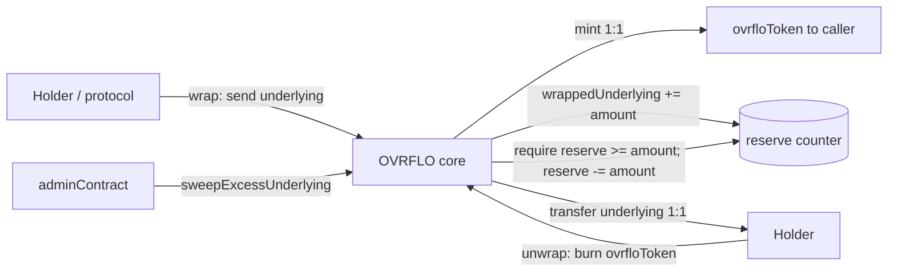

# feat: OVRFLO wrap / unwrap — underlying ↔ ovrfloToken primitive

## Summary

Add two permissionless, exactly-1:1 functions to the OVRFLO core: `wrap(amount)`
pulls the underlying and mints an equal amount of `ovrfloToken` to the caller;
`unwrap(amount)` burns `ovrfloToken` from the caller and returns an equal amount of
underlying from a single on-contract reserve. The core resolves its `(underlying, ovrfloToken)`
pair by reading `ovrfloInfo(address(this))` on its `adminContract` (the factory), so neither
function needs a `market` argument. No Sablier stream, no fee. `unwrap` is bounded
by the reserve and reverts when it cannot be covered. This gives `ovrfloToken` holders a
stream-independent exit to underlying and lets the protocol mint `ovrfloToken` from underlying
to seed swap pools (see origin: `docs/brainstorms/2026-06-20-ovrflo-wrap-unwrap-requirements.md`).

This is a deliberate **core change** to `src/OVRFLO.sol`. It is independent of the Secondary
Market Book (`docs/plans/2026-06-20-001-feat-ovrflo-secondary-market-book-plan.md`) and shares
no code with it.

---

## Problem Frame

Today an `ovrfloToken` holder has only two ways to realize value: let the Sablier stream vest,
or burn `ovrfloToken` 1:1 for PT via `claim` **after maturity** (`src/OVRFLO.sol:327`). There
is no pre-maturity, stream-independent path back to underlying, and no way for the protocol to
create `ovrfloToken` from underlying without first acquiring and depositing PT.

`wrap`/`unwrap` adds that path. Because `deposit` fees route straight to treasury
(`src/OVRFLO.sol:298`) and the core otherwise holds PT (not underlying), the only underlying
the core ever holds for redemption is what wrappers deposit — so `unwrap` liquidity is
intrinsically bounded by the wrap reserve, and that bound is the central design constraint.

---

## Scope Boundaries

**In scope**
- `wrap` / `unwrap` external functions on `src/OVRFLO.sol`, 1:1, no fee, no stream.
- A single `wrappedUnderlying` reserve counter and reserve-bounded `unwrap`.
- `sweepExcessUnderlying` admin recovery of donated underlying above the reserve.
- Solvency/peg invariant coverage and a mainnet-fork integration pass.

**Deferred to Follow-Up Work**
- Governance cap on total `wrappedUnderlying` (supply is fully 1:1 backed; cap is risk-appetite,
  not solvency — origin Outstanding Question).
- Admin pause on `wrap`/`unwrap` (origin Outstanding Question).

**Outside this product's identity**
- PT-backed `unwrap` or sourcing underlying by selling held PT; oracle/DEX integration; unwrap
  queues or partial fills (origin "Out of scope").
- Non-18-decimal underlyings (launch is wstETH; see KTD6).
- Any change to `deposit`/`claim` pricing, fees, or the Sablier stream shape.

---

## Key Technical Decisions

- KTD1. **Lives on the core; pair read from the admin/factory, no market arg.** `wrap(amount)`
  and `unwrap(amount)` resolve `(underlying, ovrfloToken)` by reading
  `ovrfloInfo(address(this))` on `adminContract` (the factory that deployed the core), via a
  minimal local interface to avoid importing `OVRFLOFactory` (which imports `OVRFLO` → circular).
  This needs no new core storage for the pair and no `market` argument. It is safe because
  `adminContract` is set once in the constructor (`src/OVRFLO.sol:179`) with **no setter**
  anywhere — it is permanently the deploying factory, and `ovrfloInfo[core]` is populated at
  `deploy()` (`src/OVRFLOFactory.sol:127-128`). Reading from the trusted admin matches the
  project's "trust what the multisig/admin already validates" stance. (Confirmed with user.)
  Assumption: if an admin-migration path is ever added, the new admin must also implement
  `ovrfloInfo(address) returns (address treasury, address underlying, address ovrfloToken)`.

- KTD2. **Single reserve counter per core.** A single `uint256 wrappedUnderlying` tracks the
  reserve. This is correct because the factory guarantees exactly one `(underlying, ovrfloToken)`
  pair per core: `deploy()` creates one `OVRFLOToken` and `OvrfloInfo` carries one `underlying`
  (`src/OVRFLOFactory.sol:117-128`). Reading that single pair from the admin (KTD1) means one
  logical reserve suffices.

- KTD3. **Exactly 1:1, no fee.** `wrap(amount)`: pull `amount` underlying from caller,
  mint `amount` ovrfloToken to caller, `wrappedUnderlying += amount`. `unwrap(amount)`:
  `require(wrappedUnderlying >= amount)`, `wrappedUnderlying -= amount`, burn `amount` ovrfloToken
  from caller, transfer `amount` underlying to caller. No bps fee on either path (origin D2).

- KTD4. **Reserve tracked by counter, never `balanceOf`.** `unwrap` capacity is the
  `wrappedUnderlying` counter, not the token balance, so a direct underlying donation cannot
  inflate unwrap capacity or corrupt accounting. Donations are recoverable only via the admin
  sweep (KTD7).

- KTD5. **`unwrap` is reserve-bounded and reverts when dry** (origin D3). No PT selling, oracle,
  queue, or partial fill. The peg is soft pre-maturity and self-heals as wrappers add liquidity;
  the matured `claim` path remains the hard 1:1 backstop.

- KTD6. **18-decimal assumption.** 1:1 mint/burn is in raw token units and is correct only when
  underlying and ovrfloToken share 18 decimals — true at launch (wstETH 18, ovrfloToken 18, PT
  18). Non-18 underlyings are out of scope; revisit with explicit scaling if ever needed.

- KTD7. **CEI, no new guard.** Follow the core's existing posture: `src/OVRFLO.sol` uses no
  `ReentrancyGuard` and relies on checks-effects-interactions. `unwrap` decrements the reserve and
  burns (effects) before transferring underlying out (interaction); `wrap` updates the counter and
  mints around a single `safeTransferFrom`. wstETH has no transfer hooks, so CEI is sufficient.
  (Confirmed with user; a guard is a deferred option, see Open Questions.)

- KTD8. **Solvency invariant (origin D4, D5).** Wrap-minted ovrfloToken never writes
  `marketTotalDeposited` (`src/OVRFLO.sol:281,337`); ovrfloToken stays fungible. The system is
  solvent by construction:

  ```
  total ovrfloToken supply = Σ marketTotalDeposited[m]   (PT-backed, drawn via claim)
                           + wrappedUnderlying            (underlying-backed, drawn via unwrap)
  ```

  `claim` is bounded per market by `marketTotalDeposited`; `unwrap` is bounded by
  `wrappedUnderlying`; each reverts when its pool is exhausted. 1:1 `unwrap` is safe pre-maturity
  because unvested value lives locked in Sablier, so a wallet holder can only `unwrap` already-
  vested ovrfloToken, which never exceeds current backing. No segregation between wrap-origin and
  deposit-origin ovrfloToken is added; routing is first-come and value-neutral post-maturity.

---

## High-Level Technical Design



Backing/redemption split (KTD8):

```
deposit path:  PT held  ── claim (post-maturity) ──>  PT out,  marketTotalDeposited -= amt
wrap path:     underlying reserve  ── unwrap (any time) ──>  underlying out, wrappedUnderlying -= amt
invariant:     supply(ovrfloToken) == Σ marketTotalDeposited + wrappedUnderlying
```

---

## Requirements

- R1. `wrap(amount)` requires `amount > 0`; resolves `(underlying, ovrfloToken)` from
  `adminContract.ovrfloInfo(address(this))`; pulls exactly `amount` underlying via `SafeERC20`,
  mints exactly `amount` ovrfloToken to the caller, and increments `wrappedUnderlying` by
  `amount`. Emits `Wrapped`.
- R2. `unwrap(amount)` requires `amount > 0` and `wrappedUnderlying >= amount`; resolves the pair
  from `adminContract.ovrfloInfo(address(this))`; decrements the reserve and burns `amount`
  ovrfloToken from the caller before transferring `amount` underlying to the caller (CEI). Emits
  `Unwrapped`.
- R3. `unwrap` reverts (does not partial-fill or queue) when `wrappedUnderlying < amount`.
- R4. Both functions are permissionless, create no Sablier stream, and charge no fee.
- R5. `unwrap` capacity derives from the `wrappedUnderlying` counter, never `balanceOf`; a direct
  underlying donation does not change unwrap capacity.
- R6. `sweepExcessUnderlying(to)` is `onlyAdmin`, resolves `underlying` from
  `adminContract.ovrfloInfo(address(this))`, transfers only `balanceOf(underlying) −
  wrappedUnderlying` (reverts when zero), and can never reduce the reserve. Emits an event.
- R7. The supply invariant `supply(ovrfloToken) == Σ marketTotalDeposited + wrappedUnderlying`
  holds across arbitrary interleavings of `deposit`, `claim`, `wrap`, `unwrap`, and
  `sweepExcessUnderlying`.
- R8. No change to `deposit`/`claim` behavior; `MIN_PT_AMOUNT`, fee routing, and stream shape are
  untouched.

---

## Implementation Units

### U1. Reserve + `wrap` / `unwrap`

**Goal:** The core 1:1 mint/redeem primitive and its reserve accounting.
**Requirements:** R1, R2, R3, R4, R5, R7, R8.
**Dependencies:** none.
**Files:** `src/OVRFLO.sol`; `test/OVRFLOWrapUnwrap.t.sol` (new).
**Approach:** Add `uint256 public wrappedUnderlying` to storage, a minimal
`IOvrfloAdmin { function ovrfloInfo(address) external view returns (address treasury, address
underlying, address ovrfloToken); }` interface, and `Wrapped(address indexed user, uint256
amount)` / `Unwrapped(address indexed user, uint256 amount)` events. Implement `wrap`/`unwrap`
per KTD3 using the existing `SafeERC20`-for-`IERC20` import and `OVRFLOToken(ovrfloToken).mint/burn`
(owner-gated, the core is owner — `src/OVRFLOToken.sol:26-32`). Resolve `(underlying, ovrfloToken)`
once at the top of each call via `IOvrfloAdmin(adminContract).ovrfloInfo(address(this))`. Strict
CEI in `unwrap`: decrement reserve, burn, then transfer out.
**Patterns to follow:** `deposit` `require`/`SafeERC20` style (`src/OVRFLO.sol:265-320`); mint/burn
calls as in `deposit`/`claim`; event style in the constants/events block; `adminContract` usage
(`src/OVRFLO.sol:163-166`).
**Test scenarios:**
- `wrap` mints exactly `amount` ovrfloToken to caller, pulls exactly `amount` underlying,
  increments `wrappedUnderlying`, emits `Wrapped`.
- `unwrap` burns exactly `amount` from caller, returns exactly `amount` underlying, decrements
  the reserve, emits `Unwrapped`.
- Round trip: `wrap` then `unwrap` returns the caller to starting balances; reserve back to prior.
- `unwrap` reverts when `wrappedUnderlying < amount` (reserve dry / partially funded), with no
  state change (no partial fill).
- `wrap`/`unwrap` revert on `amount == 0`.
- The pair is sourced from the admin: test fixture sets `adminContract` to a mock factory exposing
  `ovrfloInfo(core) -> (treasury, underlying, ovrfloToken)`; assert `wrap`/`unwrap` use those
  exact addresses (the existing unit fixture deploys the core with an EOA admin, so a mock-admin
  contract is required here).
- A second party can `unwrap` reserve funded by a different party's `wrap` (shared, first-come).
- Donation: transferring underlying directly to the core does not raise unwrap capacity beyond
  `wrappedUnderlying` (R5).
- CEI/reentrancy: a malicious ERC20 underlying re-entering `unwrap` cannot double-spend the
  reserve (reserve already decremented before transfer). Use a reentrant mock token.
- No stream is created and no fee is taken on either path (assert Sablier/treasury untouched).
**Verification:** unit suite passes; `forge build` clean; balances and `wrappedUnderlying` match
expectations on every path.

### U2. `sweepExcessUnderlying` admin recovery

**Goal:** Recover underlying donated above the reserve without ever touching the reserve.
**Requirements:** R6.
**Dependencies:** U1.
**Files:** `src/OVRFLO.sol`; `test/OVRFLOWrapUnwrap.t.sol` (extend).
**Approach:** Mirror `sweepExcessPt` (`src/OVRFLO.sol:241-249`): resolve `underlying` via
`IOvrfloAdmin(adminContract).ovrfloInfo(address(this))`, compute `excess = balanceOf(underlying) −
wrappedUnderlying`, require `excess > 0`, `safeTransfer` to `to`, emit an `ExcessUnderlyingSwept`
event. `onlyAdmin`. Signature is `sweepExcessUnderlying(address to)` — no `market` needed.
**Patterns to follow:** `sweepExcessPt` structure and `ExcessSwept` event.
**Test scenarios:**
- With no donation, `sweepExcessUnderlying` reverts (`no excess`).
- After a donation, sweeps exactly the donated amount; `wrappedUnderlying` unchanged; reserve
  still fully unwrappable afterward.
- Non-admin caller reverts.
- Sweep can never push `balanceOf(underlying)` below `wrappedUnderlying`.
**Verification:** sweep tests pass; reserve invariant preserved across sweep.

### U3. Solvency / peg invariant tests

**Goal:** Prove the supply invariant and reserve bound hold under mixed operations.
**Requirements:** R3, R5, R7.
**Dependencies:** U1, U2.
**Files:** `test/OVRFLOWrapUnwrap.invariant.t.sol` (new) or an invariant block in
`test/OVRFLOWrapUnwrap.t.sol`.
**Approach:** Foundry invariant/property testing with a handler exercising `deposit`, `claim`
(post-maturity), `wrap`, `unwrap`, and `sweepExcessUnderlying` against a mock market/oracle, mock
underlying, and a mock admin exposing `ovrfloInfo(core)` (so `wrap`/`unwrap` resolve the pair).
Assert after every call: `ovrfloToken.totalSupply() == Σ marketTotalDeposited + wrappedUnderlying`,
and `wrappedUnderlying <= underlying.balanceOf(core)`.
**Patterns to follow:** existing unit-test fixtures in `test/OVRFLO.t.sol`; Foundry
invariant-handler conventions.
**Test scenarios:**
- Fuzzed interleavings never violate the supply invariant (R7).
- `unwrap` never succeeds beyond `wrappedUnderlying` (R3) and never underflows the reserve.
- `wrappedUnderlying` never exceeds the core's underlying balance (R5).
- Pre-maturity, total successful `unwrap` ≤ total `wrap` (reserve-bounded liquidity).
**Verification:** invariant suite passes with a meaningful run/depth budget.

### U4. Mainnet fork integration

**Goal:** End-to-end against the real factory/core and real wstETH.
**Requirements:** R1, R2, R3, R6.
**Dependencies:** U1, U2.
**Files:** `test/fork/OVRFLOWrapUnwrapFork.t.sol` (new), building on
`test/fork/OVRFLOForkBase.t.sol`.
**Approach:** Deploy a real core via the factory, approve a real wstETH PT market, then: `wrap`
real wstETH → `ovrfloToken`; `unwrap` back; assert exact 1:1 and reserve movement; confirm
`unwrap` reverts when the reserve is insufficient; sweep a simulated donation. Cross-check that a
deposit-origin `ovrfloToken` holder can `unwrap` against a reserve funded by an independent
wrapper (fungibility).
**Patterns to follow:** `OVRFLOForkBase`, `OVRFLOTestFixtures`, `MAINNET_FORK_BLOCK`; honor the
no-`forge script --broadcast`-against-Anvil rule in `docs/solutions/patterns/ovrflo-critical-patterns.md`.
**Test scenarios:**
- Real wstETH `wrap`/`unwrap` round trip is exactly 1:1.
- `unwrap` beyond the funded reserve reverts on the real token.
- Deposit-origin holder unwraps against a wrapper-funded reserve.
- `sweepExcessUnderlying` recovers a donated wstETH amount, leaving the reserve intact.
**Verification:** fork suite passes against `MAINNET_RPC_URL`.

---

## Risks & Dependencies

- **Decimal mismatch (KTD6).** 1:1 raw-unit mint/burn is correct only for 18-decimal underlyings.
  Mitigation: launch is wstETH (18); non-18 underlyings are explicitly out of scope and would
  need scaling.
- **Reentrancy via a hostile underlying.** Mitigation: strict CEI (reserve decremented and tokens
  burned before transfer); U1 includes a reentrant-mock test. wstETH has no transfer hooks today.
- **`OVRFLOToken.burn(from, amount)` is owner-gated and allowance-free** (`src/OVRFLOToken.sol:30`).
  `unwrap` burns from `msg.sender` only — never a third party — so this is safe; verified by U1.
- **Soft peg pre-maturity.** Under reserve stress `unwrap` reverts and ovrfloToken can trade below
  1 underlying until wrappers refill or maturity. Accepted by design (KTD5, origin D3).

---

## Open Questions

- Governance cap on `wrappedUnderlying` — deferred; supply is fully 1:1 backed so this is
  risk-appetite, not solvency (origin Outstanding Question).
- Admin pause on `wrap`/`unwrap` — deferred (origin Outstanding Question).
- Admin coupling (KTD1): `wrap`/`unwrap`/`sweepExcessUnderlying` assume `adminContract` exposes
  `ovrfloInfo(address)`. True and permanent today (no `adminContract` setter). If an
  admin-migration path is ever introduced, the new admin must preserve that getter — track it
  with any future migration work.

---

## Sources / Research

- Origin requirements: `docs/brainstorms/2026-06-20-ovrflo-wrap-unwrap-requirements.md`.
- Core: `src/OVRFLO.sol` — `deposit` mint + `marketTotalDeposited` (`:281,303-304`), `claim`
  burn + per-market accounting (`:327-341`), fee→treasury (`:298`), `sweepExcessPt` pattern
  (`:241-249`), `adminContract` set once with no setter (`:41,179`), no `ReentrancyGuard`.
- Token: `src/OVRFLOToken.sol` — owner-gated `mint`/`burn` (`:26-32`).
- Factory (the admin/registry read): `src/OVRFLOFactory.sol` — `OvrfloInfo` struct
  `(treasury, underlying, ovrfloToken)` (`:33-43`), public `ovrfloInfo` mapping getter (`:43`)
  and `getOvrfloInfo` (`:208-210`), populated at `deploy()` (`:107-131`).
- Test scaffolding: `test/OVRFLO.t.sol`, `test/fork/OVRFLOForkBase.t.sol`,
  `script/lib/OVRFLOTestFixtures.sol`.
- Required reading: `docs/solutions/patterns/ovrflo-critical-patterns.md`.
