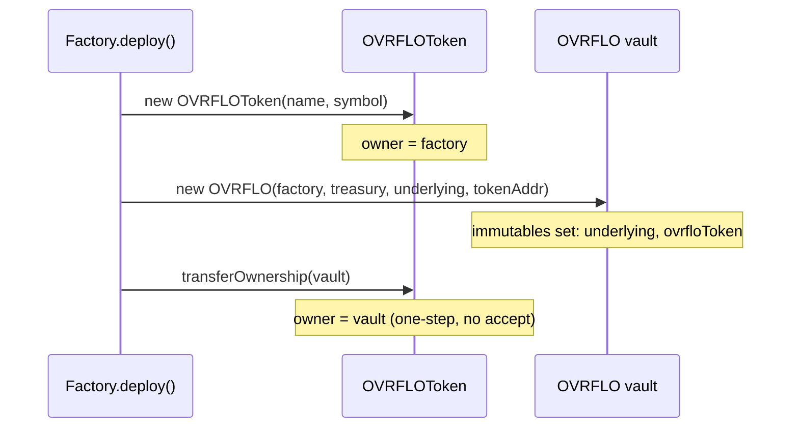

# refactor: Hoist underlying and ovrfloToken to vault immutables

## Summary

Make `underlying` and `ovrfloToken` `immutable` on the OVRFLO vault (set once
at construction via a factory deploy reorder), drop the redundant per-market
`SeriesInfo` stored copies, replace the public-mapping auto-getter with a
custom `series(market)` function that synthesizes the two dropped positions
from the immutables, and move the per-series Sablier approval to deploy-time
(the constructor). The public `series()` 8-tuple ABI is preserved so the web
app, `StreamPricing`, mocks, and positional-reading tests stay untouched.

## Problem Frame

Each OVRFLO vault has exactly one `(underlying, ovrfloToken)` pair, yet today
these values live in two redundant places: per-market copies in `SeriesInfo`
(read by `deposit`/`claim`, written by every `setSeriesApproved`) and a
runtime fetch from the factory registry via `IOvrfloAdmin.ovrfloInfo(this)` in
`wrap`/`unwrap`/`sweepExcessUnderlying`. The redundancy costs gas, relies on
factory call discipline to keep the copies consistent, and leaves latent
generality (different pairs per market) the core never uses. (see origin:
`docs/brainstorms/2026-06-24-ovrflo-immutables-abi-stable-full-hoist-requirements.md`)

---

## Requirements

- R1. `underlying` and `ovrfloToken` are `immutable` on the OVRFLO vault, set
  once in the constructor, with zero-address guards matching the existing
  `admin`/`treasury` pattern.
- R2. The factory creates the `OVRFLOToken` before the vault and transfers
  token ownership to the vault after construction (one-step).
- R3. `wrap`, `unwrap`, and `sweepExcessUnderlying` read `underlying` and
  `ovrfloToken` from the immutables; no `IOvrfloAdmin.ovrfloInfo` external
  call remains in `OVRFLO.sol`; the `IOvrfloAdmin` import is removed.
- R4. `SeriesInfo` no longer stores `ovrfloToken` or `underlying`; `deposit`
  and `claim` read them from the vault immutables.
- R5. The public `series(market)` getter returns the same 8-tuple shape,
  order, and types as today, with positions 5 (`ovrfloToken`) and 6
  (`underlying`) synthesized from the immutables.
- R6. `setSeriesApproved` no longer takes `underlying`/`ovrfloToken`
  parameters; the `SeriesApproved` event still emits both values, filled from
  the immutables.
- R7. `forge build` is green and all existing tests pass with only constructor
  and `setSeriesApproved` call-site edits; positional-reading tests and mock
  `series()` implementations compile and pass unmodified.
- R8. The web app market loader and deposit modal continue to decode
  `series()` with no frontend change.
- R9. The Sablier max-approval on `ovrfloToken` moves from per-series (inside
  `setSeriesApproved`) to deploy-time (in the constructor), since
  `ovrfloToken` is now a single vault immutable shared by all series.

---

## Key Technical Decisions

- KTD1. Synthesized getter over interface change. Replace the
  `public series` mapping auto-getter with an internal `_series` mapping plus
  a custom `series(address)` function that fills positions 5 and 6 from the
  immutables, preserving the exact 8-tuple ABI. The web app decodes the tuple
  positionally (`useAllMarkets` reads `s[0]..s[7]`; `NewOvrfloModal` reads
  `seriesData[5]`/`[6]`), so changing the tuple shape would break off-chain
  ABI consumers. (see origin)
- KTD2. Factory deploy reorder (token-first). Create `OVRFLOToken` before the
  vault so the vault receives `ovrfloToken` as a constructor immutable, then
  transfer ownership to the vault. `OVRFLOToken` uses a custom one-step
  `transferOwnership` (not OZ two-step), so no `acceptOwnership` step is
  needed. (see origin)
- KTD3. Keep `SeriesApproved` event shape. Continue emitting `ovrfloToken`
  and `underlying` in the event, filled from the immutables. Event indexers
  may key on these fields; dropping them is an event-signature change with
  indexer impact. (user-confirmed)
- KTD4. `adminContract` stays mutable. Only `underlying` and `ovrfloToken`
  become immutable; `adminContract` remains a storage variable because
  `transferVaultAdmin` requires updating it. (see origin)
- KTD5. Sablier approval to deploy-time. `setSeriesApproved` currently calls
  `IERC20(ovrfloToken).approve(sablierLL, type(uint256).max)` on every series.
  Because `ovrfloToken` is now a vault immutable, the approval is identical
  for every series and can be set once in the constructor. This saves one
  external call per `addMarket` and removes a redundant per-series write. A
  write-once `setTokenPair` setter was considered as an alternative to the
  constructor immutable but rejected because it re-introduces call-discipline
  reliance (the redundancy this refactor eliminates) and violates the
  constructor-enforced invariant goal.

---

## High-Level Technical Design

### Deploy reorder (KTD2)

The factory's `deploy()` currently creates the vault, then the token, then
transfers token ownership. The reorder creates the token first so its address
is available as a constructor argument:



### Synthesized `series()` getter (KTD1)

Directional guidance (not implementation specification) — the getter reads
the slimmer stored struct and fills the two dropped positions from immutables
so the return tuple is identical to today:

```
function series(address market) public view returns (
    bool, uint32, uint16, uint256, address, address, address, address
) {
    SeriesInfo memory s = _series[market];
    return (s.approved, s.twapDurationFixed, s.feeBps, s.expiryCached,
            s.ptToken,
            ovrfloToken,   // idx 5 — from immutable, not storage
            underlying,    // idx 6 — from immutable, not storage
            s.oracle);
}
```

Internal callers (`deposit`, `claim`, `previewRate`, `previewStream`,
`previewDeposit`, `claimablePt`) read `_series[market]` directly; none read
the two dropped fields except `deposit`/`claim`, which move to the immutables.

---

## Implementation Units

### U1. Vault immutables and factory deploy reorder

**Goal:** Establish `underlying` and `ovrfloToken` as vault immutables set at
construction, by reordering the factory to create the token first.

**Requirements:** R1, R2, R9

**Dependencies:** none

**Files:**
- `src/OVRFLO.sol` (constructor: add `underlying` + `ovrfloToken` params and immutables; zero-address guards; approve Sablier on `ovrfloToken` once at construction)
- `src/OVRFLOFactory.sol` (`deploy()`: create token before vault, pass `tokenAddr` + `config.underlying` to constructor, then `transferOwnership(vault)`)
- `test/OVRFLO.t.sol` (constructor call sites, incl. the two zero-address revert cases; reorder `setUp` so `underlying`/`ovrfloToken` are instantiated before `new OVRFLO`)
- `test/OVRFLOWrapUnwrap.t.sol` (constructor call site; reorder `setUp` likewise)
- `test/OVRFLOWrapUnwrap.invariant.t.sol` (constructor call site; reorder `setUp` likewise)

**Approach:** The immutables are introduced but not yet read by any function
in this unit — `wrap`/`unwrap`/`sweep` still call `ovrfloInfo`, `deposit`/
`claim` still read `SeriesInfo`, and `setSeriesApproved` is unchanged. This
keeps the unit atomic and independently testable. The factory's `addMarket`
still passes `underlying`/`ovrfloToken` to `setSeriesApproved` (unchanged
here). The constructor approves Sablier to spend `ovrfloToken` once (KTD5);
`setSeriesApproved` still does its own per-series approve in this unit, so the
double approval is harmless and collapses in U3. Follow the existing
zero-address guard pattern already used for `admin` and `treasury`.

**Test `setUp` reordering:** The existing test harnesses construct the vault
before the token/underlying exist. Adding the two constructor args (with
zero-address guards) requires each affected `setUp` to instantiate
`underlying`/`ovrfloToken` before `new OVRFLO(...)`, then pass those
addresses to the constructor. This is a structural `setUp` dependency
change, not merely an arg-count change — the implementer must reorder the
`setUp` bodies, not just append args. During this interim unit, the test
harness must pass identical `underlying`/`ovrfloToken` values to both the
constructor and `setSeriesApproved` so the immutable and stored sources agree.

**Patterns to follow:** Existing constructor guards (`admin != address(0)`,
`treasury != address(0)`); `TREASURY_ADDR` immutable declaration pattern.

**Test scenarios:**
- **Happy path:** After `deploy()`, `vault.underlying()` and
  `vault.ovrfloToken()` return the configured underlying and the deployed
  token address; `token.owner()` equals the vault address; Sablier's
  allowance on `ovrfloToken` is `type(uint256).max` from construction.
- **Error paths:** Constructor reverts when `underlying == address(0)`; reverts
  when `ovrfloToken == address(0)` (mirrors existing admin/treasury revert
  tests, updated for the new arg count).
- **Integration:** After the reordered deploy, `addMarket` →
  `setSeriesApproved` still works and `series(market)` returns the full tuple
  with correct values (fields still stored in this unit).

**Verification:** `forge build` green; all existing tests pass with updated
constructor call sites and reordered `setUp` blocks; token ownership ends on
the vault; Sablier allowance is max from construction.

### U2. Rewire wrap/unwrap/sweep to immutables, drop IOvrfloAdmin

**Goal:** Eliminate the runtime `ovrfloInfo` fetch by reading `underlying` and
`ovrfloToken` from the immutables in the wrap/unwrap/sweep path.

**Requirements:** R3

**Dependencies:** U1

**Files:**
- `src/OVRFLO.sol` (`wrap`, `unwrap`, `sweepExcessUnderlying`: replace `IOvrfloAdmin(adminContract).ovrfloInfo(this)` calls with immutable reads; remove `IOvrfloAdmin` interface import)

**Approach:** `wrap` and `unwrap` currently destructure
`(, underlying, ovrfloToken) = ovrfloInfo(this)`; replace with the immutables.
`sweepExcessUnderlying` destructures `(, underlying,)`; replace similarly.
The `IOvrfloAdmin` interface definition (if declared in `OVRFLO.sol`) is
removed once no caller remains. The factory's `OvrfloInfo` registry struct is
untouched — it is still consumed by `StreamPricing` and the book via
`ovrfloInfo`.

**Patterns to follow:** `TREASURY_ADDR` immutable read pattern already used
in fee distribution.

**Test scenarios:**
- **Happy path:** `wrap(amount)` uses the immutable `underlying`/`ovrfloToken`
  (same balances, mint, and stream behavior as before); `unwrap(amount)`
  reverses correctly; `sweepExcessUnderlying(to)` sweeps the correct
  underlying token.
- **Integration:** wrap-then-unwrap round-trip still works end-to-end
  (`OVRFLOWrapUnwrap` suite passes unchanged).
- **Error paths:** `unwrap` with insufficient `wrappedUnderlying` reserve
  still reverts (behavior unchanged, now sourced from immutable).

**Verification:** `forge build` green with no `IOvrfloAdmin` reference in
`OVRFLO.sol`; `OVRFLOWrapUnwrap` tests pass unchanged.

### U3. Drop SeriesInfo fields, synthesized getter, rewire deposit/claim

**Goal:** Remove the per-market stored copies, add the synthesized `series()`
getter, rewire `deposit`/`claim` to immutables, and shrink `setSeriesApproved`.

**Requirements:** R4, R5, R6, R7, R8, R9

**Dependencies:** U1

**Files:**
- `src/OVRFLO.sol` (`SeriesInfo` struct: remove `ovrfloToken` + `underlying` fields; `series` mapping → `internal _series`; add custom `series(address)` getter synthesizing idx 5/6 from immutables; `setSeriesApproved`: drop the two params, stop writing them, remove the per-series Sablier `approve` call (now done in the constructor per U1), emit `SeriesApproved` with values from immutables; `deposit`/`claim`: read immutables; `previewRate`/`previewStream`/`previewDeposit`/`claimablePt`: read `_series[market]`)
- `src/OVRFLOFactory.sol` (`addMarket`: drop `info.underlying`/`info.ovrfloToken` args from the `setSeriesApproved` call)
- `test/OVRFLO.t.sol` (`setSeriesApproved` call sites: drop the two args)
- `test/OVRFLOWrapUnwrap.invariant.t.sol` (`setSeriesApproved` call site: drop the two args)

**Approach:** This unit is necessarily atomic: removing the struct fields
forces `deposit`/`claim` and the getter to change in the same commit or the
build breaks. The `series()` custom function replaces the auto-getter so the
8-tuple ABI is identical (KTD1). The `SeriesApproved` event keeps its
signature and fills `ovrfloToken`/`underlying` from the immutables (KTD3).
The per-series `IERC20(ovrfloToken).approve(sablierLL, max)` call is removed
from `setSeriesApproved` — the constructor already set it in U1 (KTD5). The
"series already configured" guard (`ptToken == address(0)`) is unchanged.
Positional-reading tests (`OVRFLOFactory.t.sol`, `OVRFLO.t.sol`, fork tests)
and mock `series()` implementations (`StreamPricing.t.sol`,
`OVRFLOBook.t.sol`) are deliberately left unmodified — they serve as
regression proof that the ABI held (R7).

**Patterns to follow:** Custom-getter-over-public-mapping pattern; existing
`SeriesApproved` event declaration (keep field order).

**Test scenarios:**
- **Happy path:** `deposit` mints the correct `ovrfloToken`, pays the fee in
  the correct `underlying`, and creates the Sablier stream against the
  correct asset; `claim` burns the correct `ovrfloToken`.
- **ABI preservation (regression):** `series(market)` returns an 8-tuple
  where index 5 equals `vault.ovrfloToken()` and index 6 equals
  `vault.underlying()`; the unmodified positional-reading tests
  (`OVRFLOFactory.t.sol`, `OVRFLO.t.sol`, fork tests) pass without edit.
- **Integration:** `setSeriesApproved` called without the two args still
  stores the series; `SeriesApproved` emits `ovrfloToken`/`underlying`
  matching the vault immutables; mock `series()` implementations in
  `StreamPricing.t.sol` and `OVRFLOBook.t.sol` compile and pass unmodified.
  `setSeriesApproved` no longer calls `approve` on Sablier (the constructor
  already did); deposits still create streams successfully, proving the
  deploy-time approval covers all series.
- **Edge cases:** The "series already configured" revert still fires on a
  second `setSeriesApproved` for the same market; `previewDeposit`/
  `previewStream`/`previewRate` return unchanged values (they never read the
  dropped fields).

**Verification:** `forge build` green; full `forge test` suite passes
(OVRFLOBook 37 tests + OVRFLO/Factory/fork suites); positional-reading tests
and mocks pass without modification.

---

## Scope Boundaries

### Deferred to Follow-Up Work

- `StreamPricing.requireEligible` double-read of `ovrfloToken` (once from
  `series()`, once from `ovrfloInfo` as `registeredToken`). Minor read-time
  redundancy; removing it requires the `IOVRFLOSeriesRegistry.series`
  interface change that this plan deliberately avoids.
- Any change to the factory's `OvrfloInfo` registry struct or the
  `IOvrfloAdmin` interface (unchanged here). After U2, `interfaces/IOvrfloAdmin.sol`
  becomes an orphan file safe to delete (the factory exposes `ovrfloInfo` via
  its public mapping, not via this interface).

### Non-goals

- `deposit`/`claim` economics and fee math.
- Non-18-decimal underlyings.
- The web app — no frontend change is needed because the `series()` ABI is
  preserved (R8).

---

## Risks & Dependencies

- **Deploy reorder changes the deployment transaction shape.** Existing
  deployments are unaffected (new deployments only). The local seed flow
  (`script/seed-local.sh`) uses `forge create` + `cast send` (per critical
  pattern #2, not `forge script --broadcast`) and reads `ovrfloInfo` (the
  unchanged registry), so it is unaffected. Re-verify the seed end-to-end
  after U1.
- **Invariant dependency: `OVRFLOToken` one-step ownership.** The deploy
  reorder depends on `OVRFLOToken.transferOwnership` remaining one-step (no
  `acceptOwnership`). A future migration to OZ two-step ownership would break
  the reorder and must be coordinated with this plan.
- **Synthesized getter gas.** Dropping two address fields shrinks `SeriesInfo`
  storage (fewer SLOADs per struct read); the custom `series()` adds two cheap
  immutable reads (~3 gas each) in their place. The getter is a net gas saving
  over the stored-field reads, not a cost.

---

## Sources / Research

- Origin: `docs/brainstorms/2026-06-24-ovrflo-immutables-abi-stable-full-hoist-requirements.md` (full blast-radius map and approach rationale)
- `src/OVRFLO.sol` — `SeriesInfo` struct, `series` mapping, constructor, `setSeriesApproved`, `deposit`/`claim`/`wrap`/`unwrap`/`sweepExcessUnderlying`, preview functions
- `src/OVRFLOFactory.sol` — `deploy()` order, `addMarket()` → `setSeriesApproved`
- `src/OVRFLOToken.sol` — custom one-step `transferOwnership`
- `src/StreamPricing.sol` — `IOVRFLOSeriesRegistry.series` 8-tuple interface (preserved, not changed)
- `web/hooks/useAllMarkets.ts` — decodes `s[0]..s[7]` positionally (ABI-preservation proof)
- `web/components/NewOvrfloModal.tsx` — reads `seriesData[5]`/`[6]` (ABI-preservation proof)
- `test/StreamPricing.t.sol`, `test/OVRFLOBook.t.sol` — mock `series()` implementations (regression proof, unmodified)
- `test/OVRFLOFactory.t.sol`, `test/OVRFLO.t.sol`, `test/fork/OVRFLOFactoryMainnetFork.t.sol` — positional-reading tests (regression proof, unmodified)
- `docs/solutions/patterns/ovrflo-critical-patterns.md` — pattern #2 (Anvil seed constraint) confirms the seed flow is unaffected
