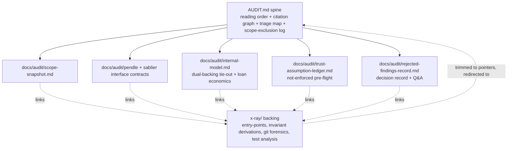

# Auditor Context Package for OVRFLO

## Summary

Build an auditor onboarding package rooted at a canonical `AUDIT.md` spine fronting five focused companion docs under `docs/audit/` (Pendle + Sablier interface contracts, internal-model explainer, trust-assumption ledger, rejected-findings record) plus a pinned scope snapshot, then trim the overlapping `x-ray/` sections to point at the canonical package docs. Doc/content layer only; all runnable work is deferred.

## Problem Frame

The repo is already audit-prepared (`README.md`, `CONCEPTS.md`, security guideline docs, the `x-ray/` suite), but the context an external auditor needs is scattered and unsequenced. The external-protocol mental models the brief emphasized are the thinnest: no dependency-scoped Pendle or Sablier explainer tied to what OVRFLO actually calls. Trust assumptions are smeared across `x-ray/x-ray.md`, `x-ray/invariants.md` (X-2, X-5), and `x-ray/multi-agent-audit-report.md`; the four not-enforced-on-chain invariants (I-2, I-7, X-2, X-5) are where residual risk concentrates but are buried; and there is no single entry point prescribing a reading order. An auditor reconstructs all of this manually and re-derives conclusions the internal review already settled (the Sablier v1.1 withdraw-ACL distinction that flipped a "High" to rejected).

## Requirements

**Spine and navigation**

- R1. `AUDIT.md` is the package front door and prescribes a reading order: scope snapshot → dependency interface contracts → internal-protocol model → trust-assumption / not-enforced ledger → rejected-findings record → reproduction notes.
- R2. `AUDIT.md` carries a citation graph linking every package section and the backing `x-ray/` artifacts by their existing stable IDs and entry-point names, plus a scope-exclusion log stating what is out of scope and why.
- R3. `AUDIT.md` includes a one-screen triage map relating the 37 entry points to their invariant IDs and the x-ray adversary ranking, flagging reentrancy-guard presence and the four not-enforced invariants.

**External dependency mental models**

- R4. A Pendle interface contract scoped to exactly the calls OVRFLO makes (`getPtToSyRate`, `yieldToken`, PT 18-decimal and maturity-convergence assumptions), each as assumed property → where enforced or not (with `file:line`) → failure mode, pinned to the deployed market/oracle.
- R5. A Sablier interface contract scoped to OVRFLO's usage (`createWithDurations`, `withdrawableAmountOf`, `transferFrom`, non-cancelable + no-cliff), including the verified v1.1 withdraw ACL and how NFT ownership/recipient moves through the Book lifecycle, pinned to the deployed address and v1.1 tag.

**Security-reasoning scaffolding**

- R6. A trust-assumption / pre-flight ledger consolidating every off-chain-trusted belief: the four not-enforced invariants (I-2, I-7, X-2, X-5), the bounded-external actors, and the documented trust boundaries, each framed as a line item an auditor can mark ACCEPT or CHALLENGE.
- R7. A rejected-findings decision record + Q&A bank capturing the internal review's settled conclusions (H-2 rejected via v1.1 ACL evidence, M-5 by-design, H-1 downgraded to L-1) and the five resolved open questions, each with the reasoning that closed it, framed as evidence to challenge rather than conclusions to accept.

**Internal protocol model**

- R8. A dual-backing solvency tie-out presenting one fungible `ovrfloToken` as backed by two separately-accounted pools (PT claims via `marketTotalDeposited`, wrap reserve via `wrappedUnderlying`) as conservation identities (I-1, I-3, E-3) an auditor can tie out against on-chain state, framed insolvency-first.
- R9. A self-repaying-loan economics explainer covering why there is no health check, loan-time oracle, or liquidation; the `outstanding = obligation − (drawn + repaid)` relation; and why permissionless `closeLoan()` is liveness, not exploit.

**Reproduction, scope, and reconciliation**

- R10. A pinned scope snapshot document: in-scope commit and file paths, excluded paths, code-freeze declaration, deployed Sablier and Pendle market/oracle addresses, and `lib/` submodule commits. Document only this round; environment automation and runnable coverage are deferred.
- R11. Overlapping `x-ray/` sections (the X-2/X-5 trust framing in `x-ray/invariants.md`, the rejected-findings and ACL content in `x-ray/multi-agent-audit-report.md`, the dependency-risk-map prose in `x-ray/x-ray.md`) are edited in place to point forward at the canonical package docs, with no duplicated source of truth remaining.

## Key Technical Decisions

- KTD1. `execution: knowledge-work` routing. The deliverable is documentation, not contract code, so `ce-work` routes to the non-code path (read sources, synthesize, produce docs) and skips the branch/test/CI lifecycle. Rationale: matches the artifact type and avoids forcing a code-PR ceremony onto prose authoring.
- KTD2. Companion doc layout. Six files under `docs/audit/` (`scope-snapshot.md`, `pendle-interface-contract.md`, `sablier-interface-contract.md`, `internal-model.md`, `trust-assumption-ledger.md`, `rejected-findings-record.md`) plus root `AUDIT.md`. Rationale: each topic stays focused and independently maintainable; `AUDIT.md` at repo root is the discoverable front door.
- KTD3. Citation anchors use GitHub heading auto-anchors plus the existing heading IDs already in `x-ray/` (e.g. `x-ray/invariants.md#x-2`, `#i-7`). Rationale: reuses the stable `G-/I-/X-/E-` namespace (KD4) without inventing a new ID scheme or maintainer burden.
- KTD4. Triage map renders as an inline compact table in `AUDIT.md`, grouped by entry-point category (permissionless / role-gated / admin), columns: entry point, invariant IDs, adversary rank, reentrancy guard, not-enforced flag. Rationale: a table scans faster than prose for 37 uniform rows and keeps the map on one screen; grouping by category surfaces the permissionless attack surface first.
- KTD5. Sequencing: companion docs (U1-U6) → `AUDIT.md` spine (U7) → `x-ray/` reconciliation (U8). Rationale: canonical docs must exist before the spine links them and before any `x-ray/` section is trimmed to a pointer, so no link ever dangles.
- KTD6. `x-ray/` trim scope is limited to the overlapping content: the X-2/X-5 trust framing in `x-ray/invariants.md`, the rejected-findings + verified ACL table in `x-ray/multi-agent-audit-report.md`, and the dependency-risk-map prose in `x-ray/x-ray.md`. Each is reduced to a short pointer to the canonical package doc; x-ray's unique analysis (entry-point map, invariant derivations, git forensics, test analysis) stays in place as linked backing evidence. Rationale: preserves the evidence record while killing the duplicated source of truth.
- KTD7. Existing security docs (`BASE_SECURITY.md`, `4626_SECURITY.md`, `GUIDELINES.md`) are linked from `AUDIT.md` as background, not placed in the prescribed reading order. Rationale: they are standing guideline references, not auditor-onboarding steps; the reading order targets the scattered context the package exists to sequence.

## High-Level Technical Design



The package is a citation graph, not a monolith. `AUDIT.md` is the only file an auditor opens first; every companion doc reads standalone and links back into `x-ray/` for derivations, while the trimmed `x-ray/` sections redirect forward to the canonical docs. The arrow direction matters: companions link down to evidence; trimmed x-ray links up to canonical.

## Output Structure

```text
AUDIT.md                                   # root front door (U7)
docs/audit/
  scope-snapshot.md                        # U1
  pendle-interface-contract.md             # U2
  sablier-interface-contract.md            # U3
  internal-model.md                        # U4
  trust-assumption-ledger.md               # U5
  rejected-findings-record.md              # U6
```

`x-ray/` artifacts are edited in place (U8), not relocated.

## Implementation Units

### U1. Pinned scope snapshot

- **Goal:** Give an auditor an immutable scope pin in one place: what commit, what files, what is excluded, what dependencies are deployed, and a code-freeze declaration.
- **Requirements:** R10.
- **Dependencies:** none (foundational; every other unit cites the pinned addresses from here).
- **Files:** `docs/audit/scope-snapshot.md` (create).
- **Approach:** One document with five blocks: in-scope commit + branch; in-scope file paths with nSLOC (the five `src/` contracts); excluded paths; code-freeze declaration; pinned dependency facts (Sablier V2 Lockup Linear v1.1 at `0xAFb979d9afAd1aD27C5eFf4E27226E3AB9e5dCC9`, Pendle market/oracle addresses, `lib/` submodule commits for openzeppelin-contracts and prb-math). Re-confirm the Sablier address and v1.1 tag against `x-ray/multi-agent-audit-report.md` and the audited commit. Document the `MAINNET_RPC_URL` requirement for fork tests as a known reproduction note, without automating it (deferred).
- **Patterns to follow:** Mirror the scoping discipline from `x-ray/x-ray.md` (commit hash + nSLOC table + forked-dependency table).
- **Test expectation:** none -- documentation unit; verified by review against the acceptance criteria below.
- **Verification:** Reviewer confirms the snapshot names the exact in-scope commit, all five in-scope file paths, the deployed Sablier address + v1.1 tag, the Pendle market/oracle addresses, both `lib/` submodule commits, and an explicit code-freeze statement; and that no address conflicts with `x-ray/multi-agent-audit-report.md`.

### U2. Pendle interface contract

- **Goal:** Give an auditor a falsifiable Pendle assumptions sheet scoped to exactly what OVRFLO calls, instead of a general Pendle tutorial.
- **Requirements:** R4.
- **Dependencies:** U1 (pinned market/oracle addresses).
- **Files:** `docs/audit/pendle-interface-contract.md` (create).
- **Approach:** One row per OVRFLO→Pendle call surface: `IPendleOracle.getPtToSyRate()` (TWAP freshness/cardinality, enforced at onboarding only → X-2 not revalidated per deposit), `IStandardizedYield.yieldToken()` (== vault underlying, enforced G-18/X-4), PT 18-decimal invariant (enforced via `MIN_PT_AMOUNT`), PT maturity convergence to 1:1 at `expiryCached` (assumed, guards G-8/G-11). Each row: assumed property → where enforced or not (with `file:line` into `src/OVRFLO.sol`, `src/OVRFLOFactory.sol`) → failure mode if violated. Pin to the deployed market/oracle from U1. Fold in the minimum dynamic context: when the oracle split is computed inside `deposit()` (KD5 from the brainstorm). Explicitly exclude YT/AMM mechanics OVRFLO never calls, with a one-line scope-exclusion note.
- **Patterns to follow:** Row shape mirrors `x-ray/invariants.md` X-2 callee-side framing (assumes / validates / on-failure), tightened to a per-call table.
- **Test expectation:** none -- documentation unit; verified by review against the acceptance criteria below.
- **Verification:** Reviewer confirms every external Pendle call OVRFLO makes appears as a row with assumed property, enforcement point with `file:line`, and failure mode; that X-2's not-enforced status is stated; and that no general Pendle mechanics (YT, AMM) are included beyond the exclusion note.

### U3. Sablier interface contract

- **Goal:** Give an auditor a falsifiable Sablier V2 assumptions sheet scoped to OVRFLO's usage, centered on the v1.1 withdraw ACL that flipped H-2.
- **Requirements:** R5.
- **Dependencies:** U1 (pinned Sablier address + v1.1 tag).
- **Files:** `docs/audit/sablier-interface-contract.md` (create).
- **Approach:** One row per OVRFLO→Sablier call: `createWithDurations` (sender=OVRFLO, recipient=depositor, non-cancelable, no-cliff), `withdrawableAmountOf` (monotonic, used by loan servicing → X-5), `transferFrom` (NFT custody move into/out of the Book), `withdraw` (ACL: sender / NFT owner / approved operator only, v1.1). Promote the verified v1.1 withdraw-ACL table out of `x-ray/multi-agent-audit-report.md` into this doc as the canonical home, keyed to the deployed address. Include the NFT-ownership-through-the-Book-lifecycle table (who is recipient/owner at each stage: user holds, Book holds during listing/loan, return on close) since that is the load-bearing dynamic context for the loan close path. Each assumption row: assumed property → where enforced or not (`file:line` into `src/OVRFLO.sol`, `src/OVRFLOBook.sol`, `src/StreamPricing.sol`) → failure mode.
- **Patterns to follow:** ACL table shape from `x-ray/multi-agent-audit-report.md` "Sablier V2 integration (verified)" section; eligibility checks from `src/StreamPricing.sol` `requireEligible`.
- **Test expectation:** none -- documentation unit; verified by review against the acceptance criteria below.
- **Verification:** Reviewer confirms the v1.1 ACL table is present and keyed to the deployed address; that the NFT-ownership lifecycle table covers user-holds, Book-escrow, and post-close states; that X-5's not-enforced status is stated; and that the v1.1-vs-later-version distinction is explicit.

### U4. Internal protocol model explainer

- **Goal:** Explain OVRFLO's two subtlest internal mechanics as auditor-checkable accounting identities rather than happy-path prose.
- **Requirements:** R8, R9.
- **Dependencies:** U1.
- **Files:** `docs/audit/internal-model.md` (create).
- **Approach:** Two parts. (1) Dual-backing solvency tie-out: one fungible `ovrfloToken` backed by two separately-accounted pools (PT claims via `marketTotalDeposited`, wrap reserve via `wrappedUnderlying`), presented as conservation identities I-1, I-3, E-3 an auditor can tie out against on-chain state, framed insolvency-first ("here is every way the books could stop balancing"), including the donation-to-raw-balance seam that does not increase either reserve. (2) Self-repaying-loan economics: why there is no health check, loan-time oracle, or liquidation; the `outstanding = obligation − (drawn + repaid)` relation (I-8); why permissionless `closeLoan()` is liveness not exploit; the `deposited − withdrawn` pricing-at-fill rule. Reference `CONCEPTS.md` definitions verbatim where they pin terms. Link to `x-ray/invariants.md` for derivations rather than restating them.
- **Patterns to follow:** `CONCEPTS.md` dual-backing-sources and self-repaying-loan entries; insolvency-first framing from the ideation's I6.
- **Test expectation:** none -- documentation unit; verified by review against the acceptance criteria below.
- **Verification:** Reviewer confirms the dual-backing tie-out states both pools, the conservation identities, and the raw-balance-doesn't-increase-reserve seam; that the loan explainer covers the no-health-check/no-liquidation design, the outstanding relation, and permissionless-close-as-liveness; and that conservation derivations link to `x-ray/invariants.md` instead of duplicating them.

### U5. Trust-assumption / not-enforced pre-flight ledger

- **Goal:** Consolidate every off-chain-trusted belief into one ACCEPT/CHALLENGE surface an auditor signs off on before reading code.
- **Requirements:** R6.
- **Dependencies:** U1.
- **Files:** `docs/audit/trust-assumption-ledger.md` (create).
- **Approach:** One table of line items, each with: the belief, where it is enforced or NOT (with `file:line` / invariant ID), the failure mode, and an ACCEPT/CHALLENGE column for the auditor. Populate with the four not-enforced invariants (I-2 deposit-limit lowering, I-7 APR-drift on active orders, X-2 oracle freshness, X-5 Sablier withdrawability drift), the bounded-external actors (Pendle market+oracle, Sablier V2 LL) from `x-ray/x-ray.md`, and the documented trust boundaries (multisig/factory, factory/vault, book/stream, oracle/valuation). Frame as an aviation-style pre-flight briefing: the not-enforced items are declared known hazards to probe, not surprises. Link to `x-ray/x-ray.md` threat model and `x-ray/invariants.md` for derivation.
- **Patterns to follow:** Actor/trust-boundary tables from `x-ray/x-ray.md` §2; On-chain: No framing from `x-ray/invariants.md`.
- **Test expectation:** none -- documentation unit; verified by review against the acceptance criteria below.
- **Verification:** Reviewer confirms all four not-enforced invariants appear with enforcement status and failure mode; that bounded-external actors and trust boundaries are present; that each row has an ACCEPT/CHALLENGE affordance; and that nothing is duplicated verbatim from `x-ray/invariants.md` without a derivation pointer.

### U6. Rejected-findings decision record + Q&A bank

- **Goal:** Transfer the internal review's settled conclusions so the external auditor starts where the last review ended instead of re-deriving it.
- **Requirements:** R7.
- **Dependencies:** U1.
- **Files:** `docs/audit/rejected-findings-record.md` (create).
- **Approach:** Two blocks. (1) Decision record: one entry per settled finding (H-2 rejected via v1.1 ACL evidence keyed to `0xAFb979…`, M-5 cross-market fungibility by-design, H-1 uint128 narrowing downgraded to L-1, plus the I-1/I-2/I-3/I-4 informational reclassifications), each with the claim, the disproof, and the evidence pointer. (2) Q&A bank: the five resolved open questions (Sablier withdraw ACL, `closeLoan` permissionless intent, Pendle-only token assumptions, multi-market same-expiry, stale listing fee) as pre-answered Q&A. Frame every entry as evidence to challenge, not a conclusion to accept. Source the reasoning from `x-ray/multi-agent-audit-report.md` but restate it here as the canonical home (the x-ray copy is trimmed in U8).
- **Patterns to follow:** Rejected-findings and "Resolved open questions" table shapes from `x-ray/multi-agent-audit-report.md`.
- **Test expectation:** none -- documentation unit; verified by review against the acceptance criteria below.
- **Verification:** Reviewer confirms each rejected/downgraded finding carries its claim, disproof, and evidence pointer; that all five resolved questions are present; that framing reads as challengeable evidence; and that H-2's entry cites the v1.1 ACL distinction explicitly.

### U7. AUDIT.md spine

- **Goal:** Turn the package into a guided, citable path an auditor can follow cold.
- **Requirements:** R1, R2, R3.
- **Dependencies:** U1, U2, U3, U4, U5, U6 (the spine links all companions).
- **Files:** `AUDIT.md` (create at repo root).
- **Approach:** Four parts. (1) Prescribed reading order per R1, each step linking its companion doc. (2) Citation graph: every package section and backing `x-ray/` artifact linked by existing stable IDs (`G-/I-/X-/E-` codes, entry-point names) using GitHub heading anchors (KTD3). (3) Scope-exclusion log per R2: what is out of scope and why (Sablier internals = bounded external trusted at v1.1; x-ray-only analysis stays as evidence; runnable harness deferred). (4) One-screen triage map per R3 and KTD4: inline compact table grouped by permissionless / role-gated / admin, columns entry point / invariant IDs / adversary rank / reentrancy guard / not-enforced flag, sourced from `x-ray/entry-points.md` and `x-ray/invariants.md`. Link `BASE_SECURITY.md`, `4626_SECURITY.md`, `GUIDELINES.md` as background (KTD7), not in the reading order.
- **Patterns to follow:** Reading-order structure from the brainstorm F1 flow; entry-point data from `x-ray/entry-points.md`; adversary ranking from `x-ray/x-ray.md`.
- **Test expectation:** none -- documentation unit; verified by review against the acceptance criteria below.
- **Verification:** Reviewer confirms the reading order links all five companion docs plus the scope snapshot; that the citation graph resolves (no dead links) and uses existing IDs; that the scope-exclusion log names Sablier-internals, x-ray-only analysis, and the deferred runnable harness; that the triage table covers all 37 entry points with the four not-enforced invariants flagged; and that the security guideline docs appear as background links.

### U8. x-ray reconciliation

- **Goal:** Remove the duplicated source of truth by trimming overlapping `x-ray/` sections to pointers at the canonical package docs.
- **Requirements:** R11.
- **Dependencies:** U1, U2, U3, U4, U5, U6, U7 (canonical docs must exist before any trim).
- **Files:** `x-ray/invariants.md` (modify), `x-ray/multi-agent-audit-report.md` (modify), `x-ray/x-ray.md` (modify).
- **Approach:** Three targeted trims per KTD6. (1) In `x-ray/invariants.md`, replace the X-2 and X-5 callee-side trust framing prose with a short pointer to `docs/audit/pendle-interface-contract.md` and `docs/audit/sablier-interface-contract.md` respectively, keeping the invariant's `file:line` derivation and On-chain: No flag in place (the derivation is unique x-ray analysis). (2) In `x-ray/multi-agent-audit-report.md`, replace the rejected-findings detail (H-2, M-5, H-1) and the verified Sablier v1.1 ACL table with pointers to `docs/audit/rejected-findings-record.md` and `docs/audit/sablier-interface-contract.md`, keeping the audit's summary severity table and agent-coverage list (unique to the report). (3) In `x-ray/x-ray.md`, replace the Dependency Risk Map prose with a pointer to `docs/audit/pendle-interface-contract.md` + `docs/audit/sablier-interface-contract.md`, keeping the threat model, attack surfaces, and git forensics. Each pointer is one or two lines. No fact should remain stated in both a package doc and an x-ray artifact.
- **Patterns to follow:** Existing x-ray internal cross-references (e.g. `[invariants.md](invariants.md)`, `[entry-points.md](entry-points.md)` link style).
- **Test expectation:** none -- documentation unit; verified by review against the acceptance criteria below.
- **Verification:** Reviewer confirms each trimmed section is reduced to a pointer at the correct canonical doc; that unique x-ray analysis (invariant derivations, severity summary, agent coverage, threat model, git forensics) remains in place; and that no fact is duplicated across a package doc and an x-ray artifact. Run a grep for the trimmed facts (e.g. the ACL table heading, the X-2 callee prose) to confirm they no longer appear in x-ray.

## Scope Boundaries

### Deferred to Follow-Up Work

- The runnable layer: invariants-as-properties Foundry/Halmos suite, one-command fork environment resolving the `MAINNET_RPC_URL` friction, and committed annotated lifecycle traces / interactive sandbox. Tracked as the natural next plan after this package lands.

### Deferred for later

- A standalone lifecycle walkthrough document (ideation I7); only minimal dynamic context (NFT ownership through the Book, oracle-split timing) is folded into U2/U3/U4 this round per KD5.

### Outside this package's identity

- No new protocol features or contract code changes; this packages existing context only.
- Ideation candidates already rejected: a machine-readable index for an AI auditor agent, subsystem-partitioned packs, threat-model-as-code tooling, and an adversarial economic simulation lab.

## Risks & Dependencies

- **Link drift.** `x-ray/` trims and `AUDIT.md` links both depend on companion doc paths and heading anchors. Mitigated by sequencing (KTD5: companions before spine before trims) and a verification grep in U8.
- **x-ray evidence loss.** Over-trimming could delete unique derivations. Mitigated by KTD6 scoping trims to overlapping content only and U8 verification that unique analysis stays.
- **Pinned-address staleness.** The scope snapshot pins addresses that must match the audited commit. Mitigated by U1 re-confirming against `x-ray/multi-agent-audit-report.md` and the commit.
- **Dependency on existing artifacts.** Builds on `README.md`, `CONCEPTS.md`, `BASE_SECURITY.md`, `4626_SECURITY.md`, and the `x-ray/` suite; if those change during authoring, the package must re-sync.

## Open Questions

- None blocking. The brainstorm's deferred-to-planning items (citation-anchor mechanism, triage map format) are resolved by KTD3 and KTD4. Exact prose depth of each companion doc is an implementation-time authoring decision, not a planning fork.

## Sources & Research

- Origin: `docs/brainstorms/2026-06-26-auditor-context-package-requirements.md` (R1-R11, KD1-KD6, F1, scope boundaries).
- Grounding dossier from this session's ideation run: `/tmp/compound-engineering/ce-ideate/e3408ecb/grounding.md` (verified quotes with `file:line` into `x-ray/`, `src/`, `CONCEPTS.md`).
- `x-ray/x-ray.md` (threat model, adversary ranking, dependency risk map, git forensics).
- `x-ray/invariants.md` (G-1..G-19, I-1..I-9, X-1..X-5, E-1..E-3, On-chain: No flags).
- `x-ray/entry-points.md` (37 entry points, per-function reentrancy/gate/state).
- `x-ray/multi-agent-audit-report.md` (rejected H-2/M-5, resolved Q&A, verified Sablier v1.1 ACL table).
- `CONCEPTS.md` (dual-backing-sources, self-repaying-loan, wrap reserve definitions).
- External: scsfg.io Audit Preparation guide (scope doc, glossary, threat model, known-issues disclosure) -- gathered in this session's ideation run, not load-bearing for any single KTD but corroborates the package shape.
