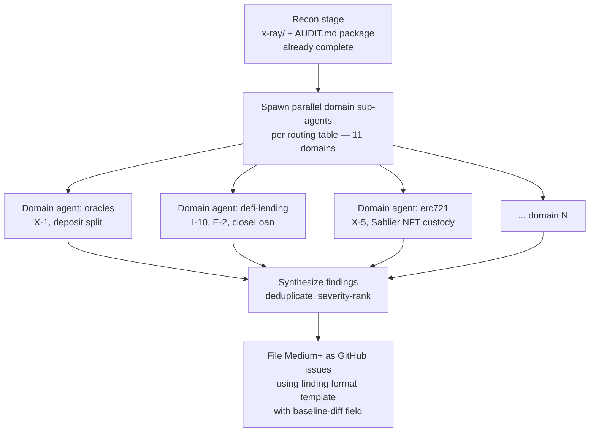

# AI Auditor Methodology Overlay for OVRFLO

## Summary

Create a methodology-overlay companion doc under `docs/audit/` that tells an AI auditor how to audit OVRFLO: the conceptual lens (incentives, CROPS, hyperstructure), an OVRFLO-mapped security-pattern checklist, a multi-agent audit pipeline with a domain-routing table and finding format, and drill-down references to evmresearch and ethskills standards. Insert a link to the overlay into `AUDIT.md`'s prescribed reading order after the scope snapshot. Doc/content layer only; no code changes.

## Problem Frame

The auditor context package (`AUDIT.md` + `docs/audit/` + `x-ray/`) gives an external auditor what OVRFLO is and where risk concentrates, but not how to run the audit as an AI agent. Five external resources (ethskills concepts, security, audit, standards; evmresearch) define a competent AI-auditor operating model: mental models to internalize, defensive patterns to check, a 20-domain parallel sub-agent pipeline, and a 400+-note knowledge graph for drill-down. None of that methodology is married to OVRFLO's surfaces. An AI auditor given only the existing package must self-assemble the audit process, decide which of the 20 domains apply, and re-derive which security patterns matter for a Pendle-wrapper vault with Sablier-stream-collateralized lending.

---

## Requirements

**Conceptual lens (from ethskills/concepts)**

- R1. The overlay inlines the three ethskills conceptual models — nothing-is-automatic (state machine + incentives), CROPS (censorship-resistance, open source, privacy, security), and the hyperstructure test — each mapped to a concrete OVRFLO surface: no on-chain timelock or pause as a centralization vector under CROPS, `closeLoan()` liveness as an incentive-aligned automatic state transition under nothing-is-automatic, and OVRFLO as a service (not a hyperstructure) because of its multisig admin.

**Security-pattern checklist (from ethskills/security)**

- R2. The overlay inlines a curated table of the security patterns from ethskills/security that apply to OVRFLO, each row mapping pattern to OVRFLO surface to status-or-probe to invariant ID. Applicable patterns include: 18-decimal PT assumption, CEI/reentrancy (Book `nonReentrant` vs vault deposit no guard), SafeERC20 usage, fee-on-transfer absence of balance-delta check, oracle TWAP freshness (onboarding-only), vault inflation via wrap-reserve donation, access control (multisig with no on-chain timelock), MEV/sandwich on time-dependent pricing, input validation, and infinite approvals to Sablier.
- R3. Patterns that do not apply to OVRFLO (delegatecall, UUPS proxies, standard ERC-4626 share inflation) are listed as "not applicable, here's why" rather than omitted, so the auditor knows they were considered.

**Multi-agent audit pipeline (from ethskills/audit)**

- R4. The overlay prescribes the ethskills audit pipeline: recon (pointer to existing `x-ray/` + `AUDIT.md` package) then spawn parallel domain sub-agents per the routing table then synthesize findings then file Medium-and-above as GitHub issues using the prescribed finding format.
- R5. The finding format is inlined: title, severity (High / Medium / Low / Gas / Informational), affected contract and entry point, violated invariant ID, precondition and attack path, recommendation, and a baseline-diff field referencing `docs/audit/rejected-findings-record.md` to avoid re-litigating settled findings.

**Domain routing table**

- R6. The overlay includes an OVRFLO routing table listing which of the 20 ethskills audit domains to spawn, with per-domain OVRFLO focus and the x-ray invariant or entry-point IDs to hand each agent. Applicable domains: general, precision-math, erc20, defi-lending, erc4626 (vault-inflation angle via wrap reserve), oracles, erc721 (Sablier stream NFTs), access-control, flashloans, dos, and governance (multisig plus two-step ownership, no on-chain timelock).
- R7. The inapplicable domains (signatures, proxies, bridges, ERC-4337, AMM, staking, assembly, chain-specific) are listed as excluded with a one-line reason each, so the auditor can confirm the cut rather than wonder whether a domain was missed.

**Knowledge graph and standards context**

- R8. The overlay links the evmresearch.io knowledge graph as a drill-down reference, flagging the areas most relevant to OVRFLO (vulnerability-patterns, exploit-analyses for lending/oracle/NFT exploits, economic-security for self-repaying-loan economics, protocol-mechanics for lending and vaults) rather than reproducing its notes.
- R9. The overlay includes a light standards-context note covering ERC-20 (`ovrfloToken`), ERC-721 (Sablier stream NFTs), and ERC-4626 (not used, with an explanation of why the vault-inflation pattern still applies via the wrap reserve), linking ethskills/standards for live EIP awareness.

**Integration with AUDIT.md**

- R10. The overlay is linked from `AUDIT.md`'s reading order as a companion, positioned after the scope snapshot and before the dependency interface contracts, so the auditor internalizes the methodology before reading the protocol-specific context.
- R11. The overlay uses the existing stable IDs (`G-/I-/X-/E-` codes and entry-point names from the regenerated `x-ray/`) in all its OVRFLO mappings, consistent with the citation graph already established in `AUDIT.md`.

---

## Key Technical Decisions

- KTD1. **`execution: knowledge-work` routing.** The deliverable is documentation, not contract code, so `ce-work` routes to the non-code path and skips the branch/test/CI lifecycle. Matches the prior auditor-context-package plan's routing.
- KTD2. **File placement at `docs/audit/ai-auditor-methodology.md`.** Seventh companion doc under `docs/audit/`, consistent with the existing directory layout. Each companion stays focused and independently maintainable; `AUDIT.md` at repo root remains the front door.
- KTD3. **AUDIT.md reading-order insertion as new item 2.** The overlay becomes the second reading-order step (after scope snapshot, before dependency contracts), renumbering existing items 2-6 to 3-7. Rationale: the auditor should internalize the methodology before reading protocol-specific context, not after.
- KTD4. **Domain routing table scopes 11 of 20 ethskills audit domains.** The 11 applicable domains are routed with per-domain OVRFLO focus; the 9 inapplicable domains are listed with one-line exclusion reasons. ERC-4626 is included despite OVRFLO not being ERC-4626 because the vault-inflation / reserve-donation pattern applies via the wrap reserve. Governance is included because the multisig-plus-two-step-ownership model with no on-chain timelock is an access-control surface worth a dedicated agent.
- KTD5. **Security-pattern table uses a four-column row shape: pattern, OVRFLO surface, status/probe, invariant ID.** Mirrors the assumed-property, enforcement, failure-mode row shape already used in `docs/audit/pendle-interface-contract.md` and `docs/audit/trust-assumption-ledger.md`, keeping the package visually consistent.
- KTD6. **Finding format includes a baseline-diff field.** Every finding must reference `docs/audit/rejected-findings-record.md` to confirm it is not a re-litigation of settled conclusions (H-2, M-5, L-1, M-4, audit-report I-1 through I-4). Rationale: prevents the auditor from re-raising findings the internal review already closed.
- KTD7. **Conceptual lens rendered as a three-row table: model, OVRFLO mapping, probe direction.** Consistent with the companion-doc table style; a table scans faster than prose for three parallel mappings and gives the auditor an actionable "probe direction" column.

---

## High-Level Technical Design

The pipeline is linear at the frame level (recon, spawn, synthesize, file) and fan-out at the domain level. The recon stage is a pointer, not a re-specification: the `x-ray/` package and `AUDIT.md` spine already generated this session serve as the recon input. Each domain agent receives its OVRFLO focus and invariant/entry-point IDs from the routing table, runs its ethskills checklist, and returns findings. Synthesis deduplicates across domains and severity-ranks. Filing uses the finding-format template with the baseline-diff field.

---

## Implementation Units

### U1. Overlay doc — conceptual lens, security-pattern checklist, standards context

- **Goal:** Author the first half of the methodology overlay: the purpose framing, the conceptual lens mapped to OVRFLO, the curated security-pattern checklist, the not-applicable patterns list, the light standards-context note, and the evmresearch drill-down reference.
- **Requirements:** R1, R2, R3, R8, R9.
- **Dependencies:** none (foundational; U2 appends to the same file, U3 links to it).
- **Files:** `docs/audit/ai-auditor-methodology.md` (create).
- **Approach:** Six blocks in order. (1) Purpose: one paragraph framing this as the HOW companion to `AUDIT.md`'s WHAT, with a pointer to the recon stage (`x-ray/` + `AUDIT.md` package already complete). (2) Conceptual lens: a three-row table per KTD7 — nothing-is-automatic (map: `closeLoan()` liveness, oracle freshness not rechecked), CROPS (map: no on-chain timelock/pause = centralization vector, open-source yes, privacy n/a, security via multisig), hyperstructure test (map: OVRFLO is a service not a hyperstructure because of multisig admin) — each with a "probe direction" column telling the auditor what to investigate. (3) Security-pattern checklist: a table per KTD5 with ~10 rows covering the patterns listed in R2, each mapping pattern to OVRFLO surface (with `file:line` or entry-point name) to status/probe to invariant ID. Source the pattern catalog from ethskills/security; source the OVRFLO mappings from `x-ray/invariants.md` and the existing companion docs. (4) Not-applicable patterns: a short list per R3 covering delegatecall (none in scope), UUPS proxies (no upgradeable contracts), standard ERC-4626 share inflation (not ERC-4626, but note the wrap-reserve donation angle that IS applicable), each with a one-line reason. (5) Standards context: a light note per R9 covering ERC-20 (`ovrfloToken`), ERC-721 (Sablier stream NFTs), ERC-4626 (not used, explain why vault-inflation still applies via wrap reserve), linking ethskills/standards for live EIP awareness. (6) evmresearch drill-down: a short reference paragraph per R8 flagging the four most relevant knowledge-graph areas (vulnerability-patterns, exploit-analyses, economic-security, protocol-mechanics) with a link to `evmresearch.io/index`.
- **Patterns to follow:** Row shape from `docs/audit/pendle-interface-contract.md` (assumed property, enforcement, failure mode); table style from `docs/audit/trust-assumption-ledger.md` (ID, belief, enforced, failure mode, accept/challenge); heading-anchor style from existing companion docs.
- **Test expectation:** none -- documentation unit; verified by review against the acceptance criteria below.
- **Verification:** Reviewer confirms the conceptual-lens table has three rows each with an OVRFLO mapping and probe direction; that the security-pattern table has ~10 rows each with pattern, surface, status/probe, and invariant ID; that the not-applicable list covers delegatecall, UUPS, and standard ERC-4626 with reasons; that the standards note covers ERC-20, ERC-721, and ERC-4626; and that evmresearch is linked with the four flagged areas.

### U2. Overlay doc — multi-agent pipeline, domain routing table, finding format

- **Goal:** Author the second half of the methodology overlay: the multi-agent audit pipeline prescription, the OVRFLO domain routing table (11 applicable + 9 excluded), the finding-format template with baseline-diff field, and the baseline-diff note.
- **Requirements:** R4, R5, R6, R7.
- **Dependencies:** U1 (same file; appends sections after U1's content).
- **Files:** `docs/audit/ai-auditor-methodology.md` (modify — append sections).
- **Approach:** Three blocks appended after U1's content. (1) Multi-agent pipeline: a prose description of the recon, spawn, synthesize, file-issues flow per R4, with the mermaid flowchart from the HTD section rendered inline. State that recon is already complete (pointer to `x-ray/` + `AUDIT.md` package) so the auditor starts at the spawn step. Note that a single-process auditor can use the routing table as a linear checklist. (2) Domain routing table: two sub-sections per R6 and R7. The applicable-domains table has 11 rows — domain, OVRFLO focus, invariant/entry-point IDs to hand the agent — covering: general, precision-math (StreamPricing mulDiv, rounding), erc20 (ovrfloToken, PT, underlying, SafeERC20, fee-on-transfer), defi-lending (self-repaying loans, borrow/repay/close, no liquidation), erc4626 (vault-inflation via wrap-reserve donation, not standard 4626), oracles (Pendle TWAP, X-1, deposit split), erc721 (Sablier stream NFTs, transferFrom escrow, X-5), access-control (multisig/factory/vault, onlyAdmin/onlyOwner, no on-chain timelock), flashloans (oracle manipulation via flash loan, deposit split), dos (unbounded ID growth, dust griefing), governance (multisig + two-step ownership, no on-chain timelock/pause). The excluded-domains list has 9 one-line entries — signatures (no EIP-712/permits), proxies (no upgradeable contracts), bridges (mainnet only), ERC-4337 (no account abstraction), AMM (no AMM, book is orderbook), staking (no staking), assembly (no inline assembly), chain-specific (mainnet only), plus any remainder — each with a one-line reason. (3) Finding format: a template per R5 with seven fields — title, severity (High/Medium/Low/Gas/Informational), affected contract + entry point, violated invariant ID, precondition + attack path, recommendation, baseline-diff (references `docs/audit/rejected-findings-record.md`). Include a brief note on severity definitions sourced from ethskills/audit.
- **Patterns to follow:** Pipeline flowchart shape from the plan's HTD; routing-table row shape consistent with existing companion-doc tables; finding-format field structure from ethskills/audit.
- **Test expectation:** none -- documentation unit; verified by review against the acceptance criteria below.
- **Verification:** Reviewer confirms the pipeline section includes the recon pointer, the spawn/synthesize/file flow, and the single-process fallback note; that the applicable-domains table has 11 rows each with OVRFLO focus and invariant/entry-point IDs; that the excluded-domains list has 9 entries with reasons; that the finding-format template has all seven fields including the baseline-diff field; and that severity definitions are present.

### U3. AUDIT.md integration

- **Goal:** Insert the methodology overlay into `AUDIT.md`'s prescribed reading order and citation graph so an auditor encounters it before the protocol-specific context.
- **Requirements:** R10, R11.
- **Dependencies:** U1, U2 (the overlay file must exist before linking).
- **Files:** `AUDIT.md` (modify).
- **Approach:** Two edits per KTD3. (1) In the prescribed reading order, insert a new item 2 after the scope snapshot (current item 1) and before the dependency interface contracts (current item 2), renumbering existing items 2-6 to 3-7. The new item links `docs/audit/ai-auditor-methodology.md` with a one-line description ("how to audit OVRFLO as an AI agent — conceptual lens, security patterns, multi-agent pipeline, domain routing"). (2) In the citation graph table, add a row for the methodology overlay with backing evidence: ethskills external sources (concepts, security, audit, standards) and evmresearch, plus the `x-ray/` IDs it references. Do not add the overlay to the triage map or scope-exclusion log — it is methodology, not a scope or triage artifact.
- **Patterns to follow:** Reading-order item shape from existing `AUDIT.md` items; citation-graph table row shape from existing entries.
- **Test expectation:** none -- documentation unit; verified by review against the acceptance criteria below.
- **Verification:** Reviewer confirms the reading order has the methodology overlay as item 2, linking the correct path; that existing items are renumbered correctly (3-7); that the citation graph has a new row for the overlay; and that the triage map and scope-exclusion log are unchanged.

---

## Scope Boundaries

### Deferred for later

- A reusable cross-protocol AI-auditor `SKILL.md` operating manual. This overlay is OVRFLO-specific; generalizing it is a separate effort.

### Outside this overlay's identity

- The 9 inapplicable audit domains (signatures, proxies, bridges, ERC-4337, AMM, staking, assembly, chain-specific) are not routed and not inlined.
- Full reproduction of the 20-domain checklists or the evmresearch knowledge graph is explicitly excluded; those are linked for depth.
- Frontend, deployment/operational, and gas-optimization audits are out of scope; the overlay covers smart-contract security only.
- No new protocol features or contract code changes; this is a documentation-only deliverable.

---

## Risks & Dependencies

- **External source drift.** The overlay inlines curated content from ethskills and links evmresearch. If those sources change, the inlined patterns could go stale. Mitigated by linking the full external checklists for depth and framing the overlay as a curated entry point, not a substitute.
- **ID consistency.** The overlay references `G-/I-/X-/E-` IDs and entry-point names from the regenerated `x-ray/`. If `x-ray/` is regenerated again, IDs could reshuffle. Mitigated by U3 verification and the existing AUDIT.md citation graph convention of reusing stable IDs.
- **AUDIT.md reading-order disruption.** Renumbering existing items 2-6 to 3-7 could break external references to specific item numbers. Mitigated by the fact that reading-order items are positional (not IDed), and the renumber is a simple shift.
- **Dependency on existing artifacts.** Builds on `AUDIT.md`, `docs/audit/` companion docs, and the `x-ray/` suite; if those change during authoring, the overlay must re-sync.

---

## Open Questions

- None blocking. The brainstorm resolved the three blocking questions (file role, depth, execution model). The 11-domain routing cut and the ERC-4626/governance borderline calls were confirmed in the brainstorm synthesis.

---

## Sources & Research

- Origin: `docs/brainstorms/2026-06-26-ai-auditor-methodology-overlay-requirements.md` (R1-R11, KD1-KD6, scope boundaries).
- `ethskills.com/concepts/SKILL.md` — conceptual lens: nothing-is-automatic, CROPS, hyperstructure test.
- `ethskills.com/security/SKILL.md` — defensive security pattern catalog (decimals, CEI, SafeERC20, oracle safety, vault inflation, access control, MEV, UUPS, EIP-712/delegatecall, pre-deploy checklist).
- `ethskills.com/audit/SKILL.md` — 20-domain checklist system, parallel sub-agent methodology, routing table, finding format and severity definitions.
- `ethskills.com/standards/SKILL.md` — live ERC/EIP awareness (ERC-20, ERC-721, ERC-4626, EIP-7702, ERC-4337).
- `evmresearch.io/index` — 400+-note linked knowledge graph across seven areas.
- `AUDIT.md` — current reading order (6 items) and citation graph to insert into.
- `x-ray/invariants.md` — G-1..G-18, I-1..I-13, X-1..X-5, E-1..E-3, On-chain: No flags.
- `x-ray/entry-points.md` — 42 entry points (14 permissionless, 8 role-gated, 20 admin).
- `docs/audit/pendle-interface-contract.md`, `docs/audit/trust-assumption-ledger.md` — companion-doc row/table format conventions.
