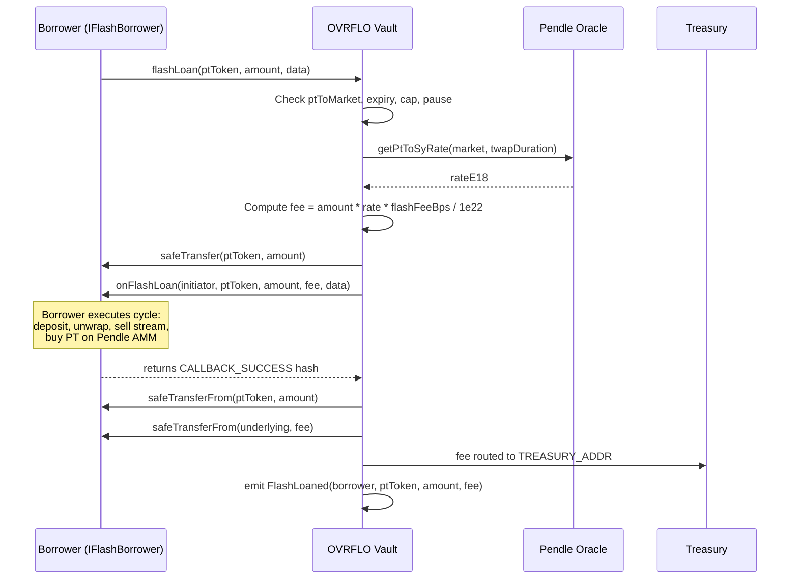

# PT Flash Loan - Plan

## Goal Capsule

- **Objective:** Add a PT flash loan facility to the OVRFLO vault that lends deposited PT atomically, charges an oracle-adjusted fee in underlying to the treasury, and uses safeTransferFrom for repayment. The treasury wraps accumulated fee revenue to fund the wrap reserve, completing the incentive loop for the OVRFLO cycle.
- **Product authority:** User-confirmed scope via ce-brainstorm dialogue. All design decisions resolved.
- **Open blockers:** None.

---

## Product Contract

### Summary

A PT flash loan on the OVRFLO vault that lets borrowers borrow deposited PT atomically, repay via safeTransferFrom, and pay an oracle-adjusted fee in underlying to the treasury. The treasury (multisig) wraps accumulated fees to fund the wrap reserve, creating the incentive loop that makes the OVRFLO cycle self-contained within OVRFLO + Pendle.

### Problem Frame

The OVRFLO cycle (deposit PT, sell stream on book, unwrap ovrfloToken) captures the fixed PT discount as extractable yield. Today the zero-capital version requires flash-loaning underlying from Aave or Balancer, swapping for PT on the Pendle AMM, then running the cycle. If no external flash loan provider supports the underlying, or no wstETH/ovrfloWSTETH swap pair exists for the ovrfloToken exit, the cycle cannot run without capital.

OVRFLO already holds deposited PT (`marketTotalDeposited`). Lending it atomically removes the external flash loan dependency entirely. The cycle becomes self-contained: flash-loan PT from OVRFLO, deposit it back, unwrap, sell stream, buy PT on the Pendle AMM for repayment. The only external venue is the Pendle AMM, which must exist because OVRFLO is built on Pendle PTs.

The flash loan generates fee revenue in underlying. Routing those fees to the treasury, which wraps them to fund the wrap reserve, creates a positive feedback loop: more flash loan activity grows the reserve, which enables larger flash loans, which generates more fees. Wrapping is incentivized because the treasury's wrapping funds the reserve that the cycle depends on.

### Key Decisions

- **D1. Oracle-adjusted fee in underlying.** The flash loan is denominated in PT but the fee is charged in underlying. The fee is computed as `amount * ptToSyRate * flashFeeBps / 1e22`, reading the same TWAP oracle (`getPtToSyRate`) that `deposit` uses. This keeps the fee proportionate to PT's current value, consistent with how the vault values PT everywhere. A PT-denominated percentage fee (`amount * flashFeeBps / 10000` in PT) has the same economic value and would eliminate the oracle read, but is rejected because the treasury receives PT instead of underlying, requiring AMM conversion before wrapping. The underlying fee lets the treasury wrap directly. A face-value flat fee in underlying (`amount * flashFeeBps / 10000`) would overcharge since PT trades below par pre-maturity.

- **D2. No nonReentrant on flashLoan.** The borrower must call `deposit` during the callback (depositing the flash-loaned PT back into the vault to receive ovrfloToken). A `nonReentrant` modifier would block this, defeating the entire cycle. The I-1 invariant (`balanceOf(vault) >= marketTotalDeposited`) breaks mid-transaction during the callback and is restored atomically by the `safeTransferFrom` repayment. Claims during the callback window revert when physical PT is short (safe, but a transient liveness gap for large claimants in the same transaction).

- **D3. safeTransferFrom repayment, not balance check.** Repayment uses `IERC20(ptToken).safeTransferFrom(msg.sender, address(this), amount)`, pulling PT from the borrower. This prevents phantom deposits: if the borrower deposits flash-loaned PT during the callback, `marketTotalDeposited` increases, but the repayment pulls fresh PT from the borrower, not from the vault's balance. A `balanceOf` check would see the vault's PT restored by the deposit and allow the borrower to keep the flash-loaned PT.

- **D4. Global flashFeeBps, admin-configurable, capped at 100 bps.** A single `flashFeeBps` storage variable applies to all markets. Mutable by the multisig through the factory's admin path. Hard-capped at `FLASH_FEE_MAX_BPS = 100` (1%), matching the existing deposit fee cap (`FEE_MAX_BPS`). The cap prevents a compromised multisig from setting a confiscatory fee.

- **D5. Global pause, admin-controlled.** A single `flashLoanPaused` bool stops all flash loans across all markets. Set by the multisig through the factory. `flashFeeBps` can be set to 0 (free) but cannot disable flash loans since the cap is 100 bps. The pause provides a circuit breaker without per-market toggles.

- **D6. Pre-maturity gate.** `flashLoan` requires `block.timestamp < info.expiryCached`. Post-maturity, the Pendle AMM is disabled and PT is only redeemable 1:1 for underlying. A flash loan post-maturity cannot be repaid (no way to acquire PT back), so the transaction reverts. The gate prevents wasted gas and a transient claim-DoS window when claim traffic peaks at maturity.

- **D7. Treasury wrapping uses existing wrap().** The treasury (multisig) receives flash loan fees at `TREASURY_ADDR` (an immutable set at factory deploy). To fund the wrap reserve, the multisig sends accumulated underlying to the vault and calls `wrap()`. No new code is needed for this. The multisig decides when and how much to wrap. If it doesn't wrap, the reserve doesn't grow from flash loan activity.

- **D8. EIP-3156-inspired callback interface.** The borrower implements `onFlashLoan(initiator, ptToken, amount, fee, data)` with callback hash verification, inspired by EIP-3156. The vault computes the expected callback hash and verifies it in the return value, ensuring only the intended vault can initiate the callback. A custom hash (`keccak256("OVRFLO.onFlashLoan")`) is used instead of the EIP-3156 standard hash to domain-separate from other flash loan protocols.

- **D9. Cap is marketTotalDeposited, not balanceOf.** The flash loan amount is capped by `marketTotalDeposited[market]`, a state variable that tracks deposited PT per market. This is not `balanceOf(vault)` because the vault's raw PT balance can be temporarily reduced by the flash loan itself, and can include PT from other sources (sweeps, donations). Using the state variable ensures the cap reflects actual depositor backing.

### Actors

- A1. **Flash loan borrower** -- a contract that implements `IFlashBorrower.onFlashLoan`. Receives PT, executes the OVRFLO cycle (deposit, unwrap, sell stream, buy PT on AMM), repays PT plus fee.
- A2. **Treasury / multisig** -- receives flash loan fees at `TREASURY_ADDR`. Wraps accumulated fees via `wrap()` to fund the wrap reserve. Sets `flashFeeBps` and `flashLoanPaused` through the factory admin path.
- A3. **Depositor** -- existing PT depositor whose PT backs the flash loan. Unaffected: their `marketTotalDeposited` claim is intact, PT is returned atomically.

### Requirements

**Flash loan function**

- R1. The vault exposes `flashLoan(address ptToken, uint256 amount, bytes calldata data) external` that atomically lends `amount` of `ptToken` to `msg.sender`, calls back `onFlashLoan`, pulls repayment via `safeTransferFrom`, and collects a fee in underlying.
- R2. `flashLoan` reverts if `ptToMarket[ptToken]` is `address(0)` (unknown PT).
- R3. `flashLoan` reverts if `block.timestamp >= _series[market].expiryCached` (post-maturity).
- R4. `flashLoan` reverts if `amount == 0` or `amount > marketTotalDeposited[market]`.
- R5. `flashLoan` reverts if `flashLoanPaused` is `true`.
- R6. PT is sent to the borrower via `safeTransfer` before the callback.
- R7. The callback is `IFlashBorrower(msg.sender).onFlashLoan(msg.sender, ptToken, amount, fee, data)` where the first argument is the initiator (`msg.sender` of `flashLoan`) and `fee` is the underlying fee amount. The return value must equal the EIP-3156-inspired callback hash; otherwise the transaction reverts.
- R8. After the callback, `amount` PT is pulled from the borrower via `safeTransferFrom(msg.sender, address(this), amount)`. If the transfer fails, the transaction reverts.
- R9. After repayment, if `flashFeeBps > 0`, the fee in underlying is pulled from the borrower via `safeTransferFrom(msg.sender, TREASURY_ADDR, fee)` and reverts on failure.
- R10. A `FlashLoaned(address indexed borrower, address indexed ptToken, uint256 amount, uint256 fee)` event is emitted on success.

**Fee calculation**

- R11. The fee is computed as `PRBMath.mulDiv(PRBMath.mulDiv(amount, rateE18, 1e18), flashFeeBps, 10000)` where `rateE18` is `IPendleOracle(oracle).getPtToSyRate(market, info.twapDurationFixed)`, using the same oracle and TWAP duration as `deposit`.
- R12. If `flashFeeBps == 0`, no fee is charged and no `safeTransferFrom` for underlying is attempted.

**Admin functions**

- R13. The vault exposes `setFlashFeeBps(uint16 feeBps) external onlyAdmin` that sets `flashFeeBps`, reverting if `feeBps > FLASH_FEE_MAX_BPS` (100).
- R14. The vault exposes `setFlashLoanPaused(bool paused) external onlyAdmin` that sets `flashLoanPaused`.
- R15. `flashFeeBps` defaults to 0 (free) at vault deployment.
- R16. `flashLoanPaused` defaults to `false` (enabled) at vault deployment.
- R17. `FLASH_FEE_MAX_BPS` is a `uint16 public constant` set to 100.

**Interface**

- R18. An `IFlashBorrower` interface is added to `interfaces/` with `function onFlashLoan(address initiator, address ptToken, uint256 amount, uint256 fee, bytes calldata data) external returns (bytes32)`.

### Key Flows

- F1. Normal flash loan cycle
  - **Trigger:** Borrower calls `flashLoan(ptToken, 100, data)`.
  - **Actors:** A1, A3
  - **Steps:** Vault checks gates (R2-R5). Vault sends 100 PT to borrower (R6). Vault calls `onFlashLoan` (R7). Borrower deposits 100 PT into vault (receives ovrfloToken + stream). Borrower unwraps ovrfloToken for underlying. Borrower sells stream on book for underlying. Borrower swaps underlying for 100 PT on Pendle AMM. Borrower returns from callback. Vault pulls 100 PT via safeTransferFrom (R8). Vault pulls fee in underlying via safeTransferFrom (R9). Vault emits FlashLoaned (R10).
  - **Outcome:** Borrower profits the yield spread minus fees. Vault's `marketTotalDeposited` increased by 100 (from the deposit). Wrap reserve decreased by the unwrapped amount. Treasury received the fee. All invariants hold at transaction boundary.

- F2. Failed repayment
  - **Trigger:** Borrower cannot repay PT (e.g., AMM swap fails, insufficient underlying).
  - **Actors:** A1
  - **Steps:** Vault sends PT. Callback executes. Borrower fails to acquire PT for repayment. `safeTransferFrom` reverts. Entire transaction reverts.
  - **Outcome:** No state changes persist. Borrower loses gas. Vault is unaffected.

- F3. Paused flash loan
  - **Trigger:** Borrower calls `flashLoan` while `flashLoanPaused == true`.
  - **Actors:** A1
  - **Steps:** R5 check fails. Transaction reverts immediately.
  - **Outcome:** No PT sent, no callback, no state changes.

- F4. Treasury wrapping
  - **Trigger:** Multisig decides to fund the wrap reserve with accumulated flash loan fees.
  - **Actors:** A2
  - **Steps:** Multisig sends underlying from `TREASURY_ADDR` to the vault. Multisig calls `wrap(amount)`. Vault receives underlying, increments `wrappedUnderlying`, mints ovrfloToken to multisig.
  - **Outcome:** Wrap reserve grows. Multisig holds ovrfloToken (can hold, sell, or distribute). No new code required.

### Acceptance Examples

- AE1. **Covers R2, R3, R4, R5.** Given the vault is deployed with an approved market. When `flashLoan` is called with an unknown PT address, or post-maturity, or amount 0, or amount exceeding `marketTotalDeposited`, or while paused. Then the transaction reverts with the corresponding error message and no state changes occur.

- AE2. **Covers R6, R7, R8, R9, R10.** Given a borrower contract implementing `IFlashBorrower` and having approved the vault for PT and underlying. When `flashLoan(ptToken, 100, data)` is called pre-maturity with sufficient `marketTotalDeposited` and `flashFeeBps = 5`. Then the borrower receives 100 PT, the callback fires, 100 PT is pulled back via `safeTransferFrom`, the oracle-adjusted fee in underlying is pulled to `TREASURY_ADDR`, and a `FlashLoaned` event is emitted with the correct amount and fee.

- AE3. **Covers R7.** Given a borrower contract whose `onFlashLoan` returns an incorrect hash. When `flashLoan` is called. Then the transaction reverts.

- AE4. **Covers R8.** Given a borrower contract that does not approve the vault for PT repayment, or does not have enough PT. When `flashLoan` is called and the callback returns the correct hash. Then the `safeTransferFrom` for PT reverts and the entire transaction reverts with no state changes.

- AE5. **Covers R12.** Given `flashFeeBps = 0`. When `flashLoan` is called and the callback succeeds. Then PT is repaid via `safeTransferFrom`, no underlying `safeTransferFrom` is attempted, and `FlashLoaned` is emitted with `fee = 0`.

- AE6. **Covers R13.** Given the multisig calls `setFlashFeeBps(150)` through the factory. Then the transaction reverts because 150 > `FLASH_FEE_MAX_BPS` (100). Given the multisig calls `setFlashFeeBps(50)`. Then `flashFeeBps` is set to 50.

- AE7. **Covers R4, D2.** Given a flash loan is in progress (callback executing). When a second `flashLoan` call is attempted (reentrancy). Then the cap check (`amount <= marketTotalDeposited`) may pass since `marketTotalDeposited` is unchanged, but the `safeTransfer` of PT reverts if the vault's physical PT balance is insufficient to disburse the second loan. No `nonReentrant` blocks the call. The cycle's deposit-during-callback path works because the deposit restores PT balance before repayment.

### Scope Boundaries

**In scope**
- `flashLoan` function on the OVRFLO vault.
- `IFlashBorrower` interface (EIP-3156-inspired) in `interfaces/`.
- `setFlashFeeBps` and `setFlashLoanPaused` admin functions on the vault, forwarded through `OVRFLOFactory`.
- `flashFeeBps` storage variable, `flashLoanPaused` bool, `FLASH_FEE_MAX_BPS` constant.
- `FlashLoaned` event.
- I-1 invariant re-scoping documentation (from "always-on" to "holds at transaction boundaries").

**Deferred for later**
- Reward accumulator or direct yield distribution to wrappers (rejected as too complex; treasury wrapping is the sole incentive).
- Per-market flash fee (global fee chosen for simplicity).
- Per-market flash loan toggle (global pause chosen; consistent with existing preference against disableSeries/enableSeries toggles).
- Multiple markets in a single flash loan call (one market per call; can be composed by calling `flashLoan` multiple times).

**Outside this product's identity**
- Floating unwrap rate or any change to the 1:1 wrap/unwrap model.
- Flash loan fee routing to the wrap reserve directly (treasury is the intermediary).
- nonReentrant on flashLoan or any existing vault function.

### Dependencies / Assumptions

- `wrap`/`unwrap` is implemented and working on `src/OVRFLO.sol` (confirmed: `src/OVRFLO.sol:285-322`).
- `TREASURY_ADDR` is an immutable set at factory deploy (confirmed: `src/OVRFLO.sol` constructor, `src/OVRFLOFactory.sol` deploy path).
- The Pendle oracle (`IPendleOracle.getPtToSyRate`) is already used by `deposit` and available as a vault-level immutable via the `oracle` state variable (confirmed: `src/OVRFLO.sol`, `address public immutable oracle`).
- `marketTotalDeposited` is a per-market state variable tracking deposited PT (confirmed: `src/OVRFLO.sol`).
- The vault's `onlyAdmin` modifier checks `msg.sender == factory` (the factory), and the factory forwards admin calls from the timelocked multisig (confirmed: `src/OVRFLO.sol`, `src/OVRFLOFactory.sol`).
- `PRBMath.mulDiv` is available for precise fee calculation (confirmed: existing usage in `src/OVRFLO.sol`).
- The treasury (multisig) will actively wrap accumulated fees to fund the wrap reserve. This is an operational assumption, not enforced on-chain.

### Outstanding Questions

**Resolve before planning**
- None. All design decisions resolved in dialogue.

**Deferred to implementation**
- Gas optimization of the oracle read in the flash loan path.
- Whether fork tests for the full OVRFLO cycle (flash loan, deposit, unwrap, AMM swap, repay) are feasible with current mainnet fork setup or need a dedicated harness.

### Product Contract Preservation

Product Contract changed: R7, R18 -- added `initiator` parameter to callback per user request during planning handoff. All other Product Contract content unchanged.

### Sources / Research

- Core: `src/OVRFLO.sol` -- `deposit` (oracle read, fee, mint, stream), `wrap`/`unwrap` (1:1 reserve), `claim` (PT burn), `marketTotalDeposited` (state variable), `onlyAdmin` modifier, `TREASURY_ADDR` immutable.
- Factory: `src/OVRFLOFactory.sol` -- `configureDeployment`/`deploy` (treasury set), `addMarket` (fee cap `FEE_MAX_BPS = 100`), admin forwarding pattern.
- Book: `src/OVRFLOBook.sol` -- `MAX_FEE_BPS = 10000` (uncapped book fee pattern).
- Token: `src/OVRFLOToken.sol` -- mint/burn restricted to owner (the vault).
- X-ray: `x-ray/flash-loan-invariant-check.md` -- full invariant verification (I-1 needs attention, I-11 needs gate, all others hold).
- AMM impact: `docs/audit/pt-flash-loan-pendle-amm-impact.md` -- one permanent swap per cycle, TWAP-resistant, post-maturity is the only concern (fixed by gate).
- Wrap/unwrap brainstorm: `docs/brainstorms/2026-06-20-ovrflo-wrap-unwrap-requirements.md` -- 1:1 model, reserve-bounded unwrap, solvency invariant.
- CONCEPTS.md: `docs/../CONCEPTS.md` -- OVRFLO cycle, wrap reserve, unwrap.

---

## Planning Contract

### Key Technical Decisions

- **KTD1. Callback hash: `keccak256("OVRFLO.onFlashLoan")`.** The EIP-3156-inspired callback success value is a domain-separated hash. This prevents a borrower contract from accidentally accepting a flash loan from a different lender. The vault checks the return value of `onFlashLoan` against this constant.

- **KTD2. Oracle read is view-only, same path as deposit.** The flash loan reads `IPendleOracle(oracle).getPtToSyRate(market, info.twapDurationFixed)` using the vault-level `oracle` immutable and the per-market `twapDurationFixed` from `SeriesInfo`. This is the same call `deposit` makes. No new oracle integration, no new state writes from the oracle path. The oracle freshness concern (X-1) is unchanged: a stale rate slightly mispriced the fee, which is harmless (no value extraction possible from fee miscalculation alone).

- **KTD3. Factory forwarding: explicit per-function, matching existing pattern.** The factory currently forwards admin calls via explicit functions (e.g., `setMarketDepositLimit(address ovrflo, address market, uint256 limit)` calls `OVRFLO(ovrflo).setMarketDepositLimit(market, limit)`). Two new functions follow the same shape: `setFlashFeeBps(address ovrflo, uint16 feeBps)` and `setFlashLoanPaused(address ovrflo, bool paused)`. No generic fallback or proxy pattern is introduced.

- **KTD4. Fee pull is after PT repayment, not before.** The order is: (1) send PT, (2) callback, (3) pull PT repayment via safeTransferFrom, (4) pull fee via safeTransferFrom. If the borrower cannot repay PT, the transaction reverts before the fee pull is attempted. This ensures the fee is only charged on successful loans.

- **KTD5. I-1 invariant re-scoping: "holds at transaction boundaries."** The existing I-1 invariant (`balanceOf(vault) >= marketTotalDeposited`) is re-scoped from "always-on" to "holds at transaction boundaries / between non-callback external calls." During the flash loan callback, physical PT balance drops below `marketTotalDeposited`. This is safe: claims during the window revert when physical PT is short (no value lost), `sweepExcessPt` returns 0 excess, and deposits pull fresh PT. The invariant is restored atomically by the `safeTransferFrom` repayment. The invariant test file (`test/OVRFLOWrapUnwrap.invariant.t.sol`) needs updating to reflect this scoped reading.

- **KTD6. No new reentrancy guard anywhere.** The vault currently has no `nonReentrant` on any function. Adding it to `flashLoan` would block the cycle (borrower deposits during callback). Adding it to other functions is out of scope. The `safeTransferFrom` repayment mechanism (D3) is the safeguard against phantom deposits, not a reentrancy lock.

### High-Level Technical Design



### Assumptions

- The oracle address is a vault-level immutable, already set at construction. The flash loan does not need a per-market oracle lookup; it uses the same `oracle` immutable as `deposit`.
- `PRBMath.mulDiv` handles the fee calculation without overflow (same pattern as deposit's `toUser` calculation).
- The borrower contract has approved the vault for both PT and underlying before calling `flashLoan`.

### Sequencing

U1 (interface) has no dependencies. U2 (vault flash loan) depends on U1. U3 (admin config) depends on U2 for the storage variables. U4 (tests) depends on U2 and U3. The natural order is U1, U2, U3, U4.

---

## Implementation Units

### U1. IFlashBorrower interface

**Goal:** Create the EIP-3156-inspired callback interface that borrower contracts implement.

**Requirements:** R18

**Dependencies:** None.

**Files:**
- `interfaces/IFlashBorrower.sol` (new)

**Approach:** A minimal Solidity interface with one function and one constant. The `CALLBACK_SUCCESS` hash is defined as a constant on the interface so both the vault and test borrower contracts reference the same value. The `initiator` parameter is `msg.sender` of the `flashLoan` call, passed through to the callback so borrower contracts can know who initiated the loan.

**Patterns to follow:** Existing interfaces in `interfaces/` use SPDX MIT, `pragma solidity ^0.8.20`, and simple function declarations without implementations (see `interfaces/IPendleOracle.sol`, `interfaces/ISablierV2LockupLinear.sol`).

**Test scenarios:**
- Test expectation: none -- interface file, no behavioral logic to test.

**Verification:** `forge build` compiles with the new interface imported by the vault.

---

### U2. Flash loan function on OVRFLO vault

**Goal:** Add the `flashLoan` function, storage variables, constant, and event to the vault.

**Requirements:** R1-R12, R15-R17

**Dependencies:** U1

**Files:**
- `src/OVRFLO.sol` (modify)
- `interfaces/IFlashBorrower.sol` (import, from U1)

**Approach:** Add three storage declarations (`flashFeeBps` as `uint16`, `flashLoanPaused` as `bool`, `FLASH_FEE_MAX_BPS` as `uint16 public constant = 100`), one event (`FlashLoaned`), and the `flashLoan` external function. The function follows this sequence: (1) resolve market from `ptToMarket`, (2) read `SeriesInfo` for expiry and TWAP duration, (3) check pause, pre-maturity, amount > 0, amount <= `marketTotalDeposited`, (4) read oracle rate, (5) compute fee, (6) `safeTransfer` PT to borrower, (7) call `onFlashLoan` with `msg.sender` as initiator, (8) verify return hash, (9) `safeTransferFrom` PT back, (10) if fee > 0, `safeTransferFrom` underlying to `TREASURY_ADDR`, (11) emit `FlashLoaned`. No `nonReentrant` modifier. The oracle read uses the same `IPendleOracle(oracle).getPtToSyRate(market, info.twapDurationFixed)` call as `deposit`.

**Technical design (directional):**
```
function flashLoan(address ptToken, uint256 amount, bytes calldata data) external {
    address market = ptToMarket[ptToken];
    require(market != address(0), "OVRFLO: unknown PT");
    SeriesInfo memory info = _series[market];
    require(!flashLoanPaused, "OVRFLO: flash paused");
    require(block.timestamp < info.expiryCached, "OVRFLO: matured");
    require(amount > 0, "OVRFLO: zero flash");
    require(amount <= marketTotalDeposited[market], "OVRFLO: exceeds deposited");

    uint256 rateE18 = IPendleOracle(oracle).getPtToSyRate(market, info.twapDurationFixed);
    uint256 fee = flashFeeBps == 0 ? 0 :
        PRBMath.mulDiv(PRBMath.mulDiv(amount, rateE18, WAD), flashFeeBps, BASIS_POINTS);

    IERC20(ptToken).safeTransfer(msg.sender, amount);
    bytes32 ret = IFlashBorrower(msg.sender).onFlashLoan(msg.sender, ptToken, amount, fee, data);
    require(ret == IFlashBorrower.CALLBACK_SUCCESS, "OVRFLO: callback failed");
    IERC20(ptToken).safeTransferFrom(msg.sender, address(this), amount);
    if (fee > 0) {
        IERC20(underlying).safeTransferFrom(msg.sender, TREASURY_ADDR, fee);
    }
    emit FlashLoaned(msg.sender, ptToken, amount, fee);
}
```

**Patterns to follow:** `deposit` function in `src/OVRFLO.sol` for oracle read pattern, `PRBMath.mulDiv` usage, `SafeERC20` transfer patterns, error message convention (`"OVRFLO: <reason>"`).

**Test scenarios:**
- Covers AE1. Unknown PT address reverts with "OVRFLO: unknown PT".
- Covers AE1. Post-maturity call reverts with "OVRFLO: matured".
- Covers AE1. Amount 0 reverts with "OVRFLO: zero flash".
- Covers AE1. Amount exceeding `marketTotalDeposited` reverts with "OVRFLO: exceeds deposited".
- Covers AE1. Paused flash loan reverts with "OVRFLO: flash paused".
- Covers AE2. Happy path: borrower receives PT, callback fires, PT repaid, fee pulled, event emitted.
- Covers AE3. Borrower returning wrong hash reverts.
- Covers AE4. Borrower not approving PT repayment causes revert.
- Covers AE5. `flashFeeBps = 0`: no underlying transfer attempted, event has `fee = 0`.
- Covers AE7. Reentrant `flashLoan` during callback succeeds if combined amount <= `marketTotalDeposited`.
- Reentrancy: borrower calls `deposit` during callback with flash-loaned PT. `marketTotalDeposited` increases, vault PT balance restored. Repayment `safeTransferFrom` pulls fresh PT from borrower. State is consistent at transaction boundary.
- Reentrancy: borrower calls `claim` during callback. If physical PT balance is insufficient, `safeTransfer` in `claim` reverts. No value lost.
- Reentrancy: borrower calls `unwrap` during callback. Works normally (wrap reserve untouched by flash loan).
- `FlashLoaned` event emitted with correct `borrower`, `ptToken`, `amount`, `fee` values.

**Verification:** `forge build` succeeds. Unit tests pass for all gate conditions and the happy path.

---

### U3. Admin config functions on vault and factory

**Goal:** Add `setFlashFeeBps` and `setFlashLoanPaused` to the vault, with matching forwarding functions on the factory.

**Requirements:** R13-R14

**Dependencies:** U2 (storage variables must exist)

**Files:**
- `src/OVRFLO.sol` (modify)
- `src/OVRFLOFactory.sol` (modify)

**Approach:** Two `onlyAdmin` functions on the vault: `setFlashFeeBps(uint16 feeBps)` reverts if `feeBps > FLASH_FEE_MAX_BPS`, and `setFlashLoanPaused(bool paused)` sets the bool. Two `onlyOwner` functions on the factory: `setFlashFeeBps(address ovrflo, uint16 feeBps)` and `setFlashLoanPaused(address ovrflo, bool paused)`, each calling `_requireKnownOvrflo` then forwarding to the vault. This matches the existing `setMarketDepositLimit` forwarding pattern exactly.

**Patterns to follow:** `setMarketDepositLimit` on `src/OVRFLO.sol` (onlyAdmin, emit event) and `setMarketDepositLimit` on `src/OVRFLOFactory.sol` (onlyOwner, `_requireKnownOvrflo`, forward call). Add `FlashFeeBpsSet` and `FlashLoanPausedSet` events on the vault, matching the `MarketDepositLimitSet` event pattern.

**Test scenarios:**
- Covers AE6. `setFlashFeeBps(150)` reverts because 150 > `FLASH_FEE_MAX_BPS` (100).
- Covers AE6. `setFlashFeeBps(50)` sets `flashFeeBps` to 50.
- `setFlashFeeBps(0)` sets `flashFeeBps` to 0 (free flash loans).
- `setFlashFeeBps(100)` sets `flashFeeBps` to 100 (maximum).
- Non-admin calling `setFlashFeeBps` reverts with "OVRFLO: not admin".
- Non-owner calling factory's `setFlashFeeBps` reverts with Ownable error.
- `setFlashLoanPaused(true)` pauses flash loans; subsequent `flashLoan` calls revert.
- `setFlashLoanPaused(false)` unpauses; `flashLoan` works again.
- Factory forwarding: calling `factory.setFlashFeeBps(ovrflo, 50)` sets the vault's `flashFeeBps` to 50.
- Factory forwarding: calling `factory.setFlashLoanPaused(ovrflo, true)` sets the vault's `flashLoanPaused` to true.

**Verification:** `forge build` succeeds. Admin function tests pass.

---

### U4. Flash loan test suite

**Goal:** Comprehensive test coverage for the flash loan feature, including reentrancy paths and the core OVRFLO cycle.

**Requirements:** All R-IDs, all AE-IDs

**Dependencies:** U2, U3

**Files:**
- `test/OVRFLOFlashLoan.t.sol` (new)
- `test/OVRFLOWrapUnwrap.invariant.t.sol` (modify -- update I-1 invariant for transaction-boundary scoping)
- `test/fork/OVRFLOFlashLoanFork.t.sol` (new -- optional, for oracle-dependent fee calculation with real Pendle oracle)

**Approach:** Unit tests use a mock borrower contract that implements `IFlashBorrower` and can be configured to execute specific actions during the callback (deposit, unwrap, claim, re-enter flashLoan, or do nothing). A mock oracle provides controlled `getPtToSyRate` return values for fee calculation tests. The invariant test file is updated to scope I-1 to transaction boundaries, acknowledging the transient mid-transaction gap during flash loan callbacks. Fork tests validate the oracle-adjusted fee calculation against real Pendle mainnet state.

**Patterns to follow:** `test/OVRFLO.t.sol` for unit test setup (deploy vault, token, mock series), `test/OVRFLOWrapUnwrap.t.sol` for wrap/unwrap test patterns, `test/fork/OVRFLOForkBase.t.sol` for fork test base setup.

**Test scenarios:**
- All scenarios listed in U2 and U3.
- Full cycle integration: borrower flash-loans PT, deposits during callback, unwraps, and repays -- verify final state (marketTotalDeposited increased, wrappedUnderlying decreased, treasury received fee, borrower holds ovrfloToken from deposit).
- Callback that calls `wrap` during flash loan: verify wrap reserve increases, no interference with flash loan repayment.
- Callback that calls `sweepExcessPt` during flash loan: reverts because borrower is not admin.
- Multiple sequential flash loans in the same transaction (borrower re-enters flashLoan for a different PT token): verify both succeed independently.
- `flashFeeBps` change between flash loans: verify each loan uses the fee rate active at its execution time.
- Invariant test update: I-1 holds at transaction boundaries, not during callbacks. Verify that after a flash loan transaction completes, `balanceOf(vault) >= marketTotalDeposited` is restored.

**Verification:** `forge test --match-contract OVRFLOFlashLoan` passes. `forge test --match-contract OVRFLOWrapUnwrapInvariant` passes with updated I-1 scoping. `forge build` succeeds.

---

## Verification Contract

| Gate | Command | Applies to |
|------|---------|-----------|
| Compile | `forge build` | All units |
| Unit tests | `forge test --match-contract OVRFLOFlashLoan` | U2, U3, U4 |
| Invariant tests | `forge test --match-contract OVRFLOWrapUnwrapInvariant` | U4 (I-1 re-scoping) |
| Existing tests | `forge test` | Ensure no regressions in deposit, claim, wrap, unwrap, book |
| Fork tests (optional) | `forge test --match-contract OVRFLOFlashLoanFork` | U4 (oracle-dependent fee calc) |
| Format | `forge fmt` | All modified files |

## Definition of Done

- `flashLoan` function is implemented on `src/OVRFLO.sol` with all gates (R2-R5), oracle-adjusted fee (R11), safeTransferFrom repayment (R8), fee pull (R9), and event emission (R10).
- `IFlashBorrower` interface exists in `interfaces/IFlashBorrower.sol` with `initiator` parameter (R18).
- `setFlashFeeBps` and `setFlashLoanPaused` are implemented on both `src/OVRFLO.sol` and `src/OVRFLOFactory.sol` (R13-R14).
- `flashFeeBps` defaults to 0, `flashLoanPaused` defaults to false, `FLASH_FEE_MAX_BPS` is 100 (R15-R17).
- No `nonReentrant` modifier on `flashLoan` or any existing vault function (D2, KTD6).
- I-1 invariant is re-scoped to transaction boundaries in the invariant test file (KTD5).
- All unit tests pass including reentrancy paths (deposit during callback, claim during callback, wrap during callback).
- Existing test suite passes with no regressions.
- `forge build` and `forge fmt` succeed.
- No abandoned or experimental code left in the diff.
