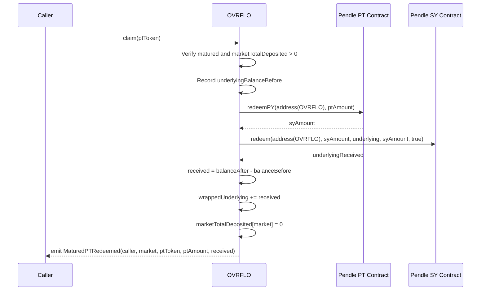

# Redeem Matured PT to Wrap Reserve - Plan

## Goal Capsule

- **Objective:** Replace the per-user `claim()` (burn ovrfloToken, transfer PT) with a permissionless protocol-level function that redeems all matured PT through Pendle and routes the underlying into the wrap reserve, so users exit via `unwrap()`.
- **Product authority:** User-directed design decision; confirmed via brainstorm dialogue.
- **Open blockers:** None. All key decisions resolved.
- **Execution profile:** Code. Standard depth, 5 implementation units.
- **Tail ownership:** Implementer owns commit/PR. User reviews before merge.

---

## Product Contract

Product Contract unchanged from brainstorm.

### Summary

Replace `claim()` with a permissionless function that atomically redeems all matured PT for a market through Pendle (PT -> SY -> underlying) and adds the received underlying to `wrappedUnderlying`. Users then exit post-maturity via the existing `unwrap()` function. The old per-user claim path (burn ovrfloToken, transfer PT) is removed entirely.

### Problem Frame

Currently, post-maturity exit requires users to call `claim()` to receive PT tokens, then separately go to Pendle to redeem those PT for underlying. This is a two-step, two-protocol UX friction. The protocol already holds the PT and already has a wrap/unwrap mechanism for underlying. By having the protocol redeem the PT itself and route the underlying into the wrap reserve, users get a single-step exit (`unwrap()`) without ever touching Pendle.

### Key Decisions

- **Permissionless `claim()`** -- Anyone can call it, same pattern as `closeLoan` in OVRFLOBook. The caller pays gas; all users benefit. No admin gate needed since the function only fills the wrap reserve and cannot misroute funds.

- **Redeem ALL PT per market** -- One call drains all PT for a given market and fills the wrap reserve fully. Post-maturity PT redemption is 1:1 for the yield token (confirmed via Pendle V2 docs and SY mechanics), so there is no slippage or liquidity risk from a single large redemption. This avoids the coordination problem of incremental partial redemptions.

- **Remove old per-user claim path** -- The old `claim(address ptToken, uint256 amount)` that burned ovrfloToken and transferred PT is removed. `unwrap()` is the only post-maturity exit. This simplifies the contract surface and eliminates the two-protocol UX.

- **Atomic two-step redemption** -- `claim()` does both PT->SY (via `redeemPY`) and SY->underlying (via `SY.redeem`) in one transaction. Users never see or interact with SY. The before/after underlying balance check captures the exact amount received.

- **Per-market, not all-markets** -- `claim()` takes a `ptToken` parameter to specify which market to redeem, matching the current function signature shape. Different markets mature at different times.

### Requirements

**Claim function**

- R1. `claim()` is permissionless (no access control). Anyone may call it for any matured market.
- R2. `claim()` accepts a `ptToken` address parameter identifying the market to redeem.
- R3. `claim()` reverts if the market has not yet matured (`block.timestamp < expiryCached`).
- R4. `claim()` reverts if there is no PT to redeem (`marketTotalDeposited[market] == 0`).
- R5. `claim()` redeems the full PT balance for that market through Pendle: PT -> SY via `redeemPY`, then SY -> underlying via `SY.redeem` with `tokenOut = underlying` and `minTokenOut = syAmount` (the `redeemPY` return value). This enforces the expected 1:1 redemption and reverts if less underlying is received, protecting the supply invariant.
- R6. `claim()` measures underlying received via before/after balance check on `IERC20(underlying).balanceOf(address(this))`.
- R7. `claim()` adds the measured underlying amount to `wrappedUnderlying`.
- R8. `claim()` sets `marketTotalDeposited[market] = 0` after successful redemption.
- R9. `claim()` is protected by `nonReentrant` since it interacts with external contracts (PT and SY).

**Old claim removal**

- R10. The old per-user claim behavior (burn ovrfloToken, transfer PT) is removed entirely.
- R11. The `Claimed` event is replaced with an event that reflects the new semantics (caller, market, ptToken, ptAmount redeemed, underlying received).

**View function updates**

- R12. `claimablePt()` retains its current implementation (returns PT balance). Natspec updated to reflect "pending protocol redemption" semantics rather than "user-claimable PT."

**Interface updates**

- R13. `IPPrincipalToken` interface gains `redeemPY(address receiver, uint256 amountPYToRedeem) returns (uint256 amountSyOut)` to enable PT -> SY redemption.

### Key Flows

- F1. Post-maturity redemption and exit
  - **Trigger:** A market has matured (`block.timestamp >= expiryCached`). Someone calls `claim(ptToken)`.
  - **Actors:** Caller (anyone), OVRFLO contract, Pendle PT contract, Pendle SY contract.
  - **Steps:** Caller invokes `claim(ptToken)` -> OVRFLO verifies maturity and non-zero PT balance -> OVRFLO records underlying balance before -> OVRFLO calls `IPPrincipalToken(ptToken).redeemPY(address(this), ptBalance)` receiving SY -> OVRFLO calls `IStandardizedYield(sy).redeem(address(this), syAmount, underlying, syAmount, true)` receiving underlying -> OVRFLO records underlying balance after -> OVRFLO adds `received = after - before` to `wrappedUnderlying` -> OVRFLO sets `marketTotalDeposited[market] = 0` -> event emitted.
  - **Outcome:** Wrap reserve is funded with underlying. All ovrfloToken holders for this market can now `unwrap()` to receive underlying 1:1.
  - **Covered by:** R1-R9, R13.

- F2. User exit after redemption
  - **Trigger:** `claim()` has been called for a matured market. A user wants to exit.
  - **Actors:** User, OVRFLO contract.
  - **Steps:** User calls `unwrap(amount)` -> OVRFLO checks `wrappedUnderlying >= amount` -> OVRFLO burns `amount` ovrfloToken from user -> OVRFLO transfers `amount` underlying to user -> OVRFLO decrements `wrappedUnderlying`.
  - **Outcome:** User receives underlying. No Pendle interaction required.
  - **Covered by:** R10 (old claim removed, unwrap is the only exit).

### Scope Boundaries

- **In scope:** `claim()` redesign in `src/OVRFLO.sol`, `IPPrincipalToken` interface update, event changes, view function updates, test updates, CONCEPTS.md vocabulary update.
- **Deferred for later:** Gas incentivization for the permissionless caller. Claiming for all markets in one call (per-market is sufficient; a batch wrapper can be added later). Frontend update: `web/components/ClaimModal.tsx` calls the old `claim(address, uint256)` and there is no unwrap UI -- the frontend needs a new exit flow (call `claim(ptToken)` then `unwrap(amount)`) to replace the current claim modal.
- **Outside this product's identity:** Changing the deposit flow, wrap/unwrap mechanics, or Sablier stream structure.

### Dependencies / Assumptions

- Post-maturity PT redemption is 1:1 for the yield token (`underlying`). Confirmed via Pendle V2 documentation and SY mechanics: `redeemPY` gives SY 1:1 at maturity, and `SY.redeem` with `tokenOut = yieldToken` gives the yield token 1:1.
- The SY address for a given PT is obtainable via `IPPrincipalToken(ptToken).SY()`.
- `underlying` is a valid `tokenOut` for the SY contract, guaranteed by the factory's `IStandardizedYield(sy).yieldToken() == info.underlying` validation at market approval time.
- `CONCEPTS.md` states PT-backing and wrap-reserve must remain separately accounted. Post-maturity, PT = underlying, so merging them into the wrap reserve does not violate this principle.

### Sources / Research

- Pendle V2 PT documentation: https://docs.pendle.finance/pendle-v2/ProtocolMechanics/YieldTokenization/PT -- confirms PT redeems 1:1 for the accounting asset at maturity.
- Pendle V2 `IStandardizedYield` source: https://github.com/pendle-finance/pendle-core-v2-public/blob/main/contracts/interfaces/IStandardizedYield.sol -- confirms `redeem()` accepts `tokenOut` parameter and `yieldToken()` returns the yield-bearing token.
- Current `claim()` implementation: `src/OVRFLO.sol` -- burns ovrfloToken, transfers PT 1:1, never touches Pendle.
- Factory SY validation: `src/OVRFLOFactory.sol` -- validates `yieldToken() == underlying` at market approval.
- Existing invariant: `test/OVRFLOInvariant.t.sol` R1: `totalSupply == marketTotalDeposited + wrappedUnderlying`.

---

## Planning Contract

### Key Technical Decisions

- **KTD1. SY address via `IPPrincipalToken.SY()`** -- The PT contract exposes `SY()` which returns the SY address directly. This avoids importing `IPendleMarket` and calling `readTokens()`. The factory already validated the SY at approval time, so the address is trustworthy.

- **KTD2. Redeem `marketTotalDeposited[market]`, not raw PT balance** -- The accounting-tracked amount is the correct redemption size. Any PT balance above `marketTotalDeposited` is excess from direct transfers and remains sweepable by admin via `sweepExcessPt`. This maintains the existing accounting separation.

- **KTD3. Before/after balance check with minTokenOut enforcement** -- Record `IERC20(underlying).balanceOf(address(this))` before and after the two-step redemption. `received = after - before`. This captures the exact amount regardless of rounding, and is the amount added to `wrappedUnderlying`. The `SY.redeem` call sets `minTokenOut = syAmount` (the `redeemPY` return value), enforcing the expected 1:1 redemption. If `SY.redeem` returns less than `syAmount`, the transaction reverts before `marketTotalDeposited` is zeroed, protecting the supply invariant.

- **KTD4. `nonReentrant` on claim()** -- claim() calls external contracts (PT `redeemPY`, SY `redeem`). Adding `nonReentrant` follows the same pattern as `flashLoan()` and protects against reentrancy via Pendle callbacks.

- **KTD5. Supply invariant preservation** -- The invariant `totalSupply == Σ marketTotalDeposited + wrappedUnderlying` holds because claim() sets `marketTotalDeposited[market] = 0` (decreasing left side by X) and adds `received` to `wrappedUnderlying` (increasing right side by X). Since PT->SY->yield-token redemption is 1:1, `received == X` and the invariant holds exactly.

- **KTD6. `claimablePt` retains implementation** -- Still returns `IERC20(ptToken).balanceOf(address(this))`. Before claim(), this shows pending redemption amount. After claim(), returns 0. Renaming would break the ABI; natspec updated instead.

- **KTD7. Mock strategy for unit tests** -- Unit tests use `MockERC20Metadata` for PT, which does not implement `IPPrincipalToken`. Use `vm.mockCall` to mock `redeemPY` (return SY amount) and `SY()` (return mock SY address), and `vm.mockCall` on the mock SY address for `redeem` (return underlying amount). The actual underlying balance change is simulated via `deal` on the underlying token. The fork test validates real Pendle behavior.

### High-Level Technical Design

### Assumptions

- Pendle V2 `redeemPY` returns exactly `amountPYToRedeem` SY at maturity (1:1, no rounding). This is a direct burn/mint with no division.
- Pendle V2 `SY.redeem` with `tokenOut = yieldToken` returns exactly `amountSharesToRedeem` yield tokens (1:1, no exchange rate conversion for the yield token).
- The `burnFromInternalBalance = true` flag on `SY.redeem` burns SY from `address(this)` without requiring prior approval, since the caller is the SY holder.

### Sequencing

U1 (interface) -> U2 (contract + unit tests) -> U3 (invariant tests) -> U4 (fork test) -> U5 (CONCEPTS.md). U1 is a prerequisite for U2. U3 and U4 depend on U2. U5 depends on U2. U3 and U4 can run in parallel after U2.

---

## Implementation Units

### U1. Add `redeemPY` to IPPrincipalToken interface

- **Goal:** Enable PT-to-SY redemption at the interface level by adding the missing `redeemPY` function declaration.
- **Requirements:** R13.
- **Dependencies:** None.
- **Files:** `interfaces/IPPrincipalToken.sol`
- **Approach:** Add `function redeemPY(address receiver, uint256 amountPYToRedeem) external returns (uint256 amountSyOut)` to the interface. Include natspec noting post-maturity this is 1:1.
- **Patterns to follow:** Match the style of existing interface declarations in the file.
- **Test expectation:** none -- interface-only change, no behavioral test needed.
- **Verification:** `forge build` compiles successfully with the new interface declaration.

---

### U2. Rewrite claim() and update unit tests

- **Goal:** Replace the per-user claim with permissionless protocol-level PT redemption that funds the wrap reserve. Update all unit tests for the new semantics.
- **Requirements:** R1-R12.
- **Dependencies:** U1.
- **Files:** `src/OVRFLO.sol`, `test/OVRFLO.t.sol`
- **Approach:**
  - Add imports for `IPPrincipalToken` and `IStandardizedYield` to `src/OVRFLO.sol`.
  - Replace `claim(address ptToken, uint256 amount)` with `claim(address ptToken)` (no amount parameter, permissionless, `nonReentrant`).
  - New claim body: verify maturity and non-zero `marketTotalDeposited`, record underlying balance before, call `redeemPY` then `SY.redeem` with `minTokenOut = syAmount` (enforces 1:1 redemption), record balance after, add `received` to `wrappedUnderlying`, set `marketTotalDeposited = 0`, emit new event.
  - Replace `Claimed` event with `MaturedPTRedeemed(address indexed caller, address indexed market, address indexed ptToken, uint256 ptAmount, uint256 underlyingReceived)`.
  - Update `claimablePt` natspec to "pending protocol redemption" semantics.
  - Rewrite all existing claim unit tests for new function signature and behavior.
  - Add `vm.mockCall` mocks for `redeemPY`, `SY()`, and `SY.redeem` in test setup.
- **Patterns to follow:** `flashLoan()` for `nonReentrant` + external call pattern; `closeLoan` in OVRFLOBook for permissionless caller-pays-gas pattern; existing `_deposit` / `_approveSeries` test helpers for setup.
- **Test scenarios:**
  - **Happy path:** Matured market with deposited PT. Call `claim(ptToken)`. Assert `marketTotalDeposited == 0`, `wrappedUnderlying` increased by redeemed amount, `MaturedPTRedeemed` event emitted with correct values. Covers R1, R5-R8.
  - **Permissionless access:** Call `claim()` from a non-admin address. Assert it succeeds. Covers R1.
  - **Post-claim unwrap:** After `claim()`, a depositor calls `unwrap(amount)`. Assert underlying transferred to user, `wrappedUnderlying` decremented. Covers F2, R10.
  - **Post-claim unwrap by wrapper:** A user who wrapped (not deposited) calls `unwrap` after `claim()`. Assert they can also unwrap. Covers F2.
  - **Revert: unmatured market:** Call `claim()` before `expiryCached`. Assert reverts with "OVRFLO: not matured". Covers R3.
  - **Revert: nothing to redeem:** Call `claim()` when `marketTotalDeposited == 0`. Assert reverts. Covers R4.
  - **Revert: unknown PT:** Call `claim()` with an unregistered ptToken. Assert reverts with "OVRFLO: unknown PT". Covers R2.
  - **Double claim:** Call `claim()` twice. Second call reverts (marketTotalDeposited == 0). Covers R4, R8.
  - **claimablePt after claim:** Assert `claimablePt` returns 0 after `claim()`. Assert it returns PT balance before `claim()`. Covers R12.
  - **Old claim removed:** Verify the old `claim(address, uint256)` signature no longer exists. Calling with two args reverts. Covers R10.
  - **minTokenOut enforcement:** Mock `SY.redeem` to return less than `syAmount`. Assert `claim()` reverts (minTokenOut check fails). Covers R5.
- **Verification:** `forge build` compiles. `forge test --match-contract OVRFLOTest` passes all claim-related tests. `forge fmt` clean.

---

### U3. Update invariant tests

- **Goal:** Rewrite claim handlers in invariant test suites to use the new permissionless claim. Verify the supply invariant holds under the new redemption flow.
- **Requirements:** R1-R8 (invariant preservation).
- **Dependencies:** U2.
- **Files:** `test/OVRFLOInvariant.t.sol`, `test/OVRFLOWrapUnwrap.invariant.t.sol`
- **Approach:**
  - In both invariant test files, rewrite the `claim()` handler: instead of burning user ovrfloToken and transferring PT, call the new `claim(ptToken)` (no amount, permissionless). Warp to expiry first if needed.
  - Add `unwrap()` calls to the handler repertoire so the fuzzer exercises post-claim exits.
  - Mock `redeemPY` and `SY.redeem` in the handler setup using `vm.mockCall`.
  - Verify `invariant_SupplyEqualsPtBackingPlusUnderlyingReserve` (R1) still holds: `totalSupply == Σ marketTotalDeposited + wrappedUnderlying`. Since claim sets `marketTotalDeposited = 0` and adds `received` to `wrappedUnderlying`, and redemption is 1:1, the invariant holds.
  - Verify `invariant_UnderlyingBalanceGteWrappedReserve` (R3) still holds: `wrappedUnderlying <= underlying.balanceOf(vault)`. Since `SY.redeem` sends underlying to `address(this)`, the raw balance increases alongside `wrappedUnderlying`.
- **Patterns to follow:** Existing invariant handler patterns in both files (bounding amounts, warping to expiry, using `vm.mockCall`).
- **Test scenarios:**
  - **Invariant: supply equals backing plus reserve:** After fuzzing deposit + claim + wrap + unwrap, assert `totalSupply == Σ marketTotalDeposited + wrappedUnderlying` at every invariant check.
  - **Invariant: underlying balance >= wrapped reserve:** After fuzzing, assert `wrappedUnderlying <= IERC20(underlying).balanceOf(address(ovrflo))`.
  - **Invariant: PT balance >= deposited:** After fuzzing, assert `marketTotalDeposited[market] <= IERC20(pt).balanceOf(address(ovrflo))` for each market.
- **Verification:** `forge test --match-contract OVRFLOInvariant` passes. `forge test --match-contract OVRFLOWrapUnwrapInvariant` passes. 500 runs, depth 25.

---

### U4. Update fork test for real Pendle redemption

- **Goal:** Validate the new claim() against real Pendle mainnet contracts, confirming PT->SY->underlying redemption works end-to-end.
- **Requirements:** R5, R6, R7, R8.
- **Dependencies:** U2.
- **Files:** `test/fork/OVRFLOMainnetFork.t.sol`
- **Approach:**
  - Update `test_Claim_PrimaryMarketRedeemsLivePtAfterStreamWithdrawal` to call the new `claim(PRIMARY_PT)` (no amount parameter).
  - Replace PT balance assertions with underlying/wrap-reserve assertions: `wrappedUnderlying` increased, `marketTotalDeposited == 0`, `MaturedPTRedeemed` event emitted.
  - Add an `unwrap` call after claim to verify the user receives underlying from the real Pendle redemption.
  - No mocks needed -- the fork test uses real Pendle contracts.
- **Patterns to follow:** Existing fork test setup (`_deployApprovedPrimarySeries`, `_seedBalancesAndApprovals`, `OVRFLOForkBase`).
- **Test scenarios:**
  - **Fork: real PT redemption:** Warp to `PRIMARY_EXPIRY`, withdraw Sablier stream, call `claim(PRIMARY_PT)`. Assert `marketTotalDeposited == 0`, `wrappedUnderlying > 0`, `MaturedPTRedeemed` event with `underlyingReceived > 0`. Assert PT balance of vault is 0.
  - **Fork: unwrap after claim:** After `claim()`, call `unwrap(PT_AMOUNT)`. Assert user receives `PT_AMOUNT` underlying. Assert `wrappedUnderlying` decremented.
- **Verification:** `forge test --match-path "test/fork/OVRFLOMainnetFork.t.sol" --fork-url $MAINNET_RPC_URL` passes.

---

### U5. Update CONCEPTS.md vocabulary

- **Goal:** Update the Claim and Wrap reserve entries in CONCEPTS.md to reflect the new post-maturity exit flow.
- **Requirements:** None (vocabulary maintenance).
- **Dependencies:** U2.
- **Files:** `CONCEPTS.md`
- **Approach:**
  - Update the "Claim" entry: change from "burns receipt tokens to receive Principal Tokens" to "permissionless protocol operation that redeems matured PT through Pendle and routes underlying into the wrap reserve." Note that users exit via unwrap, not claim.
  - Update the "Wrap reserve" entry: note that matured PT redemption also funds the wrap reserve, in addition to direct wraps.
  - Update the "separately accounted" note: clarify that pre-maturity, PT backing and wrap reserve are separate. Post-maturity, PT is redeemed to underlying and merged into the wrap reserve.
- **Patterns to follow:** Existing CONCEPTS.md entry style (paragraph format, domain vocabulary not implementation detail).
- **Test expectation:** none -- documentation-only change.
- **Verification:** CONCEPTS.md entries are consistent with the new claim() behavior.

---

## Verification Contract

| Command | Applicability | What it proves |
|---|---|---|
| `forge build` | All units | Compiles with new interface and claim() signature |
| `forge test --match-contract OVRFLOTest` | U2 | Unit tests for new claim semantics, unwrap-after-claim, reverts |
| `forge test --match-contract OVRFLOInvariant` | U3 | Supply invariant holds under fuzzed deposit/claim/wrap/unwrap |
| `forge test --match-contract OVRFLOWrapUnwrapInvariant` | U3 | Wrap/unwrap invariant holds with new claim handler |
| `forge test --match-path "test/fork/OVRFLOMainnetFork.t.sol" --fork-url $MAINNET_RPC_URL` | U4 | Real Pendle PT->SY->underlying redemption works end-to-end |
| `forge fmt` | All units | Code formatting clean |

---

## Definition of Done

- All 5 implementation units complete and committed.
- All unit tests pass (`forge test`).
- All invariant tests pass (500 runs, depth 25).
- Fork test passes against real Pendle mainnet.
- Supply invariant `totalSupply == Σ marketTotalDeposited + wrappedUnderlying` holds after claim().
- `claim()` is permissionless, takes only `ptToken`, redeems ALL matured PT, funds wrap reserve.
- Old per-user claim path (burn ovrfloToken, transfer PT) is fully removed.
- `MaturedPTRedeemed` event replaces `Claimed` event.
- CONCEPTS.md Claim and Wrap reserve entries updated.
- No abandoned or experimental code left in the diff.
- `forge fmt` clean.
