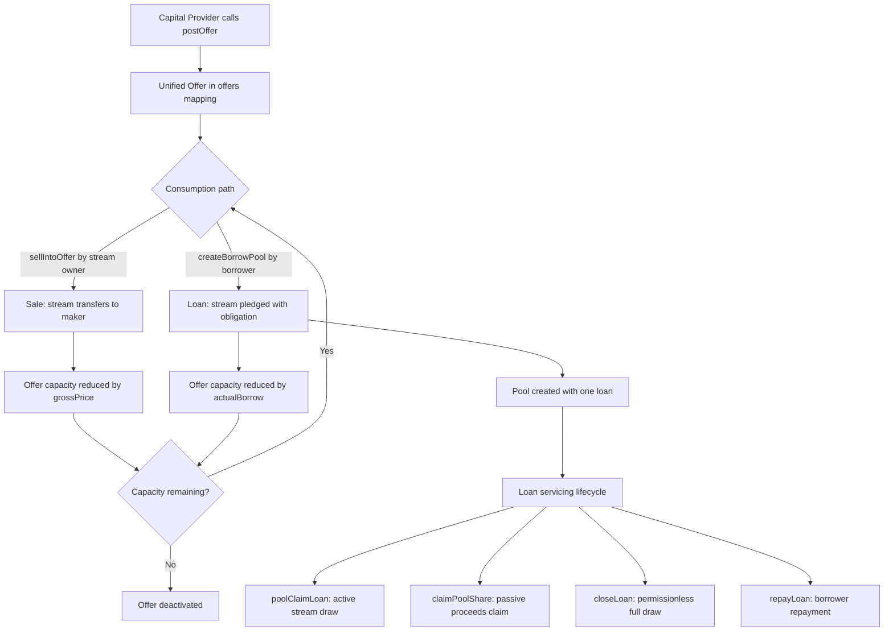

# Unified Offer Merge - Plan

## Goal Capsule

- **Objective:** Merge sale offers and lend offers into one unified offer type, remove lender-side pooling and borrow listings, simplify pool claim mechanics, and remove all resulting dead code.
- **Product authority:** User (protocol owner).
- **Open blockers:** None.
- **Stop conditions:** `forge build` succeeds, all tests pass, `forge fmt` clean, zero stale references to removed/merged symbols.
- **Execution posture:** Build first, then tests (per user preference).

---

## Product Contract

*Product Contract unchanged from brainstorm. Plan adds a `createBorrowPool` invariant handler (R13) as a plan-time scope addition confirmed by the user.*

### Summary

Merge `postSaleOffer` and `postLendOffer` into one unified `postOffer`. The same posted capital at an APR can be consumed as a sale (permanent stream transfer via `sellIntoOffer`) or as a loan (stream pledged with obligation via `createBorrowPool`). Remove `createLenderPool`, `postBorrowListing`, and all dead code. The borrower remains the only pooling actor.

### Problem Frame

The book currently maintains two parallel offer types (`SaleOffer` and `LendOffer`) with identical structs, identical posting signatures, and identical cancel logic. This duplication increases attack surface without value. On the lending side, `createLenderPool` lets a lender batch across multiple borrow listings, but a lender can achieve the same with `multicall`. `postBorrowListing` has no single-fill consumer (removed in the prior refactor), making it and `createLenderPool` dead weight. The distinction between "sale offer" and "lend offer" is artificial: both are capital posted at a discount rate, and the consumption method (sale vs. loan) is the counterparty's choice, not the capital provider's.

### Key Decisions

- **No sale/loan flag on offers.** The capital provider cannot restrict an offer to sale-only or loan-only. Whoever consumes first determines the outcome. This eliminates the distinction between `SaleOffer` and `LendOffer` entirely.
- **Borrower-only pooling.** Only `createBorrowPool` exists. The lender cannot create a pool. Rationale: the borrower has one stream needing multiple lenders (can't multicall because the stream is atomic), while the lender can multicall through individual offers.
- **`poolClaimLoan` derives `loanId` from the pool.** After removing `createLenderPool`, each pool has exactly one loan. The `loanId` parameter is redundant and should be derived internally.

### Requirements

**Unified Offer Type**

- R1. One unified offer posting function replaces `postSaleOffer` and `postLendOffer`. A capital provider posts underlying at an APR with a capacity. The offer is consumable as either a sale or a loan.
- R2. One unified cancel function replaces `cancelSaleOffer` and `cancelLendOffer`. Refunds remaining capacity and deactivates the offer.
- R3. `sellIntoOffer` and `createBorrowPool` both consume from the unified offer pool. Sale consumption transfers the stream permanently to the offer maker. Loan consumption pledges the stream with an obligation.
- R4. The capital provider cannot restrict an offer to sale-only or loan-only. An offer's capacity can be split between a sale and a loan, giving the maker mixed outcomes from one post.
- R5. `gatherLendCapacities` is renamed to reflect that it gathers from unified offers, not lend-specific offers.

**Removed Surface**

- R6. `createLenderPool` is removed. Lenders batch via multicall through individual offers if needed.
- R7. `postBorrowListing` and `cancelBorrowListing` are removed. No borrow listing path exists.
- R8. `gatherBorrowListings` is removed.

**Simplifications**

- R9. `poolClaimLoan` derives the loan from the pool internally rather than taking a separate `loanId` parameter, since each pool has exactly one loan.
- R10. `Pool.isLend` field and the `PoolCreated` event's `isLend` parameter are removed (always false after `createLenderPool` removal, never read for logic).

**Dead Code Cleanup**

- R11. All dead structs, mappings, counters, and events from the refactor are removed: `SaleOffer` and `LendOffer` (merged into one `Offer`), `saleOffers` and `lendOffers` (merged into one `offers`), `nextSaleOfferId` and `nextLendOfferId` (merged into one `nextOfferId`), `BorrowListing` struct, `borrowListings` mapping, `nextBorrowListingId`, `BorrowListingPosted` and `BorrowListingCancelled` events, `SaleOfferPosted`/`LendOfferPosted` (merged into `OfferPosted`), `SaleOfferCancelled`/`LendOfferCancelled` (merged into `OfferCancelled`).
- R12. Stale `repayLoan` NatSpec is fixed ("sent directly to the lender" should reference `poolProceeds`).

**Invariant Coverage**

- R13. A `createBorrowPool` handler is added to the invariant test suite to address a pre-existing coverage gap (pool origination was never exercised by invariants).

### Acceptance Examples

- AE1. **Offer consumed as sale first, then loan.**
  - **Covers R3, R4.**
  - **Given:** Alice posts an offer with 100 capacity.
  - **When:** Bob sells a stream worth 60 into Alice's offer (sale), then Carol borrows 40 via `createBorrowPool` using Alice's offer (loan).
  - **Then:** Alice holds Bob's stream (permanent transfer) and has an obligation from Carol's loan. Offer is exhausted.

- AE2. **Offer consumed as loan first, then sale.**
  - **Covers R3, R4.**
  - **Given:** Alice posts an offer with 100 capacity.
  - **When:** Bob borrows 60 via `createBorrowPool` using Alice's offer (loan), then Carol sells a stream worth 40 into Alice's offer (sale).
  - **Then:** Alice has an obligation from Bob's loan and holds Carol's stream (permanent transfer). Offer is exhausted.

### Scope Boundaries

- `postSaleListing`, `cancelSaleListing`, and `buyListing` (seller-initiated sale path) are unchanged.
- `closeLoan`, `repayLoan`, `poolClaimLoan`, and `claimPoolShare` (loan servicing) are unchanged in logic, though `poolClaimLoan`'s signature simplifies per R9.
- Frontend (`web/`) updates are a downstream concern, not part of this refactor scope.

### Impact Surface

| Area | Files | Change |
|------|-------|--------|
| Source | `src/OVRFLOBook.sol` | Merge structs/mappings/counters/events, remove 4 functions + 2 cancel functions, simplify `poolClaimLoan` signature, update internal helpers (`_validateBorrowOffers`, `_consumeBorrowOffers`), fix NatSpec |
| Unit tests | `test/OVRFLOBook.t.sol` | Update all references to merged/removed functions, merge offer helper functions |
| Invariant tests | `test/OVRFLOBookInvariant.t.sol` | Merge `postSaleOffer`/`postLendOffer` handlers into one `postOffer` handler, remove `postBorrowListing` and `cancelBorrowListing` handlers, add `createBorrowPool` handler (R13) |
| Attack tests | `test/OVRFLOAttackScenarios.t.sol` | Update references to removed functions |
| Fork tests | `test/fork/OVRFLOBookMainnetFork.t.sol` | Update references to removed functions |
| Docs | `CONCEPTS.md`, `README.md`, `AUDIT.md`, `CLAUDE.md`, `AGENTS.md` | Merge "sale offer"/"lend offer" into "offer", remove "borrow listing", update function listings |
| Critical patterns | `docs/solutions/patterns/ovrflo-critical-patterns.md` | Update detection commands and code examples for patterns #4 and #11 |

---

## Planning Contract

### Key Technical Decisions

- **KTD1. Unified `Offer` struct uses `maker` field name.** `SaleOffer` uses `maker`, `LendOffer` uses `lender`. Both refer to the same role (capital provider). `maker` is the more general term since the offer can be consumed as either a sale or a loan. All references to `offer.lender` in `_validateBorrowOffers`, `_consumeBorrowOffers`, and the self-match guard become `offer.maker`.

- **KTD2. New `poolLoanId` reverse mapping for `poolClaimLoan` derivation.** A new `mapping(uint256 => uint256) public poolLoanId` (poolId => loanId) is added. It is set once in `createBorrowPool` alongside the existing `loanPoolId[loanId] = poolId`. The existing `loanPoolId` (loanId => poolId) stays because `closeLoan` and `repayLoan` still read it to route proceeds to `poolProceeds[poolId]`.

- **KTD3. `SaleOfferHit` event stays sale-specific.** It is a consumption event emitted by `sellIntoOffer`, not a posting/cancel event. The loan path emits `PoolCreated` instead. No unified consumption event is needed because the two paths have fundamentally different semantics (permanent transfer vs. obligation creation).

- **KTD4. Keep `pools[poolId].totalObligation` even though it equals `loan.obligation` for single-loan pools.** The batch safety pattern doc (`docs/solutions/design-patterns/solidity-batch-function-safety-patterns.md`) warns against substituting per-loan obligation for pool obligation. Keeping `totalObligation` prevents a future multi-loan pool re-introducing a reconciliation bug.

- **KTD5. Invariant `createBorrowPool` handler.** The handler posts several offers at random APRs, pledges an eligible stream, and calls `createBorrowPool` with a subset of offer IDs. The handler must use a different actor for posting offers than for calling `createBorrowPool` to avoid the self-match guard (`offer.maker != borrower`). Ghost variables track total escrowed offer capacity and total pool obligations. The handler must update `totalActiveOfferCapacity` when posting offers (increase) and when `createBorrowPool` consumes them (decrease by `actualBorrow`). The handler must not break the existing `invariant_BookBalanceEqualsEscrowedCapacity` invariant.

### High-Level Technical Design



The unified offer removes the artificial split between `SaleOffer` and `LendOffer`. Both consumption paths (`sellIntoOffer` and `createBorrowPool`) read from the same `offers` mapping, decrement the same `capacity` field, and deactivate the same `active` flag. The offer maker cannot control which path consumes their capital. The pool lifecycle (create, service, claim) is unchanged except for `poolClaimLoan`'s simplified signature.

### Assumptions

- The contract is pre-launch (`deployments/` is empty); storage layout changes (removing `Pool.isLend`, merging mappings) do not require migration. If a deployment exists, this refactor requires full redeployment, not an upgrade.
- The `SaleOfferHit` event name is retained without renaming (it describes the sale action, not the offer type).
- The `gatherLendCapacities` rename target is `gatherOfferCapacities` (descriptive of the unified offer pool).
- x-ray files (`x-ray/entry-points.md`, `x-ray/invariants.md`, `x-ray/x-ray.md`) are externally managed and not updated in this refactor.
- No new ce-compound documentation is created as part of this refactor (post-refactor, separate workflow).

### Sequencing

Contract changes (U1) must complete before any test updates (U2-U4) can compile. Test files are independent of each other and can be updated in any order. Documentation (U5) can proceed in parallel with test updates but should reflect the final function names.

---

## Implementation Units

### U1. Contract: Merge offer types, remove dead code, simplify poolClaimLoan

- **Goal:** All source changes in `src/OVRFLOBook.sol` — merge offer structs/mappings/counters/events, merge post/cancel functions, update consumption functions, remove dead code, simplify `poolClaimLoan`, fix NatSpec.
- **Requirements:** R1-R12
- **Dependencies:** None (first unit)
- **Files:** `src/OVRFLOBook.sol`
- **Approach:**
  - Replace `SaleOffer` and `LendOffer` structs with one `Offer` struct using `maker` field name (KTD1). Merge `saleOffers` and `lendOffers` into one `offers` mapping. Merge `nextSaleOfferId` and `nextLendOfferId` into one `nextOfferId`.
  - Replace `postSaleOffer` and `postLendOffer` with one `postOffer(address market, uint16 aprBps, uint128 capacity)`. Replace `cancelSaleOffer` and `cancelLendOffer` with one `cancelOffer(uint256 offerId)`. Both preserve existing logic (escrow, refund, market-active gate, teardown pattern: zero `capacity`+`active`, keep `maker`/`market`/`aprBps`).
  - Update `sellIntoOffer` to read from `offers` mapping and use `offer.maker` for stream transfer.
  - Update `createBorrowPool` to read from `offers` mapping. Rename `_validateBorrowOffers` → `_validateOffers` and `_consumeBorrowOffers` → `_consumeOffers`. Update `offer.lender` → `offer.maker` in both helpers and the self-match guard.
  - Remove `createLenderPool`, `postBorrowListing`, `cancelBorrowListing`, `gatherBorrowListings`. Remove `BorrowListing` struct, `borrowListings` mapping, `nextBorrowListingId`.
  - Add `mapping(uint256 => uint256) public poolLoanId` (poolId => loanId) per KTD2. Set `poolLoanId[poolId] = loanId` in `createBorrowPool`. Change `poolClaimLoan(uint256 poolId, uint256 loanId, uint128 amount)` → `poolClaimLoan(uint256 poolId, uint128 amount)`. Derive `loanId = poolLoanId[poolId]` internally; replace the `loanPoolId[loanId] == poolId` check with `poolLoanId[poolId] != 0` existence check.
  - Remove `Pool.isLend` field. Update `PoolCreated` event to remove `isLend` parameter. Update emit site in `createBorrowPool`.
  - Merge `saleOfferState` and `lendOfferState` into one `offerState(uint256 offerId)`. Remove `borrowListingState`. Rename `gatherLendCapacities` → `gatherOfferCapacities`. Update `gatherOfferCapacities` to read from `offers` mapping and `nextOfferId`.
  - Merge events: `SaleOfferPosted`/`LendOfferPosted` → `OfferPosted`; `SaleOfferCancelled`/`LendOfferCancelled` → `OfferCancelled`. Remove `BorrowListingPosted`, `BorrowListingCancelled`. Keep `SaleOfferHit` unchanged (KTD3).
  - Fix `repayLoan` NatSpec: "sent directly to the lender" → "credited to `poolProceeds`".
- **Patterns to follow:** Entry teardown pattern (`docs/solutions/architecture-patterns/ovrflobook-entry-teardown-zero-what-matters.md`) — zero `capacity`+`active`, keep identity fields. Market-active gate pattern (`docs/solutions/architecture-patterns/ovrflobook-offer-market-active-gate.md`) — `_requireMarketActive` at post, `requireEligible` at fill. Batch safety pattern (`docs/solutions/design-patterns/solidity-batch-function-safety-patterns.md`) — keep `totalObligation`, preserve strictly-increasing IDs guard, preserve `poolClaimLoan` direct-draw bypassing pro-rata cap.
- **Test scenarios:**
  - Happy path: `postOffer` escrows underlying, creates offer with correct fields, emits `OfferPosted`.
  - Happy path: `cancelOffer` refunds remaining capacity, deactivates offer, emits `OfferCancelled`.
  - Happy path: `sellIntoOffer` consumes from unified `offers`, transfers stream to `offer.maker`, reduces capacity. Covers AE1 (sale-first consumption).
  - Happy path: `createBorrowPool` consumes from unified `offers`, creates pool + loan, reduces capacity. Covers AE2 (loan-first consumption).
  - Edge case: offer capacity split between sale and loan (sale consumes part, loan consumes rest). Covers R4, AE1, AE2.
  - Edge case: `poolClaimLoan(poolId, amount)` with 2-arg signature derives `loanId` correctly, draws from stream, updates `poolReceived`.
  - Error path: `cancelOffer` reverts for wrong maker, inactive offer.
  - Error path: `postOffer` reverts for zero capacity, non-whole APR, inactive market.
  - Error path: `poolClaimLoan` reverts for non-existent pool, non-contributor caller.
  - Integration: `offerState` returns correct fields for active and deactivated offers (sentinel: `maker != address(0)`).
  - Integration: `gatherOfferCapacities` returns correct capacities from unified `offers` mapping.
- **Verification:** `forge build` succeeds. No stale references to removed symbols in `src/`.
- **Execution note:** Build first, then run tests.

### U2. Tests: Update unit tests

- **Goal:** Update `test/OVRFLOBook.t.sol` to use unified offer functions, remove tests for removed functions, update `poolClaimLoan` call sites.
- **Requirements:** R1-R12
- **Dependencies:** U1
- **Files:** `test/OVRFLOBook.t.sol`
- **Approach:**
  - Merge `_postSaleOffer` and `_postLendOffer` helpers into one `_postOffer` helper. Remove `_postBorrowListing`, `_postBorrowListingAtApr`, `_postLendOfferAtApr` helpers. Merge `_postLendOfferAtApr` into `_postOfferAtApr` if APR-specific helper is needed.
  - Update all `postSaleOffer`/`postLendOffer` call sites → `postOffer`. Update all `cancelSaleOffer`/`cancelLendOffer` call sites → `cancelOffer`.
  - Remove `createLenderPool` test block entirely. Remove `postBorrowListing`/`cancelBorrowListing` tests. Remove `gatherBorrowListings` tests.
  - Merge duplicate APR bounds tests (`test_Apr_RejectsNonWholeRateOnSaleOffer` + `test_Apr_RejectsNonWholeRateOnLendOffer` → one `test_Apr_RejectsNonWholeRateOnOffer`). Remove `test_Apr_RejectsNonWholeRateOnBorrowListing`.
  - Merge duplicate zero-capacity tests (`test_PostSaleOffer_RevertForZeroCapacity` + `test_PostLendOffer_RevertForZeroCapacity` → one `test_PostOffer_RevertForZeroCapacity`).
  - Merge duplicate cancel-wrong-maker tests (`test_CancelSaleOffer_RevertForWrongMaker` + `test_CancelLendOffer_RevertForWrongLender` → one `test_CancelOffer_RevertForWrongMaker`).
  - Update `saleOfferState`/`lendOfferState` calls → `offerState`. Remove `borrowListingState` calls.
  - Update all `poolClaimLoan(poolId, loanId, amount)` call sites → `poolClaimLoan(poolId, amount)` (drop `loanId` arg). Approximately 17 call sites.
  - Remove `isLend` assertions (borrow pool `assertFalse(isLend)`, lender pool `assertTrue(isLend)`).
  - Remove local `BorrowListingPosted` event declaration.
  - Assert all-party token balances per critical pattern #7 for every money-movement test.
- **Patterns to follow:** Critical pattern #7 (`docs/solutions/patterns/ovrflo-critical-patterns.md`) — assert `balanceOf` for actor, counterparty, treasury, and book in every money-movement test.
- **Test scenarios:**
  - Happy path: `postOffer` creates offer with correct fields, escrows capacity.
  - Happy path: `cancelOffer` refunds remaining capacity.
  - Happy path: `sellIntoOffer` from unified offer, stream transfers to maker, seller receives net.
  - Happy path: `createBorrowPool` from unified offer, borrower receives net, pool created.
  - Edge case: offer split between sale and loan (Covers AE1, AE2).
  - Edge case: `poolClaimLoan` 2-arg signature derives loanId, draws correct amount.
  - Error path: `cancelOffer` reverts for wrong maker, inactive offer.
  - Error path: `postOffer` reverts for zero capacity, out-of-bounds APR.
  - Integration: `offerState` returns correct fields, sentinel works for non-existent ID.
- **Verification:** `forge test --match-contract OVRFLOBookTest` passes. All `poolClaimLoan` calls use 2-arg signature.

### U3. Tests: Update invariant tests and add createBorrowPool handler

- **Goal:** Update `test/OVRFLOBookInvariant.t.sol` — merge offer handlers, remove listing handlers, add `createBorrowPool` handler (R13), update invariant assertions.
- **Requirements:** R1-R13
- **Dependencies:** U1
- **Files:** `test/OVRFLOBookInvariant.t.sol`
- **Approach:**
  - Merge `postSaleOffer` (line 290) and `postLendOffer` (line 366) handlers into one `postOffer` handler. Merge `cancelSaleOffer` (line 300) and `cancelLendOffer` (line 376) handlers into one `cancelOffer` handler.
  - Remove `postBorrowListing` (line 392) and `cancelBorrowListing` (line 401) handlers entirely.
  - Merge ghost variables `totalActiveSaleOfferCapacity` and `totalActiveLendOfferCapacity` into one `totalActiveOfferCapacity`. Update `invariant_BookBalanceEqualsEscrowedCapacity` (line 545) to use the merged variable.
  - Update all `book.saleOffers(...)` / `book.lendOffers(...)` reads → `book.offers(...)`. Update `book.nextSaleOfferId()` / `book.nextLendOfferId()` → `book.nextOfferId()`.
  - Add a new `createBorrowPool` handler (R13): posts several offers at random APRs within bounds, pledges an eligible stream, calls `createBorrowPool` with a subset of offer IDs and random `targetBorrow`/`minAcceptable`. Track pool obligations in a ghost variable. Ensure the handler does not break existing invariants.
  - Update `poolClaimLoan` calls if any (the invariant suite may not call `poolClaimLoan` directly; check and update if present).
- **Patterns to follow:** Prior refactor precedent (`docs/solutions/architecture-patterns/ovrflobook-pool-only-lending-consolidation.md`) — handler pruning pattern. Batch safety pattern — strictly-increasing IDs in `createBorrowPool` handler.
- **Test scenarios:**
  - Invariant: `invariant_BookBalanceEqualsEscrowedCapacity` holds with unified offer capacity tracking.
  - Invariant: `createBorrowPool` handler does not break balance invariants.
  - Invariant: `createBorrowPool` handler maintains strictly-increasing ID ordering.
  - Fuzz: handler runs for 500 runs at depth 25 without invariant violations.
- **Verification:** `forge test --match-contract OVRFLOBookInvariant -vvv` passes (500 runs, depth 25).

### U4. Tests: Update attack and fork tests

- **Goal:** Update `test/OVRFLOAttackScenarios.t.sol` and `test/fork/OVRFLOBookMainnetFork.t.sol` to use unified offer functions and 2-arg `poolClaimLoan`.
- **Requirements:** R1-R10
- **Dependencies:** U1
- **Files:** `test/OVRFLOAttackScenarios.t.sol`, `test/fork/OVRFLOBookMainnetFork.t.sol`
- **Approach:**
  - Attack tests: update `postLendOffer` (line 511) → `postOffer`. Update `poolClaimLoan(poolId, loanId, partialClaim)` (line 529) → `poolClaimLoan(poolId, partialClaim)`.
  - Fork tests: update `postLendOffer` (lines 54, 91) and `postSaleOffer` (line 153) → `postOffer`. Update `saleOffers` read (line 169) → `offers`. Update `poolClaimLoan(poolId, loanId, partialClaim)` (line 71) → 2-arg. Remove the entire `postBorrowListing` + `createLenderPool` + `borrowListings` fork test block (lines ~189-211). Remove `postBorrowListing` at line 293.
- **Patterns to follow:** Critical pattern #7 — assert all-party balances in money-movement tests.
- **Test scenarios:**
  - Attack: stream withdrawal attack still prevented with unified offer path.
  - Fork: `sellIntoOffer` consumes from unified offers on mainnet fork.
  - Fork: `createBorrowPool` consumes from unified offers on mainnet fork.
  - Fork: `poolClaimLoan` 2-arg signature works on mainnet fork.
- **Verification:** `forge test --match-contract OVRFLOAttackScenarios` passes. `forge test --match-path "test/fork/*" --fork-url $MAINNET_RPC_URL` passes.

### U5. Docs: Update documentation

- **Goal:** Update documentation files to reflect unified offer terminology and remove references to removed functions.
- **Requirements:** R5, R11
- **Dependencies:** U1 (for correct function names)
- **Files:** `README.md`, `AUDIT.md`, `CLAUDE.md`, `AGENTS.md`, `docs/solutions/patterns/ovrflo-critical-patterns.md`
- **Approach:**
  - `README.md`: update function listings — replace `postSaleOffer`/`postLendOffer` with `postOffer`, remove `createLenderPool`/`postBorrowListing`/`gatherBorrowListings`, rename `gatherLendCapacities` → `gatherOfferCapacities`.
  - `AUDIT.md`: update any references to removed functions and the dual offer type distinction.
  - `CLAUDE.md`: update architecture overview — "Four order types" becomes "Two order types: sale offers (unified) and sale listings." Update loan origination description to remove `createLenderPool`.
  - `AGENTS.md`: update workspace facts — remove `createLenderPool`/`postBorrowListing` from the OVRFLOBook description, update "Four order types" to reflect the merge.
  - `docs/solutions/patterns/ovrflo-critical-patterns.md`: update detection commands for pattern #4 (self-match: expected matches drop from 2 to 1 after `createLenderPool` removal) and pattern #11 (strictly-increasing IDs: expected matches drop from 2 to 1). Also update code examples in patterns #4 and #11 to replace `LendOffer` → `Offer`, `lendOffers` → `offers`, `offer.lender` → `offer.maker`, `_validateBorrowOffers` → `_validateOffers`, and remove `createLenderPool` references.
- **Patterns to follow:** Dead-code removal methodology (`docs/solutions/developer-experience/post-refactor-dead-code-WebUI-20260421.md`) — include `rg` one-liner proving zero consumers.
- **Test expectation:** none — documentation updates are not covered by automated tests.
- **Verification:** `rg "postSaleOffer|postLendOffer|cancelSaleOffer|cancelLendOffer|SaleOffer|LendOffer|saleOffers|lendOffers|createLenderPool|postBorrowListing|cancelBorrowListing|gatherBorrowListings|BorrowListing|borrowListings|isLend" --type md --glob '!docs/solutions/**' --glob '!docs/plans/**'` returns no matches in updated docs.

---

## Verification Contract

| Gate | Command | Applies to | Pass condition |
|------|---------|------------|----------------|
| Build | `forge build` | U1 | Compiles without errors |
| Unit tests | `forge test --match-contract OVRFLOBookTest` | U2 | All tests pass |
| Invariant tests | `forge test --match-contract OVRFLOBookInvariant -vvv` | U3 | 500 runs, depth 25, no invariant violations |
| Attack tests | `forge test --match-contract OVRFLOAttackScenarios` | U4 | All tests pass |
| Fork tests | `forge test --match-path "test/fork/*" --fork-url $MAINNET_RPC_URL` | U4 | All tests pass |
| Format | `forge fmt` | U1-U4 | No formatting changes needed |
| Stale references | See command below | U1-U4 | Zero matches |

Stale-references check (run in shell, not through markdown table escaping):

```bash
rg "postSaleOffer|postLendOffer|cancelSaleOffer|cancelLendOffer|SaleOfferPosted|SaleOfferCancelled|LendOffer|saleOffers|lendOffers|nextSaleOfferId|nextLendOfferId|saleOfferState|lendOfferState|gatherLendCapacities|createLenderPool|postBorrowListing|cancelBorrowListing|gatherBorrowListings|BorrowListing|borrowListings|nextBorrowListingId|borrowListingState|isLend" src/ test/
```

`SaleOfferHit` is intentionally retained and excluded from the pattern.

---

## Definition of Done

- `forge build` succeeds after all contract changes (U1).
- All unit tests pass (U2): `forge test --match-contract OVRFLOBookTest`.
- All invariant tests pass (U3): `forge test --match-contract OVRFLOBookInvariant` (500 runs, depth 25).
- All attack tests pass (U4): `forge test --match-contract OVRFLOAttackScenarios`.
- All fork tests pass (U4): `forge test --match-path "test/fork/*" --fork-url $MAINNET_RPC_URL`.
- `forge fmt` is clean.
- Zero stale references to removed/merged symbols in `src/` and `test/`.
- Documentation updated (U5): `README.md`, `AUDIT.md`, `CLAUDE.md`, `AGENTS.md`, `docs/solutions/patterns/ovrflo-critical-patterns.md`.
- Critical patterns detection commands updated for patterns #4 and #11.
- `CONCEPTS.md` already updated (Offer, Listing, Pool entries reflect unified model).
- Abandoned-attempt code is removed from the diff before declaring done.
