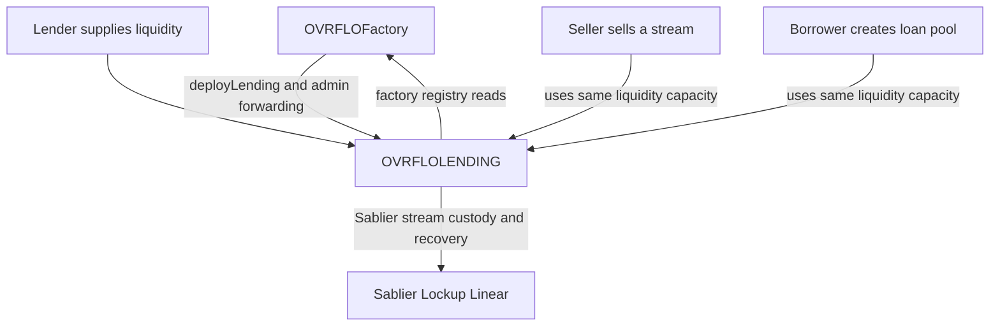

# OVRFLOLENDING Rebrand - Plan

## Goal Capsule

- **Objective:** Rebrand the secondary market as `OVRFLOLENDING`, making liquidity provision and self-repaying loans the primary product language without changing any protocol behavior.
- **Product authority:** The lending-first model retains the existing unified-liquidity design: supplied liquidity may fund either a stream-backed loan or a direct stream purchase.
- **Open blockers:** None.

---

## Product Contract

### Summary

`OVRFLOLENDING` will replace `OVRFLOBook` as the public name for OVRFLO's secondary lending market.
The public surface will use lender, borrower, loan-pool, and liquidity terminology while retaining clear buyer and seller terminology for direct stream-sales actions.

### Problem Frame

The current secondary-market identity centers on a generic “book,” although its distinctive protocol purpose is pooled, self-repaying lending against Sablier streams.
That framing obscures the primary lender and borrower roles, despite the market's unified offer mechanism and loan servicing flows.

### Key Decisions

- **Complete public rebrand.** The contract identity, factory-facing identity, deployment surface, events, revert prefixes, public API names, tests, and current documentation will adopt `OVRFLOLENDING`; no legacy ABI aliases are required.
- **Lending-first vocabulary.** Liquidity providers are lenders, stream owners borrowing against their stream are borrowers, and batched debt is a loan pool.
- **Preserve unified liquidity.** Supplied lender liquidity remains eligible to fund either a loan or a direct stream purchase, preserving the existing economic behavior.
- **Preserve sale clarity.** Direct-sale actions continue to use buyer and seller terminology rather than forcing lending words onto a sale.

### Actors

- A1. **Lender:** Supplies liquidity, may acquire a stream directly, and receives proportional recovery from a loan pool.
- A2. **Borrower:** Pledges an eligible stream, receives discounted underlying liquidity, repays or recovers the stream after satisfaction.
- A3. **Stream seller or buyer:** Uses the retained direct-sale route to transfer a stream for discounted underlying.
- A4. **Factory owner:** Deploys, configures, and administers each lending market through the existing factory-mediated ownership model.

### Requirements

**Public identity**

- R1. The secondary-market contract and its deployable public identity must be named `OVRFLOLENDING`.
- R2. The factory's registry, deployment, administrative, event, and documentation terminology must identify each secondary market as lending rather than a book.
- R3. Public error and event naming must use the new lending identity consistently.

**Lender and borrower experience**

- R4. Lender-facing functions and state accessors must use liquidity-oriented verbs and lender terminology.
- R5. Pooled borrowing functions and state accessors must use borrower and loan-pool terminology.
- R6. Direct-sale functions must retain unambiguous stream-sale vocabulary for buyers and sellers.
- R7. The unified liquidity primitive must remain available to both the loan and direct-sale paths.

**Behavioral preservation**

- R8. The rebrand must not alter pricing, fees, eligibility, escrow, repayment, stream-return, pool-recovery, access-control, or reentrancy behavior.
- R9. Existing sale, loan, pool, fuzz, invariant, adversarial, and fork-test behavioral assertions must be carried forward under the rebranded surface.

**Documentation**

- R10. Current protocol, architecture, deployment, developer, and frontend-facing documentation must describe the market as `OVRFLOLENDING` and explain its lending-first unified-liquidity model.
- R11. Dated audits, solution records, and other historical documentation must preserve their original `OVRFLOBook` references.

### Key Flows

- F1. **Supply and consume unified liquidity**
  - **Actors:** A1, A2, A3.
  - **Steps:** A lender supplies liquidity, then a borrower originates a loan pool or a seller transfers an eligible stream into that liquidity.
  - **Outcome:** The same economic capacity remains usable for either path under lending-first terminology.

- F2. **Service and recover a loan pool**
  - **Actors:** A1, A2.
  - **Steps:** A borrower repays or the pledged stream is drawn as it becomes withdrawable, then lenders claim their proportional recovery.
  - **Outcome:** Debt recovery and stream-return behavior remain unchanged.

### Acceptance Examples

- AE1. **Covers R1-R3.** Given a fresh deployment, when the factory deploys its secondary market, then the deployed contract, factory registry, emitted events, and public failure prefixes use `OVRFLOLENDING` terminology.
- AE2. **Covers R4-R7.** Given a lender has supplied liquidity, when an eligible borrower originates a loan pool or an eligible seller executes a direct sale, then both paths consume the same supplied capacity and preserve their respective borrower or buyer/seller language.
- AE3. **Covers R8-R9.** Given the rebranded surface, when the full Solidity validation suite runs, then all existing behavioral, invariant, fuzz, adversarial, and applicable fork assertions pass without changed economics.
- AE4. **Covers R10-R11.** Given current and historical documentation, when terminology is reviewed, then current materials use `OVRFLOLENDING` while dated historical records retain `OVRFLOBook`.

### Scope Boundaries

- No redesign of pricing, fee policy, APR bounds, pool accounting, eligibility criteria, or administrative authority.
- No separation of direct-sale capacity from lender liquidity.
- No legacy `OVRFLOBook` compatibility aliases or retained ABI surface.
- No retrospective rewrite of dated audit or solution-history records.

### Dependencies / Assumptions

- `OVRFLOFactory` remains the sole deployer, owner, registry, and administrative gateway for every lending market.
- The current test suite is the behavioral baseline because the requested change preserves economics and execution semantics.
- Current documentation includes protocol and product materials that describe the live design, while dated audits and solution records are historical artifacts.

### Sources / Research

- `src/OVRFLOBook.sol` defines the current unified stream-sale and pooled-lending mechanics.
- `src/OVRFLOFactory.sol` owns the current secondary-market deployment, registry, and administrative surface.
- `README.md` documents the current secondary-market contract and callable flow.
- `test/OVRFLOBook.t.sol`, `test/OVRFLOBookInvariant.t.sol`, `test/fork/OVRFLOBookMainnetFork.t.sol`, and `test/fizz/` establish the existing behavioral baseline.

---

## Planning Contract

### Product Contract Preservation

Product Contract unchanged.

### Key Technical Decisions

- **KTD1. Treat the rebrand as a clean-break release.** Rename the contract, source file, factory ABI, public selectors, autogenerated mapping getters, events, and `OVRFLOLENDING:` revert prefix with no compatibility aliases. This intentionally changes selectors and event topics for future deployments.
- **KTD2. Preserve every economic and state-transition behavior.** Keep storage declaration order and field types, ID initialization and increments, validation order, transfer order, event payload types and ordering, access checks, and `nonReentrant` placement. The change is naming and deployment-surface scope only.
- **KTD3. Use liquidity language for the unified primitive.** Rename offers to liquidity positions and use liquidity-oriented supply, withdrawal, state, and gathering functions. Retain explicit buyer/seller terms for direct stream sales and the existing `Loan`, `closeLoan`, `repayLoan`, `loanState`, and `quote` semantics where their names already match the lending model.
- **KTD4. Make factory deployment the sole supported path.** Delete the standalone deployment script rather than renaming it. Keep the factory as owner of every factory-deployed lending market and preserve its one-market-per-vault registry and admin forwarders.
- **KTD5. Separate living documentation from historical evidence.** Update current protocol, contributor, glossary, mockup, and enforceable-pattern documentation. Preserve dated audit reports, solution records, plans, brainstorms, ideation documents, x-ray artifacts, and generated deployment history with their original names.

### Public Naming Map

| Current surface | Rebranded surface |
| --- | --- |
| `OVRFLOBook` | `OVRFLOLENDING` |
| `ovrfloToBook` / `bookToOvrflo` | `ovrfloToLending` / `lendingToOvrflo` |
| `bookCount` / `books` | `lendingCount` / `lendings` |
| `deployBook` | `deployLending` |
| `setBookAprBounds`, `setBookFee`, `setBookTreasury` | `setLendingAprBounds`, `setLendingFee`, `setLendingTreasury` |
| `Offer`, `offers`, `nextOfferId` | `LiquidityPosition`, `liquidityPositions`, `nextLiquidityId` |
| `postOffer`, `cancelOffer`, `offerState`, `gatherOfferCapacities` | `supplyLiquidity`, `withdrawLiquidity`, `liquidityState`, `gatherLiquidity` |
| `sellIntoOffer` | `sellStreamToLiquidity` |
| `createBorrowPool` | `createBorrowerLoanPool` |
| `Pool`, `pools`, `nextPoolId` | `LoanPool`, `loanPools`, `nextLoanPoolId` |
| `poolContributions`, `poolProceeds`, `poolReceived` | `loanPoolContributions`, `loanPoolProceeds`, `loanPoolReceived` |
| `poolLoanId`, `loanPoolId` | `loanPoolLoanId`, `loanToLoanPool` |
| `claimPoolShare` | `claimLoanPoolShare` |
| `BookDeployed`, `BookAprBoundsSet`, `BookFeeSet`, `BookTreasurySet` | `LendingDeployed`, `LendingAprBoundsSet`, `LendingFeeSet`, `LendingTreasurySet` |
| `AprBoundsSet`, `FeeSet`, `TreasurySet` | `LendingAprBoundsSet`, `LendingFeeSet`, `LendingTreasurySet` |
| `OfferPosted`, `OfferCancelled` | `LiquiditySupplied`, `LiquidityWithdrawn` |
| `SaleOfferHit` | `StreamSoldToLiquidity` |
| `SaleListingPosted`, `SaleListingCancelled`, `SaleListingTaken` | `StreamSaleListingPosted`, `StreamSaleListingCancelled`, `StreamSaleListingTaken` |
| `PoolCreated`, `PoolShareClaimed` | `BorrowerLoanPoolCreated`, `LoanPoolShareClaimed` |

`postSaleListing`, `cancelSaleListing`, and `buyListing` retain sale-specific names. Their events must use equally explicit sale language.
`LoanClosed` and `LoanRepaid` remain unchanged because they already describe the lending lifecycle.
`LiquidityPosition.maker`, `LoanPool.creator`, and `SaleListing.maker` become `lender`, `borrower`, and `seller`, respectively.

### Revert Vocabulary

- In generic liquidity paths, replace `offer` with `liquidity`, `maker` with `lender`, and `capacity` with `liquidity`.
- In loan-pool paths, replace `pool` with `loan pool`, `contributor` with `lender`, and `borrow` with `loan` where the message describes the operation.
- In sale-listing paths, replace generic maker wording with `seller` and retain listing, buyer, and seller terms.
- Retain precise concepts that already match the model, including market, APR, price, slippage, loan, borrower, repayment, obligation, and stream.

### High-Level Technical Design

### Implementation Constraints

- Preserve the self-match rejection, strictly increasing liquidity-ID validation, early break for excess supplied liquidity, claim-time harvest behavior, checked `uint256` to `uint128` narrowing, and all existing view-function existence guards.
- Retain the factory-mediated ownership and administration model. The removed standalone script must not leave a second deployment or ownership path.
- Retain current test value-conservation assertions for every transfer path, including actor, counterparty, treasury, and lending-market balances.
- Do not rename dated historical source paths referenced by current code. Update current prose around such references while retaining the original historical filename.
- Reword every public revert that identifies an offer, maker, pool, or claim role to its corresponding liquidity, lender, loan-pool, or borrower term. Tests must assert the complete final reason, not merely the `OVRFLOLENDING:` prefix.
- Preserve direct constructor availability as an unchanged EVM property. “Sole deployment path” means the only supported and documented production path is the factory, not a new constructor authorization restriction.

### Sequencing

1. Rename and recompile the secondary-market contract and factory ABI together.
2. Remove the standalone deployment script and its active deployment guidance, while retaining direct construction behavior unchanged.
3. Rename and update unit, invariant, fuzz, attack-scenario, and fork tests against the new ABI.
4. Update current documentation and enforceable patterns, then run the full validation matrix.

### Documentation Classification

- **Living documentation to update:** root protocol and contributor documents, `mockups/**/*.html`, `AUDIT.md`, and undated architecture or interface references under `docs/audit/`.
- **Living knowledge-base material to update:** `docs/solutions/README.md` and `docs/solutions/patterns/ovrflo-critical-patterns.md`, including removal of the obsolete standalone-deployment rule.
- **Historical evidence to preserve:** dated audit findings, solution writeups, plans, brainstorms, ideation, x-ray artifacts, generated broadcast data, and any historical filename that includes `OVRFLOBook`.
- **Review rule:** Classify an ambiguous document before editing it. If it is current operational guidance, migrate it. If it records a dated review or prior decision, preserve its wording and include it in the historical-reference allowlist.

### Assumptions

- Existing deployed `OVRFLOBook` contracts and factories are immutable and remain legacy deployments. The rebrand applies to new source builds and future deployments only.
- The repository's present frontend and Envio integration contain no checked-in OVRFLOBook ABI binding. Future consumers must regenerate ABI and event integrations from the rebranded contracts.

---

## Implementation Units

### U1. Rename the lending-market contract and public ABI

- **Goal:** Replace `OVRFLOBook` with `OVRFLOLENDING` and expose the lending-first ABI without changing market mechanics.
- **Requirements:** R1, R3-R8, F1-F2, AE1-AE3.
- **Dependencies:** None.
- **Files:** `src/OVRFLOBook.sol` (rename to `src/OVRFLOLENDING.sol`), `src/StreamPricing.sol`.
- **Approach:** Rename the contract, source identity, storage symbols, public methods, events, NatSpec, and revert prefix according to the Public Naming Map. Preserve struct field order and types, operational ordering, event argument types/order, and all existing internal arithmetic, validations, and access-control behavior. Update StreamPricing's current-market prose to use `OVRFLOLENDING` while leaving links to dated historical solution files unchanged.
- **Execution note:** Add characterization coverage before or alongside selector renames so every money-moving and state-transition path proves the same post-state under the new ABI.
- **Patterns to follow:** `docs/solutions/patterns/ovrflo-critical-patterns.md` patterns 4, 7, 8, 11, 12, and 14-17.
- **Test scenarios:**
  - Covers AE1. Each constructor and public validation failure returns the rebranded `OVRFLOLENDING:` prefix.
  - Covers F1 / AE2. Supplied liquidity can be partially consumed by a direct sale and then by a borrower loan pool, with identical capacity, escrow, stream-ownership, and all-party balance outcomes.
  - Covers F2 / AE3. Direct repayment, permissionless close, and open-loan claim harvesting preserve obligation caps, stream return, and lender recovery.
  - Unknown liquidity, listing, and loan IDs still revert rather than returning default state.
  - Duplicate or unsorted liquidity IDs, borrower self-matching, incompatible market/APR, slippage, zero value, and overflow-bound inputs retain their existing rejection behavior.
- **Verification:** The renamed contract compiles, every rebranded event and revert expectation passes, and no accounting or lifecycle assertion changes beyond identifiers.

### U2. Rebrand factory registry and remove standalone deployment

- **Goal:** Make factory deployment and administration the sole `OVRFLOLENDING` lifecycle surface.
- **Requirements:** R1-R3, R8-R9, A4, AE1-AE3.
- **Dependencies:** U1.
- **Files:** `src/OVRFLOFactory.sol`, `script/OVRFLOBook.s.sol` (delete), `test/OVRFLOFactory.t.sol`.
- **Approach:** Replace factory Book imports, mappings, counters, enumeration, deployment method, known-market guard, admin forwarders, events, local variables, NatSpec, and error text with Lending terminology. Construct the rebranded contract while preserving one-market-per-vault registry writes and factory ownership. Delete the standalone script rather than providing a renamed replacement. Keep direct constructor deployment behavior unchanged, but do not document or support it as a production path.
- **Patterns to follow:** `docs/solutions/patterns/ovrflo-critical-patterns.md` patterns 9-10. Remove obsolete pattern 6 because its standalone-script prerequisite no longer exists.
- **Test scenarios:**
  - Covers AE1. `deployLending` emits the renamed deployment event, writes both directions of the registry, increments the renamed counter, and leaves the factory as owner with no pending owner.
  - A second deployment for the same vault and a deployment for an unknown vault revert with rebranded factory vocabulary while retaining the same authorization and registry preconditions.
  - Rebranded APR, fee, and treasury forwarders reject unknown lending markets and update the market exactly as their previous forwarders did.
  - The repository has no standalone lending deployment script.
  - Direct construction remains possible, unregistered, owned by the direct deployer, and excluded from factory administration, preserving its existing EVM behavior without representing a supported production deployment.
- **Verification:** Factory tests prove deployment, registry bijection, enumeration, ownership, and all three forwarded admin paths after the API break.

### U3. Migrate deterministic and adversarial test surfaces

- **Goal:** Carry the full unit, invariant, attack-scenario, fuzz, and fork coverage forward to the rebranded ABI.
- **Requirements:** R3-R9, AE1-AE3.
- **Dependencies:** U1, U2.
- **Files:** `test/OVRFLOBook.t.sol` (rename to `test/OVRFLOLENDING.t.sol`), `test/OVRFLOBookInvariant.t.sol` (rename to `test/OVRFLOLENDINGInvariant.t.sol`), `test/fork/OVRFLOBookMainnetFork.t.sol` (rename to `test/fork/OVRFLOLENDINGMainnetFork.t.sol`), `test/OVRFLOAttackScenarios.t.sol`, `test/StreamPricing.t.sol`, `test/mocks/BookMocks.sol` (rename to `test/mocks/LendingMocks.sol`), `test/fizz/Base.sol`, `test/fizz/Properties.sol`, `test/fizz/Snapshots.sol`, `test/fizz/handlers/Handlers.sol`, `test/fizz/handlers/OVRFLOBookHandler.sol` (rename to `test/fizz/handlers/OVRFLOLENDINGHandler.sol`).
- **Approach:** Rename test contracts, harnesses, handlers, helper methods, labels, ghost state, imports, `abi.encodeCall` fixtures, event expectations, and revert expectations to match the clean-break ABI. Preserve the test scenarios and invariant meanings rather than weakening them to accommodate renamed symbols.
- **Execution note:** Treat the pre-rebrand suites as characterization coverage. Do not change an expected economic assertion unless it is identifier-only.
- **Patterns to follow:** Existing all-party balance assertions in `test/OVRFLOBook.t.sol`, factory registry tests in `test/OVRFLOFactory.t.sol`, and invariant properties documented in `PROPERTIES.md`.
- **Test scenarios:**
  - Covers F1 / AE2. Unit tests demonstrate that one liquidity position remains consumable across both sale and loan paths.
  - Covers F2 / AE3. Invariant and fuzz suites preserve recovery caps, pool-to-loan linkage, debt satisfaction, stream custody, liquidity capacity, ID monotonicity, and factory-registry bijection.
  - Attack-scenario tests retain the intended rejection of value extraction and lifecycle abuse after selector and revert-string changes.
  - Fork tests exercise real Sablier custody, sale, loan, claim, close, repayment, foreign-core rejection, and withdrawal access control through the rebranded contract.
  - Multicall selector fixtures and all `expectRevert` / `expectEmit` assertions use the rebranded public surface.
- **Verification:** All Foundry suites retain their prior behavioral coverage under renamed source files and symbols, with fuzz and invariant configuration preserved.

### U4. Update living documentation and enforceable terminology

- **Goal:** Make the current project documentation describe OVRFLOLENDING accurately and distinguish it from preserved historical evidence.
- **Requirements:** R2, R4-R7, R10-R11, AE4.
- **Dependencies:** U1-U3.
- **Files:** `README.md`, `CONCEPTS.md`, `AGENTS.md`, `CLAUDE.md`, `PROPERTIES.md`, `AUDIT.md`, `docs/audit/**/*.md` (living documents only), `mockups/**/*.html`, `docs/solutions/README.md`, `docs/solutions/patterns/ovrflo-critical-patterns.md`.
- **Approach:** Inventory and classify all documentation hits using the Documentation Classification rules. Update current contract tables, lifecycle explanations, glossary entries, contributor instructions, property labels, audit entry-point maps, mockup text and wiring comments, solution-index text, and active critical-pattern guidance to the Lending vocabulary and final API. Remove active mentions of the standalone script and delete its dedicated critical pattern. Correct the README's ownership description to state that factory deployment retains factory ownership and uses factory forwarders. Preserve dated audit, solution, plan, brainstorming, ideation, and x-ray artifacts unchanged.
- **Patterns to follow:** Existing Product Contract terminology and `CONCEPTS.md` glossary structure.
- **Test scenarios:**
  - Covers AE4. Every result from the documentation inventory is classified as living or historical before it is changed or allowlisted.
  - Current documentation has no active `OVRFLOBook` or Book-API reference outside the documented historical allowlist.
  - Current API tables, audit maps, mockup comments, and property labels agree with the final ABI and factory deployment model.
  - Dated historical records retain their original contract references and filenames.
- **Verification:** A targeted repository search separates the intentional historical references from all updated current documentation and source terminology.

---

## System-Wide Impact

- **Deployment:** New deployments use `OVRFLOFactory.deployLending`; deleting the standalone script removes the only supported alternate deployment path. The public constructor remains permissionless, as before, but manually deployed instances are unregistered and unsupported.
- **Integrations:** The ABI, event topics, error text, and public getters are intentionally breaking changes. Any external transaction encoder, decoder, indexer, or UI must target a newly deployed rebranded market.
- **Security:** The rebrand must retain the existing economic invariants, validation guards, CEI ordering, and factory ownership model. It must not broaden permissions or alter accounting.
- **Historical records:** Deployed-contract history and dated analysis remain valid evidence for the pre-rebrand surface, so they stay unmodified.
- **Release coordination:** Publish the new factory and per-vault lending-market addresses together. Legacy Book deployments remain non-interoperable with the new selectors and registry getters.

---

## Risks & Dependencies

- **Breaking ABI risk:** Selector and event-topic changes can silently break off-chain consumers. Mitigate through explicit clean-break documentation, renamed test fixtures, and regenerated consumer bindings for future integrations.
- **Mechanical-rename risk:** Broad symbol replacement can change a storage field, selector, event field, revert expectation, or internal reference unintentionally. Mitigate by keeping U1 identifier-only and using characterization tests across every market flow.
- **Security-regression risk:** Renaming pool and liquidity code can obscure protected invariants. Mitigate by preserving every invariant/fuzz property and the critical-pattern requirements before modifying test expectations.
- **Deployment-path risk:** Removing the standalone script leaves factory deployment as the only supported path. Mitigate by proving factory deployment, ownership, and administration in U2 and removing contradictory active guidance.
- **Manual-construction risk:** Direct constructor deployment remains permissionless and can produce an unregistered, direct-deployer-owned market. Mitigate by characterizing that unchanged behavior, documenting factory deployment as canonical, and never treating manually constructed markets as factory-administered production deployments.
- **Fork-test dependency:** Mainnet-fork validation requires `MAINNET_RPC_URL`. A missing credential blocks only the fork gate, not compilation or local tests.
- **Long-running fuzz dependency:** Echidna and Medusa use the repository's exhaustive fuzz configurations. They remain release gates and must report completed runs rather than be replaced with a weaker configuration.

---

## Documentation and Operational Notes

- Current documentation names the market `OVRFLOLENDING`, describes unified lender liquidity as usable for both loans and stream purchases, and names factory deployment as the sole supported path.
- Historical artifacts keep their `OVRFLOBook` identity, including dated solution filenames and evidence references.
- No production migration is planned for already deployed `OVRFLOBook` instances. Operators deploy a new factory/market release, call `deployLending` for each supported vault, and publish the resulting factory and lending-market addresses when adopting the rebranded API.
- Local seeding and release-artifact schema changes are deferred. This rebrand must not silently expand into repairing unrelated `script/seed-local.sh` behavior.

---

## Verification Contract

| Gate | Applies to | Required outcome |
| --- | --- | --- |
| Formatting | U1-U4 | `forge fmt --check` reports no formatting drift. |
| Compilation | U1-U4 | `forge build` succeeds without diagnostics. |
| Full local suite | U1-U4 | `forge test` passes after a clean build. |
| Focused unit suite | U1, U3 | `forge test --match-contract OVRFLOLENDINGTest` passes. |
| Factory suite | U2-U3 | `forge test --match-contract OVRFLOFactoryTest` passes deployment, registry, and admin-forwarding coverage. |
| Invariant suite | U1-U3 | `FOUNDRY_PROFILE=invariant forge test --match-contract OVRFLOLENDINGInvariantTest -vvv` passes at 500 runs and depth 25. |
| Foundry stateful fuzz | U1-U3 | `forge test --match-contract FoundryTester` passes the renamed lending handlers and properties. |
| Echidna stateful fuzz | U1-U3 | `echidna . --contract FuzzTester --config echidna.yaml` completes and passes the lending property suite under the repository configuration. |
| Medusa stateful fuzz | U1-U3 | `medusa fuzz --config medusa.json` completes and passes the lending property suite under the repository configuration. |
| Fork suite | U3 | A nonempty `MAINNET_RPC_URL` preflight precedes `forge test --match-path "test/fork/OVRFLOLENDINGMainnetFork.t.sol" --fork-url "$MAINNET_RPC_URL"`; unavailable RPC credentials block, rather than skip, this gate. |
| Clean-break audit | U1-U4 | Searches confirm `src/OVRFLOBook.sol` and `script/OVRFLOBook.s.sol` are absent and that remaining Book references are limited to the reviewed historical allowlist. |
| Documentation audit | U4 | Targeted searches find rebranded current references only and retain intentional historical references. |

---

## Definition of Done

- U1. `OVRFLOLENDING` and its lender-facing API implement the complete naming map without changing accounting, validation, lifecycle, or direct-sale behavior.
- U2. `OVRFLOFactory` exposes only the rebranded deployment and administration surface, preserves factory ownership, and the standalone deployment script is removed.
- U3. Unit, factory, invariant, fuzz, attack-scenario, and applicable fork tests use the rebranded ABI and prove the existing behavioral baseline.
- U4. Living documentation, contributor guidance, property references, mockup wiring, and active critical patterns use the new terminology, while dated historical evidence remains unchanged.
- Every market event has an explicit final name, unchanged indexed arguments and payload order, and event assertion coverage.
- All Verification Contract gates pass, or a fork-only gate is reported as blocked solely by unavailable RPC credentials.
- The final diff contains no compatibility aliases, abandoned rename artifacts, generated build outputs, or unrelated cleanup.
