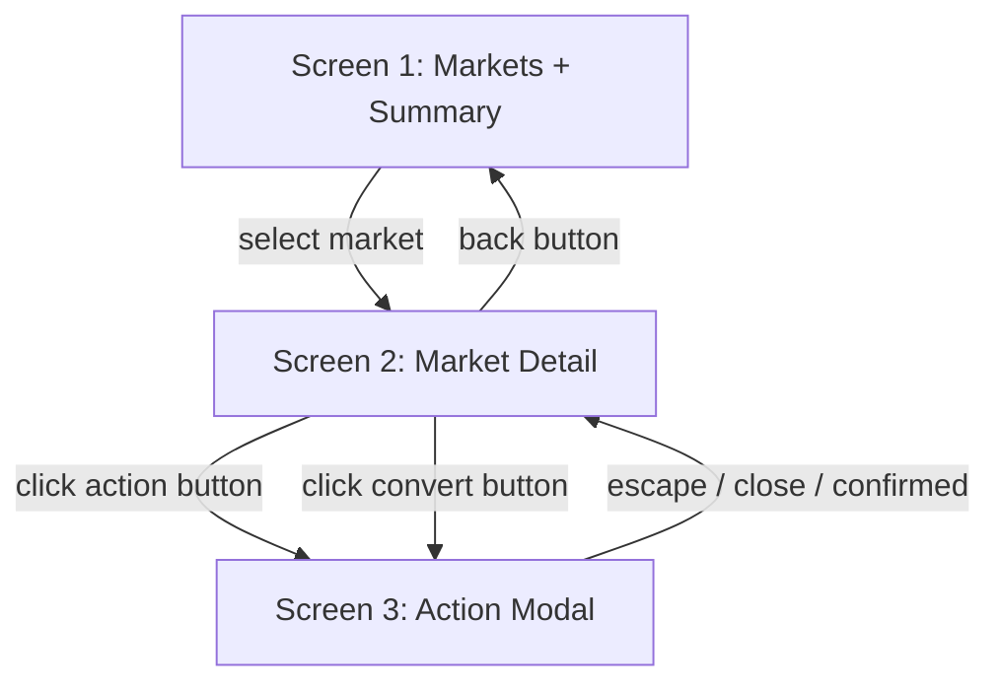
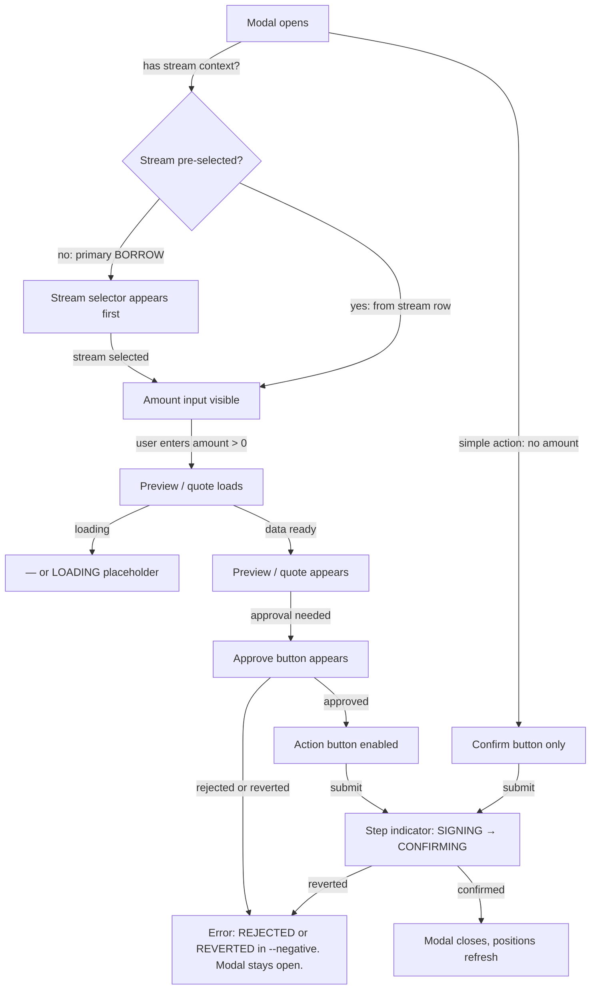

# Web Markets UI Redesign - Plan

## Goal Capsule

- **Objective:** Redesign the OVRFLO markets web UI from a stacked all-visible layout to a three-screen progressive flow: markets landing (Screen 1), market detail with positions (Screen 2), action overlay (Screen 3). Fix labeling inconsistencies, remove placeholder data, and implement modal-based actions with contextual field reveal.
- **Product authority:** ce-brainstorm (synthesis + design dialogue confirmed: three-screen flow, positions with contextual action buttons, convert on balance summary, page scroll without pagination, listing marketplace deferred without UI mention, sell-now on streams retained).
- **Execution profile:** code — new components, restructured existing components, CSS updates, test updates.
- **Stop conditions:** All R-IDs satisfied, all gates green (lint, vitest, build), visual inspection confirms the three-screen flow.
- **Open blockers:** none.

---

## Product Contract

### Summary

A layout redesign of the OVRFLO markets web app from a stacked all-visible layout to a three-screen progressive flow. Screen 1 shows markets and a compact position summary. Screen 2 (market selected) shows positions with contextual action buttons, a balance summary with convert actions, and primary action buttons. Screen 3 (action clicked) opens a modal overlay with form fields that reveal contextually. Empty categories are omitted, the page scrolls without pagination, and the listing marketplace (create sale listing, buy from listing) is deferred without UI mention. Sell-now (sellStreamToLiquidity) on streams is retained as an existing feature.

### Problem Frame

The current layout shows everything at once: a hero section with a redundant label and an unclear SYSTEM STATUS panel, a markets table with placeholder data ("SEE LENDING PANEL", hardcoded 10% APR), three position panels side by side, and three action forms side by side. All 12+ interactive elements are visible regardless of whether the user has context for them. The transaction step indicator pattern from DESIGN.md section 9 is designed for modals but was forced into inline forms, producing two inconsistent step-indicator styles. The cognitive load is high because the user must scan past irrelevant forms and positions to find the action they want.

This redesign restructures the layout so complexity reveals progressively: browse markets, select one, see your positions, act in a focused overlay. Each screen is simpler than the last. The modal is where DESIGN.md's modal spec finally lives naturally.

### Requirements

**Layout structure**

- R1. The app has three screens: markets landing (Screen 1), market detail with positions (Screen 2), and action overlay (Screen 3). Selecting a market from Screen 1 fully replaces the view with Screen 2. Clicking an action button on Screen 2 opens Screen 3 as a modal overlay. Closing the overlay returns to Screen 2. A back button on Screen 2 returns to Screen 1. When navigating from Screen 1 to Screen 2, focus moves to the Screen 2 back button. When navigating back, focus returns to the previously selected market row in the markets table.

**Screen 1 — Markets landing**

- R2. Screen 1 shows the markets table and a compact position summary. The hero section is removed entirely (no heading, no SYSTEM STATUS panel, no OVRFLO MARKETS label).
- R3. The markets table displays Asset, Fee, Maturity, and Action columns. The "Liquidity depth" and "APR" columns are removed (they displayed placeholder data). The "LIVE MARKET DEPTH" label is removed.
- R4. The "Approved Pendle series" heading uses correct title casing ("Approved Pendle Series").
- R5. The position summary shows a compact count of the user's positions across all markets by type (lending positions, loans, streams). No cross-token value totals are shown (different markets have different token symbols and USD context is out of scope). If the user has no positions, the summary is omitted.

**Screen 2 — Market detail**

- R6. Screen 2 shows: a back button, market header (asset, fee, maturity), a balance summary with convert actions, the user's positions grouped by type (lending, borrowing, streams) with action buttons on each row, and primary action buttons at the bottom. The "lending" group comprises both liquidity positions and lender pools. The "borrowing" group comprises loans. The "streams" group comprises held streams.
- R7. Empty position categories are omitted entirely (no "NO ACTIVE LOANS" placeholders). If the user has no positions, only the balance summary and primary actions are shown. While position data hooks are loading, a dim mono `LOADING` placeholder appears in the position area. If a position data hook returns an error, the affected area shows a dim mono error line in `--negative` (e.g., `UNABLE TO LOAD — RETRY`) with a retry button, distinct from the empty state.
- R8. Convert actions (WRAP, UNWRAP, DEPOSIT PT, CLAIM MATURED) are accessible from the balance summary. The balance summary shows three balances: ovrfloToken balance, underlying balance, and PT balance, each as a dim mono line. Convert buttons are positioned next to the relevant balance: WRAP next to underlying, DEPOSIT PT next to PT, UNWRAP and CLAIM next to ovrfloToken. If a balance is zero, the corresponding convert button is disabled with a dim mono caption (e.g., `NO UNDERLYING TO WRAP`) per DESIGN.md section 8. The specific actions shown also depend on market state: CLAIM only after maturity, UNWRAP only if wrap capacity exists, DEPOSIT only pre-maturity. Each opens its own action modal (Screen 3).
- R9. Each position row has contextual action buttons: lending positions have WITHDRAW, lender pools have CLAIM SHARE, loans have REPAY and CLOSE, streams have CLAIM, BORROW, and SELL NOW. Each opens an action modal (Screen 3) with fields specific to that action.
- R10. Primary action buttons at the bottom allow starting new positions: SUPPLY LIQUIDITY and BORROW. SUPPLY is disabled with a dim mono caption if lending is not deployed for the market. BORROW is disabled with a dim mono caption if the user has no streams. Per DESIGN.md section 8: never hide an action, disable it and say why.
- R11. The page scrolls naturally. No pagination. All position rows in a category are shown.

**Screen 3 — Action overlay**

- R12. Clicking any action or convert button opens a modal overlay per DESIGN.md section 9: sharp-cornered carbon panel, 1px graphite border, centered on an obsidian scrim (85% opacity). No blur, no shadow.
- R13. The overlay shows only the fields relevant to that specific action. Fields reveal contextually: for actions triggered from a stream row, the stream is pre-selected and amount input appears first; for BORROW triggered from the primary action button (no stream context), a stream selector appears as the first field, then amount input. Preview/quote appears after entering an amount, approval buttons appear only when approval is needed. Field validation errors appear as a small mono line directly under the offending input in `--negative` per DESIGN.md section 8, with the input border tinting to match. No toasts. The action button is disabled while a validation error is present.
- R14. The transaction step indicator is shown inside the modal per DESIGN.md section 9, with the active step in the action's accent color. The live TxState component drives the step indicator. For actions requiring approval, the indicator shows `[1] APPROVE [2] SIGN [3] CONFIRMED`. For actions without approval (WITHDRAW, CLOSE, CLAIM MATURED, CLAIM STREAM, UNWRAP), the indicator shows `[1] SIGN [2] CONFIRMED` — the APPROVE step is omitted, not shown disabled. Action accent color mapping: SUPPLY, WITHDRAW, CLAIM SHARE, DEPOSIT PT, CLAIM MATURED, CLAIM STREAM use gold (lend/yield side); BORROW, REPAY, CLOSE, SELL NOW use cyan (borrow/obligation side); WRAP, UNWRAP use chalk (neutral vault conversion). When `tx.error` is set, the failed step shows in `--negative` with a mono error line below the indicator (e.g., `REJECTED` or `REVERTED: <reason>`). The modal remains open so the user can retry or dismiss.
- R15. A bordered summary row inside the modal shows the exact on-chain consequence (e.g., `OBLIGATION 47.10 ovrfloETH @ 4.62% APR`) per DESIGN.md section 9.
- R16. All amount input placeholders show "0.00" (no preset values like "50.00 wstETH" or "1.00").
- R17. Loading states use dim mono placeholders (`—` or `LOADING`) per DESIGN.md section 10. Between entering an amount and a preview/quote computing, a loading placeholder appears in place. While position data hooks load on Screen 1 and Screen 2, a dim mono `LOADING` placeholder appears in the position area. No spinners or skeleton shimmer.
- R18. Modal accessibility: focus moves to the modal on open, returns to the triggering button on close. Escape key closes the modal. Tab navigation is trapped within the modal while open. Newly revealed fields are announced to screen readers via `aria-live="polite"` on the preview/quote region. Focus management is implemented with a custom `useFocusTrap` hook (no new dependency): on modal open, query tabbable elements within the panel, move focus to the panel heading, intercept Tab/Shift+Tab at boundaries to cycle, restore focus to the triggering button on close.

**Listing marketplace deferred**

- R19. Listing and sale marketplace features (create sale listing, buy from listing) are not shown in the UI. No "coming soon" text, no disabled sale buttons, no grayed-out sections. Sell-now (sellStreamToLiquidity) on streams is retained as an existing feature.

### Key Decisions

- **Three-screen progressive flow over stacked layout.** The current layout shows everything at once. The redesign reveals complexity progressively: browse, select, act. Each screen is simpler than the last. This was confirmed during the design dialogue.
- **Modal-based actions over inline forms.** Actions happen in modal overlays rather than always-visible inline forms. This focuses attention, naturally houses the transaction step indicator (DESIGN.md section 9), and reduces the number of interactive elements on screen from 12+ to the position rows plus a few buttons.
- **Convert on balance summary, not as a separate role.** Convert actions (wrap, unwrap, deposit, claim) are accessible from the balance summary, positioned next to the relevant balance (WRAP next to underlying, DEPOSIT PT next to PT, UNWRAP and CLAIM next to ovrfloToken). They are position management actions, not a lending or borrowing role. This avoids a third role button alongside LEND and BORROW.
- **Position rows with contextual action buttons.** Each position row carries its own action buttons. A lending row has WITHDRAW. A loan row has REPAY and CLOSE. A stream row has CLAIM, BORROW, and SELL NOW. This makes actions discoverable in context rather than requiring the user to find the right form.
- **Empty categories omitted.** If the user has no loans, there is no BORROWING section. No "NO ACTIVE LOANS" placeholder taking up space. The user sees only what they have, plus primary actions to start something new.
- **Page scroll, no pagination.** The typical user has 0-5 positions per market. Pagination for that scale is complexity solving a problem that does not exist.
- **Remove Liquidity depth and APR columns.** Both displayed placeholder data. Wiring real per-market lending data would require additional RPC reads per table row, which is out of scope. Removing the columns eliminates placeholder data without adding complexity.

### Scope Boundaries

**Out of scope for this pass:**

- Listing marketplace (create sale listing, buy from listing) — deferred per P7 backlog.
- New data sources or indexing pipelines — existing hooks supply all data. Standard ERC20 `balanceOf` reads for the connected wallet are permitted where needed for the balance summary (R8); these are lightweight single-call reads, not new data sources.
- Ponder indexer extension (P6) and other P7 backlog items (USD context, scripted E2E, matured-claim promotion, activity history).
- `recoveredForClaimable` dead-code decision in `useLenderPools` — separate design decision.
- "SHOW ALL (N)" expansion cap for categories with many positions — deferred until real usage demands it.

---

## Planning Contract

### Key Technical Decisions

- **KTD1: Screen navigation state.** `MarketsApp` manages `selectedMarket` state. When null, Screen 1 is rendered. When set, Screen 2 (`MarketDetail`) is rendered as a full replacement. The back button clears `selectedMarket`. `MarketDetail` manages `activeAction` state — when set, the action modal (`ActionModal`) is rendered as an overlay; when cleared, the position list is shown. This is a two-level state tree: screen selection + modal open/close.
- **KTD2: ActionModal as a single component with action-type dispatch.** One `ActionModal` component handles all action types (`supply`, `withdraw`, `claim_share`, `deposit`, `claim_matured`, `wrap`, `unwrap`, `borrow`, `claim_stream`, `sell`, `repay`, `close`). It receives an action type and the relevant context (market, position, loan, stream ID) as props. Each action type renders its own form fields within the modal. This avoids 12 separate modal components while keeping each action's form self-contained.
- **KTD3: PositionList restructured from PositionPanels.** The current `PositionPanels` component has 3 side-by-side panels. The new `PositionList` component shows positions as rows grouped by type, with action buttons on each row. Empty categories are omitted. The data hooks (`useLendingLiquidity`, `useBorrowerLoans`, `useLenderPools`, `useHeldStreams`) remain unchanged; only the presentation changes.
- **KTD4: Form logic extracted from ActionPanel into ActionModal.** The current `ActionPanel.tsx` contains three form functions (`SupplyLiquidityForm`, `VaultConversionForm`, `StreamActionsForm`) with contract write logic, approval state, and TxState integration. This logic is extracted into per-action-type render functions inside `ActionModal`. The `useWriteFlow` hook, approval state management, and optimistic rollback logic carry over directly. `ActionPanel.tsx` is deprecated and its exports removed once `ActionModal` is wired.
- **KTD5: PositionSummary as a lightweight aggregate.** `PositionSummary` on Screen 1 iterates over all deployed markets from `useAllMarkets`. For each market that has a lending address, a `PositionSummaryMarket` sub-component calls `useLendingLiquidity`, `useLenderPools`, and `useBorrowerLoans` with that market's lending address and the connected user. `useHeldStreams` is called once globally (it is not per-market). Counts are aggregated across all per-market results. No cross-token value totals are shown (different markets have different token symbols and USD context is out of scope). If no market has lending deployed, only the stream count from `useHeldStreams` is shown. Selecting a market from the table navigates to Screen 2 where positions are detailed.

### High-Level Technical Design

Screen navigation state machine:

Action modal progressive disclosure:

---

## Implementation Units

### U1. Markets table cleanup

- **Goal:** Fix casing, remove placeholder columns, and remove the stray label from the markets table.
- **Requirements:** R3, R4.
- **Dependencies:** none.
- **Files:** `web/components/MarketsTable.tsx`, `web/tests/components/launch-scope.test.tsx`.
- **Approach:** Change the `<h2>` text from "Approved Pendle series" to "Approved Pendle Series". Remove the `
LIVE MARKET DEPTH
` from the header. Remove the `<th>Liquidity depth</th>` and `<th>APR</th>` column headers and their corresponding `<td>` cells. Update the empty-state `colSpan` from 6 to 4. The `formatAprBps` import stays (used for the Fee column). In `launch-scope.test.tsx`, remove the `expect(screen.getByText("Liquidity depth")).toBeInTheDocument()` assertion. Keep the `expect(screen.queryByText("For sale")).not.toBeInTheDocument()` assertion. The test "renders three launch panels" will need updates in U4 when ActionPanel is restructured — for now, update only the MarketsTable assertion.
- **Patterns to follow:** DESIGN.md section 10 (data formatting) — table headers are mono, uppercase, small. Empty state is a dim mono line inside the bordered container.
- **Test scenarios:**
  - **Happy path:** MarketsTable renders with 4 columns (Asset, Fee, Maturity, Action) and no "Liquidity depth" or "APR" headers.
  - **Casing:** The heading reads "Approved Pendle Series" (capital S).
  - **Empty state:** When markets array is empty, the empty-state row spans 4 columns.
- **Verification:** Build passes. `npm --prefix web run test` passes with the updated assertion. Visual inspection: table has 4 columns, correct heading casing, no "LIVE MARKET DEPTH" label.

### U2. Screen 1 — Markets landing layout

- **Goal:** Restructure MarketsApp for screen navigation, remove the hero, and add a compact position summary.
- **Requirements:** R1, R2, R5.
- **Dependencies:** U1 (markets table should be cleaned up first).
- **Files:** `web/components/MarketsApp.tsx`, `web/components/PositionSummary.tsx` (new).
- **Approach:** In `MarketsApp`, remove the existing `useEffect` that auto-selects `markets.markets[0]` when `selectedMarket` is null — Screen 1 is the default landing view; a market is only selected via explicit user action (the SELECT button in `MarketsTable`). Use `selectedMarket` state to conditionally render Screen 1 or Screen 2. When `selectedMarket` is null, render Screen 1: the `MarketsTable` and a new `PositionSummary` component. Remove the hero section entirely (the `<section className="hero">` block, the "OVRFLO MARKETS" label, the SYSTEM STATUS panel, the h1, and the description paragraph). The topbar stays (logo + MARKETS nav label + WalletButton). `PositionSummary` iterates over all deployed markets from `useAllMarkets`. For each market with a lending address, a `PositionSummaryMarket` sub-component calls `useLendingLiquidity`, `useLenderPools`, and `useBorrowerLoans` with that market's lending address and the connected user. `useHeldStreams` is called once globally. Counts are aggregated and displayed as dim mono lines. If the user is not connected or has no positions, the summary is omitted. The `onSelect` callback from `MarketsTable` sets `selectedMarket`, navigating to Screen 2.
- **Patterns to follow:** DESIGN.md section 5 (Tables UI) — dense, scannable data. DESIGN.md section 10 (empty states) — dim mono line, never an illustration.
- **Test scenarios:** (Visual inspection guidance, not required automated tests — no test file in this unit's scope.)
  - **Happy path:** Screen 1 renders MarketsTable and PositionSummary when no market is selected.
  - **No wallet:** When disconnected, PositionSummary is omitted, MarketsTable still renders.
  - **Navigation:** Clicking SELECT on a market sets selectedMarket and triggers Screen 2 render.
  - **Auto-select removed:** Screen 1 remains visible after markets load without user action.
- **Verification:** Build passes. Visual inspection: no hero section, markets table visible, position summary shows counts when connected.

### U3. Screen 2 — Market detail with position list

- **Goal:** Build the market detail screen with position list, balance summary, convert actions, and primary actions.
- **Requirements:** R6, R7, R8, R9, R10, R11.
- **Dependencies:** U2 (MarketDetail is rendered by MarketsApp when a market is selected).
- **Files:** `web/components/MarketDetail.tsx` (new), `web/components/PositionList.tsx` (new, restructured from `PositionPanels.tsx`), `web/components/PositionPanels.tsx` (delete after PositionList is wired and imports removed from `MarketsApp`).
- **Approach:** `MarketDetail` receives the selected market, connected address, and an `onBack` callback. It renders: a back button ("← BACK TO MARKETS"), a market header (asset address, fee, maturity), a balance summary showing the user's ovrfloToken balance, underlying balance, and PT balance as dim mono lines, with contextual convert buttons positioned next to the relevant balance (WRAP next to underlying, DEPOSIT PT next to PT, UNWRAP and CLAIM next to ovrfloToken — each gated on market state and balance > 0), a `PositionList` component, and primary action buttons (SUPPLY LIQUIDITY, BORROW) at the bottom. It manages `activeAction` state for the modal. `PositionList` calls the same data hooks as the current `PositionPanels` but renders positions as rows grouped by type (LENDING, BORROWING, STREAMS). Each row has action buttons on the right. Empty categories are omitted (not shown at all). The position rows and action buttons set `activeAction` to open the modal in U4. The existing `PositionPanels.tsx` is superseded — its data hook usage patterns carry over to `PositionList`.
- **Patterns to follow:** DESIGN.md section 5 (Tables UI) — dense, scannable rows with actions on the right. DESIGN.md section 8 (forms) — disabled controls say why in a dim mono caption. DESIGN.md section 10 (empty states) — omit empty categories entirely rather than showing placeholder text.
- **Test scenarios:** (Visual inspection guidance, not required automated tests — no test file in this unit's scope.)
  - **Happy path:** MarketDetail renders back button, market header, balance summary with three balances and convert buttons, position rows with action buttons, and primary actions.
  - **Empty positions:** When user has no positions, only balance summary and primary actions are shown. No empty category headers.
  - **Disabled actions:** SUPPLY LIQUIDITY is disabled with caption when lending is not deployed. BORROW is disabled with caption when user has no streams. Convert buttons disabled with caption when corresponding balance is zero.
  - **Convert buttons:** WRAP is always visible next to underlying balance. UNWRAP appears only when wrap capacity > 0. DEPOSIT appears only pre-maturity. CLAIM appears only post-maturity.
  - **Lending group:** Liquidity positions and lender pools are both shown under the LENDING group header.
- **Verification:** Build passes. Visual inspection: positions displayed as rows with action buttons, empty categories omitted, primary actions at bottom with correct disabled states.

### U4. Screen 3 — Action modal system

- **Goal:** Build the action modal overlay with per-action forms, progressive disclosure, step indicator, and summary row.
- **Requirements:** R1, R12, R13, R14, R15, R16, R17, R18, R19.
- **Dependencies:** U3 (actions are triggered from MarketDetail position rows and buttons).
- **Files:** `web/components/ActionModal.tsx` (new), `web/components/ActionPanel.tsx` (deprecated, logic extracted), `web/components/MarketsApp.tsx` (remove ActionPanel imports), `web/tests/components/launch-scope.test.tsx` (update assertions for new structure).
- **Approach:** `ActionModal` receives an action type (supply, withdraw, claim_share, deposit, claim_matured, wrap, unwrap, borrow, claim_stream, sell, repay, close), the market context, and optional position/loan/stream identifiers. It renders the modal overlay per DESIGN.md section 9 (carbon panel, graphite border, obsidian scrim). Each action type has its own form section rendered conditionally. The form logic (approval state, `useWriteFlow`, contract calls, optimistic rollback) is extracted from the current `ActionPanel.tsx` form functions. Amount inputs show "0.00" placeholder. Preview/quote sections appear only after amount > 0, with a loading placeholder (`—` or `LOADING`) while async data computes. Approval buttons appear only when approval is needed. The step indicator `[1] APPROVE [2] SIGN [3] CONFIRMED` is driven by TxState. A bordered summary row shows the on-chain consequence. Escape key and scrim click close the modal. Focus is trapped within the modal via a custom `useFocusTrap` hook (no new dependency): on open, query tabbable elements, move focus to the panel heading, intercept Tab/Shift+Tab at boundaries, restore focus to the triggering button on close, use `aria-live="polite"` on the preview/quote region for screen reader announcements. `ActionPanel.tsx` is deprecated once all form logic is extracted — remove its exports from `MarketsApp` and delete the file. Update `launch-scope.test.tsx` to assert against the new component structure (action buttons on position rows, modal opens on click, no listing storefront copy anywhere).
- **Patterns to follow:** DESIGN.md section 9 (modals and transaction flow) — sharp corners, carbon panel, scrim, step list, bordered summary row. DESIGN.md section 8 (forms) — transparent inputs, graphite border, mono text, MAX button, dim balance line. DESIGN.md section 10 (loading) — dim mono placeholders, no spinners. DESIGN.md section 6 (color semantics) — cyan for borrow/obligation actions, gold for lend/yield actions, chalk for neutral vault conversions.
- **Test scenarios:**
  - **Happy path — supply:** Click SUPPLY LIQUIDITY, modal opens with amount input. Enter amount, preview appears. Approve if needed, then supply. Step indicator shows APPROVE → SIGN → CONFIRMED in gold. Modal closes on confirmation.
  - **Happy path — borrow from stream row:** Click BORROW on a stream row, modal opens with stream pre-selected. Enter amount, quote appears. Approve stream if needed, then borrow. Step indicator in cyan.
  - **Happy path — borrow from primary button:** Click BORROW at the bottom, modal opens with stream selector as first field. Select a stream, then amount input appears. Enter amount, quote appears. Approve stream if needed, then borrow.
  - **Happy path — sell now:** Click SELL NOW on a stream row, modal opens with confirm button. Summary row shows exact liquidity price. Confirm, sign, modal closes. Step indicator in cyan.
  - **Happy path — simple action:** Click WITHDRAW on a lending row, modal opens with confirm button only (no amount input). Step indicator shows `[1] SIGN [2] CONFIRMED` (no APPROVE step). Confirm, sign, modal closes. Step indicator in gold.
  - **Happy path — wrap:** Click WRAP next to underlying balance, modal opens with amount input. Step indicator in chalk (neutral). Enter amount, approve underlying if needed, then wrap.
  - **Loading state:** Enter amount, preview shows `—` or `LOADING` while async data computes, then shows the actual preview.
  - **Error state — wallet rejection:** User rejects in wallet at SIGN step. Failed step shows in `--negative` with `REJECTED` line. Modal stays open for retry.
  - **Error state — tx revert:** Transaction reverts at CONFIRMED step. Failed step shows in `--negative` with `REVERTED: <reason>`. Modal stays open for retry.
  - **Validation error:** Enter amount exceeding balance. Mono error line appears under input in `--negative`, border tints, action button disabled.
  - **Escape key:** Pressing Escape closes the modal without submitting.
  - **No listing copy:** No "BUY", "LIST FOR SALE", or "FOR SALE" text appears in any modal or screen.
  - **Placeholder:** All amount inputs show "0.00" as placeholder.
- **Verification:** Build passes. `npm --prefix web run test` passes with updated assertions. Visual inspection: modal opens on action click, fields reveal contextually, step indicator works, modal closes on completion.

### U5. CSS updates

- **Goal:** Remove hero styles, add modal and position list styles, update responsive rules.
- **Requirements:** R2, R12.
- **Dependencies:** U2, U3, U4 (CSS for new components).
- **Files:** `web/app/globals.css`.
- **Approach:** Remove `.hero`, `.hero-main`, `.hero-side` rules and their `@media` responsive overrides. Add modal styles: `.modal-scrim` (fixed, full viewport, 85% obsidian opacity, centered flex), `.modal-panel` (carbon background, 1px graphite border, sharp corners, max-width 500px, padding), `.modal-step-list` (mono, inline steps with active step in accent color). Add position list styles: `.position-group` (labeled section with bottom border), `.position-row` (flex row with data left, action buttons right). Add balance summary styles: `.balance-summary` (bordered, mono values, inline action buttons). Update `@media (max-width: 800px)` to handle the new components (modal panel goes full-width with margin, position rows wrap action buttons below data). Keep `.panels`, `.metric-grid`, `.table-container` styles that are still used. Remove styles for deprecated components (`.panels` if no longer used after PositionPanels removal).
- **Patterns to follow:** DESIGN.md section 1 (canvas and structure) — pure black, grid lines, no drop shadows, sharp edges. DESIGN.md section 9 (modals) — carbon panel, graphite border, obsidian scrim. DESIGN.md section 11 (motion) — 0.2s ease on color/background/border only. DESIGN.md section 12 (responsiveness) — below 800px, stack and adjust.
- **Test scenarios:** Test expectation: none — CSS-only change, no behavioral logic.
- **Verification:** Build passes. Visual inspection: modal renders per DESIGN.md section 9, position rows are scannable, layout works on desktop and mobile widths.

---

## Verification Contract

| Gate | Command | Applies to |
|---|---|---|
| Unit tests | `npm --prefix web run test` | All units (existing lib tests + updated component tests must pass) |
| Lint | `npm --prefix web run lint` | All units |
| Build | `npm --prefix web run build` | All units |
| Visual inspection | `npm --prefix web run dev` | U1, U2, U3, U4, U5 |

The existing test suite includes 5 lib test files (`web/tests/lib/`) and 1 component test file (`web/tests/components/launch-scope.test.tsx`, 2 tests). The component test file is updated in U1 (remove "Liquidity depth" assertion) and U4 (update for new component structure). No new test files are required, but the existing component tests must reflect the new layout. If the implementer adds component tests for the new modal or position list components, those are welcome but not required by this plan.

---

## Definition of Done

- All R-IDs (R1 through R19) are satisfied.
- `npm --prefix web run test` passes with all existing tests green (lib tests unchanged, component tests updated for new layout).
- `npm --prefix web run lint` passes with no new errors.
- `npm --prefix web run build` succeeds.
- Visual inspection confirms:
  - Screen 1: no hero section, markets table with 4 columns (Asset, Fee, Maturity, Action), "Approved Pendle Series" casing, position summary shows counts when connected, Screen 1 remains visible after markets load (no auto-select).
  - Screen 2: back button, market header, balance summary with three balances (ovrfloToken, underlying, PT) and convert buttons positioned next to relevant balance, position rows with contextual action buttons (SELL NOW on streams), empty categories omitted, primary actions at bottom with correct disabled states, page scrolls without pagination, loading placeholder while data hooks load, error line with retry if hooks fail.
  - Screen 3: modal opens on action click, obsidian scrim, carbon panel, fields reveal contextually (stream selector first for primary BORROW, amount input first for stream-row actions), amount inputs show "0.00", loading placeholders for async data, validation errors as mono `--negative` lines under inputs, step indicator with correct steps (2-step for no-approval actions, 3-step for approval actions) in correct accent color (gold/cyan/chalk), error state shows `REJECTED` or `REVERTED` in `--negative` with modal staying open, bordered summary row with on-chain consequence, Escape closes modal, focus trapped and restored.
  - Screen transitions: focus moves to back button on Screen 2 entry, returns to market row on Screen 1 return.
  - No "BUY", "LIST FOR SALE", "FOR SALE", "Liquidity depth", "SEE LENDING PANEL", "LIVE MARKET DEPTH", "OVRFLO MARKETS", or "SYSTEM STATUS" text anywhere in the UI.
- `web/components/ActionPanel.tsx` and `web/components/PositionPanels.tsx` are removed (logic extracted to `ActionModal` and `PositionList`).
- No abandoned-attempt or experimental code left in the diff.
