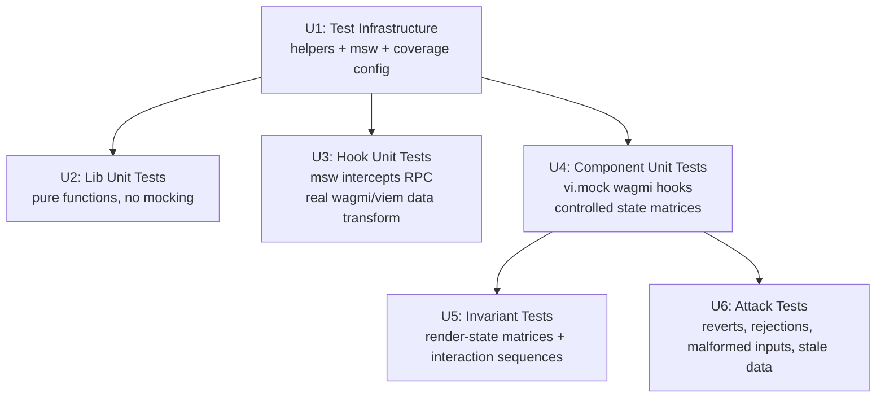

# Web Frontend Test Suite - Plan

## Goal Capsule

- **Objective:** Build a comprehensive frontend test suite covering all components, hooks, and lib modules with three test categories (unit, invariant, attack) modeled on the Solidity test suite's structure, targeting >80% line coverage and >70% branch coverage.
- **Product authority:** ce-brainstorm (dialogue confirmed: core 3 categories, both render-state and interaction invariants, add user-event + msw + coverage-v8, pragmatic coverage target).
- **Execution profile:** code — new test files, test helper infrastructure, dev dependency additions, vitest config changes.
- **Stop conditions:** All R-IDs satisfied, coverage threshold met, `npm --prefix web run lint` and `npm --prefix web run test` and `npm --prefix web run build` all green.
- **Open blockers:** none.

---

## Product Contract

### Summary

A three-category frontend test suite (unit, invariant, attack) covering all 7 components, 9 hooks, and 8 lib modules in `web/`. Unit tests verify per-component rendering, per-hook data transformation, and per-lib function correctness. Invariant tests verify UI properties that always hold across render-state matrices and interaction sequences. Attack tests verify error handling for contract reverts, wallet rejections, malformed inputs, and stale data. Uses a hybrid mocking strategy with msw for hook tests, vi.mock for component tests, and @testing-library/user-event for realistic interactions.

### Problem Frame

The Solidity suite has 13 test files across 5 categories (unit, invariant, fuzz, attack, fork) targeting >90% coverage for core contracts. The frontend has 6 test files with 36 tests covering only pure lib functions (format, lending-math, modal-logic, errors, abis) and one component smoke test (launch-scope). ActionModal (1112 lines, 12 action types with distinct form fields, approval flows, and step indicators) is completely untested. No hook tests exist — the 9 hooks that fetch contract data, manage write flows, and trap focus have zero coverage. The frontend handles contract writes, optimistic approval state, error mapping from contract reverts to user-facing copy, and focus management for modal accessibility — all untested.

### Key Decisions

- **Hybrid mocking strategy.** vi.mock for wagmi/react-query in component tests (fast, controlled state matrices); msw for hook tests (exercises real data transformation through wagmi/viem). Components need to be tested in specific states (loading, error, empty, populated) which is simpler with mocked hooks returning controlled data. Hooks need their actual data transformation logic exercised, which requires mocked RPC responses at the transport level.
- **Three categories mapped from Solidity.** Unit (per-component/hook/lib behavior) maps to Solidity unit tests. Invariant (UI properties that always hold) maps to Solidity invariant tests. Attack (adversarial reverts, wallet rejections, malformed inputs) maps to Solidity attack scenarios. Fuzz and fork are skipped.
- **Pragmatic coverage target.** >80% lines and >70% branches, not Solidity's >90%. UI branches (focus management, DOM edge cases, conditional rendering paths) are harder to reach in jsdom than contract branches in Foundry.
- **ActionModal as focal point.** 1112 lines with 12 action types, each with distinct form fields, approval state, step indicator, and contract write logic. It will dominate the test count.

### Requirements

**Test Infrastructure**

- R1. Add `@testing-library/user-event`, `msw`, and `@vitest/coverage-v8` as dev dependencies in `web/package.json`.
- R2. Create shared test helpers: a custom render function that wraps components in WagmiProvider + QueryClientProvider, mock data factories for MarketInfo, Loan, HeldStream, LiquidityPosition, LoanPool, and ActiveAction types, and msw request handlers that return mocked RPC responses for contract reads.
- R3. Configure coverage thresholds in vitest config at >80% lines and >70% branches, excluding `lib/generated.ts` and `lib/wagmi.ts` from coverage measurement.

**Unit Tests — Lib**

- R4. Expand existing lib tests (`format`, `lending-math`, `modal-logic`, `errors`, `abis`) with edge cases: zero values, max uint values, empty strings, null/undefined inputs, boundary conditions at decimal display thresholds, and slippage calculation boundaries.
- R5. Add unit tests for currently untested lib modules: `config` (env parsing, chain id enforcement, address validation, isConfiguredAddress), `query-keys` (key factory uniqueness and structure), and `ponder` (client creation, null base URL handling).

**Unit Tests — Hooks**

- R6. Test each data-fetching hook (`useAllMarkets`, `useOvrflos`, `useLending`, `useLendingLiquidity`, `useLenderPools`, `useBorrowerLoans`, `useHeldStreams`) with msw mocking RPC responses, verifying data transformation correctness, loading state transitions, error state propagation, and query key usage.
- R7. Test `useWriteFlow` verifying: writeContract call forwarding with correct args, receipt waiting state, query invalidation on success, error propagation from write and receipt phases.
- R8. Test `useFocusTrap` verifying: focus moves to first focusable element on activation, Tab and Shift+Tab cycle within the container boundaries, and focus restores to the previously focused element on deactivation.

**Unit Tests — Components**

- R9. Test each component (`MarketsApp`, `MarketsTable`, `MarketDetail`, `PositionSummary`, `PositionList`, `ActionModal`, `WalletButton`) with vi.mock for wagmi and react-query hooks, verifying correct rendering, prop handling, state transitions, and callback invocations.
- R10. ActionModal tests cover all 12 action types: each renders the correct form fields for its type, the correct step indicator (2-step or 3-step), the correct accent color (gold, cyan, or neutral), a bordered summary row with the on-chain consequence, correct action button labels, and optimistic rollback resets approvedAmount on error (tested per form component).
- R11. MarketsApp tests verify screen navigation state: Screen 1 (markets table + position summary) renders when no market is selected, Screen 2 (market detail) renders when a market is selected, and the back button returns to Screen 1.
- R12. MarketDetail tests verify balance summary rendering: three balances (ovrfloToken, underlying, PT) shown when connected, convert buttons positioned next to the relevant balance, convert buttons disabled when balance is zero, CLAIM visible only post-maturity, UNWRAP visible only when wrap capacity exists, and DEPOSIT visible only pre-maturity.

**Invariant Tests — Render-State**

- R13. Verify that empty position categories are never rendered across all component states (connected/disconnected, loading/loaded/error, has-positions/no-positions, matured/pre-maturity). No "NO ACTIVE LOANS" or similar placeholder text appears for empty categories.
- R14. Verify step indicator invariants: 2-step indicator (`[1] SIGN [2] CONFIRMED`) for no-approval actions (withdraw, claim_share, claim_stream, close, claim_matured, unwrap); 3-step indicator (`[1] APPROVE [2] SIGN [3] CONFIRMED` or stream-approval variant) for unconditional-approval actions (supply, borrow, sell, repay); conditionally 2-or-3-step for deposit and wrap (3-step when approval is needed, 2-step when allowance covers the amount or amount is zero). The APPROVE step is omitted, not shown disabled.
- R15. Verify ActionModal invariants: focus is trapped while the modal is open, Escape key closes the modal, scrim click closes the modal, action buttons are disabled during tx signing and confirming, and the modal stays open on error for retry.
- R16. Verify that disabled controls show a dim mono caption explaining why (per DESIGN.md section 8) for the two controls that currently implement captions: SUPPLY LIQUIDITY disabled when no lending deployed, and BORROW disabled when no streams available. Other disabled controls (convert buttons, PositionList action buttons, tx-in-progress states) lack captions in current code and are out of scope for this invariant until production code adds them.

**Invariant Tests — Interaction**

- R17. Verify properties hold through user action sequences using @testing-library/user-event: navigate Screen 1 to Screen 2 and back, open a modal and close via Escape, open a modal and close via scrim click, type an amount and see the preview/quote load, complete an approve-then-sign flow, reject a transaction and retry.
- R18. Verify focus management through interactions: focus moves to the modal heading on open, Tab and Shift+Tab cycle within the modal, focus returns to the triggering button on modal close.

**Attack Tests**

- R19. Test contract revert error handling: known revert strings (from `errors.ts` revertStringCopy and customErrorCopy maps) are mapped to user-facing copy via `userFacingError`, the error displays in `status-negative`, and the modal stays open for retry.
- R20. Test wallet rejection: the `isSigning` state shows the pending label, a wallet rejection sets the error state, the error displays in `status-negative`, and the modal stays open for retry.
- R21. Test malformed inputs: `parseAmount` with invalid strings returns 0n without throwing, amounts exceeding wallet balance show a validation error line in `status-negative` with the input border tinted, the action button is disabled while a validation error is present, and zero amounts disable the action button without showing a validation error.
- R22. Test stale data handling: `staleBatchCopy` detects "liquidity inactive" and "insufficient availableLiquidity" messages and returns the refresh copy, `borrowQuoteCopy` returns distinct copy for insufficient liquidity, all-self-owned liquidity, and no-liquidity-at-rate scenarios.

### Acceptance Examples

- AE1. **Covers R14.** Given the user opens a WITHDRAW action modal, the step indicator shows `[1] SIGN [2] CONFIRMED` with no APPROVE step. Given the user opens a SUPPLY action modal, the step indicator shows `[1] APPROVE [2] SIGN [3] CONFIRMED` with the active step in gold.
- AE2. **Covers R15, R18.** Given the user opens a BORROW modal and presses Tab repeatedly, focus cycles only within the modal panel. Given the user presses Escape, the modal closes and focus returns to the BORROW button that triggered it.
- AE3. **Covers R21.** Given the user types "abc" into an amount field, the action button is disabled without a validation error (parseAmount returns 0n internally). Given the user types an amount exceeding their wallet balance, a mono `INSUFFICIENT BALANCE` line appears under the input in `--negative` with the input border tinted, and the action button is disabled.
- AE4. **Covers R19.** Given a supply transaction reverts with "OVRFLOLending: liquidity inactive", the error line shows "Liquidity changed since your quote. Refreshing market depth." in `status-negative`, and the modal stays open with the action button re-enabled for retry.

### Scope Boundaries

**Deferred for later:**

- Fuzz/property-based tests (parameterized edge case generation) — explicitly deferred per dialogue.
- Mainnet fork tests (real contract integration via anvil fork) — explicitly deferred per dialogue.
- E2E browser automation (Playwright/Cypress full-app testing) — the suite is component and hook level.
- Ponder indexer testing (`web/tests/indexer/` directory exists but is empty) — separate testing concern.
- Visual regression or snapshot testing — not in scope for this pass.

**Excluded from coverage measurement:**

- `lib/generated.ts` — wagmi-cli generated ABI output (1911 lines of generated data).
- `lib/wagmi.ts` — wagmi adapter configuration (boilerplate wiring).

### Dependencies / Assumptions

- **New dev dependencies:** `@testing-library/user-event` (realistic click/type/tab simulation), `msw` (mock Service Worker for RPC response interception), `@vitest/coverage-v8` (V8-native coverage tracking).
- **Existing dependencies retained:** `vitest`, `jsdom`, `@testing-library/react`, `@testing-library/jest-dom`, `@testing-library/dom`, `@vitejs/plugin-react`.
- **Assumption:** msw can intercept wagmi/viem transport requests in the jsdom test environment. This is the standard msw usage pattern for wagmi testing but has not been verified in this repo.
- **Assumption:** The existing `vi.mock("wagmi", ...)` pattern in `launch-scope.test.tsx` will continue to work alongside msw-based hook tests without conflict. Component tests use vi.mock; hook tests use msw; they do not run in the same test file.

Product Contract unchanged.

---

## Planning Contract

### Key Technical Decisions

- **KTD1: Hybrid mocking architecture.** Component tests use `vi.mock("wagmi", ...)` to return controlled data for each state (loading, error, populated, empty). Hook tests use msw to intercept JSON-RPC requests at the transport level, allowing real wagmi/viem data transformation logic to execute against mocked contract responses. The two strategies never mix in the same test file. This split exists because components need predictable render output across many states (easier with mocked hooks), while hooks need their parsing, filtering, and error-handling logic exercised (impossible with mocked hooks).

- **KTD2: Shared test helper layer.** All test files import from `web/tests/helpers/` rather than duplicating provider wrappers, fixture factories, or mock factories. Four helper modules: `render.tsx` (custom render wrapping WagmiProvider + QueryClientProvider, returning user-event setup), `mock-data.ts` (fixture factories for MarketInfo, Loan, HeldStream, LiquidityPosition, LoanPool, ActiveAction), `msw-handlers.ts` (reusable MSW request handlers for common contract reads), and `wagmi-mocks.ts` (reusable vi.mock factory for wagmi hooks with configurable return values).

- **KTD3: Coverage configuration.** `@vitest/coverage-v8` provider with thresholds: 80% lines, 70% branches. Excludes `lib/generated.ts` (1911 lines of wagmi-cli ABI output) and `lib/wagmi.ts` (boilerplate adapter config). Coverage runs automatically via `vitest run --coverage` and is enforced as a verification gate.

- **KTD4: ActionModal parametrized test matrix.** Each of the 12 action types is tested via `it.each` with a shared test shape: correct title, correct accent color, correct step indicator (2-step, 3-step, or conditional 2-or-3-step for deposit/wrap), correct form fields, correct summary row, and correct action button label. This avoids 12 copy-pasted test blocks while ensuring every action type is covered. State-specific tests (approval flow, validation, tx states) are separate per-action-type tests.

- **KTD5: State matrix fixtures for invariant tests.** A shared fixture set in `mock-data.ts` represents all meaningful component states: connected/disconnected, loading/loaded/error, has-positions/no-positions, matured/pre-maturity. Invariant tests iterate over these fixtures and assert properties hold in every state. This mirrors the Solidity invariant handler pattern where ghost state tracks all reachable states.

### High-Level Technical Design

The test suite has three layers. The infrastructure layer (U1) provides shared helpers, msw handlers, mock data factories, and coverage configuration. Unit tests (U2, U3, U4) build on the infrastructure and are ordered by dependency: lib tests need no mocking, hook tests need msw, component tests need vi.mock. Invariant tests (U5) and attack tests (U6) build on the component test patterns from U4, using the same render helper and state matrix fixtures to verify properties across states and through interaction sequences.

---

## Implementation Units

### U1. Test infrastructure

- **Goal:** Add dev dependencies, create shared test helpers, configure coverage, and set up msw server lifecycle.
- **Requirements:** R1, R2, R3.
- **Dependencies:** none.
- **Files:** `web/package.json`, `web/vitest.config.ts`, `web/tests/setup.ts`, `web/tests/helpers/render.tsx` (new), `web/tests/helpers/mock-data.ts` (new), `web/tests/helpers/msw-handlers.ts` (new), `web/tests/helpers/wagmi-mocks.ts` (new), `web/tests/components/launch-scope.test.tsx` (refactor to use helpers).
- **Approach:** Install `@testing-library/user-event`, `msw`, `@vitest/coverage-v8` as dev dependencies. Create four helper modules under `web/tests/helpers/`. The custom render wraps components in a minimal WagmiProvider (with a test config using http transport to an msw-intercepted endpoint) and QueryClientProvider (with a fresh client per test to avoid cache leakage). Mock data factories return typed fixtures with sensible defaults that individual tests override per-field. MSW handlers mock `eth_call`, `eth_blockNumber`, and `eth_chainId` responses for common contract reads (balanceOf, allowance, liquidityPositions, loans, loanPools, aprMinBps, etc.). Additionally, either a Ponder HTTP msw handler returning mocked `sablier_streams` rows, or a `vi.mock('@/lib/ponder', ...)` in useHeldStreams tests, is required since useHeldStreams depends on a Ponder HTTP endpoint (not JSON-RPC). The wagmi-mocks module exports a reusable `vi.mock("wagmi", ...)` factory that accepts configurable return values per hook. Update `tests/setup.ts` to start msw server before tests, reset handlers between tests, and close server after all tests. Set `NEXT_PUBLIC_OVRFLO_FACTORY` to a non-zero test address and `NEXT_PUBLIC_CHAIN_ID=1` in the vitest environment (via `setup.ts` or `vitest.config.ts` define) so hooks that depend on `factoryAddress` from `@/lib/config` resolve to a valid address. Update `vitest.config.ts` with coverage provider and thresholds. Refactor `launch-scope.test.tsx` to import from shared helpers instead of inline mocks.
- **Patterns to follow:** Existing `launch-scope.test.tsx` mock pattern (vi.mock factory shape). wagmi testing docs for provider setup with msw.
- **Test scenarios:**
  - **Happy path:** Custom render wraps a component in providers and returns a user-event instance. Mock data factory creates a valid MarketInfo with all required fields. msw handler returns a mocked balanceOf response.
  - **Edge case:** Mock data factory with partial overrides (only change `lending` to null, rest stays default). Custom render without a connected wallet (addresses array empty).
  - **Integration:** Refactored `launch-scope.test.tsx` passes with the same 2 assertions using shared helpers instead of inline mocks. msw server starts and stops cleanly across the test run.
- **Verification:** `npm --prefix web run test` passes with existing 36 tests (refactored launch-scope test still green). `npm --prefix web run lint` passes with no new warnings from helper files.

### U2. Lib unit tests — expand and complete

- **Goal:** Expand existing lib tests with edge cases and add tests for untested lib modules.
- **Requirements:** R4, R5.
- **Dependencies:** U1 (coverage config to measure progress).
- **Files:** `web/tests/lib/format.test.ts`, `web/tests/lib/lending-math.test.ts`, `web/tests/lib/modal-logic.test.ts`, `web/tests/lib/errors.test.ts`, `web/tests/lib/abis.test.ts`, `web/tests/lib/config.test.ts` (new), `web/tests/lib/query-keys.test.ts` (new), `web/tests/lib/ponder.test.ts` (new).
- **Approach:** Expand each existing test file with edge cases at boundaries. For `format.test.ts`: zero values, max uint128, sub-1 values (4 decimal display), null/undefined address, maturity at epoch 0. For `lending-math.test.ts`: enumerateIds with nextId=1 (empty), nextId=MAX_ENUMERATION_IDS+1 (capped), loanOutstanding with drawn+repaid >= obligation, classifyLiquidity with all-self-owned and none-at-rate. For `modal-logic.test.ts`: applySlippageDown/Up with 0 bps and 10000 bps, canCloseLoan with closed loan and insufficient withdrawable, repayMax with walletBalance=0, chooseSellNowLiquidity with no matching positions. For `errors.test.ts`: every entry in customErrorCopy and revertStringCopy, unknown error names, BaseError wrapping. For `config.test.ts`: test parseChainId via `vi.resetModules` with dynamic imports and env var manipulation (parseChainId is private and runs at module import time), isConfiguredAddress with zero address and real address. For `query-keys.test.ts`: key uniqueness across different inputs, structure consistency (same inputs produce same key). For `ponder.test.ts`: createPonderClient with undefined baseUrl (returns null), valid URL (returns client), trailing slash normalization.
- **Patterns to follow:** Existing test structure in `lending-math.test.ts` (describe blocks per function, it blocks per scenario).
- **Test scenarios:**
  - **Happy path:** formatTokenAmount with typical values renders correct decimals and symbol. loanOutstanding with typical loan returns correct difference. userFacingError with known revert string returns mapped copy.
  - **Edge cases:** formatTokenAmount(0n, "wstETH") returns "0.00 wstETH". formatTokenAmount with sub-1 value uses 4 decimal places. enumerateIds(1n) returns empty array. applySlippageDown(100n, 0n) returns 100n (no slippage). parseAddress with invalid string throws.
  - **Error paths:** userFacingError with unrecognized error returns generic fallback. createPonderClient(undefined) returns null. parseChainId("2") throws (chain id must be 1) — tested via vi.resetModules with NEXT_PUBLIC_CHAIN_ID=2 set before dynamic import.
- **Verification:** `npm --prefix web run test` passes with all new lib tests green. Coverage for `web/lib/` (excluding generated.ts and wagmi.ts) reaches >80% lines.

### U3. Hook unit tests

- **Goal:** Test all 9 hooks with msw mocking RPC responses, verifying data transformation, loading/error states, and query key usage.
- **Requirements:** R6, R7, R8.
- **Dependencies:** U1 (msw handlers, mock data, render helper).
- **Files:** `web/tests/hooks/useWriteFlow.test.ts` (new), `web/tests/hooks/useFocusTrap.test.ts` (new), `web/tests/hooks/useLending.test.ts` (new), `web/tests/hooks/useLendingLiquidity.test.ts` (new), `web/tests/hooks/useLenderPools.test.ts` (new), `web/tests/hooks/useBorrowerLoans.test.ts` (new), `web/tests/hooks/useHeldStreams.test.ts` (new), `web/tests/hooks/useOvrflos.test.ts` (new), `web/tests/hooks/useAllMarkets.test.ts` (new).
- **Approach:** Each hook test renders a test component that calls the hook and exposes the result via a ref or state callback. msw handlers return mocked contract read responses (e.g., liquidityPositions array, loans array, aprMinBps value). Tests verify the hook's data transformation: filtering by market/user, sorting, mapping raw contract results to typed objects, computing derived values (loanOutstanding, claimable, enumerateIds). Loading and error states are verified by controlling msw response delay and status. useWriteFlow tests mock useWriteContract and useWaitForTransactionReceipt via vi.mock to simulate signing, confirming, confirmed, and error states. useFocusTrap tests render a container with focusable elements and verify DOM focus behavior using jsdom's focus management.
- **Patterns to follow:** React hooks testing pattern: `renderHook` from `@testing-library/react` with a wrapper providing QueryClientProvider and WagmiProvider. Existing mock pattern from `launch-scope.test.tsx` for useWriteContract/useWaitForTransactionReceipt.
- **Test scenarios:**
  - **Happy path — data hooks:** useLending returns params (aprMinBps, nextLiquidityId, etc.) from mocked multicall. useLendingLiquidity returns filtered, sorted liquidity positions. useBorrowerLoans returns loans filtered by borrower address. useHeldStreams returns streams with withdrawable amounts from mocked Sablier reads. useAllMarkets returns assembled MarketInfo objects from factory + vault reads.
  - **Happy path — useWriteFlow:** writeContract is called with correct args. On success, query invalidation fires for all provided keys. Receipt waiting transitions from isLoading to isSuccess.
  - **Happy path — useFocusTrap:** On activation, focus moves to first focusable element. Tab from last element wraps to first. Shift+Tab from first element wraps to last. On deactivation, focus returns to previously focused element.
  - **Edge cases — data hooks:** useLendingLiquidity with nextLiquidityId=1n returns empty array. useBorrowerLoans with null borrower returns empty array. useHeldStreams with null user returns empty streams and isLoading=false.
  - **Error paths — data hooks:** msw returns error response, hook propagates error. useWriteFlow: write error propagates, receipt error propagates.
  - **Integration:** useWriteFlow invalidates all provided query keys on confirmed receipt. useAllMarkets composes useOvrflos + multicall correctly (vault count → vault infos → market params).
- **Verification:** `npm --prefix web run test` passes with all hook tests green. Coverage for `web/hooks/` reaches >80% lines.

### U4. Component unit tests

- **Goal:** Test all 7 components with vi.mock for wagmi/react-query, verifying rendering, props, state, and callbacks.
- **Requirements:** R9, R10, R11, R12.
- **Dependencies:** U1 (render helper, mock data, wagmi-mocks).
- **Files:** `web/tests/components/MarketsTable.test.tsx` (new), `web/tests/components/MarketsApp.test.tsx` (new), `web/tests/components/MarketDetail.test.tsx` (new), `web/tests/components/PositionSummary.test.tsx` (new), `web/tests/components/PositionList.test.tsx` (new), `web/tests/components/ActionModal.test.tsx` (new), `web/tests/components/WalletButton.test.tsx` (new).
- **Approach:** Each component test uses the shared render helper and wagmi-mocks factory to control hook return values. MarketsTable is pure presentational (no hooks) so tests are straightforward render assertions. MarketsApp tests verify the selectedMarket state machine: null → Screen 1, set → Screen 2, back → Screen 1. MarketDetail tests verify balance summary (3 balances, convert button states per maturity/wrap-capacity), PositionList rendering, and activeAction modal dispatch. PositionSummary tests verify omission when no user or no positions. PositionList tests verify loading/error states, empty category omission, and action button dispatch. ActionModal tests use `it.each` with all 12 action types (KTD4) plus per-action-type state tests. WalletButton tests mock useAppKit and useDisconnect.
- **Patterns to follow:** Existing `launch-scope.test.tsx` render + screen.getByText/queryByText pattern. `it.each` for parametrized ActionModal tests.
- **Test scenarios:**
  - **Happy path — MarketsTable:** Renders 4 columns (Asset, Fee, Maturity, Action), "Approved Pendle Series" heading, SELECT button per row, empty state with colSpan=4.
  - **Happy path — MarketsApp:** Screen 1 renders MarketsTable + PositionSummary when selectedMarket=null. Screen 2 renders MarketDetail when selectedMarket is set. Back button calls onBack which clears selectedMarket.
  - **Happy path — MarketDetail:** Back button renders. Balance summary shows 3 balances when connected. SUPPLY LIQUIDITY button present, disabled when no lending. BORROW button present, disabled when no streams. Convert buttons: WRAP next to underlying, DEPOSIT PT next to PT, UNWRAP/CLAIM next to ovrfloToken. CLAIM visible only post-maturity. UNWRAP visible only when wrap capacity > 0.
  - **Happy path — PositionSummary:** Omitted when no user. Omitted when user has no positions. Shows counts when user has positions.
  - **Happy path — PositionList:** Loading state shows "LOADING". Error state shows error in status-negative. Empty categories omitted (no LENDING/BORROWING/STREAMS headers). Action buttons on each row call onAction with correct ActiveAction.
  - **Happy path — ActionModal (parametrized, Covers AE1):** For each of 12 action types: correct modal title, correct accent color (gold for supply/withdraw/claim_share/deposit/claim_matured/claim_stream, cyan for borrow/sell/repay/close, neutral for wrap/unwrap), correct step indicator (2-step for withdraw/claim_share/claim_stream/close/claim_matured/unwrap, 3-step for supply/deposit/wrap/borrow/sell/repay), correct form fields for its type, correct action button label, bordered summary row present.
  - **Happy path — WalletButton:** Shows connect button when disconnected, address + disconnect when connected.
  - **Edge cases — MarketDetail:** Disconnected user: no balance summary section. Matured market: CLAIM visible, DEPOSIT PT hidden. Pre-maturity: DEPOSIT PT visible, CLAIM hidden. Zero wrap capacity: UNWRAP hidden.
  - **Edge cases — PositionList:** All hooks loading: shows "LOADING". All hooks error: shows error in status-negative. Some categories empty, some populated: only populated categories render.
  - **Edge cases — ActionModal:** Borrow from primary button (no streamId): stream selector appears. Borrow from stream row (streamId set): stream pre-selected, no selector. Supply with approval needed: APPROVE button shows. Supply with approval covered: SUPPLY button shows. Optimistic rollback: on tx error, approvedAmount resets to 0n (tested in SupplyForm, ConvertForm, RepayForm).
  - **Integration:** MarketDetail action button click sets activeAction, ActionModal renders, onClose clears activeAction. PositionList action button click calls onAction which sets activeAction in MarketDetail.
- **Verification:** `npm --prefix web run test` passes with all component tests green. Coverage for `web/components/` reaches >80% lines.

### U5. Invariant tests

- **Goal:** Verify UI properties that always hold across render-state matrices and interaction sequences.
- **Requirements:** R13, R14, R15, R16, R17, R18.
- **Dependencies:** U1 (state matrix fixtures, render helper), U4 (component render patterns).
- **Files:** `web/tests/invariant/render-state.test.tsx` (new), `web/tests/invariant/interaction.test.tsx` (new).
- **Approach:** Render-state invariants iterate over state matrix fixtures (KTD5): {connected, disconnected} x {loading, loaded, error} x {hasPositions, noPositions} x {matured, preMaturity}. For each state, render the relevant component and assert properties: empty categories never rendered (R13), step indicator correct step count (R14), disabled controls have captions (R16). Interaction invariants use @testing-library/user-event to simulate sequences: screen navigation, modal open/close via Escape and scrim, amount typing, approve-sign flow, reject-retry flow. Assert properties hold at each step: focus trapped (R15, R18), buttons disabled during tx (R15), modal stays open on error (R15).
- **Patterns to follow:** `it.each` with state matrix arrays. user-event `setup()` for interaction sequences.
- **Test scenarios:**
  - **Render-state — empty categories (Covers R13):** For each state in {connected, disconnected} x {loading, loaded, error} x {hasPositions, noPositions}, PositionList never renders "NO ACTIVE LOANS", "NO ACTIVE LENDING", or "NO HELD STREAMS" text.
  - **Render-state — step indicator (Covers AE1, R14):** For each of 12 action types, ActionModal step indicator has exactly 2 steps for no-approval actions (withdraw, claim_share, claim_stream, close, claim_matured, unwrap), exactly 3 steps for unconditional-approval actions (supply, borrow, sell, repay), and 2-or-3 steps for conditional-approval actions (deposit, wrap) depending on allowance state. APPROVE step absent (not disabled) for 2-step actions.
  - **Render-state — disabled captions (R16):** For the two disabled states that currently have captions (no lending deployed, no streams available), a dim mono caption is present explaining why.
  - **Interaction — screen navigation (R17):** Click SELECT on a market row → Screen 2 renders. Click BACK → Screen 1 renders. Repeat 3 times, verify state is consistent.
  - **Interaction — modal close (Covers AE2, R15, R17, R18):** Open modal via action button, press Escape → modal closes, focus returns to trigger button. Open modal, click scrim → modal closes. Open modal, Tab through focusable elements → focus cycles within modal.
  - **Interaction — amount and preview (R17):** Open SUPPLY modal, type amount → summary row updates. Open BORROW modal with stream, type amount → quote region shows LOADING then data.
  - **Interaction — approve-sign flow (R17):** Open SUPPLY modal, type amount, click APPROVE → isSigning state shows. Mock approval confirmed → SUPPLY button appears. Click SUPPLY → isSigning state shows. Mock confirmed → CONFIRMED shows, CLOSE button appears.
  - **Interaction — reject-retry (R15, R17):** Open SUPPLY modal, type amount, click SUPPLY, mock rejection → error shows in status-negative, modal stays open, action button re-enabled.
- **Verification:** `npm --prefix web run test` passes with all invariant tests green. No state matrix combination produces a property violation.

### U6. Attack tests

- **Goal:** Verify error handling for contract reverts, wallet rejections, malformed inputs, and stale data.
- **Requirements:** R19, R20, R21, R22.
- **Dependencies:** U1 (mock data, render helper), U4 (ActionModal render patterns).
- **Files:** `web/tests/attack/contract-reverts.test.tsx` (new), `web/tests/attack/wallet-rejection.test.tsx` (new), `web/tests/attack/malformed-inputs.test.tsx` (new), `web/tests/attack/stale-data.test.ts` (new).
- **Approach:** Contract revert tests mock useWriteFlow to return errors with known revert strings from `errors.ts` and verify the full error-to-UI pipeline: userFacingError maps the string, TxState displays it in status-negative, modal stays open. Wallet rejection tests mock useWriteContract to return isPending=true then error=null (user rejected), verifying the signing state display and error recovery. Malformed input tests verify parseAmount behavior indirectly through the UI by typing edge-case strings into ActionModal amount fields and observing button disabled state and validation error display. Direct parseAmount calls are not possible because it is a private function inside ActionModal.tsx. Stale data tests call staleBatchCopy and borrowQuoteCopy directly with various message strings and liquidity scenarios.
- **Patterns to follow:** Direct function tests for pure error-mapping functions (like existing `errors.test.ts`). Component render + vi.mock for UI pipeline tests.
- **Test scenarios:**
  - **Happy path — contract reverts (Covers AE4, R19):** Mock tx.error with Error("OVRFLOLending: liquidity inactive") → TxState shows "Liquidity changed since your quote. Refreshing market depth." in status-negative. Mock tx.error with Error("OVRFLOLending: slippage") → shows "Price moved outside your limit." Mock tx.error with ContractFunctionRevertedError containing errorName "MarketNotApproved" → shows "This market is not approved for OVRFLO." Modal stays open in all cases.
  - **Happy path — wallet rejection (R20):** Mock useWriteContract isPending=true → TxState shows pending label + "SIGNING". Mock error with rejection message → TxState shows user-facing error in status-negative. Modal stays open, action button re-enabled.
  - **Happy path — malformed inputs (Covers AE3, R21):** Type "" into amount field: action button disabled, no validation error. Type "abc": action button disabled, no validation error. Type "1.5": amount parsed correctly, action button enabled if balance sufficient. Type "-1": action button disabled (UI validation guards against negative amounts). ActionModal with balance < amount: "INSUFFICIENT BALANCE" shows in status-negative, input has input-error class, action button disabled. ActionModal with amount=0: action button disabled, no validation error shown.
  - **Happy path — stale data (R22):** staleBatchCopy("OVRFLOLending: liquidity inactive") returns "Liquidity changed since your quote. Refreshing market depth." staleBatchCopy("OVRFLOLending: insufficient availableLiquidity") returns same refresh copy. staleBatchCopy("OVRFLOLending: duplicate or unsorted ids") returns same refresh copy. staleBatchCopy("unrelated error") returns null. borrowQuoteCopy with sufficient=true returns "Liquidity available." borrowQuoteCopy with all-self-owned returns "Only your own liquidity is available at this APR." borrowQuoteCopy with none-at-rate returns "No liquidity is posted at this APR."
  - **Edge cases — contract reverts:** Unknown revert string → userFacingError returns generic fallback "The transaction failed. Check the entered values and try again." Error with no message → returns generic fallback.
  - **Edge cases — malformed inputs:** Type very large number (1000000): amount parsed correctly, button enabled if balance sufficient. Type trailing whitespace "1.5 ": amount parsed correctly. Type "0.000001": small amount parsed correctly, button enabled if balance sufficient.
- **Verification:** `npm --prefix web run test` passes with all attack tests green. Coverage for error-handling code paths in `errors.ts`, `modal-logic.ts`, and ActionModal validation reaches >80% lines.

---

## Verification Contract

| Gate | Command | Applies to |
|---|---|---|
| Unit tests | `npm --prefix web run test` | All units (existing + new tests must pass) |
| Coverage | `npm --prefix web run test -- --coverage` | All units (threshold: >80% lines, >70% branches, excluding `lib/generated.ts` and `lib/wagmi.ts`) |
| Lint | `npm --prefix web run lint` | All units |
| Build | `npm --prefix web run build` | U1 (vitest config changes must not break build) |

The pretest script (`npm run typegen && bash scripts/check-banned-patterns.sh`) runs automatically before `vitest run`. The coverage gate is separate from the standard test gate — run with `-- --coverage` to measure. Coverage is a signal, not a hard CI gate: if a specific branch is unreachable in jsdom (e.g., a DOM edge case), document it as an uncovered branch rather than writing a test that hacks around jsdom limitations.

---

## Definition of Done

- All R-IDs (R1 through R22) are satisfied.
- `npm --prefix web run test` passes with all existing and new tests green.
- `npm --prefix web run test -- --coverage` reports >80% lines and >70% branches for `web/components/`, `web/hooks/`, and `web/lib/` (excluding `lib/generated.ts` and `lib/wagmi.ts`).
- `npm --prefix web run lint` passes with no new warnings.
- `npm --prefix web run build` succeeds.
- `web/tests/helpers/` contains `render.tsx`, `mock-data.ts`, `msw-handlers.ts`, and `wagmi-mocks.ts`.
- `web/tests/hooks/` contains test files for all 9 hooks.
- `web/tests/components/` contains test files for all 7 components (including refactored `launch-scope.test.tsx`).
- `web/tests/invariant/` contains `render-state.test.tsx` and `interaction.test.tsx`.
- `web/tests/attack/` contains `contract-reverts.test.tsx`, `wallet-rejection.test.tsx`, `malformed-inputs.test.tsx`, and `stale-data.test.ts`.
- ActionModal test suite covers all 12 action types with correct step indicators, accent colors, and form fields.
- No abandoned-attempt or experimental test code left in the diff.
