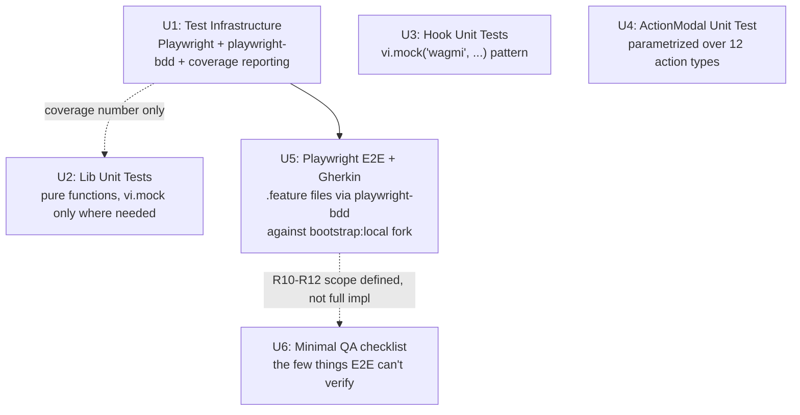

# Web Frontend Test Suite - Plan

## Revision note (2026-07-27)

The original version of this plan mirrored the Solidity suite's five-category
taxonomy (unit, invariant, fuzz-equivalent, attack, formal-verification-equivalent)
onto the frontend, plus a full quality-metrics enforcement layer (mutation testing,
cyclomatic-complexity gates, assertion-density scripts, flakiness quarantine,
quarterly dead-test audits). That mapping was the source of the scope inflation:
35 requirements and 10 implementation units to add tests to a frontend nobody on
the team has deep testing expertise in. This revision keeps the two things that
are unambiguously worth having -- fast unit tests for pure logic/hooks, and
executable Gherkin scenarios for the key user journeys -- and drops everything
whose primary purpose was measuring test quality rather than catching regressions.

The biggest structural change: **Gherkin/BDD moves from a hand-rolled vitest
runner to `playwright-bdd`** (real library, MIT, actively maintained, converts
`.feature` files into native Playwright tests), and **Playwright E2E runs
against the project's existing seeded local Anvil fork** (`npm --prefix web run
bootstrap:local`) instead of against mocked RPC responses. Real integration
truth from a real fork is simpler to reason about than a hybrid
`msw`-for-hooks / `vi.mock`-for-components mocking architecture, and it's the
natural way to test a UI when you're not a frontend-testing specialist: click
through the real app, assert on what's visible.

**Doc-review pass (2026-07-27):** a 7-persona `ce-doc-review` surfaced that
several "open questions" in the first revision were actually resolvable now
(E2E wallet signing, fork-state isolation between scenarios), that the plan
undercounted existing test coverage, and that a few requirements had
internal contradictions (Ponder scope, error-state triad vs. per-journey
reality). Those are folded into the sections below; nothing here is a
second independent revision, just the first revision corrected.

**Codebase-sync pass (2026-07-27):** re-checked every file/hook/lib-module
name in this plan against the current `web/` tree. Found: a new hook
(`useTxQueue`, already tested) this plan never mentioned; six existing lib
test files (`borrow`, `claim-all`, `demand`, `invalidate`, `positions`,
`router`) R4 didn't list; `ActionModal` coverage that's partial and
scattered rather than fully absent; and two `ActionModal` action types
(`repay`, `close`) with no journey anywhere in R10. Also: CI wiring for
`bootstrap:local`/`test:e2e` is now explicitly deferred, low priority --
this plan builds and proves the suite locally first.

## Goal Capsule

- **Objective:** Add a frontend test suite covering the two things this team can
  build and maintain without dedicated testing expertise: (1) fast unit tests
  for pure `web/lib/` functions and `web/hooks/` data hooks, and (2) Playwright
  E2E tests, written as Gherkin `.feature` scenarios via `playwright-bdd`, that
  exercise the key user journeys against the seeded local Anvil fork. A thin
  component-unit tier covers the few components with real branching logic worth
  isolating (ActionModal's per-action-type step indicator/accent color). A
  minimal QA checklist (R13) names the handful of pixel-level checks E2E
  structurally cannot verify, so that gap is written down instead of
  silently unowned.
- **Product authority:** Revises the 2026-07-23 ce-brainstorm-derived plan per
  user direction on 2026-07-27: keep Gherkin (via Playwright, not a custom
  runner), drop mutation testing and the quality-metrics enforcement layer,
  strip anything not load-bearing for actually testing the frontend.
- **Execution profile:** code — new test files, Playwright + playwright-bdd
  setup, a handful of new hook/lib test files, dev dependency additions.
- **Stop conditions:** All R-IDs satisfied; `npm --prefix web run test` and
  `npm --prefix web run test:e2e` and `npm --prefix web run build` all green;
  every acceptance example (AE1-AE5) has an executable `.feature` scenario.
- **Open blockers:** none.

---

## Product Contract

### Summary

A two-tier frontend test suite: unit tests for `web/lib/` (pure functions) and
`web/hooks/` (data/write hooks) using the existing `vi.mock` pattern already in
use in this repo's hook tests, plus a small set of component unit tests for
branching-heavy components; and Playwright E2E tests written as Gherkin
`.feature` files (via `playwright-bdd`) run against the seeded local Anvil fork,
covering the acceptance examples and key user journeys end to end, including
their primary error states (insufficient balance, contract revert, stale
quote). No mutation testing, no custom test-quality enforcement scripts, no
hand-rolled Gherkin runner.

### Problem Frame

The frontend already has 17 lib/hook test files and 10 component test files
today, including `useLoanBook`, `useApprovalWriteFlows`, `useStaleRecovery`,
and `lib/convert.ts` added during a recent architecture pass -- more than
earlier counts in this plan credited. What existing coverage doesn't substitute for: `ActionModal` (1100+ lines,
12 action types with distinct form fields, approval flows, and step
indicators) has scattered, incidental coverage for 3 of its 12 action types
(`supply`, `borrow`, `deposit` get exercised as a side effect of
`supply-form.test.tsx`, `borrow-form.test.tsx`, and `deposit-cap.test.tsx`)
but no systematic test of the step-indicator/accent-color/button-label
table across all 12 -- and there is no end-to-end coverage of any user
journey at all -- the only way to verify a journey currently works is to
click through it by hand against `bootstrap:local`.

### Key Decisions

- **Playwright + `playwright-bdd` for Gherkin, not a custom runner.**
  (session-settled: user-directed — rejected alternative: the original plan's
  KTD6, a hand-written `.feature`-file parser inside vitest.) `playwright-bdd`
  already solves this: it converts `.feature` files into native Playwright
  tests, so Playwright stays the single test runner (fixtures, auto-waiting,
  trace viewer, parallel workers all still apply) and no bespoke
  parsing/step-matching engine has to be written or maintained.
- **E2E runs against the real seeded fork, not mocked RPC.** `bootstrap:local`
  already exists and already seeds real on-chain state for local testing. E2E
  tests hit the actual app against that fork -- real wagmi calls, real contract
  reads/writes -- instead of maintaining an `msw` handler for every contract
  read the UI performs. This is both simpler to build (no mock-response
  maintenance as the contracts evolve) and closer to what actually catches
  regressions (a wrong ABI encoding or a stale contract address breaks a real
  call; it can't break a mocked one).
- **E2E signs via a mock wagmi connector on a devnet-only key, not a
  deferred question.** No test-mode connector exists in `web/lib/wagmi.ts`
  today (Reown AppKit/WalletConnect only), so a wagmi `mock` connector,
  gated behind an E2E-only env var (e.g. `NEXT_PUBLIC_E2E=1`) and configured
  with a well-known zero-value Anvil devnet private key, is new wiring --
  never a key holding real value on any chain. This bypasses the real
  Connect-Wallet/WalletConnect UI; that flow is not exercised by any journey
  scenario under this decision and would need a separate, explicit scenario
  if it needs coverage later. See KTD6.
- **E2E scenarios isolate via Anvil snapshot/revert, not shared mutable fork
  state.** Every journey (borrow, supply, claim-all, adjust-rate) mutates
  real on-chain state on one seeded fork, and Playwright's default parallel
  workers stay enabled -- so each scenario snapshots the fork
  (`evm_snapshot`) before running and reverts (`evm_revert`) after, keeping
  workers safe without a new dependency (Anvil supports both natively). If
  that fixture proves awkward to wire correctly, the fallback is `workers: 1`
  for the e2e project, not shipping with no isolation story. See KTD7.
- **No mutation testing.** (session-settled: user-directed — rejected
  alternative: the original plan's U9, Stryker-based mutation testing with a
  maintained survivor baseline.) Mutation testing measures test *quality*, not
  regression coverage, and requires ongoing baseline maintenance (surviving
  mutants have to be triaged every time the baseline shifts). That's
  infrastructure for a team with a mature test suite deciding whether their
  tests are good enough -- not the right next investment for a codebase with
  near-zero current coverage.
- **No custom quality-metrics enforcement layer.** Cyclomatic-complexity CI
  gates, an assertion-density script, a generated quality-report file, a
  3x-shuffle flakiness-quarantine process, and a "every new function needs a
  test" CI check are all speculative infrastructure with no current consumer --
  each is a new abstraction/script to build and maintain before a single real
  test exists. Coverage is tracked informally (see R3) rather than as a
  multi-dimensional hard CI gate.
- **Component unit tests are narrow, not exhaustive.** Only components with
  real conditional rendering logic worth isolating in a fast, no-browser test
  get one (`ActionModal`'s step-indicator/accent-color/form-field table across
  its 12 action types is the clear case). Everything experiential --
  navigation, modal open/close, focus behavior, error banners, disabled-state
  captions -- is exercised more realistically by E2E than by a mocked render.

### Requirements

**Test Infrastructure**

- R1. Add `@playwright/test` and `playwright-bdd` as dev dependencies in
  `web/package.json`. Add a `web/playwright.config.ts` using
  `defineBddConfig({ features: 'tests/e2e/**/*.feature', steps: 'tests/e2e/steps/**/*.ts' })`.
  Add `test:e2e` (`bddgen && playwright test`) and `test:e2e:ui` (Playwright's
  UI mode, for local debugging) scripts.
- R2. Document the E2E prerequisite in `web/tests/e2e/README.md`: E2E tests
  require a running local Anvil fork seeded via `npm --prefix web run
  bootstrap:local` (existing script, not new infrastructure) and the dev
  server pointed at it; run non-interactively with `BOOT_NO_UI=1` so the
  script doesn't `exec` into a foreground dev server. **CI wiring is
  explicitly out of scope here and low priority** -- this repo has no CI
  workflow configuration today, so `test:e2e` is a local developer command
  for now. If/when CI wiring is picked up later, it will additionally need:
  a CI runner with Foundry (`anvil`/`forge`/`cast`) and Docker on `PATH`,
  a funded `MAINNET_RPC_URL` archive-RPC secret, and a measured runtime
  budget (see Verification Contract) -- noted here for whoever picks it up,
  not as work this plan commits to.
- R3. Add `@vitest/coverage-v8` as a dev dependency; report lines/branches for
  `web/lib/` and `web/hooks/` (excluding `lib/generated.ts` and `lib/wagmi.ts`)
  via `npm --prefix web run test -- --coverage`. Advisory only -- surfaced in
  the PR diff for the author to eyeball, not a hard CI gate. No per-file
  threshold, no multi-dimensional enforcement.

**Unit Tests — Lib**

- R4. Expand existing lib tests (`format`, `lending-math`, `modal-logic`,
  `errors`, `abis`, `convert`, `borrow`, `claim-all`, `demand`, `invalidate`,
  `positions`, `router`) with edge cases: zero values, max uint values,
  empty strings, boundary conditions at decimal display thresholds.
- R5. Add unit tests for currently untested lib modules: `config` (env
  parsing, chain id enforcement, `isConfiguredAddress`), `query-keys` (key
  uniqueness), `ponder` (client creation, null base URL handling).

**Unit Tests — Hooks**

- R6. Test each data-fetching hook (`useAllMarkets`, `useOvrflos`,
  `useLending`, `useLendingLiquidity`, `useHeldStreams`) using
  the existing `vi.mock("wagmi", ...)` pattern already established in this
  session's `useLoanBook.test.tsx` -- no `msw`. Verify data transformation
  (filtering, sorting, derived-value computation), loading/error propagation.
  (`useLoanBook` itself already has this coverage from this session's
  `useLoanBook.test.tsx` -- it's the reference pattern, not a new target.)
- R7. `useWriteFlow`, `useApprovalWriteFlows`, and `useTxQueue` already have
  test coverage (`useWriteFlow.test.tsx`, `useApprovalWriteFlows.test.tsx`,
  `useTxQueue.test.tsx`, all existing) -- verify they still pass rather than
  rewriting them; only extend if a gap is found (writeContract call
  forwarding, receipt-waiting state, query invalidation on success, error
  propagation, sequential-queue advancement for `useTxQueue`).
- R8. Test `useFocusTrap` and `useStaleRecovery`: focus-cycling behavior; the
  latter already partly covered by this session's `useStaleRecovery.test.tsx`.

**Unit Tests — Components (narrow)**

- R9. `ActionModal` parametrized test (`it.each` over the 12 action types):
  correct step indicator (2-step vs 3-step vs conditional), correct accent
  color, correct form fields, correct action button label. Consolidates the
  step-indicator/accent assertions currently scattered incidentally across
  `supply-form.test.tsx`, `borrow-form.test.tsx`, and `deposit-cap.test.tsx`
  (3 of 12 action types) into one systematic table covering all 12,
  including the 9 currently untouched by any test (`withdraw`,
  `claim_share`, `claim_matured`, `wrap`, `unwrap`, `claim_stream`, `repay`,
  `close`, `adjust_rate`). This is the one component whose branching logic
  is dense enough to be worth isolating from a full page load.

**Playwright E2E / Gherkin**

- R10. `.feature` files under `web/tests/e2e/` for each key journey, each
  covering a concrete entry point, decision point, and exit assertion:
  - **Borrow via ladder:** entry = BORROW action modal on a lending market
    card; decision = selecting liquidity rungs and confirming slippage
    tolerance; exit = a new loan appears in the borrower's loan book and the
    borrowed amount is reflected in wallet balance.
  - **Supply liquidity:** entry = SUPPLY action modal on a lending market
    card; decision = approve (if needed) then confirm amount; exit = the
    supplied amount appears as a new liquidity position for that market.
  - **Claim-all:** entry = CLAIM-ALL action on a position with claimable
    proceeds; decision = none (single confirm, no amount field); exit =
    claimable balance drops to zero and wallet balance increases.
  - **Adjust-rate:** entry = ADJUST-RATE action modal on an open liquidity
    position; decision = entering a new APR within market bounds; exit =
    the position's listed rate reflects the new value.
  - **Deposit PT / claim matured PT / wrap / unwrap:** entry = CONVERT
    action modal; decision = choosing deposit vs. claim-matured vs. wrap
    vs. unwrap and an amount within the relevant cap/capacity; exit =
    ovrfloToken/underlying/PT balances shift 1:1 per the chosen direction.
  - **Repay / close loan:** entry = REPAY or CLOSE action on an open loan;
    decision = repay amount (MAX button uses `repayMax`) or a single
    confirm for close; exit = outstanding debt decreases (repay) or the
    loan disappears from the borrower's loan book (close).
  Each scenario runs against the seeded fork with a test wallet signed in via
  the mock connector in KTD6.
- R11. Every acceptance example (AE1-AE5 below) has at least one executable
  scenario. Error-state coverage is mapped per journey rather than one fixed
  triad applied everywhere, since journeys don't share the same fields or
  failure modes:
  - **Borrow:** insufficient balance, invalid slippage ("SLIPPAGE MUST BE
    0.1-5%"), market matured ("BORROWING CLOSED"), and a stale-liquidity
    re-confirm when a revert reason in `STALE_LIQUIDITY_REASONS`
    (`lib/errors.ts`) triggers `classifyBorrowError`'s automatic re-quote
    (AE5).
  - **Supply liquidity:** insufficient balance, market matured
    ("SUPPLY CLOSED").
  - **Deposit PT / claim matured PT / wrap / unwrap:** insufficient
    balance, deposit cap reached ("DEPOSIT CAP REACHED"), claim-before-
    maturity ("CLAIM ENABLES AFTER MATURITY"), unwrap capacity exceeded.
  - **Claim-all:** contract revert only (no amount field, so insufficient
    balance / stale-quote don't apply).
  - **Adjust-rate:** market matured ("RATES CLOSED"), contract revert
    mapped to user-facing copy.
  - **Repay / close loan:** insufficient balance (repay), stale/unknown
    loan ("LOAN NOT FOUND"), contract revert mapped to user-facing copy.
  Each journey's `.feature` file covers its happy path plus the error states
  listed above for that journey, as ordinary scenarios (not a separate
  "attack tests" category).
- R12. Cross-cutting scenarios for the properties that matter most:
  - Empty position categories (a market/journey with zero open positions of
    a given type) render nothing rather than placeholder text.
  - Disabled controls that have a caption show it: SUPPLY disabled with
    "MARKET MATURED — SUPPLY CLOSED", BORROW disabled with "MARKET MATURED
    — BORROWING CLOSED", ADJUST-RATE disabled with "MARKET MATURED — RATES
    CLOSED", CONVERT's deposit action disabled with "DEPOSIT CAP REACHED",
    CONVERT's claim-matured action disabled with "CLAIM ENABLES AFTER
    MATURITY", and BORROW's confirm disabled with "SLIPPAGE MUST BE
    0.1–5%" when slippage is out of range.
  - Modal focus is trapped (Tab cycles only within the panel) and
    Escape/scrim-click closes it, returning focus to the triggering button.
  These scenarios live in whichever journey `.feature` file most naturally
  exercises them (see U5 Files) rather than a separate `invariants.feature`.

**QA (minimal)**

- R13. One short `web/tests/e2e/qa-checklist.md`: the handful of things E2E
  structurally cannot verify -- pixel-level DESIGN.md compliance (grid
  lines, no drop shadows, sharp corners) -- since that requires visual
  judgment, not an automatable assertion. Responsive behavior at 800px and
  1200px moves to an automated Playwright scenario (R12, `supply.feature`)
  using `page.setViewportSize()` instead of the manual checklist, since
  Playwright already supports viewport assertions natively. Everything else
  the original plan's 8-document QA layer was compensating for (regression
  walkthroughs, exploratory protocol) is now covered by running the E2E
  suite.

### Acceptance Examples

- AE1. **Covers R9.** Given the user opens a WITHDRAW action modal, the step
  indicator shows `[1] SIGN [2] CONFIRMED` with no APPROVE step. Given the user
  opens a SUPPLY action modal, the step indicator shows
  `[1] APPROVE [2] SIGN [3] CONFIRMED]` with the active step in gold.
- AE2. **Covers R12.** Given the user opens a BORROW modal and presses Tab
  repeatedly, focus cycles only within the modal panel. Given the user presses
  Escape, the modal closes and focus returns to the BORROW button that
  triggered it.
- AE3. **Covers R11.** Given the user types an amount exceeding their wallet
  balance, a mono `INSUFFICIENT BALANCE` line appears under the input, and the
  action button is disabled.
- AE4. **Covers R11.** Given a supply transaction reverts with "OVRFLOLending:
  liquidity inactive", the error line shows the mapped user-facing copy, and
  the modal stays open with the action button re-enabled for retry.
- AE5. **Covers R11.** Given a borrow transaction reverts with a reason in
  `STALE_LIQUIDITY_REASONS` (e.g. "OVRFLOLending: liquidity inactive" on the
  borrow path), the form automatically re-quotes against current on-chain
  liquidity and prompts the user to review and re-confirm the updated
  numbers, rather than showing a terminal error.

### Scope Boundaries

**Deferred / explicitly out of scope:**

- Mutation testing.
- Cyclomatic-complexity gates, assertion-density scripts, quality-report
  generation, flakiness-quarantine process, "new function must have a test"
  CI check, quarterly dead-test audits.
- `msw` / mocked-RPC integration testing (superseded by real-fork E2E).
- A custom Gherkin runner (superseded by `playwright-bdd`).
- Exhaustive per-component unit test coverage (superseded by E2E for
  experiential behavior; only `ActionModal` gets a dedicated unit test).
- Visual regression / snapshot testing.
- Testing the Ponder indexer service itself (the GraphQL backend in
  `tools/envio/` / the indexer deployment). `lib/ponder`'s client-
  construction logic is in scope (R5) -- that's a thin local wrapper, not
  the indexer.
- Hook tests for `useBorrowerLoans`, `useMarketSymbols`, `useEscapeKey`,
  `useBorrowDemand`, `useWalletChangeReset`, `useNowSeconds` -- thin/derived
  hooks with lower risk than the data-fetching and write-flow hooks R6-R8
  already cover. Deferred rather than silently omitted; add if one of them
  grows real branching logic.
- Dedicated E2E journeys for the `withdraw`, `claim_share`, and
  `claim_stream` action types (`SimpleActionForm`'s single-confirm,
  no-decision-point shape) -- the same shape is already proven by the
  `claim-all` E2E journey and by R9's component test covering all 12 action
  types' rendering. Add a dedicated journey if one of these three grows
  real branching logic.

### Dependencies / Assumptions

- **New dev dependencies:** `@playwright/test`, `playwright-bdd`,
  `@vitest/coverage-v8`.
- **Existing dependencies retained:** `vitest`, `jsdom`, `@testing-library/react`,
  `@testing-library/jest-dom`, `@testing-library/dom`, `@vitejs/plugin-react`.
- **Existing infrastructure reused, not rebuilt:** `script/seed-local.sh` /
  `npm --prefix web run bootstrap:local` for the local Anvil fork E2E tests run
  against.
- **E2E test-wallet signing is resolved as KTD6** (mock wagmi connector on a
  devnet-only key, gated behind an E2E-only env var), not left as an open
  question -- see Planning Contract.

Product Contract unchanged below this point except where noted.

---

## Planning Contract

### Key Technical Decisions

- **KTD1: Hook/lib unit tests use plain `vi.mock`, not `msw`.** Matches the
  pattern already shipped in this session (`useLoanBook.test.tsx`,
  `useApprovalWriteFlows.test.tsx`, `useStaleRecovery.test.tsx`,
  `convert.test.ts`). No second mocking strategy to maintain.
- **KTD2: E2E runs against a real seeded fork.** `bootstrap:local` seeds real
  on-chain state; Playwright drives the actual app against it. No mocked RPC
  layer for E2E. This is a local-first decision -- CI wiring is deferred
  (see R2), so the near-term cost is a fork bootstrap on the developer's
  machine, not a CI runtime budget. **Revisit if:** running the suite
  locally becomes noticeably slow or flaky day to day, or if/when CI wiring
  is eventually picked up and the real-fork approach doesn't fit that
  environment -- either would motivate `msw`-based mocking for the
  read-heavy journeys.
- **KTD3: Gherkin via `playwright-bdd`.** `.feature` files under
  `web/tests/e2e/`, step definitions under `web/tests/e2e/steps/`, generated
  specs via `bddgen` (gitignored `.features-gen/` output, per the library's own
  convention) consumed by the Playwright runner. The concrete payoff over
  plain Playwright test files: a `.feature` file reads as a checklist of
  user-facing steps that a future maintainer can skim against the product
  without reading step-definition code -- e.g. "which journeys have
  error-state coverage" is a 30-second read of six files, not a source
  review.
- **KTD4: `ActionModal` parametrized test matrix.** `it.each` over the 12
  action types for step indicator / accent color / form fields / button label
  -- the one component test that earns its keep given the branching density.
- **KTD5: Coverage is informational.** Reported via `--coverage`, not enforced
  as a CI gate. Ratchets up informally as more tests land; no per-file
  threshold machinery.
- **KTD6: E2E signs via a mock wagmi connector on a devnet-only key.** No
  test-mode connector exists in `web/lib/wagmi.ts` today, so add a wagmi
  `mock` connector gated behind an E2E-only env var (e.g.
  `NEXT_PUBLIC_E2E=1`), configured with a well-known zero-value Anvil devnet
  private key -- never a key holding real value on any chain. This bypasses
  the real Connect-Wallet/WalletConnect UI; that flow is not exercised by
  any journey scenario under this decision.
- **KTD7: E2E scenarios isolate via Anvil snapshot/revert.** A Playwright
  fixture calls `evm_snapshot` before each scenario and `evm_revert` after,
  so the shared seeded fork stays safe under Playwright's default parallel
  workers despite every journey mutating real on-chain state. Fallback if
  the fixture proves awkward: `workers: 1` for the e2e project.
- **KTD8: CI wiring is deferred, low priority.** (session-settled:
  user-directed, 2026-07-27.) This plan builds and proves the suite locally
  first; wiring `bootstrap:local`/`test:e2e` into CI is separate future
  work, appropriately so since no CI system exists for this repo at all
  today.

### High-Level Technical Design

```mermaid
flowchart TB
    INFRA["U1: Test Infrastructure<br/>Playwright + playwright-bdd + coverage reporting"]

    INFRA -. coverage number only .-> U2["U2: Lib Unit Tests<br/>pure functions, vi.mock only where needed"]
    U3["U3: Hook Unit Tests<br/>vi.mock('wagmi', ...) pattern"]
    U4["U4: ActionModal Unit Test<br/>parametrized over 12 action types"]

    INFRA --> U5["U5: Playwright E2E + Gherkin<br/>.feature files via playwright-bdd<br/>against bootstrap:local fork"]
    U5 -. R10-R12 scope defined, not full impl .-> U6["U6: Minimal QA checklist<br/>the few things E2E can't verify"]
```

U3 and U4 have no dependency on U1 -- they can be written the moment this
plan is approved, using `vitest`/`vi.mock` already present in the repo. U2's
tests can start the same way; only its coverage-*number* half of Verification
needs U1's `@vitest/coverage-v8` setup to land first. The `ActionModal` unit
test is its own small unit. E2E is the largest unit and where most of the
actual journey coverage lives; the QA checklist only needs U5's scope
(R10-R12 -- which journeys, error states, and cross-cutting properties
exist) defined, not all of U5's scenarios implemented and passing.

---

## Implementation Units

### U1. Test infrastructure

- **Goal:** Add Playwright + `playwright-bdd`, wire up `bootstrap:local` as
  the E2E prerequisite, add coverage reporting.
- **Requirements:** R1, R2, R3.
- **Dependencies:** none.
- **Files:** `web/package.json`, `web/playwright.config.ts` (new),
  `web/vitest.config.ts` (coverage provider), `web/tests/e2e/README.md` (new).
- **Approach:** Install `@playwright/test`, `playwright-bdd`,
  `@vitest/coverage-v8`. Configure `defineBddConfig` pointing at
  `web/tests/e2e/**/*.feature` and `web/tests/e2e/steps/**/*.ts`. Add
  `test:e2e` / `test:e2e:ui` scripts. Document the `bootstrap:local`
  prerequisite. Configure vitest coverage for `web/lib/` and `web/hooks/`,
  excluding `lib/generated.ts` and `lib/wagmi.ts`, advisory only.
- **Verification:** `npx playwright install` succeeds; `npm --prefix web run
  test:e2e` runs (even with zero scenarios written yet) without config errors;
  `npm --prefix web run test -- --coverage` reports a number.

### U2. Lib unit tests — expand and complete

- **Goal:** Expand existing lib tests with edge cases; cover the remaining
  untested lib modules.
- **Requirements:** R4, R5.
- **Dependencies:** none for writing the tests themselves (existing
  `vitest`/`vi.mock` infra already supports this -- can start immediately).
  The coverage-*number* half of Verification depends on U1 landing R3's
  `@vitest/coverage-v8` setup first; don't expect a coverage figure until
  then.
- **Files:** `web/tests/lib/format.test.ts`, `web/tests/lib/lending-math.test.ts`,
  `web/tests/lib/modal-logic.test.ts`, `web/tests/lib/errors.test.ts`,
  `web/tests/lib/abis.test.ts`, `web/tests/lib/convert.test.ts`,
  `web/tests/lib/borrow.test.ts`, `web/tests/lib/claim-all.test.ts`,
  `web/tests/lib/demand.test.ts`, `web/tests/lib/invalidate.test.ts`,
  `web/tests/lib/positions.test.ts`, `web/tests/lib/router.test.ts`,
  `web/tests/lib/config.test.ts` (new), `web/tests/lib/query-keys.test.ts`
  (new), `web/tests/lib/ponder.test.ts` (new).
- **Verification:** `npm --prefix web run test` passes; coverage for
  `web/lib/` visibly improves over the pre-unit baseline.

### U3. Hook unit tests

- **Goal:** Test the remaining untested hooks using the established
  `vi.mock("wagmi", ...)` pattern.
- **Requirements:** R6, R7, R8.
- **Dependencies:** none.
- **Files:** `web/tests/hooks/useFocusTrap.test.ts` (new),
  `web/tests/hooks/useLending.test.ts` (new),
  `web/tests/hooks/useLendingLiquidity.test.ts` (new),
  `web/tests/hooks/useHeldStreams.test.ts` (new),
  `web/tests/hooks/useOvrflos.test.ts` (new),
  `web/tests/hooks/useAllMarkets.test.ts` (new).
  (`useLoanBook.test.tsx`, `useApprovalWriteFlows.test.tsx`,
  `useStaleRecovery.test.tsx`, `useWriteFlow.test.tsx`, and
  `useTxQueue.test.tsx` already exist.)
- **Verification:** `npm --prefix web run test` passes.

### U4. ActionModal unit test

- **Goal:** One parametrized test covering all 12 action types' step
  indicator, accent color, form fields, and button label.
- **Requirements:** R9.
- **Dependencies:** none.
- **Files:** `web/tests/components/ActionModal.test.tsx` (new).
- **Verification:** `npm --prefix web run test` passes; all 12 action types
  represented in the `it.each` table.

### U5. Playwright E2E / Gherkin

- **Goal:** Executable `.feature` scenarios for every key journey and
  acceptance example, run against the seeded local fork.
- **Requirements:** R10, R11, R12.
- **Dependencies:** U1 (Playwright/playwright-bdd configured).
- **Files:** `web/tests/e2e/borrow.feature`, `web/tests/e2e/supply.feature`,
  `web/tests/e2e/claim-all.feature`, `web/tests/e2e/adjust-rate.feature`,
  `web/tests/e2e/deposit-wrap-unwrap.feature`,
  `web/tests/e2e/repay-close.feature`, `web/tests/e2e/steps/*.ts`
  (step definitions, one file per journey plus a `common.ts`),
  `web/tests/e2e/fixtures/fork-snapshot.ts` (new, KTD7's snapshot/revert
  fixture), `web/tests/e2e/fixtures/mock-wallet.ts` (new, KTD6's mock
  connector). R12's cross-cutting scenarios live in their nearest journey
  file rather than a dedicated `invariants.feature`: focus-trap/Escape in
  `borrow.feature` (per AE2), the disabled-caption checks split across
  `borrow.feature`, `supply.feature`, `adjust-rate.feature`, and
  `deposit-wrap-unwrap.feature` (one per the control each names), and the
  R13 responsive-viewport check in `supply.feature`.
- **Approach:** Wire the KTD6 mock connector and KTD7 snapshot/revert
  fixture first, before writing the first `.feature` file. Each `.feature`
  file covers its happy path plus its per-journey error states (R11) and
  any R12 cross-cutting scenarios that anchor to it (see Files).
- **Verification:** `npm --prefix web run test:e2e` passes against a freshly
  `bootstrap:local`-seeded fork. Every AE-ID (AE1-AE5) has at least one
  scenario.

### U6. Minimal QA checklist

- **Goal:** One short document for the handful of things E2E can't verify.
- **Requirements:** R13.
- **Dependencies:** U5's scope defined (R10-R12 -- which journeys, error
  states, and cross-cutting properties exist), not U5's scenarios fully
  implemented and passing. Can be drafted in parallel with U5's
  implementation.
- **Files:** `web/tests/e2e/qa-checklist.md` (new).
- **Verification:** File exists, references DESIGN.md compliance items
  (pixel-level, not automatable -- responsive breakpoints moved to R12/R13's
  automated Playwright scenario); not a code gate.

---

## Verification Contract

| Gate | Command | Applies to |
|---|---|---|
| Unit tests | `npm --prefix web run test` | U2, U3, U4 |
| Coverage (informational) | `npm --prefix web run test -- --coverage` | U2, U3 -- reported, not gated |
| E2E | `npm --prefix web run test:e2e` (requires `bootstrap:local` running) | U5 |
| Lint | `npm --prefix web run lint` | All units |
| Build | `npm --prefix web run build` | U1 |

*E2E runs locally only for now (CI wiring is deferred, low priority -- see
R2/KTD8). A runtime/flake budget only becomes relevant if/when CI wiring is
picked up later; not tracked as a near-term concern.*

## Definition of Done

- All R-IDs (R1-R13) satisfied.
- `npm --prefix web run test` and `npm --prefix web run test:e2e` and
  `npm --prefix web run build` all green.
- Every acceptance example (AE1-AE5) has an executable `.feature` scenario.
- `web/tests/e2e/` contains `.feature` files for every key journey, step
  definitions, `README.md`, and `qa-checklist.md`.
- `web/tests/hooks/` and `web/tests/lib/` cover every hook and lib module
  named in R4-R8 (see Scope Boundaries for hooks explicitly deferred).
- `ActionModal.test.tsx` covers all 12 action types.
- No mutation testing, quality-metrics scripts, `msw`, or custom Gherkin
  runner exist in the diff.
