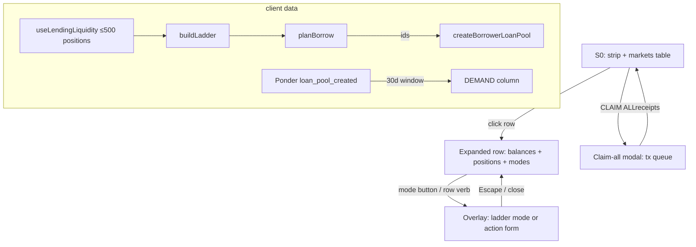
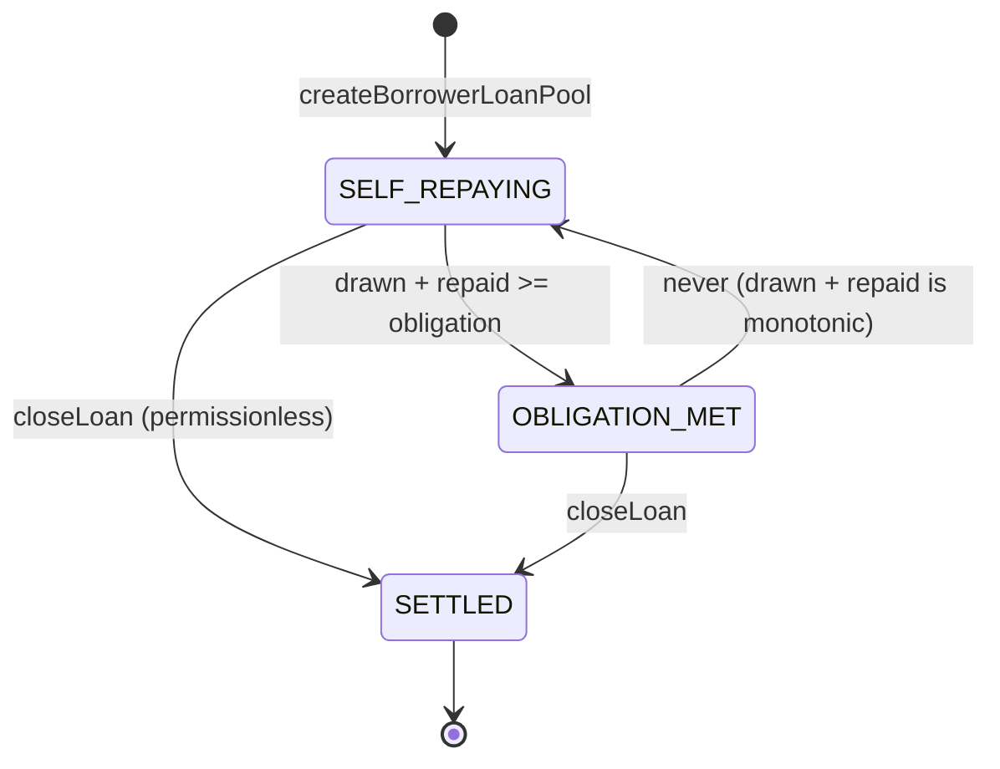

# Web UX v1 Implementation Plan

## Goal Capsule

- **Objective:** Implement the agreed v1 UX (`docs/plans/ux-personas-journeys-screens.md`, screens S0–S6) on the existing `web/` app: a value-aggregating summary strip with claim-all, a markets table with expandable per-market position rows, per-market SUPPLY/BORROW/DEPOSIT modes built around an APR-tick ladder, a client-side FIFO borrow router, stream/loan/lender cards, and a Ponder-backed trailing-demand column — while fixing three pre-existing data-layer defects (broken query-key invalidation, conflated approve/action confirmation, hardcoded token symbols).
- **Product authority:** `docs/plans/ux-personas-journeys-screens.md` (locked decisions 1–4, router spec, screens S0–S6, edge states, deferred list). Where this plan and that spec conflict, **that spec wins on WHAT, this plan wins on HOW**. Visual authority: `DESIGN.md` (all 12 sections binding).
- **Execution profile:** code — TypeScript/React in `web/`, plus one indexer unit in `tools/ponder/`. No Solidity changes. No changes to `src/`.
- **Stop conditions:** All R-IDs satisfied; `npm --prefix web run lint`, `npm --prefix web run test`, `npm --prefix web run build` green; visual pass on the local Anvil fork (`npm --prefix web run bootstrap:local`) confirms S0–S6.
- **Open blockers:** none.

---

## Product Contract

### Summary

The app becomes a single-page, markets-centric console. Connected users see an aggregate position strip (streams flowing, supplied, loans repaying, claimable now, one CLAIM ALL) above the markets table. Each market row expands in place to show that market's balances, positions, and three mode buttons (SUPPLY / BORROW / DEPOSIT PT) which open the existing overlay panel directly in that mode. BORROW and SUPPLY modes render an APR-tick ladder (discrete ticks from `aprMinBps..aprMaxBps` step `APR_STEP_BPS`), always showing both lenses: lender "+X% fixed over Yd" and borrower "receive X% upfront". Borrowing is instant-only: a pure client-side router picks the tick and liquidity IDs (single-coverage-first, else FIFO accumulate), `quote()` prices it, `createBorrowerLoanPool` executes it in one tx. Selling is absent from the UI. Vault lifecycle is complete: deposit PT, claim stream, claim matured PT, unwrap; wrap is behind an ADVANCED disclosure.

### Problem Frame

The current app (post 2026-07-23 polish pass) has the right skeleton — overlay panel, per-action forms, position list — but: the APR is hardcoded to `aprMinBps` in every form (`ActionModal.tsx:214,664,861`) with no ladder; positions are only visible inside the overlay, with a count-only summary; there is no claim-all, no obligation progress, no upfront-% anywhere; `chooseSellNowLiquidity` is the only routing logic and it cannot split positions; post-transaction cache invalidation is a no-op because the invalidated keys are not the wagmi keys (`useWriteFlow` + `lib/query-keys.ts` mismatch); a single `useWriteFlow` instance makes the CONFIRMED state fire after the *approval* receipt; and token symbols are hardcoded to `"wstETH"` / `"ovrflo"` literals in `PositionList` and `ActionModal` rather than read from the market's actual contracts. The UX spec demands outcome-first presentation (upfront %, fixed return over the period) which requires client-side mirrors of `StreamPricing`'s linear-discount math that do not exist yet.

### Requirements

**Summary strip (S0 top)**

- R1. When a wallet is connected and has any position, a summary strip renders between the topbar and the markets table with four aggregate cells: STREAMS (count + total remaining, i.e. `deposited - withdrawn`, per ovrfloToken symbol), SUPPLIED (total idle `availableLiquidity` per underlying symbol + count of positions), LOANS (count + weighted repayment progress `(drawn+repaid)/obligation` across open loans, shown as "N REPAYING · 64%"), CLAIMABLE (sum of stream `withdrawable` + pool `claimable`, per ovrfloToken symbol). Amounts are per-symbol; never sum across different tokens; no USD.
- R2. The strip has exactly one action: CLAIM ALL, enabled iff total claimable > 0; when disabled but positions exist, a dim mono caption "NOTHING CLAIMABLE YET" renders below the button (per DESIGN.md §8 — never hide, disable with a reason). It opens a claim-all modal (R3). Strip cells are informational only — no per-cell navigation, per the spec as amended 2026-07-25 (aggregates span markets, so there is no honest click target; the spec's S0 note records the same decision).
- R3. CLAIM ALL opens a review modal listing every queued tx (pool-claims and stream-claims) with kind, target, and amount — a CONFIRM QUEUE button starts signing; the queue does NOT auto-start on modal open. The queue executes sequentially: first, per lending contract with claimable pools, ONE `multicall(bytes[])` batching `claimLoanPoolShare(loanId, MAX_UINT128)` for every pool whose PROJECTED claimable for the connected lender is > 0, computed as `loanPoolClaimable({contribution, received, recovered: recoveredForClaimable({loan, withdrawable}), totalContributed})` — this is the first real call site for the existing (currently unused) `recoveredForClaimable` helper, and requires the per-pool stream `withdrawable` read added to `useLenderPools` in U3. Shared-pot conditions (`loanPoolProceeds > 0` or stream `withdrawable > 0`) are NOT sufficient pre-filters: a lender who already received their pro-rata share hits the `"OVRFLOLending: nothing claimable"` revert (`OVRFLOLending.sol:637`), which atomically reverts the entire multicall batch. Then one Sablier `withdrawMax(streamId, user)` per stream with `withdrawable > 0`. Sablier has no multicall (verified against the vendored ABI) — stream claims cannot be batched. The modal lists every queued tx as a row with per-row status (PENDING / SIGNING / CONFIRMING / CONFIRMED / FAILED); the queue advances only after the prior receipt; a failure stops the queue after the in-flight tx, leaving remaining rows PENDING with a RESUME button that recomputes `planClaimAll` from live data (matching the address-change resume path in KTD4) before retrying, rather than blindly resubmitting the stale plan. Closing the modal mid-queue is allowed after the in-flight tx settles; it never cancels a signed tx. When all rows reach CONFIRMED, the modal shows a "ALL CLAIMS CONFIRMED" summary with a DONE button; it does not auto-close. The modal reuses the overlay's focus-trap/Escape machinery (`useFocusTrap` + the Escape/scrim pattern from `MarketDetail`); Escape and scrim-click are disabled while the in-flight tx is SIGNING or CONFIRMING, matching the close rule. Queue rows are status displays (not focusable); the modal body scrolls internally if the queue is long; focus stays on the active button (CONFIRM QUEUE or RESUME) as the queue advances; on terminal success (all CONFIRMED), focus moves to the DONE button; on terminal failure (unrecoverable error after RESUME exhausted), focus moves to the CLOSE button.
- R4. Disconnected: no strip; connected with zero positions: no strip (not an empty strip).

**Markets table with expandable rows (S0)**

- R5. The markets table columns become: ASSET, MATURITY (date + "Nd" days-remaining), TVL (vault `marketTotalDeposited(market)` formatted in PT terms with the underlying symbol), RATES (the market's live tick range shown in both lenses: "6–10% APR · 90–94% ↑" — from ticks that have liquidity; when no liquidity, render "—"). The SELECT/Action column is removed; the whole row is the visual click target (clicking anywhere on the row toggles expansion), but the keyboard focus target is a `<button>` in the first cell (per U4's a11y decision) — the row itself is not `tabIndex=0`. Spec deviation (acknowledged): the product spec's S0 shows five columns (Market, Expiry, TVL, Supply APR, Borrow ↑%); this plan combines Supply APR and Borrow ↑% into one RATES column; the Fee is not a table column (it is shown in the expanded row and deposit form, per the spec). This is a HOW decision — the plan wins on HOW per the spec/plan contract.
- R6. Clicking anywhere on the row (visual click target) or pressing Enter/Space on the first-cell button (keyboard focus target per U4) expands it in place: a `<tr class="market-row-detail"><td colSpan={4}>` accordion under the row. Exactly one row may be expanded; expanding another collapses the first; clicking the expanded row collapses it. The row carries `aria-expanded`; the detail region carries `role="region"` + `aria-label="<symbol> market detail"`.
- R7. The expanded detail contains, in order: (a) a BALANCES block — underlying, PT, ovrfloToken balances of the connected user with context verbs per R8; (b) the market-scoped `PositionList` (existing component, restyled per R16–R18); (c) a mode-button row: SUPPLY (gold), BORROW (cyan), DEPOSIT PT (gold). Disabled states with dim mono captions per DESIGN.md §8: SUPPLY/BORROW disabled when `market.lending === null` ("LENDING NOT DEPLOYED"); BORROW additionally disabled when the user has no eligible stream ("NO STREAMS AVAILABLE"); DEPOSIT PT hidden after maturity; all three show "CONNECT WALLET" captions when disconnected.
- R8. Balance-row verbs (context-aware): underlying → none in the default view (WRAP moves behind ADVANCED, R9); PT → DEPOSIT PT (pre-maturity only); ovrfloToken → pre-maturity UNWRAP (disabled with caption "WRAP RESERVE EMPTY" when `wrappedUnderlying() === 0` or insufficient), post-maturity CLAIM PT. Verbs open the overlay in the corresponding action (existing `ActiveAction` types: `deposit`, `unwrap`, `claim_matured`, `wrap`).
- R9. An ADVANCED disclosure (collapsed by default, dim mono "ADVANCED ▸") at the bottom of the balances block reveals the WRAP action (underlying → ovrfloToken). The toggle is a `<button>` carrying `aria-expanded` (mirroring R6's row semantics). Nothing else lives there in v1.
- R10. The `MarketDetail` full-screen overlay stops being the positions surface: it becomes a pure action container (retitled per action/mode) hosting `FormBody` and the new mode panels. Its BALANCE section and embedded `PositionList` are removed (they now live inline in the expanded row). Open/close, focus trap, Escape handling, and slide-in animation are retained unchanged.

**BORROW mode — ladder + router (S1)**

- R11. BORROW mode renders: a stream selector (pre-selected when opened from a stream row; first eligible stream otherwise), the APR ladder, and a quote panel. The ladder lists every tick from `aprChoices(aprMinBps, aprMaxBps)` that has non-self liquidity, each row showing: upfront % (borrower lens, computed per KTD2), tick APR, available liquidity (excluding the connected user's own positions), and a depth bar scaled to the largest tick. The depth bar carries a visually-hidden `aria-label` or `aria-valuenow`/`aria-valuemax` pair so screen readers convey relative depth (e.g., "8% APR, 60% of max depth"). The lowest-APR tick with liquidity is marked "← BEST" and selected by default; rows are real `<button>` elements with a visible focus state (Enter/Space native — mirrors U4's button-in-cell decision; no div+onClick), clickable or keyboard-operable to re-select. If the user owns liquidity in this market, a footnote renders: "EXCLUDES YOUR $N SUPPLY". If the user enters BORROW mode and then pledges their last eligible stream mid-session, the stream selector renders a dim mono "NO STREAMS AVAILABLE" empty state with a SUPPLY INSTEAD button (mirroring R13's zero-liquidity fallback).
- R12. The quote panel prices the selection via on-chain `quote(market, streamId, aprBps, borrowAmount)`. Amount input defaults to MAX (= `grossPrice` from `quote(..., 0)`), editable downward. Invalid inputs (non-numeric, empty, zero, negative, above MAX) show a dim mono validation line under the field in `--negative` per DESIGN.md §8, with the input border tinting to match; no toasts. Zero and above-MAX disable the submit button with a dim mono caption ("ENTER AN AMOUNT" / "AMOUNT ABOVE MAX"). Displayed lines: "YOU RECEIVE NOW: <netToBorrower> (<upfront %>)", "STREAM REPAYS: <obligation> over <Nd>", "RESIDUAL RETURNS TO YOU WHEN OBLIGATION MET". The submit button label is the outcome: "GET <netToBorrower> NOW". Submission calls `createBorrowerLoanPool(ids, streamId, targetBorrow, minAcceptable)` with `ids` from the router (KTD3), `targetBorrow` = the entered amount, `minAcceptable = applySlippageDown(quote.netToBorrower, slippageBps)`. Slippage settings UI: a dim mono "SLIPPAGE TOLERANCE" input below the quote lines, defaulting to `DEFAULT_SLIPPAGE_BPS` (50 = 0.5%), editable by the user in basis points (rendered as percent with one decimal: "0.5%"). The input is a mono numeric field per DESIGN.md §8 (transparent, graphite border, sharp corners). Valid range 1–500 bps (0.01%–5.0%); out-of-range shows a dim mono validation line. The user's chosen slippage feeds `minAcceptable` directly. Existing function reuse (binding): `applySlippageDown(amount, slippageBps)` already exists in `web/lib/modal-logic.ts` with the exact signature needed — `(amount: bigint, slippageBps: bigint = DEFAULT_SLIPPAGE_BPS)`. The change is wiring the UI slippage input to the existing second parameter; no new math function is created. Rationale: pricing is linear-discount and drifts with block time, not volatility, so 50bps covers timestamp drift by orders of magnitude at default — but the borrower should control their own tolerance. A tighter bound risks more reverts (self-healing through R14); a looser bound accepts more partial fill. The R14 re-quote loop remains as a safety net regardless of the slippage setting.
- R13. Insufficient-liquidity handling (instant-only, never a dead end): the borrower selects a tick on the ladder (default: lowest-APR tick with liquidity, marked "← BEST" per R11) and enters an amount. When the entered amount exceeds what is available at the selected tick, the quote panel shows the partial fill at the selected tick: "GET $X AT <tick>% — PARTIAL FILL (<upfront %>)" with the amount clamped to the selected tick's available liquidity (and price cap per KTD3). Below the partial-fill quote, a dim mono prompt renders: "AMOUNT EXCEEDS LIQUIDITY AT <tick>%. SEE OPTIONS AT OTHER TICKS?" with a "SHOW OTHER TICKS" button. The alternatives at other ticks are NOT rendered until the borrower clicks this button — moving to a different tick is a conscious decision, not an auto-presented menu. When the borrower clicks "SHOW OTHER TICKS", the panel renders the alternative from `planBorrow` (at most one — KTD3 returns `{ primary, alternative | null }`, not an enumeration of all deeper ticks). The alternative is a complete executable quote priced via `quote()` at its own tick, clamped to that tick's own price cap per KTD3: "GET $Y AT 10% — FULL" (or PARTIAL if the clamp binds). The alternative card is a `<button>` per R11's keyboard rule, selectable by click/keypress. Selecting the alternative card replaces the current quote and updates the ladder's selected tick. When `planBorrow` returns `alternative === null` (primary is already the only option, or no tick anywhere fully covers — KTD3 primary=partial, alternative=null), the "SHOW OTHER TICKS" button does not render — the partial fill at the selected tick is the only option. When both primary and alternative exist, the cards are labeled by outcome: "MOST CASH NOW" on the higher-`netToBorrower` card, "LOWEST RATE" on the lower-APR card. When the market has zero non-self liquidity, the ladder area shows the lender-lens empty state: "NO LIQUIDITY YET — BE THE FIRST LENDER" plus trailing demand stats when the indexer provides them (R22), plus a SUPPLY INSTEAD button switching mode. Precedence (binding): when `tooLarge` is true AND all enumerated positions have `availableLiquidity = 0`, R26's stronger copy "SHOWING FIRST 500 — ACTIVE LIQUIDITY MAY EXIST BEYOND SCAN RANGE" overrides R13's empty-ladder state — the "NO LIQUIDITY YET" CTA and "BE THE FIRST LENDER" button do NOT render, because the router cannot distinguish "no liquidity" from "liquidity beyond scan range." R13's empty-ladder state only renders when `tooLarge` is false AND non-self liquidity is zero. BORROW-specific truncation copy (binding): when `tooLarge` is true but some enumerated positions have `availableLiquidity > 0` (partial liquidity within scan range), the ladder renders "SHOWING FIRST 500 — QUOTES MAY MISS NEWER LIQUIDITY" — this BORROW-specific string supplements R26's generic "SHOWING FIRST 500 — DATA TRUNCATED" with borrow-contextual language about quote completeness, and is distinct from R26's stronger "ACTIVE LIQUIDITY MAY EXIST BEYOND SCAN RANGE" copy (which applies when all enumerated positions are empty).
- R14. Liquidity-race recovery: when the borrow write fails with a stale-batch revert (the three strings matched by `staleBatchCopy`) OR with `"OVRFLOLending: slippage"`, the form automatically: invalidates chain reads (KTD5), re-runs the router + quote, and renders a banner "LIQUIDITY CHANGED — NEW QUOTE:" with the fresh numbers and a single RE-CONFIRM button. No manual refresh, no dead-end error text. The slippage string is included because partial drain is the most common race: `actualBorrow = min(targetBorrow, totalAvailable)` shrinks below `minAcceptable` and the contract reverts "slippage", not any stale-batch string (`staleBatchCopy` deliberately maps it to null — extend the borrow-form trigger, do not widen `staleBatchCopy` itself). Catch-all: revert strings come from pre-send gas estimation; a borrow tx that passes simulation but reverts after mining yields only `receipt.status === "reverted"` with no string — treat any reverted borrow receipt as the same trigger, with generic banner copy "TRANSACTION REVERTED — QUOTE REFRESHED". After 2 consecutive stale/reverted iterations, the banner appends "MARKET IS MOVING — TRY A SMALLER AMOUNT" (each iteration needs a user click on RE-CONFIRM, so the loop is self-limiting; no hard cap). Each reverted iteration costs the borrower one transaction's gas; the 2-iteration escalation serves partly as a gas-cost circuit breaker. A lender front-running with `withdrawLiquidity` can grief the borrower's gas but cannot steal funds. Revert classification (binding): before entering the re-quote path, classify the revert string — route `staleBatchCopy` matches + `"OVRFLOLending: slippage"` to the re-quote banner; route all other revert strings (`"OVRFLOLending: self-match"`, `"OVRFLOLending: borrow above price"`, StreamPricing eligibility reverts) to a terminal dim mono error state with the contract revert string and no RE-CONFIRM button (a smaller amount cannot fix these). For the "reverted receipt with no string" catch-all, check whether the fresh `quote()` call also reverts before offering RE-CONFIRM — if the fresh quote reverts, show the terminal error instead of the re-quote banner.

**SUPPLY mode — ladder + demand (S2)**

- R15. SUPPLY mode renders the same tick ladder in the lender lens: tick APR, "YOU EARN +X% FIXED (Yd)" (computed per KTD2), LIQUIDITY WAITING (total `availableLiquidity` at that tick, all lenders including self), and DEMAND (R22). Below it: amount input, tick select (dropdown of `aprChoices`, defaulting to the lowest tick), the two-line consequence copy from the UX spec, and the existing approve→supply flow from `SupplyForm`. The hardcoded `aprBps = lending.params.aprMinBps || 1000` is deleted; the selected tick is used. Note: at current deployment params `aprMinBps == aprMaxBps == 1000`, so the ladder renders exactly one row — this is correct behavior, not a bug; do not special-case it.

**Position cards (S4, S5, S6)**

- R16. Stream rows become cards: progress bar `▓░` of streamed fraction (`(withdrawn + withdrawable) / deposited`), "CLAIMABLE NOW <withdrawable> [CLAIM]" (CLAIM disabled at 0 with caption), "REMAINING <deposited - withdrawn - withdrawable> · ENDS <date>", and a live borrow teaser "BORROW ~<upfront %> UPFRONT" (mono label, no emoji — DESIGN.md §3 restricts typography to Inter + IBM Plex Mono) (from a batched `quote(market, streamId, bestTick, 0)` read, `allowFailure: true`; omitted when no non-self liquidity or the read fails). The teaser button opens BORROW mode with that stream pre-selected. The quote read succeeding does not guarantee the user still owns the stream NFT — during indexer lag after a pledge, the teaser may render on a stream the user no longer owns; the borrow submit path's `sablier.transferFrom` revert is the contract-level guard, and the resulting gas cost is a residual indexer-lag tax (see KTD5). No SELL button anywhere (locked decision 2).
- R17. Loan rows become cards: header "LOAN #id · BACKED BY STREAM #streamId · @ <pool.aprBps>%" (the upfront amount received is not stored in the loan struct on-chain and is NOT displayed on the loan card — do not attempt to reconstruct it; spec deviation acknowledged: S5 shows "Received upfront: $7,387" but while `BorrowerLoanPoolCreated.totalContributed` is indexed by R20 and displayed post-confirmation in the borrow form per R29, surfacing it on the loan card would require a cross-surface lookup from the Ponder demand table to an individual loan — out of scope for v1), obligation progress bar `(drawn + repaid) / obligation` with "X of Y REPAID", copy "SELF-REPAYING FROM THE STREAM — NOTHING TO DO." Open loans show no primary verb. REPAY moves behind the card's ADVANCED disclosure (early repayment is an expert path). CLOSE renders only when `canCloseLoan({loan, withdrawable})` is true, where `withdrawable = sablier.withdrawableAmountOf(loan.streamId)` (new batched read) — this replaces the current `!loan.closed`-only gate that offers CLOSE prematurely and reverts. Settled loans (`closed`) render dimmed with a SETTLED badge. Third state (binding): when the obligation is met (`drawn + repaid >= obligation`) but the loan is not yet `closed`, the existing `isLoanOpen` returns false, which causes the current code to show "SETTLED" misleadingly. The card must instead render a distinct "OBLIGATION MET — RESIDUAL RETURNING" state (dim mono label, progress bar at 100%, no verbs) — this is the state where `_claimFair` has satisfied the obligation and the residual stream is automatically returning to the borrower, but `closeLoan` has not been called. Re-pledge note (binding): when a loan closes and the residual stream returns to the borrower, the stream automatically reappears in the BORROW stream selector (R11) via the existing `useHeldStreams` enumeration — no special re-pledge UI is needed, but the stream card (R16) should render normally with its borrow teaser restored.
- R18. Lender liquidity rows become cards: "SUPPLY #id @ <aprBps>%" (aprBps is currently fetched but never rendered — render it), "IDLE <availableLiquidity> [WITHDRAW]", and ADJUST RATE (R19). The originally supplied amount and per-position consumed amount are not stored on-chain — do not display or reconstruct them (spec deviation acknowledged: S6 shows "Supplied: $50,000, Consumed into loans: $12,000" but neither value is available on-chain); consumed capital is already represented by the per-pool CLAIM SHARE rows, which stay as their own cards showing the pool's aprBps, the lender's contribution, and claimable. Edge state (origin spec, lender-facing only): when a pool's backing stream is fully drawn but the obligation is unmet at the expiry boundary, the pool card carries a dim mono caption noting the shortfall continues to be harvested from the stream as it vests ("SHORTFALL DRAWS FROM STREAM AS IT VESTS" — on-chain `_claimFair` behavior); never shown on the borrower's loan card.
- R19. ADJUST RATE: a small form (new tick dropdown) that executes ONE transaction: `lending.multicall([encodeFunctionData(withdrawLiquidity(id)), encodeFunctionData(supplyLiquidity(market, newAprBps, idleAmount))])` where `idleAmount` = the position's current `availableLiquidity`. OZ `Multicall` delegatecalls preserve `msg.sender`, and both inner functions' `nonReentrant` guards enter/exit sequentially, so this composes. Prerequisite: underlying allowance to the lending contract must cover `idleAmount` — reuse the approve-step pattern (approve tx first when `allowance < idleAmount`), approving exactly `idleAmount`, never unlimited. Disabled with caption when `availableLiquidity === 0`. Race guard (binding): re-read the position's `availableLiquidity` immediately before encoding and submit that fresh value — a stale larger `idleAmount` is the silent-overdraw hazard: withdraw refunds only the current remainder while `supplyLiquidity` pulls the full encoded amount from the wallet, so the tx can SUCCEED while committing more wallet funds than the displayed "MOVE <idle>". On an adjust-rate revert ("OVRFLOLending: liquidity inactive" after a full drain) or a detected read-vs-encode mismatch, route through the same invalidate → re-read → banner + RE-CONFIRM recovery as R14, not a generic error. Residual race acknowledgment (binding): the re-read guard minimizes but does not eliminate the race window. If `availableLiquidity` is partially drained (not to zero) between the re-read and tx mining, the tx succeeds with the user overpaying the difference — no revert fires to trigger R14 recovery. The post-confirmation receipt display (R29) surfaces the actual moved amount. A contract-level guard (expected-amount parameter on `withdrawLiquidity`) would fully close this but is out of scope (no Solidity changes).

**Demand data (Ponder)**

- R20. `tools/ponder` is extended to index OVRFLOLending instances discovered via the factory event `LendingDeployed(address indexed ovrflo, address indexed lending)` (Ponder `factory()` pattern), capturing `BorrowerLoanPoolCreated(loanId, borrower, market, aprBps, totalContributed)` rows with block timestamp into a new `loan_pool_created` table.
- R21. `web/lib/ponder.ts` gains `fetchDemandByTick(lending, market, sinceSeconds, excludeBorrower?)` returning `{ aprBps, loanCount, totalContributed }[]` for pools created in the trailing window (30 days). The optional `excludeBorrower` (the connected address) implements R22's self-demand exclusion; omitted when disconnected.
- R22. The DEMAND column (S2) and the empty-ladder demand stats (R13) consume R21. Presentation per tick: a 1–3 segment bar scaled relative to the max tick volume in this market, "N LOANS · <amount>", a qualitative label ("HIGH" / "MED" / "LOW" — derived from the tick's volume relative to the market max: top third = HIGH, middle third = MED, bottom third = LOW), and a "30D" time window suffix on the column header or footnote (matching the spec's "*borrow volume at this tick, trailing 30d (indexer)"). The qualitative label renders as a dim mono tag beside the bar; the "30D" suffix renders once as a column header annotation or footnote, not per row. Degradation is mandatory, silent-safe, and distinguishes two states: (a) no data source — `ponderUrl` unset or the query errors → `fetchDemandByTick` returns `null` → the column renders "—" with a dim mono caption "NO DEMAND DATA" once (not per row); (b) zero demand — the query succeeds with zero rows in the window → bars render at zero with "NO LOANS 30D" (honest data, distinct from no-data). The same null-vs-empty split applies to R13's empty-ladder demand stats. Everything else on the screen works without Ponder — scoped to the demand column: the pre-existing `useHeldStreams` hook already depends on Ponder (`fetchHeldStreamIds`) for Sablier stream discovery, since Sablier V2 Lockup has no on-chain "all streams for recipient" enumerator. When Ponder is unreachable, `useHeldStreams` returns an empty stream list — stream cards (R16), the BORROW stream selector (R11), and CLAIM STREAM are all unavailable. This is a pre-existing architectural dependency, not introduced by this plan; the held-streams surface degrades to a "STREAM DATA UNAVAILABLE — RETRY" caption with a manual retry button (implemented in U10 edge-state sweep, see KTD5) rather than silently showing zero streams. KTD5's indexer-lag retry schedule addresses post-write staleness but not Ponder-down; distinguish "indexer lag" (retry) from "indexer unreachable" (terminal state with retry affordance). Demand integrity: `fetchDemandByTick` should exclude pools where `borrower == connectedUser` (self-demand is not signal); no minimum-size or time-weighting in v1 (the attack cost — real capital + a real stream + the protocol fee — is the primary defense, alongside the neutral "counts and amounts" framing). Demand is an indicative signal derived from public onchain events (manufacturable at the cost of real capital + a real stream); present it neutrally as counts and amounts, never as a guarantee or recommendation.

**Cross-cutting**

- R23. Post-write cache invalidation actually works (KTD5). Every confirmed write refreshes all on-chain reads and held streams. Held streams are indexer-backed and refresh on a short post-write retry schedule (KTD5 indexer-lag caveat) rather than a single instant invalidation. The `staleBatchCopy` promise ("Refreshing market depth") becomes true.
- R24. CONFIRMED state and close affordances derive only from the *action* transaction, never the approval (KTD6).
- R25. All hardcoded `"wstETH"` / `"ovrflo"` symbol literals in `PositionList` and `ActionModal` are replaced with the market's actual symbols (KTD7). Decimals remain hardcoded 18 (PT tokens are always 18 decimals — repo invariant; do not generalize).
- R26. `tooLarge` from the enumeration hooks surfaces as a dim mono warning line ("SHOWING FIRST 500 — DATA TRUNCATED") wherever the affected list renders. No pagination. When `tooLarge` is true AND all enumerated positions have `availableLiquidity = 0`, the stronger copy "SHOWING FIRST 500 — ACTIVE LIQUIDITY MAY EXIST BEYOND SCAN RANGE" is used instead, since `enumerateIds` returns the OLDEST 500 ids and all may be withdrawn while active liquidity exists at ids 501+. The `tooLarge` flag is exposed by `useLendingLiquidity`, `useBorrowerLoans`, and `useLenderPools` (all three enumeration hooks); `useHeldStreams` does NOT expose it (Ponder-backed, not enumeration-capped).
- R27. Matured markets: BORROW and SUPPLY mode buttons disabled with caption "MARKET MATURED"; the router and ladder never run against a matured market (`gatherLiquidity`/`quote` revert on expired series — never call them post-maturity); stream CLAIM, pool CLAIM SHARE, CLAIM PT, UNWRAP all remain live.
- R28. Every number follows DESIGN.md §10 (mono, tabular-nums, dim units); dates render as the existing `formatMaturity`; days-remaining as "Nd". Two percentage formatters with distinct decimal precision: (a) upfront and lender-return percentages render with exactly one decimal ("91.2%", "+5.0%") via `formatBpsPct` (KTD2); (b) APR rates render with two decimals ("4.62%") via the existing `formatAprBps` per DESIGN.md §10. The existing `formatAprBps` helper (`web/lib/format.ts`) is KEPT for APR display (RATES column tick range, ladder tick APR, loan card `@ <aprBps>%`, deposit form fee display); it is NOT replaced by `formatBpsPct`. The `describe` block in `web/tests/lib/format.test.ts` keeps its two-decimal assertions for `formatAprBps`; a new `describe` block asserts one-decimal output for `formatBpsPct`. Spec deviation (acknowledged): the UX spec uses 1-decimal for upfront percentages and 2-decimal for APR rates; this plan honors both by using two formatters rather than forcing one precision across all percentage types.
- R29. Post-confirmation receipt display: after a confirmed borrow (`createBorrowerLoanPool`) or adjust-rate (`multicall`), parse the relevant event from the receipt (`BorrowerLoanPoolCreated.totalContributed` / `LiquidityWithdrawn.refunded`) via viem `parseEventLogs` and display the actual executed amount. For borrow, the caption shows NET received: `totalContributed` is gross (pre-fee); compute net as `totalContributed - (totalContributed * feeBps) / BPS` (exact contract mirror — see KTD10; the algebraically-similar `gross * (BPS - fee) / BPS` is off by up to 1 wei) using the lending contract's `feeBps` (already read via existing hooks). Display "PARTIAL FILL — RECEIVED \<net\> OF \<quoted netToBorrower\>" when net differs from the quote. For adjust-rate, `LiquidityWithdrawn.refunded` is the actual idle amount moved; display "MOVED \<refunded\> (LESS THAN QUOTED)" when it differs from the encoded amount. If `parseEventLogs` returns no matching event for a confirmed tx (ABI mismatch, unexpected code path), render the quoted amount with dim mono caption "CONFIRMED — ACTUAL AMOUNT UNVERIFIED" rather than crashing or skipping. This closes the silent-success gap where a partial fill mines without revert but the user receives less than displayed (KTD10).
- R30. Form-level signer switch guard: all forms (BorrowForm, SupplyForm, AdjustRateForm, ConvertForm, RepayForm) reset internal state (selected stream, amount, approval latch) when the connected address changes. A dim mono "WALLET CHANGED — RE-ENTER" caption replaces the form body until the user re-selects. The expanded market row collapses on signer switch (its balances and positions describe a different account); the user re-expands to see the new account's data. This extends KTD4's queue-pause pattern to individual forms, preventing stale-data reverts and confusion on account switch.
- R31. Initial-load states: every new surface (summary strip cells, expanded-row balances, APR ladder rows, position cards, claim-all modal rows) renders dim mono "—" or "LOADING" placeholders on first mount per DESIGN.md §10 — no spinners, no skeleton shimmer. The post-write "REFRESHING…" state (KTD5) is a separate concern; initial load uses the same dim-mono convention but without the "REFRESHING…" label. Each surface's placeholder is replaced in place when data arrives, without flashing.
- R32. Responsive behavior: per DESIGN.md §12, below ~800px: the summary strip's four cells stack single-column with the CLAIM ALL button full-width below; the SUPPLY/BORROW/DEPOSIT mode-button row wraps to a vertical stack; the APR ladder stacks vertically (depth bars render below each row's text, not beside it); position cards remain single-column (already full-width); the claim-all modal's queue rows keep their columns but scroll horizontally inside the modal body if needed. No reflow into cards for table-based surfaces. No new breakpoints — the existing 800px breakpoint adapts all new surfaces.
- R33. Summary strip partial-data: when one market's aggregate read errors or is still loading while others are ready, the strip renders "—" for the affected symbol's cells (not a stalled whole strip, not a partial sum). The strip waits for all per-market reads to settle before rendering non-"—" values for a given symbol; per-symbol independence means one market's error does not block another's display.

### Key Decisions

- **Modes open the existing overlay, not inline panels.** The spec's S1/S2/S3 are full titled panels ("wstETH JUN-27 · BORROW"); the existing `MarketDetail` overlay already provides the container, focus trap, Escape stack, and slide-in. Expanded rows hold *state* (balances, positions, mode buttons); the overlay holds *flows*. This is the minimal-delta reading of the spec and reuses all of `ActionModal`'s form machinery.
- **The router is pure client-side; `gatherLiquidity` is demoted to a test oracle.** The app already enumerates every liquidity position (≤500) — the router has complete information, and the spec's single-coverage-first rule cannot be expressed through `gatherLiquidity`. This supersedes KTD5 of the 2026-07-18 rebuild plan *for the borrow path* (that KTD predates the tick-ladder requirement). The contract re-validates everything; a race produces the R14 re-quote, exactly as it would have with `gatherLiquidity`. Bound (binding): "complete information" holds only while `nextLiquidityId ≤ 501` — the enumeration scans the OLDEST 500 ids, so past the cap the router is blind to the freshest liquidity and can under-quote with no revert to recover from. When the liquidity hook reports `tooLarge`, BORROW mode renders a BORROW-specific truncation warning inside the ladder ("SHOWING FIRST 500 — QUOTES MAY MISS NEWER LIQUIDITY" per R13's BORROW-specific truncation copy) — visible degradation, never silent. Replacing enumeration is the rebuild plan's P6 backlog, not this plan.
- **Claim-all is a sequential queue, not one tx.** Verified: the Sablier lockup ABI has no `multicall`. Pretending otherwise (a custom batching contract) is out of scope; a visible queue with per-tx status is honest and implementable now. Binding tradeoff: the per-lending-contract `multicall` batching all pool-claims is all-or-nothing within that contract — one unclaimable pool reverts the entire batch. R3's pre-filter (`loanPoolProceeds > 0` OR `withdrawableAmountOf > 0`) excludes known-unclaimable pools, but a pool can become unclaimable between plan time and mine time (stream fully drawn by another lender). The RESUME path recomputes the plan from live data, dropping the reverted pool and retrying the remainder.
- **Coarse invalidation over per-key bookkeeping.** Invalidate the wagmi roots (`['readContract']`, `['readContracts']`) plus `streamKeys.held` after every confirmed write. The per-form curated key lists are provably broken today (keys never match) and per-key correctness buys nothing at this data scale. Delete the curated lists.
- **REPAY demoted, CLOSE gated.** The loan card's happy path has zero verbs (self-repaying is the product's core promise — the UI must embody it). Early repay is an expert affordance; CLOSE only appears when it can actually succeed.
- **Strip aggregates are per-symbol.** Cross-token sums are meaningless without USD context (out of scope, consistent with the 2026-07-23 plan's R5 decision). With today's single-underlying deployment this is invisible; the code must still group by symbol.

### Spec Deviations (acknowledged)

The product spec (`ux-personas-journeys-screens.md`) is the WHAT authority; this plan wins on HOW. These deviations from the spec's screen mockups are deliberate technical constraints, not oversights:

- **R5 column structure.** Spec S0 shows five columns (Market, Expiry, TVL, Supply APR, Borrow ↑%); the plan uses four (ASSET, MATURITY, TVL, RATES — combining the two APR columns). The Fee is not a table column (shown in the expanded row and deposit form, per the spec).
- **R17 loan card: no upfront amount.** Spec S5 shows "Received upfront: $7,387 (91.2% @ 8%)" but the upfront amount received is not stored in the loan struct on-chain. While `BorrowerLoanPoolCreated.totalContributed` is indexed by R20 and displayed post-confirmation in the borrow form per R29, surfacing it on the loan card would require a cross-surface lookup from the Ponder demand table to an individual loan — out of scope for v1.
- **R18 lender card: no supplied/consumed.** Spec S6 shows "Supplied: $50,000, Consumed into loans: $12,000" but neither the originally supplied amount nor the per-position consumed amount is stored on-chain. Idle liquidity and claimable proceeds are displayed; supplied/consumed are not.
- **USD subscripts deferred.** Spec open assumption #2 mentions "amounts displayed in underlying terms (wstETH) with a USD subscript." USD pricing requires a price oracle (out of scope — no USD anywhere in v1).
- **Tooltips deferred.** Spec open assumption #1 mentions "raw bps/contract terms only in tooltips." The plan uses outcome-first language throughout (upfront %, fixed return) which satisfies the spirit; raw-term tooltips are deferred to a future polish pass.

### Scope Boundaries

**Out of scope (do not implement, do not scaffold):**

- Selling streams in any form: `sell` action, `SellForm`, `chooseSellNowLiquidity` call sites, sale listings, buy-side UI. The launch-scope test's negative assertions extend to SELL NOW (which the 2026-07-23 pass had retained — this plan removes it; see U8).
- Resting borrower orders, matchmaker backends, notifications, order lifecycle.
- USD pricing, cross-token totals.
- Wrap as a first-class flow (ADVANCED-only per R9).
- A separate portfolio page or any routing beyond the single page.
- Sablier claim batching contracts.
- Mobile-specific IA (the existing 800px breakpoint adapts what exists; the ladder stacks vertically — no new breakpoints).
- Indexing anything beyond `BorrowerLoanPoolCreated` (no full lending event mirror — that is the rebuild plan's P6 backlog).
- Tooltips for raw bps/contract terms (spec assumption #1 mentions them; outcome-first language satisfies the spirit; deferred to a future polish pass).

---

## Planning Contract

### Ground truth: contract surface consumed by this plan (verified 2026-07-25 against `src/`)

| Call | Signature / shape | Notes |
|---|---|---|
| `quote` | `quote(address market, uint256 streamId, uint16 aprBps, uint128 borrowAmount) view returns (uint256 grossPrice, uint128 obligation, uint256 feeAmount, uint256 netToBorrower, uint128 residual)` | `borrowAmount = 0` prices the full stream. `remaining = obligation + residual` — no separate read needed. Reverts on matured/ineligible. |
| `createBorrowerLoanPool` | `(uint256[] liquidityIds, uint256 streamId, uint128 targetBorrow, uint128 minAcceptable) returns (uint256 loanId)` | **Partial fill is native:** `actualBorrow = min(targetBorrow, totalAvailable)`; `minAcceptable` (net, after fee) is the only protection. All ids must share market+tick, strictly increasing, no self-match. |
| `supplyLiquidity` | `(address market, uint16 aprBps, uint128 availableLiquidity)` | Pulls underlying via `transferFrom` — needs allowance. |
| `withdrawLiquidity` | `(uint256 liquidityId)` | Full idle refund only, no partial. |
| `claimLoanPoolShare` | `(uint256 loanId, uint128 amount)` | `MAX_UINT128` = claim max. Pays ovrfloToken. |
| `multicall` | `multicall(bytes[] data)` (OZ, delegatecall, preserves `msg.sender`) | On OVRFLOLending only. **Not on Sablier.** |
| APR validation | `aprBps % APR_STEP_BPS == 0`, within `[aprMinBps, aprMaxBps]` | `APR_STEP_BPS = 100` already mirrored in `lib/lending-math.ts`. |
| Pricing math | `factor f = WAD + ttm * aprBps * WAD / (YEAR * BPS)`; `grossPrice = remaining * WAD / f`; `YEAR = 365 days`; obligation ceils | Client mirrors for display only (KTD2); every executed number comes from `quote()`. |
| Vault TVL | `ovrfloAbi.marketTotalDeposited(market) → uint256` | Already in the generated ABI. |
| Wrap capacity | `ovrfloAbi.wrappedUnderlying()` | Already read in `MarketDetail`. |
| Factory event | `LendingDeployed(address indexed ovrflo, address indexed lending)` | Ponder `factory()` source. |
| Lending event | `BorrowerLoanPoolCreated(uint256 indexed loanId, address indexed borrower, address indexed market, uint16 aprBps, uint128 totalContributed)` | The only event indexed by this plan. |
| Sablier reads | `withdrawableAmountOf(streamId) → uint128`, `withdrawMax(streamId, to)` nonpayable | Per rebuild-plan KTD4. |

### Key Technical Decisions

- **KTD1 — State model.** `MarketsApp` keeps `selectedMarket` but its meaning changes: it now drives the *expanded row*, not an overlay. A new `activeMode: { market: MarketInfo; action: ActiveAction } | null` in `MarketsApp` drives the overlay (`MarketDetail` renamed in behavior, not filename). Expanded-row verbs and mode buttons call `setActiveMode({ market, action })`. Closing the overlay clears `activeMode` only — the row stays expanded. Two-level state, both in `MarketsApp`; no context, no router. Invariant (binding): the overlay's focus trap + obsidian scrim (DESIGN.md §9) block all table interaction while the overlay is open — `selectedMarket` and `activeMode.market` cannot diverge. The user must close the overlay (Escape / scrim click / close button) before expanding another row. This invariant is load-bearing for the two-level state model and for the action-reset `useEffect` keyed on `activeMode.market`.
- **KTD2 — Client display math mirrors `StreamPricing` exactly, in bigint.** New pure functions in `web/lib/lending-math.ts` (WAD = `10n ** 18n`, YEAR = `31_536_000n`, BPS = `10_000n`). **Unit convention (binding): all three return plain basis points as bigint; 1% = 100 bps; display divides by 100 and truncates to one decimal.**
  - `factorWad(aprBps: number, ttmSeconds: bigint): bigint` = `WAD + (ttmSeconds * BigInt(aprBps) * WAD) / (YEAR * BPS)` — floor division, matching `Math.mulDiv` floor.
  - `upfrontBps(aprBps: number, ttmSeconds: bigint, feeBps: number): bigint` — fraction of the stream's remaining value the borrower receives now, net of fee, in bps. Implement in two steps: `grossBps = (WAD * BPS) / factorWad(aprBps, ttm)`, then `netBps = (grossBps * (BPS - BigInt(feeBps))) / BPS`. Pin with a comment: invariant `upfrontBps ≈ netToBorrower * BPS / (obligation + residual)` for a full borrow, and a unit test asserting agreement with a hand-computed vector (see U1 tests).
  - `lenderReturnBps(aprBps: number, ttmSeconds: bigint): bigint` = `(BigInt(aprBps) * ttmSeconds) / YEAR` — simple-interest return over the remaining period, in bps (10% APR over a full year → `1000n`; over half a year → `500n`).
  - `formatBpsPct(x: bigint): string` — bps → percent string, exactly one decimal, truncated: `9523n` → `"95.2%"`, `500n` → `"5.0%"`.
  These are DISPLAY ONLY (ladder rows, teasers, table ranges). Any number a transaction consumes comes from `quote()` on-chain. Never convert token amounts through `Number` (enforced by `check-banned-patterns.sh`).
- **KTD3 — Router.** New `web/lib/router.ts`, pure and fully unit-tested:
  ```ts
  export type TickDepth = { aprBps: number; total: bigint; own: bigint; positions: LiquidityPosition[] };
  export function buildLadder(positions: LiquidityPosition[], market: Address,
    ticks: number[], self?: Address): TickDepth[];
  // positions filtered to market, availableLiquidity > 0, grouped per tick;
  // `total` EXCLUDES self-owned, `own` is self-owned only; positions sorted ascending by id.

  export type BorrowPlan =
    | { kind: "full"; aprBps: number; ids: bigint[] }
    | { kind: "partial"; aprBps: number; ids: bigint[]; available: bigint }
    | { kind: "empty" };
  export function planBorrow(ladder: TickDepth[], target: bigint): {
    primary: BorrowPlan; alternative: BorrowPlan | null };
  ```
  Rules (from the UX spec, binding): iterate ticks ascending; `primary` = the lowest tick whose `total >= target` ("full"); within the tick, choose the FIRST single position with `availableLiquidity >= target` (ascending id), else FIFO-accumulate ascending ids until the running sum covers. If no tick covers, `primary` = `{ kind: "partial" }` at the lowest tick with `total > 0`, ids = all its positions ascending, `available = total`. `alternative` is set only when both shapes exist and differ: if `primary` is "full" at tick T but a lower tick U < T has liquidity, `alternative` = partial at U; if `primary` is "partial", `alternative` = null (there is no covering tick anywhere). Ids are strictly increasing by construction (contract pattern #10). Self-owned positions are never included.
  **Price cap (binding, applied at the quoting layer in U6):** `grossPrice` shrinks as the tick rises (`grossPrice = remaining * WAD / f`), so a tick can cover the target in *liquidity* while capping the borrow below it in *price* — `quote` and `createBorrowerLoanPool` revert "OVRFLOLending: borrow above price" past the cap. For every candidate tick surfaced to the user (primary or alternative), fetch that tick's full-stream price via `quote(market, streamId, tick, 0)` and clamp the quoted and submitted amount to `min(target, grossPriceAtTick)`. When the clamp binds, label the card PARTIAL even if liquidity alone covers — `planBorrow`'s "full" refers to liquidity coverage only; it is price-blind by design (pure, no reads).
  **Sort-order integration (binding):** `useLendingLiquidity` returns positions sorted **descending** by id. `buildLadder` must explicitly sort ascending by id internally — never assume input order — or `planBorrow` will emit descending ids and the contract reverts "OVRFLOLending: duplicate or unsorted ids". Add a unit test feeding descending-input positions to `buildLadder` and assert ascending output ids.
  **UI mapping (binding — R13's card names do NOT map one-to-one onto `planBorrow`'s field names):** the upfront quote card is always the SELECTED tick's fill — that is `planBorrow.alternative` when a deeper tick fully covers (KTD3 names the deeper-tick full plan `primary`), else `planBorrow.primary`. The card revealed by "SHOW OTHER TICKS" is `planBorrow.primary` when its tick differs from the selected tick. R13's phrase "the alternative" refers to the revealed card (the deeper-tick option), not KTD3's `alternative` field.
  **`TickDepth.positions` semantics:** the `positions` array includes ALL positions at that tick (self and non-self). `planBorrow` filters self-owned ids out of its output; `total` excludes self; `own` is self-only. The self-match exclusion is enforced by `planBorrow`'s filter (contract reverts on self-match at `OVRFLOLending.sol:751`). Fallback consideration: `gatherLiquidity` (the contract view helper) is demoted to a test oracle and is NOT called in the borrow path. When `tooLarge` is true, the router is blind to ids > 500; `gatherLiquidity` has the same enumeration cap and offers no fallback. Do not add a `gatherLiquidity` call site as a tooLarge fallback — it returns the same oldest-500 set. The R26 generic truncation warning (R26's two defined strings) plus R13's BORROW-specific "QUOTES MAY MISS NEWER LIQUIDITY" variant is the complete degradation path; replacing enumeration is P6 backlog.
- **KTD4 — Claim-all planner + queue runner.** Pure planner in `web/lib/claim-all.ts`:
  ```ts
  export type QueuedTx =
    | { kind: "pool-claims"; lending: Address; loanIds: bigint[] }
    | { kind: "stream-claim"; streamId: bigint };
  export function planClaimAll(input: {
    pools: { lending: Address; loanId: bigint; claimable: bigint }[];
    streams: { streamId: bigint; withdrawable: bigint }[] }): QueuedTx[];
  ```
  The `claimable` field in the input is the PROJECTED claimable from `useLenderPools` (computed via `recoveredForClaimable`, per R3/U3) — not the raw shared-pot proceeds. Order: pool-claims first (one entry per distinct lending address, loanIds ascending), then stream-claims ascending by streamId. Runner: a new `useTxQueue(plan)` hook — holds `index`, executes one `writeContract` at a time, waits for the receipt (own `useWaitForTransactionReceipt`), advances; on error sets `failedIndex` and stops; `resume()` retries from `failedIndex`. The queue pauses when the connected address changes mid-run (effect watching the account) — contract-side reverts already protect funds on a signer switch, but the queue must not keep firing txs at a different signer; RESUME re-validates against the new account's data by recomputing `planClaimAll` from the new account's live data snapshot (the old plan is discarded; the modal briefly shows "WALLET CHANGED — RE-EVALUATING" before rendering the new plan). `pool-claims` encodes via viem `encodeFunctionData({ abi: ovrfloLendingAbi, functionName: "claimLoanPoolShare", args: [id, MAX_UINT128] })` into `multicall(bytes[])`. Coarse invalidation (KTD5) fires after EACH confirmed receipt, not just at the end.
- **KTD5 — Invalidation fix.** `useWriteFlow` changes: on each new confirmed receipt it calls `queryClient.invalidateQueries({ queryKey: ["readContract"] })`, `({ queryKey: ["readContracts"] })`, and `({ queryKey: streamKeys.held(user) })` (user passed in). The `invalidateKeys` parameter and every per-form curated list are DELETED. wagmi v3 read-hook keys are rooted at those string literals, so TanStack prefix matching refetches every mounted on-chain read. `lib/query-keys.ts` keeps only `streamKeys` (the one real `useQuery`) and `demandKeys` (the Ponder-backed demand query from R21); `lendingKeys`/`ovrfloKeys` and the hooks' cosmetic `queryKey` return fields are deleted with their imports. wagmi key-root verification (binding): the claim that wagmi v3 `useReadContract`/`useReadContracts` root their query keys at `["readContract"]`/`["readContracts"]` must be verified at implementation time by inspecting the actual query keys in the React DevTools / TanStack Query Devtools — if the root differs, the invalidation calls must be adjusted to match the real root. Add a regression test (U3). Indexer-lag caveat (binding): `streamKeys.held` is Ponder-backed (`fetchHeldStreamIds`), so an instant invalidation races the indexer (2s polling + indexing time) and refetches the pre-write list — e.g. a just-pledged stream keeps rendering with a live BORROW teaser. After each confirmed write, re-invalidate that key on a short retry schedule (again at ~2s and ~5s post-receipt, stopping early if the result set changes, capped at 3 attempts total so a persistently stale indexer does not loop indefinitely). On-chain reads have no such lag; one invalidation suffices for them. The "REFRESHING…" indicator (dim mono) is scoped to indexer-backed regions only (held-streams list, demand column) — on-chain read regions (balances, ladder, quote panel) replace stale values immediately on refetch without a "REFRESHING…" label, since the refetch is effectively instant. Distinguish "indexer lag" (retry schedule above) from "indexer unreachable" (Ponder down — `fetchHeldStreamIds` errors, `useHeldStreams` returns empty): in the unreachable case, the held-streams surface degrades to "STREAM DATA UNAVAILABLE — RETRY" with a manual retry button (implemented in U10 edge-state sweep) rather than silently showing zero streams.
- **KTD6 — Approve/action split.** Every form with an approval step creates TWO `useWriteFlow` instances: `approveTx` and `actionTx`. Step indicator: APPROVE active from `approveTx.isSigning|isConfirming`, done on `approveTx.isConfirmed`; SIGN/CONFIRMED driven solely by `actionTx`. The optimistic allowance latches carry over unchanged. `ConvertForm`'s dynamic step list keeps working (it computes steps from `needsApproval`). The CloseButton renders only on `actionTx.isConfirmed`.
- **KTD7 — Symbols.** New hook `useMarketSymbols(markets: MarketInfo[])`: one `useReadContracts` batching `symbol()` for each market's `ovrfloToken` and `underlying` (deduped by address), returning `Record<Address, string>` with `formatAddress` fallback. `MarketsApp` calls it once and threads a `symbols` prop down (table, strip, expanded row, overlay). All `"wstETH"` / `"ovrflo"` literals in `PositionList.tsx` and `ActionModal.tsx` are replaced. PT symbol is not read (PT rows already show the underlying context).
- **KTD8 — Ladder/teaser reads.** Time-to-maturity for display math: `ttm = market.expiryCached - nowSeconds` where `nowSeconds` follows the existing `MarketDetail` pattern (state set in an effect — never during render, avoiding hydration mismatch). All new surfaces that need time-to-maturity (RATES column, ladder rows, teaser quotes, demand window calculation) use this same `nowSeconds` state pattern — never `Date.now()` inline in render. Teaser quotes: one `useReadContracts` per expanded row batching `quote(market, streamId, bestTickBps, 0n)` for each eligible stream, `allowFailure: true`, enabled only when a best tick exists and market is not matured. RATES table column (R5) is pure math from the ladder + `upfrontBps` — zero extra reads.
- **KTD9 — Ponder unit is additive and isolated.** New contract entry in `ponder.config.ts` using `factory({ address: FACTORY_ADDRESS, event: LendingDeployed, parameter: "lending" })` with the OVRFLOLending ABI (copy the relevant ABI entries into `tools/ponder/abis/OVRFLOLending.ts` following the existing `.ts` convention — `tools/ponder/abis/SablierV2LockupLinear.ts` is the pattern; the generated ABI in `web/lib/generated.ts` is the source), same `startBlock` as the Sablier entry. New schema table `loan_pool_created` (`id` = `${lending}-${loanId}`, columns: `lending`, `loan_id`, `borrower`, `market`, `apr_bps`, `total_contributed`, `timestamp`). Factory address arrives via a `PONDER_FACTORY_ADDRESS` env var exported by the bootstrap scripts on the same line that launches `ponder:dev` (alongside the existing inline `PONDER_RPC_URL`), read from `deployments/<network>.json` (`jq -r .factory`) — NOT via `write-env.sh`, which writes only web `.env` files the Ponder process never reads. The lending `factory()` entry in `ponder.config.ts` is conditional on `PONDER_FACTORY_ADDRESS` being set, so Sablier indexing keeps working on setups that have not re-run the bootstrap. Fallback (the `factory()` pattern has never been exercised in this repo): the lending address is already in `deployments/<network>.json`, so if factory discovery misbehaves on first boot, switch that entry to a static lending address — `factory()` is kept only so future markets index without reconfiguring Ponder. Startup health check (binding): on first Ponder boot with `PONDER_FACTORY_ADDRESS` set, log a diagnostic line confirming the factory entry resolved (event backfill started, at least one `LendingDeployed` event found within the configured start block range). If the factory entry logs zero events after backfill completes (wrong address, wrong start block, or `factory()` misbehaving), emit a console warning so the operator can switch to the static lending address fallback before users see "NO DEMAND DATA" everywhere. Devnet/production Ponder hosting is explicitly a follow-up deployment doc, not this plan; Verification Contract gate 5 runs against the local instance until then. The web query uses the same `@ponder/client` raw-SQL pattern as `fetchHeldStreamIds`, wrapped in try/catch returning `null` (NOT `[]`) so the UI can distinguish "no data source" from "zero demand". Local-fork caveats from rebuild-plan KTD11 apply (`disableCache: true` on chain-id-1 forks).
- **KTD10 — Receipt event parsing for actual amounts.** After a confirmed borrow or adjust-rate tx, parse the relevant event from the receipt using viem `parseEventLogs` with the matching ABI event: `BorrowerLoanPoolCreated.totalContributed` (borrow — `totalContributed` = `actualBorrow`, the gross amount before fee; compute net for display as `totalContributed - (totalContributed * feeBps) / BPS` — this mirrors the contract exactly (`fee = Math.mulDiv(amount, feeBps, BPS)` floor, then `net = gross - fee`); do NOT use `totalContributed * (BPS - feeBps) / BPS`, which can differ by 1 wei and false-trigger the PARTIAL FILL caption on an exact fill — display NET per R29, since "YOU RECEIVE NOW" in R12 shows net) and `LiquidityWithdrawn.refunded` (adjust-rate — the actual idle amount withdrawn and re-supplied). Multicall receipts (adjust-rate): the `multicall(bytes[])` tx emits the inner events from BOTH `withdrawLiquidity` and `supplyLiquidity` in the receipt logs; `parseEventLogs` must be called against the FULL `receipt.logs` array (not a subset) and the relevant `LiquidityWithdrawn` event filtered by `args.liquidityId === positionId` (the ABI param name is `liquidityId`, not `id` — viem keys `args` by ABI names) to isolate the adjust-rate refund from any unrelated events in the same block. When the actual differs from the quoted amount, display a dim mono caption per R29. If `parseEventLogs` returns no matching event for a confirmed tx (ABI mismatch, unexpected code path), display the quoted amount with "CONFIRMED — ACTUAL AMOUNT UNVERIFIED" caption per R29. This closes the silent-success gap where `createBorrowerLoanPool`'s native partial fill (`actualBorrow = min(targetBorrow, totalAvailable)`) mines without revert whenever `netToBorrower(actualBorrow) >= minAcceptable` — the borrower can receive as little as 99.5% of the requested amount with the tx succeeding, and R14's re-quote loop only triggers on reverts. Extract coarse invalidation into a shared `invalidateAllOnChainReads(queryClient, user)` helper consumed by both `useWriteFlow` (KTD5) and `useTxQueue` (KTD4), with a single test asserting the three keys `["readContract"]`, `["readContracts"]`, `streamKeys.held(user)` are invalidated per receipt — two code paths replicating invalidation logic is a drift hazard.

### High-Level Technical Design



Borrow flow sequence (S1): select stream → select tick on ladder (default: lowest liquid, BEST) → `quote(market, streamId, tick, 0)` gives MAX → user confirms/edits amount → if amount > tick liquidity: show partial fill at selected tick + "SHOW OTHER TICKS" prompt (R13); borrower clicks to see the deeper-tick alternative (at most one per KTD3), selects it consciously → `planBorrow(ladder, amount)` gives ids → `quote(market, streamId, tick, amount)` gives net/obligation → user sets slippage tolerance (default 0.5%, editable per R12) → submit `createBorrowerLoanPool(ids, streamId, amount, slippageDown(net, slippageBps))` → receipt → coarse invalidation. Race revert → R14 banner loop.

Loan card state machine (R17):

- SELF_REPAYING: obligation outstanding, progress bar < 100%, no primary verb, REPAY behind ADVANCED
- OBLIGATION_MET: obligation satisfied, progress bar = 100%, residual stream returning, no verbs
- SETTLED: `closed === true`, dimmed card, SETTLED badge

---

## Implementation Units

| U-ID | Title | Key files | Depends on |
|---|---|---|---|
| U1 | Display math | `web/lib/lending-math.ts`, `web/lib/format.ts` | — |
| U2 | Router + claim-all planners | `web/lib/router.ts`, `web/lib/claim-all.ts` | — |
| U3 | Data-layer fixes | `web/hooks/useWriteFlow.ts`, `web/components/ActionModal.tsx`, `web/lib/query-keys.ts` | — |
| U4 | Expandable markets table + slim overlay | `web/components/MarketsTable.tsx`, `web/components/MarketRowDetail.tsx`, `web/components/MarketsApp.tsx`, `web/components/MarketDetail.tsx` | U1, U2, U3 |
| U5 | Summary strip + claim-all queue | `web/components/PositionSummary.tsx`, `web/components/ClaimAllModal.tsx`, `web/hooks/useTxQueue.ts` | U2, U3 |
| U6 | BORROW mode — ladder, quote, router | `web/components/ActionModal.tsx`, `web/components/Ladder.tsx`, `web/lib/modal-logic.ts` | U1, U2, U3, U4 |
| U7 | SUPPLY mode — ladder + tick select | `web/components/ActionModal.tsx`, `web/components/Ladder.tsx` | U1, U2, U3, U4, U6 |
| U8 | Position cards + sell removal | `web/components/PositionList.tsx`, `web/components/ActionModal.tsx`, `web/lib/modal-logic.ts` | U1, U3, U4 |
| U9 | Ponder demand pipeline | `tools/ponder/ponder.config.ts`, `web/lib/ponder.ts`, `web/hooks/useDemand.ts` | U7, U6 |
| U10 | Edge-state sweep, a11y, gates | touched components, `web/app/globals.css` | all prior |

Order is binding: U1 → U2 → U3 are foundations; U4–U8 are screens (U4 first; U6 before U7 — U7 consumes the `Ladder` component U6 creates; otherwise any order); U9 (Ponder) and U10 (sweep) last. Each unit lands with its tests green before the next starts.

### U1. Display math

- **Goal:** Client-side mirrors of the contract's linear-discount math for outcome-first display.
- **Requirements:** R5 (RATES), R11, R12, R15, R16, R28. KTD2.
- **Files:** `web/lib/lending-math.ts` (new pure functions), `web/lib/format.ts` (`formatAprBps` is KEPT for APR rates per DESIGN.md §10 two-decimal rule; new `formatBpsPct` from `lending-math.ts` is imported for upfront/return percentages only — `format.ts` callers that display APR rates keep using `formatAprBps`), `web/tests/lib/lending-math.test.ts` (extends existing file — already contains tests for `aprChoices`, `classifyLiquidity`, `enumerateIds`), `web/tests/lib/format.test.ts` (keep existing `formatAprBps` two-decimal assertions; add new `formatBpsPct` one-decimal assertions).
- **Approach:** Add `WAD`, `YEAR_SECONDS`, `factorWad`, `upfrontBps`, `lenderReturnBps`, `formatBpsPct` exactly per KTD2 (plain-bps unit convention). All bigint; floor division throughout (BigInt `/` already floors — matching `Math.mulDiv`). `formatBpsPct` truncates, never rounds — matches contract floor bias; document this in a comment. The contract's `factor` (`src/StreamPricing.sol:99`), `grossPrice` (`:110`), and `obligationForFill` (`:140`) were verified 2026-07-25 to match these mirrors exactly. The contract uses `Math.mulDiv` with `Rounding.Up` for obligation (`:126`) — KTD2 does not mirror this because `upfrontBps` sidesteps obligation via `remaining = obligation + residual`; this is an intentional omission, not a gap.
- **Test scenarios:** (a) golden vector: `aprBps=1000`, `ttm=YEAR/2` → factor = `1.05e18`, upfront (fee 0) = `9523n` → `"95.2%"`; (b) cross-check invariant: for the same inputs compute `grossPrice = remaining*WAD/factor` for a sample `remaining` and assert `upfrontBps` ≈ `grossPrice*BPS/remaining` within 1 unit, then repeat with `feeBps=40` scaling by `(BPS-40)/BPS`; (c) `lenderReturnBps(1000, YEAR)` = `1000n` → `"+10.0%"`; `lenderReturnBps(1000, YEAR/2)` = `500n` → `"+5.0%"`; (d) `ttm=0` → factor = WAD, upfront = `10000n` at fee 0, `9960n` at fee 40; (e) truncation: `formatBpsPct(9529n)` → `"95.2%"` (not "95.3%").
- **Verification:** `npm --prefix web run test` green; no `Number(` on amounts (banned-patterns script).

### U2. Router + claim-all planners (pure)

- **Goal:** The two pure planners every screen depends on.
- **Requirements:** R3, R11–R13. KTD3, KTD4.
- **Files:** new `web/lib/router.ts`, new `web/lib/claim-all.ts`, new tests `web/tests/lib/router.test.ts`, `web/tests/lib/claim-all.test.ts`.
- **Approach:** Implement `buildLadder`, `planBorrow`, `planClaimAll` exactly per KTD3/KTD4 signatures. `buildLadder` takes `ticks` from the existing `aprChoices(minBps, maxBps)` (first real call site — remove the "unused" status). Keep `classifyLiquidity` for empty-state copy; `chooseSellNowLiquidity` is deleted in U8, not here.
- **Test scenarios (router — every branch):** single position covers at lowest tick → `full`, ids = that one id even when smaller ids exist that don't cover (single-coverage-first); no single covers → FIFO accumulate ascending ids stops at cover; lowest tick insufficient but higher tick covers → primary full at higher tick, alternative partial at lower; nothing covers anywhere → primary partial at lowest liquid tick, alternative null; self positions excluded from `total`/ids but counted in `own`; zero-liquidity positions skipped; ids strictly increasing in every output; empty ladder → `empty`.
- **Test scenarios (claim-all):** pools on two lending addresses → two `pool-claims` entries, loanIds ascending; zero-claimable pools excluded by the caller (the planner filters `claimable > 0n` — the sole field in KTD4's input shape; R3's pre-filter (`loanPoolProceeds > 0` OR `withdrawableAmountOf > 0`) is the caller's responsibility before constructing the input, not the planner's); test that pools with `claimable = 0n` are excluded; streams after pools; empty input → `[]`.
- **Verification:** vitest green.

### U3. Data-layer fixes (invalidation, approve split, symbols, close-gate read)

- **Goal:** Make writes refresh the app, confirmation states truthful, and symbols real. This is the highest-risk unit — it touches every form.
- **Requirements:** R23, R24, R25, R17 (withdrawable read), R26, R30. KTD5, KTD6, KTD7, KTD10.
- **Files:** `web/hooks/useWriteFlow.ts`, every form in `web/components/ActionModal.tsx`, `web/lib/query-keys.ts`, `web/hooks/*` (remove cosmetic `queryKey` fields), new `web/hooks/useMarketSymbols.ts`, `web/hooks/useBorrowerLoans.ts` AND `web/hooks/useLenderPools.ts` (both gain a per-loan/per-pool `withdrawableAmountOf(loan.streamId)` batched read via a SEPARATE `useReadContracts` using `sablierLockupAbi` — do not expand the existing lending batch's index stride, which risks index-math bugs; mirrors `useHeldStreams`'s separate-Sablier-reads pattern. `useLenderPools` additionally switches its `claimable` computation to the PROJECTED value: `loanPoolClaimable({..., recovered: recoveredForClaimable({loan, withdrawable})})` — first real call site for `recoveredForClaimable`; R3's claim-all pre-filter depends on this), `web/components/PositionList.tsx`, tests.
- **Approach:** (1) `useWriteFlow(user?: Address)` — new signature; coarse invalidation per KTD5; delete `invalidateKeys` param and all call-site arrays. Extract the invalidation into a shared `invalidateAllOnChainReads(queryClient, user)` helper (KTD10) consumed by both `useWriteFlow` and the future `useTxQueue` (U5). (2) Split every approval-bearing form (`SupplyForm`, `ConvertForm` deposit/wrap paths, `BorrowForm`, `RepayForm`) into `approveTx`/`actionTx` per KTD6; forms without approval keep one instance. Fix the constant-branch step ternaries flagged in review (e.g. `RepayForm`'s `: tx.isSigning ? 1 : 1`). (3) `useMarketSymbols` per KTD7, threaded from `MarketsApp` — this replaces `MarketsTable`'s existing local `useReadContracts` symbol batch (which reads `ovrfloToken.symbol()` only); delete `MarketsTable`'s local batch when wiring the prop. (4) `useBorrowerLoans` gains the pledged-stream withdrawable read; `PositionList` gates CLOSE on `canCloseLoan` (first real call site — currently only tested, no production caller). (5) Surface `tooLarge` per R26 in `PositionList` — read it from `useLendingLiquidity`, `useBorrowerLoans`, AND `useLenderPools` (all three expose it; `useHeldStreams` does NOT). (6) All forms reset internal state on connected-address change per R30.
- **Test scenarios:** invalidation regression test — mount a component under a real `QueryClientProvider` with a spy on `invalidateQueries`, drive `useWriteFlow` through a mocked confirmed receipt, assert the three keys `["readContract"]`, `["readContracts"]`, `streamKeys.held(user)` were invalidated exactly once per hash; approve-split test — mock approve receipt confirmed, assert CONFIRMED copy absent and CloseButton not rendered until action receipt; symbols test — two markets, distinct symbols, assert no "wstETH" literal renders for the second market; close-gate test — loan with `withdrawable < outstanding` renders no CLOSE, with `>= outstanding` renders CLOSE; signer-switch test — render a form with selected stream/amount, change connected address, assert "WALLET CHANGED — RE-ENTER" caption replaces form body and state is reset; KTD10 helper test — assert `invalidateAllOnChainReads` invalidates exactly the three root keys `["readContract"]`, `["readContracts"]`, `streamKeys.held(user)`.
- **Verification:** full vitest suite green (existing launch-scope test still passes); manual: on the local fork, supply → table/positions refresh without reload.

### U4. Expandable markets table + slim overlay

- **Goal:** S0's structural change — positions move inline, the overlay becomes a pure action container.
- **Requirements:** R5–R10, R27, R30 (the expanded row collapses on connected-address change — its balances and positions describe a different account; the user re-expands to see the new account's data). KTD1, KTD8.
- **Dependencies:** U1 (RATES column math), U2 (`buildLadder` for RATES column), U3 (symbols).
- **Files:** `web/components/MarketsTable.tsx`, new `web/components/MarketRowDetail.tsx`, `web/components/MarketsApp.tsx`, `web/components/MarketDetail.tsx`, `web/components/PositionList.tsx` (accept symbols; remove nothing else here), `web/app/globals.css`, `web/tests/components/launch-scope.test.tsx` + new component tests.
- **Approach:** `MarketsTable` gains `user`, `symbols`, `onAction(market, action)` props; the existing local `useReadContracts` symbol batch is deleted (replaced by the `symbols` prop from U3's `useMarketSymbols`). Row `<tr>` becomes a toggle (`role="button"`-free — use a full-width `<button>` in the first cell wrapping the asset label OR make the row itself keyboard-operable with `tabIndex=0` + Enter/Space handler; pick the button-in-cell form, it's simpler for a11y) rendering chevron ▸/▾. Expanded row appends `<tr className="market-row-detail"><td colSpan={4}><MarketRowDetail …/></td></tr>`. `MarketRowDetail` renders: balances block (move the three balance reads out of `MarketDetail` — they relocate, not duplicate; note `wrappedUnderlying` is read in BOTH `MarketRowDetail` for verb gating and `MarketDetail`'s `ConvertForm` for unwrap capacity display — wagmi dedupes by query key, so no extra network cost, but acknowledge the shared read), ADVANCED disclosure (a `<details>`-free manual toggle styled per DESIGN.md; contains WRAP verb), `PositionList`, mode buttons. New columns per R5: MATURITY (existing `formatMaturity` + computed "Nd"), TVL (`useReadContracts` batch of `marketTotalDeposited(market)` per market — add to `MarketsTable`'s batch), RATES (from `buildLadder` over `useLendingLiquidity` data + `upfrontBps`; requires calling `useLendingLiquidity(market.lending)` per market with lending — mount it inside a small per-row child component so hooks stay unconditional, reusing the `PositionSummaryMarket` pattern). `MarketDetail`: delete the BALANCE section and `PositionList` mount; keep header/scrim/trap/Escape; body renders `FormBody` (actions) — ladder modes arrive in U6/U7. Preserve the existing action-reset `useEffect` (`setActiveAction(null)` keyed on market/user) but re-key it on `activeMode.market` (not the old `selectedMarket` prop) to prevent stale-form rendering across market switches. `MarketsApp` implements KTD1's `activeMode`.
- **Patterns to follow:** DESIGN.md §5 (tables), §8 (disabled-with-caption), §11 (motion — accordion uses instant show/hide, no height or slide transition; the existing overlay `slideIn` is a pre-established exception, not a precedent for new surfaces). New component tests must replicate the `launch-scope.test.tsx` mock pattern (module-level `vi.mock` of `wagmi` and `@tanstack/react-query`) or `useReadContracts` mocks returning `[]` will break hooks reading `.data`.
- **Test scenarios:** row click expands, second row click swaps expansion, `aria-expanded` toggles; disconnected → no balances block, mode buttons disabled with CONNECT WALLET captions; matured market → DEPOSIT hidden, BORROW/SUPPLY disabled "MARKET MATURED", ovrflo verb is CLAIM PT; lending null → SUPPLY/BORROW disabled "LENDING NOT DEPLOYED"; RATES column renders "—" with no liquidity.
- **Verification:** vitest green; visual pass on fork: expand/collapse, all captions, TVL matches `cast call`.

### U5. Summary strip + claim-all queue

- **Goal:** S0's strip with real aggregates and the claim-all runner.
- **Requirements:** R1–R4, R33 (per-symbol partial-data independence). KTD4, KTD5.
- **Dependencies:** U2, U3.
- **Files:** `web/components/PositionSummary.tsx` (rewrite), new `web/components/ClaimAllModal.tsx`, new `web/hooks/useTxQueue.ts`, `web/components/MarketsApp.tsx`, CSS, tests.
- **Approach:** Rewrite `PositionSummary` to aggregate VALUES per R1. No new hook: keep the per-market child-component structure (the established `PositionSummaryMarket` pattern — hooks stay unconditional), with children rendering nothing and reporting `{supplied, loans, claimable}` upward via an `onData(marketKey, data)` effect callback; the parent reduces into `useState` (`onData` must be identity-stable, and each child's effect cleanup deletes its `marketKey` entry on unmount). Claim-all button → `ClaimAllModal` → `planClaimAll` from live data snapshot → `useTxQueue` runs it per KTD4. Modal rows show tx kind copy: "CLAIM n POOL SHARES — <symbol market list>" / "CLAIM STREAM #id".
- **Test scenarios:** aggregates: two markets, different symbols → per-symbol lines, no cross-sum; loans progress weighting (two loans 50%/100% by obligation weights); strip absent when disconnected or zero positions; CLAIM ALL disabled at zero claimable. Queue (unit-test `useTxQueue` with mocked wagmi): happy path advances per receipt; failure at index 1 stops; `resume()` recomputes `planClaimAll` from live data — confirmed rows stay checked off, now-unclaimable pools drop out, then execution continues (per KTD4/R3; never a blind retry of the stale plan); address change mid-queue pauses and RESUME re-plans against the new account; per-receipt invalidation fires.
- **Verification:** vitest; fork test: seed lender+borrower wallets, accrue claimables, run CLAIM ALL end-to-end, balances land.

### U6. BORROW mode — ladder, quote panel, router wiring, re-quote

- **Goal:** S1 complete.
- **Requirements:** R11–R14, R26, R27, R29. KTD3, KTD8, KTD10.
- **Dependencies:** U1, U2, U3, U4.
- **Files:** `web/components/ActionModal.tsx` (`BorrowForm` rewrite), new `web/components/Ladder.tsx` (shared with U7: props `{ lens: "borrow" | "supply"; ladder: TickDepth[]; feeBps: number; ttm: bigint; selected: number; onSelect: (aprBps: number) => void; demand?: DemandRow[] | null }`), `web/lib/modal-logic.ts`, `script/seed-local.sh` (add `factory.setLendingAprBounds(lending, 800, 1200)` call to widen APR bounds for multi-tick ladder testing — local owner is a test EOA per Verification Contract gate 4), CSS, tests.
- **Approach:** `BorrowForm` drops the hardcoded tick and the `gatherLiquidity` read entirely (delete the existing `useReadContract` for `gatherLiquidity` at `ActionModal.tsx:~620-628` and the `borrowQuoteCopy` consumption of `gather` data; the `borrowQuoteCopy` helper itself stays for empty-state copy per U2). Data flow per the HLTD sequence: ladder from `buildLadder(liquidity, market, aprChoices(min,max), user)` — note `useLendingLiquidity` returns positions sorted DESCENDING by id; `buildLadder` must sort ascending internally (KTD3 sort-order binding); default tick = lowest with `total > 0`; MAX from `quote(..., selectedTick, 0n)`; plan from `planBorrow(ladder, amount)`; if plan tick ≠ selected tick (partial/alternative), the quote re-reads at the plan's tick with the amount clamped to that tick's own `grossPrice` per KTD3's price cap (`quote(..., planTick, 0n)` supplies the cap; never quote or submit an amount above it — "borrow above price" reverts). When the amount exceeds the selected tick's liquidity, render the partial-fill quote at the selected tick plus a "SHOW OTHER TICKS" prompt (R13) — alternatives at deeper ticks are NOT auto-rendered; the borrower must click to see them. When `planBorrow` returns both shapes (primary=full at higher tick, alternative=partial at lower tick — per the corrected R13 opener), the alternative card renders only after the borrower clicks "SHOW OTHER TICKS". Selecting an alternative updates the ladder's selected tick and the quote panel. Submit uses `plan.ids`. R14: on `actionTx.error` where `staleBatchCopy(msg)` matches OR the message contains `"OVRFLOLending: slippage"` (partial-drain race, R14) — run the KTD5 invalidation imperatively, wait for the liquidity query to settle (`isFetching` false), re-plan, show the banner + RE-CONFIRM (which is just the submit button re-labeled; no second code path). Guard everything behind `!matured`. Post-confirmation: parse `BorrowerLoanPoolCreated.totalContributed` from the receipt per R29/KTD10 and display actual received amount with "PARTIAL FILL" caption when it differs from the quote.
- **Patterns:** DESIGN.md §8/§9; depth bars are plain divs with width % (no canvas/svg); accent cyan.
- **Test scenarios:** default selects lowest liquid tick with BEST marker; own-liquidity footnote appears only when `own > 0`; amount > best tick capacity renders partial-fill quote at selected tick + "SHOW OTHER TICKS" prompt (alternatives NOT auto-rendered); clicking "SHOW OTHER TICKS" renders the alternative card (at most one per KTD3) with correct label (MOST CASH NOW or LOWEST RATE); selecting an alternative card updates the ladder's selected tick and the quote panel; no-tick-covers-anywhere renders only the partial card with no "SHOW OTHER TICKS" button; deeper-tick alternative clamps to that tick's `grossPrice` and relabels PARTIAL when the clamp binds (no "borrow above price" revert); zero-liquidity market renders the lender-lens empty state + SUPPLY INSTEAD (switches mode); stale-batch AND slippage error paths both re-plan and render the banner (mock both error strings); `tooLarge` renders the truncation warning inside the ladder; slippage input: default 50bps renders "0.5%", user-editable, feeds `minAcceptable`; out-of-range slippage (0 or >500) shows validation line; minAcceptable = `applySlippageDown(net, slippageBps)` asserted on the submitted args; post-confirmation: mock receipt with `BorrowerLoanPoolCreated.totalContributed` < quoted amount → "PARTIAL FILL" caption renders with actual amount; post-confirmation no-event: mock receipt with no matching event → "CONFIRMED — ACTUAL AMOUNT UNVERIFIED" caption renders with quoted amount; `buildLadder` receives descending-input positions (from `useLendingLiquidity`) and outputs ascending ids.
- **Verification:** vitest; fork E2E: two-wallet borrow at the ladder's best tick, then race simulation — drain a position from wallet B between quote and submit in a test, assert the revert copy and successful re-quote submit.

### U7. SUPPLY mode — ladder + tick select

- **Goal:** S2 complete (demand column arrives in U9; render its placeholder now).
- **Requirements:** R15, R22 (placeholder only), R27 (maturity guard).
- **Dependencies:** U1, U2, U3, U4, U6 (shares `Ladder`).
- **Files:** `web/components/ActionModal.tsx` (`SupplyForm`), `Ladder.tsx` (lender lens), tests.
- **Approach:** `SupplyForm` gains the ladder (lens "supply": earn column via `lenderReturnBps`, waiting column = `total + own`) and a tick `<select>` of `aprChoices` replacing the hardcoded rate; consequence copy per the UX spec; approve→supply flow unchanged (split per KTD6 already applied in U3). Guard everything behind `!matured` per R27, mirroring U6 — the mode button is already disabled at maturity (U4), but the in-form guard covers mid-session maturity while the panel is open. DEMAND column renders "—" + "NO DEMAND DATA" caption until U9 supplies data.
- **Test scenarios:** single-tick params (1000/1000) render a one-row ladder and a one-option select — no special case, no crash; selected tick flows into the `supplyLiquidity` args; earn column: 1000 bps × 182.5d → "+5.0%"; matured market → ladder and submit disabled with "MARKET MATURED" caption (mid-session maturity path); demand column placeholder renders "—" + "NO DEMAND DATA" caption (U9 supplies real data later).
- **Verification:** vitest; fork: supply at tick, position appears in the expanded row without reload.

### U8. Position cards (streams, loans, lender) + sell removal

- **Goal:** S4/S5/S6 card treatments; adjust-rate; sell excised.
- **Requirements:** R16–R19, R29, R30; scope boundary (sell).
- **Dependencies:** U1, U3, U4 (teaser needs best tick + symbols + overlay wiring).
- **Files:** `web/components/PositionList.tsx` (restructure rows → cards), `web/components/ActionModal.tsx` (delete `SellForm`, `sell` from `ACTION_META` and `FormBody`; add `AdjustRateForm` + `adjust_rate` action type), `web/lib/types.ts` (`ActionType`: remove `"sell"`, add `"adjust_rate"`), `web/lib/modal-logic.ts` (delete `chooseSellNowLiquidity`), `web/tests/lib/modal-logic.test.ts` (delete the two `chooseSellNowLiquidity` test blocks + import; keep `staleBatchCopy` and `isSeriesMatchedStream` tests), `web/lib/errors.ts` (keep revert strings — they're contract-truthful), tests incl. `launch-scope.test.tsx`.
- **Approach:** Cards are styled list items (CSS `.position-card`, 1px graphite border, mono data lines) replacing the bare tables; progress bars per R16/R17 (div-width bars; stream progress uses `--accent-gold` fill — streams are lend-side per §6, not `--positive` status green; loan repayment progress uses `--accent-cyan` fill — obligations are borrow-side per §6; the unfilled portion is `--graphite`; progress bars are data visualization showing a fraction, not status communication, so the §6 "never flood a surface with color" rule does not apply — the fill IS the data, not a status signal). Teaser per KTD8. Loan ADVANCED disclosure hosts REPAY. `AdjustRateForm` per R19: reads current allowance, steps `[APPROVE?] → ADJUST → CONFIRMED`; re-reads `availableLiquidity` immediately before encoding (R19 race guard) and approves exactly that amount; encodes the two inner calls with `encodeFunctionData` and submits `multicall([...])`; summary row shows "MOVE <idle> FROM <old>% TO <new>%"; on revert or read-vs-encode mismatch, the R14-style re-confirm banner, not a generic error. Post-confirmation: parse `LiquidityWithdrawn.refunded` from the receipt per R29/KTD10 and display actual moved amount with "MOVED \<actual\> (LESS THAN QUOTED)" caption when it differs from the encoded amount. Sell removal: delete form/action/branches; extend the launch-scope test's negative assertions with `SELL NOW`.
- **Test scenarios:** stream card progress fraction; teaser hidden when no liquidity / market matured; CLAIM disabled at 0 withdrawable; loan card shows no verbs when open and not closeable, SETTLED badge dims; loan card "OBLIGATION MET — RESIDUAL RETURNING" state: `drawn + repaid >= obligation` but `!closed` renders the distinct label with progress bar at 100% and no verbs (not SETTLED); adjust-rate arg encoding asserted (two calldata entries, correct inner args, idle amount); adjust-rate stale race: position shrinks between open and submit → fresh read wins, re-confirm banner, never a submission with the stale amount; adjust disabled at zero idle; adjust-rate post-confirmation: mock receipt with `LiquidityWithdrawn.refunded` < encoded amount → "MOVED \<actual\> (LESS THAN QUOTED)" caption renders; adjust-rate post-confirmation no-event: mock multicall receipt with no matching `LiquidityWithdrawn` event → "CONFIRMED — ACTUAL AMOUNT UNVERIFIED" caption renders; no SELL text anywhere (launch-scope).
- **Verification:** vitest; fork: adjust-rate round-trip moves a position across ticks in one tx.

### U9. Ponder demand pipeline

- **Goal:** R20–R22 live: trailing-30d demand per tick.
- **Requirements:** R20, R21, R22, R13 (empty-state stats).
- **Dependencies:** U7 (column exists), U6 (empty state exists). Independent of U5/U8.
- **Files:** `tools/ponder/ponder.config.ts`, `tools/ponder/ponder.schema.ts`, `tools/ponder/src/` (new handler), `tools/ponder/abis/` (OVRFLOLending + factory-event ABI as TypeScript files following the existing `.ts` convention — e.g. `tools/ponder/abis/OVRFLOLending.ts`, NOT JSON; the existing `tools/ponder/abis/SablierV2LockupLinear.ts` is the pattern), `tools/scripts/bootstrap-local.sh` + the devnet bootstrap (export `PONDER_FACTORY_ADDRESS` from `deployments/<network>.json` where `ponder:dev` is launched — KTD9; note `deployments/` is empty at rest and populated by `seed-local.sh` at bootstrap time, so the implementer must run bootstrap first), `web/lib/ponder.ts` (`fetchDemandByTick`), new `web/hooks/useDemand.ts` (`useQuery`, key `demandKeys.byMarket(lending, market)`, `staleTime` 60s, returns `DemandRow[] | null`), `Ladder.tsx`/empty-state wiring, tests.
- **Approach:** Per KTD9 exactly. Handler: on `BorrowerLoanPoolCreated`, insert `{ id: `${event.log.address}-${args.loanId}`, lending: event.log.address, loan_id, borrower, market, apr_bps, total_contributed, timestamp: block.timestamp }`. Web query: select where `lending = X and market = Y and timestamp > now-30d`, group client-side by `apr_bps` into `{ aprBps, loanCount, totalContributed }`. `sinceSeconds` computed from the same `nowSeconds` state pattern (not `Date.now()` inline in render). Degradation per R22: `null` → "—" column + single caption; empty array → bars at zero ("NO LOANS 30D" in the empty-ladder state, which is honest data, distinct from no-data).
- **Test scenarios:** web-side: grouping/windowing of a fixture row set; `null` vs `[]` render paths; qualitative label derivation (top-third volume → HIGH, middle-third → MED, bottom-third → LOW); "30D" suffix renders once as column annotation. Ponder-side: handler unit test in `tools/ponder/tests` following its existing test conventions (insert on event, id uniqueness across two lending addresses with equal loanIds).
- **Verification:** `npm --prefix web run bootstrap:local`, run `npm --prefix web run ponder:dev`, execute one borrow on the fork, demand row appears in SUPPLY mode within one refetch; unset `NEXT_PUBLIC_PONDER_URL` → app fully functional, "—" column.

### U10. Edge-state sweep, a11y, gates

- **Goal:** The UX spec's "Edge & empty states" section fully realized; final quality gates.
- **Requirements:** R26, R27, R28, R31 (initial-load placeholders on every new surface), R32 (800px responsive adaptation of every new surface) + spec edge list. R31/R32 are built incrementally inside U4–U8; U10 is where they are asserted surface-by-surface.
- **Dependencies:** all prior units.
- **Files:** touched components; `web/app/globals.css`; tests.
- **Approach:** Walk the spec's edge list one by one and assert each has a rendered state: empty ladder (U6), race re-quote (U6), post-maturity (U4/U6/U7), deposit cap (`ConvertForm` deposit mode: read `marketDepositLimits(market)` — public getter, already in the generated ABI — and show it per origin S3 ("DEPOSIT CAP: NONE" when 0 = unlimited); disable submit with a dim mono caption when `marketTotalDeposited + amount` would exceed a nonzero limit; the `previewDeposit` revert mapping stays as backstop), self-match footnote (U6), wrap-reserve short (U4 caption), truncation warnings (U3 lists + U6 ladder), deficit-harvest caption on pool cards (U8, per R18), held-streams-unreachable ("STREAM DATA UNAVAILABLE — RETRY" with manual retry button per R22/KTD5 — distinct from indexer-lag which uses the retry schedule; renders on stream cards R16, BORROW stream selector R11, CLAIM STREAM when `useHeldStreams` returns empty due to Ponder error). A11y pass: `npm --prefix web run a11y`; keyboard-only walkthrough of expand → mode → submit → close; `aria-live` on quote regions — the existing pattern is the `aria-live="polite"` `.summary-row` div every current form renders (e.g. `ActionModal.tsx:254`); new quote panels, re-quote banners, and the alternative card reuse exactly that wrapper. Run the full gate set.
- **Verification (= Verification Contract below):** all gates green.

---

## Verification Contract

1. `npm --prefix web run lint` and `npm --prefix web run lint:banned-patterns` — zero errors (no `Number(` on amounts, no banned patterns).
2. `npm --prefix web run test` — full vitest suite green, including all new suites (U1 math golden vectors + two-formatter assertions: `formatBpsPct` 1-decimal, `formatAprBps` 2-decimal; U2 router/claim-all branches; U3 invalidation + approve-split regressions; U5 queue + terminal focus (DONE/CLOSE) + CLAIM ALL disabled caption; U6 ladder/re-quote + slippage input (default 50bps, range 1–500, feeds `minAcceptable`) + alternative card (at most one per `planBorrow`); U8 launch-scope with SELL negative assertions + progress bar colors (gold/cyan, not `--positive`); U9 grouping).
3. `npm --prefix web run build` — clean production build (typegen + CSP + static export verify).
4. Fork E2E (manual, scripted steps): `npm --prefix web run bootstrap:local`; the seed additionally widens the local APR bounds via `factory.setLendingAprBounds(lending, 800, 1200)` (`script/seed-local.sh` — local owner is a test EOA) so the ladder, tick select, and multi-tick router paths run against real multi-tick state, not the degenerate single-tick default. Two-wallet walkthrough — deposit PT (wallet A), supply at two different ticks (wallet B), borrow via ladder (A) including slippage tolerance adjustment and conscious tick-switching via "SHOW OTHER TICKS" prompt, CLAIM ALL (B) verifying "NOTHING CLAIMABLE YET" caption when no claimables, adjust-rate across ticks (B), race-revert re-quote (scripted drain) — every step succeeds and every screen refreshes without reload. Accepted gap: multi-*market* branches (per-symbol strip grouping, multi-lending claim-all batching) remain unit-tested only — a second PT fixture is out of scope.
5. Ponder: demand appears after one borrow; app degrades to "—" with Ponder off.
6. `npm --prefix web run a11y` — zero violations on new surfaces (expand/collapse via first-cell button keyboard target per R5/R6, ladder rows as `<button>`s, claim-all modal terminal focus states, position cards with progress bars).
7. Visual: side-by-side check of S0–S6 ASCII in `ux-personas-journeys-screens.md` against the running app; DESIGN.md §2/§6 accents (gold=lend, cyan=borrow, chalk=neutral) hold on every new surface including progress bar fills (gold for streams, cyan for loans); no emoji in any UI copy (DESIGN.md §3).

---

## Definition of Done

- All R1–R33 implemented and individually verifiable in the running app.
- Locked decisions honored: no sell surface, no resting orders, no separate portfolio page, wrap behind ADVANCED, instant-only borrowing with visible re-quote recovery.
- The three pre-existing defects (no-op invalidation, approve-as-confirmed, hardcoded symbols) are gone, each with a regression test.
- Post-confirmation receipt display (R29) surfaces actual executed amounts for borrow and adjust-rate, with "CONFIRMED — ACTUAL AMOUNT UNVERIFIED" fallback when no event matches; form-level signer switch guard (R30) prevents stale-data reverts; the expanded market row collapses on signer switch (its balances describe a different account).
- Claim-all modal (R3) has a review gate (no auto-start), pre-filters unclaimable pools, recomputes on RESUME, shows success state, manages focus per DESIGN.md §9, and moves focus to DONE on terminal success and CLOSE on terminal failure; CLAIM ALL button shows "NOTHING CLAIMABLE YET" dim mono caption when disabled but positions exist (R2).
- Slippage tolerance UI (R12): editable mono numeric field, default 0.5% (50 bps), range 1–500 bps, feeds `minAcceptable = applySlippageDown(net, slippageBps)` via the existing `modal-logic.ts` function.
- Insufficient-liquidity handling (R13): partial fill at selected tick + conscious "SHOW OTHER TICKS" prompt; at most one alternative card from `planBorrow` (not an enumeration of all deeper ticks); BORROW-specific truncation copy "SHOWING FIRST 500 — QUOTES MAY MISS NEWER LIQUIDITY" when `tooLarge` with partial liquidity.
- Two percentage formatters (R28): `formatBpsPct` (1-decimal) for upfront and lender-return percentages; `formatAprBps` KEPT (2-decimal) for APR rates per DESIGN.md §10.
- Initial-load states (R31) render dim mono placeholders — no spinners; responsive behavior (R32) adapts all new surfaces below 800px; summary strip (R33) handles partial-data per-symbol without stalling.
- Loan card renders three distinct states: SELF-REPAYING (obligation outstanding), OBLIGATION MET — RESIDUAL RETURNING (obligation met, not closed), SETTLED (closed) per R17.
- Demand column shows qualitative labels (HIGH/MED/LOW) and "30D" time window annotation per R22.
- Markets table row toggle (R5/R6): whole row is visual click target, first-cell `<button>` is keyboard focus target (per U4 a11y decision); row is not `tabIndex=0`.
- Progress bars use semantic accent colors per DESIGN.md §6: `--accent-gold` for stream progress (lend-side), `--accent-cyan` for loan repayment (borrow-side); not `--positive` status green (progress bars are data visualization, not status communication).
- No emoji in UI copy (R16 borrow teaser is a mono label per DESIGN.md §3 typography restriction — Inter + IBM Plex Mono only).
- Spec deviations (R5 column structure, R17 no upfront amount, R18 no supplied/consumed, R28 two-formatter precision, USD deferred, tooltips deferred) are explicitly documented so reviewers don't flag them as oversights.
- Accordion expand/collapse is instant show/hide per DESIGN.md section 11 (no animation on new surfaces).
- `script/seed-local.sh` widens APR bounds (`setLendingAprBounds(800, 1200)`) so the ladder, tick select, and multi-tick router paths test against real multi-tick state.
- `docs/plans/ux-personas-journeys-screens.md` as amended 2026-07-25 (router price-cap rule, strip-navigation note) is the WHAT authority and remains untouched during implementation.
- No Solidity, no changes under `src/`; `tools/ponder` changes limited to the U9 surface.

---

## Implementer guardrails (reasoning defaults for anything unspecified)

1. **Numbers:** anything a transaction consumes comes from a contract read (`quote`, `previewDeposit`, allowances); client math is display-only. When display math and a contract read disagree, the read wins and the mismatch is a bug in the client mirror.
2. **Never hide, disable with a reason** (DESIGN.md §8) — any control whose preconditions fail gets a dim mono caption, not `display:none`. The only exceptions are the ones this plan names (DEPOSIT post-maturity hidden, sell absent, wrap behind ADVANCED).
3. **BigInt everywhere for token amounts**; timestamps may be `number` seconds. `parseUnits`/`formatUnits` at 18 decimals only.
4. **New UI = existing CSS vocabulary.** Extend `globals.css` with the same BEM-ish class style (`.position-card`, `.ladder-row`, `.strip-cell`); no Tailwind utilities (Tailwind is configured but intentionally unused — do not start using it in this plan).
5. **Hooks stay unconditional.** Per-market hook needs inside lists use small child components (the established `PositionSummaryMarket` pattern), never hooks in loops.
6. **When a contract call can revert on a valid-looking UI state** (maturity boundary crossed mid-session, liquidity drained), the failure path must land on a designed state from this plan (caption, banner, re-quote) — if you find a revert path with no designed state, add the minimal dim-mono caption and note it in the PR description rather than inventing new UX.
7. **Copy tone:** uppercase mono labels, outcome-first phrasing ("GET $7,387 NOW", not "Execute borrow"). Match existing copy style in `ActionModal.tsx`.
8. **Do not refactor beyond the stated file surface.** In particular: leave the enumeration hooks' 500-cap architecture alone (R26 surfaces it; replacing it is the rebuild plan's P6, not this plan).

---

## References

- Product spec: `docs/plans/ux-personas-journeys-screens.md` (screens S0–S6, router spec, edge states).
- Visual system: `DESIGN.md` (§8 forms, §9 modals, §10 data formatting binding).
- Prior art: `docs/plans/2026-07-23-001-fix-web-markets-ui-polish-plan.md` (overlay/action architecture this plan builds on), `docs/plans/2026-07-18-002-feat-web-markets-rebuild-plan.md` (KTD4 Sablier facts, KTD11 Ponder facts, ground-truth getters).
- Contract truth re-verified 2026-07-25: `src/OVRFLOLending.sol` (`quote` 660, `createBorrowerLoanPool` 529, `withdrawLiquidity` 334, `claimLoanPoolShare` 590, OZ `Multicall` inherited at 26), `src/StreamPricing.sol` (factor/grossPrice 99–110), `src/OVRFLO.sol` (`marketTotalDeposited` 102), `src/OVRFLOFactory.sol` (`LendingDeployed` 75).
