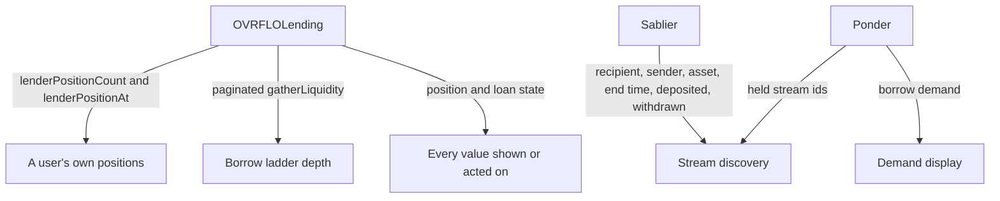
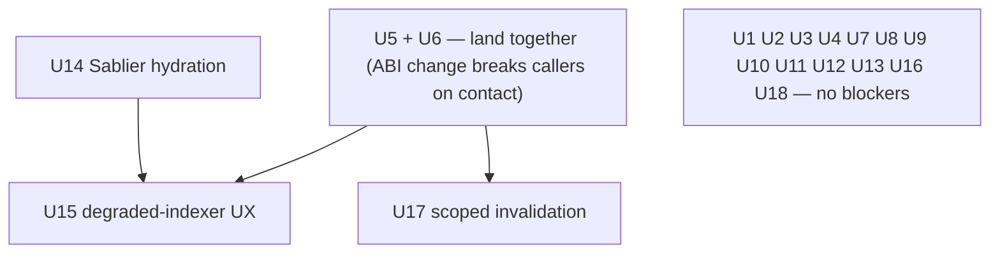

# Audit 2026-07-28 Remediation - Plan

## Goal Capsule

- **Objective:** Give every one of the 41 findings in `docs/dogfood-reports/audit-2026-07-28.md` a recorded disposition, and land the 35 that require a change, sequenced so each tranche carries a single verification gate.
- **Product authority:** The audit report is the finding source. Where it conflicts with `docs/audit/rejected-findings-record.md` or `docs/solutions/patterns/ovrflo-critical-patterns.md`, the settled record wins.
- **Execution profile:** code — Solidity in `src/`, TypeScript/React in `web/`, plus documentation changes. No new Ponder handlers or schema tables.
- **Stop conditions:** Every finding dispositioned; each tranche passes its own gate; three rejection entries and the settled-findings index are written.
- **Open blockers:** none.

---

## Product Contract

### Summary

Remediate all 38 real findings from the 2026-07-28 audit across five tranches grouped by verification surface and ordered by consequence — record, release blockers, contract surface, presentation, then indexer trust. Position and loan discovery moves onto the protocol through per-user indexes rather than onto the indexer, so Ponder stays scoped to Sablier stream events and borrow demand. Three findings are disproven or previously settled and produce written rejections; three more are informational and produce no change.

### Problem Frame

The audit traced nine user flows end to end and produced 41 findings, concluding "do not ship to mainnet" on the strength of three blockers. Its lead blocker, H-1, is false: it claims any third party can push a Sablier withdrawal into the lending market, but the deployed Sablier at `0xAFb979d9afAd1aD27C5eFf4E27226E3AB9e5dCC9` is v2-core `v1.1`, whose `withdraw` reverts `SablierV2Lockup_Unauthorized` unless the caller is the stream sender, the NFT owner, or an approved operator. The vault-as-sender has no withdraw code path, and the market never approves an operator, so the divergence H-1 describes cannot be produced.

This was predicted. `docs/audit/rejected-findings-record.md` rejected the identical finding and recorded a warning that an auditor reading newer Sablier docs would re-raise it as High. Two further findings — L-1 and L-12 — re-raise R-01 and critical pattern #4.

A pointer alone will not prevent the next occurrence, because a pointer already existed and failed. `AGENTS.md` names `docs/solutions/patterns/ovrflo-critical-patterns.md` as required reading, and that file holds both R-01 and pattern #4 — the exact two settled decisions L-1 and L-12 re-raised. The audit read ETHSKILLS closely and cited it throughout, followed the documented entry points, and still re-derived settled ground. The observed failure mode is a reviewer who reads the entry point and does not take the second hop into a linked file.

Separately, the two highest-consequence real findings share one root cause. The client discovers liquidity positions and loans by walking ids 1 through 500 on-chain — the *oldest* 500. Past position 501 every new position is invisible to the app forever and the window never advances, so a lender loses the only in-app route to their capital and the tick they funded shows zero depth and becomes unborrowable (H-5). The same enumeration issues up to 2,500 reads per hook per market, re-run after every confirmed transaction (H-4). The cost scales with total protocol history rather than with what any user owns.

### Key Decisions

- **H-1, L-1, and L-12 are dispositioned as rejections, not implemented.** Each gains a written entry in the rejected-findings record naming the disproof and its evidence. *(session-settled: user-directed — chosen over silently dropping them and over implementing all 41 literally: silent dropping leaves no record for the next auditor, and literal implementation would rewrite loan accounting against a non-existent threat and reverse two deliberate design decisions.)*

- **H-1 produces no code change at all, including no defensive clamp.** The unchecked subtraction in the claim arithmetic cannot underflow given the v1.1 ACL, and adding a clamp would imply the threat model is live. *(session-settled: user-directed — chosen over keeping the clamp as standalone defense-in-depth.)*

- **I-1 follows the same reasoning and is dispositioned as no-action.** Adding `nonReentrant` to `OVRFLO.wrap` defends a vector the audit itself describes as already mitigated by the strict balance-delta assertion and a non-callback underlying. It also breaks a documented property: OpenZeppelin's guard is contract-wide, and `src/OVRFLO.sol` records that `nonReentrant` "blocks nested flash loans but does not block deposit/wrap/unwrap during the callback," so the modifier would make any flash borrower that wraps inside its callback revert.

- **Position and loan discovery moves onto the protocol, not onto the indexer.** `OVRFLOLending` gains per-user indexes so a lender's own positions are a direct read with no scan, and market-wide ladder depth comes from a bounded, cursored `gatherLiquidity`. *(session-settled: user-directed — chosen over event-sourced discovery through Ponder, over paginated enumeration alone, and over a newest-first window: routing discovery through the indexer would make an offchain mirror load-bearing for protocol state, paginated enumeration alone still pays a scan on every position view, and a newest-first window leaves the cliff in place with old positions becoming the invisible ones.)*

- **The per-user index uses a counter plus an index mapping, not a storage array.** `lenderPositionCount` and `lenderPositionAt` in the mapping-as-sequence shape. *(session-settled: user-directed — chosen over a storage array, consistent with the standing preference against introducing arrays where mappings suffice.)*

- **Ponder is scoped to Sablier stream events and borrow demand.** It replaces the Envio role and indexes nothing about liquidity positions, loans, listings, or pool shares — those are protocol state and are read from the protocol. *(session-settled: user-directed.)*

- **The sale side gets disclosure only.** The supply form states that liquidity may be filled as a loan or an outright stream purchase; acquired streams already render in the positions view, so that requirement is a regression guard rather than new work, and no provenance marker is added. *(session-settled: user-directed — chosen over building post/buy/cancel listing flows and over adding an acquisition-origin badge: a sale is a purchase at an agreed discount, and the buyer does not need to be told they bought something.)*

- **USD price context is not built, and its dead configuration is removed.** The CoinGecko CSP origin and the unused price-API environment entry come out, and the deviation from the dollar-context convention is recorded as deliberate rather than left implicit. *(session-settled: user-directed — chosen over implementing price display and over keeping the config as a placeholder: a price feed is a third-party runtime dependency whose staleness is its own hazard, and the codebase already records no-USD as a considered decision.)*

- **Sequencing groups by verification surface and orders by consequence.** Grouping confines the Solidity re-audit to one tranche and gives each tranche a single gate; ordering puts the tranche carrying real user harm second rather than last. *(session-settled: user-directed — chosen over the audit's severity phasing, over persona/flow ordering, and over leaving presentation work ahead of the contract fix.)*

- **The audit-context fix lands first.** The rejection entries and the settled-findings index are documentation-only with a review-only gate, so they block nothing and depend on nothing — and the remediation window is exactly when re-review is most likely. *(session-settled: user-directed — chosen over a standing audit-scope preamble document and over leaving the process gap out of scope.)*

- **An unreachable indexer degrades to stale-with-warning, and actions stay live.** With discovery on the protocol this now scopes to held streams and borrow demand only; liquidity positions and loans remain fully available because they never depended on the indexer. *(session-settled: user-directed — chosen over blocking actions behind an error state and over a read-only degraded view: blocking reproduces exactly the harm H-5 identified, where a user cannot reach their withdraw path through the app.)*

### Where each value comes from

The protocol answers everything about liquidity positions and loans. Ponder answers which Sablier streams a user holds and what borrow demand has looked like; Sablier itself supplies every stream value the user owns or acts on.

### Actors

- A1. Liquidity lender — supplies at a rate; may be filled as a loan or as an outright stream purchase, and must be able to reach their position at any protocol size.
- A2. Stream borrower — pledges a stream against posted liquidity; must not be walked into signatures that cannot succeed.
- A3. Depositor / yield cyclist — deposits PT, pays a fee in underlying, wraps and unwraps.
- A4. Security reviewer (human or agent) — must reach the settled-findings index from the documented entry points without a second hop.
- A5. Indexer operator — runs Ponder for Sablier stream and borrow-demand data.

### Requirements

**Tranche 1 — Record**

- R1. Every one of the 41 findings carries a recorded disposition: fixed, rejected with written rationale, or no-action informational.
- R2. H-1, L-1, and L-12 each gain an entry in the rejected-findings record naming the disproof and the evidence that supports it.
- R3. H-1 produces no code change of any kind.
- R4. The security-review entry point names `docs/audit/` as required reading and enumerates the settled findings inline by ID — H-1, R-01, and critical pattern #4 — so a reviewer sees the collision without opening a linked file.

**Tranche 2 — Release blockers**

- R5. The UI detects a connected chain that differs from the configured chain and replaces every primary action control with a switch-network control.
- R6. Every write names its expected chain, so a wrong-chain broadcast is refused even when the gate is bypassed.
- R7. No action control remains armed after its transaction confirms; the amount field clears and a transient success confirmation is shown, so a cleared form is never mistaken for an untouched one.
- R8. An on-chain-reverted approval is treated as a failure everywhere an approval error is checked.

**Tranche 3 — Contract surface**

- R9. `OVRFLOLending` maintains a per-lender position index as a count plus an index mapping, so a lender's own positions are readable without scanning the global id space.
- R10. `OVRFLOLending` maintains a per-borrower loan index in the same shape.
- R11. `gatherLiquidity` accepts a scan bound and returns a cursor so the client can page.
- R12. Borrow ladder tick depth is derived from the bounded on-chain gather, and the borrow flow consumes the sufficiency signal that read returns.
- R13. No liquidity position or loan becomes unreachable or invisible to its owner at any protocol size, and no position view's cost scales with total protocol history.

**Tranche 4 — Accessibility and presentation**

- R14. Every amount input carries a programmatic label, decimal input mode, and validation state exposed to assistive technology.
- R15. The rate ladder exposes a keyboard model consistent with its radiogroup role.
- R16. Modal focus is trapped for the modal's lifetime and initial focus is deterministic.
- R17. Every interactive target meets 24×24 CSS pixels.
- R18. Text and state colors meet WCAG AA contrast, including cards rendered in a settled or dimmed state.
- R19. The focus indicator is strengthened within the design spec's no-glow constraint rather than weakened to a border shift alone.
- R20. Motion follows the design spec and respects a reduced-motion preference.
- R21. Balance and maturity displays never overstate what the user holds and never round up.
- R22. Maturity gates re-evaluate against a live clock in every form rather than freezing at mount.
- R23. Position cards render without horizontal overflow at mobile widths.
- R24. Amount inputs expose a MAX control and a balance line consistently.
- R25. Truncation of any enumerated list is surfaced to the user through one shared copy pattern reused across every enumerated-list surface, including vault and market lists.
- R26. Action terminology is consistent across modal titles, card buttons, and pending labels.
- R27. Addresses and IDs are copyable and expose their full value.
- R28. An approval that changes a non-zero allowance to another non-zero value issues a zero-first step.
- R29. The shipped CSP carries no dev fallbacks and permits no inline script, achieved by hashing the exported HTML's inline scripts into the script-src directive in a post-build step; the build fails when production origins are missing.
- R30. Styles defined but referenced nowhere are removed, and styles referenced but never defined are written.
- R31. The CoinGecko CSP origin and the unused price-API environment entry are removed, and the absence of USD context is recorded as a deliberate deviation rather than left implicit.
- R32. Page metadata includes a 1200×630 Open Graph image referenced by an absolute production URL, with the production origin supplied by configuration rather than inferred, so social unfurls resolve from the deployed domain.
- R33. User-facing copy is authored in sentence case with uppercase applied presentationally rather than baked into the source strings.
- R34. The live RPC credential is rotated and relocated outside the repository root, and no key material appears in any committed example or config.
- R35. The supply form discloses that liquidity may be filled as a loan or as an outright stream purchase.

**Tranche 5 — Indexer trust and races**

- R36. Ponder indexes Sablier stream events and borrow demand only; no liquidity position, loan, listing, or pool-share state is sourced from it.
- R37. Stream values a user owns or acts on — recipient, sender, asset, end time, deposited, withdrawn, and claimable — are read from Sablier, never from the indexer, and any stream whose on-chain fields disagree with the indexer is dropped rather than rendered.
- R38. The browser reaches the indexer only through a hardened read surface: the raw SQL route is not directly reachable, the unconsumed GraphQL mount is removed, and the remaining surface carries rate limiting, a statement timeout, and an origin allowlist.
- R39. Read invalidation after a write is scoped to the contracts that transaction touched.
- R40. Stream discovery reads carry the indexer's synced block height, and a stream view lagging the user's last confirmed write renders the staleness indicator rather than appearing complete.
- R41. A multi-step claim plan is computed at submit time rather than frozen at modal open.
- R42. A signer switch cannot be beaten by an already-queued transaction.
- R43. When the indexer is unreachable and a stream set is cached, the view renders that set behind a visible staleness indicator, keeps hydrating it from Sablier, drops any entry whose on-chain recipient is not the connected address, discards the cache past a stated maximum age, and keeps stream actions enabled.
- R44. When stream discovery fails with no cached set available, the view renders an explicit unavailable state naming the direct-contract recovery route, never an empty list.
- R45. Liquidity positions, loans, and borrow ladder depth remain fully available while the indexer is unreachable, because they are read from the protocol.
- R46. A stream acquired through a sale fill appears in the holder's positions view with its value and maturity.

### Key Flows

Most of this work modifies existing behavior rather than introducing new paths, so only the two genuinely new behaviors are flow-shaped.

- F1. Degraded stream view
  - **Trigger:** A1 or A2 loads the positions view while the indexer is unreachable.
  - **Actors:** A1, A2, A5
  - **Steps:** Liquidity positions, loans, and ladder depth load normally from the protocol. Stream discovery fails; with a cached set the view renders it behind a staleness indicator and keeps hydrating each entry from Sablier, dropping any whose on-chain recipient no longer matches; with no cached set the stream section renders an explicit unavailable state naming the direct-contract route. Stream actions stay enabled and the contracts validate each one on submission.
  - **Outcome:** The user retains every recovery path, and the part of the view that never depended on the indexer is unaffected.
  - **Covered by:** R43, R44, R45

- F2. Lender filled as a sale
  - **Trigger:** A2 sells a stream into A1's posted liquidity rather than borrowing against it.
  - **Actors:** A1, A2
  - **Steps:** A1 sees both fill paths disclosed before supplying; the fill transfers the stream NFT to A1 at the agreed discount; the acquired stream appears in A1's positions with value and maturity.
  - **Covered by:** R35, R46

### Acceptance Examples

- AE1. **Covers R5, R6.** Given a connected wallet on a non-configured chain, when the market table loads, then every primary action control reads as a switch-network control and no protocol write can be broadcast.
- AE2. **Covers R7.** Given a transaction that has confirmed, when the user clicks the primary action again, then nothing is signed, the amount field is already empty, and a success confirmation is visible.
- AE3. **Covers R8.** Given an approval that was mined but reverted on-chain, when the flow evaluates approval state, then it reports failure rather than advancing to the action step.
- AE4. **Covers R9, R13.** Given a lending market with more than 500 liquidity positions, when a lender supplies into it, then their position appears in their positions view with WITHDRAW and ADJUST RATE available, and the read cost does not grow with the market's total position count.
- AE5. **Covers R12, R13.** Given a tick funded only by positions created after the 500th, when a borrower opens the borrow form, then that tick shows its true depth and is selectable.
- AE6. **Covers R37.** Given an indexer returning a stream the connected address does not own, when the positions view renders, then that stream does not appear.
- AE7. **Covers R43, R45.** Given the indexer is unreachable and a stream set was previously loaded, when the positions view renders, then streams appear behind a staleness indicator with contract-hydrated values, and liquidity positions, loans, and ladder depth render normally.
- AE8. **Covers R44.** Given the indexer is unreachable in a fresh session with no cached stream set, when the positions view renders, then the stream section shows an explicit unavailable state naming the direct-contract recovery route rather than an empty list.

### Success Criteria

Tranches run in the order listed.

| # | Tranche | Contents | Gate |
|---|---|---|---|
| 1 | Record | R1–R4 | Three rejection entries written; settled-findings index present at the entry point |
| 2 | Release blockers | R5–R8 | `npm --prefix web run test` green; wrong-network and post-confirm paths manually exercised |
| 3 | Contract surface | R9–R13 | `forge build` then `forge test`; invariant and fork tests green; re-audit of the new index and view surface recorded; web coverage of the per-user read path and the paginated gather |
| 4 | Accessibility and presentation | R14–R35 | Existing suite green; automated accessibility pass clean; no visual regression on the markets console; production build fails when a required CSP origin is missing and succeeds with dev fallbacks removed |
| 5 | Indexer trust and races | R36–R46 | New unit and E2E coverage including indexer-unreachable and indexer-lagging scenarios; R38 verified against the live deployment with rate-limit policy, statement timeout, and route reachability recorded in `docs/audit/` |

Additionally: no finding from the audit is left without a disposition, and a reader arriving at the entry point can identify H-1, R-01, and pattern #4 as settled without opening a linked file.

The audit named three blocking findings — H-1, H-2, and H-3. H-1 is rejected as disproven, and H-2 and H-3 close with tranche 2, so the audit's blocking set is discharged when tranche 2 lands. Tranches 3 through 5 carry no further blocker clearance. This records what the audit concluded; it names no deploy destination, which remains a separate decision.

### Scope Boundaries

- Listing entrypoints (`postSaleListing`, `buyListing`, `cancelSaleListing`) stay contract-only. No listing UI is built, and removing that deployed surface is not part of this work.
- No provenance marker distinguishes a sale-acquired stream from a deposited one in the positions view.
- H-1's recovery-accounting rewrite is rejected outright — no change to `_claimFair`, `closeLoan`, or `repayLoan` accounting, and no defensive clamp.
- On-chain 18-decimal enforcement is rejected as R-01. Multi-decimal underlying support is not in scope.
- Strengthening address-scoped self-match prevention is rejected as critical pattern #4, accepted by design.
- Reentrancy protection on `OVRFLO.wrap` is not added — see the I-1 decision above.
- USD price context is not implemented. Its configuration surface is removed rather than left as a placeholder.
- No new Ponder handlers or schema tables are added; the indexer's scope does not grow.
- A standing audit-scope preamble document is deferred; the inline settled-findings index plus rejection entries is the version in scope.
- This plan asserts no release gate. Whether and where to deploy is a separate decision.
- I-2 and I-6 are informational and require no change; they are dispositioned as no-action.

### Dependencies / Assumptions

- The Sablier deployment at `0xAFb979d9afAd1aD27C5eFf4E27226E3AB9e5dCC9` is v2-core `v1.1`, whose `withdraw` requires the caller to be sender, NFT owner, or approved operator. This is load-bearing for the H-1 rejection and is already recorded in `docs/audit/sablier-interface-contract.md`.
- `web` builds as a static export (`output: "export"` in `web/next.config.ts`), and the browser reads the indexer through `@ponder/client`, which speaks SQL to the raw query route. Indexer access control therefore cannot rely on client-held credentials, and R38's hardened read surface is a tranche-5 deliverable rather than provider configuration.
- Ponder today registers five Sablier handlers plus one `BorrowerLoanPoolCreated` handler feeding `borrow_events`. That is the scope R36 fixes in place — no handlers or tables are added, and the single `OVRFLOLending` handler is retained because borrow demand is historical activity rather than protocol state.
- Ponder runs on managed hosting in production. The committed `disableCache: true` and mandatory `PONDER_START_BLOCK` are local-fork settings that must not carry into that deployment — under them every restart re-syncs from the start block, which would make the R43 degraded state routine after each deploy rather than exceptional.
- `PositionList` already filters held streams through `isSeriesMatchedStream` and renders a card per stream, so R46 is satisfied by existing code and stands as a regression guard.
- The baseline at audit time was typecheck clean, lint clean, and 313 unit tests passing; tranche gates are stated against that baseline.

### Outstanding Questions

**Deferred to planning**

- Whether withdrawal swap-and-pops to keep the per-user index dense or leaves gaps for the client to filter.
- Whether the per-user index is backfilled for positions created before it ships, or applies only to new positions with a one-time migration read path.
- Whether tranche 4 lands as one change or several, and how the tranches map onto branches.
- What backs the cached stream set in R43 — in-memory query cache only, or persisted across reloads — and how stale is stale enough to warrant the indicator.

**Deferred to deployment**

These are pipeline practices rather than audit findings, so they sit outside the tranches. They are recorded here because the audit reviewed the application and not the deploy path, and each is cheap to get wrong silently.

- Build artifacts are cleared before every production build. A stale `web/out` publishes old code with no error, which is the most common static-deploy failure.
- Whether `trailingSlash` is required depends on the deploy target: IPFS gateways do not resolve bare filenames, so a path without a trailing slash 404s there. The current config sets `output: "export"` without it, and `scripts/build-csp.mjs` emits both a Vercel config and a `public/_headers` file, so the intended target is not recorded anywhere.
- Whether event monitoring exists for the deployed contracts. Production readiness for a value-holding deployment normally assumes it, and nothing in the repo indicates it.

### Sources / Research

- `docs/dogfood-reports/audit-2026-07-28.md` — the finding source.
- `docs/frontend-decision-map.md` — orientation on the conventions the audit applied and where OVRFLO stands against them.
- `docs/audit/rejected-findings-record.md` — previously settled findings, including the prior rejection of H-1's claim.
- `docs/audit/sablier-interface-contract.md` — the pinned v1.1 withdraw-ACL table.
- `docs/solutions/patterns/ovrflo-critical-patterns.md` — R-01 and pattern #4, which L-1 and L-12 re-raise.
- [ETHSKILLS](https://ethskills.com/SKILL.md) `/frontend-ux`, `/qa`, `/indexing` — the standard the audit judged against.
- `web/next.config.ts` and `web/lib/ponder.ts` — static-export and indexer-transport constraints on R38.
- `web/components/PositionList.tsx` — existing held-stream rendering behind R46.
- `src/OVRFLO.sol` — the documented flash-loan callback carve-out behind the I-1 decision.

---

## Planning Contract

**Product Contract preservation:** Product Contract unchanged. R1–R46, A1–A5, F1–F2, AE1–AE8, the tranche gates, and the disposition appendix are carried verbatim; this section and everything below it add HOW.

### Key Technical Decisions

- KTD1. The per-lender and per-borrower indexes use a count plus an index mapping, not a storage array. *(session-settled: user-directed — chosen over a storage array: consistent with the standing project preference against introducing arrays where mappings suffice; inherits the Product Contract decision of the same name.)*

- KTD2. Discovery moves onto the protocol, not the indexer. *(session-settled: user-directed — chosen over event-sourced discovery through Ponder, paginated enumeration alone, and a newest-first window: routing discovery through the indexer would make an offchain mirror load-bearing for protocol state; inherits the Product Contract decision of the same name.)*

- KTD3. The three existing enumeration hooks are extended in place rather than replaced by a new pagination hook. `useLendingLiquidity`, `useBorrowerLoans`, and `useLoanBook` already share one derivation — `enumerateIds` bounded by `MAX_ENUMERATION_IDS` in `web/lib/lending-math.ts` — and each already returns a `tooLarge` flag. Introducing a parallel hook would leave two enumeration definitions alive at once, which is the drift the shared helper exists to prevent.

- KTD4. Truncation disclosure is an extension, not new construction. `tooLarge` is already consumed in four places — `web/components/PositionList.tsx` for its truncation copy, and three form call sites in `web/components/ActionModal.tsx` via a `truncated` prop. R25 extends that one pattern to the vault and market lists; it does not introduce a second disclosure mechanism.

- KTD5. Wrong-chain safety is enforced twice: the UI gate swaps the control, and each write names its expected chain so the write layer refuses a mismatch independently. The audit's finding is about a broadcast reaching the wrong chain, and a UI-only gate cannot survive a stale tab or a switch that races a click.

- KTD6. Revert detection is not re-derived. `useWriteFlow` already reads `receipt.data.status` and exposes `isReverted` separately from `isConfirmed`, with the reasoning recorded in `docs/solutions/logic-errors/usetxqueue-on-chain-revert-treated-as-confirmed.md`. R8 is an audit of the approval *consumers* that ignore that signal, not a fix to the signal itself.

- KTD7. Scoped invalidation replaces the prefix match inside the existing shared helper rather than at each call site. `invalidateAllOnChainReads` in `web/lib/invalidate.ts` is deliberately shared by `useWriteFlow` and the claim-all queue so the two cannot drift; scoping must preserve that single seam.

- KTD8. R36 is a regression guard rather than new work. Ponder today registers five Sablier handlers plus one `BorrowerLoanPoolCreated` handler over three tables (`asset`, `borrow_events`, `sablier_streams`) — already the scope R36 requires. The deliverable is a check that fails if that set grows to cover position, loan, listing, or pool-share state.

- KTD9. Two requirements are maintainer-owned and cannot be discharged by the implementing agent. R34's key rotation is a credential action performed in the provider's dashboard; the agent's share is relocating the file out of the repository root and updating dev-setup docs. R38's "verified against the live deployment" needs access to the deployed Ponder instance; the agent's share is writing and locally verifying the hardening. Both units are complete from the agent's side without those steps and must say so rather than claiming the requirement closed.

- KTD10. Tranche order is review cadence, not dependency. Four blocking edges are real: **U5 and U6 land together** (the `gatherLiquidity` signature change breaks its callers on contact — including `test/fizz/handlers/OVRFLOLendingHandler.sol`, which `forge build` compiles, so U5 alone turns its own gate red); U15 cannot start before U6 and U14 (its degraded-view claim depends on ladder reads being off the indexer, and its cached-entry hydration *is* U14's mechanism); and U17 cannot land before U6 (scoped invalidation only refetches registered keys, so removing the prefix-match blanket before U6 registers its per-user and paginated-gather keys reintroduces H-5's symptom through the fix). Every other unit is independently startable. *(session-settled: user-directed — chosen over hard-blocking each tranche on the one before it: most tickets have no code dependency on their predecessor, and serializing them would idle work that could land in parallel. The four edges above are code dependencies, not cadence.)*

### Unit dependency graph

### Assumptions

- The Sablier deployment at `0xAFb979d9afAd1aD27C5eFf4E27226E3AB9e5dCC9` is v2-core `v1.1` with the withdraw ACL recorded in `docs/audit/sablier-interface-contract.md`. This is load-bearing for U1's H-1 rejection.
- The baseline is the post-`2026-07-28-001` tree: 332 unit tests passing, lint clean, `tsc --noEmit` clean, 31 E2E scenarios passing. Tranche gates are stated against that baseline, not the audit-time 313.
- E2E work needs a paid archive `MAINNET_RPC_URL` and one shared local environment; see `docs/agents/testing.md` before treating a mass failure as a regression.

### Risks

| Risk | Mitigation |
|---|---|
| U17 collides with the SE2-adoption plan. R7 and R8 of `docs/plans/2026-07-28-003-refactor-web-adopt-se2-patterns-plan.md` specify the same scoped-invalidation change from a different angle, so both plans would rewrite `web/lib/invalidate.ts`. | Land U17 first and treat it as the implementation of that plan's R7/R8; when 003 runs, its invalidation requirements should be marked already-satisfied rather than re-derived. |
| U4, U11, and the shipped 2% fee buffer all edit the same approval logic in `web/lib/convert.ts` and ConvertForm. | Sequence U4 before U11 and re-read the buffer helper before touching the approve path; three independent edits to one function is how the buffer gets reverted by accident. |
| U5's index changes are the highest-consequence contract edit in the plan and land beneath a live-value surface. | Invariant coverage extended in the same unit rather than after; re-audit note recorded before U6 consumes the new reads. |
| U15 depends on a cache whose backing and maximum age are still open. | The unit owns both decisions and must record them in its PR; leaving them implicit reproduces the staleness ambiguity the requirement exists to close. |
| Tranche 4 spans seven units over shared CSS and component files, inviting merge churn. | U7–U13 touch mostly disjoint concerns by design; land them individually rather than as one branch. |
| An agent could mark R34 or R38 closed on the strength of its own half. | KTD9 splits both explicitly, and the Definition of Done carries them as separate maintainer-owned checkboxes. |

---

## Implementation Units

Units map 1:1 onto the approved tickets in `.scratch/audit-2026-07-28-remediation/issues/`; U-IDs match ticket numbers. The ticket files carry the same acceptance criteria and are the working surface for status.

| U-ID | Unit | Key files | Depends on |
|---|---|---|---|
| U1 | Audit disposition record | `docs/audit/`, `AGENTS.md`, `test/fork/` | — |
| U2 | Wrong-network write safety | `web/components/ActionModal.tsx`, `web/lib/config.ts` | — |
| U3 | Post-confirm control re-arm | `web/components/ActionModal.tsx` | — |
| U4 | Reverted approval as failure | `web/lib/convert.ts`, `web/components/ActionModal.tsx` | — |
| U5 | Contract per-user indexes + bounded gather | `src/OVRFLOLending.sol`, `test/`, ABI callers | lands with U6 |
| U6 | Client consumes indexes + paginated ladder | `web/hooks/`, `web/lib/lending-math.ts`, `web/components/ActionModal.tsx` | U5 (same landing) |
| U7 | Amount input accessibility & correctness | `web/components/ActionModal.tsx`, `web/hooks/useNowSeconds.ts` | — |
| U8 | Ladder & modal interaction accessibility | `web/components/ActionModal.tsx`, `web/app/globals.css` | — |
| U9 | Touch targets, contrast, mobile layout | `web/app/globals.css`, `web/components/PositionList.tsx`, `web/components/MarketsTable.tsx` | — |
| U10 | Copy consistency & truncation disclosure | `web/components/`, `web/lib/format.ts` | — |
| U11 | Zero-first approval step | `web/lib/convert.ts`, `web/components/ActionModal.tsx` | — |
| U12 | Build & deploy config hardening | `web/scripts/build-csp.mjs`, `web/package.json`, `web/app/`, `.env` | — |
| U13 | Supply-form dual-fill disclosure | `web/components/ActionModal.tsx` | — |
| U14 | Stream values hydrated from Sablier | `web/hooks/useHeldStreams.ts`, `web/lib/ponder.ts` | — |
| U15 | Degraded-indexer UX | `web/hooks/useHeldStreams.ts`, `web/components/PositionList.tsx` | U6, U14 |
| U16 | Hardened indexer read surface | `tools/ponder/src/api/index.ts`, `tools/ponder/ponder.config.ts`, `web/lib/ponder.ts` | — |
| U17 | Scoped cache invalidation & sync staleness | `web/lib/invalidate.ts`, `web/lib/query-keys.ts`, `web/hooks/useTxQueue.ts` | U6 |
| U18 | Claim-plan freshness & signer-switch guard | `web/components/ActionModal.tsx` | — |

### U1. Audit disposition record

**Goal:** Every one of the 41 findings carries a recorded disposition, and a reviewer re-deriving H-1, R-01, or critical pattern #4 meets the settled record at the entry point instead of re-raising them.

**Requirements:** R1–R4, A4. KTD9 does not apply.

**Dependencies:** None.

**Files:**
- Modify: `docs/audit/rejected-findings-record.md`
- Modify: `AGENTS.md` (or whichever security-review entry point names `docs/audit/`)

**Approach:** Add a dated rejection entry for H-1, L-1, and L-12, each naming its disproof and evidence. Enumerate the settled IDs inline at the entry point, not behind a link: a pointer already existed and the audit still re-derived them, so the second hop is the observed failure mode. Record one-line no-action rationale for I-1, I-2, I-6.

**Finding IDs must be qualified by their audit source.** `docs/audit/rejected-findings-record.md` already uses `H-1`, `H-2`, and `L-1` for *different* findings from an earlier audit — its `H-1 → L-1` entry concerns `uint128`/`uint40` narrowing and explicitly says "L-1 remains an active Low finding … Do not treat L-1 as rejected," and its `H-2` is the Sablier withdraw-ACL rejection that *this* audit calls `H-1`. Writing bare IDs would plant a direct contradiction in the same file and point the next reviewer at the wrong rows — defeating the exact failure this tranche exists to prevent. Write every ID as `audit-2026-07-28 H-1` and add a cross-reference line to the existing entries noting the reuse.

**A test-only change is in scope here.** R3's "no code change of any kind" is narrowed to production code under `src/` — the rejection stands, but its cited evidence is currently unreproducible from the repo. `test/fork/OVRFLOLendingMainnetFork.t.sol`'s stranger-withdraw test passes `to` = caller in every case, which reverts under both v1.1 and the later permissionless-`to == recipient` ACL, so it cannot discriminate the version the whole rejection rests on. Add one pranked `withdraw(streamId, address(lending), withdrawable)` expecting a revert, and cite that test in H-1's rejection entry.

**Test scenarios:**
- A stranger-pranked `withdraw` with `to` set to the lending market reverts on the deployed Sablier, discriminating v1.1 from the later permissionless-`to` ACL.

**Verification:** A reader arriving at the entry point can name the settled findings without opening a linked file, and no ID in the record is ambiguous between audits. No file under `src/` or `web/` changes.

### U2. Wrong-network write safety

**Goal:** A wallet on a non-configured chain cannot reach a live protocol write, and the write layer refuses a mismatch even when the UI gate is bypassed.

**Requirements:** R5, R6, AE1. Findings H-2. KTD5.

**Dependencies:** None.

**Files:**
- Modify: `web/components/ActionModal.tsx` (all six form components)
- Modify: `web/lib/config.ts`
- Test: `web/tests/components/ActionModal.test.tsx`

**Approach:** Detect connected-vs-configured chain mismatch (`chainId` in `web/lib/config.ts` is already pinned to 1). On mismatch, every primary action control becomes a switch-network control — not merely disabled, per the ETHSKILLS QA checklist that calls the header-dropdown pattern insufficient. Independently, each write names its expected chain so a wrong-chain broadcast is refused at the write layer.

**Test scenarios:**
- Covers AE1. Wallet on a non-configured chain → every primary action control across all six forms reads as a switch-network control.
- A write invoked directly with a mismatched chain is refused, with the UI gate bypassed.
- Wallet on the configured chain → controls render normally, no switch affordance.
- Chain switches from wrong to right while a form is open → control returns to its normal action without a remount.

**Verification:** No protocol write can broadcast while the wallet is on the wrong chain. `npm --prefix web run test` green.

### U3. Post-confirm control re-arm

**Goal:** A confirmed transaction cannot be re-signed by a second click, and the cleared form is unambiguous about having succeeded.

**Requirements:** R7, AE2. Findings H-3.

**Dependencies:** None.

**Files:**
- Modify: `web/components/ActionModal.tsx` (SupplyForm, SimpleActionForm, ConvertForm, BorrowForm, AdjustRateForm, RepayForm)
- Test: `web/tests/components/ActionModal.test.tsx`

**Approach:** On confirmation the amount field clears and a transient success confirmation renders; the primary control does not remain armed against stale state. A cleared field must never be mistakable for an untouched one — that ambiguity is the finding, not the clearing itself.

**Test scenarios:**
- Covers AE2. After a confirmed transaction, clicking the primary action signs nothing, the amount field is empty, and a success confirmation is visible.
- The success confirmation is transient, not sticky across reopening the modal.
- Exercised for each of the six forms, not one representative.
- A failed (reverted) transaction does not clear the field — the user's input survives so they can retry.

**Verification:** `npm --prefix web run test` green; wrong-network and post-confirm paths manually exercised per the tranche 2 gate.

### U4. Reverted approval treated as failure

**Goal:** A mined-but-reverted approval reads as failure everywhere approval state is evaluated.

**Requirements:** R8, AE3. Findings M-2. KTD6.

**Dependencies:** None.

**Files:**
- Modify: `web/lib/convert.ts`, `web/components/ActionModal.tsx`
- Test: `web/tests/lib/convert.test.ts`, `web/tests/components/ActionModal.test.tsx`

**Approach:** `useWriteFlow` already separates `isReverted` from `isConfirmed` by reading `receipt.data.status`. Audit every approval-gated path — deposit fee, PT, stream, and any allowance-gated flow — for places that advance on submission or on a receipt arriving rather than on a *successful* receipt, and route them through the existing signal.

**Execution note:** Start by characterizing which approval consumers currently mistake a reverted receipt for success; the fix is small once the inventory is real.

**Test scenarios:**
- Covers AE3. An approval mined-but-reverted → approval state reports failure and the flow does not advance to the action step.
- The optimistic approved-amount state is cleared, not left covering the reverted amount.
- Every approval-gated path, not only the deposit fee path.
- A successful approval still advances, so the fix does not over-correct into blocking valid flows.

**Verification:** `npm --prefix web run test` green.

### U5. Contract: per-user indexes and bounded gather

**Goal:** A lender's or borrower's own positions are a direct read with no global scan, and `gatherLiquidity` becomes bounded and cursored.

**Requirements:** R9, R10, R11. Findings M-15; the contract half of H-4/H-5. KTD1, KTD2.

**Dependencies:** None.

**Files:**
- Modify: `src/OVRFLOLending.sol`
- Modify (ABI/caller fallout): `test/fizz/handlers/OVRFLOLendingHandler.sol`, `web/lib/generated.ts` (regenerated), `web/tests/e2e/fixtures/chain.ts`, `script/local-stress-test.sh`
- Test: `test/OVRFLOLending.t.sol`, `test/OVRFLOLendingInvariant.t.sol`, `test/fork/`

**Approach:** Add three indexes in the mapping-as-sequence shape (KTD1), not two:

1. `lenderPositionCount` / `lenderPositionAt` — a lender's own liquidity positions.
2. The per-borrower loan equivalent.
3. **A per-lender loan-pool participation index**, appended inside `_consumeLiquidity` when a lender's contribution to a pool first becomes non-zero. Without it R13 does not hold: `useLoanBook` serves two views off one scan — borrower-side `loans` and lender-side `pools`, the latter filtered by `loanPoolContributions[loanId][user] > 0`. That second view is keyed by loan id with no reverse link from a liquidity position, so neither of the first two indexes de-scans it, and a lender's claimable proceeds past loan 500 would stay invisible.

`gatherLiquidity` today takes a `startId` but loops unbounded to `nextLiquidityId` and returns only `sufficient` — add a scan bound and return a continuation cursor so the client can page.

**Backfill is resolved, not deferred:** the index applies from deployment. `OVRFLOFactory.deployLending` constructs a fresh non-upgradeable `OVRFLOLending` with `new` — no proxy, no initializer, no upgrade path — so storage cannot be added to an existing instance, and no mainnet deployment exists. Neither backfill nor a migration read path is possible or needed. The density question (swap-and-pop vs. gaps the client filters) stays open and is U5's to settle in its PR, applied consistently across all three indexes.

**Execution note:** Index maintenance is invariant-shaped; extend the invariant suite alongside the unit tests rather than after.

**Test scenarios:**
- A created position appears at the lender's next index slot and increments their count.
- Withdrawal updates the index per the chosen density decision, and a subsequent create still lands correctly.
- A lender with positions interleaved among other lenders' reads back only their own.
- A lender whose liquidity is consumed into a borrower's loan pool appears in the per-lender pool index, and reads back that pool without scanning the loan id space.
- A lender contributing to the same pool twice is appended once, not duplicated.
- `gatherLiquidity` respects its scan bound and returns a cursor that resumes exactly where the prior page stopped.
- `gatherLiquidity` at the end of the id space returns an empty page and a terminal cursor.
- Invariant: per-user index contents stay consistent with global position state across create/withdraw/adjust sequences.
- Self-liquidity exclusion and the strictly-increasing-id requirement in `_validateLiquidity` still hold.

**Verification:** `forge build` then `forge test`; invariant and fork tests green; a re-audit note recorded in `docs/audit/` describing the new index and view surface.

### U6. Client consumes per-user indexes and paginated ladder

**Goal:** No position or loan is unreachable to its owner at any protocol size, and no position view's cost scales with total protocol history.

**Requirements:** R12, R13, AE4, AE5. Closes H-4 and H-5. KTD3.

**Dependencies:** U5.

**Files:**
- Modify: `web/hooks/useLendingLiquidity.ts`, `web/hooks/useBorrowerLoans.ts`, `web/hooks/useLoanBook.ts`, `web/lib/lending-math.ts`
- Modify: `web/components/ActionModal.tsx` (BorrowForm — the sole `gatherLiquidity` call site and sufficiency consumer)
- Test: `web/tests/hooks/`, `web/tests/components/position-cards.test.tsx`

**Approach:** Replace the `enumerateIds`/`MAX_ENUMERATION_IDS` walk — which scans ids 1..500, oldest-first, with a window that never advances — with the per-user index reads for own-positions and own-loans, and with the bounded cursored `gatherLiquidity` for ladder depth. Extend the three hooks in place (KTD3). The borrow flow consumes the sufficiency signal the bounded read returns, so it knows whether it has walked enough of the ladder to trust the depth shown.

**Test scenarios:**
- Covers AE4. A market with more than 500 positions: a lender's own new position appears with WITHDRAW and ADJUST RATE available.
- Covers AE4. Read cost does not grow with the market's total position count.
- Covers AE5. A tick funded only by positions created after the 500th shows true depth and is selectable.
- A page walk that terminates early is distinguishable from one that completed.
- A user with zero positions in a large market renders an empty state, not a truncation warning.
- Existing single-page behavior in a small market is unchanged.

**Verification:** Web coverage of the per-user read path and the paginated gather; `npm --prefix web run test` green.

### U7. Amount input accessibility and correctness

**Goal:** Every amount input is programmatically labelled, never overstates holdings, and gates on a live clock.

**Requirements:** R14, R21, R22, R24. Findings M-1, M-12, M-14, L-11, L-10.

**Dependencies:** None.

**Files:**
- Modify: `web/components/ActionModal.tsx`, `web/components/MarketRowDetail.tsx`, `web/components/PositionList.tsx`
- Test: `web/tests/components/ActionModal.test.tsx`

**Approach:** Add programmatic label, decimal input mode, and exposed validation state to every amount input. Round balances and maturity displays down, never up. `useNowSeconds(true)` (30s tick) is currently used only by SupplyForm; wire it into ConvertForm, BorrowForm, AdjustRateForm, MarketRowDetail, and PositionList so a market crossing maturity while a panel is open disables the action rather than leaving it armed until remount. Add MAX and a balance line consistently.

Also close L-10, whose maturity formatting drifts from DESIGN.md §10: identifiers should read `27JUN27`, captions `Matures Jun 27, 2027`, and countdowns `142d 06h`. `formatMaturity` currently emits `Jun 27, 2027` with no prefix, and `MarketsTable` renders days with no hours.

**Test scenarios:**
- Each amount input exposes a label, decimal input mode, and validation state to assistive technology.
- A balance that would round up displays rounded down instead.
- A market crossing maturity while a form is open disables the action without a remount, for each of the five components currently frozen at mount.
- MAX populates the field with the full spendable balance, and the balance line matches it.
- MAX on a zero balance leaves the control inert rather than filling `0`.

**Verification:** Existing suite green; automated accessibility pass clean; no visual regression on the markets console.

### U8. Ladder and modal interaction accessibility

**Goal:** The rate ladder is keyboard-operable per its radiogroup role, modal focus is trapped and deterministic, and motion respects user preference.

**Requirements:** R15, R16, R19, R20. Findings M-4, M-5, L-5, M-13.

**Dependencies:** None.

**Files:**
- Modify: `web/components/ActionModal.tsx`, `web/app/globals.css`
- Test: `web/tests/components/borrow-form.test.tsx`, `web/tests/components/ActionModal.test.tsx`

**Approach:** Give the ladder arrow-key navigation consistent with radiogroup semantics. Trap focus for each modal's lifetime with deterministic initial focus. Honor `prefers-reduced-motion`.

For the focus indicator, use the technique the audit already computed rather than re-deriving one: `.input:focus` today changes only `border-color` with `outline: none` — a border shift alone, which R19 forbids. Thicken the focused border to 2px, which strengthens it while staying inside DESIGN.md's no-glow, no-outline-ring constraint.

**Test scenarios:**
- Arrow keys move ladder selection between rate options; Tab exits the group rather than traversing it.
- Modal focus is trapped for its lifetime and returns to the invoking control on close.
- Initial focus lands on the same deterministic element every time a given modal opens.
- With `prefers-reduced-motion` set, animations are suppressed while the state change still occurs.
- The focus indicator remains visible against every card background state.

**Verification:** Automated accessibility pass clean; no visual regression on the markets console.

### U9. Touch targets, contrast, and mobile layout

**Goal:** Every interactive target is reachable, every text and state color is legible, and position cards fit mobile widths.

**Requirements:** R17, R18, R23. Findings M-16, M-10, M-11, I-4, I-5.

**Dependencies:** None.

**Files:**
- Modify: `web/app/globals.css`, `web/components/PositionList.tsx`, `web/components/MarketsTable.tsx`
- Test: `web/tests/components/position-cards.test.tsx`

**Approach:** Bring every interactive target to at least 24×24 CSS pixels.

For contrast, apply the audit's own M-10 fix rather than re-deriving one: `.card-dimmed { opacity: 0.5 }` composites `--dim` text down to roughly 2.1:1. Remove the opacity compositing and set explicit dimmed colors per element so each clears 4.5:1 individually, preserving the visual hierarchy without the compositing penalty.

The mobile overflow is structural, not cosmetic: `MarketRowDetail` and its position cards render as a `<tr>` inside `MarketsTable`'s `min-width: 760px` table box, so they inherit that width floor even though DESIGN.md §5 says cards render at every breakpoint. Move the expanded detail into a sibling block below the table keyed to the selected market. A clipping fix (`overflow: hidden`, shrinking content) would pass a naive check while still violating the spec.

Also close I-4 (swap the fixed viewport height for a dynamic viewport unit, which the iOS toolbar breaks) and I-5 (add the missing intermediate breakpoint around 800px).

**Test scenarios:**
- Every interactive target measures at least 24×24 CSS pixels.
- Contrast passes for default, settled, and dimmed card states, with no rule relying on opacity compositing to dim text.
- Position cards render without horizontal overflow at mobile viewport widths, and the expanded detail is no longer nested inside the table's width floor.
- The intermediate breakpoint renders without layout collapse between mobile and desktop.
- Viewport-height-dependent layout survives the mobile browser toolbar appearing and disappearing.
- Desktop layout is unchanged by the mobile fix.

**Verification:** Automated accessibility pass clean; no desktop visual regression.

### U10. Copy consistency and truncation disclosure

**Goal:** Truncated lists say so through one shared pattern, action terminology matches across surfaces, and identifiers are copyable in full.

**Requirements:** R25, R26, R27, R33. Findings L-2, L-7, L-13, I-3. KTD4.

**Dependencies:** None.

**Files:**
- Modify: `web/components/PositionList.tsx`, `web/components/MarketsTable.tsx`, `web/components/ActionModal.tsx`, `web/lib/format.ts`
- Test: `web/tests/components/markets-table.test.tsx`, `web/tests/lib/`

**Approach:** The truncation pattern already exists — `tooLarge` drives copy in PositionList and a `truncated` prop on three ActionModal call sites. Extend that one pattern to the vault and market lists rather than adding a second mechanism (KTD4). Make action terminology identical across modal titles, card buttons, and pending labels. Add click-to-copy exposing full untruncated values. Author source strings in sentence case with uppercase applied presentationally.

**Test scenarios:**
- A truncated vault or market list renders the same disclosure copy the position list uses.
- An untruncated list renders no disclosure.
- The same action reads identically in modal title, card button, and pending label across all forms.
- Activating a copy affordance places the full untruncated value on the clipboard.
- Rendered casing is unchanged after the source strings move to sentence case.

**Verification:** No visual regression — text still displays uppercase where DESIGN.md calls for it.

### U11. Zero-first approval step

**Goal:** A non-zero-to-non-zero allowance change goes through zero first.

**Requirements:** R28. Findings L-3.

**Dependencies:** None. Shares files with U4 — sequence them or coordinate.

**Files:**
- Modify: `web/lib/convert.ts`, `web/components/ActionModal.tsx`
- Test: `web/tests/lib/convert.test.ts`

**Approach:** Inventory every allowance-changing call site and classify which can go non-zero to a different non-zero. Those issue an approve-to-zero before the new-amount approve. This composes with the 2% deposit-fee buffer already shipped in `2026-07-28-001`; it changes the sequence, not the amount.

**Test scenarios:**
- A non-zero to different-non-zero change issues zero-first, then the new amount, in that order.
- A zero to non-zero change issues a single approve.
- A non-zero to identical-amount change issues nothing.
- The buffered deposit-fee amount is preserved through the zero-first sequence.

**Verification:** `npm --prefix web run test` green.

### U12. Build and deploy config hardening

**Goal:** The production bundle ships an enforced CSP with no dev fallbacks, no dead config, and no key material in the repository root.

**Requirements:** R29, R30, R31, R32, R34. Findings M-17, L-6, L-8, L-4, L-9. KTD9.

**Dependencies:** None.

**Files:**
- Modify: `web/scripts/build-csp.mjs`, `web/.env.example`, `web/app/layout.tsx`, `web/app/globals.css`
- Modify: `docs/agents/testing.md` or the dev-setup doc naming `.env`
- Move: `.env` (out of the repository root)

**Approach:** `build-csp.mjs` currently substitutes `rpc.ankr.com` and `localhost` when `NEXT_PUBLIC_RPC_URL` / `NEXT_PUBLIC_PONDER_URL` are missing, so a deployed app can ship a CSP that blocks its own RPC and indexer. Make missing production origins fail the build. Remove the CoinGecko origin and `NEXT_PUBLIC_PRICE_API_URL` — nothing fetches a price — and record no-USD as a deliberate deviation rather than leaving it implicit.

**The CSP work splits across the build boundary.** `web/package.json` runs `build-csp.mjs` *before* `next build`, and `build-csp.mjs` writes `web/public/_headers`, which Next copies into `out/` during export — so a hash computed after the build can never reach that build's output. Following the requirement literally would ship a CSP whose hashes do not match the HTML it guards, blocking every inline hydration script. Keep `build-csp.mjs` pre-build for origin validation and fail-on-missing-origin; add a post-`next build` step that hashes the exported HTML's inline scripts into `script-src` and rewrites `out/_headers` and `web/vercel.json` directly. One header block applies to all paths, so `script-src` carries the union of inline-script hashes across every exported page.

While rewriting `script-src`, reduce it to `'self'` plus the computed hashes — the WalletConnect and Reown wildcard origins allow any subdomain of three third-party domains as a script source, and nothing in `web/` loads a remote script. Wallet connectivity rides on `connect-src` and `frame-src`, which stay untouched.

**The OG image asset is a maintainer input (KTD9).** No 1200×630 asset exists in the repo — `web/public/brand/` holds only square marks — and a coding agent cannot fabricate a marketing graphic. Either the maintainer supplies the asset, or the unit generates one at build time from `web/public/brand/overflow-mark.png` via `ImageResponse`. Wire whichever lands into `layout.tsx`'s `openGraph.images` and `twitter.images` as an absolute URL from the configured production origin.

**R34 is split (KTD9).** The agent relocates `.env` out of the repository root and updates dev-setup docs. **Rotating the Alchemy key is the maintainer's step** and is not discharged by this unit; the audit records the key as gitignored and absent from history, so this is hygiene rather than live exposure.

**Test scenarios:**
- A production build with a required origin missing fails rather than substituting a fallback.
- A production build with all origins present succeeds and emits no dev fallback origin in the CSP.
- The emitted `script-src` contains hashes and permits no unhashed inline script.
- No CSS rule is defined-but-unreferenced or referenced-but-undefined after the sweep.
- Page metadata resolves the OG image to an absolute production URL, not a relative or inferred one.

**Verification:** Production build fails on a missing CSP origin and succeeds with dev fallbacks removed. `.env` no longer sits in the repository root. Unit reports R34 as agent-complete, maintainer-pending.

### U13. Supply-form dual-fill disclosure

**Goal:** A lender learns before supplying that liquidity may fill as a loan or as an outright sale, and an acquired stream still appears in the buyer's positions.

**Requirements:** R35, R46, F2. Findings M-3.

**Dependencies:** None.

**Files:**
- Modify: `web/components/ActionModal.tsx` (SupplyForm)
- Test: `web/tests/components/supply-form.test.tsx`, `web/tests/e2e/supply.feature`

**Approach:** Add disclosure copy stating both fill paths. No provenance marker distinguishes a sale-acquired stream; a sale is a purchase at an agreed discount.

**R46's guard belongs at the E2E tier, not the component tier.** A component test would pass on hand-fed data — `position-cards.test.tsx` mocks `useHeldStreams` wholesale, so it only proves `PositionList` renders a stream it is handed. The chain that can actually regress runs `sellStreamToLiquidity` transferring the NFT to the lender, then Ponder's `Transfer` handler rewriting `recipient` in `sablier_streams` — the discovery hop critical pattern #1 warns about. Only an E2E over the seeded fork exercises both halves.

**Test scenarios:**
- The supply form states both fill paths before submission.
- Covers F2 / R46 (E2E). Selling a stream into posted liquidity makes it appear in the buyer's positions view with value and maturity.
- No acquisition-origin badge is rendered.

**Verification:** `npm --prefix web run test` green, and the R46 scenario green under the E2E gate.

### U14. Stream values hydrated from Sablier

**Goal:** Every stream value a user owns or acts on comes from Sablier, and an indexer/chain disagreement drops the entry rather than rendering it.

**Requirements:** R37, AE6. Findings M-9.

**Dependencies:** None.

**Files:**
- Modify: `web/hooks/useHeldStreams.ts`, `web/lib/ponder.ts`
- Test: `web/tests/hooks/`, `web/tests/lib/ponder.test.ts`

**Approach:** Treat the indexer as a discovery hint for *which* stream ids exist, never as the source of truth for their values. Hydrate recipient, sender, asset, end time, deposited, withdrawn, and claimable from Sablier on-chain. Drop any entry whose on-chain recipient does not match the connected address or whose hydrated fields materially disagree with the indexer's report.

**Test scenarios:**
- Covers AE6. The indexer returns a stream the connected address does not own → it does not appear.
- A stream whose on-chain end time disagrees with the indexer is dropped, not rendered with either value.
- A stream whose values agree renders with the on-chain values.
- Hydration failure for one stream does not drop the rest of the set.

**Verification:** `npm --prefix web run test` green.

### U15. Degraded-indexer UX

**Goal:** An unreachable indexer degrades the stream view to stale-with-warning while leaving protocol-sourced data and every action intact.

**Requirements:** R43, R44, R45, F1, AE7, AE8.

**Dependencies:** U6, U14.

**Files:**
- Modify: `web/hooks/useHeldStreams.ts`, `web/components/PositionList.tsx`
- Test: `web/tests/components/position-cards.test.tsx`, `web/tests/e2e/`

**Approach:** With a cached stream set, render it behind a visible staleness indicator, keep hydrating from Sablier via U14's mechanism, drop entries whose on-chain recipient no longer matches, discard the cache past a stated maximum age, and keep stream actions enabled — the contracts validate each action at submission. With no cache, render an explicit unavailable state naming the direct-contract recovery route; never an empty list, which reads as "you have nothing" rather than "we cannot tell you." Blocking actions behind an error state reproduces exactly the harm H-5 identified.

**An empty response is not the same as no streams.** R44 as written triggers only on discovery *failing*, but `fetchHeldStreamIds` returns `[]` rather than throwing when the client is unconfigured — unlike `fetchBorrowDemand`, which throws deliberately for exactly this reason. A mid-resync, misconfigured, or withholding indexer therefore renders a confident empty list, which is the harm R44 exists to prevent. Gate any empty stream set on the indexer's synced height (carried by R40) being at or ahead of chain head; when it is behind or absent, render the unavailable state instead. Make `fetchHeldStreamIds` throw on an unconfigured client so that case reaches the same path as unreachable.

Decide and document the maximum cache age and what backs the cache. If the cache persists across reloads, key it by connected address as well as chain — the on-chain recipient re-check protects what renders, not what sits at rest in a shared browser.

**Test scenarios:**
- Covers AE7. Indexer unreachable with a cached set → streams render behind a staleness indicator with contract-hydrated values.
- Covers AE7 / R45. In the same state, liquidity positions, loans, and ladder depth render normally.
- Covers AE8. Indexer unreachable with no cache → explicit unavailable state naming the direct-contract route, not an empty list.
- A cached entry whose on-chain recipient no longer matches is dropped from the degraded view.
- A cache past its maximum age is discarded rather than rendered stale.
- Stream actions remain enabled throughout the degraded state.

**Verification:** New unit and E2E coverage for both the cached and no-cache degraded paths.

### U16. Hardened indexer read surface

**Goal:** The browser reaches the indexer only through a narrow hardened surface, and Ponder's scope cannot silently grow.

**Requirements:** R36, R38. Findings M-8. KTD8, KTD9.

**Dependencies:** None.

**Files:**
- Modify: `tools/ponder/src/api/index.ts`, `tools/ponder/ponder.config.ts`, `web/lib/ponder.ts`
- Add: a scope regression check under `web/tests/indexer/` or `tools/ponder/`

**Approach:** Remove the unconsumed `graphql()` mount at `/graphql`.

**R38's "not directly reachable" is read as "narrowed and bounded," not "removed."** Taken literally the requirement is self-contradictory: `/sql/*` is the app's *only* transport — `web/lib/ponder.ts` speaks `@ponder/client` SQL against it for both held streams and borrow demand — and the plan's own Dependencies note rules out client-held credentials under static export. An origin allowlist is browser-enforced and the Origin header is client-supplied, so it bounds casual cross-site use rather than authenticating callers. Replace the arbitrary-SQL `client()` mount with two purpose-built read endpoints matching the only two query shapes in `web/lib/ponder.ts` — held streams by address, borrow demand by market — and move the browser off `@ponder/client` onto plain fetch. That delivers the narrow surface R38 is reaching for. Rate limiting and the statement timeout are the load-bearing controls; the allowlist is defense in depth. The data is public chain state, so the endpoints are public by construction.

Also make `disableCache: true` and the mandatory `PONDER_START_BLOCK` environment-conditional — they are local-fork settings, and carrying them to managed hosting means every restart re-syncs from the start block, which makes the degraded state routine after each deploy rather than exceptional.

R36 is a guard, not a change (KTD8): add a check that fails if the handler or table set grows to cover position, loan, listing, or pool-share state.

**R38 is split (KTD9).** The agent writes and locally verifies the hardening. **Verifying rate-limit policy, statement timeout, and route reachability against the live deployment, and recording them in `docs/audit/`, is the maintainer's step.**

**Test scenarios:**
- A request to the raw SQL route from a disallowed origin is refused.
- A request from an allowed origin succeeds.
- `/graphql` returns not-found after removal.
- A query exceeding the statement timeout is terminated rather than held open.
- Requests beyond the rate limit are throttled.
- The scope check fails when a handler or table covering position/loan/listing/pool-share state is added, and passes on the current set.

**Verification:** Local hardening verified by the tests above. Unit reports R38 as agent-complete, maintainer-pending.

### U17. Scoped cache invalidation and sync staleness

**Goal:** A confirmed write invalidates only what it touched, immediately, and a stream view lagging the user's last write says so.

**Requirements:** R39, R40.

**Dependencies:** U6 — scoped invalidation only refetches registered keys, so it must not replace the prefix-match blanket before U6's per-user index and paginated-gather keys exist to register.

**Files:**
- Modify: `web/lib/invalidate.ts`, `web/lib/query-keys.ts`, `web/hooks/useHeldStreams.ts`, `web/hooks/useTxQueue.ts`, `web/hooks/useStaleRecovery.ts`
- Test: `web/tests/lib/`, `web/tests/hooks/`

**Approach:** `invalidateAllOnChainReads` currently prefix-matches `["readContract"]` and `["readContracts"]`, refetching every mounted read on any write. Scope invalidation to the contracts and keys the transaction touched, keeping the shared-helper seam that stops `useWriteFlow` and the claim-all queue from drifting (KTD7). Both consumers already invalidate on a status-checked receipt rather than a poll tick, so the change is scope, not timing.

`useStaleRecovery` is a third consumer and stays an explicit exception: it fires on a classified stale-liquidity error caused by *another* party's write, so there is no transaction to scope by. Keep it unscoped and say so, rather than handing it an empty scope that silently makes it a no-op.

**Staleness anchors to chain head, not the user's own write.** R40's literal trigger cannot fire for the person it protects: in the sale flow the *borrower* signs, so the lender who just acquired a stream has no "last confirmed write" to lag against and sees a confident, complete-looking list missing what they bought. The same holds for a borrower whose stream returns via a permissionless `closeLoan`. Render the indicator whenever the indexer's synced height lags chain head beyond a stated threshold.

**Test scenarios:**
- A write to one market does not invalidate an unrelated market's queries.
- A write does invalidate the keys for the contracts it touched.
- Both `useWriteFlow` and the claim-all queue route through the same scoped helper; `useStaleRecovery` remains deliberately unscoped.
- The per-user index read and paginated gather introduced by U6 are invalidated by both a supply and a withdraw write.
- A synced height lagging chain head renders the staleness indicator; a current height does not.
- A stream acquired through a counterparty's transaction — where the viewer signed nothing — still triggers the indicator while the indexer lags.

**Verification:** A test asserts an unrelated market's queries are not invalidated by a write. `npm --prefix web run test` green.

### U18. Claim-plan freshness and signer-switch guard

**Goal:** A multi-step plan reflects state at submit time, and a signer switch cannot be beaten by a queued transaction.

**Requirements:** R41, R42. Findings M-6, M-7.

**Dependencies:** None.

**Files:**
- Modify: `web/components/ActionModal.tsx`
- Test: `web/tests/components/ActionModal.test.tsx`

**Approach:** Recompute the claim plan immediately before submission rather than reusing the plan built at modal open — a stream claimed elsewhere in between makes the frozen plan wrong. Guard against an already-queued transaction landing under a switched signer.

**Test scenarios:**
- State changes between modal-open and submit → the submitted plan reflects the fresh state.
- An unchanged state produces an identical plan, so recomputation is not gratuitously disruptive.
- A signer switch with an in-flight queued transaction does not attribute it to the new signer.
- A plan that becomes empty between open and submit surfaces that rather than submitting a no-op.

**Verification:** `npm --prefix web run test` green.

---

## Verification Contract

| Gate | Command / check | Applies to |
|---|---|---|
| Solidity build and test | `forge build` then `forge test` | U5 |
| Invariant suite | `FOUNDRY_PROFILE=invariant forge test --match-contract OVRFLOLendingInvariant` | U5 |
| Fork tests | `forge test --match-path "test/fork/*" --fork-url $MAINNET_RPC_URL` | U5 |
| Frontend unit | `npm --prefix web run test` | U2–U4, U6–U18 |
| Lint | `npm --prefix web run lint` | all web units |
| Typecheck | `web/node_modules/.bin/tsc --noEmit` | all web units |
| Accessibility | `npm --prefix web run a11y` | U7, U8, U9 |
| Production build | `npm --prefix web run build` with production origins set, and again with one missing | U12 |
| E2E | `npm --prefix web run bootstrap:e2e` then `npm --prefix web run test:e2e` | U6, U13, U15 |
| Fork (H-1 evidence) | `forge test --match-path "test/fork/*" --fork-url $MAINNET_RPC_URL` | U1 |

Read `docs/agents/testing.md` before running the E2E tier and before treating a mass failure as a regression — there is one shared Anvil/Ponder/dev-server environment, and a collision looks exactly like a suite-wide break.

Per-tranche gates from the Product Contract's Success Criteria remain authoritative for grouping; the table above names the commands.

---

## Definition of Done

**Global**

- [ ] Every one of the 41 findings carries a recorded disposition (U1).
- [ ] R1–R46 satisfied, except the two maintainer-owned steps recorded below.
- [ ] `forge build` and `forge test` green, including invariant and fork tiers.
- [ ] `npm --prefix web run test`, `lint`, and `tsc --noEmit` green.
- [ ] Full E2E suite green against a freshly bootstrapped local fork.
- [ ] No liquidity position or loan is unreachable to its owner at any protocol size.
- [ ] Abandoned-attempt code from approaches that did not pan out is removed, not left in the diff.
- [ ] Each ticket in `.scratch/audit-2026-07-28-remediation/issues/` has its acceptance criteria checked and a dated implementation comment.

**Maintainer-owned — not dischargeable by the implementing agent (KTD9)**

- [ ] R34: the Alchemy key is rotated in the provider dashboard. *(The agent's share — relocating `.env` and updating dev-setup docs — is covered by U12.)*
- [ ] R38: rate-limit policy, statement timeout, and route reachability verified against the live deployment and recorded in `docs/audit/`. *(The agent's share — writing and locally verifying the hardening — is covered by U16.)*
- [ ] R32: the 1200×630 Open Graph asset is supplied, or the build-time generation route is approved. *(An agent cannot author a marketing graphic; U12 wires in whichever lands.)*

**Per unit**

Each unit is done when its own Verification line holds and its test scenarios pass. U5 additionally requires the re-audit note and lands together with U6. U12 and U16 are agent-complete with their maintainer step still open.

---

## Deferred / Open Questions

### From 2026-07-28 review

- **Ladder curation.** The fill path verifies depth but not price. With ladder depth now read from the protocol this is substantially reduced — an indexer cannot withhold ticks it no longer supplies — but a client-side bug or a truncated page walk could still present an incomplete ladder. Open question: whether the borrow form should signal that a page walk terminated early.

---

## Appendix: Finding disposition index

| ID | Disposition | Tranche |
|---|---|---|
| H-1 | Rejected — v1.1 withdraw ACL makes the described divergence impossible | 1 |
| H-2 | Fix — wrong-network detection | 2 |
| H-3 | Fix — post-confirm re-arm | 2 |
| H-4 | Fix — per-user index removes the global scan | 3 |
| H-5 | Fix — per-user index and paginated depth remove the 500-id cliff | 3 |
| M-1 | Fix — input labelling | 4 |
| M-2 | Fix — reverted approval treated as failure | 2 |
| M-3 | Fix — supply-form disclosure; held-stream rendering already present | 4 / 5 |
| M-4 | Fix — ladder keyboard model | 4 |
| M-5 | Fix — focus trap and initial focus | 4 |
| M-6 | Fix — claim plan computed at submit | 5 |
| M-7 | Fix — signer-switch race | 5 |
| M-8 | Fix — hardened indexer read surface | 5 |
| M-9 | Fix — on-chain hydration of stream values | 5 |
| M-10 | Fix — settled-card contrast | 4 |
| M-11 | Fix — position card responsive width | 4 |
| M-12 | Fix — MAX and balance line consistency | 4 |
| M-13 | Fix — motion spec and reduced motion | 4 |
| M-14 | Fix — balance rounding | 4 |
| M-15 | Fix — bounded, paginated `gatherLiquidity` | 3 |
| M-16 | Fix — target sizes | 4 |
| M-17 | Fix — CSP build enforcement and post-build hashing | 4 |
| L-1 | Rejected — R-01, 18-decimal enforcement declined by design | 1 |
| L-2 | Fix — surface the 100-item truncation | 4 |
| L-3 | Fix — zero-first approval step | 4 |
| L-4 | Fix — Open Graph image | 4 |
| L-5 | Fix — focus indicator strength | 4 |
| L-6 | Fix — dead and missing CSS | 4 |
| L-7 | Fix — terminology consistency | 4 |
| L-8 | Fix — remove dead price-API surface, record the deviation | 4 |
| L-9 | Fix — RPC credential rotated and relocated | 4 |
| L-10 | Fix — maturity formatting | 4 |
| L-11 | Fix — live maturity clock | 4 |
| L-12 | Rejected — critical pattern #4, accepted by design | 1 |
| L-13 | Fix — click-to-copy | 4 |
| I-1 | No action — already mitigated; a contract-wide guard would break the documented flash-loan carve-out | — |
| I-2 | No action — exemption holds | — |
| I-3 | Fix — sentence-case source with presentational uppercase | 4 |
| I-4 | Fix — dynamic viewport unit | 4 |
| I-5 | Fix — intermediate breakpoint | 4 |
| I-6 | No action — exposure bounded to fee revenue | — |
