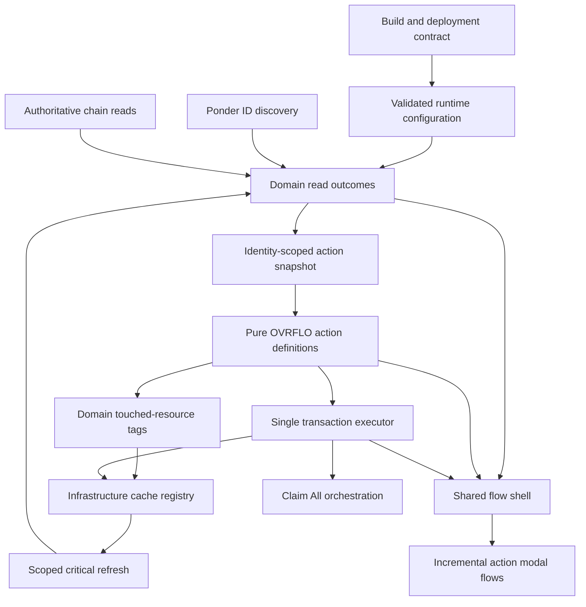
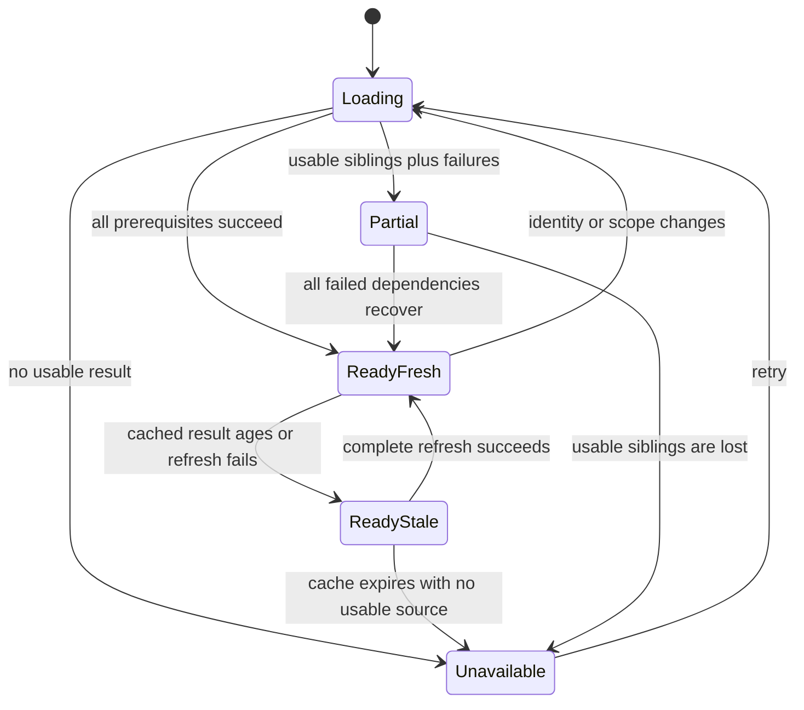
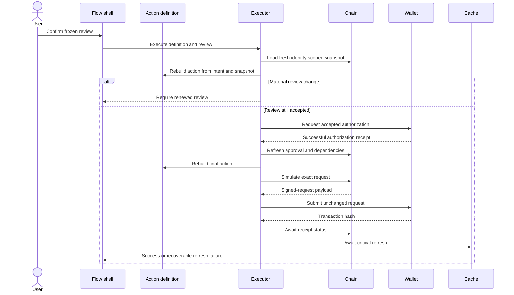
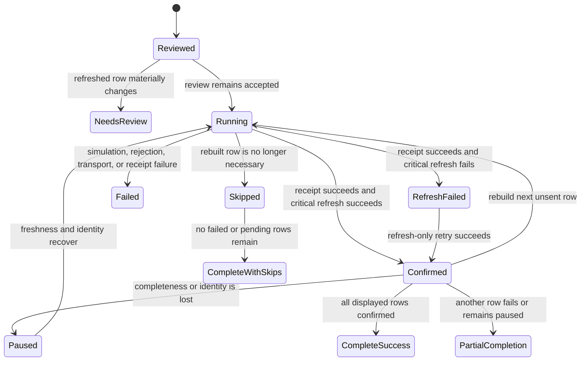

# Frontend Policy Boundaries Remediation - Plan

## Goal Capsule

- **Objective:** Implement Phases 0 through 6 of the canonical frontend fix without rewriting the product, changing its visual identity, or claiming that frontend work resolves Solidity discovery limits.
- **Authority hierarchy:** This plan defines executable units. `docs/plans/2026-07-29-003-frontend-fix-canonical-plan.md` remains the authoritative design origin. Repository instructions and security guidance govern implementation. Current code and tests establish the starting behavior.
- **Execution profile:** Deep, cross-cutting frontend remediation across build packaging, reads, Ponder discovery, financial action policy, transaction execution, modal composition, tests, and CI.
- **Stop conditions:** Stop and surface a blocker if implementation would require changing Solidity for H-4/H-5, weakening fail-closed production configuration, making Ponder authoritative for live state, removing static export, changing a reviewed financial outcome without renewed confirmation, or overwriting unrelated workspace changes.
- **Tail ownership:** The executor owns implementation, verification, simplification, code review, and a repo-conforming commit tail. This plan does not introduce a pull-request requirement.
- **Plan integrity:** Treat this file and its origin as read-only during implementation. Track progress outside plan files.

---

## Product Contract

### Summary

The frontend will expose honest read completeness, complete indexed-stream discovery, pure OVRFLO-specific action definitions, and one transaction executor. The existing modal will be split only after policy and execution ownership move out of it. Production builds will fail closed, deployment CSP output will be generated without mutating committed inputs, and verification will become durable in CI.

This plan closes the eleven tasks in `docs/plans/2026-07-29-001-fix-web-review-findings-plan.md` and preserves the architectural decision in the canonical origin. It does not modify the canonical origin.

### Problem Frame

The current frontend has local safeguards, but their ownership is fragmented. Hooks can convert failed financial reads into zeros or empty collections. Ponder discovery can stop without proving completeness. Action validation, approval policy, simulation, signing, receipt handling, and refresh behavior are distributed across components and hooks. The build can use unsafe defaults or mutate deployment configuration. These defects can present incomplete data as truth or let a wallet prompt diverge from the reviewed action.

The fix is an ownership migration. Read hooks own explicit completeness. Pure definitions own action policy. One executor owns the signed lifecycle. Components own presentation and orchestration only.

### Actors

- A1. A connected OVRFLO user reviews markets, positions, streams, and transaction outcomes.
- A2. An implementer changes the frontend and Ponder API while preserving OVRFLO domain rules and existing visual behavior.
- A3. A release operator builds and deploys the static export, then verifies the production CSP headers.
- A4. CI proves security lint, unit behavior, Ponder behavior, and static-export compatibility without requiring a seeded fork.

### Requirements

**Build, runtime, and recovery**

- R1. Production configuration must reject a missing, malformed, or zero factory and any unsupported `NEXT_PUBLIC_CHAIN_ID` before a deployable bundle is emitted.
- R2. The normal build must not modify committed files, and deployment packaging must emit a CSP/header artifact with current hashes, approved production origins, and no localhost origin; production must promote that verified prebuilt artifact without a second framework build.
- R3. The configured public client must use the operator-ordered `NEXT_PUBLIC_RPC_URL` plus `NEXT_PUBLIC_RPC_FALLBACK_URLS`, with no implicit public production fallback, and treat transport availability failures as fallback candidates without retrying execution reverts on another transport.
- R4. Every signed request must use the configured Ethereum mainnet chain with chain ID 1, and no caller-supplied request field may override that chain at either the type boundary or runtime boundary.
- R5. Static-export-compatible recovery must include route/global error boundaries and explicit client loading states; it must not add the unsupported `app/loading.tsx` convention.

**Read truth and discovery completeness**

- R6. A financial read surface must return an explicit `loading`, `ready`, `partial`, or `unavailable` outcome, with `ready` carrying `fresh` or `stale` freshness and `partial` retaining successful siblings plus failure metadata; one shared policy owns the freshness window, refresh-failure transition, and identity invalidation.
- R7. Only a complete successful read may produce a ready-empty state; failed counts, pages, records, owners, or financial subcalls must never become zero, an empty collection, or an omitted error.
- R8. Valid on-chain exclusions may be omitted without making a result partial when a slot is unwritten, a discovered ID is no longer owned, or the contract reports that the entity is not a stream.
- R9. Ponder stream discovery must retain `streamIds`, add `hasMore` plus exclusive `before` continuation, cap a page at 500 rows, and let the client aggregate 100-row pages with deduplication and a hard ceiling of 50 pages or 5,000 IDs.
- R10. Ponder may discover IDs and history, but current ownership, eligibility, balances, withdrawable amounts, and action readiness must come from chain reads.
- R11. Markets and portfolio consumers must distinguish loading, partial, unavailable, stale, ready-empty, and ready-populated states; successful rows may remain visible with an explicit partial warning.
- R12. Aggregate actions such as Claim All must remain unavailable unless every contributing source is fresh, complete, and ready.

**Action policy and reviewed intent**

- R13. Each supported action must have a pure OVRFLO-specific definition that transforms user intent plus an identity-scoped snapshot into preconditions, amount validation, an authorization plan, final-call construction, domain touched-resource tags, and receipt summary data.
- R14. Approval and submit paths must apply the same action-validity preconditions, and negative, malformed, zero, or over-cap amounts must fail before approval planning or ABI encoding.
- R15. Matured claim capacity must use the fresh minimum of wallet balance, `claimablePt`, and `marketTotalDeposited`; both MAX and manual validation must use that capacity.
- R16. A reviewed action must freeze its displayed target, function, arguments, value, approval requirement, and minimum or net outcome until confirmation.
- R17. Confirmation must refresh and rebuild the action; expected completion of an accepted authorization step may change only its satisfied state, while any new spender, token, amount, sequence, final call, or displayed economic outcome must replace the review and require another explicit confirmation.
- R18. Existing OVRFLO rules must remain intact, including 0 = unlimited, PT 18-decimal assumptions, cross-market `ovrfloToken` fungibility, zero-first approvals, forward timestamps, and no USD presentation.

**Execution and queue behavior**

- R19. One executor must own connect, account and chain latching, identity-scoped snapshot loading, action rebuild, approval handling, exact final simulation, signature submission, receipt classification, invalidation, critical refresh, terminal UI state, and one in-flight execution per flow identity.
- R20. The executor must submit the exact request returned by the final successful simulation and must rebuild and resimulate after any approval, dependency, account, chain, calldata, value, or queue-predecessor change.
- R21. A mined receipt is successful only when `receipt.status === "success"`; reverted receipts, rejection, simulation failure, transport failure, and post-receipt refresh failure must remain distinct.
- R22. A successful receipt followed by failed critical refresh must preserve the transaction hash in a recoverable `refresh_failed` state, and retrying refresh must never rebroadcast the transaction.
- R23. Critical chain cache refresh must be targeted, include inactive coverage when required, await failures through a throwing path, and resolve every action-defined resource to fresh ready data for the latched identity before the UI reports a fully refreshed success.
- R24. Claim All must remain a sequential orchestration layer over the same executor, rebuild every unsent row after its predecessor, preserve confirmed rows across pause/resume, and stop when freshness, account, or chain invariants fail.
- R25. Claim All must distinguish confirmed, skipped, needs-review, paused, failed, and partially completed rows; its aggregate outcome must distinguish complete success, complete with skips, and partial completion, and only submitted rows with successful receipt plus required refresh count as confirmed.

**Presentation, accessibility, and durability**

- R26. The shared flow shell must be introduced only after read, policy, and executor boundaries exist, and the incremental modal split must preserve current OVRFLO-specific behavior and visual design.
- R27. The live modal must preserve its real dialog container, visible title and close control, accessible labels and field-error associations, focus entry and containment, Escape handling, inert background, focus restoration, body-only error recovery, polite progress announcements, and alert semantics for terminal errors.
- R28. Semantic test rewrites must remove assertions that pin unsafe defaults or silent recomputation, and the relevant review/accountability record must explain each intentional contract change in the same unit.
- R29. CI must run frontend security lint, frontend unit tests, Ponder tests, and the static-export build; seeded-fork E2E remains a documented manual gate unless separately approved for CI.
- R30. Production CSP/header delivery and production Reown wallet coverage on Ethereum mainnet must remain human release gates with evidence bound to one commit, one prebuilt artifact, one environment profile, and one deployment URL.
- R31. H-4/H-5 Solidity discovery changes are outside this frontend plan and must remain an accepted residual or a separate protocol plan.

### Key Flows

- F1. Complete read and portfolio rendering
  - **Trigger:** A1 opens a markets or portfolio surface.
  - **Actors:** A1
  - **Steps:** Hooks load upstream counts and IDs, retain per-subcall outcomes, aggregate all discovery pages, rehydrate live state from chain, and expose a domain outcome to the consumer.
  - **Outcome:** The UI shows known data and its completeness without converting failure into an empty or zero state.
  - **Covered by:** R6-R12

- F2. Single financial action
  - **Trigger:** A1 opens, reviews, and confirms an action.
  - **Actors:** A1
  - **Steps:** The definition builds the review, confirmation refreshes and compares it, the executor handles approval and rebuilds, the exact final call is simulated and signed, the receipt is classified, and critical data refreshes.
  - **Outcome:** The signed request matches accepted intent and the UI reaches a truthful terminal state.
  - **Covered by:** R13-R23

- F3. Claim All queue
  - **Trigger:** A1 confirms a complete multi-claim plan.
  - **Actors:** A1
  - **Steps:** The queue submits one row through F2, awaits its critical refresh, rebuilds the next unsent row, and pauses when completeness or identity changes.
  - **Outcome:** Confirmed work is preserved and unsent work never relies on a stale batch simulation.
  - **Covered by:** R12, R17, R19-R25

- F4. Static export release
  - **Trigger:** A3 produces a release candidate.
  - **Actors:** A2, A3, A4
  - **Steps:** CI validates configuration and security rules, builds without tracked mutations, binds evidence to one prebuilt artifact, and the operator promotes that artifact after route-complete CSP and wallet verification.
  - **Outcome:** The deployed static site has the intended security headers and production runtime configuration.
  - **Covered by:** R1-R5, R29-R30

### Acceptance Examples

- AE1. **Covers R6-R8, R11.** Given two successful market subcalls and one failed subcall, when the hook resolves, then the two successful siblings remain visible and the outcome is partial with failure metadata.
- AE2. **Covers R7, R11.** Given every prerequisite succeeds and returns no approved market, when the markets table renders, then it shows `NO APPROVED MARKETS`; an unavailable read never shows that message.
- AE3. **Covers R9-R10.** Given more than 100 streams and one ID transferred before hydration, when discovery completes, then all pages are aggregated and deduplicated while the transferred ID is excluded by the current chain owner.
- AE4. **Covers R9, R12.** Given page two fails or the cursor repeats, when discovery returns earlier rows, then the portfolio is partial and Claim All remains disabled.
- AE5. **Covers R14-R15.** Given an amount is zero, negative, malformed, or above fresh matured-claim capacity, when A1 requests approval or submit, then both paths reject before encoding or wallet interaction.
- AE6. **Covers R16-R17.** Given the rebuilt target, call data, approval requirement, or displayed outcome differs from the frozen review, when A1 confirms, then no signature is requested and the changed review requires confirmation again.
- AE7. **Covers R19-R22.** Given final simulation succeeds but the mined receipt is reverted, when receipt handling completes, then the action fails, no success invalidation runs, and the UI does not report success.
- AE8. **Covers R22-R23.** Given the receipt succeeds but critical refresh fails, when A1 retries, then only refresh runs, the successful hash remains visible, and the original transaction is not rebroadcast.
- AE9. **Covers R24-R25.** Given the first Claim All row confirms and completeness is lost before the second row, when the queue advances, then the first row remains confirmed and the queue pauses before another wallet prompt.
- AE10. **Covers R2, R29-R30.** Given a production build and deploy package, when verification runs, then committed inputs are unchanged, every exported HTML route receives the enforcing artifact CSP with current hashes and no localhost, and the same artifact passes the production wallet gate.

### Success Criteria

- All live frontend read consumers use explicit domain outcomes and no audited failure path defaults financial data to zero or ready-empty.
- Indexed stream discovery proves completion or reports a specific incomplete state.
- Every supported action routes through one pure definition and one executor.
- Claim All composes the executor without losing its existing race protections.
- `ActionModal.tsx` becomes a composition surface instead of an action-policy and execution owner.
- The security lint, typecheck, unit, Ponder, and production build gates run in CI.
- Deployment verification proves the CSP header outside the repository build alone.

### Scope Boundaries

**In scope**

- Canonical origin Phases 0 through 6.
- All tasks in `docs/plans/2026-07-29-001-fix-web-review-findings-plan.md`.
- `web/`, the Ponder `/streams` endpoint in `tools/ponder/`, related tests, CI, and documentation needed to keep those contracts durable.

**Preserved constraints**

- Next.js static export, App Router server/client boundaries, wagmi, viem, TanStack Query, Reown, typed ABIs, and the existing Ponder role.
- The current OVRFLO product vocabulary, action set, business rules, visual language, and user-facing interaction model.
- Existing modal and queue protections until their replacements are proven.

**Outside this product's identity**

- A generic DeFi action framework.
- USD conversion or external price presentation.
- A frontend rewrite or visual redesign.
- Making Ponder authoritative for live financial state.

### Deferred to Follow-Up Work

- H-4/H-5 Solidity per-user lending indexes or bounded/cursored `gatherLiquidity`.
- A seeded-fork E2E CI service with dedicated RPC, process, and account isolation.
- Unrelated frontend cleanup discovered outside the files and contracts named by the active units.

### Dependencies

- Stable operator-ordered Ethereum mainnet RPC URLs and production Reown project configuration must be available to the release environment.
- The release path must support building, verifying, and promoting one immutable Vercel prebuilt artifact without a second framework build.
- Manual seeded-fork E2E follows `docs/agents/testing.md` and `web/tests/e2e/README.md`.
- Existing uncommitted workspace changes must remain intact.

### Sources and Research

- Design authority: `docs/plans/2026-07-29-003-frontend-fix-canonical-plan.md`
- Live findings: `docs/plans/2026-07-29-001-fix-web-review-findings-plan.md`
- Architecture review: `docs/frontend-architecture-review-2026-07-29.md`
- Domain rules: `CONCEPTS.md`, `docs/solutions/patterns/ovrflo-critical-patterns.md`
- Read authority: `docs/solutions/security-issues/indexer-is-a-discovery-hint-not-an-authority.md`
- Transaction and read planners: `docs/solutions/architecture-patterns/web-markets-outcome-first-planners-and-tx-queue.md`
- Invalidation: `docs/solutions/architecture-patterns/scoped-cache-invalidation-and-its-named-exception.md`
- Build security: `docs/solutions/best-practices/fail-the-build-on-missing-security-config.md`
- Test quality: `docs/solutions/best-practices/vitest-frontend-test-quality-antipatterns.md`
- Next.js static export: https://nextjs.org/docs/app/guides/static-exports
- Next.js loading convention support: https://nextjs.org/docs/app/api-reference/file-conventions/loading
- Vercel Build Output API: https://vercel.com/docs/build-output-api/configuration
- Vercel prebuilt deployment: https://vercel.com/docs/cli/deploy#prebuilt
- Viem fallback transports: https://viem.sh/docs/clients/transports/fallback
- Viem simulation and exact request submission: https://viem.sh/docs/contract/simulateContract
- TanStack Query invalidation behavior: https://tanstack.com/query/v5/docs/reference/QueryClient
- WAI modal dialog pattern: https://www.w3.org/WAI/ARIA/apg/patterns/dialog-modal/

---

## Planning Contract

### Key Technical Decisions

- KTD1. **Create a linked executable artifact.** Keep the canonical origin unchanged and make this file the implementation unit contract for its frontend Phases 0 through 6. (session-settled: user-directed — chosen over editing the canonical plan: the user requested a separate implementation-ready plan linked to it)
- KTD2. **Exclude protocol-scale discovery changes.** Frontend completeness must be honest about H-4/H-5, while any Solidity index or lending enumeration change remains a separate plan. (session-settled: user-approved — chosen over reopening Solidity in this plan: the confirmed scope is frontend remediation and does not claim a React fix for protocol enumeration)
- KTD3. **Adapt recovery to static export.** Add compatible `error.tsx` and `global-error.tsx` boundaries, but keep initial and query loading in client components because Next.js documents `loading.tsx` as unsupported for static export. This external constraint is load-bearing for R5.
- KTD4. **Use one domain read-outcome vocabulary.** Affected hooks retain successful multicall siblings and expose failure metadata. They never switch all multicalls to fail-fast and never erase individual failures. `ready-empty` requires complete successful prerequisites.
- KTD5. **Use descending keyset stream pagination.** The endpoint preserves `streamIds`, adds `hasMore`, and accepts the last returned ID as the exclusive `before` bound. It fetches `limit + 1`, caps a page at 500, and the client uses 100-row pages with a 50-page or 5,000-ID ceiling.
- KTD6. **Extend existing pure planner modules.** New action definitions build on `web/lib/convert.ts`, `web/lib/borrow.ts`, `web/lib/claim-all.ts`, `web/lib/modal-logic.ts`, `web/lib/positions.ts`, `web/lib/router.ts`, and related math modules. They do not introduce a protocol-agnostic action abstraction.
- KTD7. **Make the simulated request the signing authority.** An action runtime adapter loads the identity-scoped snapshot and maps domain touched-resource tags through an infrastructure cache registry. Pure definitions transform intent and snapshot. The executor latches account and chain, rebuilds, completes accepted approvals, rebuilds again, simulates the exact final call, and submits the returned request unchanged.
- KTD8. **Separate receipt truth from refreshed UI truth.** Receipt success is immutable transaction evidence. Critical refresh reaches success only when every required resource is ready and fresh for the latched identity; otherwise it becomes `refresh_failed` with retry-only refresh. Delayed Ponder retries remain noncritical indexer-lag handling.
- KTD9. **Keep Claim All as orchestration.** `useTxQueue` retains ownership refs, confirmed-row preservation, cancellation cleanup, grouped pool-share multicalls, and pause/resume behavior. A grouped row freezes its sorted loan-ID set; a constituent change requires renewed review, full disappearance becomes skipped, and every unsent row goes through KTD7 after the previous row's critical refresh.
- KTD10. **Extract policy before presentation.** Action definitions and the executor land before a shared flow shell. The modal splits by low-coupling flows first, with Borrow last because it has the largest dependency surface.
- KTD11. **Keep expensive verification outside mandatory CI.** Unit, Ponder, security-lint, and build gates run in CI. Seeded-fork E2E and production CSP/Reown verification remain human gates. (session-settled: user-approved — chosen over adding seeded-fork E2E to CI now: environment isolation is not part of the confirmed frontend scope)
- KTD12. **Promote one verified prebuilt deployment artifact.** The release path runs the Vercel build adapter, amends and verifies the generated `.vercel/output/config.json` after static export, records the artifact identity, and promotes that exact prebuilt output without a second framework build. Failure to preserve generated routes or obtain a stable artifact hook blocks release.
- KTD13. **Centralize freshness.** `web/lib/read-outcome.ts` owns the freshness window, background-refresh transition, and account/chain/scope invalidation. A failed page refresh over a prior complete snapshot retains that snapshot as stale with failure context; without a complete snapshot, successful pages are partial and cannot authorize actions.

### High-Level Technical Design

The target structure has one direction of authority. Presentation can request reads or actions, but it cannot redefine completeness or signed intent.

Read state is a domain contract, not a projection of TanStack's query status.

Only `ReadyFresh` may enable an aggregate financial action. `ReadyStale` may remain visible but cannot authorize action construction.

The executor is a serial protocol. Any state-changing predecessor invalidates downstream planning and simulation.

Claim All owns queue lifecycle without creating a second executor.

Static imports follow the same direction as the component diagram. Pure definitions may import domain math and types, but not React, TanStack Query, wagmi hooks, or cache keys. The runtime adapter may import read services and the cache registry. Read hooks and presentation may not import the executor back into the read-outcome layer.

### Sequencing and Dependency Strategy

1. U1 closes immediate build and runtime safety defects and proves the immutable prebuilt deployment contract before deeper refactors.
2. U2 establishes the read vocabulary and migrates upstream hooks before their consumers.
3. U3 proves indexed-stream completeness and aggregate portfolio readiness on top of U2.
4. U4 moves action policy into pure definitions while the existing modal remains the live container.
5. U5 introduces the single-action executor and migrates single actions.
6. U6 composes Claim All through the executor without discarding queue protections.
7. U7 introduces the shared shell and incremental modal split after behavior is centralized.
8. U8 makes the contracts durable in CI and records release evidence requirements.

### System-Wide Impact

- **Users:** Empty, partial, stale, unavailable, and complete states become visibly distinct. Wallet prompts may pause more often when reviewed intent changes, which is the intended safety behavior.
- **Developers:** New actions must implement one pure definition and use the executor. Hooks must expose domain outcomes instead of raw query booleans.
- **Release operators:** A build passing is necessary but not sufficient. Deployment output and the live response header must be checked.
- **Testing:** Several current tests are characterization of unsafe behavior. Those assertions must be rewritten with explicit accountability in the same unit that changes the contract.

### Risks and Mitigations

| Risk | Impact | Mitigation |
|---|---|---|
| Vercel adapter output differs from local assumptions | CSP is absent or routing breaks | Characterize `vercel build`, preserve existing generated routes, inspect `.vercel/output/config.json`, and verify the deployed header |
| Preview evidence is invalidated by a rebuild or environment change | Production differs from the verified candidate | Bind commit, artifact identity, environment profile, and preview URL; promote only that prebuilt output |
| Read-outcome migration creates mixed old/new consumers | UI can still conflate empty and failure | Migrate upstream hooks first, add adapter-free type coverage, then move every named consumer before removing legacy fields |
| Executor refactor changes calldata or approval behavior | Financial action divergence | Characterize every action, compare frozen and rebuilt plans, submit the exact simulated request, and retain zero-first paths |
| Critical invalidation silently fails | UI reports success against stale balances | Use targeted awaited refresh with throwing failures and the `refresh_failed` terminal state |
| Claim All loses race protections | Wrong-account submission or duplicate work | Preserve ref-based ownership, rebuild per row, keep confirmed rows, and add same-commit account-change tests |
| Modal split expands into a redesign | Scope, accessibility, or behavior regresses | Split after U4-U6, preserve the live container, and move one flow at a time with interaction tests |
| RPC fallback masks an execution revert | Duplicate or misleading calls | Fall back only for transport availability failures and test that contract reverts stay terminal |
| Duplicate confirmation or refresh retry re-enters broadcast | Duplicate transaction or wallet prompt | Allow one in-flight execution per flow identity and make refresh retry structurally unable to reach signing |
| Live CSP or routing diverges from the artifact | Required assets fail or policy weakens | Treat header divergence, localhost/test origins, missing route coverage, blocked Reown assets, or wrong mainnet configuration as immediate rollback triggers |
| Current untracked planning and research files overlap | User work is overwritten | Inspect status before each unit and avoid unrelated edits |

### Release and Rollback Contract

- **Candidate identity:** Record the commit SHA, `.vercel/output` identity, production environment profile, preview URL, timestamp, and prior known-good deployment before promotion.
- **GO:** The same candidate passes mandatory CI, generated-route preservation, normalized enforcing CSP comparison for every exported HTML route and fallback surface, static-asset loading, mainnet chain/factory validation, and the preview Reown connector matrix.
- **NO-GO:** Any rebuild, environment change, artifact mutation, missing or weaker CSP, localhost or test origin, header/artifact divergence, broken route, wrong chain or factory, blocked required Reown resource, or failure of all supported wallet connectors invalidates the candidate.
- **Rollback:** Re-promote the recorded immutable known-good deployment. Do not rebuild an old commit. Re-run route-complete CSP comparison, mainnet runtime validation, and one known-good wallet connection.
- **Ownership:** The frontend implementer owns candidate and automated evidence. The release operator owns promotion, checkpoints, and rollback. The security reviewer approves CSP evidence. The product or release owner approves the production connector matrix.
- **Observation:** Keep release open through named first-traffic checkpoints. When client CSP and wallet telemetry is absent, use scheduled browser probes and record that limitation.

### Alternatives Considered

- **Full frontend rewrite:** Rejected because the existing stack and OVRFLO-specific pure modules are sound enough to extend, while a rewrite would widen security and regression risk.
- **Split `ActionModal` first:** Rejected because it would reproduce mixed policy and execution ownership across smaller files.
- **Make Ponder authoritative:** Rejected because indexed data cannot prove current ownership or financial eligibility.
- **Fail every multicall on one subcall:** Rejected because it discards useful successful siblings and removes honest partial rendering.
- **Pre-simulate the full Claim All queue:** Rejected because every predecessor can change later state and invalidate later simulations.
- **Treat transaction hash as success:** Rejected because mined transactions can revert and critical refresh can still fail after a successful receipt.

### Deferred Implementation Notes

- Exact helper and file names under `web/lib/actions/` may adjust to match the existing export style. The definition boundary, exhaustive registry, and ownership rules may not.
- U1 must inspect the actual Vercel Build Output API route shape before amending it. The prebuilt promotion architecture in KTD12 is fixed.
- Existing delayed invalidation may remain only for noncritical indexer convergence. The implementer must classify each current key before removing or retaining a delay.
- The exact freshness duration may follow existing query timing, but KTD13 owns its semantics and every affected hook must use the same policy.

---

## Implementation Units

### U1. Fail-closed build, deployment, and runtime safety

- **Goal:** Make configuration, chain selection, RPC availability, recovery boundaries, and CSP packaging safe before architectural migration begins.
- **Requirements:** R1-R5, R29-R30; AE10; KTD3, KTD11-KTD12
- **Dependencies:** None
- **Files:**
  - `web/lib/config.ts`
  - `web/lib/wagmi.ts`
  - `web/hooks/useWriteFlow.ts`
  - `web/hooks/useZeroFirstApprove.ts`
  - `web/components/ActionModal.tsx`
  - `web/app/error.tsx`
  - `web/app/global-error.tsx`
  - `web/scripts/build-csp.mjs`
  - `web/scripts/csp-hash-inline.mjs`
  - `web/scripts/package-vercel-output.mjs`
  - `web/scripts/verify-static-export.mjs`
  - `web/scripts/verify-vercel-output.mjs`
  - `web/vercel.json`
  - `web/public/_headers`
  - `web/package.json`
  - `web/.env.example`
  - `web/tests/lib/config.test.ts`
  - `web/tests/lib/wagmi-config.test.ts`
  - `web/tests/hooks/useWriteFlow.test.tsx`
  - `web/tests/hooks/useZeroFirstApprove.test.tsx`
  - `web/tests/components/borrow-form.test.tsx`
  - `web/reviews/test-accountability.md`
- **Approach:**
  1. Replace the zero-factory production fallback with build-time validation for address shape, nonzero value, chain, and required production configuration. Retain only an explicit local-only escape that cannot activate in production.
  2. Make the configured chain immutable at the write boundary. Reject or strip caller `chainId` before request composition and update tests that currently pin the unsafe override.
  3. Parse `NEXT_PUBLIC_RPC_FALLBACK_URLS` as the ordered secondary list after `NEXT_PUBLIC_RPC_URL`. Reject missing production RPC configuration and do not add an implicit public production fallback.
  4. Add static-export-compatible `error.tsx` and `global-error.tsx` boundaries with the required client directive and document structure. Keep loading in existing client surfaces and do not add `app/loading.tsx`.
  5. Give the borrow stream selector a visible associated label and establish its accessible-name behavior before structural extraction.
  6. Characterize the generated Vercel output, then move dynamic CSP hashes and headers to the exact prebuilt deployment output per KTD12. Preserve adapter routes, verify the artifact, and assert that both the normal build and failed packaging leave tracked inputs byte-identical.
  7. Correct environment documentation so Ponder configuration describes the supported base endpoint while preserving the compatibility normalization already used by the client.
- **Patterns to follow:** `docs/solutions/best-practices/fail-the-build-on-missing-security-config.md`; existing modal body recovery; current `web/scripts/verify-static-export.mjs`
- **Test scenarios:**
  - A production build rejects a missing, malformed, or zero factory and any unsupported chain ID before export.
  - The explicit local escape works only in local development and cannot bypass production validation.
  - A caller attempts to override `chainId`; the write request still targets Ethereum mainnet chain ID 1 or fails before wallet interaction.
  - Configured primary and secondary RPC URLs retain operator order, and production has no implicit public fallback.
  - Primary RPC transport fails and the secondary succeeds; all transports failing produces a classified transport-availability failure.
  - A contract execution revert on the primary transport is returned without replaying the call on a fallback.
  - Route and global error boundaries render recovery UI without adding an unsupported loading convention.
  - The borrow stream selector has a visible associated label and a stable accessible name.
  - CSP packaging includes current script hashes and approved production origins, excludes localhost, preserves every Vercel route, and leaves committed inputs unchanged.
  - The recorded prebuilt artifact is the artifact promoted to preview and production; any rebuild or environment change invalidates earlier evidence.
- **Verification:** The build fails closed under invalid production fixtures, succeeds under valid fixtures, emits a verified prebuilt deployment artifact, and leaves no tracked diff. Unit tests prove chain immutability, RPC ordering, and fallback classification.

### U2. Introduce explicit read outcomes from upstream hooks to consumers

- **Goal:** Replace silent zero/empty fallbacks with a shared domain outcome while retaining successful siblings and existing source isolation.
- **Requirements:** R6-R8, R10-R12, R28; AE1-AE2; KTD4, KTD13
- **Dependencies:** U1
- **Files:**
  - `web/lib/read-outcome.ts`
  - `web/hooks/useOvrflos.ts`
  - `web/hooks/useAllMarkets.ts`
  - `web/hooks/useLending.ts`
  - `web/hooks/useLendingLiquidity.ts`
  - `web/hooks/useLoanBook.ts`
  - `web/hooks/useHeldStreams.ts`
  - `web/hooks/useBorrowerLoans.ts`
  - `web/components/MarketsApp.tsx`
  - `web/components/MarketsTable.tsx`
  - `web/components/PositionList.tsx`
  - `web/components/PositionSummary.tsx`
  - `web/tests/hooks/useOvrflos.test.ts`
  - `web/tests/hooks/useAllMarkets.test.ts`
  - `web/tests/hooks/useLending.test.ts`
  - `web/tests/hooks/useLendingLiquidity.test.ts`
  - `web/tests/hooks/useLoanBook.test.tsx`
  - `web/tests/hooks/useHeldStreams.test.tsx`
  - `web/tests/hooks/useBorrowerLoans.test.tsx`
  - `web/tests/components/markets-table.test.tsx`
  - `web/tests/components/position-cards.test.tsx`
  - `web/tests/components/position-summary.test.tsx`
  - `web/reviews/test-accountability.md`
- **Approach:**
  1. Add the shared read-outcome type with freshness and structured failure metadata.
  2. Migrate `useOvrflos` and `useLending` first because dependent enumerators currently inherit their defaults.
  3. Inspect every viem multicall discriminant. Keep successful entities, record failed subcalls, and omit only the valid exclusions in R8.
  4. Migrate dependent liquidity, loan, held-stream, and borrower hooks without collapsing failed `withdrawableAmountOf` reads to `0n`.
  5. Move `MarketsApp`, `MarketsTable`, `PositionList`, and `PositionSummary` to the domain outcome. Preserve the existing source-isolated display behavior in `PositionList`.
  6. Rewrite semantic tests that currently assert unsafe fallback behavior and record the contract correction in `web/reviews/test-accountability.md`.
- **Execution note:** Add characterization coverage for successful siblings and current consumer copy before replacing legacy hook fields.
- **Patterns to follow:** `docs/solutions/architecture-patterns/wagmi-read-batching-requires-matching-enabled-predicates.md`; existing source-isolation handling in `web/components/PositionList.tsx`
- **Test scenarios:**
  - Covers AE1. One multicall subcall fails while siblings succeed; the hook returns partial with successful siblings and failure metadata.
  - Covers AE2. All prerequisites succeed with zero entities; the consumer renders the true empty state.
  - Initial load renders loading, while background refresh preserves known rows and exposes freshness.
  - A full source failure with no usable data returns unavailable.
  - A classified all-transports-unavailable failure maps to the domain `unavailable` outcome, not ready-empty.
  - A complete cached result becomes stale after refresh failure, remains visible, and cannot authorize an aggregate action.
  - A failed background page refresh over a prior complete snapshot retains the prior snapshot as stale with failure context; the same failure without a prior complete snapshot returns partial.
  - An unwritten slot, transferred discovered ID, or `isStream == false` exclusion does not make an otherwise complete result partial.
  - A failed `withdrawableAmountOf` never becomes `0n`.
- **Verification:** Every named hook exposes or composes the shared outcome, every named consumer renders distinct states, and no affected test pins zero/empty failure semantics.

### U3. Make stream discovery complete and portfolio readiness explicit

- **Goal:** Add bounded keyset pagination to Ponder and make Claim All depend on aggregate fresh completeness across all contributing sources.
- **Requirements:** R9-R12; AE3-AE4; KTD5, KTD13
- **Dependencies:** U2
- **Files:**
  - `tools/ponder/src/api/index.ts`
  - `tools/ponder/tests/api.test.ts`
  - `web/lib/ponder.ts`
  - `web/hooks/useHeldStreams.ts`
  - `web/hooks/useLendingLiquidity.ts`
  - `web/hooks/useLoanBook.ts`
  - `web/hooks/useBorrowerLoans.ts`
  - `web/components/PositionSummary.tsx`
  - `web/components/ClaimAllModal.tsx`
  - `web/tests/lib/ponder.test.ts`
  - `web/tests/hooks/useHeldStreams.test.tsx`
  - `web/tests/components/claim-all-modal.test.tsx`
  - `web/reviews/test-accountability.md`
- **Approach:**
  1. Extend `/streams` with the backward-compatible `streamIds`, `hasMore`, and exclusive `before` contract in KTD5.
  2. Make the client use 100-row pages, loop to completion, deduplicate IDs, reject malformed or repeated cursors, and stop with explicit incomplete metadata at 50 pages or 5,000 IDs.
  3. Apply KTD13 to later-page failure: retain a prior complete snapshot as stale with failure context, or expose successful new pages as partial when no complete snapshot exists.
  4. Rehydrate every candidate from chain and use current ownership and stream state to determine inclusion.
  5. Compose a portfolio outcome across held streams and every enabled lending market. Remove reliance on child-effect timing as evidence of completeness.
  6. Gate Claim All review, confirmation, and continuation on the aggregate portfolio outcome.
- **Patterns to follow:** `docs/solutions/security-issues/indexer-is-a-discovery-hint-not-an-authority.md`; current Ponder API structure
- **Test scenarios:**
  - Covers AE3. Discovery handles zero results, one result, exactly 100 results, and 101 or more results.
  - The endpoint enforces its 500-row page cap and respects the exclusive `before` bound.
  - Duplicate IDs across pages are returned once.
  - A malformed or non-advancing cursor fails explicitly.
  - Covers AE4. Page two fails after page one succeeds; earlier IDs remain visible under partial state and Claim All is disabled.
  - Reaching the safety ceiling reports incomplete discovery and cannot produce ready.
  - A Ponder ID transferred before hydration is excluded by the current chain owner.
  - Portfolio readiness waits for all enabled lending markets and held-stream sources, including when one finishes later than the others.
- **Verification:** Ponder endpoint tests prove continuation, client tests prove complete aggregation and cursor defenses, and aggregate-action tests prove only fresh complete sources can enable Claim All.

### U4. Move action validity and call construction into pure definitions

- **Goal:** Establish one testable owner for each action's preconditions, review data, approvals, final call, touched scope, and summary without changing the live modal container.
- **Requirements:** R13-R18, R28; AE5-AE6; KTD6, KTD10
- **Dependencies:** U2
- **Files:**
  - `web/lib/actions/types.ts`
  - `web/lib/actions/registry.ts`
  - `web/lib/actions/supply.ts`
  - `web/lib/actions/claim.ts`
  - `web/lib/actions/convert.ts`
  - `web/lib/actions/borrow.ts`
  - `web/lib/actions/repay.ts`
  - `web/lib/actions/positions.ts`
  - `web/lib/convert.ts`
  - `web/lib/borrow.ts`
  - `web/lib/claim-all.ts`
  - `web/lib/modal-logic.ts`
  - `web/lib/positions.ts`
  - `web/lib/router.ts`
  - `web/lib/lending-math.ts`
  - `web/components/ActionModal.tsx`
  - `web/tests/lib/actions.test.ts`
  - `web/tests/components/ActionModal.test.tsx`
  - `web/reviews/test-accountability.md`
- **Approach:**
  1. Define the OVRFLO action-definition contract from R13 without importing React, wallet hooks, TanStack Query, or query keys.
  2. Add an exhaustive registry with one owner per `ActionType`: `supply.ts` owns supply, withdraw, and claim_share; `convert.ts` owns deposit, wrap, and unwrap; `claim.ts` owns claim_matured and claim_stream; `borrow.ts` owns borrow; `positions.ts` owns adjust_rate and close; `repay.ts` owns repay.
  3. Lift action-specific policy from `ActionModal.tsx` into definitions that extend existing pure modules.
  4. Route approval visibility and submit validity through the same preconditions.
  5. Enforce positive parsing before approval planning or call encoding.
  6. Restore matured-claim capacity per R15 and use it for MAX, validation, and review.
  7. Compare the accepted authorization plan and final economic action per R17. An expected allowance becoming satisfied is not a material change, but a new authorization requirement is.
  8. Keep the current modal as the live presentation container and retain the all-actions compatibility matrix.
- **Execution note:** Implement definitions action by action with pure tests before deleting the corresponding modal branch logic.
- **Patterns to follow:** Existing pure modules listed in KTD6; OVRFLO rules in `CONCEPTS.md`
- **Test scenarios:**
  - Covers AE5. Negative, malformed, zero, and over-cap inputs fail before approval requirements or ABI encoding.
  - Supply, Convert, Borrow, Adjust Rate, and Repay apply identical invalid-context expectations to approval and submit.
  - Matured claim MAX equals the fresh minimum of wallet balance, `claimablePt`, and `marketTotalDeposited`.
  - Covers AE6. Each material comparison field changing produces a changed-review result.
  - An approval balance change that leaves the exact final call and displayed outcome unchanged does not require renewed review.
  - The exhaustive registry resolves each of the twelve `ActionType` values exactly once.
  - Forward timestamp, zero-first approval, 0 = unlimited, PT decimals, fungibility, and no-USD behavior remain unchanged.
  - Every supported action still renders through the all-actions compatibility test.
- **Verification:** Pure tests cover every definition and edge case, the modal consumes definitions instead of rebuilding their policy, and the production build preserves client/server boundaries.

### U5. Introduce the single-action transaction executor

- **Goal:** Replace distributed write lifecycle ownership with one executor that signs only the accepted and simulated final request.
- **Requirements:** R4, R16-R23, R28; AE6-AE8; KTD7-KTD8
- **Dependencies:** U1, U4
- **Files:**
  - `web/hooks/useTransactionExecutor.ts`
  - `web/lib/action-runtime.ts`
  - `web/lib/query-resource-registry.ts`
  - `web/hooks/useWriteFlow.ts`
  - `web/hooks/useApprovalWriteFlows.ts`
  - `web/hooks/useZeroFirstApprove.ts`
  - `web/lib/invalidate.ts`
  - `web/lib/actions/types.ts`
  - `web/components/ActionModal.tsx`
  - `web/tests/hooks/useTransactionExecutor.test.tsx`
  - `web/tests/lib/action-runtime.test.ts`
  - `web/tests/lib/query-resource-registry.test.ts`
  - `web/tests/hooks/useWriteFlow.test.tsx`
  - `web/tests/hooks/useApprovalWriteFlows.test.tsx`
  - `web/tests/hooks/useZeroFirstApprove.test.tsx`
  - `web/tests/lib/invalidate.test.ts`
  - `web/tests/components/ActionModal.test.tsx`
  - `web/reviews/test-accountability.md`
- **Approach:**
  1. Implement the runtime adapter, domain-resource registry, executor states, and error classes required by R13 and R19-R23 without creating an import cycle.
  2. Latch account and configured chain before the first approval signature. Stop and require restart after an identity change.
  3. Refresh critical definition dependencies, rebuild, and compare against the frozen review before any final signature.
  4. Run approvals through the existing zero-first behavior, then refresh and rebuild again.
  5. Simulate the exact final call and submit the returned request unchanged.
  6. Require every authorization receipt to succeed before rebuilding or continuing.
  7. Classify final receipt status before invalidation. Map domain touched-resource tags to an awaitable targeted cache contract and retain delayed retries only for named noncritical indexer keys.
  8. Preserve successful receipt evidence when critical refresh is not ready and fresh for the latched identity, and expose refresh-only retry.
  9. Enforce one in-flight execution per flow identity and make refresh-only retry unable to re-enter the signing path.
  10. Migrate single actions from the legacy hooks to the executor while retaining temporary adapters only where needed for U6.
- **Patterns to follow:** Viem simulate-then-write contract; `docs/solutions/architecture-patterns/scoped-cache-invalidation-and-its-named-exception.md`
- **Test scenarios:**
  - The exact request returned by simulation is passed unchanged to the wallet write call.
  - Simulation failure produces no wallet prompt.
  - A caller-supplied chain override fails at type or runtime boundaries.
  - Account or chain changes during approval stop continuation before final signing.
  - Approval completion triggers fresh rebuild and resimulation.
  - Covers AE7. A mined reverted receipt is failure and does not run success invalidation.
  - Wallet rejection, RPC transport failure, simulation revert, mined revert, and refresh failure have distinct states and copy.
  - Covers AE8. Receipt success plus refresh failure preserves the hash, and refresh retry does not call write again.
  - Critical invalidation covers required inactive queries and throws on failed refetch.
  - Duplicate confirmation, React rerender, and modal reopen cannot create a second wallet prompt while the same flow is in flight.
  - A refetch that resolves partial, stale, unavailable, or for a superseded identity enters `refresh_failed`.
- **Verification:** All single actions use the executor, no path submits an independently reconstructed request after simulation, and executor tests prove every terminal state.

### U6. Compose Claim All through the executor

- **Goal:** Preserve sequential queue safety while making every unsent claim obey the same fresh definition and executor contract as a single action.
- **Requirements:** R12, R16-R25, R28; AE4, AE6, AE8-AE9; KTD7-KTD9
- **Dependencies:** U3, U5
- **Files:**
  - `web/hooks/useTxQueue.ts`
  - `web/lib/claim-all.ts`
  - `web/lib/actions/claim.ts`
  - `web/components/ClaimAllModal.tsx`
  - `web/components/PositionSummary.tsx`
  - `web/tests/hooks/useTxQueue.test.tsx`
  - `web/tests/lib/claim-all.test.ts`
  - `web/tests/components/claim-all-modal.test.tsx`
  - `web/reviews/test-accountability.md`
- **Approach:**
  1. Keep `useTxQueue` as orchestration and route each row through U5.
  2. Preserve `queueOwner`, current-user refs, per-receipt progression, pause/resume, confirmed-row state, and timer cleanup.
  3. Rebuild on confirmation. If a material field changed, replace the frozen review and require another confirmation instead of silently submitting.
  4. After each successful row and critical refresh, rebuild the next unsent row. Mark rows that disappear as skipped and changed rows as needs-review.
  5. Preserve pool-share batching by lending contract. Freeze the sorted constituent loan-ID set; one constituent changing or disappearing makes the row needs-review, while every constituent disappearing makes it skipped.
  6. Pause before the next wallet prompt when completeness, account, or chain is lost.
  7. Report `complete_success`, `complete_with_skips`, or `partial_completion` per R25 and preserve skipped constituents in the audit trail.
- **Execution note:** Preserve existing queue race tests before changing the queue's execution delegate.
- **Patterns to follow:** Current ref-backed protections in `web/hooks/useTxQueue.ts`; KTD9
- **Test scenarios:**
  - Covers AE6. Confirmation refresh materially changes a row; the modal replaces its review and asks for confirmation again.
  - A same-commit signer change and receipt resolution cannot advance the old owner's queue.
  - Covers AE9. Completeness is lost between rows; confirmed rows remain confirmed and the queue pauses.
  - A rebuilt row becomes unnecessary and is skipped without a wallet prompt.
  - A rebuilt row changes and enters needs-review.
  - One constituent disappears from a grouped pool-share row; the sorted set changes and the row requires renewed review.
  - Every constituent disappears from a grouped row; the row is skipped and never broadcast.
  - Simulation failure, mined revert, rejection, and RPC failure stop progression with distinct row state.
  - Covers AE8. Refresh failure after receipt success resumes through refresh only.
  - Resume after freshness recovery rebuilds the next unsent row and does not repeat confirmed work.
- **Verification:** Claim All has no second signing implementation, queue race protections remain covered, and completion copy cannot overstate partial execution.

### U7. Add the shared flow shell and split the modal incrementally

- **Goal:** Turn `ActionModal.tsx` into a composition surface after policy and execution are centralized, while preserving behavior, visual design, recovery, and accessibility.
- **Requirements:** R26-R28; KTD10
- **Dependencies:** U5, U6
- **Files:**
  - `web/components/action-flow/ActionFlowShell.tsx`
  - `web/components/action-flow/SupplyFlow.tsx`
  - `web/components/action-flow/ConvertFlow.tsx`
  - `web/components/action-flow/ClaimFlow.tsx`
  - `web/components/action-flow/RepayFlow.tsx`
  - `web/components/action-flow/PositionFlow.tsx`
  - `web/components/action-flow/BorrowFlow.tsx`
  - `web/components/ActionModal.tsx`
  - `web/components/MarketDetail.tsx`
  - `web/components/ModalErrorBoundary.tsx`
  - `web/tests/components/ActionModal.test.tsx`
  - `web/tests/components/market-detail-error-boundary.test.tsx`
  - `web/tests/components/modal-error-boundary.test.tsx`
  - `web/reviews/test-accountability.md`
- **Approach:**
  1. Add a shared shell for review, progress, terminal state, and recovery that consumes definitions and the executor.
  2. Preserve `MarketDetail` as the real dialog container and preserve the body-only error boundary so the header and close control survive failures.
  3. Extract Supply first, then Convert and Claim, then Repay and position adjustments, and Borrow last.
  4. Keep action-specific inputs in their flow components. Do not move hooks below a boundary that would prevent it from catching render errors.
  5. Preserve the established layout and styles, the borrow selector's accessible name from U1, and the complete dialog focus contract.
  6. Keep the exhaustive all-actions render test and add live-container interaction coverage rather than testing only detached presentation helpers.
- **Patterns to follow:** Existing shared presentation fragments inside `web/components/ActionModal.tsx`; current dialog/focus code in `web/components/MarketDetail.tsx`; current body recovery boundary
- **Test scenarios:**
  - Every supported action opens in the live modal container and reaches its expected review state.
  - The visible dialog title labels the dialog, every control has an accessible name, and the borrow selector has an explicit label.
  - Initial focus enters the dialog, Tab and Shift+Tab remain contained, Escape closes, background content is inert, and focus returns to the trigger.
  - An action body render error leaves the modal header and close control usable.
  - Executor failure states and refresh-only retry render without losing the reviewed action.
  - Polite live regions announce signing, confirming, refreshing, changed-review, queue, and completion transitions; warnings and terminal errors use status or alert semantics and field errors remain programmatically associated.
  - Each extracted flow retains its previous amounts, limits, summaries, and disabled-state behavior.
- **Verification:** `ActionModal.tsx` delegates action policy and execution, the all-actions matrix stays green, and live dialog accessibility tests prove the complete interaction contract.

### U8. Make verification and release evidence durable

- **Goal:** Encode the new contracts in CI and documentation without moving environment-sensitive E2E into mandatory CI.
- **Requirements:** R28-R31; AE10; KTD2, KTD11
- **Dependencies:** U1-U7
- **Files:**
  - `.github/workflows/web.yml`
  - `web/package.json`
  - `tools/ponder/package.json`
  - `docs/agents/testing.md`
  - `docs/agents/frontend-release.md`
  - `web/tests/e2e/README.md`
  - `web/reviews/test-accountability.md`
  - `web/reviews/issues-and-fixes.md`
  - `web/reviews/next-best-practices-audit.md`
  - `docs/frontend-decision-map.md`
  - `docs/frontend-architecture-review-2026-07-29.md`
- **Approach:**
  1. Add a CI workflow for frontend security lint, an explicit TypeScript typecheck script, frontend unit tests, Ponder tests, and a production static-export build with valid nonsecret test configuration.
  2. Assert that the build produces no tracked source mutation and that generated CSP output passes the repository verifier.
  3. Update test-accountability notes at the point where unsafe semantic assertions were changed. Do not mark findings fixed without their proof.
  4. Document the manual seeded-fork E2E gate using the existing single-worker, owned-environment procedure.
  5. Add a release runbook with explicit owners: the frontend implementer generates automated evidence, the release operator promotes and rolls back, the security reviewer signs the normalized CSP evidence, and the product or release owner signs the production Reown matrix.
  6. Define GO only for the same commit and immutable artifact that passed CI, route-complete CSP verification, runtime chain/factory checks, and preview browser/Reown checks.
  7. Record the previous known-good deployment. Roll back by re-promoting that immutable deployment, then rerun route-complete CSP, runtime, and one known-good wallet check.
  8. Keep the rollout open through named first-traffic checkpoints. Use scheduled synthetic or manual probes when CSP and wallet client telemetry is unavailable.
  9. Record H-4/H-5 as excluded from this frontend completion and link any later Solidity plan rather than implying closure.
- **Patterns to follow:** Existing package scripts; `docs/agents/testing.md`; review provenance in `docs/frontend-architecture-review-2026-07-29.md`
- **Test scenarios:**
  - CI fails when security lint, unit tests, Ponder tests, or production build fails.
  - CI build uses valid fixture configuration without exposing a production secret.
  - CI or its build helper detects a tracked CSP/config mutation.
  - The manual E2E instructions prevent multiple workers or an unowned shared fork from being interpreted as product regressions.
  - The release checklist enumerates all exported HTML routes, compares normalized enforcing CSP headers, proves required static assets load, and runs browser CSP checks through initial load, navigation, Reown open, connect, disconnect, and reconnect.
  - A candidate rebuild or environment change invalidates earlier release evidence.
  - A triggered rollback re-promotes the previous immutable deployment and reruns route, runtime, and wallet checks.
- **Verification:** A clean CI-equivalent run passes all mandatory gates, manual gate instructions are reproducible, immutable release evidence has explicit owners, review status matches proof, and H-4/H-5 remain explicitly out of scope.

---

## Verification Contract

| Gate | Command or evidence | Applies to | Pass condition |
|---|---|---|---|
| Frontend security lint | `npm --prefix web run lint:security` | U1, U4-U8 | No security-lint violation |
| Frontend typecheck | `npm --prefix web run typecheck` | U1-U8 | The explicit TypeScript check passes |
| Frontend unit suite | `npm --prefix web run test` | U1-U8 | All Vitest suites pass with rewritten semantic expectations |
| Ponder unit suite | `npm --prefix tools/ponder run test` | U3, U8 | Pagination and existing Ponder logic pass |
| Production static export | `npm --prefix web run build` | U1, U4, U7-U8 | Valid production fixture builds, static verifier passes, and tracked inputs remain unchanged |
| Seeded-fork E2E | `npm --prefix web run test:e2e` after the owned environment setup in `docs/agents/testing.md` | U4-U8 | The supply, deposit-wrap-unwrap, borrow, adjust-rate, repay-close, and claim-all flows pass in one worker; environment collisions are ruled out first |
| Vercel artifact | `vercel build` plus generated-output verifier | U1, U8 | The recorded prebuilt artifact preserves generated routes and carries current enforcing CSP data with no localhost |
| Production deployment | Route-manifest-derived normalized header comparison plus browser/Reown evidence | U1, U8 | The exact prebuilt artifact serves every exported HTML route with the expected CSP, required assets load, and production wallet flows connect on Ethereum mainnet |

### Verification Rules

- Run the smallest relevant unit tests during a unit, then run the complete mandatory gate set after U8.
- Never interpret a query resolving as proof that every multicall subcall succeeded.
- Never mock a successful receipt with hash alone; terminal-success fixtures include `status: "success"`, and reverted fixtures are explicit.
- Use module resets and dynamic imports for environment-dependent configuration tests.
- Every test removal, relaxed assertion, or semantic rewrite receives a signed entry in `web/reviews/test-accountability.md` before merge.
- The production build cleanliness check compares tracked files before and after both success and intentional failure.
- Seeded-fork E2E is manual for this plan and must follow the process ownership rules in `docs/agents/testing.md`.
- No Foundry build or Solidity test gate is required because this plan does not change on-chain code.

### Traceability Matrix

| Requirement group | Units | Primary proof |
|---|---|---|
| R1-R5 | U1, U5, U8 | Config, fallback, chain-boundary, recovery, build, and deployment artifact tests |
| R6-R12 | U2-U3, U6 | Hook outcome, consumer state, pagination, portfolio completeness, and Claim All gating tests |
| R13-R18 | U4-U6 | Pure definition, reviewed-intent comparison, amount boundary, and queue rebuild tests |
| R19-R25 | U5-U6 | Exact simulation request, receipt state, refresh-only retry, invalidation, and serial queue tests |
| R26-R31 | U7-U8 | Live dialog interaction, all-actions compatibility, CI, immutable release evidence, rollback proof, and scope records |

---

## Definition of Done

### Global Completion

- The canonical origin remains unchanged and this plan is the implementation authority for its frontend Phases 0 through 6.
- Every requirement R1-R31 has passing proof or the plan is not complete.
- Capture the pre-verification status and tracked-file hashes; all mandatory gates pass with valid test configuration and introduce no unexpected diff or generated residue beyond that baseline.
- No build step leaves a tracked config, CSP, or deployment artifact mutation.
- No affected hook or consumer represents an unknown financial value as zero or a failed collection as ready-empty.
- No action can request approval or signature from data that is stale, partial, unavailable, materially changed, or on the wrong account or chain.
- Every submitted final action is the exact request produced by its last valid simulation.
- Claim All preserves confirmed work, rebuilds unsent work, and never reports complete success over incomplete data or partial execution.
- The modal split preserves OVRFLO behavior, visual design, body recovery, and the full dialog accessibility contract.
- CI owns security lint, typecheck, frontend unit tests, Ponder tests, and static export build.
- Production promotes the exact verified prebuilt artifact, and route-complete CSP plus Ethereum mainnet Reown checks have assigned owners and durable evidence.
- The previous known-good immutable deployment and rollback verification path are recorded before promotion.
- H-4/H-5 remain explicitly excluded and are not reported as fixed.
- Experimental, superseded, or dead-end code introduced during implementation is removed before completion.
- Unrelated user changes remain intact.

### Per-Unit Completion

| Unit | Done signal |
|---|---|
| U1 | Production fails closed, writes are mainnet-bound, fallback is classified, recovery is static-export compatible, and a verified prebuilt CSP artifact is generated without source mutation |
| U2 | Named hooks and consumers use the shared outcome and preserve successful siblings without zero/empty failure defaults |
| U3 | Ponder pagination proves completion or incompleteness, chain rehydration remains authoritative, and Claim All uses aggregate portfolio readiness |
| U4 | Every action has a pure definition and identical approval/submit preconditions with corrected amount and claim-cap behavior |
| U5 | Single actions use one exact-simulation executor with truthful receipt and critical-refresh terminal states |
| U6 | Claim All delegates each row to the executor while retaining queue race, pause, resume, and confirmed-row protections |
| U7 | The shared shell and incremental flows replace modal ownership without changing product behavior or accessibility |
| U8 | CI, immutable promotion, rollback, release evidence, and scope records enforce the durable verification contract |
