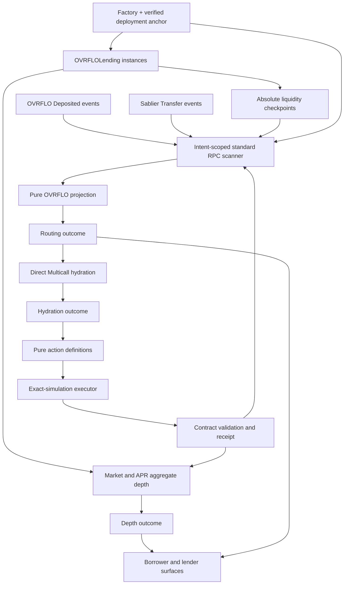
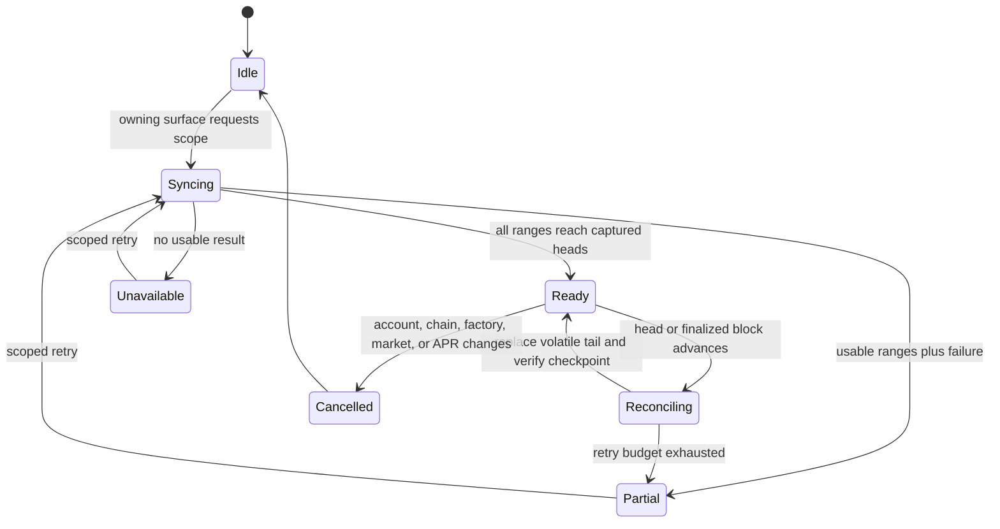
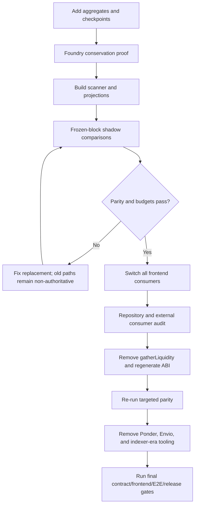

# feat: Replace indexed discovery with on-chain depth and browser event routing

## Goal Capsule

- **Objective:** Replace Ponder, global frontend enumeration, and `gatherLiquidity` with authoritative on-chain liquidity depth, standard-RPC event discovery in the browser, and fresh contract hydration before execution, while carrying forward every still-valid frontend safety requirement from the superseded plans.
- **Implementation authority:** This plan supersedes `docs/plans/2026-07-29-003-frontend-fix-canonical-plan.md` and `docs/plans/2026-07-29-004-fix-frontend-policy-boundaries-plan.md`. The superseded files remain historical reasoning sources, not executable specifications.
- **Execution profile:** Deep cross-layer work across `OVRFLOLending`, deployment artifacts, generated ABIs, browser discovery, borrower and lender reads, action policy, transaction execution, Claim All, local tooling, CI, and release operations.
- **Security authority:** `BASE_SECURITY.md`, `docs/solutions/patterns/ovrflo-critical-patterns.md`, current contract tests, and direct contract state override convenience projections whenever they conflict.
- **Stop conditions:** Stop before cutover if this is not a fresh factory/lending generation with zero pre-checkpoint liquidity, aggregate conservation is unproven, shadow parity disagrees, the configured production RPC cannot serve deployment-to-finalized log history within the release budget, deployment anchors cannot be verified, a known external consumer still requires `gatherLiquidity`, or implementation would make an event projection authoritative for a financial action.
- **Tail ownership:** The implementation owner removes temporary shadow instrumentation and obsolete Ponder/Envio code, runs `forge build` before `forge test`, completes the frontend and local-fork gates, and leaves the prior plans unchanged as historical records.

---

## Product Contract

### Summary

OVRFLO will expose liquidity without a custom backend. Contracts answer how much liquidity exists, canonical events identify candidate positions and loans, and the browser reconstructs only the scopes a user asks to see. Fresh contract reads still decide whether a route or claim can execute.

The valid configuration, read-truth, reviewed-intent, transaction, Claim All, modal, accessibility, static-export, and release requirements from plan `004` remain binding. Its Ponder-specific discovery contract and its exclusion of H-4/H-5 are replaced.

### Problem Frame

The current frontend has three discovery limits:

1. `useLendingLiquidity`, `useLoanBook`, and `useBorrowerLoans` enumerate globally increasing IDs and cap at 500.
2. Borrow routing calls `gatherLiquidity`, which linearly scans all historical positions and becomes more expensive as the protocol grows.
3. Sablier ownership and borrow demand rely on Ponder, creating a separately deployed database, process, configuration, synchronization, CI, and trust surface.

Alchemy can provide the standard Ethereum RPC transport needed to read logs and state, but it does not eliminate the need for a correct client data model. The simplest durable architecture is therefore:

- O(1) on-chain aggregate reads for public depth.
- One absolute checkpoint event for every liquidity-position mutation.
- Browser-side, intent-scoped log reduction for candidate IDs and history.
- Direct hydration for current ownership, balances, availability, eligibility, contribution, and execution readiness.

This duplicates only the liquidity aggregate needed for a capability the original position mapping cannot provide cheaply: immediate bounded depth. It does not duplicate loans, positions, or Sablier state as an authoritative browser database.

### Actors

- A1. **Borrower:** Discovers public depth, waits for a complete route, reviews hydrated position IDs, and borrows against an eligible Sablier stream.
- A2. **Lender:** Sees public depth, their supplied positions, and funded loans without scanning all global IDs.
- A3. **Stream holder:** Discovers currently owned OVRFLO Sablier streams and claims or pledges them after direct Sablier hydration.
- A4. **Frontend implementer:** Changes the contract-facing data plane while preserving OVRFLO-specific policies and existing visual behavior.
- A5. **Release operator:** Configures a capable historical RPC, public-key restrictions, immutable deployment anchors, CSP, and production evidence.
- A6. **Reviewer:** Verifies aggregate conservation, projection completeness, direct-state authority, action intent, accessibility, and release proof.

### Requirements

**Build, deployment, and runtime safety**

- R1. Production configuration must reject a missing, malformed, or zero factory, an unsupported chain, an absent or invalid factory deployment anchor, and deprecated Alchemy `alchemyapi.io` endpoints before producing a deployable bundle.
- R2. The normal build must not modify committed files, and deployment packaging must emit a CSP/header artifact with current hashes, approved production origins, and no localhost origin; production must promote that verified prebuilt artifact without a second framework build.
- R3. Ordinary contract reads use the operator-ordered primary and fallback RPCs, but each discovery synchronization must remain on one capability-verified historical transport from captured finalized/latest heads through all ranges. Claim All may compare two independently completed synchronizations under R47, but neither synchronization mixes chunks across transports. Transport failures may retry or reduce ranges; execution reverts never trigger provider fallback.
- R4. Every signed request must use the configured Ethereum mainnet chain with chain ID 1, and no caller-supplied request field may override that chain at either the type or runtime boundary.
- R5. Static-export-compatible recovery must include route/global error boundaries and explicit client loading states; browser-only discovery must not run during prerender.

**Read truth and discovery completeness**

- R6. Every financial read surface must return an explicit `loading`, `ready`, `partial`, or `unavailable` outcome, with `ready` carrying `fresh` or `stale` freshness and `partial` retaining successful siblings plus failure metadata.
- R7. Only a complete successful read may produce a ready-empty state; failed aggregates, log ranges, records, owners, or financial subcalls must never become zero, an empty collection, or an omitted error.
- R8. Valid on-chain exclusions may be omitted without making a result partial when a slot is unwritten, a candidate is no longer owned, a stream does not belong to an OVRFLO vault, or the contract reports that the entity is not a stream.
- R9. Event discovery must start at a verified deployment anchor, capture exact numeric finalized/latest targets and hashes, query bounded address-and-topic-filtered ranges, adaptively split rejected ranges, validate each log’s address/topic/block number/block hash/transaction index/log index, order and deduplicate deterministically, and report the exact block through which each requested scope is complete. After a multi-range sync it re-reads both boundary hashes; any change discards the attempted sync without advancing the prior checkpoint.
- R10. Event projections may discover IDs, relationships, and history only. Current availability, ownership, eligibility, balances, withdrawable amounts, contributions, claimable amounts, reviewed routes, and action readiness come from block-pinned direct contract reads. A manual/deep-link recovery path accepts known stream, liquidity, loan, or pool IDs and verifies their existence, ownership/contribution, state, and eligibility directly even when projection discovery is unavailable.
- R11. Markets and portfolio consumers must distinguish depth, routing, and hydration outcomes. Successful depth or sibling rows remain visible when another source is partial or unavailable, with an explicit explanation.
- R12. Aggregate actions such as Claim All remain unavailable unless every contributing discovery scope is complete through its captured head and every action-critical hydration is fresh and ready.

**Action policy and reviewed intent**

- R13. Each supported action must have a pure OVRFLO-specific definition that transforms user intent plus an identity-scoped snapshot into preconditions, amount validation, an authorization plan, final-call construction, domain touched-resource tags, and receipt summary data.
- R14. Approval and submit paths must apply the same action-validity preconditions, and negative, malformed, zero, or over-cap amounts must fail before approval planning or ABI encoding.
- R15. Matured claim capacity must use the fresh minimum of wallet balance, `claimablePt`, and `marketTotalDeposited`; both MAX and manual validation must use that capacity.
- R16. A reviewed action must freeze its displayed target, function, arguments, value, approval requirement, route IDs, and minimum or net outcome until confirmation.
- R17. Confirmation must refresh and rebuild the action; expected completion of an accepted authorization may change only its satisfied state, while any new spender, token, amount, route, sequence, final call, or displayed economic outcome must replace the review and require confirmation again.
- R18. Existing OVRFLO rules remain intact, including 0 = unlimited, PT 18-decimal assumptions, cross-market `ovrfloToken` fungibility, zero-first approvals, forward timestamps, no USD presentation, self-match prevention, and strictly increasing liquidity IDs.

**Execution and queue behavior**

- R19. One executor must own connect, account and chain latching, identity-scoped snapshot loading, action rebuild, approval handling, exact final simulation, signature submission, receipt classification, invalidation, critical refresh, terminal UI state, and one in-flight execution per flow identity.
- R20. The executor must submit the exact request returned by the final successful simulation and rebuild and resimulate after any approval, dependency, account, chain, route, calldata, value, or queue-predecessor change.
- R21. A mined receipt is successful only when `receipt.status === "success"`; reverted receipts, rejection, simulation failure, transport failure, stale routes, and post-receipt refresh failure remain distinct.
- R22. A successful receipt followed by failed critical refresh preserves the transaction hash in a recoverable `refresh_failed` state, and retrying refresh never rebroadcasts the transaction.
- R23. Critical refresh is targeted, includes inactive coverage when required, awaits failures through a throwing path, reconciles the touched event scope, and resolves every action-defined resource to fresh ready data for the latched identity before reporting fully refreshed success.
- R24. Claim All remains a sequential orchestration layer over the same executor, rebuilds every unsent row after its predecessor, preserves confirmed rows across pause/resume, and stops when completeness, account, or chain invariants fail.
- R25. Claim All distinguishes confirmed, skipped, needs-review, paused, failed, and partially completed rows; only submitted rows with a successful receipt plus required refresh count as confirmed.

**Presentation, accessibility, and durability**

- R26. The shared flow shell is introduced only after read, policy, and executor boundaries exist, and the modal split preserves current OVRFLO-specific behavior and visual design.
- R27. The live modal preserves its dialog container, visible title and close control, accessible labels and field-error associations, focus entry and containment, Escape handling, inert background, focus restoration, body-only recovery, polite progress announcements, and alert semantics for terminal errors. Discovery announcements occur on meaningful state transitions, never per block or page.
- R28. Semantic test rewrites remove assertions that pin unsafe defaults, capped enumeration, or silent recomputation, and the review/accountability record explains each intentional contract change in the same unit.
- R29. CI runs Foundry contract tests, generated-ABI checks, frontend security lint, typecheck, reducer/scanner tests, frontend unit tests, and the static-export build. Seeded-fork E2E and production CSP/Reown/RPC-capability verification remain documented release gates.
- R30. Production CSP/header delivery, public RPC key restrictions, historical-log capability, performance/CU evidence, and Reown coverage on Ethereum mainnet remain human release gates bound to one commit, one prebuilt artifact, one environment profile, and one deployment URL.

**Liquidity discovery architecture**

- R31. This plan resolves the former H-4/H-5 enumeration residual through bounded aggregate reads, canonical events, intent-scoped browser discovery, and direct hydration; it must not claim completion while a capped global scan remains required.
- R32. `OVRFLOLending` maintains total available liquidity per market and available liquidity per market/APR using a width that cannot overflow when multiple `uint128` positions are summed. Borrow surfaces separately report aggregate depth, executable depth within the measured `MAX_ROUTE_IDS`, and fragmented depth.
- R33. Supply, withdrawal, stream-sale consumption, and each actually consumed loan position update the aggregates and emit exactly one canonical absolute checkpoint containing indexed lender, market, and APR plus liquidity ID, resulting availability, a versioned mutation reason, and a stream/loan reference where applicable. Aggregate and position accounting are centralized with no external call inside the helper; unknown reasons, invalid references, zero identities, or identity changes for an existing ID invalidate the scope.
- R34. `availableLiquidity > 0` remains the sole position activity signal. The aggregate equals the sum of position availability, and checkpoint results equal storage after every transition.
- R35. Current APR bounds control new supply only. Existing positions at previously allowed ticks remain visible, withdrawable, sale-consumable, and loan-routable; the fixed 0-10,000 bps domain remains bounded to 100-bps steps.
- R36. Public depth is the on-chain aggregate. At one captured block, a projection becomes complete only when its public position sum equals the block-pinned market/APR aggregate. Borrower-executable depth is then the liquidity reachable after self-exclusion within `MAX_ROUTE_IDS`; cardinality-minimizing selection uses largest hydrated candidates and sorts the final IDs ascending for submission. Borrow review and MAX never use public or fragmented depth as if it were executable.
- R37. Each browser projection maintains a finalized base and a replaceable volatile tail. Refresh discards and replays the prior volatile tail, advances the base only through verified boundary block hashes, and handles local Anvil as a deployment-anchored volatile history. A provider switch first verifies the stored finalized checkpoint hash; mismatch invalidates the base and forces full resync.
- R38. Discovery is lazy and intent-scoped: the initial markets view reads only per-market aggregate totals; APR-bucket reads and market/APR checkpoint discovery start when a market or Borrow surface opens; lender positions, borrower loans, demand, held streams, and Claim All start only when their owning surface needs them and cancel on identity/scope changes.
- R39. Release fixtures use a versioned, reproducible RPC ledger that records empty/warm cache state, verified anchors, exact finalized/latest blocks and hashes, provider tier/region, event/candidate/aggregate-subcall counts, actual block/log/hydration attempts including retries and splits, encoded request bytes, response bytes, reducer time, wall duration, and a provider-cost estimate. Provider-neutral request/byte/duration ceilings are the pass/fail gate; billed Alchemy CU is corroborating evidence. Fixtures cover initial multi-market depth, typical and fragmented Borrow routes, demand, zero/typical/high-volume streams, a representative cold session, three clean reloads, and warm reconciliation.
- R40. Final cutover leaves one live discovery surface. Ponder, its runtime/configuration/tests, the dead Envio runtime, global ID enumeration, delayed indexer retries, and `gatherLiquidity` are removed after frozen-block parity and consumer-audit gates pass.
- R41. The contract/data-plane cutover targets only a freshly deployed factory/lending generation with zero liquidity predating the checkpoint event. Any live deployment or external pre-checkpoint liquidity triggers a separate migration/coexistence plan instead of inference from incomplete history.
- R42. Sablier origin validation uses a complete direct factory-registry outcome keyed by chain, factory, verified anchor, and schema version. A failed or incomplete vault-set read makes held-stream discovery partial or unavailable; it never excludes a candidate as unrelated.
- R43. The scanner classifies transport failures: rate limits retry the same range with provider timing, explicit range/response-size failures bisect, timeouts retry boundedly before bisection, and decode errors fail without amplification. Initial concurrency is two. One synchronization cycle shares finalized/latest reads across active scopes, compacts finalized state, retains a bounded volatile tail, and stores complete-through heads inside stable scope cache entries rather than cache keys.
- R44. Sablier discovery first builds an origin-proof set from `Deposited` events emitted by the complete verified OVRFLO vault set, intersects it with recipient `Transfer` candidates, and only then performs bounded direct hydration. Origin events are discovery evidence only; `ownerOf` remains ownership authority. Candidate limits produce partial, never false empty, and Claim All requires full completion.
- R45. Production distinguishes 403, 429, quota exhaustion, revoked keys, and historical-capability failures. Preview and production keys are separate; credential incidents use a tested forward-roll key replacement or independently capability-verified emergency provider, restart the whole sync, never mix chunks across transports, and redact full RPC URLs/keys from evidence.
- R46. `MAX_ROUTE_IDS` is a measured contract/frontend constant justified by calldata and gas evidence. If no safe bound passes adversarial fragmentation fixtures, implementation stops for an explicit contract-level minimum-liquidity/economic-floor decision instead of shipping an unbounded route.
- R47. Ordinary discovery assumes an honest-but-fallible historical RPC. Before the UI can offer “Claim all discovered,” two independently capability-verified transports synchronize separately to the same captured block/hash and must produce identical candidate identity sets; chunks are never mixed. Agreement is corroboration against one-provider omission, not proof against shared query/reducer defects or correlated infrastructure. Disagreement or loss of either source disables the batch while individual recovery remains available.
- R48. Current APR bounds constrain new supply/listing policy, not the quote domain for already-existing liquidity. The contract quote path validates the fixed step/ceiling domain without rejecting a previously allowed tick solely because governance later narrowed posting bounds.
- R49. Before U3, U1 pre-registers permanent valid-event churn fixtures and the stop threshold: at fixed 10 gwei gas, pushing any constrained first-client task past its R50 ceiling must cost at least 10 ETH over the fixture horizon. Fixtures include repeated dust supply/withdraw cycles with zero ending availability and high-volume valid OVRFLO-origin streams unrelated to the wallet. Browser persistence alone is not accepted as mitigation for a new client.
- R50. Before U3 implementation, U1 records production-like current/Ponder baselines and pre-registers user-task ceilings: initial market depth ready within 2 seconds, a typical cold Borrow route ready within 5 seconds, first verified portfolio row within 5 seconds, and corroborated “Claim all discovered” planning within 15 seconds at p95 for the named fixture/provider/region/client profile. Changing a ceiling requires an explicit plan/release decision, not a U9 implementation-derived baseline.
- R51. Individual recovery accepts a protocol ID, a deep link, or a transaction hash. Receipt-log decoding extracts candidate stream/liquidity/loan/pool IDs, then the same direct existence, ownership/contribution, state, and eligibility checks decide which individual actions are available.
- R52. Borrow presentation makes borrower-executable depth the primary actionable amount after routing is ready. Public aggregate and fragmented depth remain labeled secondary context; when they differ, the UI states self-exclusion or route-fragmentation as the reason. The market table may show clearly labeled public aggregate depth before borrower-specific routing.
- R53. A connected wallet always has a visible portfolio entry surface before personal discovery runs. Its unloaded state shows unknown values rather than zero and offers one explicit load action; opening it or Claim All starts the owned scopes. Completed results remain session-cached under KTD9 and transition to populated, ready-empty, partial, or unavailable.
- R54. Claim All has a cancellable preflight before transaction review. It reports meaningful source-level progress for markets, streams, live hydration, and independent verification without exposing block ranges; completed safe scopes remain cached, failed scopes can retry, and provider disagreement is distinct from transport unavailability.
- R55. Recovery is reachable from partial/unavailable portfolio states and accepts labeled protocol IDs, deep links, or transaction hashes with examples. It defines loading/cancel plus nonexistent, foreign, ineligible, completed, and actionable outcomes, and states that success restores only the individual action.
- R56. “Claim all discovered” means every candidate found by the complete, corroborated scanner scopes and directly hydrated at the captured block; it is not a cryptographic assertion that no shared scanner defect omitted history. Falsification tests omit the same valid event from both provider inputs and require the batch to remain blocked when same-block or domain-specific conservation can detect it; personal domains without an orthogonal on-chain completeness primitive retain the explicit limitation and recovery path.
- R57. Factory/vault registry enumeration is chunked and complete with the same per-subcall failure semantics as other financial reads. The production fixture names current and stress vault counts and enforces request/byte/duration ceilings; exceeding them makes origin-dependent streams partial/unavailable, never unrelated or empty.
- R58. Every R50 p95 ceiling is bound to a named browser version, cold/warm cache, event volume, network latency/bandwidth, and CPU/memory profile. Pre-U3 and U9 evidence must include one representative constrained mobile-class profile, not only a development machine.
- R59. After cutover, a runtime ceiling breach fails closed: public aggregate depth and direct transaction-hash/ID recovery remain available, affected discovery and batches become unavailable, and telemetry redacts identities while recording the breached ledger dimension. The emergency forward path is a new immutable frontend artifact with a frozen-block, integrity-checked static projection checkpoint for domains it can safely bootstrap plus tail replay; domains lacking a safe checkpoint remain direct-recovery-only. Ordinary rollback is not claimed to repair monotonic history growth.

### Key Flows

- F1. **Public depth and borrow routing**
  - **Trigger:** A1 opens a market and starts Borrow.
  - **Steps:** The table reads total aggregate depth; the borrow flow reads bounded APR buckets, requests checkpoints filtered by indexed market and APR, verifies public-book conservation, ranks projected availability, hydrates bounded candidate chunks, selects the smallest sufficient live set after self-exclusion, sorts selected IDs ascending, quotes, freezes the route, and rebuilds before signing.
  - **Outcome:** Trustworthy public depth appears without waiting for history; Borrow becomes available only when a complete usable route is fresh.
  - **Covered by:** R6-R11, R16-R23, R31-R39, R46, R48, R50, R52

- F2. **Lender liquidity and funded-loan discovery**
  - **Trigger:** A2 expands positions or opens Claim All.
  - **Steps:** Lender-filtered checkpoints discover supplied positions and loan references; active routing state and historical contribution relationships are reduced separately; current position, pool, loan, proceeds, and contribution mappings are hydrated.
  - **Outcome:** Fully consumed positions leave the active book without erasing the lender’s claim relationship.
  - **Covered by:** R6-R12, R23-R25, R33-R38, R47, R53

- F3. **Held-stream discovery**
  - **Trigger:** A3 opens streams or Claim All.
  - **Steps:** Complete verified-vault `Deposited` logs produce the OVRFLO stream-origin set; Sablier `Transfer` logs filtered to the connected recipient produce ownership candidates; their intersection is deduplicated before `ownerOf`, `getStream`, and `withdrawableAmountOf` confirm current state.
  - **Outcome:** Transferred-in streams are discoverable without Ponder, transferred-away or unrelated streams are excluded, and failed hydration never appears as an empty portfolio.
  - **Covered by:** R6-R12, R23-R25, R37-R45, R47, R49-R51, R53, R55

- F4. **Single financial action**
  - **Trigger:** A1-A3 review and confirm an action.
  - **Steps:** A pure definition builds the review, confirmation refreshes and compares it, the executor handles approval and rebuilds, the exact final call is simulated and signed, the receipt is classified, and touched scopes refresh.
  - **Outcome:** The signed request matches accepted intent and reaches a truthful terminal state.
  - **Covered by:** R13-R23

- F5. **Claim All**
  - **Trigger:** A3 requests a complete multi-claim plan.
  - **Steps:** All enabled lending and held-stream scopes synchronize, live state hydrates, the queue executes one row through F4, refreshes, rebuilds the next row, and pauses if completeness or identity changes.
  - **Outcome:** Confirmed work is preserved and unsent work never relies on an incomplete projection or stale call.
  - **Covered by:** R12, R16-R25, R47, R50, R53-R54

- F6. **Deployment and release**
  - **Trigger:** A4/A5 create a local, devnet, preview, or production artifact.
  - **Steps:** Deployment writes verified anchors; CI proves contract/frontend behavior; the release operator verifies historical RPC capability, key restrictions, provider-neutral performance ceilings, corroborating provider-cost/CU evidence, CSP, wallet behavior, and immutable artifact identity.
  - **Outcome:** The static frontend can discover from chain without hidden services or silently incomplete history.
  - **Covered by:** R1-R5, R28-R30, R37-R41, R43, R45, R47, R49-R50

### Acceptance Examples

- AE1. **Covers R6-R8, R11.** Given two successful financial subcalls and one failed subcall, the two successful siblings remain visible and the outcome is partial with failure metadata.
- AE2. **Covers R7, R11.** Given every prerequisite succeeds with no entity, the UI renders a true empty state; an unavailable aggregate, range, or hydration never renders that message.
- AE3. **Covers R9-R12, R37.** Given a middle log range fails after earlier ranges succeed, the projection does not advance its completion checkpoint and routing/Claim All remain unavailable.
- AE4. **Covers R10, R36.** Given a checkpoint says a position is available but direct hydration shows it consumed, the stale candidate is not signed; the flow reconciles and rebuilds or reports routing incomplete.
- AE5. **Covers R14-R15.** Given an amount is zero, negative, malformed, or above fresh matured-claim capacity, approval and submit reject before encoding or wallet interaction.
- AE6. **Covers R16-R17.** Given rebuilt route IDs, target, calldata, approval requirement, or displayed outcome differs from the frozen review, no signature is requested until the changed review is confirmed.
- AE7. **Covers R19-R22.** Given final simulation succeeds but the mined receipt reverts, no success invalidation runs and the UI reports failure.
- AE8. **Covers R22-R23.** Given a receipt succeeds but critical refresh fails, retry performs refresh only and preserves the successful hash.
- AE9. **Covers R24-R25.** Given the first Claim All row confirms and completeness is lost before the second row, the first remains confirmed and the queue pauses before another wallet prompt.
- AE10. **Covers R2, R29-R30.** Given a production build and deploy package, committed inputs remain unchanged, exported routes carry current CSP, and the exact promoted artifact passes RPC, origin, and wallet gates.
- AE11. **Covers R32-R34.** Given supply, partial sale, partial multi-position loan consumption, full consumption, and withdrawal, aggregate deltas equal position deltas and every checkpoint result equals storage.
- AE12. **Covers R33-R34.** Given a loan target is satisfied before trailing backup IDs, checkpoint events are emitted only for actually consumed positions.
- AE13. **Covers R35.** Given governance narrows APR bounds after liquidity was supplied, the old tick remains visible and routable while new supply at that tick is rejected.
- AE14. **Covers R36.** Given one wallet supplied 100 and another supplied 50, public depth is 150, the first wallet’s usable depth is 50, the second’s is 100, and an unrelated borrower’s is 150.
- AE15. **Covers R37.** Given the volatile tail changes after a short reorg or Anvil snapshot/revert, the old tail is discarded and the replacement history reduces without duplicates.
- AE16. **Covers R38-R39, R43.** Given the initial markets table renders, it reads market totals and performs no historical log scan; opening one Borrow flow scans only its indexed market/APR scope, shares its reconciliation heads, and stays within the recorded request/byte/duration budget.
- AE17. **Covers R8-R10.** Given a Sablier NFT transfers to the wallet, away, and back, candidate duplication does not matter; current `ownerOf` and sender determine the final held-stream result.
- AE18. **Covers R40.** Given all parity suites pass, final build and local bootstrap contain no Ponder client/process/configuration and no consumer calls `gatherLiquidity`.
- AE19. **Covers R41.** Given a deployment contains liquidity created before the canonical checkpoint exists, cutover fails with a migration-required result; a fresh generation proves its initial aggregate and projection both start at zero.
- AE20. **Covers R42.** Given the factory deploys another OVRFLO vault after page load or one registry subcall fails, held-stream discovery refreshes the complete vault set or becomes partial; it never silently classifies an unverified sender as unrelated.
- AE21. **Covers R32, R36, R46.** Given 500+ dust positions precede sufficient honest liquidity at one tick, route construction stays bounded, selects the fewest live positions, submits strictly increasing IDs, labels non-executable fragmented depth, and never advertises an unexecutable borrow.
- AE22. **Covers R9, R37.** Given a reorg occurs between log chunks or a replacement provider disagrees on the finalized checkpoint hash, the attempted projection is discarded and projection-dependent actions remain unavailable.
- AE23. **Covers R32-R36.** Given a log is omitted, duplicated, malformed, or reduced against a different block than the aggregate call, same-block conservation fails and routing is partial/unavailable rather than empty or usable.
- AE24. **Covers R44.** Given thousands of unrelated Sablier streams are sent to one wallet alongside a valid transferred OVRFLO stream, origin intersection bounds hydration and preserves the valid stream; any cap hit is explicit partial.
- AE25. **Covers R10, R12.** Given historical logs are unavailable but a user supplies a valid known ID, direct recovery allows only the individually verified action; invalid/foreign IDs fail and projection-dependent Claim All stays disabled.
- AE26. **Covers R12, R47.** Given one successful historical RPC omits a valid contribution or stream while the second returns it, the provider projections disagree, Claim All remains unavailable, and the known individual action can still proceed after direct verification.
- AE27. **Covers R35, R48.** Given governance narrows posting bounds after liquidity was supplied, the old tick remains executable and quoteable through step/ceiling validation while new supply at that tick remains rejected.
- AE28. **Covers R39, R49.** Given repeated supply/withdraw churn leaves zero active depth or many valid origin events never reach the wallet, the cold first-client ledger includes the permanent history cost and fails cutover at the pre-registered attacker-cost/availability threshold.
- AE29. **Covers R39, R50.** Given a production-like fixture run before scanner implementation, current behavior and the four p95 user-task ceilings are recorded; a later implementation cannot redefine its own passing ceiling.
- AE30. **Covers R10, R51.** Given discovery is unavailable and a user supplies a successful protocol transaction hash, receipt decoding finds candidate IDs and only directly verified owned/contributed actions become available.
- AE31. **Covers R32, R36, R52.** Given public depth is 150 but self-exclusion/fragmentation leaves 50 executable, Borrow presents 50 as actionable and explains the remaining 100 as secondary non-executable context.
- AE32. **Covers R38, R53.** Given a connected wallet has not loaded personal history, a visible portfolio entry shows unknown metrics and starts discovery; it never hides the entry or renders zero.
- AE33. **Covers R47, R54.** Given Claim All preflight completes markets but one verifier fails on streams, completed scopes remain cached, Retry targets the failed scope, Cancel remains available, and no batch review is created.
- AE34. **Covers R10, R51, R55.** Given a user enters a transaction hash from a partial portfolio banner, the flow explains receipt decoding and direct verification, distinguishes foreign/completed/actionable candidates, and does not claim portfolio completeness.
- AE35. **Covers R47, R56.** Given both transports return the same incomplete personal history because the shared query omitted a valid event, provider agreement alone never upgrades the guarantee beyond “all discovered,” and any available orthogonal conservation check blocks the batch.
- AE36. **Covers R42, R57.** Given the factory registry exceeds one Multicall chunk or a middle vault read fails, enumeration continues in bounded chunks or returns partial without misclassifying stream origin.
- AE37. **Covers R50, R58.** Given desktop passes but the named constrained mobile-class fixture misses a p95 task ceiling, the release fails rather than redefining the client profile.
- AE38. **Covers R49, R59.** Given history crosses a ceiling after Ponder and `gatherLiquidity` removal, affected scopes fail closed, aggregate depth and direct recovery remain, rollback is not misrepresented as a fix, and the integrity-checked checkpoint forward artifact is exercised only for safely bootstrappable domains.

### Success Criteria

- Public market depth is available through bounded contract reads without reconstructing the order book.
- Borrower routing, lender positions, lender-funded loans, borrower loans, demand, and held streams are discovered without global ID scans or a custom backend.
- Browser projections never authorize an action without direct hydration.
- The aggregate/event conservation invariants pass across unit, fuzz, and invariant coverage.
- All valid action, executor, Claim All, accessibility, static-export, CSP, and release requirements carried from plan `004` pass.
- The production RPC capability and versioned request/byte/duration budgets pass before cutover; provider CU corroborates the ledger.
- Ponder, the dead Envio runtime, `gatherLiquidity`, and their live consumers are absent at completion.

### Scope Boundaries

**In scope**

- `OVRFLOLending` aggregate depth and canonical liquidity checkpoints.
- Factory/lending deployment anchors and generated ABI propagation.
- Browser-standard JSON-RPC scanning, reduction, direct hydration, and status outcomes.
- Borrower, lender, stream, demand, portfolio, and Claim All discovery.
- Every still-valid implementation obligation from plan `004`.
- Shadow parity, Ponder/Envio removal, `gatherLiquidity` removal, local tooling, CI, and release evidence.

**Preserved constraints**

- OVRFLO remains Pendle- and Sablier-specific.
- Existing loan economics, sale/listing behavior, self-match guard, strictly increasing IDs, and `availableLiquidity > 0` activity semantics remain unchanged.
- Static export, App Router server/client boundaries, wagmi, viem, TanStack Query, Reown, typed ABIs, current visual language, and no-USD presentation remain.
- Sablier V2 remains the deployed integration.

**Outside this product’s identity**

- A generic event-sourcing, order-book, DeFi action, or provider framework.
- A custom backend, hosted database, Alchemy Subgraph, or required proprietary Alchemy NFT/Simulation API.
- An on-chain linked list or on-chain route finder.
- Treating a browser projection as executable truth.
- A frontend rewrite or visual redesign.

### Deferred to Follow-Up Work

- IndexedDB or another durable browser cache, only if the release fixture misses R39 and a separate design addresses schema versioning, eviction, multi-tab behavior, privacy, and reorg recovery.
- An optional Alchemy NFT candidate accelerator, only if standard Sablier Transfer-log discovery misses the release budget; direct Sablier hydration remains mandatory.
- Moving seeded-fork E2E into mandatory CI after the environment has dedicated RPC, process, account, and snapshot isolation.
- Unrelated contract/frontend cleanup outside the named units.

### Dependencies

- A production Alchemy PAYG app or another Ethereum RPC provider that passes deployment-to-finalized historical-log capability and the R39 budget. Alchemy Free’s ten-block Ethereum log range is not sufficient.
- Separate preview and production public RPC applications with exact origin policy, Ethereum mainnet restriction, usage caps, and alerts.
- Deployment artifacts that bind chain ID, factory address, factory deployment block/hash, and projection schema/ABI version. Lending deployment blocks are derived and verified from factory `LendingDeployed` events.
- A fresh factory/lending generation with no liquidity predating the aggregate/checkpoint implementation. Existing deployments are not silently backfilled from partial event history.
- Existing single-owner local Anvil and single-worker E2E discipline in `docs/agents/testing.md`.
- Existing uncommitted workspace changes remain intact.

### Superseded-Plan Preservation

| Plan `004` requirements | Disposition in this plan |
|---|---|
| R1-R2 | Retained; deployment anchors are added and Ponder CSP/configuration is removed |
| R3 | Adapted for one-provider historical snapshot consistency and bounded log behavior |
| R4-R8 | Retained |
| R9 | Replaced by R9, R37-R39 standard-RPC discovery |
| R10 | Adapted: event projection replaces Ponder but remains non-authoritative |
| R11-R12 | Retained and split across depth, routing, and hydration |
| R13-R22 | Retained |
| R23 | Adapted to projection reconciliation and direct hydration |
| R24-R28 | Retained |
| R29 | Expanded with Foundry, generated ABI, scanner, reducer, and no-indexer gates |
| R30 | Retained and expanded with RPC capability, public-key policy, and CU evidence |
| R31 | Superseded by R31-R59; H-4/H-5 are now in scope |

| Plan `004` unit | New-plan disposition |
|---|---|
| U1 build/runtime safety | Preserved and adapted in U1 |
| U2 read outcomes | Preserved and adapted in U4 |
| U3 Ponder completeness | Replaced by U2-U4 and removed in U12 |
| U4 pure action definitions | Preserved and adapted in U5 |
| U5 transaction executor | Preserved and adapted in U6 |
| U6 Claim All | Preserved and adapted in U7 |
| U7 shared flow shell | Preserved in U8 |
| U8 verification/release | Preserved and expanded in U9-U12 |

### Sources and Research

- Superseded plans: `docs/plans/2026-07-29-003-frontend-fix-canonical-plan.md`, `docs/plans/2026-07-29-004-fix-frontend-policy-boundaries-plan.md`
- Protocol rules: `CONCEPTS.md`, `BASE_SECURITY.md`, `docs/solutions/patterns/ovrflo-critical-patterns.md`
- Discovery trust: `docs/solutions/security-issues/indexer-is-a-discovery-hint-not-an-authority.md`
- Chain anchoring: `docs/solutions/integration-issues/anchor-indexer-staleness-to-chain-head.md`, `docs/solutions/integration-issues/indexer-window-wall-clock-vs-chain-time.md`
- Frontend architecture: `docs/solutions/architecture-patterns/web-markets-outcome-first-planners-and-tx-queue.md`
- Cache invalidation: `docs/solutions/architecture-patterns/scoped-cache-invalidation-and-its-named-exception.md`
- Alchemy log limits: https://www.alchemy.com/docs/node/stable/stable-api-endpoints/eth-get-logs
- Alchemy key allowlists: https://www.alchemy.com/docs/how-to-add-allowlists-to-your-apps-for-enhanced-security
- Alchemy legacy endpoint shutdown: https://www.alchemy.com/docs/changelog/2025/12/11
- Ethereum JSON-RPC logs and finalized tags: https://ethereum.org/developers/docs/apis/json-rpc/
- viem `getLogs`: https://viem.sh/docs/actions/public/getLogs
- viem `watchEvent`: https://viem.sh/docs/actions/public/watchEvent
- Next.js static export: https://nextjs.org/docs/app/guides/static-exports

---

## Planning Contract

### Key Technical Decisions

- KTD1. **One replacement plan is canonical.** This plan carries valid `004` behavior and replaces its Ponder/H-4/H-5 premises rather than stacking a discovery appendix onto contradictory plans. (session-settled: user-directed — chosen over amending plan `004`: Ponder is foundational throughout both superseded plans)
- KTD2. **Aggregate only what earns duplication.** Store market total and market/APR available depth because the original position mapping cannot answer either with a bounded read; positions and loans remain canonical in their existing mappings. (session-settled: user-approved — chosen over keeping only event-derived depth: borrowers need immediate trustworthy depth without historical replay)
- KTD3. **Use one absolute checkpoint event.** Every availability mutation emits the resulting position amount with indexed lender/market/APR fields and data fields for liquidity ID and reason/reference. Existing semantic receipt events remain unless a deliberate compatibility audit proves them redundant. Position-specific freshness uses direct hydration, so liquidity ID does not consume the third indexed topic. (session-settled: user-approved — chosen over delta-only or operation-specific reconstruction: absolute checkpoints make replay idempotent)
- KTD4. **Do not build an on-chain linked list or route finder.** The browser keeps a position map per market/APR, chooses the largest live positions to minimize route cardinality within `MAX_ROUTE_IDS`, then sorts only the selected IDs ascending for the contract. (session-settled: user-approved — chosen over `gatherLiquidity` and an on-chain linked list: events provide candidates while direct reads and contract validation retain authority)
- KTD5. **Standard JSON-RPC is the data plane.** Use viem `getLogs`, block reads, and Multicall3-compatible hydration; Alchemy is a replaceable capable transport and no Alchemy SDK, Subgraph, NFT API, or proprietary simulation path is required. (session-settled: user-approved — chosen over replacing Ponder with another vendor-specific index: simplicity requires no owned backend)
- KTD6. **Reconcile finalized base plus volatile tail.** Numeric targets and block hashes define completeness. `watchEvent` or block polling may wake reconciliation but never advances projection state independently.
- KTD7. **Load only on user intent.** Initial tables read per-market totals. Routing loads bounded APR buckets and checkpoint logs filtered by indexed market/APR; lender views filter by lender; loans, demand, streams, and Claim All request their own address/topic-filtered scopes only when visible or actionable.
- KTD8. **Hydration remains the authority.** After public-book conservation, the route selector ranks projected candidates by availability, hydrates bounded candidate chunks, excludes self, chooses the smallest sufficient live set plus bounded backups, and sorts only the selected IDs ascending for submission. A fragmented route that exceeds the encoded-byte/candidate budget returns an explicit incomplete/too-fragmented outcome. Projection state never bypasses `_validateLiquidity`.
- KTD9. **Use memory first.** TanStack Query caches projection results by chain, factory anchor, lending address, account/scope, and schema version. The cached value owns its complete-through head/hash; finalized history compacts to current position state plus durable loan references, volatile history stays bounded, and closed/abandoned scopes have explicit `gcTime` disposal. IndexedDB is not implemented unless repeated-release measurements prove it necessary. (session-settled: user-approved — chosen over immediate persistence: durable browser storage adds schema, eviction, privacy, and reorg complexity before need is measured)
- KTD10. **Keep three read outcomes.** `depthOutcome` owns aggregate state, `routingOutcome` owns candidate completeness, and `hydrationOutcome` owns selected live state. Borrow requires all three; display may retain fresh depth when routing is unavailable.
- KTD11. **Preserve OVRFLO-specific pure action definitions.** Build on `web/lib/convert.ts`, `web/lib/borrow.ts`, `web/lib/claim-all.ts`, `web/lib/modal-logic.ts`, `web/lib/positions.ts`, `web/lib/router.ts`, and related math rather than introducing a generic action framework.
- KTD12. **The simulated request is the signing authority.** The executor latches identity, refreshes, rebuilds after approvals, simulates the exact final call, and submits the returned request unchanged.
- KTD13. **Receipt truth and refreshed UI truth remain separate.** A successful receipt is immutable evidence; incomplete critical refresh becomes `refresh_failed` with refresh-only retry.
- KTD14. **Claim All remains orchestration.** It composes the single-action executor, freezes grouped loan-ID sets, preserves confirmed rows, and requires complete discovery and hydration before review and between rows.
- KTD15. **Extract policy before presentation.** Action definitions and the executor land before the shared shell and modal split; Borrow moves last because its discovery surface changes most.
- KTD16. **Cut over once.** Ponder and `gatherLiquidity` coexist only in non-authoritative shadow comparison. Removal follows frozen-block parity, performance, repository consumer, and known external-consumer gates. (session-settled: user-approved — chosen over an immediate irreversible deletion: parity keeps the immutable contract cutover reversible until proven)
- KTD17. **Promote one verified prebuilt artifact.** CSP, RPC origin policy, deployment anchors, performance evidence, and wallet checks bind to the exact Vercel output promoted without a second framework build.
- KTD18. **Fresh generation only.** Immutable deployed markets cannot acquire historical aggregate mutations or checkpoint events. The release gate therefore proves zero pre-checkpoint liquidity on a newly deployed factory/lending generation; any existing-state migration is separate work.
- KTD19. **One synchronizer owns refresh transport.** Action definitions emit typed `TouchedResource` values and the executor requests a `RefreshPlan`; the U3 synchronizer alone owns head snapshots, historical transport, range checkpoints, reorg handling, and completeness. Fully refreshed success requires projection completion through a post-receipt captured head and authoritative hydration at that block or later.
- KTD20. **Resolve OVRFLO vault membership directly.** Reuse the bounded factory registry read behind `useOvrflos` as an explicit complete/partial/unavailable outcome rather than creating another event projection. Held-stream origin filtering waits for that complete registry.
- KTD21. **Conserve at runtime, not only in tests.** A market/APR route is ready only when the complete projected public sum equals the aggregate read at the same captured block; self-exclusion and executable-depth calculation happen afterward.
- KTD22. **Bound route fragmentation.** `MAX_ROUTE_IDS` is shared between policy/tests and backed by measured calldata/gas. Aggregate, executable, and fragmented depth remain distinct; if the bound is not safe, implementation stops for a minimum-liquidity-floor decision.
- KTD23. **Prove stream origin before hydration.** OVRFLO vault `Deposited` events provide the stream-ID origin set, recipient `Transfer` events provide ownership candidates, and live Sablier reads decide current ownership and state.
- KTD24. **Keep individual recovery censorship-resistant.** Known-ID direct hydration can enable one verified position/stream/loan action during discovery failure, but it never upgrades a portfolio projection or aggregate action to complete.
- KTD25. **Credential incidents forward-roll.** An exhausted/revoked public RPC key is not repaired by artifact rollback. Operations rotate to a capability-verified key/provider and restart synchronization without mixing transport snapshots.
- KTD26. **Claim-all discovery uses independent corroboration.** A single RPC can successfully omit personal history for which no aggregate conservation primitive exists. The “Claim all discovered” batch therefore compares two separately synchronized candidate sets at one block/hash; this is a narrow robustness gate, not proof of scanner completeness or a second always-on data plane.
- KTD27. **Quote historical ticks without reopening posting policy.** Split fixed APR domain validation from current posting-bound validation. Quote accepts a step-aligned APR within the immutable ceiling, while new supply and listings continue to enforce current bounds.
- KTD28. **Pre-register valid-history griefing.** Permanent event growth from valid state churn is an availability attack surface. U1 fixes the 10 ETH at 10 gwei first-client threshold before scanner work; persistence never substitutes for a new-client proof.
- KTD29. **Pre-register user-visible speed.** Technical request budgets do not substitute for time-to-task. U1 fixes production-like p95 ceilings before scanner work; U9 measures against them.
- KTD30. **Degrade Claim All to verified individual actions.** Two-provider loss never becomes a best-effort action labeled “all.” Successfully discovered rows may still expose direct, individually verified claims with an explicit incomplete-discovery banner.
- KTD31. **Recover from receipts, not only IDs.** Transaction hashes and deep links are realistic user handles; receipt logs yield candidates, while live state remains authoritative.
- KTD32. **Lead Borrow with executable depth.** Aggregate depth is market context; executable depth is the action promise and therefore owns the primary Borrow hierarchy.
- KTD33. **History failure forward-rolls, it does not roll back.** Runtime budget breaches preserve aggregate reads and direct recovery, disable affected projections, and use an integrity-checked static checkpoint artifact only where that domain can be safely bootstrapped.

### High-Level Technical Design

The authority path is deliberately asymmetric: aggregate storage is authoritative for public depth; logs narrow the search space; live storage authorizes execution.



Projection synchronization has an explicit completeness state machine.



Cutover keeps only one live source at completion.



### Output Structure

The browser discovery code is one OVRFLO-specific module, separated from React and browser lifecycle code.

```text
web/lib/discovery/
├── types.ts
├── log-scanner.ts
├── lending-projection.ts
└── stream-discovery.ts

web/hooks/
├── useLendingProjection.ts
└── useProjectionSync.ts

web/tests/lib/discovery/
├── log-scanner.test.ts
├── lending-projection.test.ts
└── stream-discovery.test.ts
```

### Sequencing and Dependency Strategy

1. In parallel, land fail-closed runtime/verified deployment anchors and add/prove contract aggregates/checkpoints while keeping legacy discovery available.
2. Build the pure scanner/projections only after both tracks complete, then compare them in development/test shadow mode.
3. Prepare read adapters, action inputs, Claim All, and the shared shell against stable depth/routing/hydration contracts.
4. Pass parity/budget gates and switch all live consumers once.
5. Audit and remove `gatherLiquidity`, regenerate the ABI, and re-run targeted parity.
6. Remove Ponder/Envio and indexer-era tooling, then finish CI, release, and accountability work against the final interfaces.

Do not implement action/executor work against old discovery interfaces if that would require a second migration.

### System-Wide Impact

- **Contracts:** Two bounded aggregate getters, one checkpoint event, centralized availability mutation, and eventual removal of one unbounded view.
- **Frontend:** Historical discovery moves from Ponder/global reads into a pure standard-RPC module; direct hydration remains in hooks.
- **Operations:** Ponder and Envio processes disappear. The RPC tier, deployment anchor, public key policy, request/byte/duration ledger, cost estimate, and credential forward-roll become explicit release dependencies.
- **Testing:** Foundry aggregate/event invariants and scanner/reorg tests join the existing frontend gates; local E2E loses indexer startup/wait logic.
- **Users:** Public depth renders sooner. Routing-dependent actions show preparing, partial, unavailable, and retry states without misreporting zero liquidity.

### Risks and Mitigations

| Risk | Mitigation |
|---|---|
| Aggregate drifts from positions | One internal mutation boundary plus unit, fuzz, and invariant conservation proofs |
| A checkpoint is missed in a loan loop | Emit/update only for positions consumed before the existing early break; assert event count and storage after each touched ID |
| Browser replay accepts a reorged event | Finalized base, replaceable volatile tail, block-hash checkpoints, deterministic ordering, duplicate suppression |
| Alchemy Free or a fallback cannot serve history | Capability probe and R39 release ledger; require PAYG or equivalent wide-range provider |
| Public browser key is abused | Separate preview/production apps, exact domain allowlists, mainnet restriction, usage caps/alerts, negative-origin verification |
| Public depth overstates one borrower’s capacity | Label it as public available liquidity; compute usable depth from self-excluded hydrated candidates |
| Dust positions make a route too large | Measure and enforce `MAX_ROUTE_IDS`, minimize candidate cardinality before sorting IDs, expose fragmented depth separately, and stop for a contract economic-floor decision if no safe bound passes |
| A route races after hydration | Rebuild before simulation; contract validation and classified stale-route recovery remain authoritative |
| Full position leaves routing and disappears from lender claims | Reduce active availability separately from durable loan-reference candidates; hydrate contribution mappings |
| Standard Sablier history is too slow | Enforce the stream-scan budget; stop cutover and plan persistence/optional candidate acceleration rather than silently truncating |
| Cold replay cost grows with protocol history | Re-run the representative session ledger every production release and whenever checkpoint or stream-candidate history doubles; warning/stop thresholds trigger the persistence/accelerator follow-up before availability fails |
| Adaptive splitting amplifies throttling | Retry 429/capacity responses on the same range, bisect only range/size failures or boundedly retried timeouts, cap initial concurrency at two, and count all attempts |
| Sablier hydration explodes with candidates | Anchor at the earliest verified OVRFLO vault deployment, deduplicate before bounded hydration, measure zero/typical/high-volume fixtures, and require complete corroborated discovery for the batch even if ordinary stream display paginates under an explicit partial outcome |
| Existing deployments lack checkpoint history | Fresh-generation release gate; stop and author an explicit migration/coexistence plan if any pre-checkpoint state exists |
| Multi-range sync crosses a reorg | Capture and re-read finalized/volatile boundary hashes, validate every log identity, and discard the entire attempted sync on any mismatch |
| A scanner omission hides valid liquidity | Compare the complete projected sum to the block-pinned aggregate before routing becomes ready |
| Unrelated Sablier NFTs spam a wallet | Intersect recipient transfers with verified-vault `Deposited` stream IDs before hydration; cap hits are partial and direct-ID recovery remains available |
| Public RPC quota/key is exhausted | Classify credential failures, use a tested forward-roll key/emergency-provider procedure, restart sync, and redact credentials from evidence |
| One RPC omits personal history successfully | Require independent same-block candidate-set agreement for Claim All; keep ordinary discovery honest-but-fallible and preserve known-ID recovery |
| Valid state churn grows permanent history cheaply | Measure dust supply/withdraw and valid-origin stream churn against first-client budgets and an explicit attacker-cost threshold; stop for an economic floor or architecture revision if it is too cheap |
| Narrowed bounds make old liquidity unquoteable | Separate immutable APR step/ceiling quote validation from current posting-bound validation and test the governance transition |
| Shadow sources disagree at different heads | Freeze local comparison at one block/snapshot and use uncapped fixture truth above legacy frontend caps |
| Old infrastructure survives as a hidden dependency | Dedicated removal unit plus package, env, process, docs, ABI, and repository search gates |

### Performance Fixture Contract

Each committed fixture ledger separates logical queries from physical JSON-RPC attempts and records retries/splits. A successful historical query’s expected range-call floor is `ceil((toBlock - fromBlock + 1) / verifiedProviderRange)`; the gate applies warning at the committed passing baseline plus 15% and stop at plus 25% for physical attempts, bytes, and duration. Provider range capability and cost tables are versioned inputs, not assumptions embedded in routing code. Every timing fixture records browser version, CPU/memory profile, network conditions, cache state, and event volume, including one constrained mobile-class profile.

| Fixture | Required shape and evidence |
|---|---|
| Initial markets | Empty cache; chunked complete factory/market registry at current and stress vault counts plus one total-depth subcall per market; zero historical log calls; record aggregate subcalls and Multicall request/response bytes; p95 ready within 2 seconds |
| Cold Borrow | Exact market/APR, projected/contributing/backup candidate counts, `MAX_ROUTE_IDS`, one shared finalized/latest snapshot, all physical range attempts, bounded hydration chunks, same-block aggregate call, selected IDs, calldata bytes, gas estimate, duration; typical p95 ready within 5 seconds |
| Fragmented Borrow | 500+ dust positions plus sufficient honest positions; route minimizes cardinality, remains within `MAX_ROUTE_IDS`, and reports aggregate/executable/fragmented depth separately |
| Warm reconciliation | Warm cache; one shared finalized and one shared latest read per cycle; at most one successful tail log range per active scope when the tail fits verified provider limits; all retry/split attempts still recorded |
| Demand | One captured head, bounded search for the trailing chain-time cutoff block, one filtered event query, and no per-event block lookup unless timestamps are displayed |
| Streams | Zero, typical, and high candidate volumes including transfer-away/back and unrelated-recipient spam; origin and recipient counts, intersection count, reducer time, hydration chunks/bytes, and complete-versus-partial outcome |
| Representative session | Initial table, one Borrow scope, lender positions, streams, and “Claim all discovered”; record first verified portfolio row p95 within 5 seconds, corroborated batch plan p95 within 15 seconds, one cold run, three clean reloads, projected requests/cost per session and expected daily active user |
| Valid-history churn | Repeated dust supply/withdraw with zero ending availability plus high-volume valid OVRFLO-origin streams unrelated to the wallet; record attacker gas/cost, permanent event growth, and first-client cost |

Claim All has no pagination shortcut: every enabled source must be complete. Ordinary stream display may page hydrated results only while clearly retaining a partial outcome. A fixture miss stops cutover and opens the already-deferred persistence or optional accelerator design; it never raises caps silently.

---

## Implementation Units

| Unit | Title | Primary files | Depends on |
|---|---|---|---|
| U1 | Fail-closed runtime and deployment anchors | `web/lib/config.ts`, deployment scripts, CSP/build scripts | None |
| U2 | Contract depth and checkpoint primitives | `src/OVRFLOLending.sol`, Foundry/fuzz/invariant tests | None |
| U3 | Standard-RPC scanner and projections | `web/lib/discovery/`, generated/hand-maintained ABIs | U1, U2 |
| U4 | Explicit read outcomes and shadow discovery adapters | Discovery hooks and markets/positions consumers | U3 |
| U5 | Pure action definitions | `web/lib/actions/`, existing pure planners | U4 |
| U6 | Single transaction executor | Executor/runtime/invalidation modules | U1, U5 |
| U7 | Claim All composition | Queue, claim planner, Claim All UI | U4, U6 |
| U8 | Shared flow shell and modal split | `web/components/action-flow/`, modal components | U6, U7 |
| U9 | Shadow parity and frontend cutover | Shadow fixtures, frontend consumers, performance ledger | U3, U4, U7, U8 |
| U11 | Contract consumer audit and `gatherLiquidity` removal | Contract, Foundry tests, generated ABI | U9 |
| U12 | Ponder/Envio and local-tooling deletion | Indexer runtime, bootstrap, fixtures, environment, CSP | U9, U11 |
| U10 | Durable verification and release evidence | CI, testing/release docs, review records | U1-U9, U11-U12 |

### U1. Fail-closed runtime and verified deployment anchors

- **Goal:** Preserve plan `004`’s build/runtime safety and add the immutable chain anchors and RPC capability inputs required by browser discovery.
- **Requirements:** R1-R5, R28-R30, R37, R39, R41, R49-R50, R58; AE10, AE28-AE29, AE37
- **Dependencies:** None
- **Files:**
  - `script/seed-local.sh`
  - `script/lib/OVRFLOSeedRunner.sol`
  - `script/OVRFLO.s.sol`
  - `deployments/local.json`
  - `deployments/devnet.json`
  - `tools/scripts/write-env.sh`
  - `web/lib/config.ts`
  - `web/lib/wagmi.ts`
  - `web/hooks/useWriteFlow.ts`
  - `web/hooks/useZeroFirstApprove.ts`
  - `web/app/error.tsx`
  - `web/app/global-error.tsx`
  - `web/scripts/build-csp.mjs`
  - `web/scripts/csp-hash-inline.mjs`
  - `web/scripts/package-vercel-output.mjs`
  - `web/scripts/verify-static-export.mjs`
  - `web/scripts/verify-vercel-output.mjs`
  - `web/vercel.json`
  - `web/public/_headers`
  - `web/package.json`
  - `web/.env.example`
  - `web/tests/lib/config.test.ts`
  - `web/tests/lib/wagmi-config.test.ts`
  - `web/tests/hooks/useWriteFlow.test.tsx`
  - `web/tests/hooks/useZeroFirstApprove.test.tsx`
  - `web/reviews/test-accountability.md`
- **Approach:**
  1. Extend local, devnet, and production deployment output with the factory deployment block/hash and a projection schema/ABI version; derive lending deployment identities from verified factory events.
  2. Bind the release profile and deployment artifacts to a freshly deployed factory/lending generation; defer aggregate/projection zero-state proof to U2 and U9 after those primitives exist.
  3. Make production configuration fail closed on invalid factory, chain, deployment anchor, RPC URL, Reown configuration, or deprecated Alchemy host. Preserve an explicit local-only path that cannot activate in production.
  4. Preserve the mainnet-bound write boundary and operator-ordered read fallbacks from plan `004`.
  5. Separate ordinary fallback transport configuration from the capability-selected historical transport used for one projection synchronization.
  6. Add static-export-compatible error boundaries and keep browser-only discovery out of prerender.
  7. Preserve the accessible borrow-stream label and the verified prebuilt Vercel/CSP packaging contract from plan `004`.
  8. Document that a static-browser RPC key is public; configure current `g.alchemy.com` origins, preview/production separation, allowlists, caps, and alerts as release policy rather than pretending the key is secret.
  9. Classify 403, 429, quota-exhausted, revoked-key, and historical-capability failures; test a forward-roll key replacement or independent emergency provider, restart synchronization on transport change, and redact credentials/full RPC URLs from telemetry and evidence.
  10. Before U3 begins, run the named production-like current/Ponder fixtures and commit the R50 p95 user-task baselines/ceilings with provider tier, region, anchor, event counts, and cache state.
  11. Pre-register the R49 churn horizon, fixed 10 gwei gas assumption, 10 ETH minimum attack cost, and exact stop decision; bind all timings to the desktop and constrained client profiles required by R58.
- **Execution note:** Characterize the existing build and generated deployment artifacts before changing their schema.
- **Patterns to follow:** `docs/solutions/best-practices/fail-the-build-on-missing-security-config.md`; current deployment artifact generation; current modal body recovery
- **Test scenarios:**
  - Production rejects missing, malformed, zero, future, or hash-mismatched deployment anchors.
  - A deployment artifact identifies the fresh generation and rejects a reused or unverified factory anchor before discovery starts.
  - Local seeding records the fork anchor and actual factory/lending deployment blocks and hashes.
  - A caller attempts to override chain ID; the request remains on Ethereum mainnet or fails before wallet interaction.
  - Primary ordinary RPC fails and the secondary succeeds; a contract revert does not replay on a fallback.
  - One discovery sync does not mix heads or ranges across historical transports.
  - A static build does not access `window`, IndexedDB, or start a log scan during prerender.
  - CSP packaging includes current RPC origins, excludes localhost in production, preserves routes, and leaves committed inputs unchanged.
  - An `alchemyapi.io` production endpoint fails validation while a current `g.alchemy.com` endpoint passes.
  - Quota exhaustion cannot be mistaken for empty history; the forward-roll procedure selects a capability-verified transport and starts a new synchronization snapshot.
  - Covers AE29. The four user-task ceilings are fixed before scanner implementation and cannot be derived from U9’s completed behavior.
  - Covers AE28 and AE37. The valid-churn attacker threshold and constrained-client profile are fixed before scanner implementation.
- **Verification:** Deployment artifacts are self-identifying and verifiable, runtime configuration fails closed, chain/RPC behavior is covered, and the same prebuilt artifact contract from plan `004` remains intact.

### U2. Add authoritative liquidity depth and canonical checkpoints

- **Goal:** Make public depth a bounded contract read and every routing mutation reconstructible without changing lending economics.
- **Requirements:** R18, R29, R31-R36, R41, R46, R48; AE11-AE14, AE19, AE21, AE27
- **Dependencies:** None
- **Files:**
  - `src/OVRFLOLending.sol`
  - `test/OVRFLOLending.t.sol`
  - `test/OVRFLOLendingInvariant.t.sol`
  - `test/OVRFLOFuzz.t.sol`
  - `test/OVRFLOAttackScenarios.t.sol`
  - `test/fork/OVRFLOLendingMainnetFork.t.sol`
  - `test/fizz/handlers/OVRFLOLendingHandler.sol`
  - `test/fizz/handlers/LendingScenarios.sol`
  - `test/fizz/Properties.sol`
  - `test/fizz/Snapshots.sol`
- **Approach:**
  1. Add total-per-market and per-market/APR available-liquidity aggregates using a summation-safe width.
  2. Centralize availability mutation so supply, withdrawal, stream sale, and loan consumption cannot update a position without updating both aggregates and emitting the absolute checkpoint; keep all external calls outside this accounting helper.
  3. Preserve the existing semantic receipt events; the checkpoint indexes lender, market, and APR for the two historical query shapes, while liquidity ID remains event data for direct hydration.
  4. Include the loan ID as the checkpoint reference for each consumed position so lender-funded loan candidates are discoverable even after availability reaches zero.
  5. Preserve `_consumeLiquidity`’s early break and emit nothing for untouched backup IDs.
  6. Keep `gatherLiquidity` temporarily for U3/U9 shadow comparison; do not add another index, active flag, per-user storage array, or linked list.
  7. Extend invariant and fuzz handlers so aggregate conservation is checked after mixed supply, sale, loan, withdrawal, APR-bound, and maturity sequences.
  8. Define and measure `MAX_ROUTE_IDS` against worst-case loan calldata and gas. Do not add a minimum supply floor unless the adversarial fixture proves no safe route cap can preserve useful liquidity.
  9. Split APR validation into the immutable step/ceiling domain used by `quote` and the current posting bounds used by supply/listing creation, so existing old-bound positions remain quoteable and executable.
- **Execution note:** Establish failing conservation/event tests before changing mutation paths; after the change, run `forge build` before any test suite.
- **Patterns to follow:** `docs/solutions/patterns/ovrflo-critical-patterns.md` rules 4, 6, 10, 16, and 17; `docs/solutions/best-practices/solidity-hot-path-optimization-patterns.md`
- **Test scenarios:**
  - Covers AE11. Each mutation changes both aggregate levels by exactly the position delta.
  - Covers AE12. A multi-position loan emits once per touched position and never for trailing backup IDs.
  - The final touched position may be partially consumed; checkpoint result, storage, aggregate, and contribution all agree.
  - Same lender contributes through multiple positions and discovers one loan reference without corrupting contribution totals.
  - A full sale or withdrawal produces zero remaining availability and removes only routing activity.
  - Covers AE13. Narrowed APR bounds reject new supply at the old tick but do not change or hide existing depth or route validity.
  - Unknown position IDs retain the existing zero-struct public mapping behavior.
  - Every mutation reason and reference shape decodes; unknown reasons, zero identities, identity changes, aggregate underflow, and inconsistent references fail closed.
  - Forced token pull, Sablier transfer, borrower payout, and treasury payout failures leave position, aggregates, and emitted durable state unchanged.
  - A 500+ dust-position market remains safe under the measured `MAX_ROUTE_IDS` contract boundary.
  - Covers AE27. After bounds narrow, quote and loan creation remain valid for an existing old tick while new supply/listing at that tick fails.
  - Existing escrow, balance movement, self-match, sorted-ID, pool-claim, repayment, and close-loan tests remain green.
- **Verification:** Unit, fuzz, invariant, attack, and fork coverage prove conservation and unchanged economics before any frontend consumes the new state.

### U3. Build the standard-RPC scanner and pure projections

- **Goal:** Replace indexer/global-scan discovery with deterministic, reorg-aware, intent-scoped candidate discovery.
- **Requirements:** R6-R10, R29, R31-R39, R42-R47, R49, R56, R58; AE3-AE4, AE14-AE17, AE20-AE26, AE28, AE35, AE37
- **Dependencies:** U1, U2
- **Files:**
  - `web/lib/discovery/types.ts`
  - `web/lib/discovery/log-scanner.ts`
  - `web/lib/discovery/lending-projection.ts`
  - `web/lib/discovery/stream-discovery.ts`
  - `web/lib/router.ts`
  - `web/lib/demand.ts`
  - `web/lib/query-keys.ts`
  - `web/lib/abis.ts`
  - `web/lib/generated.ts`
  - `web/wagmi.config.ts`
  - `web/hooks/useLendingProjection.ts`
  - `web/hooks/useProjectionSync.ts`
  - `web/scripts/check-banned-patterns.sh`
  - `web/tests/lib/discovery/log-scanner.test.ts`
  - `web/tests/lib/discovery/lending-projection.test.ts`
  - `web/tests/lib/discovery/stream-discovery.test.ts`
  - `web/tests/lib/router.test.ts`
  - `web/tests/lib/demand.test.ts`
  - `web/tests/lib/abis.test.ts`
- **Approach:**
  1. Implement one pure range scanner over a supplied viem public client: capture numeric targets, filter checkpoints by indexed market/APR or lender, cap initial concurrency at two, classify retry-versus-bisect errors per R43, use strict decoding, deterministic order, duplicate suppression, cancellation, and complete-through metadata.
  2. Share one finalized/latest block-and-hash snapshot per synchronization cycle. Re-read both hashes after a complete multi-range attempt and discard the whole attempt on mismatch. Maintain a compacted finalized base and bounded replaceable volatile tail as pure reducer inputs; verify the stored finalized hash before a provider switch and treat block polling or `watchEvent` only as reconciliation triggers.
  3. Reduce absolute liquidity checkpoints into active market/APR positions and durable lender-to-loan candidate relationships. Keep these projections separate so a zero position does not erase claim history, and store complete-through metadata inside a stable scope cache entry rather than keying every block.
  4. Keep U3 pure: rank projected candidates for hydration and pass supplied hydrated fixtures to `web/lib/router.ts`, which minimizes route cardinality, applies self-exclusion only after public-book conservation, and sorts selected IDs ascending. U4 alone performs RPC hydration.
  5. Discover borrower loans and trailing demand from existing `BorrowerLoanPoolCreated` events. Resolve the chain-time cutoff block once per captured head with bounded block search; fetch individual block timestamps only if displayed.
  6. Build verified-vault stream origins from each OVRFLO vault’s `Deposited` events; intersect them with recipient-filtered Sablier `Transfer` candidates before bounded hydration, and leave current owner/stream validation to U4.
  7. Add Sablier `Transfer` to the verified hand-maintained ABI and regenerate OVRFLO ABIs from Foundry artifacts.
  8. Replace the existing blanket “no logs” banned pattern with a guard that permits the centralized discovery module and continues to reject ad hoc component/hook scans.
  9. At the captured block, compare each complete market/APR projection sum to the block-pinned aggregate. Any mismatch is partial/unavailable and blocks routing before self-exclusion.
  10. Define stable cache identity, `gcTime`, scope disposal, and finalized compaction. Record the complete R39 RPC ledger; derive provider cost from it and keep billed CU corroborating only.
  11. Support a second capability-verified transport as an independent full-scope verifier used only by Claim All. Synchronize it separately to the same block/hash and expose candidate-set agreement/disagreement without sharing chunks or cache state.
  12. Falsify corroboration with identical provider inputs that share a missing event or reducer defect; expose agreement as corroborated-discovered, never as orthogonal proof.
- **Patterns to follow:** Pure routing and demand modules; `docs/solutions/security-issues/indexer-is-a-discovery-hint-not-an-authority.md`; viem strict event decoding
- **Test scenarios:**
  - Scanner retries 429 on the same range, bisects explicit range/size failures, bounds timeout retry before bisection, fails decode errors without amplification, handles a failed middle range, and cancels cleanly.
  - Out-of-order range completion reduces in canonical block/transaction/log order.
  - Duplicate delivery and overlap replay are idempotent; malformed matching logs return failure metadata.
  - Covers AE15. Replacing a volatile tail removes the old history and applies the alternative history.
  - Covers AE22. A reorg between chunks or divergent finalized hash after transport change discards the attempt and blocks dependent actions.
  - A checkpoint overwrites active availability while loan references remain discoverable after zero.
  - Covers AE14. Routing excludes self and calculates borrower-usable depth independently of public depth.
  - Covers AE17. Transfer-to, transfer-away, and transfer-back candidates deduplicate before direct hydration.
  - Covers AE23. Omitted, duplicate, malformed, and block-misaligned checkpoint fixtures cannot pass same-block conservation.
  - Covers AE24. Thousands of unrelated recipient transfers are rejected by the OVRFLO origin intersection without hiding a valid transferred stream.
  - Covers AE21. With supplied hydrated fixtures, dust fragmentation minimizes cardinality, stays within route/calldata bounds, and exposes non-executable depth explicitly.
  - Covers AE26. A successful omission by one provider disagrees with the independent Claim All projection and cannot become complete.
  - Covers AE28. Permanent valid-event churn is measured against first-client replay rather than hidden by a warm cache.
  - Covers AE35. Identical incomplete provider inputs do not create a stronger completeness claim than the scanner can support.
  - Chain-time demand on a lagging local fork matches the trailing window and never uses wall clock.
  - Reconciliation shares one finalized/latest snapshot across active scopes and warm refresh updates an existing cache entry without creating a key per block.
  - Covers AE16. Initial market render requests no logs; a borrow scope stays within its filters and recorded budget.
- **Verification:** Pure tests prove scanner/reducer semantics without React, generated and hand-maintained ABI assertions pass, and performance instrumentation exposes every R39 measurement.

### U4. Introduce explicit read outcomes and shadow discovery adapters

- **Goal:** Preserve plan `004`’s honest read contract, build the replacement hook/consumer adapters, and wire them non-authoritatively for shadow proof without flipping live consumers before U9.
- **Requirements:** R6-R12, R23-R25, R28, R31, R35-R39, R42, R44, R46, R51-R57; AE1-AE4, AE9, AE13-AE17, AE20-AE25, AE30-AE36
- **Dependencies:** U3
- **Files:**
  - `web/lib/read-outcome.ts`
  - `web/hooks/useOvrflos.ts`
  - `web/hooks/useAllMarkets.ts`
  - `web/hooks/useLending.ts`
  - `web/hooks/useLendingLiquidity.ts`
  - `web/hooks/useLoanBook.ts`
  - `web/hooks/useHeldStreams.ts`
  - `web/hooks/useBorrowerLoans.ts`
  - `web/hooks/useBorrowDemand.ts`
  - `web/hooks/useIndexerSync.ts`
  - `web/components/MarketsApp.tsx`
  - `web/components/MarketsTable.tsx`
  - `web/components/MarketRowDetail.tsx`
  - `web/components/PositionList.tsx`
  - `web/components/PositionSummary.tsx`
  - `web/components/ClaimAllModal.tsx`
  - `web/tests/hooks/useOvrflos.test.ts`
  - `web/tests/hooks/useAllMarkets.test.ts`
  - `web/tests/hooks/useLending.test.ts`
  - `web/tests/hooks/useLendingLiquidity.test.ts`
  - `web/tests/hooks/useLoanBook.test.tsx`
  - `web/tests/hooks/useHeldStreams.test.tsx`
  - `web/tests/hooks/useBorrowerLoans.test.tsx`
  - `web/tests/hooks/useBorrowDemand.test.tsx`
  - `web/tests/components/markets-table.test.tsx`
  - `web/tests/components/position-cards.test.tsx`
  - `web/tests/components/position-summary.test.tsx`
  - `web/tests/components/claim-all-modal.test.tsx`
  - `web/reviews/test-accountability.md`
- **Approach:**
  1. Preserve the shared loading/ready/partial/unavailable/fresh/stale vocabulary and structured failure metadata from plan `004`.
  2. Expose separate depth, routing, and hydration outcomes instead of one boolean loading/error surface.
  3. Make the markets table read only one aggregate total per market. Load APR buckets only when a market or Borrow surface opens, request only the fixed 0-10,000 bps domain at 100-bps steps (maximum 101 subcalls), and start personal sources only when positions, streams, or Claim All owns the intent.
  4. Make U4 the sole RPC-hydration owner: use projected candidate IDs with bounded Multicall3 chunks, per-subcall outcomes, block-pinned freshness, cancellation, and explicit route-too-fragmented/incomplete results; feed hydrated values into U3’s pure selector.
  5. Reuse the direct factory registry read as a chunked complete/partial/unavailable OVRFLO vault-set outcome with current/stress-count budgets and per-subcall failures. Intersect origin-proven and recipient-transfer stream candidates, then hydrate Sablier `ownerOf`, `getStream`, and `withdrawableAmountOf`.
  6. Preserve source-isolated display: fresh public depth survives routing failure, and one personal-source failure does not hide successful siblings.
  7. Add user states such as “Liquidity available — preparing routes,” “Liquidity visible — routing temporarily unavailable,” and true no-liquidity only after a complete zero aggregate. Once routing is ready, make executable depth primary and label public/fragmented depth as secondary with the reason for any difference.
  8. Require Claim All to synchronize every enabled lending and held-stream source, while single known-position recovery actions may proceed from direct hydration.
  9. Cancel and discard late results when account, chain, factory, market, APR, or owning modal changes.
  10. Add recovery by manual ID, deep link, or transaction hash for liquidity positions, streams, loans, and pools. Decode receipt logs into candidates, then verify identity, ownership/contribution, live state, and action eligibility directly; never use recovery to mark portfolio discovery or Claim All complete.
  11. Define a visible connected-wallet portfolio entry before personal discovery. Show unknown metrics and a load action, retain completed scope results for the session, and expose recovery from partial/unavailable states with labeled inputs, examples, cancellation, and explicit verification outcomes.
  12. Characterize current live consumers and wire replacement outcomes behind shadow/test adapters. Do not make the replacement authoritative or remove global enumeration until U9’s parity and budget gates pass.
- **Execution note:** Add characterization coverage for existing consumer copy and successful-sibling rendering before replacing hook shapes.
- **Patterns to follow:** `docs/solutions/architecture-patterns/wagmi-read-batching-requires-matching-enabled-predicates.md`; source isolation in `web/components/PositionList.tsx`
- **Test scenarios:**
  - Covers AE1. One hydration call fails while siblings succeed; successful rows remain under partial state.
  - Covers AE2. Complete zero and unavailable render different states and copy.
  - Fresh aggregate depth remains visible while routing is loading, partial, stale, or unavailable.
  - Borrow is disabled with an associated explanation until depth, routing, and selected hydration are ready.
  - Covers AE4. A consumed candidate triggers tail reconciliation and reroute; changed IDs require renewed review.
  - One wallet’s own positions are excluded only from its borrower-usable depth.
  - A fully consumed position leaves active routing but remains in lender-funded loan discovery.
  - Failed `withdrawableAmountOf`, `ownerOf`, contribution, or pool reads never become zero.
  - Claim All waits for every enabled market and held-stream source, including sources finishing at different times.
  - A signer/market change cancels the old scope and late results cannot populate the new identity.
  - Covers AE20. Vault deployment after load refreshes the complete registry; a failed registry subcall prevents origin exclusion.
  - Covers AE25. Empty/incomplete provider logs do not censor a directly verified known-ID action, while invalid and foreign IDs remain unavailable.
  - Covers AE30. A transaction hash yields candidate IDs but only live owned/contributed actions pass.
  - Covers AE31. Borrow hierarchy shows executable depth first and explains non-executable public/fragmented depth.
  - Covers AE32. Before load, the portfolio entry is visible with unknown rather than zero metrics and becomes populated/empty/partial/unavailable after intent starts discovery.
  - Covers AE34. Recovery is discoverable and distinguishes nonexistent, foreign, ineligible, completed, and actionable receipt/ID candidates.
  - Covers AE36. Multi-chunk registry enumeration and middle-chunk failure preserve explicit completeness without false origin exclusions.
- **Verification:** Every replacement hook/consumer adapter exposes explicit outcomes in shadow tests, U4 owns all live hydration mechanics, legacy live behavior remains authoritative until U9, and no unknown financial value becomes zero or ready-empty.

### U5. Move action validity and call construction into pure definitions

- **Goal:** Preserve plan `004`’s action-policy boundary and adapt Borrow to complete projected candidates plus fresh selected-position hydration.
- **Requirements:** R13-R18, R28, R36; AE4-AE6
- **Dependencies:** U4
- **Files:**
  - `web/lib/actions/types.ts`
  - `web/lib/actions/registry.ts`
  - `web/lib/actions/supply.ts`
  - `web/lib/actions/claim.ts`
  - `web/lib/actions/convert.ts`
  - `web/lib/actions/borrow.ts`
  - `web/lib/actions/repay.ts`
  - `web/lib/actions/positions.ts`
  - `web/lib/convert.ts`
  - `web/lib/borrow.ts`
  - `web/lib/claim-all.ts`
  - `web/lib/modal-logic.ts`
  - `web/lib/positions.ts`
  - `web/lib/router.ts`
  - `web/lib/lending-math.ts`
  - `web/components/ActionModal.tsx`
  - `web/tests/lib/actions.test.ts`
  - `web/tests/lib/borrow.test.ts`
  - `web/tests/lib/router.test.ts`
  - `web/tests/components/ActionModal.test.tsx`
  - `web/reviews/test-accountability.md`
- **Approach:**
  1. Carry forward the OVRFLO action-definition contract, exhaustive action registry, amount validation, claim capacity, authorization comparison, and compatibility matrix from plan `004`.
  2. Make Borrow accept a complete routing outcome and fresh selected-position snapshot rather than calling `gatherLiquidity`.
  3. Freeze sorted liquidity IDs, hydrated amounts, selected APR, borrow amount, approval plan, and economic review.
  4. If rehydration changes candidates but still covers the target, rebuild and require renewed confirmation when route or economics change; if it no longer covers, reconcile once and report incomplete rather than zero.
  5. Preserve all existing OVRFLO rules and keep React, wallet hooks, TanStack, and query keys outside pure definitions.
- **Execution note:** Implement definitions action by action with pure tests before deleting the corresponding modal policy branch.
- **Patterns to follow:** Existing pure modules listed in KTD11; OVRFLO rules in `CONCEPTS.md`
- **Test scenarios:**
  - Covers AE5. Invalid amounts fail before approval planning or ABI encoding.
  - Covers AE6. Any material route, call, authorization, or economic change replaces the review.
  - An allowance becoming satisfied without changing the final action does not require a new review.
  - Matured claim MAX uses the fresh minimum required by R15.
  - Borrow IDs are unique, strictly increasing, self-excluded, and sufficient under hydrated amounts.
  - A stale candidate is replaced when possible and never silently treated as available.
  - All twelve existing action types resolve exactly once and preserve their current business rules.
- **Verification:** Pure tests cover every action definition and Borrow has no dependency on Ponder, global enumeration, or `gatherLiquidity`.

### U6. Introduce the single-action transaction executor

- **Goal:** Preserve plan `004`’s exact-simulation executor and extend critical refresh to projection reconciliation plus direct hydration.
- **Requirements:** R3-R4, R16-R23, R28; AE4, AE6-AE8
- **Dependencies:** U1, U5
- **Files:**
  - `web/hooks/useTransactionExecutor.ts`
  - `web/lib/action-runtime.ts`
  - `web/lib/query-resource-registry.ts`
  - `web/hooks/useWriteFlow.ts`
  - `web/hooks/useApprovalWriteFlows.ts`
  - `web/hooks/useZeroFirstApprove.ts`
  - `web/lib/invalidate.ts`
  - `web/lib/actions/types.ts`
  - `web/components/ActionModal.tsx`
  - `web/tests/hooks/useTransactionExecutor.test.tsx`
  - `web/tests/lib/action-runtime.test.ts`
  - `web/tests/lib/query-resource-registry.test.ts`
  - `web/tests/hooks/useWriteFlow.test.tsx`
  - `web/tests/hooks/useApprovalWriteFlows.test.tsx`
  - `web/tests/hooks/useZeroFirstApprove.test.tsx`
  - `web/tests/lib/invalidate.test.ts`
  - `web/tests/components/ActionModal.test.tsx`
  - `web/reviews/test-accountability.md`
- **Approach:**
  1. Carry forward the runtime adapter, resource registry, identity latch, approval rebuild, exact final simulation, receipt classification, refresh-only retry, and in-flight identity contract from plan `004`.
  2. Map typed `TouchedResource` values to a `RefreshPlan`; U3’s synchronizer alone performs targeted event reconciliation, and hooks perform the plan’s direct refetches without duplicating scanner logic.
  3. Remove delayed Ponder convergence from critical and noncritical refresh; successful writes trigger immediate scoped reconciliation.
  4. Preserve successful receipt evidence when the replacement projection or hydration is not ready and fresh.
  5. Keep one discovery transport snapshot per reconciliation and never reinterpret an execution revert as provider availability failure. Fully refreshed success requires completion through a post-receipt captured head plus direct hydration pinned at that block or later.
- **Patterns to follow:** Viem simulate-then-write; `docs/solutions/architecture-patterns/scoped-cache-invalidation-and-its-named-exception.md`
- **Test scenarios:**
  - The exact simulated request is submitted unchanged and simulation failure produces no wallet prompt.
  - Account, chain, route, or approval changes stop continuation until rebuild.
  - Covers AE7. A mined revert is failure and does not run success invalidation.
  - Covers AE8. Receipt success plus refresh failure preserves the hash and refresh retry never writes.
  - Touched event scopes reconcile and selected live state hydrates before fully refreshed success.
  - Third-party liquidity changes are observed through active-scope head reconciliation without polling every historical scope.
  - Duplicate confirmation, rerender, and modal reopen cannot create a second prompt for one flow identity.
- **Verification:** Every single action uses one executor, exact simulation remains the signing authority, and projection refresh cannot rebroadcast a transaction.

### U7. Compose Claim All through the executor

- **Goal:** Preserve sequential queue safety while requiring complete event discovery and direct hydration across every contributing source.
- **Requirements:** R12, R16-R25, R28, R38, R47, R53-R54; AE3-AE4, AE6, AE8-AE9, AE26, AE32-AE33
- **Dependencies:** U4, U6
- **Files:**
  - `web/hooks/useTxQueue.ts`
  - `web/lib/claim-all.ts`
  - `web/lib/actions/claim.ts`
  - `web/components/ClaimAllModal.tsx`
  - `web/components/PositionSummary.tsx`
  - `web/tests/hooks/useTxQueue.test.tsx`
  - `web/tests/lib/claim-all.test.ts`
  - `web/tests/components/claim-all-modal.test.tsx`
  - `web/reviews/test-accountability.md`
- **Approach:**
  1. Carry forward queue ownership refs, sequential receipts, pause/resume, confirmed rows, timer cleanup, grouped pool-share rows, and completion taxonomy from plan `004`.
  2. Build Claim All only after every enabled lending scope and held-stream scope is complete and current state is hydrated.
  3. Require the primary and independent verifier projections to agree on sorted candidate identity sets at the same captured block/hash before building the aggregate queue.
  4. Route each row through U6; after success and critical refresh, rebuild the next unsent row.
  5. Freeze each grouped row’s sorted loan IDs. Changed constituents require new review, complete disappearance becomes skipped, and prior confirmed rows remain immutable.
  6. Loss of provider agreement, discovery completeness, hydration freshness, account, or chain pauses before the next wallet prompt.
  7. If independent verification is unavailable, preserve successfully discovered rows as explicitly incomplete and allow only their individually verified actions; never label or execute the batch as Claim All.
  8. Add a preflight phase before review with source-level markets/streams/hydration/verifier progress, Close/Cancel, failed-scope Retry, safe session-cache reuse, and explicit transitions into review, paused, resume, needs-review, or partial completion.
- **Execution note:** Preserve existing queue race tests before changing the queue’s data and execution delegates.
- **Patterns to follow:** Current ref-backed protections in `web/hooks/useTxQueue.ts`; KTD14
- **Test scenarios:**
  - Covers AE9. Completeness disappears between rows; confirmed rows remain and no new prompt appears.
  - A grouped contribution remains discoverable after its source position availability reaches zero.
  - Changed or disappeared constituents produce needs-review or skipped exactly as plan `004` specified.
  - Permissionless loan close or stream transfer between rows is observed on rebuild.
  - Covers AE8. Refresh failure after receipt success resumes through refresh only.
  - Resume after provider recovery does not repeat confirmed work.
  - Single-source known recovery remains available without falsely enabling Claim All.
  - One provider omits a valid contribution while returning successful ranges; candidate-set disagreement disables Claim All.
  - Loss of the independent verifier retains clearly incomplete discovered rows and direct claim buttons without exposing a batch action.
  - Covers AE33. Cancel and failed-scope Retry preserve safe completed preflight work without producing a wallet prompt.
- **Verification:** Claim All has no independent signing or discovery implementation and cannot overstate completion.

### U8. Add the shared flow shell and split the modal incrementally

- **Goal:** Preserve plan `004`’s modal decomposition, behavior, visual identity, recovery, and accessibility after policy/execution/discovery ownership has moved out.
- **Requirements:** R11, R26-R28, R38, R52-R55; KTD10, KTD15
- **Dependencies:** U6, U7
- **Files:**
  - `web/components/action-flow/ActionFlowShell.tsx`
  - `web/components/action-flow/SupplyFlow.tsx`
  - `web/components/action-flow/ConvertFlow.tsx`
  - `web/components/action-flow/ClaimFlow.tsx`
  - `web/components/action-flow/RepayFlow.tsx`
  - `web/components/action-flow/PositionFlow.tsx`
  - `web/components/action-flow/BorrowFlow.tsx`
  - `web/components/ActionModal.tsx`
  - `web/components/MarketDetail.tsx`
  - `web/components/ModalErrorBoundary.tsx`
  - `web/tests/components/ActionModal.test.tsx`
  - `web/tests/components/market-detail-error-boundary.test.tsx`
  - `web/tests/components/modal-error-boundary.test.tsx`
  - `web/reviews/test-accountability.md`
- **Approach:**
  1. Carry forward the shared review/progress/terminal/recovery shell and incremental extraction order from plan `004`, with Borrow last.
  2. Preserve `MarketDetail` as the real dialog and the body-only error boundary so title and close remain usable.
  3. Present depth, routing, hydration, retry, and disabled-action explanations without coupling the shell to scanner implementation.
  4. Announce projection state only when it meaningfully changes; do not announce individual ranges, blocks, or retries.
  5. Preserve the all-actions live-container matrix, focus contract, labels, and current visual language.
  6. Validate Borrow’s completed states—self-excluded, insufficient-for-amount, fragmented-at-route-cap, and true zero—with executable depth primary, public depth retained, and distinct disabled-action explanations.
  7. Render portfolio unload/recovery and Claim All preflight inside the existing dialog/accessibility contract, including narrow layouts and polite milestone announcements.
- **Patterns to follow:** Existing shared presentation fragments; dialog/focus behavior in `web/components/MarketDetail.tsx`
- **Test scenarios:**
  - Every action opens in the live modal and reaches its expected review state.
  - Borrow explains preparing, partial, unavailable, stale-route, and retry states to sighted and screen-reader users.
  - No per-range announcement floods the polite live region.
  - Initial focus, Tab containment, Escape, inert background, focus restoration, title labeling, and field associations remain correct.
  - A body render error leaves the header and close control usable.
  - Extracted flows retain previous amounts, summaries, limits, and action-specific behavior.
  - Sighted and screen-reader coverage distinguishes every completed-but-unusable Borrow state.
  - Narrow layouts retain readable portfolio recovery and Claim All preflight controls without hiding Close/Cancel.
- **Verification:** `ActionModal.tsx` becomes composition, discovery implementation stays outside presentation, and live accessibility coverage remains complete.

### U9. Prove parity and cut over frontend consumers

- **Goal:** Prove the replacement at frozen blocks and switch every live frontend consumer while the legacy surfaces remain available only as removable test instrumentation.
- **Requirements:** R28-R31, R39-R59; AE3, AE11-AE38; KTD16, KTD18, KTD21-KTD33
- **Dependencies:** U3, U4, U7, U8
- **Files:**
  - `script/local-stress-test.sh`
  - `tools/scripts/walkthrough-local.sh`
  - `web/components/ActionModal.tsx`
  - `web/tests/e2e/fixtures/chain.ts`
  - `web/tests/components/borrow-form.test.tsx`
- **Approach:**
  1. Compare at frozen local blocks: aggregate storage versus uncapped position truth; event projection versus storage; selected IDs/order versus legacy `gatherLiquidity`; stream/demand candidates versus temporary Ponder output.
  2. Treat shadow output as test instrumentation only. Above legacy frontend caps, direct contract/event fixtures are the oracle.
  3. Prove same-block aggregate/projection conservation and measured `MAX_ROUTE_IDS` against high-volume and 500+ dust-position fixtures.
  4. Record the full R39 ledger for initial tables, typical and fragmented Borrow, demand, stream volumes, permanent valid-event churn, registry stress, a representative cold session, three clean reloads, and warm refresh on both named client profiles. Compare against U1’s pre-registered warning, stop, and attacker-cost thresholds; do not define them here.
  5. Switch every frontend, fixture, stress, and walkthrough consumer to aggregates plus projection plus hydration while retaining legacy paths only in isolated parity tests.
  6. Record the fresh-generation, direct-ID recovery, two-provider Claim All agreement, transport-forward-roll, old-tick quote, and complete-vault-registry evidence.
- **Execution note:** Frontend cutover is reversible until U11/U12. Do not delete legacy contract or process surfaces in this unit.
- **Patterns to follow:** `docs/solutions/developer-experience/post-refactor-dead-code-WebUI-20260421.md`; `docs/agents/testing.md`
- **Test scenarios:**
  - Frozen-block projection positions, aggregate sums, and selected IDs match uncapped contract truth.
  - Frozen chain-time demand and held streams match the temporary Ponder candidates after direct hydration.
  - More than 500 positions/loans remain discoverable without using the old frontend as parity oracle.
  - The adversarial dust and unrelated-stream-spam fixtures remain bounded and never advertise unavailable actions.
  - Anvil snapshot/revert or a reorg between chunks produces no stale ready projection.
  - Every live frontend consumer uses the final outcomes; legacy surfaces are reachable only by parity instrumentation.
  - One provider’s successful personal-history omission blocks Claim All; valid history churn remains below the recorded first-client stop threshold.
- **Verification:** Frozen-block parity, runtime conservation, performance, fresh-generation, recovery, and frontend-consumer gates pass before irreversible deletion.

### U11. Audit consumers and remove `gatherLiquidity`

- **Goal:** Remove the unbounded contract view only after frontend and known external consumers no longer depend on it, then re-prove the final ABI.
- **Requirements:** R29-R31, R40-R41, R46; AE11-AE14, AE18-AE19, AE21
- **Dependencies:** U9
- **Files:**
  - `src/OVRFLOLending.sol`
  - `test/OVRFLOLending.t.sol`
  - `test/OVRFLOLendingInvariant.t.sol`
  - `test/fizz/handlers/OVRFLOLendingHandler.sol`
  - `test/fizz/Properties.sol`
  - `web/lib/generated.ts`
  - `web/tests/lib/abis.test.ts`
- **Approach:**
  1. Audit repository callers, scripts, generated clients, docs, and known external consumers; stop if any non-shadow consumer still requires `gatherLiquidity`.
  2. Remove `gatherLiquidity` and its dedicated handlers/tests, regenerate the frontend ABI, and update ABI assertions.
  3. Re-run targeted aggregate/event/runtime-parity and `MAX_ROUTE_IDS` tests against the final contract ABI.
  4. Search for function selectors, ABI fragments, and string-based calls so removal is semantic rather than name-only.
- **Execution note:** Run `forge build` before `forge test` after the removal.
- **Test scenarios:**
  - No repository or known external consumer requires the removed function.
  - Final ABI/type generation contains aggregate/checkpoint primitives and no `gatherLiquidity`.
  - Targeted parity and adversarial route fixtures still pass after ABI regeneration.
- **Verification:** The final contract and generated client expose no unbounded route finder, with all discovery consumers already on the bounded architecture.

### U12. Delete Ponder/Envio and indexer-era tooling

- **Goal:** Remove the custom-backend runtime and every hidden local, CI, environment, CSP, fixture, or documentation dependency after contract and frontend cutover.
- **Requirements:** R1-R3, R28-R30, R40, R45; AE10, AE18
- **Dependencies:** U9, U11
- **Files:**
  - `web/package.json`
  - `web/lib/ponder.ts`
  - `web/hooks/useIndexerSync.ts`
  - `tools/ponder/`
  - `tools/envio/`
  - `tools/scripts/bootstrap-local.sh`
  - `tools/scripts/bootstrap-e2e.sh`
  - `tools/scripts/bootstrap-clean.sh`
  - `tools/scripts/bootstrap-devnet.sh`
  - `tools/scripts/write-env.sh`
  - `web/scripts/build-csp.mjs`
  - `web/.env.example`
  - `web/tests/lib/ponder.test.ts`
  - `web/tests/indexer/scope-guard.test.ts`
- **Approach:**
  1. Remove `@ponder/client`, Ponder hooks/config/env/CSP/scripts/tests/process management, and `tools/ponder/`.
  2. Move the verified Sablier ABI fixture out of `tools/envio/`, update its tests, and remove the unused Envio runtime/configuration tree.
  3. Replace indexer readiness waits with app-observable projection completion and direct RPC anchor checks while preserving owned-Anvil/single-worker rules.
  4. Remove temporary parity instrumentation only after a final comparison against the post-U11 ABI.
  5. Search packages, lockfiles, environment templates, CSP origins, process controls, docs, and generated output for hidden dependencies.
- **Test scenarios:**
  - Clean local bootstrap starts Anvil and the frontend without any Ponder/Envio process, PID, cache, URL, or readiness wait.
  - Seeded E2E discovers new liquidity, transferred streams, third-party fills, permissionless close, and Claim All candidates from standard RPC.
  - Final searches find no live Ponder/Envio runtime, environment, package, process-control, or CSP dependency.
- **Verification:** One browser/chain discovery path remains and local/production operation requires no custom backend.

### U10. Make verification and release evidence durable

- **Goal:** Preserve and expand plan `004`’s CI, accountability, immutable promotion, rollback, and release evidence for the final no-backend architecture.
- **Requirements:** R28-R30, R39-R59; AE10, AE16, AE18-AE38; KTD17-KTD33
- **Dependencies:** U1-U9, U11-U12
- **Files:**
  - `.github/workflows/web.yml`
  - `web/package.json`
  - `docs/agents/testing.md`
  - `docs/agents/frontend-release.md`
  - `web/tests/e2e/README.md`
  - `web/reviews/test-accountability.md`
  - `web/reviews/issues-and-fixes.md`
  - `web/reviews/next-best-practices-audit.md`
  - `docs/frontend-decision-map.md`
  - `docs/frontend-architecture-review-2026-07-29.md`
  - `README.md`
  - `CONCEPTS.md`
- **Approach:**
  1. Add CI gates for Foundry build/tests, ABI generation/assertions, frontend security lint, typecheck, unit tests, and static export; remove Ponder gates.
  2. Preserve build-cleanliness, semantic-test accountability, owned seeded-fork instructions, immutable prebuilt promotion, rollback, and release ownership from plan `004`.
  3. Add release evidence for fresh-generation and deployment-anchor verification, finalized-tag advancement, both Claim All transports, historical range capability, the versioned R39 ledger, same-block conservation, route fragmentation, valid-history churn, origin filtering, Alchemy/public-provider origin restrictions, caps/alerts, and negative-origin behavior.
  4. Record GO only for the same commit/artifact/environment/URL that passed contract, frontend, CSP, RPC, and wallet gates.
  5. Update current architecture/vocabulary documents to name aggregate depth, event discovery, and direct hydration. Preserve historical solution documents as history rather than rewriting their original incident context.
  6. Record the previous known-good deployment and verify rollback by re-promoting that immutable artifact and rerunning route, runtime, historical-RPC, and wallet checks. Separately test credential forward-roll because an exhausted/revoked key survives artifact rollback.
  7. Re-run the representative performance/capability ledger on every production release and whenever checkpoint or stream-candidate history doubles; warning thresholds open the persistence/accelerator follow-up before the stop ceiling is crossed.
  8. Define and exercise the post-cutover R59 incident path: fail affected projections closed, preserve aggregate depth/direct recovery, distinguish artifact rollback from history forward-roll, and package an integrity-checked static checkpoint only for domains whose state can be safely bootstrapped.
- **Patterns to follow:** Existing package scripts; `docs/agents/testing.md`; review provenance in `docs/frontend-architecture-review-2026-07-29.md`
- **Test scenarios:**
  - CI fails on contract invariant, stale generated ABI, scanner/reducer failure, frontend unit failure, security lint, typecheck, or static build failure.
  - CI and production builds use valid nonsecret fixture configuration and leave tracked inputs unchanged.
  - Release rejects an unverified deployment anchor, incapable historical RPC, missing finalized advancement, exceeded R39 budget, or unapproved browser origin.
  - Manual E2E instructions cannot confuse environment collision with a product regression.
  - A candidate rebuild or environment change invalidates earlier evidence.
  - Rollback re-promotes the previous immutable deployment and reruns route, runtime, RPC, CSP, and wallet checks.
  - A revoked or exhausted key follows the redacted forward-roll runbook, selects a capable replacement, and restarts synchronization without mixed chunks.
  - Covers AE38. A simulated post-cutover history breach preserves bounded/direct capabilities and exercises the domain-safe checkpoint forward artifact without claiming ordinary rollback repairs history.
- **Verification:** A clean CI-equivalent run and documented manual gates prove the final architecture; review records never mark Ponder/H-4/H-5 fixed without the new evidence.

---

## Verification Contract

| Gate | Command or evidence | Applies to | Pass condition |
|---|---|---|---|
| Solidity build | `forge build` | U2, U9-U12 | Contracts and artifacts compile before tests |
| Solidity unit suite | `forge test` | U2, U9-U12 | Existing and new unit/fuzz properties pass |
| Lending invariant suite | `forge test --match-contract OVRFLOLendingInvariant -vvv` | U2, U9-U11 | Aggregate conservation and existing lending invariants pass |
| OVRFLO fuzz suite | `forge test --match-contract OVRFLOFuzz` | U2, U9-U11 | Existing fuzz behavior and new aggregate transitions pass |
| ABI generation | `npm --prefix web run typegen` | U2-U3, U9-U11 | Generated ABI matches final contract and excludes removed functions |
| Frontend security lint | `npm --prefix web run lint:security` | U1, U3-U12 | No security/banned-pattern violation |
| Frontend typecheck | `npm --prefix web run typecheck` | U1, U3-U12 | TypeScript passes |
| Frontend unit suite | `npm --prefix web run test` | U1, U3-U12 | Scanner, reducer, hooks, actions, executor, queue, modal, and config tests pass |
| Production static export | `npm --prefix web run build` | U1, U3-U12 | Valid production fixture builds, verifier passes, and tracked inputs remain unchanged |
| Seeded-fork E2E | `npm --prefix web run test:e2e` after owned setup | U4-U12 | Supply, discovery, borrow, adjust-rate, repay/close, transferred-stream, reorg, and Claim All flows pass without Ponder |
| Mainnet fork suite | `forge test --match-path "test/fork/*" --fork-url $MAINNET_RPC_URL` | U2, U9-U11 | Real Pendle/Sablier integration remains correct when RPC is configured |
| Frozen-block parity | Recorded local snapshot evidence | U3-U4, U9 | Aggregate, projection, routing, stream, and demand comparisons agree at one block |
| Historical RPC capability | Deployment-to-finalized probe and versioned R39 ledger | U1, U3, U9-U10 | One production transport advances finalized, completes every range, conserves at captured blocks, and stays within request/byte/duration budgets |
| Vercel artifact | `vercel build` plus generated-output verifier | U1, U10 | Exact prebuilt output preserves routes and current enforcing CSP |
| Production deployment | Normalized headers, RPC-origin checks, and Reown evidence | U1, U10 | The exact prebuilt artifact serves every route and passes approved/denied origin plus wallet checks |

### Verification Rules

- Run `forge build` before `forge test`, including after final `gatherLiquidity` removal and ABI regeneration.
- Never use a query resolving as proof that every multicall subcall or historical range succeeded.
- Never use public aggregate depth as proof of borrower-usable depth.
- Never mock a successful receipt with hash alone; successful and reverted receipt statuses are explicit.
- Never advance a projection checkpoint until every range through the captured target succeeds.
- Use one frozen block/snapshot for parity comparisons; do not compare asynchronously moving sources.
- Every test removal, relaxed assertion, or semantic rewrite receives an entry in `web/reviews/test-accountability.md`.
- Seeded-fork E2E remains manual and follows the owned environment/single-worker rules in `docs/agents/testing.md`.
- Production evidence records the complete R39 ledger, provider-cost derivation, redacted transport identity, deployment anchor, finalized/latest hashes, and artifact identity. Dashboard CU is corroborating, not the primary pass/fail gate.
- Final source audit proves no live Ponder/Envio runtime, Ponder environment variable, Ponder process control, `@ponder/client`, `gatherLiquidity` call, or `gatherLiquidity` ABI entry remains.

### Traceability Matrix

| Requirement group | Units | Primary proof |
|---|---|---|
| R1-R5 | U1, U6, U10 | Config, anchor, fallback, chain, static build, CSP, and artifact tests |
| R6-R12 | U3-U4, U7-U8 | Scanner completeness, outcomes, hydration, UI states, and Claim All gates |
| R13-R18 | U5-U7 | Pure definitions, reviewed-intent comparison, amount boundaries, and queue rebuild |
| R19-R25 | U6-U7 | Exact simulation, receipt state, refresh-only retry, projection refresh, and serial queue |
| R26-R30 | U1, U8-U10 | Dialog accessibility, accountability, CI, immutable release, rollback, and operator evidence |
| R31-R59 | U1-U4, U7-U12 | Aggregate/event invariants, reorg-safe projection, runtime conservation, fragmentation/origin defenses, corroborated claim discovery, historical-tick quoting, valid-history churn, recovery/UX states, constrained-client and registry budgets, post-cutover failure, parity, and removal gates |

---

## Definition of Done

### Global Completion

- This plan is the sole implementation authority; plans `003` and `004` remain unchanged historical sources.
- Every requirement R1-R59 has passing proof.
- Market and APR aggregates equal current position availability after every tested sequence.
- Every availability mutation emits one correct absolute checkpoint and no untouched loan backup ID emits one.
- Public depth, borrower-usable routing, and selected-position hydration have separate truthful outcomes.
- No browser projection authorizes a financial action without fresh direct hydration and exact final simulation.
- Existing APR positions remain visible and usable after bounds narrow; bounds still constrain new supply.
- Claim All preserves confirmed work and never reviews or advances over incomplete discovery.
- Every valid build/runtime, action-policy, executor, queue, modal, accessibility, CSP, release, and rollback obligation from plan `004` remains satisfied.
- Cold, warm, repeated-reload, fragmented-route, and stream-spam discovery pass the versioned R39 ledger on the selected production historical RPC tier.
- The static browser key’s allowed origins, network scope, caps, alerts, and CSP are verified; it is never described as secret.
- Ponder, the dead Envio runtime, global capped enumeration, delayed indexer retries, `@ponder/client`, and `gatherLiquidity` are absent.
- Local bootstrap and seeded E2E run without a backend/indexer process.
- Production promotes the exact verified prebuilt artifact and records the previous known-good rollback target.
- Experimental, shadow, superseded, and dead-end code introduced during implementation is removed.
- Unrelated user changes remain intact.

### Per-Unit Completion

| Unit | Done signal |
|---|---|
| U1 | Builds fail closed, writes remain mainnet-bound, deployment anchors are verifiable, historical transport is explicit, and the prebuilt CSP artifact remains immutable |
| U2 | Aggregate depth and checkpoint events conserve position availability without changing lending economics |
| U3 | Intent-scoped standard-RPC scans and pure projections are complete-through-head, reorg-aware, deterministic, and measurable |
| U4 | Borrower, lender, loan, stream, demand, and portfolio consumers use separate depth/routing/hydration outcomes without global enumeration |
| U5 | Every action has one pure definition and Borrow consumes only complete projected candidates plus fresh hydrated routes |
| U6 | Single actions use one exact-simulation executor with truthful receipt, projection, and refresh terminal states |
| U7 | Claim All delegates each row to the executor while retaining queue race, pause, resume, and confirmed-row protections |
| U8 | The shared shell and incremental flows preserve behavior, visual design, recovery, and accessibility |
| U9 | Frozen-block parity, same-block conservation, fragmentation/origin defenses, and performance pass before every live frontend consumer switches once |
| U11 | Consumer audit passes, `gatherLiquidity` is removed, ABI is regenerated, and targeted parity remains green |
| U12 | Ponder/Envio runtime and every hidden package, environment, CSP, process, fixture, and local-tooling dependency are removed |
| U10 | CI, local E2E, immutable promotion, RPC/key evidence, artifact rollback, credential forward-roll, and accountability enforce the durable final contract |
