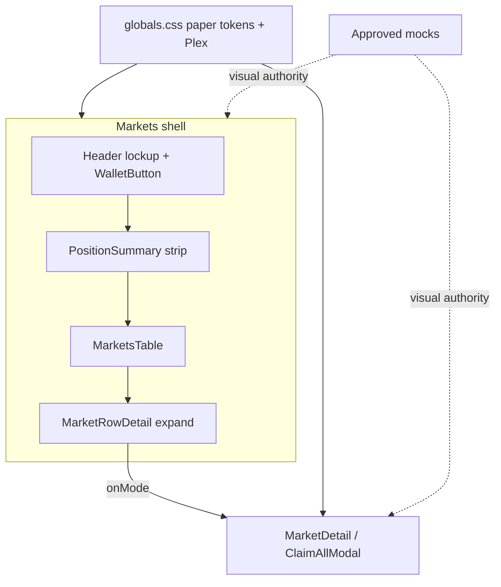

# Clearing Ledger Markets visual redesign - Plan

## Goal Capsule

**Objective.** Ship the Markets app at `app.overflow.finance` in the approved Clearing Ledger visual world: paper canvas, navy rules, muted gold/cyan semantics, wave-mark-as-O lockup, and layout alignment to the approved Markets composition — including transaction modals — without changing protocol behavior or product identity.

**Product authority.** `PRODUCT.md` (self-repaying loans). Visual approvals in `.impeccable/mocks/` (composition + lockup). Impeccable capture `docs/plans/2026-07-31-001-capture-clearing-ledger-landing-markets.md` is grounding for visual inventory, not a substitute Product Contract.

**Execution profile.** Visual-system replacement inside the existing Markets shell. Prefer preserving the two-level expand/overlay state machine and outcome-first planners; change tokens, brand assets, layout chrome, and modal surfaces. Smoke-first visual check against the approved mock after each shell unit; keep existing Vitest component suites green.

**Stop conditions.** Stop if work would require inventing health-factor / liquidation UX, renaming the product as a securities clearing ledger, redesigning marketing landing, or changing on-chain capabilities. Stop if the approved mock artifacts are missing or superseded without a new user approval.

**Open blockers.** None.

**Tail ownership.** After `ce-work` (or equivalent): Impeccable finish/documenter rewrites `DESIGN.md` from the shipped UI. DNS/Vercel alias for `app.overflow.finance` is an ops checklist item, not a code unit.

---

## Product Contract

### Problem Frame

The Markets UI still presents Architectural Dark (obsidian, Inter, tiled grid). The user approved a different visual world — Clearing Ledger — via Impeccable comps and lockup, and wants that look (plus mockup layout) on the live Markets host before investing in landing. Product copy and identity must stay self-repaying loans; the ledger aesthetic is metaphor only.

### Actors

- A1. Connected lender / borrower / PT holder using Markets on `app.overflow.finance`
- A2. Disconnected visitor who can still browse market comparison before connecting

### Key Decisions

- D1. Host Markets at `app.overflow.finance` this pass; do not redesign marketing landing here. (session-settled: user-directed — chosen over landing+Markets together or single-scroll: ship a coherent app host first)
- D2. Include look **and** layout from the approved Markets mockup (expand / Supply·Borrow arrangement, strip, table hierarchy); no new protocol features. (session-settled: user-directed — chosen over visual-only tokens or broader UX cleanup)
- D3. Restyle transaction modals (Supply, Borrow, Claim, etc.) into the same paper world so dark overlays do not break the new shell. (session-settled: user-directed — chosen over shell-only or fix-later)
- D4. Visual world is Clearing Ledger materials (paper, navy, muted gold/cyan, wave-as-O). OVRFLO is **not** a securities clearing ledger; do not present clearing-ledger language as product identity. (session-settled: user-directed — corrected over direction-contract wording that said Markets “as” a securities clearing ledger)
- D5. Brand lockup: hybrid-B-navy nested waves as the first O of OVRFLO + `VRFLO`; no `MARKETS` label beside the logo; section heading remains `SELF-REPAYING MARKETS`. (session-settled: user-directed — chosen over O-letterform ring and header MARKETS)
- D6. `DESIGN.md` is rewritten after the build from the shipped UI (Impeccable finish), not as a pre-build rulebook. (session-settled: user-approved — process for replacement worlds)

### Requirements

- R1. Markets on `app.overflow.finance` uses the Clearing Ledger visual system (paper canvas, structural rules, semantic Supply gold / Borrow cyan, no Architectural Dark tiled grid as brand atmosphere).
- R2. Header uses the approved wave-as-O lockup with accessible name OVRFLO; wallet/network remain available; no peer `MARKETS` nav label beside the lockup.
- R3. Markets shell layout matches the approved composition’s hierarchy: YOUR POSITIONS (≤4 metrics) → SELF-REPAYING MARKETS table → one expanded market with equal SUPPLY and BORROW.
- R4. Transaction modals and overlays use the same paper-world tokens and control language as the shell.
- R5. Product truth is preserved: self-repaying loans; no health factor / liquidation LTV / “clearing ledger” product claims; non-literal generative fields from comps are not shipped.
- R6. Existing Markets flows (discover, expand, supply, borrow, claim, repay, receipts) keep working; this pass does not add new on-chain capabilities.
- R7. Loading, empty, error, truncated, and disconnected states remain distinct (do not collapse into dashes or silent blanks).

### Key Flows

- F1. Browse and expand a market
  - **Trigger:** A1 or A2 opens Markets on `app.overflow.finance`
  - **Actors:** A1, A2
  - **Steps:** See position strip (as applicable) and SELF-REPAYING MARKETS table; expand one market; see settlement-oriented detail with Supply and Borrow peers
  - **Covered by:** R1, R2, R3, R5, R7
- F2. Complete a market action
  - **Trigger:** A1 chooses Supply or Borrow (or an existing modal action such as Claim)
  - **Actors:** A1
  - **Steps:** Modal opens in paper world; review exact consequences; approve/sign; receive durable receipt until dismiss
  - **Covered by:** R4, R5, R6

### Acceptance Examples

- AE1. Covers R1, R2, R3. Given Markets on `app.overflow.finance`, when the first viewport loads, then the canvas reads as paper ledger (not obsidian terminal), the lockup is wave-as-O OVRFLO without a header MARKETS label, and the primary section is SELF-REPAYING MARKETS.
- AE2. Covers R3, R5. Given an expanded market, when Supply and Borrow are shown, then they are equal peer actions with gold/cyan semantics and no health-factor or liquidation framing.
- AE3. Covers R4. Given a Supply or Borrow flow, when a modal opens, then it matches the paper world (not a dark Architectural Dark overlay).
- AE4. Covers R5, D4. Given any Markets chrome or copy in this pass, when a visitor reads identity language, then they see self-repaying loans / OVRFLO — not “securities clearing ledger” as what the product is.

### Scope Boundaries

**In scope**
- Markets app visual system + layout alignment to approved composition
- Wave-as-O lockup and derived favicons/brand marks for the app
- Transaction modals restyled to the same world
- Preserve distinct system states and existing action flows

**Deferred for later**
- Marketing landing / `overflow.finance` redesign in the same visual world
- Broader Markets UX cleanup beyond the approved composition
- Full `DESIGN.md` rewrite (post-build Impeccable documenter)

**Outside this product's identity**
- Positioning OVRFLO as a securities clearing house, exchange, or generic clearing ledger product

**Deferred to Follow-Up Work**
- Vercel/DNS cutover so production resolves `app.overflow.finance` to this Markets deploy (ops; code assumes that host)
- Optional sparse register marks if the shipped shell feels under-ruled after visual QA

### Success Criteria

- A visitor recognizes Markets as the approved Clearing Ledger look within seconds, without reading it as “crypto terminal dark.”
- Supply/Borrow and modals feel like one system.
- Product identity remains self-repaying loans; no clearing-ledger product claim in UI copy.
- No regression in core Markets flows or state honesty (loading/empty/error/truncated).

### Assumptions

- Approved artifacts remain: `.impeccable/mocks/ovrflo-clearing-comp-markets-final.png`, `.impeccable/mocks/ovrflo-lockup-wave-o.png`, `.impeccable/mocks/ovrflo-mark-hybrid-b-navy.png`.
- Current `web/` Markets app is the codebase target for `app.overflow.finance`.
- Landing content in `mockups/landing-v3.html` is out of this pass’s delivery, even if referenced for later continuity.

### Sources

- `PRODUCT.md`
- `docs/plans/2026-07-31-001-capture-clearing-ledger-landing-markets.md`
- `.impeccable/mocks/ovrflo-clearing-comp-markets-final.json` (and related approval sidecars)
- Incumbent `web/components/MarketsApp.tsx`, `web/app/globals.css`
- Dialogue 2026-07-31 (Impeccable direction + brainstorm scoping)

---

## Planning Contract

### Key Technical Decisions

- KTD1. Type stack is IBM Plex Sans (UI) + IBM Plex Mono (tabular amounts/rates/IDs), loaded via `next/font`, replacing Inter. (session-settled: user-directed — chosen over leaving Inter or picking another grotesk at implementer whim)
- KTD2. Replace Architectural Dark tokens and `.grid-bg` brand atmosphere wholesale in `web/app/globals.css` / root layout; do not polish dark toward paper. Paper white canvas, navy/graphite rules, muted gold (Supply) / muted cyan (Borrow). (session-settled: inherits D4)
- KTD3. Header lockup is semantic HTML: approved hybrid-B-navy mark as the first O + text `VRFLO`, accessible name `OVRFLO`; export derived assets under `web/public/` from `.impeccable/mocks/`. Prefer HTML+CSS over a single baked lockup PNG for a11y and optical control. (session-settled: inherits D5)
- KTD4. Preserve the existing two-level Markets state machine (`selectedMarket` expand vs `activeMode` overlay) and outcome-first planners; this pass is chrome/layout/tokens, not a UX architecture rewrite. (session-settled: inherits D2 — layout from mock without new protocol/UX features)
- KTD5. Restyle modals CSS-first (`modal-scrim`, `modal-panel`, accent classes) through `MarketDetail` / `ActionModal` / `ClaimAllModal`; keep focus trap, Escape, error boundary, and form planners unchanged. (session-settled: inherits D3)
- KTD6. Treat `app.overflow.finance` as the Markets host in metadata / `NEXT_PUBLIC_SITE_ORIGIN` defaults and docs; DNS/Vercel alias remains ops follow-up. (session-settled: inherits D1)
- KTD7. Do not rewrite `DESIGN.md` as a pre-build rulebook; only touch it if the incumbent file actively misleads the build. Full rewrite is post-build Impeccable finish. (session-settled: inherits D6)

### High-Level Technical Design

Directional guidance only — not implementation specification.

Surface order mirrors the approved composition: lockup header → ≤4-metric positions → SELF-REPAYING MARKETS table → one expanded settlement with equal SUPPLY/BORROW → paper modal for writes.

### Implementation constraints

- Follow `docs/solutions/architecture-patterns/web-markets-outcome-first-planners-and-tx-queue.md` — keep React thin; do not fold planner logic into style work.
- Non-literal generative fields from comps stay banned (health factor, liquidation LTV, Chainlink, “borrow APY” as peer to lender APR, vertical CLEARING LEDGER product rail as identity).
- Capture inventory: `.impeccable/mocks/ovrflo-clearing-comp-markets-final.png` and lockup/mark PNGs are the visual authority during build.

### Sequencing

U1 → U2 → U3 → U4. Tokens/type first so later units inherit the paper world; brand before shell layout; shell before modals so overlays match an already-paper page.

### Research breadcrumbs

- Incumbent dark tokens / Inter / `.grid-bg`: `web/app/globals.css`, `web/app/layout.tsx`
- Shell composition: `web/components/MarketsApp.tsx`, `PositionSummary.tsx`, `MarketsTable.tsx`, `MarketRowDetail.tsx`
- Modals: `MarketDetail.tsx`, `ActionModal.tsx`, `ClaimAllModal.tsx`
- Component tests to keep green: `web/tests/components/markets-table.test.tsx`, `position-summary.test.tsx`, `ActionModal.test.tsx`, `claim-all-modal.test.tsx`, form suites
- Brand assets today: `web/public/images/logo-mark.png` (replace / supplement from approved mocks)

---

## Implementation Units

### U1. Paper world tokens and type

**Goal.** Establish Clearing Ledger materials on the Markets root: paper canvas, navy/graphite rules, muted gold/cyan semantics, IBM Plex stack, no tiled-grid brand atmosphere.

**Requirements.** R1, R5 · KTD1, KTD2

**Files.**
- Modify: `web/app/globals.css`
- Modify: `web/app/layout.tsx`
- Optionally touch: `web/package.json` only if font packaging requires it (prefer `next/font/google` or local fonts already available)

**Approach.**
- Replace `--obsidian` / carbon dark palette with paper / ink / rule tokens; retarget body background and text.
- Remove `grid-bg` from `body` (delete class usage; retire or neutralize the rule so it cannot reappear as atmosphere).
- Wire IBM Plex Sans as the UI face and keep/strengthen IBM Plex Mono for `.mono` tabular data.
- Soften neon accents to muted gold / cyan suitable for paper; keep Supply/Borrow semantic pairing.
- Smoke against mock: page should read as paper ledger, not terminal.

**Test scenarios.**
- Happy path: With root layout rendered, body does not use `grid-bg`, and UI font stack is Plex Sans (not Inter).
- Edge: Existing `.mono` consumers still resolve a tabular mono face.
- Regression: Color tokens still distinguish positive / negative / warning roles used by status classes.

**Verification.** `npm --prefix web run test` for any touched layout/token assertions; visual smoke of `/` against the approved Markets mock.

---

### U2. Wave-as-O lockup and header chrome

**Goal.** Ship the approved brand in the Markets header and favicon set without a peer `MARKETS` label.

**Requirements.** R2, R5, AE1, AE4 · KTD3, KTD6

**Files.**
- Create/update: `web/public/images/` mark + any lockup helpers derived from `.impeccable/mocks/ovrflo-mark-hybrid-b-navy.png`
- Update favicons under `web/public/` as needed from the same mark
- Modify: `web/components/MarketsApp.tsx`
- Modify: `web/app/layout.tsx` (icons / metadata host defaults if needed)
- Modify: `web/lib/wagmi.ts` if wallet metadata still hardcodes the marketing origin/icon while Markets ships on `app.overflow.finance`
- Test: extend or add a focused component/layout test under `web/tests/components/` (e.g. markets shell / brand)

**Approach.**
- Export transparent mark assets from the approved mock into `web/public/`.
- Rebuild the `.brand` block as mark-as-O + `VRFLO` with accessible name `OVRFLO`; do not add header `MARKETS`.
- Keep `WalletButton` on the right; verify contrast of wallet chrome on paper (component may need token-aware class tweaks, not a new wallet stack).
- Align `NEXT_PUBLIC_SITE_ORIGIN` / metadata / wagmi app metadata toward the Markets host without blocking on live DNS.

**Test scenarios.**
- Happy path: Header exposes accessible name / text equivalent to OVRFLO and does not render a sibling `MARKETS` label beside the lockup.
- Edge: Disconnected visitor still sees lockup + wallet connect chrome.
- Negative / product truth: No UI chrome string claims “CLEARING LEDGER” or “securities clearing” as product identity.
- Integration: Favicon / icon metadata still resolve under `web/public/`.

**Verification.** Component test for brand chrome; visual check of header crop vs `.impeccable/mocks/ovrflo-lockup-wave-o.png`.

---

### U3. Markets shell layout alignment

**Goal.** Align YOUR POSITIONS → SELF-REPAYING MARKETS → expanded equal SUPPLY/BORROW with the approved composition, without inventing new metrics or on-chain features.

**Requirements.** R3, R5, R6, R7, AE2 · KTD4

**Files.**
- Modify: `web/components/PositionSummary.tsx` (structure/chrome only as needed)
- Modify: `web/components/MarketsTable.tsx`
- Modify: `web/components/MarketRowDetail.tsx`
- Modify: `web/app/globals.css` (section / table / expand / action peer styles)
- Test: `web/tests/components/markets-table.test.tsx`, `web/tests/components/position-summary.test.tsx`

**Approach.**
- Keep ≤4 position metrics and existing claim-all gating; restyle strip to ruled paper.
- Preserve table states: loading / empty / error / truncated copy remain distinct.
- Expanded row: SUPPLY and BORROW remain equal peer actions with gold/cyan semantics; do not add health-factor framing.
- Map spacing, rules, and hierarchy from `.impeccable/mocks/ovrflo-clearing-comp-markets-final.png` — implementer judgment on pixel CSS, not a separate inventory doc.
- Do not change expand/overlay ownership in `MarketsApp`.

**Test scenarios.**
- Happy path: Expanding a market shows enabled or correctly gated SUPPLY and BORROW as peer controls.
- Edge: Loading / empty / error / truncated table states still surface distinct copy (not silent blanks).
- Edge: Disconnected expand still shows connect-gated captions without inventing balances.
- Negative: No health factor / liquidation LTV strings introduced in shell chrome.
- Regression: Existing markets-table and position-summary behavioral assertions stay green.

**Verification.** `npm --prefix web run test -- markets-table position-summary` (or full `web` unit suite); visual compare expanded row to the approved mock.

---

### U4. Paper transaction modals

**Goal.** Restyle Supply / Borrow / Claim (and other existing overlays) into the same paper world so writes do not reopen Architectural Dark.

**Requirements.** R4, R5, R6, AE3 · KTD5

**Files.**
- Modify: `web/app/globals.css` (`.modal-scrim`, `.modal-panel`, accents, form controls)
- Modify only if structure requires: `web/components/MarketDetail.tsx`, `web/components/ActionModal.tsx`, `web/components/ClaimAllModal.tsx`
- Test: `web/tests/components/ActionModal.test.tsx`, `web/tests/components/claim-all-modal.test.tsx`, supply/borrow form suites as needed

**Approach.**
- Retoken modal scrim/panel/header/close/primary actions for paper + navy rules; Supply gold / Borrow cyan accents remain semantic.
- Preserve focus trap, Escape-to-close, modal error boundary, receipt-until-dismiss behavior.
- Do not change planner / tx-queue logic while restyling.

**Test scenarios.**
- Happy path: Opening a Supply or Borrow action still presents the dialog with existing title/flow; styles use paper-world tokens (assert via class contract or absence of dark-only assumptions if tests cover DOM).
- Edge: Claim-all modal still opens/closes and blocks close when a write is in flight (existing behavior).
- Regression: Modal error boundary reset path still recovers the body without trapping the user.
- Integration: Existing form happy paths (supply/borrow) remain green.

**Verification.** Targeted modal/form Vitest suites; visual smoke of an open Supply modal on the paper shell.

---

## Verification Contract

**Primary gates**
- `npm --prefix web run test` — unit/component suites covering shell, modals, and any new brand assertions
- Visual smoke: running Markets UI vs `.impeccable/mocks/ovrflo-clearing-comp-markets-final.png` (header, strip, table, expand, modal)
- Copy/identity gate: no shipped chrome claiming securities clearing ledger / health factor / liquidation LTV as product truth

**Secondary / when environment allows**
- `npm --prefix web run build` — production build succeeds with new fonts/assets
- E2E (`npm --prefix web run test:e2e`) only if a seeded local fork is already up; do not block the visual pass on spinning a full bootstrap solely for CSS — but do not skip if the environment is ready and flows are touched

**Quality bar**
- R1–R7 traceable to U1–U4
- AE1–AE4 satisfiable by shipped UI + tests/smoke
- Abandoned experimental CSS/assets removed before done
- Optional assist: `web/tests/scripts/banned-patterns.test.ts` if product-truth strings are already gated there — extend only when a durable ban belongs in CI

---

## Definition of Done

**Global**
- [ ] Markets reads as Clearing Ledger paper world (not Architectural Dark)
- [ ] Wave-as-O lockup shipped; no header `MARKETS` peer label
- [ ] Layout hierarchy matches approved composition intent
- [ ] Modals match the paper shell
- [ ] Product identity remains self-repaying loans; banned generative fields absent
- [ ] Unit/component tests green; visual smoke against approved mock recorded in the PR description
- [ ] Dead-end experimental assets/CSS removed
- [ ] `DESIGN.md` full rewrite left for post-build Impeccable finish (or explicitly deferred in PR notes)

**Per unit**
- [ ] U1: Paper tokens + Plex; no `grid-bg` atmosphere
- [ ] U2: Lockup + favicons; brand tests / a11y name
- [ ] U3: Shell layout + state honesty preserved
- [ ] U4: Paper modals; planner/trap behavior unchanged

---

## Appendix

### Approved visual authorities

| Role | Path |
| --- | --- |
| Composition | `.impeccable/mocks/ovrflo-clearing-comp-markets-final.png` |
| Lockup | `.impeccable/mocks/ovrflo-lockup-wave-o.png` |
| Mark | `.impeccable/mocks/ovrflo-mark-hybrid-b-navy.png` |
| Capture brief | `docs/plans/2026-07-31-001-capture-clearing-ledger-landing-markets.md` |

### Ops checklist (not a code unit)

- Point `app.overflow.finance` at the Markets deploy
- Set `NEXT_PUBLIC_SITE_ORIGIN=https://app.overflow.finance` in that environment
- Keep marketing `overflow.finance` on current landing until a later pass
