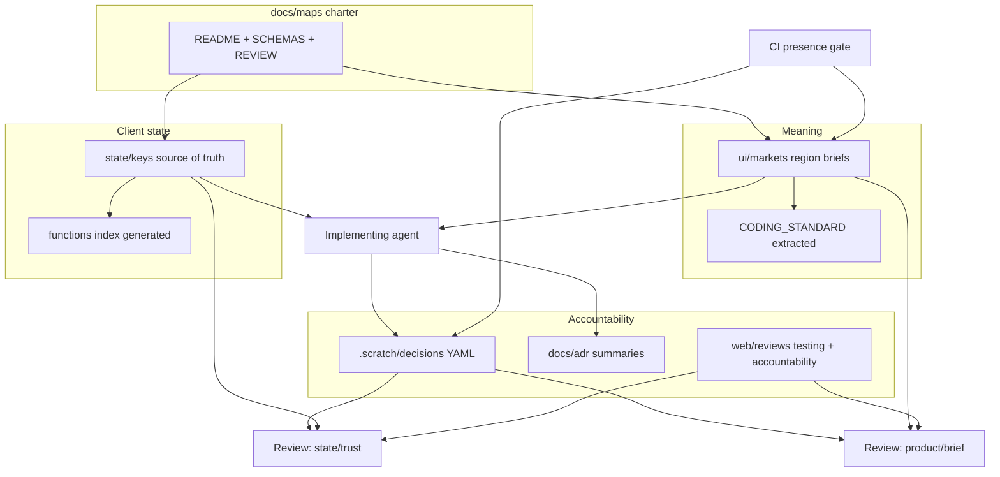

# AI-first Maps system fill - Plan

## Goal Capsule

**Objective.** Stand up and fill an AI-operable Maps system for OVRFLO Markets UI/UX — charter, region briefs, client state map, extracted coding standard, testing-map upgrade, decision summaries + scratch, and dual-agent review — so coding agents can change the UI with declared blast radius and durable rationale, while the human remains Owner/operator rather than default reviewer.

**Product authority.** `PRODUCT.md` (self-repaying loans; no liquidation / health-factor product framing). Session grill 2026-08-03 (shared understanding confirmed). Adjacent: `web/reviews/testing.md`, `docs/frontend-decision-map.md`, Impeccable comps (visual only).

**Execution profile.** Documentation-and-process system with light mechanical gates (CI presence checks, optional generators). Prefer schemas and indexes agents can parse; avoid hand-duplicated maps. Smoke-first: charter readable → briefs/state filled → review contract runnable in chat → presence gate wired.

**Stop conditions.** Stop if work expands into Clearing Ledger visual implementation, Solidity x-ray replacement, or an actual stack migration. Stop if dual review is redefined as mandatory human review for routine changes.

**Open blockers.** None.

**Tail ownership.** After fill: run stack-fitness scorecard as a separate Owner-directed review; Clearing Ledger redesign consumes briefs/standard afterward.

---

## Product Contract

### Problem Frame

Solidity already has an entry→state map and a process to keep it honest (`x-ray/`). Markets UI/UX does not. Agents change React/query/executor/projection surfaces without a living map of client state, trust domains, or control meaning — so refactors thrash, trust bugs recur (projection treated as authority, read failures as zero), and “why” evaporates. The Owner wants a senior-protocol, AI-first operating system: high-quality code with little rework, clear goals, and structure that can carry large usage — without making humans the review bottleneck.

### Actors

- A1. Coding agent implementing Markets UI/UX changes
- A2. Review agent — state/trust lens
- A3. Review agent — product/brief lens
- A4. Owner (human) — goals, charter/product-boundary, escalations only

### Key Decisions

- D1. Scope is charter stubs plus full fill through stack-fitness-review-ready; not the Clearing Ledger visual redesign and not a stack rewrite in this effort. (session-settled: user-directed — chosen over charter-only first PR; Clearing Ledger and Elixir/etc. deferred)
- D2. UI region briefs use region-level docs with nested controls (six Markets regions); seven mandatory fields per control; a11y/color/test links optional for pass 1. (session-settled: user-directed)
- D3. Authority order: Product truth → UI region briefs → Gherkin → DESIGN.md / Impeccable comps → code. Comps win on pixels; briefs win on meaning. (session-settled: user-approved)
- D4. UI architectural state map is for client UI/UX (not Solidity x-ray). Includes React/machines, query/wagmi/executor, and displayed facts with trust domain (on-chain / projection / pure-client). State keys are source of truth; function index is generated from keys. (session-settled: user-directed)
- D5. Coding standard is a thin document extracted from briefs (plus mechanical bans where possible), not a second hand-maintained meaning layer. (session-settled: user-directed)
- D6. Gherkin stays flow-level with control-ID tags (pass 1); not 1:1 scenario per control. (session-settled: user-directed)
- D7. Decisions: short summary ADR when ownership/trust/KTD moves; AI-optimized YAML scratch under `.scratch/decisions/` for deep context. (session-settled: user-directed)
- D8. Default reviewers are two agents (state/trust + product/brief). CI checks artifact presence. Owner escalates only on: agent disagreement after one re-review; charter/product/authority edits; new trust-domain or projection-as-authority; invariant exception requests; secrets/irreversible deploy. Stack change is not a standing escalation. (session-settled: user-directed)
- D9. Build on current Next/React first; scored stack fitness review after maps exist; stack then set. (session-settled: user-directed)
- D10. Artifact roots: `docs/maps/`, `docs/adr/`, `.scratch/decisions/`; Impeccable stays visual-only. (session-settled: user-approved)

### Requirements

- R1. Day-one charter exists under `docs/maps/` (README, SCHEMAS, UI/state stubs, REVIEW) plus `docs/adr/README` and `.scratch/decisions/README` describing AI-first ops, authority order, gates, escalation, and schemas.
- R2. Six Markets region briefs exist and are fillable to the seven-field control schema: Header; YOUR POSITIONS; SELF-REPAYING MARKETS table; Expanded settlement; Action modal/overlay; System chrome.
- R3. A UI client state-key catalog exists with trust domains, writers, and readers; a function/module index is generated from that catalog (not hand-duplicated).
- R4. A thin UI coding standard is extracted from filled briefs and linked from the maps charter; mechanical enforcement is used where patterns already exist (e.g. banned patterns).
- R5. Web testing map (`web/reviews/testing.md`) is brought current; test-accountability records modification reason and supports dual-agent review (not default human review).
- R6. Decision summaries land in `docs/adr/` when ownership, trust domain, or KTD moves; scratch YAML follows the fixed schema for every state-touching change that needs deep audit context.
- R7. Dual-agent review contract is documented: when it runs, pass/fail shape, one re-review, Owner escalation list (D8).
- R8. CI (or equivalent gate) enforces presence of required artifacts when UI/map/brief/test/ADR/scratch paths change — not full semantic judgment on day one.
- R9. A stack-fitness scorecard exists so a later review can judge Next vs alternatives using evidence from the filled state map — without performing the stack switch in this effort.
- R10. Clearing Ledger visual redesign and Solidity x-ray maintenance remain out of this Product Contract’s delivery.

### Key Flows

- F1. Agent changes Markets UI
  - **Trigger:** A1 implements a change touching UI, client state, briefs, or tests
  - **Actors:** A1, A2, A3, A4 (only if escalated)
  - **Steps:** Consult state keys + region briefs → implement → write scratch YAML + summary ADR if required → dual-agent review → merge if both pass; escalate per D8 if not
  - **Covered by:** R2, R3, R6, R7, R8
- F2. Owner runs the system
  - **Trigger:** A4 sets goals or receives escalation
  - **Actors:** A4, A2, A3
  - **Steps:** Charter/product boundaries stay Owner-controlled; routine review does not require A4
  - **Covered by:** R1, R7

### Acceptance Examples

- AE1. Covers R1, R7. Given a fresh clone, when an agent reads `docs/maps/README.md` and `REVIEW.md`, then it can state authority order, six regions, dual-lens review, and Owner escalation triggers without inventing process.
- AE2. Covers R2, R3. Given a proposed change to expand/overlay state, when the agent consults the state map and region briefs, then it can list state keys touched, trust domains, and dependent readers/writers before editing.
- AE3. Covers R6, R7. Given a trust-domain or ownership change, when review runs, then a summary ADR and scratch YAML exist and both agent lenses can pass or fail against them.
- AE4. Covers R9, R10. Given this effort completes, when stack fitness is discussed, then a scorecard rooted in the filled map exists — and neither Clearing Ledger pixels nor a stack migration have been shipped as part of this fill.

### Scope Boundaries

**In scope**
- Charter stubs and full fill of UI briefs, UI state map, extracted standard, testing-map upgrade, ADR/scratch process, dual-review contract, presence gates, stack-fitness scorecard

**Deferred for later**
- Clearing Ledger visual redesign implementation
- Actual stack migration (Elixir/Erlang/etc.) after scorecard review
- Full semantic CI review agents in headless CI
- Per-control Gherkin 1:1 coverage
- Mandatory a11y/color/test-link columns on every control

**Outside this product's identity**
- Treating OVRFLO as having health factors / liquidations
- Replacing Solidity x-ray as the on-chain state authority process

**Deferred to Follow-Up Work**
- Headless CI runners that execute the two semantic review lenses
- Tagging existing Gherkin scenarios with control IDs in bulk after briefs stabilize
- Promoting selected scratch files into long-lived ADRs retrospectively

### Success Criteria

- An implementing agent can answer “what state do I touch and who depends on it?” from the maps before editing Markets UI.
- Dual-agent review can accept/reject a change without Owner as default reviewer.
- Testing and decision accountability prevent silent weakening of coverage or trust boundaries.
- Stack fitness review can be run later from evidence, without blocking this fill.

### Assumptions

- Current Markets app remains Next.js + React for this fill; Impeccable visual direction remains the look authority for later redesign.
- Existing Gherkin features and `web/reviews/*` are starting points to upgrade, not throw away.
- Grounding dossier: `/tmp/compound-engineering-501/ce-brainstorm/ai-maps-fill-20260803/grounding.md`

### Sources

- Dialogue grill 2026-08-03 (confirmed shared understanding)
- `PRODUCT.md`, `CONCEPTS.md`
- `web/reviews/testing.md`, `web/reviews/test-accountability.md`
- `docs/frontend-decision-map.md`, `docs/agents/domain.md`, `docs/agents/issue-tracker.md`
- `x-ray/entry-points.md` (boundary: Solidity only)
- `docs/plans/2026-07-31-002-feat-clearing-ledger-markets-visual-redesign-plan.md` (deferred consumer)

---

## Planning Contract

### Key Technical Decisions

- KTD1. Day-one layout matches D10: `docs/maps/{README,SCHEMAS,REVIEW}.md`, `docs/maps/ui/`, `docs/maps/state/`, `docs/adr/README.md`, `.scratch/decisions/README.md`. (session-settled: inherits D10)
- KTD2. Control schema and scratch YAML schema are normative in `docs/maps/SCHEMAS.md`; region briefs and scratch files must validate against those keys. (session-settled: inherits D2, D7)
- KTD3. State catalog lives as structured files under `docs/maps/state/keys/`; function index is generated (script or documented generation step) into `docs/maps/state/functions/` or a single generated index — never edited as source of truth. (session-settled: inherits D4)
- KTD4. Dual-review prompts/checklists live in `docs/maps/REVIEW.md` (and optional `.cursor`/skill stubs later); CI presence gate is a small script or workflow check, not semantic LLM CI in this effort. (session-settled: inherits D8)
- KTD5. Testing catalog refresh inventories current `web/tests/**/*.test.ts(x)` and e2e features; accountability gains an agent-reviewer field (not human-required). (session-settled: inherits D5/D8 testing upgrade)
- KTD6. Stack-fitness scorecard is a doc under `docs/maps/` that scores maintainability for AI using state-map evidence; it does not change `web/` dependencies. (session-settled: inherits D9)
- KTD7. Brief fill uses incumbent `MarketsApp` / table / strip / modal code plus `PRODUCT.md` and ux screen inventory — not Impeccable generative fields. (session-settled: inherits D3)

### High-Level Technical Design

Directional guidance only — not implementation specification.

### Sequencing

U1 → U2 ∥ U3 → U4 → U5 ∥ U6 → U7 → U8. Charter before fill; briefs and state keys can proceed in parallel after U1; coding standard after briefs; review/CI and testing/ADR process before stack scorecard.

### Research breadcrumbs

- Incumbent UI: `web/components/MarketsApp.tsx`, `PositionSummary.tsx`, `MarketsTable.tsx`, `MarketRowDetail.tsx`, `MarketDetail.tsx`, action-flow components, hooks under `web/hooks/`, query keys `web/lib/query-keys.ts`
- Tests: `web/reviews/testing.md`, `web/reviews/test-accountability.md`, `web/tests/e2e/*.feature`
- Decisions adjacent: `docs/frontend-decision-map.md`
- Boundary: `x-ray/entry-points.md` (do not subsume)

---

## Implementation Units

### U1. Maps charter and schemas

**Goal.** Create day-one charter stubs so any agent can operate the system without inventing process.

**Requirements.** R1, R7 · KTD1, KTD2, KTD4 · D8, D10

**Files.**
- Create: `docs/maps/README.md`, `docs/maps/SCHEMAS.md`, `docs/maps/REVIEW.md`
- Create: `docs/maps/ui/README.md`, `docs/maps/state/README.md`
- Create: `docs/adr/README.md`, `.scratch/decisions/README.md`
- Optionally update: `.gitignore` only if needed so `.scratch/decisions/*.yaml` stay local while README is tracked

**Approach.** Encode authority order, six regions, escalation list (without standing stack trigger), dual-lens contract, and normative schemas for controls + scratch YAML. Leave region bodies and state keys empty or header-only.

**Test scenarios.**
- Happy path: An agent following only `docs/maps/README.md` + `REVIEW.md` can restate gates and escalation without reading chat history.
- Edge: `SCHEMAS.md` lists all seven mandatory control fields and scratch keys from the grill.
- Negative: Charter does not require human review for routine passes.

**Verification.** Doc review against Product Contract D1–D10; no code required.

---

### U2. Fill six Markets region briefs

**Goal.** Document each Markets region with nested controls using the seven-field schema.

**Requirements.** R2 · KTD2, KTD7 · D2, D3

**Files.**
- Create: `docs/maps/ui/markets/header.md`, `positions-strip.md`, `markets-table.md`, `expanded-settlement.md`, `action-modal.md`, `system-chrome.md` (names may vary; six files total)
- Update: `docs/maps/ui/README.md` index

**Approach.** Inventory controls from incumbent components and product truth. Assign stable IDs (`header.lockup`, `strip.claim-all`, …). Ban generative product framing in copy rules. Optional columns deferred.

**Test scenarios.**
- Happy path: Each of the six files has ≥1 control with all seven mandatory fields.
- Edge: System chrome documents distinct loading/empty/error/truncated/disconnected behaviors.
- Negative: No control documents health-factor or liquidation as product behavior.
- Integration: Expanded settlement lists SUPPLY and BORROW as equal peer actions.

**Verification.** Schema checklist against `SCHEMAS.md`; spot-check against `MarketsApp` tree.

---

### U3. UI client state-key catalog and generated function index

**Goal.** Publish the living UI state map agents use for blast radius.

**Requirements.** R3 · KTD3 · D4

**Files.**
- Create: `docs/maps/state/keys/*.md` or a structured catalog (YAML/Markdown table files)
- Create: generator script under `tools/scripts/` or `docs/maps/state/generate-function-index.*` OR a documented manual generation procedure if automation is premature — prefer a small script that reads key files and emits the function index
- Create: generated `docs/maps/state/functions/INDEX.md` (or equivalent), marked generated

**Approach.** Enumerate state keys from MarketsApp expand/overlay, TanStack query keys, wagmi connection, executor/tx-queue latches, discovery/projection status, and displayed facts with trust domain. Writers/readers point at real modules. Generation must be re-runnable when keys change.

**Test scenarios.**
- Happy path: Changing `selectedMarket` / `activeMode` (or current equivalents) is documented with writers, readers, trust domain.
- Edge: At least one projection/discovery key is marked projection trust domain with fail-closed guidance.
- Negative: Function index file states it is generated and must not be hand-edited as source of truth.
- Regression: Key catalog does not claim to replace `x-ray/entry-points.md` for Solidity.

**Verification.** Generator dry-run; sample agent question “who reads loan book query data?” answered from map.

---

### U4. Extract UI coding standard

**Goal.** Thin enforceable standard derived from filled briefs.

**Requirements.** R4 · KTD2 · D5

**Files.**
- Create: `docs/maps/ui/CODING_STANDARD.md`
- Update: `docs/maps/ui/README.md` / charter link
- Optionally extend: `web/scripts/check-banned-patterns.sh` / `web/tests/scripts/banned-patterns.test.ts` only for durable bans already implied by briefs

**Approach.** Distill copy bans, state-honesty rules, Supply/Borrow semantics, modal/shell consistency rules from briefs — short checklist form. Do not duplicate full control tables.

**Test scenarios.**
- Happy path: Standard items each cite originating brief IDs or regions.
- Edge: Banned patterns test still passes; new bans only if clearly mechanical.
- Negative: Standard does not restate entire region briefs.

**Verification.** Doc review; run banned-patterns test if touched.

---

### U5. Upgrade testing map and accountability

**Goal.** Make the web test catalog truthful and dual-agent reviewable.

**Requirements.** R5 · KTD5 · D6, D8

**Files.**
- Update: `web/reviews/testing.md`
- Update: `web/reviews/test-accountability.md`
- Optionally annotate: `web/tests/e2e/*.feature` with control-ID tags where cheap (pass 1; bulk tagging may follow)

**Approach.** Re-inventory unit/component/e2e tests; map each entry to purpose and system role. Accountability entries require modification reason; add fields for review-agent pass references (not human sign-off). Align with Gherkin flow+tags policy.

**Test scenarios.**
- Happy path: Catalog file count/paths match the current `web/tests` tree at time of update.
- Edge: Deleting or weakening a test requires an accountability entry template that agents must fill.
- Negative: Accountability does not require Owner approval for routine test updates.

**Verification.** Diff catalog against `find web/tests -name '*.test.*'`; sample e2e feature still runs philosophy unchanged.

---

### U6. ADR process and scratch decisions

**Goal.** Stand up decision summary + AI scratch workflow.

**Requirements.** R6 · KTD1, KTD2 · D7

**Files.**
- Update: `docs/adr/README.md` (when ADR required)
- Update: `.scratch/decisions/README.md` + example template YAML
- Optionally add: `.scratch/decisions/.gitignore` pattern for `*.yaml` while keeping README

**Approach.** Document promotion rules: PR summary vs `docs/adr/` entry. Provide `template.yaml` matching SCHEMAS scratch keys. Link from maps README.

**Test scenarios.**
- Happy path: Template validates against SCHEMAS required keys.
- Edge: Trust-domain change is listed as ADR-required in README.
- Negative: Scratch is described as AI-first; human essay not required.

**Verification.** Template round-trip read by a review checklist in REVIEW.md.

---

### U7. Presence gate for map/brief/scratch artifacts

**Goal.** Mechanically fail changes that touch UI/maps without required companion artifacts.

**Requirements.** R8 · KTD4 · D8

**Files.**
- Create: `tools/scripts/check-maps-presence.sh` (or `web/scripts/…`) and a Vitest/shell test wrapper if that matches repo norms
- Wire: existing CI or `package.json`/`Makefile` check entry used by agents before merge

**Approach.** If diff touches `web/components/**`, `web/hooks/**`, or `docs/maps/ui/**`, require brief/state updates or an explicit exemption file in scratch with reason. If state-touching change claims decision, require scratch YAML path. Keep rules dumb and documented in REVIEW.md.

**Test scenarios.**
- Happy path: Synthetic diff touching `MarketsApp.tsx` without maps/scratch note fails the check.
- Edge: Docs-only charter edit without UI code passes without scratch.
- Negative: Check does not attempt LLM semantic review.

**Verification.** Run script on fixture diffs; document how agents invoke it.

---

### U8. Stack-fitness scorecard

**Goal.** Enable a later Owner-directed stack review using map evidence.

**Requirements.** R9, R10 · KTD6 · D9

**Files.**
- Create: `docs/maps/STACK_FITNESS.md`

**Approach.** Score dimensions: AI reasonability of state graph, trust-domain honesty, testability, ecosystem for wallet/EVM, operational cost. Reference concrete state keys as evidence. Explicitly state no migration in this effort.

**Test scenarios.**
- Happy path: Scorecard can be filled using only `docs/maps/state/` + briefs as inputs.
- Negative: Document does not recommend a specific replacement stack as decided.

**Verification.** Owner can schedule review without further schema work.

---

## Verification Contract

**Primary gates**
- Charter + schemas + REVIEW readable and consistent with D1–D10
- Six region briefs satisfy SCHEMAS mandatory fields
- State keys catalog + regenerated function index coherent for sample blast-radius questions
- `web/reviews/testing.md` matches current test tree
- Presence-gate script fails the documented negative fixture and passes the happy path
- Dual-review checklist in REVIEW.md executable by two agents in chat on a sample change

**Secondary**
- `npm --prefix web run test` for any touched banned-patterns / script tests
- No Clearing Ledger UI implementation and no stack dependency change in the fill PR set

**Quality bar**
- R1–R10 traced to U1–U8
- Abandoned stub content not left contradictory to filled maps

---

## Definition of Done

**Global**
- [ ] Charter and schemas published
- [ ] Six region briefs filled to mandatory schema
- [ ] State-key catalog + generated function index available
- [ ] CODING_STANDARD extracted and linked
- [ ] Testing map current; accountability supports agent review
- [ ] ADR + scratch process documented with template
- [ ] Presence gate wired and documented
- [ ] Stack-fitness scorecard ready for a later review
- [ ] No Clearing Ledger build or stack migration shipped in this effort
- [ ] Dead-end draft maps removed or clearly marked superseded

**Per unit**
- [ ] U1–U8 each meet their verification section

---

## Appendix

### Control mandatory fields (normative summary)

ID · Purpose · Visible when · States · Action · Copy rules · Data authority

### Scratch YAML keys (normative summary)

`summary_ref` · `goal` · `state_keys_touched` · `writers_readers` · `trust_domains` · `rejected_alternatives` · `invariants_held` · `risks` · `diff_hints`

### Owner escalation triggers

1. Dual agents disagree after one re-review  
2. Charter / product identity / authority order edited  
3. New trust domain or projection-as-authority  
4. Exception to a mapped invariant  
5. Secrets or irreversible deploy/config  

(Stack change is not a standing trigger.)
