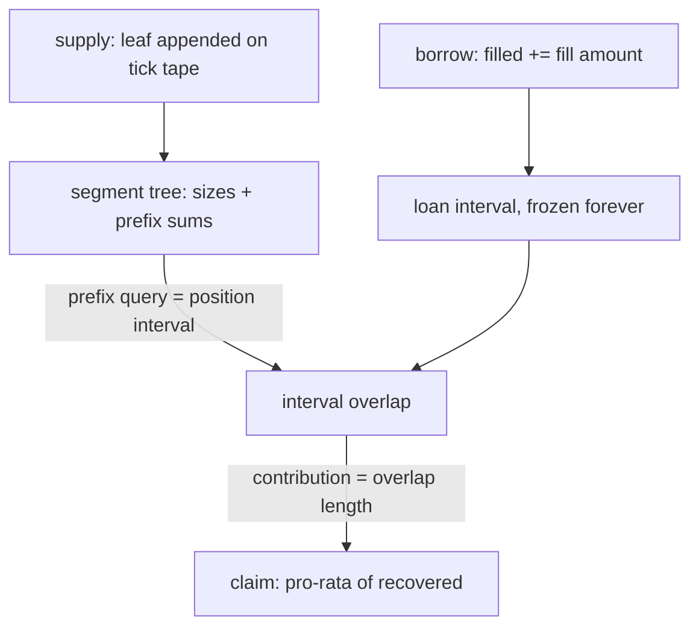
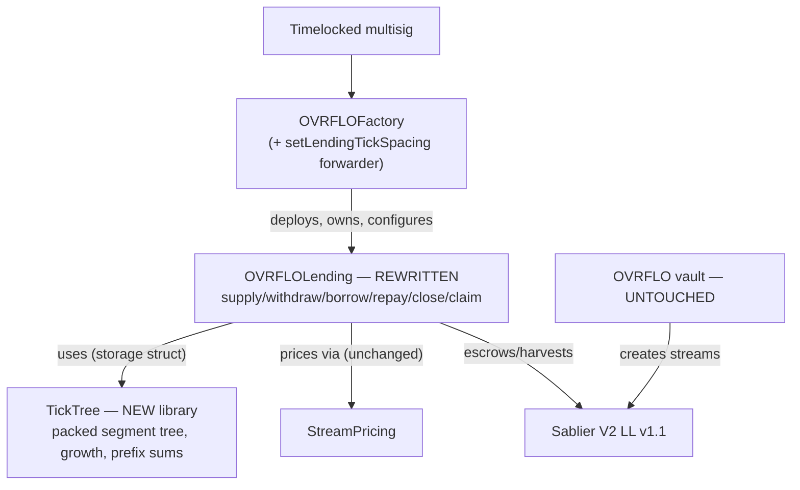

# OVRFLOLending v1-lite - Plan

## Goal Capsule

**Objective.** Replace OVRFLOLending with a loan-only, fixed-rate tick order book for launch: lenders rest capital at APR ticks, borrowers pledge their streams and draw from tick liquidity without identifying lender positions, and lender attribution is computed from interval overlap instead of stored per fill. Contracts and tests only; the core vault layer is untouched except the factory's new tick-spacing forwarder.

**Product authority.** `README.md` (self-repaying loans; deterministic collateral; no liquidations), `docs/research/2026-08-03-lending-market-design-space.md` (option map and decision addendums), `docs/audit/rejected-findings-record.md` (L-12 self-match reasoning), `docs/solutions/patterns/ovrflo-critical-patterns.md`.

**Execution profile.** Solidity/Foundry. Verify with `forge build` then `forge test` (repo preference: tests after a clean build). Highest-risk component (`TickTree`) lands first, test-first, against a reference model. Web app is out of scope and will not build against the new ABI until its own plan.

**Stop conditions.** Stop if implementation requires changing `StreamPricing` math, vault deposit/claim/wrap behavior, or any Sablier integration assumption in `docs/audit/sablier-interface-contract.md` — those are outside this plan's authority. Stop if any session-settled Key Decision proves unimplementable rather than working around it.

**Tail ownership.** After the units land: independent audit before mainnet (Success Criteria), then the Markets UI rebuild as a separate plan.

**Open blockers.** None. Nothing is deployed to mainnet; this is the launch design, not a migration.

---

## Product Contract

### Summary

A ground-up OVRFLOLending replacement: a per-market order book of fixed APR ticks where borrowing is a blind, flat-cost fill against a cumulative counter, lender claims are derived lazily from interval math, and the buy/sale paths are deleted because a maximum borrow is economically identical to a sale.

### Problem Frame

The current OVRFLOLending requires borrowers to submit explicit `liquidityIds`, selected client-side from log-scanned projections. Any concurrent consumption of a selected position reverts the whole borrow — a collision problem that worsens with scale and forced the frontend into heavy projection/retry machinery (audit findings H-4/H-5). The contract also carries two parallel mechanisms (sale listings and loan pools) plus eager per-fill attribution writes, none of which are needed to deliver the product. Since no deployment exists, the launch can ship the corrected structure instead of patching the old one.

### Key Decisions

- **Build the claim-range order book (design "B") directly for launch; no interim version.** (session-settled: user-directed — chosen over design "A" (per-position packed-depth walk with eager attribution): nothing is deployed, so there is no sunk cost, and B deletes the collision problem structurally rather than mitigating it.)
- **Loan-only market: delete `sellStreamToLiquidity`, `postSaleListing`, `cancelSaleListing`, `buyListing`.** (session-settled: user-directed — chosen over keeping the hybrid sale+loan market: a full borrow fast-paths its obligation to the stream's entire remaining value, so a max borrow is economically a sale; one mechanism spans the whole spectrum.)
- **One loan draws from exactly one APR tick.** (session-settled: user-directed — chosen over multi-tick blended fills: a single-rate loan is describable in one sentence and simplifies obligation math; the blended-rate routing gain is bounded by tick spacing and deferred.)
- **Fixed tick spacing, set per market at series approval; default 25 bps.** (session-settled: user-approved — chosen over continuous APRs or a single global spacing: fixed ticks simplify math and shrink attack surface; per-market spacing lets thin long-dated markets launch coarser.)
- **Lazy attribution via interval overlap; `loanPoolContributions` is deleted.** (session-settled: user-approved — chosen over eager per-fill contribution writes: fills become one counter write regardless of positions crossed, and the frozen-history property makes overlap math exact forever.)
- **Segmented segment tree with dynamic height 4→7; epoch rollover beyond the cap.** (session-settled: user-directed — chosen over static-depth trees: small books pay small-book gas, the extreme case grows into 2.1M leaves per tick, and rollover converts "tree full" into a tested non-event. User pushed for dynamic height after static was initially recommended.)
- **`UNIT = 1e12` quantization; all book quantities are UNIT multiples.** (session-settled: user-approved — chosen over raw uint128 amounts: enables 64-bit tree nodes packed 4 per slot; granularity of one-millionth of a token is below UI input precision.)
- **API renamed to `supply` / `withdraw` / `borrow` / `repay` / `close` / `claim`.** (session-settled: user-directed — chosen over the current names: `createBorrowerLoanPool` and `claimLoanPoolShare` are holdovers from the multi-mechanism design; one primitive needs no qualifiers.)
- **Repay-at-face is a design invariant, not an unoptimized implementation.** (session-settled: user-directed — chosen over present-value early repayment: discounted repay would hand lenders less than their promised fixed amount and inject reinvestment risk; face repay delivers the same amount sooner. Repay exists as exit optionality; rational borrowers never use it.)
- **Self-match prevention is dropped.** (session-settled: user-approved — chosen over enforcing critical pattern #4 at fill time: blind fills cannot enumerate positions; per the L-12 rejected-finding reasoning the guard was a correctness nicety, not a security boundary, and self-consumption is self-neutral minus the protocol fee.)
- **Fee model carries over unchanged.** (session-settled: user-approved — global `feeBps` charged on the borrow amount, owner-set through factory forwarders; the per-listing fee snapshot dies with listings.)
- **zc (zero-coupon wrapper + venue) is deferred as the v2 candidate pending legal review of token characterization.** (session-settled: user-directed — chosen over shipping zc at launch: risk posture; Morpho Midnight absorbs the instrument class's regulatory first-mover exposure while the option appreciates.)

### Actors

- A1. Lender — rests underlying at a chosen APR tick; receives a fixed, known payout claimable continuously as collateral vests.
- A2. Borrower — pledges an eligible Sablier stream, draws cash at one tick's rate; can do nothing wrong afterward (the collateral settles the loan).
- A3. Anyone / keeper — may `close` a coverable loan permissionlessly; may trigger tree growth or epoch rollover implicitly by transacting.
- A4. Timelocked multisig via OVRFLOFactory — approves markets (with tick spacing), sets APR bounds, fee, treasury; never touches user positions.

### Requirements

**Market structure**

- R1. Each approved market carries a set of fixed APR ticks: multiples of a per-market `tickSpacing` fixed at series approval (default 25 bps), inside owner-set `[aprMin, aprMax]` under the hardcoded 100% ceiling.
- R2. All book quantities (supply amounts, fills, tick depth) are exact multiples of `UNIT = 1e12` wei. Supply amounts must be exact multiples, rejected otherwise at the boundary; borrow targets are floored down to the nearest UNIT before consumption. Series onboarding must verify `underlying.totalSupply() ≤ 2^54 × UNIT` — an off-chain multisig checklist item documented at the tick-spacing forwarder, not an on-chain require. The ≥1,000× headroom below the 64-bit node bound exists because the check runs once against a growing supply, and the tape counts cumulative flow, not stock.
- R3. Per tick, the book maintains an append-only cumulative-quantity tape: every position occupies the next contiguous interval; a monotone `filled` counter records consumption; available depth is the identity `root − filled`, never stored state.
- R4. Position coordinates are maintained by a prefix-summable structure (segmented segment tree: 64-bit node sums, 4 per slot) with dynamic height starting at 4 and growing ×8 on demand to a cap of 7 (2,097,152 leaves per tick per market).
- R5. Beyond the height cap, the tick opens a new epoch: new posts append to the fresh tape; fills drain epochs oldest-first via a cursor; positions and loans are permanently keyed to their epoch. A single `borrow` fills from exactly one epoch (the oldest live one) and never spans an epoch boundary.

**Lender lifecycle**

- R6. `supply(market, aprBps, amount)` escrows underlying and appends a leaf at the tick; gated by `marketActive` (no supply at or after series maturity); amount must be ≥ `MIN_LIQUIDITY_AMOUNT` and UNIT-granular.
- R7. `withdraw(positionId)` is callable only by the position's lender (any other caller reverts `NotLender`); it refunds exactly the position's unfilled portion and shrinks its leaf to its filled history; it is never gated by market state; a withdraw with nothing unfilled reverts. Filled contributions are not withdrawable — they are lent, and return via `claim`.
- R8. Within a tick, fills consume positions in posting order (FIFO); across positions the fill price is identical (the tick's APR), so ordering carries no adverse selection.

**Borrower lifecycle**

- R9. `borrow(market, aprBps, targetBorrow, streamId, minAcceptable)` takes no position identifiers: it requires `targetBorrow > 0`, is gated by `marketActive`, validates stream eligibility (unchanged `StreamPricing.requireEligible` plus the `MIN_STREAM_AMOUNT` floor currently enforced in the lending contract), prices the stream, consumes `min(target, available)` from the oldest live epoch by advancing `filled` — the resulting fill must be ≥ `MIN_LIQUIDITY_AMOUNT` (one atom size for the whole book; reverts `BelowMinimum` otherwise) — records the loan's interval, escrows the stream NFT, and pays the borrower net of fee.
- R10. Partial fills succeed and are bounded by `minAcceptable` (net-to-borrower floor); an empty tick, a never-supplied tick, or a fill below the floor reverts with a distinct, interpretable error — never a low-level tree failure.
- R11. The obligation is computed by unchanged `StreamPricing` math (`obligation ≤ remaining` invariant preserved); a full borrow's obligation is the stream's entire remaining value (this is the sale path).
- R12. One stream backs at most one open loan; a stream returned by `close` or full `repay` may be re-pledged.

**Loan servicing and claims**

- R13. `repay(loanId, amount)` accepts ovrfloToken at face value against the outstanding, before or after series maturity; when outstanding reaches zero the stream returns to the borrower. Face-value repayment is a design invariant (see Key Decisions).
- R14. `close(loanId)` is permissionless once the stream's withdrawable covers the outstanding, before or after series maturity; it draws the outstanding and returns the stream. Closing an already-closed loan reverts.
- R15. A lender's contribution to a loan is computed on demand as the overlap of the position's current tape interval with the loan's stored interval — never stored at fill time.
- R16. `claim(loanId, positionId, amount)` is callable only by the position's lender, requires the loan and position to share the same market, tick, and epoch, and reverts on zero overlap. It pays the position's pro-rata share of the loan's recovered value (drawn + repaid + live withdrawable while open, harvesting the deficit from the stream as today; drawn + repaid only once closed), capped by cumulative per-(loan, position) payouts; claiming works continuously from fill until fully paid, not only at maturity. The protocol fee touches only the principal paid out at `borrow`; recovered value and claims are fee-free.

**Discovery and integration**

- R17. The ladder (every tick's depth) must be readable in one small multicall of view reads — no log-scanning, projection, or off-chain state required for any execution decision.
- R18. A user's own positions and loans are enumerable on-chain via per-user index mappings (count + at-index), appended on create. Each `(market, aprBps, epoch)` additionally keeps an append-only loan list — `loanCount` (packed into the tick slot the fill already writes) plus `loanAt(seq)` — sorted by construction because loan intervals partition the tape; `loansOf(positionId, startSeq, maxN) → (entries[], nextSeq)` binary-searches it and returns a position's overlapping loans with per-loan contribution and current claimable, so lender claim discovery is one view call with no log scanning.
- R19. Events carry enough data (tick, interval, epoch, loan interval) for a frontend to compute claimable overlaps off-chain; the contract re-derives all overlap math on-chain at claim time.

**Admin**

- R20. Admin surface is unchanged in shape: multisig → factory forwarders for APR bounds, fee, treasury, and the new set-once per-market tick spacing; spacing is never mutated after being set.

The tape/attribution structure, since it is the load-bearing concept:



### Acceptance Examples

- AE1. Partial fill under concurrency. **Covers R9, R10.** **Given** a tick with 16 available and two borrowers targeting 12 each in the same block, **when** both transactions execute, **then** the first receives 12, the second receives 4 (if ≥ its `minAcceptable`) or a clean slippage revert — never an "inactive position" failure.
- AE2. Withdraw after partial consumption. **Covers R7, R15.** **Given** a position of 6 of which 2 is filled, **when** the lender withdraws, **then** exactly 4 refunds, the leaf shrinks to 2, and the position's overlap with existing loan intervals is unchanged. A second withdraw reverts.
- AE3. Attribution across a cancellation. **Covers R15, R3, R8.** **Given** positions A(10), B(6), C(4) and a loan that consumed 12, **when** B withdraws its unfilled 4 and a second loan consumes the remaining 4, **then** A's contribution to loan 1 is 10, B's is 2, C's contribution to loan 2 is 4 — all computed, not stored.
- AE4. Continuous claiming. **Covers R16.** **Given** an open loan two months into a six-month term, **when** a contributing lender claims, **then** they receive up to their share of (drawn + repaid + currently withdrawable), with the deficit harvested from the stream in the same transaction.
- AE5. Repay at face. **Covers R13.** **Given** a loan with outstanding 4.4, **when** the borrower repays 4.4 ovrfloToken, **then** the loan closes and the stream returns — no discount for early repayment under any condition.
- AE6. Growth and rollover are invisible. **Covers R4, R5.** **Given** a tick at its current tree capacity, **when** the next `supply` arrives, **then** it succeeds (height grows, or an epoch opens at the cap), and every prior position's coordinates, loan interval, and claimable amounts are unchanged.
- AE7. Self-fill is permitted. **Covers R9.** **Given** a borrower with their own liquidity resting at the tick, **when** they borrow, **then** their own position may be consumed like any other (self-neutral minus fee); no self-match guard exists.
- AE8. Fills stop at epoch boundaries. **Covers R5, R10.** **Given** a tick whose oldest live epoch holds an above-minimum residual (e.g., 2× `MIN_LIQUIDITY_AMOUNT`) and a newer epoch holds 50 tokens, **when** a borrower targets 10 tokens, **then** the fill returns only the oldest epoch's residual (subject to `minAcceptable`), and a second `borrow` — after the cursor advances past the now-drained epoch — fills from the newer one. **Given** instead an oldest epoch holding only sub-minimum dust, **then** a borrow skips it entirely (the cursor's `< MIN_LIQUIDITY_AMOUNT` predicate) and fills from the newer epoch in one transaction, the dust remaining withdraw-only.
- AE9. Claim authorization and zero overlap. **Covers R16.** **Given** a loan and a position at the same tick where the position was posted entirely after the loan's fill window, **when** the position's lender claims against that loan, **then** the call reverts with a zero-overlap error; a claim by any address other than the position's lender reverts regardless of overlap.

### Success Criteria

- `forge build` clean; full `forge test` green, including new invariant suites for: loan intervals exactly tiling `[0, filled)` per tick; frozen history (no coordinate below `filled` ever changes); escrow solvency (`root − filled` equals withdrawable underlying per tick); tree integrity (node = sum of children) across growth and rollover; claim caps.
- Borrow gas is flat with respect to the number of lender positions consumed (measured by gas snapshot: a fill crossing 1 position vs 50 differs only by constant loan-record cost).
- Core-component coverage meets the repo's >90% target; the frozen-history lemma is stated in the spec precisely enough to hand to formal verification.
- Independent audit of the new contract before mainnet deployment.

### Scope Boundaries

**Deferred for later**

- The Markets UI rebuild against the new ABI — its own follow-on plan (the AI-maps system covers UI-work discipline separately). Until then the web app does not build against the new ABI; acceptable since nothing is deployed.
- zc, the zero-coupon wrapper + venue (v2 candidate) — gated on counsel review; nothing in v1-lite forecloses it.
- Multi-tick sweep entrypoint; market-level tick bitmap; any change to spacing of a live market.

**Outside this product's identity**

- Floating-rate / utilization-curve lending ("Aave with streams") — rejected: lenders get a fixed amount on a fixed schedule, full stop.
- A sale/listing marketplace as a separate mechanism — subsumed by max-borrow.
- Liquidations, health factors, price oracles in the lending layer — structurally unnecessary and permanently out.

### Dependencies and Assumptions

- Sablier V2 LL v1.1 at the pinned address: withdraw ACL as documented in `docs/audit/sablier-interface-contract.md`.
- Stream discovery (out of this plan's scope, retained unchanged) is the two-step pattern in `CONCEPTS.md` "Stream discovery": *candidates* come from standard-RPC `eth_getLogs` (ERC-721 `Transfer` on Sablier + vault deposit events — needed only because Sablier's NFT has no owner-indexed enumeration), then *truth* comes from direct Sablier `eth_call`s (`ownerOf` drops non-owned candidates; every displayed or acted-on value is a contract read). No Sablier subgraph/API and no provider-proprietary NFT endpoints — any standard RPC works. Discovery is three-valued (found / none / unavailable) and unavailable never renders as empty.
- `StreamPricing` carries over unchanged as the pricing core; its directional rounding and `obligation ≤ remaining` proof are relied upon, not re-derived.
- Core vault (`OVRFLO`, `OVRFLOFactory`, `OVRFLOToken`) is untouched except the factory gaining the set-once lending tick-spacing forwarder.
- A stream whose post-loan residual falls below `MIN_STREAM_AMOUNT` cannot be re-pledged; its holder exits via vault claim at maturity. Accepted, not a bug.
- Identifier style: no `l`, `O`, or `I` adjacent to digits (interval variables are `fillStart`/`fillEnd`, never `l0`/`l1`).

### Sources

- `docs/research/2026-08-03-lending-market-design-space.md` — option map; Morpho Midnight comparison; CLOB techniques survey; decision addendums.
- Clober LOBSTER (claim ranges, segmented segment trees, octopus heap): ethresear.ch posts 14051 and 15180 — reimplement from the publication; do not port code without a license check.
- Morpho Midnight (whitepaper 2026-05, launched Base 2026-07-21) — convergent zero-coupon prior art; core BUSL-1.1, periphery GPL-2.0: study only.
- Current-contract anchors verified 2026-08-05: `createBorrowerLoanPool`/`_validateLiquidity` revert behavior (`src/OVRFLOLending.sol:567,733`); sale-path functions (387, 426, 446, 463); `loanPoolContributions`/`loanPoolReceived` (173, 177); constants (34–45); factory forwarders (`src/OVRFLOFactory.sol:280–298`); `withdrawMultiple` (`interfaces/ISablierV2LockupLinear.sol:80`); Deployments TBD (`README.md:467`).
- `docs/solutions/architecture-patterns/cumulative-recovered-pro-rata-pool-claims.md` — the pattern #12 claim formula this plan carries forward (formula, not storage shape).
- `docs/solutions/logic-errors/stream-reuse-after-loan-close-property-fix.md` (GL-70) — why re-pledged streams need close-time ghost snapshots in the invariant suite.
- `docs/solutions/best-practices/closing-stateful-fuzz-coverage-gaps.md` — why rollover/multi-node/self-fill handler coverage is mandatory from day one.

---

## Planning Contract

**Product Contract preservation:** changed R2, R5, R6, R7, R9, R10, R13, R14, R16 — boundary qualifiers added from flow analysis (maturity-gate scope, epoch-boundary fill rule, UNIT alignment, guards, claim authorization); added AE8–AE9 and one assumption (sub-minimum residual streams). Post-review round (user-confirmed): R7 gained lender-only authorization, R9 gained the borrow-fill minimum, R2 pinned the onboarding check as off-chain, R18 gained the tick-epoch loan list and `loansOf` view, AE3 gained the R8 covers-tag, AE8 gained the dust-skip case. No product scope changed; every addition was individually discussed and confirmed.

### Key Technical Decisions

- KTD1. **Rewrite `src/OVRFLOLending.sol` in place; contract name stays `OVRFLOLending`.** Nothing is deployed, `OVRFLOFactory.deployLending` keeps its shape, and a new name would ripple through factory, tests, scripts, and docs for no benefit. Old sale-path code, structs, and events are deleted, not commented out.
- KTD2. **`TickTree` is a new internal library (`src/TickTree.sol`) operating on a storage struct, modeled on `StreamPricing` conventions** — internal functions, custom errors with one-line `@dev` docs, full NatSpec including rounding/packing rationale, OZ `Math`/`SafeCast`. Hand-rolling is justified under critical pattern #20, and the build-vs-borrow survey is recorded here so no implementer re-litigates it: Clober's tree is the only production instance of this structure and is license-encumbered (custom time-delayed license plus GPL/AGPL components, verified 2026-08-05) as well as parameter-mismatched; OZ and solady ship no prefix-sum tree of any kind (solady's `LibMap` would cover only the ~15-line packing helpers — not worth a new dependency); PRB-Math is used nowhere in the new code and `StreamPricing` itself is OZ-based. Math libraries: **OZ `Math`/`SafeCast` only; no new dependencies.** The battle-testing substitute is the U1 reference-model differential fuzz plus the invariant suite plus the audit gate — the same adversarial exposure battle-tested code earned over time, front-loaded.
- KTD3. **Custom errors throughout all new code**, replacing the old `"OVRFLOLending: ..."` require-strings. (session-settled: user-approved — chosen over keeping require-strings for frontend string-matching continuity: cheaper, matches `StreamPricing`, and the old frontend's error classification dies with the old UI.)
- KTD4. **One `borrow` fills from exactly one epoch — the oldest live one — and never spans a boundary.** (session-settled: user-approved — chosen over auto-advancing across epochs in one call: keeps every loan a single `(epoch, interval)` pair and claim math a single overlap; costs one extra transaction in a post-rollover window that is expected never to occur organically.)
- KTD5. **Tick spacing lives in OVRFLOLending, set once per market via a new factory forwarder `setLendingTickSpacing`** following the existing three-line forwarder shape (`_requireKnownLending`, forward, factory event — `src/OVRFLOFactory.sol:272–303`). `supply` and `borrow` revert for a market until spacing is set. Set-once: a second call reverts, and a zero spacing reverts (`ZeroSpacing` — zero is the unset sentinel that gates supply/borrow; contract validates input, multisig validates intent, per the `sweepExcessPt` precedent).
- KTD6. **`MIN_LIQUIDITY_AMOUNT = 1e15` (0.001 token), a constant.** (session-settled: user-approved — chosen over an admin-settable knob: mirrors `MIN_STREAM_AMOUNT`'s constant precedent, and 0.001 stays below any realistic retail minimum. Griefing economics are gas-bounded, not capital-bounded: one MIN-sized amount can cycle through supply+withdraw, even Multicall-batched, so the real deterrent is the six figures of cumulative gas per forced rollover — and the borrow-side epoch-cursor loop carries a hard cap so inflated epoch counts can never gas-starve a legitimate borrow.) The same constant is also the borrow-side atom: `actualBorrow ≥ MIN_LIQUIDITY_AMOUNT`, which bounds claim-list fragmentation griefing (risk #9) — one atom size governs the whole book.
- KTD7. **Maturity gates scoped per function:** `supply` and `borrow` call the `marketActive` gate; `withdraw`, `repay`, `close`, `claim` never do — a matured series winds down freely. (session-settled: user-approved via scoping synthesis.)
- KTD8. **Views follow the repo's existing two-tier convention:** raw public mappings auto-getter with zero-return semantics; named `*State` views (`positionState`, `loanState`, `tickState`) revert on nonexistent entities, mirroring the current contract's `loanState`/`liquidityState` behavior (critical patterns #7/#17). The ladder is one view: `tickDepths(market)` returning `(aprBps, availableUnits)[]` over the bounded tick range.
- KTD9. **Claim payouts keyed `received[loanId][positionId]`** (not by address): positions are the attribution unit, transfers of position ownership don't exist, and the keying makes the per-pair cap (pattern #12's formula, carried verbatim from `docs/solutions/architecture-patterns/cumulative-recovered-pro-rata-pool-claims.md`) independent of lender address reuse across positions.
- KTD10. **All narrowing casts go through checked helpers** (`SafeCast` or local `_toUint64`/`_toUint128`), including UNIT conversions and tree-node packing. Precedent: the rejected-findings record's active Low on unchecked narrowing — the old "PT-bounded values" rationale does not transfer to arbitrary lender-supplied amounts.
- KTD11. **Events follow the existing absolute-checkpoint pattern** (`LiquidityCheckpoint` precedent, `src/OVRFLOLending.sol:203–211`): absolute state, not deltas. The complete event schema is pinned in "Pinned Conventions and Schemas" below — nothing is deferred to implementation.
- KTD12. **The repo-sync unit (U8) is in scope** despite "contracts + tests only": stale `x-ray/` maps and README tables after a rewrite would poison future security reviews in a repo that treats them as required reading. (session-settled: user-approved via scoping synthesis call-out.) The web app is untouched.

### High-Level Technical Design

Component topology — what is new, rewritten, and untouched:



Borrow sequence — the blind fill:

```mermaid
sequenceDiagram
  participant B as Borrower
  participant L as OVRFLOLending
  participant SP as StreamPricing
  participant S as Sablier
  B->>L: borrow(market, aprBps, target, streamId, minAcceptable)
  L->>L: marketActive + tick spacing set + targetBorrow > 0
  L->>SP: requireEligible + price stream (grossPrice, ttm)
  L->>L: epoch = oldestLiveEpoch; available = root − filled
  L->>L: fill = min(flooredTarget, available); require net ≥ minAcceptable
  L->>L: filled += fill  (the entire consumption — one SSTORE)
  L->>L: store Loan{streamId, epoch, fillStart, fillEnd, obligation}
  B->>S: transferFrom(borrower → lending, streamId)
  L->>B: pay fill − fee; fee → treasury
```

Directional pseudo-code for the two load-bearing computations (guidance, not implementation specification):

```text
positionInterval(p):  a = UNIT × TickTree.prefix(tick[p.epoch], p.leafIndex)
                      b = a + UNIT × TickTree.leaf(tick[p.epoch], p.leafIndex)

contributionOf(loan, p):  overlap([a,b), [loan.fillStart, loan.fillEnd))  — requires same (market, aprBps, epoch)

claimable(loan, p):  contributionOf × recovered / (loan.fillEnd − loan.fillStart) − received[loanId][positionId]
                     where recovered = drawn + repaid (+ min(withdrawable, outstanding) while open)
```

### Risks and Mitigations

| # | Risk | Severity rationale | Mitigation (owning unit) |
|---|---|---|---|
| 1 | TickTree packed-node overflow/aliasing | A corrupted packed sum breaks the prefix-sum foundation every claim reads | All packed-value writes — leaf append, shrink, **and the growth root-copy** — route through one checked-cast helper; R2's onboarding bound is the numeric global backstop (U1) |
| 2 | Growth-boundary fencepost | An off-by-one reuses a node index and corrupts frozen history for existing positions | Tests at `capacity−1`/`capacity`/`capacity+1` across all four height transitions; ordering proof that the root-copy reads the old root before any new-height write (U1) |
| 3 | Epoch restart as claim-forgery surface | Leaf numbering restarts per epoch, so intervals from different epochs numerically overlap; a dropped epoch check enables fabricated claims | `(market, aprBps, epoch)` equality in `contributionOf`/`claim` is a named security invariant with an adversarial test pairing identical intervals across epochs (U4, U6) |
| 4 | Tape-spam griefing is gas-bounded, not capital-bounded | Supply+withdraw cycling reuses one MIN-sized amount; leaves are never reclaimed | Griefing cost derived as gas-only and pinned by a Multicall-cycle gas measurement; borrow's cursor loop capped at `CURSOR_CAP = 32` with permissionless, progress-persisting `advanceEpochCursor` as the recovery valve (U5, U7) |
| 5 | Claim pro-rata rounding dust | Floor division leaves residual value with an unstated destination | Dust is lender-unfavorable and strands in the contract by design; invariant bounds a closed loan's total shortfall by its contributing-position count (U4, U6) |
| 6 | ERC-721 callback reentrancy in a rewrite | The current code avoids `onERC721Received` by using plain `transferFrom`; a fresh rewrite could reflexively use `safeTransferFrom` | Plain `transferFrom` for all Sablier NFT moves, stated in-unit; `nonReentrant` on all six entrypoints individually (U3, U4) |
| 7 | Harvest-guard polarity inversion | Pattern #13 exists because this exact inversion shipped once before; re-derivation in a rewrite is the recurrence scenario | Named regression test: deficit harvest fires iff the loan is open (U4) |
| 8 | Silent divergence from proven Sablier custody behavior | No new Sablier assumption, but delete-and-rewrite can lose encoded v1.1 ACL edge cases | Port the existing fork-suite custody assertions to the new API instead of rewriting them (U7) |
| 9 | Claim-list fragmentation: dust borrows slice a lender's filled capital across many tiny loans, inflating claim gas | Same surface exists in the current audited contract (no borrow floor); annoyance grief, not theft | `MIN_LIQUIDITY_AMOUNT` doubles as the borrow floor, bounding fragmentation to size/0.001 loans at full borrow gas + fee each; `loansOf` pagination absorbs the residual (U3, U5) |

### Pinned Conventions and Schemas

Nothing in this section is deferred to implementation. Where implementation discovers a conflict, it stops and surfaces it rather than deciding.

**Constants.** `UNIT = 1e12` wei. `MIN_LIQUIDITY_AMOUNT = 1e15` wei (0.001 token; UNIT-granular) — the single atom for supply minimum AND borrow-fill minimum. `CURSOR_CAP = 32`. Tree heights: start 4, cap 7; capacity(h) = 8^h leaves; height 4→5→6→7 means exactly three growth events plus one at-cap boundary.

**Single-source constants.** Every constant has exactly one defining site, is declared `public` (so integrators and the frontend read it on-chain instead of duplicating it in config), and is referenced — never re-declared — everywhere else: `WAD`/`YEAR`/`BASIS_POINTS` stay in `StreamPricing` (unchanged, already shared by vault and lending); `UNIT`, `MIN_LIQUIDITY_AMOUNT`, `CURSOR_CAP` live in `OVRFLOLending` (book-specific — the vault has no use for them); height/capacity bounds live in `TickTree`. Deliberately NOT unified: `MIN_PT_AMOUNT` (vault deposit floor) and `MIN_STREAM_AMOUNT` (pledge-eligibility floor) remain distinct constants because they gate different things — merging same-shaped values with different meanings couples knobs that must be tunable independently.

**Types and units.** Tree node sums and tape coordinates are `uint64` in UNITs. Loan `fillStart`/`fillEnd` and position sizes are stored in UNITs (`uint64`); token amounts at every external boundary are wei (`uint128`). Conversion happens in exactly two helpers — `_toUnits` (floors) and `_toWei` — with one recorded exception (2026-08-08): the borrow-target floor is inlined as `uint256(targetBorrow) / UNIT` before the `min`, because `_toUnits`'s checked narrowing would revert a legitimately oversized target (`type(uint128).max` as "max borrow") instead of partial-filling per R10; the result still narrows through `SafeCast`, bounded by available depth. Every other narrowing cast anywhere routes through OZ `SafeCast`. The Loan struct stores `seq` (`uint64`), its index in the tick-epoch loan list.

**Behavioral pins.** `repay` with `amount > outstanding` reverts (as today). `claim` caps `amount` at claimable internally; callers pass `type(uint128).max` to claim everything. `supply` requires exact UNIT multiples; `borrow` targets floor to UNIT. `tickDepths(market)` iterates spacing-multiples within `[aprMin, aprMax]` as read at call time, summing `root − filled` across live epochs per tick. `loansOf(positionId, startSeq, maxN) → (entries[], nextSeq)` where each entry is `(loanId, contribution, claimable)`; `maxN > 0`; `nextSeq = 0` means exhausted. `advanceEpochCursor(market, aprBps, maxSteps)` requires `maxSteps > 0`, is a no-op success when nothing qualifies, and advances while the epoch's available depth is `< MIN_LIQUIDITY_AMOUNT` and the cursor is below `currentEpoch`.

**Error catalog** (custom errors; no require-strings anywhere in new code):

| Error | Thrown by |
|---|---|
| `ZeroAmount`, `NotUnitAligned`, `BelowMinimum` | `supply` (amount checks); `borrow` (fill floor; also the stream-face `MIN_STREAM_AMOUNT` floor — deliberately one selector, recorded 2026-08-08: the closed catalog barred a new error and the frontend distinguishes the cases from off-chain stream reads) |
| `SpacingUnset`, `SpacingAlreadySet`, `ZeroSpacing`, `InvalidTick` | `supply`/`borrow` gating; `setLendingTickSpacing`; non-spacing-multiple or out-of-bounds tick |
| `ZeroTarget`, `EmptyTick`, `BelowMinAcceptable` | `borrow` |
| `NotLender` | `withdraw`, `claim` |
| `NothingToWithdraw`, `NothingToClaim`, `NoOverlap`, `EpochMismatch` | `withdraw`; `claim` |
| `LoanClosed`, `LoanMissing`, `RepayExceedsOutstanding` | `repay`, `close`, `claim` |
| `EpochBacklog`, `ZeroSteps` | `borrow` (cap exceeded — error text directs to `advanceEpochCursor`); `advanceEpochCursor` |
| `AtCapacity`, `NodeOverflow`, `LeafMissing` | `TickTree` (defense-in-depth; `AtCapacity` is pre-checked away by the contract) |

*Removed by user decision (2026-08-08): `StreamAlreadyPledged`. Double-pledge is structurally impossible — an escrowed stream's NFT is owned by the lending contract, so a second `transferFrom(msg.sender, …)` fails ERC-721's owner check inside Sablier itself; an explicit guard would duplicate that on-chain. The property keeps a test (second pledge of an escrowed stream reverts, asserting the ERC-721 revert); the friendly pre-check via `ownerOf` belongs to the frontend, which already reads it in stream discovery.*

**Event schema** (absolute-checkpoint pattern; indexed fields marked):

| Event | Fields |
|---|---|
| `Supplied` | `positionId` idx, `lender` idx, `market` idx, `aprBps`, `epoch`, `leafIndex`, `amount` |
| `Withdrawn` | `positionId` idx, `lender` idx, `refund`, `remainingLeaf` (absolute) |
| `Borrowed` | `loanId` idx, `borrower` idx, `market` idx, `aprBps`, `epoch`, `seq`, `fillStart`, `fillEnd`, `actualBorrow`, `obligation`, `streamId` |
| `Repaid` | `loanId` idx, `amount`, `outstanding` (absolute, post-repay) |
| `Closed` | `loanId` idx, `drawn` (absolute, total) |
| `Claimed` | `loanId` idx, `positionId` idx, `amount`, `received` (absolute per-pair total) |
| `EpochOpened` | `market` idx, `aprBps`, `epoch` |
| `EpochCursorAdvanced` | `market` idx, `aprBps`, `fromEpoch`, `toEpoch` |
| `TickSpacingSet` | `market` idx, `spacing` (plus the factory-level re-emit per forwarder convention) |

### Sequencing

U1 (TickTree) is standalone and highest-risk — it lands first with its own suite. U2–U5 rebuild the contract bottom-up (storage/lender side → borrow → servicing → epochs). U6–U7 rebuild the property/fuzz layers once behavior is complete. U8 syncs the repo surface. Dependencies are strictly linear except U6/U7, which both depend on U5 and can proceed in parallel.

---

## Implementation Units

### U1. TickTree library

- **Goal:** A self-contained, fully tested prefix-sum tree: packed 64-bit node sums (4 per slot), append/`setLeaf`/`prefix`/`leaf`/`root`/`atCapacity` over a storage struct, dynamic height 4→7 (growth = height increment + one root-copy write), custom errors, checked casts, hand-rolled packing helpers (KTD2: no new dependencies).
- **Requirements:** R3, R4; KTD2, KTD10.
- **Dependencies:** none.
- **Files:** `src/TickTree.sol` (new), `test/TickTree.t.sol` (new).
- **Approach:** Library functions take `TickTree.Tree storage`. Nodes keyed by `(level, index)` in a mapping; leaf indexes permanent; growth initializes the new top node from the old root value read from the tree itself (never from side counters). The two audit-sensitive lines — the growth trigger boundary (`leaves == capacity(height)`) and the root-copy initialization ordering — each get dedicated tests.
- **Execution note:** Test-first against a naive reference model (an in-test array with O(n) prefix sums); the library must agree with the model under randomized operation sequences before any contract work begins.
- **Test scenarios:**
  - Happy path: append N leaves, prefix/root agree with reference model; setLeaf shrink reflected in later prefixes.
  - Edge: appends at `capacity−1`, `capacity`, `capacity+1` at each of the three growth events (heights 4→5, 5→6, 6→7) and at the height-7 cap boundary; prefixes of all pre-growth leaves unchanged after growth (AE6's tree half); growth's root-copy reads the old root before any new-height write lands (ordering assertion, not value-equality alone); the root-copy value routes through the same checked-cast helper as leaf writes; leaf value 0 vs never-appended distinction.
  - Error paths: setLeaf on nonexistent index reverts (`LeafMissing`); append at height-7 capacity reverts `AtCapacity` — defense-in-depth only, since the contract layer pre-checks via the `atCapacity` view and rolls the epoch before ever appending (internal library reverts cannot be caught); packing overflow (node sum exceeding 64 bits) reverts `NodeOverflow` via checked cast, including on the growth root-copy path.
  - Fuzz: randomized append/shrink sequences vs reference model (stateless fuzz, 1000 runs per `foundry.toml`).
- **Verification:** `forge test --match-path test/TickTree.t.sol` green; library has zero knowledge of ticks, epochs, loans, or tokens.

### U2. Storage rewrite, lender lifecycle, tick-spacing plumbing

- **Goal:** The new OVRFLOLending skeleton: tick/epoch/position storage, `UNIT`/`MIN_LIQUIDITY_AMOUNT` constants, `supply`/`withdraw`, per-user position indexes, and the set-once `setLendingTickSpacing` factory forwarder.
- **Requirements:** R1, R2, R6, R7, R18, R20; KTD1, KTD3, KTD5, KTD6, KTD7, KTD8, KTD11.
- **Dependencies:** U1.
- **Files:** `src/OVRFLOLending.sol` (rewrite: delete `LiquidityPosition`/`SaleListing`/`LoanPool` structs, sale-path functions, listing storage and events; add tick storage + lender side), `src/OVRFLOFactory.sol` (new forwarder + event), `test/OVRFLOLending.t.sol` (rewrite begins; keep the mock fixture wiring from `test/mocks/LendingMocks.sol` and the `LendingInternalHarness` exposure pattern), `test/OVRFLOFactory.t.sol` (forwarder tests).
- **Approach:** `Tick` struct per `(market, aprBps)`: epoch array/mapping of `{TickTree.Tree tree, uint128 filled}` plus `oldestLiveEpoch` and `currentEpoch` (both epoch 0 until U5 activates rollover). Position struct: `{lender, market, aprBps, epoch, leafIndex}` — no amount field. `supply` gated by `_requireMarketActive` and spacing-set; validates `amount % UNIT == 0` and the minimum; appends leaf. `withdraw` computes unfilled via prefix query, shrinks leaf to filled history, refunds; reverts when nothing unfilled. Keep `Ownable2Step, ReentrancyGuard, Multicall` inheritance (Multicall is the claim-batching answer — no bespoke batch functions).
- **Patterns to follow:** section-banner comments, NatSpec density, and factory forwarder shape per the repo research anchors (`src/OVRFLOFactory.sol:272–303`); onboarding supply-bound check per R2 documented at the forwarder.
- **Test scenarios:**
  - Happy path: supply escrows and indexes; per-user enumeration returns created positions; withdraw refunds exact unfilled; factory sets spacing once and emits.
  - Edge: supply of exactly `MIN_LIQUIDITY_AMOUNT`; supply at `aprMin`/`aprMax` bounds; non-multiple-of-spacing tick rejected; supply before spacing set reverts; supply at/after maturity reverts (KTD7); withdraw after partial fill refunds only unfilled (AE2 first half — full AE2 lands in U3 when fills exist).
  - Error paths: non-UNIT amount; below-minimum amount; `withdraw` by a non-lender reverts `NotLender`; second `setLendingTickSpacing` reverts; zero spacing reverts `ZeroSpacing`; unknown lending address in forwarder reverts; double withdraw reverts (AE2).
- **Verification:** unit tests green; old sale-path symbols no longer exist anywhere in `src/` (grep clean).

### U3. Borrow — the blind fill

- **Goal:** `borrow` per R9–R12: eligibility + pricing, single-epoch blind fill, loan storage with frozen interval, stream escrow, fee, events.
- **Requirements:** R5 (single-epoch rule), R9, R10, R11, R12, R19; KTD4, KTD11.
- **Dependencies:** U2.
- **Files:** `src/OVRFLOLending.sol`, `test/OVRFLOLending.t.sol`.
- **Approach:** Validate (`targetBorrow > 0`, market active, spacing set, tick exists in bounds); floor target to UNIT; check stream via `requireEligible` + `MIN_STREAM_AMOUNT` (the wrapper lives here, as today at `src/OVRFLOLending.sol:826`); price via `StreamPricing`; `fill = min(flooredTarget, root − filled, ⌊grossPrice⌋_UNIT)` on the oldest live epoch only, reverting `BelowMinimum` when the fill is under `MIN_LIQUIDITY_AMOUNT` (the borrow-side atom, risk #9) — the price-cap term (recorded 2026-08-08) is forced by R11: `obligationForFill` documents the call-site precondition `borrowAmount ≤ grossPrice`, above which the obligation silently exceeds the stream's remaining; capping rather than reverting is what makes max borrow the sale path; obligation via `obligationForFill` on the actual fill; `require(net ≥ minAcceptable)`; one `filled` SSTORE (which also carries the packed `loanCount` increment for free); store loan `{borrower, streamId, market, aprBps, epoch, seq, fillStart, fillEnd, obligation}` and append `loanAt[market][aprBps][epoch][seq] = loanId` (one fresh slot — the whole marginal cost of the claim-discovery index); escrow NFT; pay borrower and treasury. Distinct errors for: spacing unset, tick empty/never-supplied, below-floor fill. Sablier NFT escrow uses plain `transferFrom` — never `safeTransferFrom` — matching the existing integration and leaving no `onERC721Received` callback surface; every entrypoint carries `nonReentrant` individually (risk #6).
- **Test scenarios:**
  - Happy path: full fill; partial fill (AE1 both borrowers); max borrow = sale semantics (obligation = remaining, R11).
  - Edge: `targetBorrow` floored to UNIT (odd-wei target); fill consuming exactly the last unit of an epoch; self-fill (AE7); borrow at the block before maturity succeeds, at maturity reverts; re-pledge of a returned stream (R12 — completes in U4 when close exists).
  - Error paths: `targetBorrow == 0`; never-supplied tick (distinct error, R10); net below `minAcceptable`; ineligible stream; sub-`MIN_STREAM_AMOUNT` stream; stream already backing an open loan.
  - Integration: borrow emits the checkpoint-pattern event with interval fields; `filled` advances exactly by fill; escrowed NFT owner is the lending contract.
- **Verification:** unit tests green; a fill's gas is independent of how many positions its interval spans (asserted informally here; measured in U7).

### U4. Servicing and claims — repay, close, claim, contributionOf

- **Goal:** Loan servicing on lazy attribution: `contributionOf` overlap math, `claim` with authorization + per-pair caps + JIT harvest, `repay` at face, permissionless `close`.
- **Requirements:** R13, R14, R15, R16; KTD8, KTD9; carries pattern #12's formula verbatim.
- **Dependencies:** U3.
- **Files:** `src/OVRFLOLending.sol`, `test/OVRFLOLending.t.sol`.
- **Approach:** `contributionOf(loanId, positionId)` = overlap of the position's current interval (prefix query) with the loan's frozen interval; requires same `(market, aprBps, epoch)`. `claim` requires `msg.sender == position.lender`, computes `recovered = drawn + repaid + (open ? min(withdrawable, outstanding) : 0)`, claimable = `contribution × recovered / intervalLength − received[loanId][positionId]`, harvests the deficit from the stream exactly as `_claimFair` does today (`src/OVRFLOLending.sol:642–681`), pays ovrfloToken. `repay` and `close` keep today's semantics minus pool indirection; both ungated by market state (KTD7); `close` reverts if already closed. Proceeds accounting (`proceeds[loanId]`) mirrors today's `loanPoolProceeds` flow. Stream-return transfers use plain `transferFrom` (see U3, risk #6); rounding dust is lender-unfavorable and strands in the contract by design (risk #5); `claim` caps `amount` at claimable internally — `type(uint128).max` means "claim everything" (pinned convention); `repay` above outstanding reverts `RepayExceedsOutstanding`, exactly as today.
- **Test scenarios:**
  - Happy path: AE3 (attribution across cancellation), AE4 (continuous claim with harvest), AE5 (repay at face closes and returns stream).
  - Edge: claim after close uses `drawn + repaid` only (no withdrawable term); claim by every contributor sums to exactly recovered (rounding dust bounded and lender-unfavorable per existing rounding discipline); fee-zero market; repay across maturity boundary; re-pledged stream's second loan claims are isolated from the first (GL-70 scenario at unit level).
  - Error paths: AE9 (zero overlap reverts; non-owner reverts); claim on nonexistent loan/position; repay overpayment clamped or rejected (mirror today's behavior); double close reverts; epoch-forgery adversarial case — two loans in different epochs with numerically identical `[fillStart, fillEnd)`, where the cross-epoch claim must revert on the epoch check, not on coincidental non-overlap (risk #3); harvest-branch polarity regression (pattern #13) — the deficit harvest fires if and only if the loan is open (risk #7).
  - Integration: claim's JIT harvest draws from Sablier and updates `drawn`; full lifecycle supply→borrow→partial claim→close→final claims→stream returned.
- **Verification:** unit tests green; `loanPoolContributions` and eager attribution writes no longer exist in `src/`.

### U5. Epochs — rollover, cursor, growth integration, views

- **Goal:** Activate the capacity backstop: at-cap `supply` opens a new epoch; fills drain oldest-first via `oldestLiveEpoch`; per-tick and ladder views; `tickDepths` multicall surface.
- **Requirements:** R3 (identity view), R5, R17; KTD4, KTD8.
- **Dependencies:** U4.
- **Files:** `src/OVRFLOLending.sol`, `test/OVRFLOLending.t.sol`.
- **Approach:** `supply` pre-checks capacity via `TickTree.atCapacity` and opens epoch N+1 *before* appending (internal library reverts cannot be caught; the library's `AtCapacity` error stays as defense-in-depth). `borrow` reads `oldestLiveEpoch` and advances it past epochs whose available depth is `< MIN_LIQUIDITY_AMOUNT` (one predicate covers fully-drained epochs and dust residuals, which become withdraw-only), up to `CURSOR_CAP = 32` steps — beyond it, revert `EpochBacklog` naming the recovery path. That path is `advanceEpochCursor(market, aprBps, maxSteps)`: permissionless, `nonReentrant`, requires `maxSteps > 0`, advances under the same predicate, **persists its progress on success**, no-op success when nothing qualifies, emits `EpochCursorAdvanced`. `tickDepths(market)` per the pinned semantics; `loansOf(positionId, startSeq, maxN)` binary-searches the tick-epoch loan list (sorted by construction — intervals partition the tape) and returns `(loanId, contribution, claimable)` entries plus `nextSeq`. Test hook: the `LendingInternalHarness` pattern exposes a capacity-override so growth and rollover are testable without 2M supplies.
- **Test scenarios:**
  - Happy path: AE8 (fill stops at boundary; second borrow after cursor advance); AE6 (growth and rollover invisible to prior positions/loans/claims).
  - Edge: withdraw from a position in a drained old epoch still refunds nothing-or-unfilled correctly; claim against an old-epoch loan after rollover; supply lands in the new epoch while old-epoch fills continue; depth view sums across epochs.
  - Error paths: borrow on a tick whose all epochs are drained reverts `EmptyTick`; a backlog beyond `CURSOR_CAP` reverts `EpochBacklog` and becomes borrowable again after `advanceEpochCursor` calls (recovery test with backlog > cap); `advanceEpochCursor` with `maxSteps = 0` reverts `ZeroSteps`; `loansOf` pagination returns exact continuation across a `maxN` boundary.
- **Verification:** unit tests green; ladder read is one `eth_call` multicall (exercised in a view test).

### U6. Invariant suite rewrite

- **Goal:** Replace `test/OVRFLOLendingInvariant.t.sol` with a handler + ghost suite proving the Success Criteria invariants under fuzzed operation sequences.
- **Requirements:** Success Criteria (invariants); GL-70 and fuzz-coverage learnings.
- **Dependencies:** U5 (parallel with U7).
- **Files:** `test/OVRFLOLendingInvariant.t.sol` (rewrite).
- **Approach:** One handler, bounded actors, `try/catch`-skipped invalid paths per the existing pattern (`test/OVRFLOLendingInvariant.t.sol:11–70`). Ghosts: per-tick posted/cancelled/filled mirrors; per-loan interval records; **close-time stream-withdrawn snapshots (GL-70)** for re-pledge-safe draw accounting; received-per-pair sums. Handlers must include, from day one: multi-position fills crossing tree-node boundaries, forced growth (capacity override), forced epoch rollover, self-fills, time advancement, and stream re-pledging — the structural-coverage lesson from `docs/solutions/best-practices/closing-stateful-fuzz-coverage-gaps.md`.
- **Test scenarios (the invariants themselves):**
  - Interval partition: loan intervals per tick-epoch are disjoint, contiguous, tile `[0, filled)`.
  - Frozen history: no prefix below `filled` ever changes across any operation (checked via ghost snapshots).
  - Escrow solvency: Σ per-tick `(root − filled)` × UNIT equals underlying held for unfilled positions (pattern #6 all-party balance check extended to the tape).
  - Tree integrity: stored node = sum of children, across growth and rollover.
  - Claim caps: Σ received per pair ≤ pro-rata entitlement (pattern #12 formula); Σ received per loan ≤ recovered.
  - Obligation ≤ remaining (carried from today's suite).
  - Epoch isolation: no claim ever pays across mismatched `(market, aprBps, epoch)` — adversarial handler pairs numerically identical intervals across epochs (risk #3).
  - Dust bound: on a closed loan, total claimant shortfall vs exact pro-rata ≤ the number of contributing positions, in wei (risk #5).
  - Cursor soundness: `oldestLiveEpoch ≤ currentEpoch`, and every epoch below the cursor has available depth `< MIN_LIQUIDITY_AMOUNT`.
  - Loan-list soundness: `loanAt` entries per tick-epoch are interval-sorted with `loanAt[k].fillEnd == loanAt[k+1].fillStart`, verified via each loan's stored `seq` (two reads per spot-check).
- **Verification:** `FOUNDRY_PROFILE=invariant forge test --match-contract OVRFLOLendingInvariant -vvv` green at runs=500/depth=40 (`foundry.toml:21–27`); handler-coverage assertion that every handler path executed at least once in a run.

### U7. Fuzz, attack scenarios, and the gas-flatness snapshot

- **Goal:** Port `test/OVRFLOFuzz.t.sol` and `test/OVRFLOAttackScenarios.t.sol` to the new API; add the borrow gas-flatness measurement.
- **Requirements:** Success Criteria (gas flatness); AE1, AE7 under adversarial sequencing.
- **Dependencies:** U5 (parallel with U6).
- **Files:** `test/OVRFLOFuzz.t.sol`, `test/OVRFLOAttackScenarios.t.sol`, `test/fork/` (port the lending fork suite's custody assertions), `.gas-snapshot`.
- **Approach:** Rewrite lending-touching fuzz/attack cases for the new verbs; drop sale-path scenarios; keep vault-side scenarios untouched. Port the existing fork-suite Sablier-custody assertions (stranger-cannot-withdraw; NFT owner transitions across escrow and return) to the new API rather than rewriting them, so the encoded v1.1 ACL edge cases survive the rewrite (risk #8). Add a gas measurement for a Multicall-batched supply+withdraw cycle to pin the tape-spam cost as gas-bounded (risk #4). House the gas-flatness pair and this measurement in a test contract named `OVRFLOLendingGas` so the Verification Contract's `--match-contract OVRFLOLending` snapshot gate sees them. Gas flatness: two snapshot tests — a borrow whose interval spans 1 position and one spanning 50 — asserting the delta is bounded by a small constant (loan-record cost), locked into `.gas-snapshot` via `forge snapshot`.
- **Test scenarios:**
  - Fuzz: randomized supply/withdraw/borrow amounts at UNIT granularity; adversarial withdraw-before-borrow interleavings (cancel-frontrunning is benign — borrower bounded by `minAcceptable`).
  - Attack: tape-spam economics (many minimum supplies — bounded by `MIN_LIQUIDITY_AMOUNT`); reentrancy attempts on claim's harvest path (`ReentrantLendingUnderlying` mock precedent, `test/OVRFLOLending.t.sol:35`); self-fill griefing yields nothing beyond fee loss.
- **Verification:** `forge test --match-contract "OVRFLOFuzz|OVRFLOAttackScenarios"` green; `forge snapshot` diff shows the flatness pair.

### U8. Repo sync

- **Goal:** Bring the repo's contract-describing surfaces in line with the shipped design so future reviews read true.
- **Requirements:** KTD12.
- **Dependencies:** U6, U7.
- **Files:** `README.md` (OVRFLOLending section + function table + flows), `x-ray/entry-points.md`, `x-ray/invariants.md`, `CONCEPTS.md` (mark the superseded LiquidityPosition/Listing/Pool entries as replaced by the v1-lite section; promote the v1-lite section out of "planned"), `PROPERTIES.md`, `AUDIT.md` (pointer notes only), `script/OVRFLO.s.sol` and `script/seed-local.sh` (deploy/seed path gains the tick-spacing onboarding step; keep the `forge create`/`cast send` pattern — never `forge script --broadcast` locally, critical pattern #2), `docs/solutions/patterns/ovrflo-critical-patterns.md` (annotate #4/#10/#16 as superseded-by-design with a pointer to this plan — #4 because self-match is unenforceable under blind fills per the L-12 reasoning, #10 because `borrow` takes no ID array so the strictly-increasing-IDs double-count vector no longer exists (R9), #16 because per-position consumption loops are replaced by the monotone `filled` counter (R3); do not delete history), and correct the stale PRB-Math dependency mention in root docs (the pricing core uses OZ `Math`/`SafeCast`; no PRB-Math anywhere).
- **Approach:** Mechanical accuracy pass, not prose rewrites. The web app is explicitly untouched (Scope Boundaries).
- **Test scenarios:** Test expectation: none — documentation and script sync; the seed script is exercised by running `bash script/seed-local.sh` against a local fork once (smoke, not CI).
- **Execution note:** Smoke-verify the seed path end-to-end on a local Anvil fork rather than unit-testing scripts.
- **Verification:** grep for deleted symbols (`createBorrowerLoanPool`, `claimLoanPoolShare`, `postSaleListing`, `LiquidityPosition`) returns only historical docs (`docs/plans/`, `docs/audit/`, `docs/solutions/`, `docs/research/`); README function table matches the shipped ABI.

---

## Verification Contract

| Gate | Command | Applies to | Done signal |
|---|---|---|---|
| Build | `forge build` | all units | clean compile, no warnings introduced |
| Unit + fuzz | `forge test` | U1–U5, U7 | green (fuzz at runs=1000 per `foundry.toml`) |
| Invariants | `FOUNDRY_PROFILE=invariant forge test --match-contract OVRFLOLendingInvariant -vvv` | U6 | green at runs=500 / depth=40 |
| Gas flatness | `forge snapshot --match-contract OVRFLOLending` | U7 | 1-position vs 50-position borrow delta ≤ constant loan-record cost |
| Format | `forge fmt --check` | all | clean |
| Coverage (informational) | `forge coverage` | U1–U5 | core components ≥ 90% (repo target) |
| Local seed smoke | `bash script/seed-local.sh` on an Anvil mainnet fork | U8 | deploy + seed completes; ladder readable via cast |

Run order per repo preference: `forge build` first, then tests. Never `forge script --broadcast` against local Anvil (critical pattern #2).

---

## Definition of Done

- All eight units complete in dependency order; every Verification Contract gate green.
- No dead code: sale-path functions, structs, events, `loanPoolContributions`, and all eager-attribution machinery are deleted from `src/`, not stranded; abandoned experimental code from the build is removed.
- Every AE1–AE9 has at least one enforcing test carrying its `Covers AE<N>.` prefix.
- The frozen-history property is stated in `x-ray/invariants.md` precisely enough to hand to a formal-verification engagement (Success Criteria), with the U6 invariant as its executable form.
- The Product Contract preservation note in the Planning Contract reflects any further R-ID changes made during implementation (expected: none).
- `CONCEPTS.md` v1-lite vocabulary promoted from "planned" to current; superseded entries marked, not deleted.
- Independent audit remains the deployment gate (tail ownership) — not a unit of this plan, but Done here explicitly does not mean deployable.
