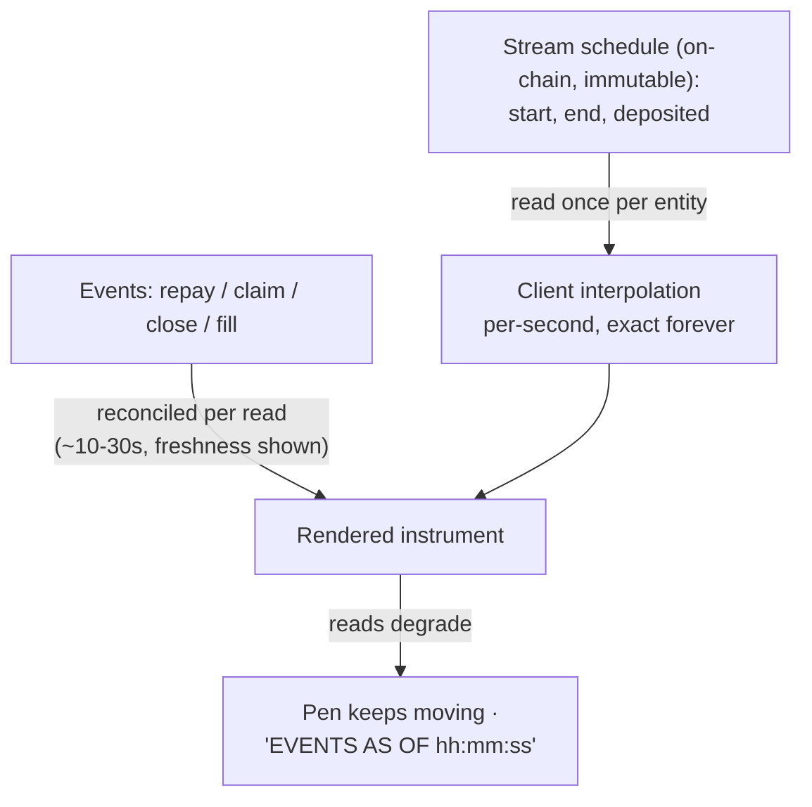
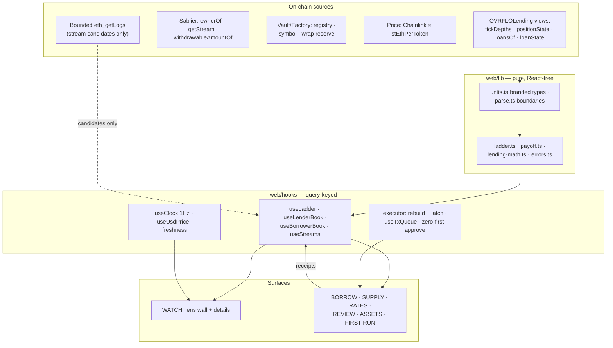
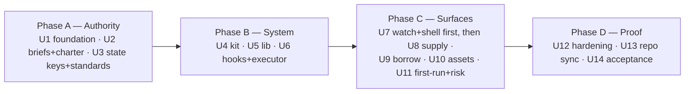

# Watch-Surface Markets Experience - Plan

## Goal Capsule

**Objective.** Rebuild the Markets web app (`web/`) so its home is the watch surface — lenders watching earnings roll up with claim at hand, borrowers watching debt roll down to its known done-date — wired to the v1-lite OVRFLOLending tick order book, in the ratified one-bit gold grammar, with the entire frontend mapped: every screen and interaction under a control contract, every piece of client state cataloged, every data path documented with its trust domain.

**Authority and precedence.** When sources disagree, the higher one wins:

1. Product truth: `PRODUCT.md`, `CONCEPTS.md`.
2. UI region briefs: `docs/maps/ui/` **as rewritten by U2** (briefs win meaning; comps win pixels).
3. Behavior: `docs/plans/2026-08-11-markets-frontend-flow-spec.md` (read-only) as extended/superseded by this plan's Product Contract; Gherkin (`web/tests/e2e/*.feature`) as rewritten by U13.
4. Visual: `docs/plans/2026-08-11-004-ovrflo-liked-interface-reference-synthesis.md`, `.impeccable/mocks/ovrflo-ref-01…08.png`, the approved walkthrough `.impeccable/mocks/ovrflo-walkthrough-v3-approved.html`, surface brief `.impeccable/surfaces/web-app-page-tsx.md`.
5. Contract truth: `src/OVRFLOLending.sol`, `src/OVRFLO.sol`, `src/OVRFLOFactory.sol` as built — never a doc's paraphrase.

`docs/plans/2026-08-11-002-feat-web-v1-lite-frontend-rebuild-plan.md` is **superseded by this plan** as implementation authority; its still-valid machinery is folded into the units below and it is retained as history only.

**Execution profile.** Next.js App Router + wagmi/viem + TanStack Query in `web/`. Authority artifacts (briefs, state keys, standards) land before flow code, per the maps charter. Verify per the Verification Contract; E2E runs against a seeded local Anvil fork (read `docs/agents/testing.md` first; `script/seed-local.sh:204-274` already drives the v1-lite book). The maps presence gate (`npm --prefix web run lint:maps`) applies to every UI change.

**Stop conditions.** Stop if implementation would require Solidity changes, a backend/indexer service, health-factor/liquidation UX, or a projection value feeding an action gate. Stop if a flow-spec screen cannot be built from the mechanism map's data paths — surface the gap. Stop if any session-settled decision proves unimplementable rather than working around it.

**Tail ownership.** After the units land: Impeccable finish review (desktop + mobile, side-by-side against the approved walkthrough, Experience Review Gate below), then the Impeccable documenter rewrites `DESIGN.md` from the shipped UI (never pre-written), then the `ethskills:qa` pre-ship audit in a fresh reviewer context. Ops checklist items (not code units): `app.overflow.finance` DNS/hosting cutover, plus the Frontend Hardening section's ops items — registrar/DNS hardening, per-release IPFS mirror, deploy-pipeline key discipline, and the incident switch.

**Open blockers.** None.

---

## Product Contract

**Product Contract preservation:** unchanged from the confirmed requirements-only version, except: Outstanding Questions resolved into Planning Contract decisions (ribbon budget → U4; history windowing → KTD12; narrow-viewport navigation → KTD13), and the per-position claim boundary added to Scope Boundaries (user-approved at plan scoping).

### Summary

The Markets app's home becomes the watch surface: the connected wallet's positions rendered as live instruments through a role lens — the lender lens leads with earnings visibly growing and a claim at hand, the borrower lens leads with debt visibly shrinking toward its known done-date, resting capital stays honestly inert — every moving value drawn in the shared dot-ribbon idiom, with actions living on the entities that own them.

### Problem Frame

Every competing lending app earns return visits through fear: liquidation risk, health factors, floating rates. OVRFLO's mechanism deletes the fear — collateral is a deterministic, non-cancelable stream, so a loan's end is known the moment it opens. The prior rebuild plan treated this as one feature (a cover date) inside a conventional destination-first app; the actual opportunity is structural. Determinism is the one thing Alchemix, Aave, and Morpho cannot show, and the interface that makes it visible — continuously, honestly, without spectacle — is the category-defining move. Meanwhile everything customer-facing must be rebuilt anyway: the v1-lite contract rewrite orphaned the old frontend wiring.

### Key Decisions

- **The watch surface is home.** A connected wallet holding any position, loan, or stream lands on the meter wall; Borrow and Supply are flows launched from home and from nav. This supersedes the flow spec's "no dashboard home" and route-chooser entry for holding wallets. (session-settled: user-directed — chosen over destination-first entry and over intent-memory entry: the home IS the product's core moment.)
- **Register: calm instrument, recorded time.** The loan renders as a precision instrument, not a DeFi spectacle. The canonical moving-value form is the **dot ribbon**: dense recorded dots for what has happened, a gold edge marker at now, faint dots for the scheduled future, ending at the entity's terminal date. (session-settled: user-directed — chosen over glow/feed/number-go-up spectacle after rendered A/B/C probes, then refined from x/y strip charts to ribbons after the v2 walkthrough: the ribbon reads like section-4's queue band, one idiom everywhere.)
- **Home architecture: role-lens wall, detail on select.** The wall gives a two-second scan of one role's entities (Supplied / Borrowed / Streams lens); selecting a row opens its detail in place. Dual-role wallets default to the supplied lens — lenders visit most, on claim cadence. (session-settled: user-directed — meter-wall-plus-detail chosen over recorder-centerpiece and small-multiples after rendered probes; role lens chosen over a unified mixed book per the liked-interface synthesis.)
- **Roll-in heroes.** Watching means watching value move: the supplied detail leads with earnings as a large gold number growing per second with CLAIM beside it; the borrowed detail leads with the outstanding counting down (−rate/day, done-date, live countdown). (session-settled: user-directed — "the focus should be on watching the repayment roll in: 1 sees the debt shrinking, 2 sees the investment growing.")
- **No attention strip.** The watch surface has no aggregate action bar: NOW/NEXT was rejected as unclear and its NEEDS YOU/UPCOMING replacement rejected outright in rendered form. Actions live on the entities that own them; upcoming moments render inside their rows and details. (session-settled: user-directed.)
- **The home's job is trust at moments, not retention.** Arrival moments (post-sign, claim-ready, covered, maturity) earn visits; no engagement mechanics exist anywhere. (session-settled: user-approved — chosen over earning daily returns with digests/tickers: manufactured urgency re-imports the casino the register refuses.)
- **Visual grammar authority.** `docs/plans/2026-08-11-004-ovrflo-liked-interface-reference-synthesis.md` (references archived at `.impeccable/mocks/ovrflo-ref-01…08`) governs composition: white one-bit base with bitmap character only (no literal OS chrome — session-settled: user-directed), spacious single-decision defaults for Borrow/Supply with the dense three-bay depth workspace behind `ALL RATES` (session-settled: user-directed), three-bay geometry retained only there and in the approved Assets converter, and the SETTLEMENT step trace integrated into the task rather than a separate dock. The approved interactive rendition is `.impeccable/mocks/ovrflo-walkthrough-v3-approved.html`.
- **Single gold accent.** One accent — gold `#E8930C` — marks value movement and the active operation everywhere; cyan is retired. (session-settled: user-directed — role-coded cyan/amber was adopted from the reference synthesis, rendered, and reversed: "I like that gold color more… stick with the gold color for now.")
- **APR movement is a windowed stepper.** Rate selection shows a three-tick window with ◂ ▸ paddles stepping one tick at a time (instant — the whole ladder arrives in one `tickDepths` read, with neighboring-tick hints), and `ALL RATES` opens the full ladder for direct picks. Borrow's chips show available depth and a pool band showing the customer's draw against resting liquidity, mirroring supply's queue band. (session-settled: user-approved — resolves "how does the customer move through the APRs?"; borrower depth visibility user-directed.)
- **Token symbols are market-driven.** Customer-facing token names resolve from the chosen market's live `symbol()` read; before a market is chosen, copy says "the market's ovrflo token." `ovrfloWSTETH` in any artifact is an example, never a constant. (session-settled: user-directed.)
- **Inherited ratifications.** Combined rebuild scoped to the Markets app, token/USD display switch with USD reference-only, guided first run, factual risk note with one-time acknowledgment, progressive disclosure defaults, wordmark-only masthead, SETTLEMENT vocabulary with PERMISSION/ACTION receipts — all user-directed or user-approved 2026-08-11, carried unchanged.

The split-truth rendering model, since it governs every moving number:

### Actors

- A1. Borrower — holds one or more loans repaying themselves; wants "when is this over?" answered at a glance and residual return confirmed.
- A2. Lender — rests capital at ticks; wants to know when it gets matched, watch claimable accrue after fills, and collect.
- A3. Stream holder / PT depositor — holds vesting streams as collateral inventory; routes into Borrow or holds to maturity.
- A4. New visitor with an empty wallet — needs the guided path to a first watchable object.

### Requirements

**Home and watching**

- R1. The home renders the connected wallet's entities through a role lens (Supplied / Borrowed / Streams; zero-count lenses hidden; supplied is the default for dual-role wallets) as rows on a wall: identity, human-readable state line, miniature ribbon, and the role's decisive number (earnings accruing, outstanding shrinking, match state, or vested amount).
- R2. Actions live on the entities that own them — CLAIM on the earning position with the live amount in the control, WITHDRAW on unfilled capital, REPAY/CLOSE on the loan — and there is no aggregate attention strip anywhere. Upcoming moments (cover date, maturity) render inside the rows and details they belong to.
- R3. Selecting a row opens its detail in place. The supplied detail leads with earnings growing per second (gold, with CLAIM adjacent), then the earnings ribbon and the segmented capital band (fills divided by hard rules, unfilled marked withdrawable). The borrowed detail leads with the outstanding counting down (−rate/day, done-date, live countdown), then the debt ribbon. All moving values use the dot-ribbon idiom: dense recorded dots, gold edge marker, faint scheduled future, labeled terminal date.
- R4. Unpledged eligible streams appear under the Streams lens as vesting ribbon rows with a route into Borrow; pledged streams link to their loan.
- R5. A resting supply position renders visibly inert — no animated accrual, no motion — with its withdraw affordance and queue position stated plainly.
- R6. Borrowed rows and details answer "when is this over?" with an explicit approximate done-date and live countdown; a repay preview shows the date moving before signing.

**Liveness and honesty**

- R7. Schedule-derived quantities (vested, repaid-by-stream, claimable accrual) update visibly at least once per second via client interpolation of on-chain schedule parameters; interpolation never invents motion for quantities that are not schedule-backed.
- R8. Event-derived quantities (outstanding after repay, drawn after claim harvest, fills, closes) change only on chain reads; the surface displays event freshness, and degraded reads keep schedule interpolation running while marking events as-of. Signing remains gated by the existing STALE rules.
- R9. When a loan's stream covers its outstanding, the row and detail flip to the close-ready state; watching yields to action without fanfare. After close (or full repay), the loan remains on the Borrowed lens as a readable SETTLED row — ordered after active loans, identifying the returned stream — and the freed stream reappears under the Streams lens as eligible on the same reconciling read.

**Lender moments**

- R10. A fill renders on the supplied capital band as a new hard-ruled segment beginning an earnings-accrual, and a fill that occurred between visits leads the position's state line on the next arrival.
- R11. Supply rows lead with match state (resting, partially filled x/y, fully filled) before yield figures.

**Entry and flows**

- R12. A connected wallet holding any protocol object lands on the watch surface; a wallet confirmed empty of positions, loans, AND streams lands on the guided first run — when stream discovery is pending or classifies could-not-ask while on-chain books read zero, the watch surface renders with the Streams lens in its degraded state instead (first-run never asserts emptiness discovery cannot confirm). A visitor with no connected wallet lands on the disconnected entry surface: the flow spec's `ENTRY.DISCONNECTED` render with its copy reframed to the watch-surface model (what the home becomes once connected; Borrow and Supply as launchable flows; no protocol metrics), owned by the shell brief. Borrow, Supply, and Assets remain reachable from navigation and launch as flows from home rows.
- R13. Flow behavior, checkpoints, receipts, and exception handling follow `docs/plans/2026-08-11-markets-frontend-flow-spec.md` unchanged, except its entry model and Positions-as-destination framing, which this contract supersedes: the watch surface absorbs the Positions index role, and deep links to entities resolve onto it.

**Rate navigation**

- R14. Rate selection presents a three-tick window with single-tick stepping paddles (neighboring-tick hints visible; stepping instant from the one-read ladder) and `ALL RATES` opening the full depth ladder for direct selection. Borrow's tick options show available depth, and a pool band renders the customer's draw against the tick's resting liquidity, flagging partial fills before review.

### Key Flows

- F1. The morning glance
  - **Trigger:** A1/A2 opens the app with positions and nothing actionable.
  - **Steps:** The default lens renders; earnings tick up (or debt ticks down); nothing demands action; user leaves without a click.
  - **Covered by:** R1, R2, R5, R7
- F2. The claim moment
  - **Trigger:** A2 arrives to collect.
  - **Steps:** Supplied lens leads with grown earnings and CLAIM beside them → claim flow (flow-spec grammar) → receipt → row reconciles on read.
  - **Covered by:** R2, R3, R8, R10, R13
- F3. Watching one loan
  - **Trigger:** A1 selects their loan row.
  - **Steps:** Detail leads with the outstanding counting down and the debt ribbon to the done-date; repay preview demonstrates the date shift; user repays or leaves.
  - **Covered by:** R3, R6, R8
- F4. First contact
  - **Trigger:** A4 connects an empty wallet.
  - **Steps:** Guided first run → PT deposit flow → first stream appears as a vesting row on the wall → borrow route offered.
  - **Covered by:** R4, R12

### Acceptance Examples

- AE1. **Covers R7, R8.** Given the RPC becomes unreachable while a loan detail is open, when 60 seconds pass, then the ribbon edge and schedule numbers keep moving, the surface shows events as-of the last successful read, and signing is disabled — the display never freezes and never pretends.
- AE2. **Covers R5.** Given a supply position with zero filled, when the wall renders for any duration, then that row shows no motion of any kind and states that nothing accrues until matched.
- AE3. **Covers R10, R2.** Given a lender's resting position is partially filled while they are away, when they next open the app, then the position's state line leads with the fill and its capital band shows the new hard-ruled segment with earnings accruing from the fill time.
- AE4. **Covers R9.** Given a loan whose stream's withdrawable value reaches its outstanding, when the surface next reconciles events, then the row and detail become close-ready, the ribbon stops projecting further accrual toward the obligation, and CLOSE FROM STREAM enables in place.
- AE5. **Covers R12.** Given a connected wallet with no positions, loans, or streams, when the home loads, then the guided first run renders — no demonstration loan, no synthetic instrument, no empty meter wall.
- AE6. **Covers R6.** Given an open loan and a repay amount entered, when the review renders, then it shows the current approximate cover date and the new one the repayment would produce, before any signature.

### Success Criteria

- A first-time borrower can answer "when is this over?" from the home within five seconds, without clicking.
- The app contains zero engagement mechanics: no streaks, digests, badges, or manufactured urgency anywhere.
- The watch surface remains truthful and alive through a full RPC outage: schedule motion continues, event staleness is visible, no value freezes silently and none is invented.
- A designer reviewing the shipped home against `.impeccable/mocks/ovrflo-walkthrough-v3-approved.html` recognizes the same product.

### Scope Boundaries

**Deferred for later**

- Marketing landing (carries all pre-wallet persuasion; the guided first run is the app's only teaching surface).
- Notifications/push for fills and cover events.
- Shareable or public loan views of any kind.
- Cross-position Claim-All sweep — v1 ships per-position CLAIM (one transaction batching that position's loans via Multicall); the pool-era global Claim-All retires with its mechanism. (user-approved at plan scoping.)

**Outside this product's identity**

- Spectator or synthetic demonstration loans (rejected).
- Engagement mechanics and fear-driven retention.
- Health factors, liquidation framing, or any surface implying the loan needs monitoring for safety.
- Any indexer/backend service; analytics or telemetry of any kind.

---

## Planning Contract

### Key Technical Decisions

- KTD1. **Enrich in place; 002 superseded.** This artifact is the single implementation authority; `docs/plans/2026-08-11-002-feat-web-v1-lite-frontend-rebuild-plan.md` receives a superseded marker and is history. Its verified contract-surface inventory, error catalog, USD field map, design tokens, and grep gates are folded into the units below. (session-settled: user-approved — chosen over maintaining two plans: one authority, no drift.)
- KTD2. **Authority before code.** Region briefs (U2), the state-key catalog (U3), and both standards land before any flow unit; every later unit implements against a brief and declares its state keys. (session-settled: user-directed — the readiness audit's briefs-first prescription, confirmed; per `docs/maps/README.md` authority order.)
- KTD3. **The region set is replaced.** `docs/maps/SCHEMAS.md`'s six fixed regions (HEADER, POSITIONS, MARKETS-TABLE, SETTLEMENT, ACTION, CHROME) become eight: `SHELL`, `WATCH`, `BORROW`, `SUPPLY`, `RATES` (the ALL RATES expert workspace), `REVIEW` (split review + receipts), `ASSETS`, `FIRST-RUN` — with the SETTLEMENT trace and receipts documented as shared control families inside the flows that use them. Control IDs stay `UI-<REGION>-<CONTROL>`. This is a charter edit — an Owner-escalation item under `docs/maps/REVIEW.md` — approved by the Owner at plan scoping, 2026-08-11. (session-settled: user-directed.)
- KTD4. **Data-layer altitude: pure lib first, hooks second, components last.** All book math, payoff computation, unit conversion, parsing, and error decoding live in `web/lib/` modules testable without React; hooks wrap them; components compose hooks. (Per `docs/solutions/architecture-patterns/web-markets-outcome-first-planners-and-tx-queue.md` — the pattern that made the old app's hardest parts reviewable.)
- KTD5. **The executor is re-anchored, never rewritten.** `useWriteFlow`/`useTransactionExecutor`/`useTxQueue`, reviewed-action rebuild + identity latching, stale-recovery classification, and zero-first approve carry over with new action builders. The sixteen documented learnings behind them (see Sources) remain enforced; any deviation is a defect. (session-settled: user-approved at plan scoping.)
- KTD6. **One shared clock, derived display values.** A single 1 Hz clock (external store consumed via `useSyncExternalStore`, with an eager and a hydration-safe variant per `docs/solutions/design-patterns/shared-hook-safety-depends-on-render-tree-position.md`) drives all interpolation; every displayed live value is computed in render from on-chain schedule parameters plus the tick — never stored per-tick in state or query cache. Ribbon canvases draw on a rAF loop gated live by `prefers-reduced-motion` (stop decorative motion, keep value text updating). Interpolated values clamp to Sablier's deterministic formula and the stream's end time — a fast local clock never displays more than `streamedAmountOf` would return — and lender-earnings interpolation additionally clamps at the position's pro-rata obligation share: recovered is `drawn + repaid + min(withdrawable, outstanding)` on-chain, so accrual freezes at the loan's cover date while the stream vests on toward the borrower's residual (the supplied ribbon's terminal is the cover date, not maturity; naive vesting-follows-the-stream interpolation invents earnings every second past cover) — and reconcile to the on-chain answer at every read (Sablier's own documented integration pattern). Browser-runtime hard rules: every displayed value is a pure function of absolute time and the schedule — **accumulating per-tick deltas is banned** (background-tab throttling suspends timers; a returning tab must be instantly correct); the interpolation clock carries a **skew offset** estimated from `block.timestamp` on each read (slow client clocks otherwise lag the chain — countdowns lie late, close-ready flips late); countdowns clamp at zero and hand off to event truth. One **shared rAF driver** serves every animated surface (never one loop per component), and the clock store and driver are StrictMode-idempotent. Supersedes the 30s `useNowSeconds` for watch surfaces.
- KTD7. **Live-value semantics per APG/ARIA:** ticking regions are `role="timer"` (implicit `aria-live="off"` — silent per tick, queryable on demand) with `aria-live="polite"` announcements reserved for discrete milestones (fill, covered, confirmed); repayment/capital bands are `role="meter"` with `aria-valuetext`; the lens switcher is an APG tablist with roving tabindex and automatic activation; stepper paddles are plain labeled buttons (not spinbutton — they page a window, not edit a value); disclosures are `<button aria-expanded>` or native `
`.
- KTD8. **Branded units + parse-don't-validate at every boundary.** `Wei`, token amounts, `Usd`, `Bps`, and tick indices are branded types minted only by validating constructors in the parsing module; RPC responses, URL params, and localStorage are parsed into precise types at entry; bare `as`-casts to a brand outside the boundary module are banned. The compile-time guarantee holds at the helper layer: all amount arithmetic goes through `units.ts` helpers whose signatures reject cross-brand mixing — branded primitives remain operator-compatible with `bigint`, so raw arithmetic operators on branded values are banned outside `web/lib/units.ts` and enforced by a Verification Contract gate. The helper layer is the web's SafeCast.
- KTD9. **TanStack Query is the only chain-state store.** No Zustand/Redux/context mirror; query key factories per feature colocated with hooks; keys treated as dependency arrays; invalidation after receipts at the broadest sensible level via the existing declared-`touchedResources` pattern; reads batched only when `enabled` predicates match character-for-character (`docs/solutions/integration-issues/wagmi-read-batching-requires-matching-enabled-predicates.md`).
- KTD10. **Error decoding is generated, not curated.** The decoder enumerates the generated ABI's error entries; a unit test fails if any contract error lacks human copy plus one recovery action. `BelowMinimum` on borrow is disambiguated client-side (fill floor vs stream-face floor) from off-chain stream reads. Raw selectors never reach the user (ethskills frontend-ux Rule 7).
- KTD11. **No new runtime dependencies.** Ribbons are hand-drawn canvas; formatting is `Intl.*`; dialogs are native `<dialog>` where a modal is needed; the innovation tokens are spent on the chain integration — everything web2-side stays boring. A new dependency requires a KTD amendment with the ponytail-ladder justification written down. (session-settled: user-approved via the research directive "let's not reinvent the wheel… boring, platform-native".)
- KTD12. **Ribbon history renders the position's full life, point-capped.** Ribbons draw from entity origin to terminal with a fixed point budget per canvas (density scales down, never a scrollbar); the budget is set in U4 and enforced by a 360px render gate. Resolves the deferred history-windowing question.
- KTD13. **Narrow viewports navigate list→detail.** Below 1024px the wall is a list screen and detail is its own screen with a return affordance; URL carries lens and selected entity (`?lens=`, `?position=`, `?loan=`, `?stream=`) at every width so deep links and Back work (WIG: URL reflects state). Resolves the deferred narrow-viewport question.
- KTD14. **USD reference refresh rides the read cadence, not the tick.** The USD product is Chainlink's mainnet **stETH/USD** market feed × wstETH `stEthPerToken` — no stETH ≈ ETH basis assumption. It refreshes with normal query reads; the per-second tick never extrapolates a price. The reference classifies `USD UNAVAILABLE` when the feed answer is non-positive or `updatedAt` exceeds the feed's heartbeat plus a small grace window, with 24h as the absolute cutoff. Feed addresses enter `web/lib/config.ts` only after explorer verification (ethskills addresses discipline).
- KTD15. **Two standards govern micro-decisions, both citable.** U3 ships (a) the re-extracted `docs/maps/ui/CODING_STANDARD.md` (rules sourced from the new briefs) and (b) the new web engineering standard `docs/solutions/patterns/ovrflo-web-standard.md` — the micro-decision guide synthesized from ponytail (ladder, platform-native tables, ceiling comments, hard floors, one-runnable-check floor), the React/Query canon (state placement, effect legitimacy, key factories), Ousterhout boundary tests, parse-don't-validate, WIG/APG, and ethskills frontend-ux — every rule with its source. Both are review-blocking guidance under the maps review lenses. (session-settled: user-directed — "provide a guide for the micro decisions every implementer must make.")
- KTD16. **Test retirement runs through the accountability ledger.** Suites encoding the retired topology are removed with `web/reviews/test-accountability.md` entries (reason + where behavior is now covered), approved by agent review per standing policy. E2E keeps `workers: 1` against the shared fork until snapshot isolation is proven in CI (`docs/solutions/best-practices/e2e-shared-fork-requires-serial-workers-until-snapshot-isolation.md`), and E2E reads deployed addresses lazily from `deployments/local.json` at step time.

### High-Level Technical Design

**The mechanism map** — how the frontend knows everything it knows. Every screen populates from these paths and no others; each carries exactly one trust domain. This table is normative: a screen needing data outside it is a plan defect to surface, not to improvise around.

| Question | Path | Trust domain | Cadence |
|---|---|---|---|
| Which markets exist, symbol, maturity | Factory registry reads + per-market `symbol()`/series info (existing `useAllMarkets` pattern) | on-chain | per read |
| The rate ladder / depth per tick | `tickDepths(market)` — one view call returns every rung | on-chain | per read; re-quoted at every checkpoint |
| My supply positions | `lenderPositionCount(user)` → `lenderPositionAt(user, i)` → `positionState(id)` batch | on-chain | per read |
| My loans | `borrowerLoanCount(user)` → `borrowerLoanAt(user, i)` → `loanState(id)` (obligation/drawn/repaid + outstanding) | on-chain | per read |
| What each position can claim | `loansOf(positionId, startSeq, maxN)` paginated by returned `nextSeq` | on-chain | per read, after fills/claims |
| My streams (candidates) | Bounded `eth_getLogs`: Sablier ERC-721 Transfer + vault deposit events, anchored at deployment block — candidates only | projection | on demand + retry policy |
| My streams (truth) | Per candidate: Sablier `ownerOf` (drop non-owned), `getStream` (schedule + eligibility mirror: drop streams whose `sender` is not a registered vault or whose asset is not that market's ovrflo token — mirror of `requireEligible`, `src/StreamPricing.sol:195-207`), `withdrawableAmountOf` | on-chain | per read; gates always re-read |
| Live vested / repaid / claimable display | Client interpolation: `getStream` schedule (start/end/deposited, immutable, `cancelable:false`) × shared 1 Hz clock | derived from on-chain schedule | per second, no RPC |
| Cover date / repay preview | `web/lib/payoff.ts` from schedule + outstanding; recomputed each read; `~` day precision | derived | per read |
| Borrow quote preview | `web/lib/` mirror of `StreamPricing` factor/obligation math from on-chain params; verified by simulation at review | derived, simulation-checked | per checkpoint |
| USD reference | Chainlink stETH/USD × wstETH `stEthPerToken` | on-chain, display-only | per read; heartbeat+grace staleness, 24h absolute cutoff |
| Book constants and config | `UNIT`, `MIN_LIQUIDITY_AMOUNT`, `MIN_STREAM_AMOUNT`, `feeBps`, `aprMinBps/aprMaxBps`, `tickSpacing` read on-chain | on-chain | cached long; never duplicated in config |
| Balances / allowances | ERC-20 reads per wallet | on-chain | per read + focus refetch (re-enabled deliberately — the incumbent client disables it) |

**The read cadence has a named owner:** nothing in the pinned stack polls by default (wagmi 3.x reads don't watch blocks; TanStack never polls; the incumbent client sets no interval and disables focus refetch) — so U6 defines one `READ_INTERVAL` constant in the query factories driving `refetchInterval` for event-truth queries, and re-enables `refetchOnWindowFocus`. Without this, a fill, third-party repay, or coverage crossing would never reach an open tab.
| Post-transaction refresh | Receipt events (`Supplied`/`Borrowed`/`Repaid`/`Closed`/`Claimed`/`Withdrawn`) → invalidate declared `touchedResources` | on-chain | per confirmation |

**Phasing.** Four phases, linear between phases. Inside Phase C, U7 lands first — U8's acceptance criterion (watch-row landing) requires it — while U9, U10, and U11 are independent of each other once B lands.

### Design System Pins

Tokens (in `web/app/globals.css`; names final): `--paper #FDFDFC` ground · `--ink #0A0A0A` text/rules/primary fills · `--dim #6B6B6B` secondary · `--halftone #EFEFEC` frame/texture fills · `--gold #E8930C` sole accent · `--gold-ink #FFB84D` gold-family text on ink only · `--ok #177245` / `--err #C22F2F` as transaction outcomes only. Hard rules: gold text never sits on paper below display scale (fills-with-ink-text, ≥2px outlines, or gold-on-ink); square corners; depth from borders and inversion only — no shadows, glass, glow, pills, and no *visible color ramps* (the gradients ban targets ramps; gradient-as-dot-stamp and SVG tiles used to rasterize the bitmap texture are the sanctioned technique, not a violation); selection is inversion; focus is 2px ink outline offset 2px via `:focus-visible`; bitmap/dither texture confined to frame and dividers, never behind text and absent from Review/receipt surfaces; `tabular-nums` plus fixed-width containers on every updating number; motion only on compositor properties, interruptible, `prefers-reduced-motion` honored per component. Typography: Schibsted Grotesk (400/500/700/900) for decisions/prose, Martian Mono (400/700, width-condensed in dense tables) for data/receipts — one `next/font/local` definitions file, subset woff2, fallback metrics on, exposed as CSS variables. Touch targets ≥24px desktop / ≥44px mobile; mobile inputs ≥16px font.

### Assumptions

- The seed script's book (spacing set, one supply, one borrow) is sufficient fixture ground for E2E; scenarios that need richer books arrange state via `web/tests/e2e/fixtures/chain.ts`.
- Existing executor modules adapt to the new action builders without structural change; if rebuild/latch semantics cannot carry over, U6 stops and surfaces it rather than weakening the contract.
- Chainlink mainnet feed addresses are stable; exact addresses enter config at U6 after explorer verification.
- Both font licenses (OFL) permit self-hosted subsetting; license files ship beside the fonts.

### Risks and Dependencies

| # | Risk | Mitigation (owning unit) |
|---|---|---|
| 1 | Executor re-anchor silently drifts from the learned safety contracts (rebuild/latch, stale recovery, zero-first) | KTD5 stop condition; the migrated executor suite is the regression net; reviews cite the owning learning by name (U6) |
| 2 | Per-second ticking degrades a full wall's responsiveness | Tick state contained inside `RollingNumber`/canvas components; point-capped canvases; clock subscription only where a schedule-backed value is visible; re-render profiling is a named review MUST (U4, U14) |
| 3 | The charter/region migration breaks the presence gate mid-flight, blocking unrelated work | Phase A exits only with `lint:maps` green: SCHEMAS, briefs, keys, and regenerated index land together before any UI code (U2, U3) |
| 4 | Mass test retirement hides coverage loss behind ledger ceremony | Every entry names where the behavior is covered now; U13 updates the behavior-keyed catalog; U14 sweeps ledger completeness against the deletion list (U1–U14) |
| 5 | USD feed stalls or misbehaves | stETH/USD market feed removes the depeg-basis assumption; non-positive answers and heartbeat+grace staleness classify unavailable (24h absolute); USD never in receipts and never in transaction parameters (U5, U6) |
| 6 | Ribbon idiom loses legibility at density extremes (long positions, tiny screens) | Fixed point budget with density scaling (KTD12); 360px render gates in U4/U14; finish review side-by-sides against the approved walkthrough |
| 7 | Per-position claim batching hits gas limits on claim-fragmented positions | `loansOf` pagination bounds the batch; the claim action caps pairs per transaction — the cap derived from measured per-pair claim gas on the seeded fork with headroom against the block gas limit, recorded as a named constant with a `ponytail:` ceiling comment — and offers a continuation ("claim remaining") rather than one oversized Multicall (U6) |
| 8 | Pendle deep link rots or the market page moves | Guided path degrades to naming the market and series; the link is labeled external and never load-bearing (U11) |
| 9 | Fork-based E2E flakes under parallelism or address drift | `workers: 1` until snapshot isolation is CI-proven; addresses read lazily from `deployments/local.json` at step time (U13, U14) |
| 10 | Frontend supply-chain or edge compromise turns the app into a drainer | The incident-derived hardening rules below; the deploy pipeline is treated as key-handling infrastructure |

### Frontend Hardening (incident-derived)

Each rule names the production incident that motivated it; all are build/review gates, not aspirations.

- **No third-party scripts, no CDN-loaded JS, no runtime-fetched code — everything bundles from the lockfile.** (Ledger connect-kit, Dec 2023: a CDN-latest wallet library shipped a drainer to SushiSwap, Kyber, Revoke.cash.) The static-export output is grepped for external script/style origins as a Verification gate.
- **Exact pinned dependency versions, committed lockfile, wallet-connector packages treated as the highest-risk dependency class** with advisory monitoring. (@solana/web3.js compromise, Dec 2024, exfiltrated keys from `signTransaction`.)
- **Strict CSP through the repo's existing pipeline — which is the sole CSP authority:** `web/scripts/build-csp.mjs` → `next build` → `csp-hash-inline.mjs` → `out/_headers` + `package-vercel-output.mjs`, verified by `verify-vercel-output.mjs`. `next.config` `headers()` is a no-op under `output: "export"` and hand-editing `vercel.json` bypasses the inline-hash discipline — both are banned routes. `connect-src` is the RPC origin(s) plus the WalletConnect/Reown relay origins the connector requires (Chainlink reads travel through the RPC; there is no separate price-feed origin). (BadgerDAO, Dec 2021, ~$120M: a rogue Cloudflare Worker injected approval prompts on the genuine domain.)
- **What the user sees must equal what they sign:** the approval amount and operator surfaced in a PERMISSION RECEIPT are asserted byte-equal to the calldata in tests. (BadgerDAO / Bybit-Safe class: the signer UI showed a different transaction than the payload.)
- **Exact-amount approvals only, approval step visually distinct from the action step** — already the SETTLEMENT grammar; recorded here as the incident-derived rule it also is.
- **Ops items (tail, alongside DNS cutover):** registrar/DNS hardening (registry lock, MFA) and an IPFS mirror published per release (Curve DNS hijacks 2022 and 2025; Aave's hash-per-commit IPFS deploy is the working pattern) — the mirror's serving contract is **subdomain-gateway/DNSLink only** (exported assets are root-absolute `/_next/...`; a path gateway 404s every chunk), and because gateways serve no headers, the export injects a `<meta http-equiv="Content-Security-Policy">` during the hash step (noting `frame-ancestors` is header-only and lost on the mirror);

### Sweep Contracts (unknown-unknown rounds, 2026-08-11)

Rules from the ignorance-lens sweep, grouped by domain, each tagged with its owning unit. These are review-blocking: an implementation that contradicts one is a defect.

**Chain-truth classification (U6):**
- Batched reads default to `allowFailure: true` — an RPC outage returns a **successful** query of failure entries. Freshness and unavailable-vs-zero are classified from **per-entry `status`**, never `query.isError`; the shaping layer retains last-good data when new entries are failures (that IS the "showing last known" mechanism). U12's blackout test asserts through this path.
- Staleness is classified by **elapsed time since last successful read**, never by error state — default viem/TanStack retry stacking means `isError` can take minutes. Read-query retry budgets (viem `retryCount`, TanStack `retry`) are pinned low as named constants.
- IDs enter query keys **as strings only** (bigint crashes `hashKey` in custom hooks, and mixed `5n`/`"5"` representations silently break structural invalidation matching); every custom factory key includes `chainId` and `address`; wagmi's `hashFn` is set as the global `queryKeyHashFn` as belt-and-braces.
- Wallet boot status is `'reconnecting'`, not `'disconnected'` — the U7 entry gate holds on a shell skeleton during `reconnecting`/`connecting` and asserts nothing.

**Protocol edge states (U5 ladder/lib, U6, U7):**
- A ladder rung with `0 < depth < MIN_LIQUIDITY_AMOUNT` renders inert ("below minimum fill"), never pickable — the fill floor guarantees `BelowMinimum` on any borrow against it. The pool band caps "available" at rungs clearing the floor. `ladder.ts` also handles the zero-rung ladder ("no rates currently offered" — reachable via owner bound moves).
- Matured market is a whole-surface mode: resting rows read "market matured — withdraw" (they can never fill), the ladder states maturity instead of offering depth, while withdraw/repay/close/claim stay fully live.
- `outstanding == 0 && !closed` is a reachable state (claim harvests satisfy the loan without closing): the borrowed row reads **"PAID — RECLAIM STREAM"**, and CLOSE copy switches from settle to reclaim (it draws nothing).
- Enumerated positions triage three ways: active; retired-with-claims (withdrawn but fill history earns — stays on the lens); empty ghosts (leaf 0, no fills — folded into a settled group). Withdraw is all-or-nothing — no amount field exists, ever.
- Withdraw carries no floor parameter: the review frames the refund as **"up to X — final amount determined at execution"**, and `NothingToWithdraw` decodes as the fully-matched outcome (good news), not a failure.
- A position's matchability derives from `tick ∈ [aprMin, aprMax] ∧ tick % spacing == 0` independently of ladder membership (owner bound moves can strand resting ticks outside the visible ladder).

**Test-time control (U3 standard, U4, U13, U14):**
- The web standard states how time is controlled per tier: **vitest** = injected clock store + a controllable rAF driver with explicit `flushFrame()` (fake timers don't drive rAF; jsdom may not define it — a rAF spy without proven frames passes vacuously); **Playwright** = `clock.install` + `pauseAt`/`runFor` for watch scenarios (`setFixedTime` freezes the product's core mechanic — U13 updates the E2E README's clock law accordingly); **fork** = expected time-derived values compute from `getBlock().timestamp` via `fixtures/chain.ts`, never runner wall-clock, synchronizing on the freshness caption after `evm_increaseTime`.
- Every U4/U14 fixture is a `(schedule, frozenNow)` pair injected into the clock store — a fixture with a real end date matures on a calendar and rots the suite.
- Canvas strategy: dot layout (positions, density, edge coordinate) is a pure `web/lib` function tested numerically; `role="meter"` + `aria-valuetext` is the component-level truth surface; test setup stubs `getContext` and asserts draw invoked/skipped only.
- Live-region silence is asserted positively: advance N ticks → zero mutations of the shared polite region; fire one milestone → exactly one.

**Aural and locale correctness (U2 briefs, U4):**
- Action-control accessible names are **static verbs** ("Claim earnings"); live amounts are adjacent `role="timer"` nodes or `aria-describedby` targets, never part of the accname (focused-control name churn re-announces every second).
- Meter `aria-valuetext` updates on the read cadence, never the 1 Hz tick (same focused-announcement problem one node over).
- Focus contract in the watch brief: opening detail moves focus to the detail heading (`tabindex="-1"`); close/Escape returns it to the originating row; reconciliation keeps row DOM identity (stable keys) or explicitly restores focus. One U7 test asserts `document.activeElement` across select → claim → reconcile → deselect.
- `@media (forced-colors: active)` block in the kit: selection gains a border (inversion is stripped), minibands get `forced-color-adjust: none` or a bordered fallback, canvas reads system colors — plus one Experience Review Gate line.
- Fixed-width number containers size by formatting the max-magnitude sentinel through the **active locale's** formatter in `ch` units (grouping variance otherwise clips the hero for `hi-IN`/`de-DE`); U4's width test runs under both.
- Within every region, DOM source order equals the brief's stated element order (the aural scan must match the visual one); the layout asserts `dir="ltr"` rather than assuming it.

**Export discipline (U1, U7):**
- URL state (`?lens=`, entity params) is read client-side only — a Suspense-wrapped island or `window.location` in the effects layer; the exported HTML always renders the parameterless shell (`useSearchParams` outside Suspense fails the export build).
- Deployable builds delete `out/dev/` and `verify-static-export.mjs` fails if it exists under the production profile — runtime gating does not remove the kit fixture route's HTML from the export.

**React 19 / Next 16 (U3 standard, U4, U6, U7):**
- Clock-store notifications render at **sync priority** and a mid-render store change restarts an in-flight transition as blocking — and every App Router navigation is a transition. Clock subscription stays leaf-only (counted in review), clock-derived values never feed `startTransition`/Suspense, and the clock store pauses while a navigation transition is pending.
- The eager clock variant's `getServerSnapshot` returns a **constant sentinel** rendered as placeholder — never `Date.now()`: a wall-clock server snapshot passes the export build, then a hydration diff on any aged deployment makes React 19 client-render the entire root, silently discarding the whole static first paint.
- Row/lens URL state uses `history.pushState`/`replaceState` (Next 16 syncs it into the router; `useSearchParams` updates without navigation) — never `router.push`, which scrolls to top and opens a transition per row select. `router.push` is reserved for real route changes.
- React 19 delivers `ref` as a normal prop: a `{...rest}` spread silently attaches a caller's ref to the wrong DOM node with zero warning. Kit components declare `ref` explicitly and destructure it out of rest-spreads; no `forwardRef`.
- Tx state never lives in `useOptimistic`/`useActionState` — both are transition-scoped and revert when no action is pending; a 12s+ confirmation with replaced-tx states outlives any transition. The explicit lifecycle module (KTD5/U6) is the only home.

**Font fidelity (U1, U4):**
- Subsetting strips `tnum` by default and Schibsted's default figures are proportional ('1' is 56% the width of '0') — every headline number jitters while CSS and tests stay green. Losing Martian's `wdth` axis renders everything at the file default **112.5 — wider than Regular** — silently. The `verify-fonts.mjs` gate (U1) converts both silent failures into build failures.
- Dense-table condensation rides `font-stretch` (descriptor `75% 112.5%` via `declarations`); `font-variation-settings` is **banned** in the web standard — it inherits and overrides atomically, and a reset overshoots wide.
- Wall minibands use an SVG data-URI tile (dot ≥2px on ≥6px pitch) — raster `radial-gradient` tiles moiré at fractional zoom, and 125% is the Windows default; the Experience Review Gate adds a 125%-zoom check of the kit fixture route.
- The Receipt family carries a `@media print` block (borders instead of inversion, ink-on-white forced, chrome and canvas hidden) — receipts are the one surface users print, and inversion prints as blank boxes by default.

**Fixture fidelity (U13 `fixtures/chain.ts`, KTD6/KTD14 interplay):**
- The KTD6 skew estimator samples only blocks younger than N seconds and otherwise holds the last offset — an idle Anvil fork (no `--block-time`) freezes `block.timestamp`, and an unguarded estimator drags client-now backward, sawtoothing the watch mechanic in the exact environment meant to prove it. The E2E anvil may also run `--block-time 12`; U13 states which.
- A `chain.ts` helper re-stamps the forked Chainlink aggregator's round data (`anvil_setStorageAt`) after every `evm_increaseTime` — the forked feed's `updatedAt` is frozen at fork time, so KTD14's heartbeat staleness otherwise renders USD permanently UNAVAILABLE in every time-advanced scenario.
- `anvil_setAutomine false` / `anvil_mine` helpers exist in `chain.ts`, with the PENDING/replaced-tx/stale-read-race scenarios that require them named in U13 — automine otherwise erases the executor's hardest states from end-to-end proof entirely.
- Time-jump scenarios bracket with `evm_snapshot`/`evm_revert` — one giant jump vests every stream and covers every loan at once, destroying other scenarios' preconditions; states that remain unit-only by decision are listed explicitly.
- Persisted client state (checkpoint, lens, acknowledgment) namespaces by **deployment identity (factory address)**, not chainId alone — the fork advertises chainId 1, and a fork-session checkpoint would otherwise permanently suppress the wallet's real mainnet cold scan (max-merge makes the poison sticky by design).
- `chain.ts` gains an impersonated-factory-owner helper (`anvil_impersonateAccount`) for widening APR bounds/spacing — the seeded book is a one-rung ladder (`aprMin == aprMax`), so every R14 stepper/depth/partial-fill E2E gate is undischargeable without owner powers the plan's arrange-via-fixtures assumption never admitted needing.

**Reorg and finality (U6, U12, U14):**
- Executor CONFIRMED requires `confirmations: 2` in `waitForTransactionReceipt` (viem's `onReplaced` already handles same-nonce replacement); one confirmation plus the anti-resurrect guard would pin a reorged-out transaction as permanent false state.
- Failure entries from batched reads are **decoded, not just status-classified**: `LoanMissing`/`PositionMissing` revert data is a definitive entity-absent answer (drop or settle the row; render not-found for orphaned deep links) — only transport-shaped failures classify as degraded-retain; without the split, a reorged-away or garbage `?loan=` renders eternal "SHOWING LAST KNOWN".
- Book hydration's enumeration→state batch pins to a single `blockNumber` (or drops entries whose state read fails) so a mid-reorg mix never renders half-of-chain-A, half-of-chain-B.

**Long sessions and deploy skew (U6, U12):**
- Chunk-load/dynamic-import failures classify as a distinct `NEW VERSION PUBLISHED — RELOAD` boundary state whose reload preserves the URL's lens and selection — after any redeploy, a days-old tab's hashed chunks 404, and the generic error boundary would render a working app as regionally broken. A failed lazy flow-launch is reload-prompt, never flow-error.
- Wallet transport is a freshness domain: subscribe to connector disconnect/session-expiry (WalletConnect sessions carry a ~7-day TTL; persisted connector state keeps claiming `connected`), and the executor's pre-prompt gate verifies session liveness so the sign affordance never overstates readiness.
- The storage wrapper owns a versioned prefix, sweeps foreign-deployment namespaces on boot, and reports quota exhaustion distinctly from unavailability — otherwise quota failures silently degrade to permanent cold-scans that look like RPC trouble.
- The tx lifecycle module carries retention bounds: terminal entries prune after read-reconciliation or an age cap (`ponytail:` constant); receipt watchers dedupe per hash and abandon into a "check explorer" state after N blocks.
- Query keys never carry time- or range-derived dimensions (scan results merge into one per-wallet key); every factory declares its `gcTime` explicitly — "cached long" is a named constant, never `Infinity` on per-entity keys. Kit note: dPR-change listeners chain fresh `matchMedia` queries per value — the naive pattern leaks one listener per zoom change. deploy credentials and CI treated as key-handling infrastructure (Bybit-Safe, Feb 2025); a documented incident switch that can gate the site within minutes (Revoke.cash's connect-kit containment).

---

## Implementation Units

Unit index (navigation only; unit bodies are authoritative):

| U-ID | Title | Key files | Depends on |
|---|---|---|---|
| U1 | Foundation: ABI, tokens, fonts, purge | `web/lib/generated.ts`, `web/app/globals.css`, `web/app/layout.tsx`, `web/app/fonts.ts` | — |
| U2 | Charter + region briefs | `docs/maps/SCHEMAS.md`, `docs/maps/README.md`, `docs/maps/ui/*` | U1 |
| U3 | State-key catalog + standards | `docs/maps/state/keys/*`, `docs/maps/ui/CODING_STANDARD.md`, `docs/solutions/patterns/ovrflo-web-standard.md` | U2 |
| U4 | Component kit | `web/components/kit/*` | U2, U3 |
| U5 | Pure lib layer | `web/lib/{units,parse,ladder,payoff,lending-math,errors,format,usd,freshness}.ts` | U3 |
| U6 | Hooks + executor re-anchor | `web/hooks/*`, `web/lib/{query-keys,invalidate,actions/*}.ts` | U5 |
| U7 | Shell + watch surface | `web/app/page.tsx`, `web/components/watch/*` | U4, U6 |
| U8 | Supply flow | `web/app/supply/*`, `web/components/supply/*` | U4, U6, U7 |
| U9 | Borrow flow | `web/app/borrow/*`, `web/components/borrow/*` | U4, U6 |
| U10 | Assets: converter + stream creation | `web/app/assets/*`, `web/components/assets/*` | U4, U6 |
| U11 | First run + risk surface | `web/app/risk/*`, `web/components/first-run/*` | U4, U6 |
| U12 | States, navigation, persistence hardening | route-level, `web/components/ModalErrorBoundary.tsx` successors | U7–U11 |
| U13 | Repo sync: concepts, Gherkin, metadata | `CONCEPTS.md`, `web/tests/e2e/*.feature`, `web/app/opengraph-image.tsx` | U7–U11 |
| U14 | Acceptance: render inventory + suites | `web/tests/**` | U12, U13 |

### U1. Foundation: ABI, tokens, fonts, purge

- **Goal:** The app builds against the v1-lite ABI with the gold one-bit tokens and self-hosted faces; every module that exists only for the old contract is gone.
- **Requirements:** KTD1, KTD11; Design System Pins.
- **Dependencies:** none.
- **Files:** `web/lib/generated.ts` (regenerate), `web/lib/abis.ts`, `web/app/globals.css` (retoken; delete obsidian/carbon/graphite and `grid-bg`), `web/app/fonts.ts` (new single loader), `web/app/layout.tsx` (fonts, direction-contract comment), `web/tsconfig.json` (enable `noUnusedLocals` and `noUncheckedIndexedAccess` per KTD8), `tools/scripts/maps-presence-exemptions.txt` (temporary purge exemptions), `web/public/fonts/*` (+ licenses); delete `web/hooks/{useLendingProjection,useProjectionSync,useLendingLiquidity,useBorrowDemand,useLoanBook}.ts`, `web/lib/demand.ts`, and old-ABI branches of `web/lib/{lending-math,positions,claim-all,claim-all-execution}.ts`; retire `web/components/{MarketsTable,MarketRowDetail,MarketDetail,RateLadder,ClaimAllModal,PositionSummary,PositionList}.tsx` (replacements land in U7–U11; app may render a shell-only interim).
- **Approach:** `forge build` then `npx wagmi generate`. Fonts per Next canon — one definitions file, `next/font/local`, subset latin, CSS variables — under the font-fidelity contract (Sweep Contracts): glyph-subset only, never instance away the `wdth` axis; `--layout-features+=tnum`; `font-stretch: 75% 112.5%` descriptor via `declarations`; `adjustFontFallback: false` + system-mono fallback stack for Martian Mono (Arial metrics are wrong for a mono face — keep the Arial adjustment for Schibsted only); new `verify-fonts.mjs` build gate (fontTools) asserting `tnum ∈ GSUB` (Schibsted) and `wdth (75, 112.5) ∈ fvar` (Martian) on the shipped woff2s — both failures are otherwise silent. Bump `@types/react`/`@types/react-dom` to 19.2.x (the pinned react ships stable `useEffectEvent`; the pinned types don't know it). Direction-contract comment (first child of `body`): THESIS/OWN-WORLD/STORY unchanged from the Product Contract; FIRST VIEWPORT names the watch wall with role lens and gold accent; FINISH line verbatim.
- **Execution note:** land the purge and the build gate before any new feature code; the interim app may be visually empty but must compile. The purge diff adds exact-path exemption entries to `tools/scripts/maps-presence-exemptions.txt` (one per deleted `web/hooks/*`/`web/components/*` file, reason: purged in U1, region set replaced by U2 briefs + ADR) so `lint:maps` stays honest; U2 removes them when the briefs and ADR land. Emit the direction-contract comment via a real HTML comment node (e.g., `dangerouslySetInnerHTML` on a hidden element) — JSX strips literal comments — and prove it by grepping the static-export output.
- **Test scenarios:** `Test expectation: none — mechanical regen/purge unit; the gates below are the proof.`
- **Verification:** `npm --prefix web run build` clean with `noUnusedLocals` enabled in `web/tsconfig.json`; `npm --prefix web run lint:maps` green (via the temporary exemptions); grep gates pass (see Verification Contract); static-export output contains `THESIS:`; every deleted test file has a `web/reviews/test-accountability.md` entry.

### U2. Charter + region briefs (authority before code)

- **Goal:** `docs/maps/` describes the new topology completely: eight regions, every screen and interaction of the render inventory under a seven-field control contract, before any flow unit starts.
- **Requirements:** KTD2, KTD3; covers every flow-spec screen key plus R1–R14 surfaces.
- **Dependencies:** U1 (naming stabilized).
- **Files:** `docs/maps/SCHEMAS.md` (region list), `docs/maps/README.md` (region table + incumbent-code column), new `docs/maps/ui/{shell,watch,borrow,supply,rates,review,assets,first-run}.md`, delete the six retired briefs, `docs/maps/ui/README.md` (coverage table), new `docs/adr/NNNN-watch-surface-region-set.md`.
- **Approach:** Every control carries the seven fields (ID, Purpose, Visible when, States, Action, Copy rules, Data authority) with IDs `UI-<REGION>-<CONTROL>`. The watch brief carries the interaction contracts planning already settled: lens memory (per-wallet, `localStorage`, supplied default), row select/deselect with URL reflection, ribbon state enumeration (recorded/edge/future/inert/degraded), hero tick semantics (`role="timer"`), claim/withdraw/repay/close visibility conditions. Borrow/supply briefs carry stepper bounds behavior (paddles disable with reason at `aprMin`/`aprMax`), depth/queue band contracts, partial-fill copy rules. The SETTLEMENT trace and PERMISSION/ACTION receipts are documented once in `review.md` as shared families and referenced by ID elsewhere. The shell brief owns the disconnected entry surface's copy (R12's reframed `ENTRY.DISCONNECTED`), and the watch brief states that only vault-created streams render under the Streams lens (the R4 eligibility mirror). Copy is drafted in OVRFLO voice with the market-driven-symbol rule throughout. The ADR records the region-set replacement and Owner approval (2026-08-11) per `docs/adr/README.md` format. This unit also removes U1's temporary entries from `tools/scripts/maps-presence-exemptions.txt`.
- **Patterns to follow:** existing brief structure and control-ID conventions in the retired briefs; `docs/maps/SCHEMAS.md` field definitions verbatim.
- **Test scenarios:** `Test expectation: none — documentation unit; the coverage table and doc review are the proof.`
- **Verification:** Coverage table maps all 24 flow-spec renders + this plan's additions (lens renders, ribbon states, degraded, first-run, risk, both claim-confirmed variants) to brief sections with zero gaps; `ce-doc-review` passes on the brief set; ADR carries the five required sections.

### U3. State-key catalog + the two standards

- **Goal:** Every piece of client state the new app will hold is cataloged with trust domain/writers/readers; the projection-era catalog is gone; both standards exist and are citable.
- **Requirements:** KTD2, KTD8, KTD15; mechanism-map trust domains.
- **Dependencies:** U2.
- **Files:** rewrite `docs/maps/state/keys/{chain-reads,view-state,form-state,execution-state,projection}.md`, new `docs/maps/state/keys/schedule.md` (clock, interpolation inputs, payoff derivations, freshness), regenerate `docs/maps/state/functions/INDEX.md` via `node tools/scripts/generate-state-function-index.mjs`, re-extract `docs/maps/ui/CODING_STANDARD.md`, new `docs/solutions/patterns/ovrflo-web-standard.md`, `AGENTS.md` (add the web standard to required reading).
- **Approach:** Keys follow the parser contract (`namespace.key-name`, one trust domain, non-empty writers/readers). `projection.md` shrinks to stream-candidate discovery only, each key carrying fail-closed notes (which consumer distinguishes empty from could-not-ask; no field reaches a gate). New namespaces: `schedule.*` (clock tick, per-entity schedule params), `watch.*` (lens, selection), `usd.*` (mode, price, staleness). The web standard is organized by micro-decision ("where does state live", "is this an effect", "how is money typed", "when do I add a dependency", "when do I abstract", "platform before package") with every rule carrying its source (ponytail, react.dev, TkDodo, Ousterhout, WIG, APG, ethskills, lexi-lambda, totaltypescript) and MUST/SHOULD force; ponytail's ceiling-comment convention (`ponytail:` naming the ceiling and upgrade trigger) and one-runnable-check floor are adopted verbatim; hard floors (a11y, trust-boundary validation, error handling, security) are never simplifiable. The standard carries a **browser-runtime pathology** section — the rules the canon does not write down: absolute-time derivation (no tick accumulation; background tabs throttle timers), clock-skew offset from `block.timestamp`, bigint-only ratio math (`Number(bigint)` corrupts above 2^53), bigint-safe serialization, one shared rAF driver, `devicePixelRatio` canvas scaling, memoized `Intl` formatters, throw-tolerant storage with max-merge checkpoints (multi-tab), effects-only client state on static export, StrictMode idempotency, and locale-aware decimal input parsing (a German keyboard types `1,5`).
- **Test scenarios:** `Test expectation: none — the generator's validation run and lint:maps are the executable proof.`
- **Verification:** `node tools/scripts/generate-state-function-index.mjs --check` passes; grep gate: `loanPool` appears nowhere under `docs/maps/`; `CODING_STANDARD.md` rules all cite live brief entries; the web standard's every rule carries a source.

### U4. Component kit

- **Goal:** The shared vocabulary all surfaces compose from — built once, accessibility inside the component, every state renderable from fixtures.
- **Requirements:** R3, R5, R7, R14 (presentational halves); KTD6, KTD7, KTD11, KTD12; Design System Pins; WIG/APG gates.
- **Dependencies:** U2 (briefs), U3 (standards).
- **Files:** `web/components/kit/{Shell,LensTabs,EntityRow,Ribbon,CapitalBand,RollingNumber,SettlementTrace,Receipt,RateWindow,QueueBand,AmountField,TokenUsdSwitch,Amount,DisclosureRow,ActionButton,StatusLine,AddressChip}.tsx`, tests `web/tests/kit/*.test.tsx`, dev fixture route `web/app/dev/kit/page.tsx` (gated to the `local` runtime profile).
- **Approach:** `Ribbon`/`CapitalBand` are hand-drawn canvas with the fixed point budget (KTD12), rAF gated live on `prefers-reduced-motion` `change` events (decorative motion stops; the numeric text keeps updating), `role="meter"` + `aria-valuetext` semantics. Canvases size at `width × devicePixelRatio` with context scaling and re-size on dPR change (zoom, monitor drag — matchMedia) so the dots stay crisp; all animated components subscribe to the single shared rAF driver (KTD6); wall **minibands render as CSS dot patterns, not canvas** — canvas is reserved for detail ribbons, keeping total canvas memory inside Safari's ceiling. `Intl` formatter instances are memoized per (locale, options); `RollingNumber` formats from the bigint every frame, never from a cached float (a float cache makes the display occasionally tick backwards by a digit). `RollingNumber` renders `role="timer"` with `tabular-nums` in a fixed-width container; milestone announcements go through one polite live region. `LensTabs` is the APG tablist (roving tabindex, arrows, Home/End, automatic activation). `RateWindow` paddles are plain buttons, `tabindex` order per APG, disabled-with-reason at ladder bounds. `ActionButton` requires a reason when disabled. `Receipt` lines are token-exact always. `AmountField` per WIG: ≥16px on mobile, never blocks paste, `inputmode="decimal"`, inline errors with `aria-invalid`, Enter submits. Re-render containment: tick state stays inside `RollingNumber`/canvas components; rows subscribe to the clock only when a schedule-backed value is visible.
- **Patterns to follow:** the two standards (U3); WIG/APG rule checklist (Sources).
- **Test scenarios:**
  - Happy path: each component renders every declared state from fixture props (kit fixture route is the visual proof; tests assert labels, roles, and state classes).
  - Edge: `Ribbon` at 0%, 100%, and sub-pixel accrual; `RollingNumber` width stability across tick (no layout shift — assert fixed container) and monotonic display across rounding boundaries (never ticks backwards); `RateWindow` at `aprMin`/`aprMax` (paddle disabled + reason rendered); resting `EntityRow` renders zero animated nodes; canvas redraw on simulated dPR change; a mocked one-hour time jump (background-tab return) renders instantly correct values with no accumulation error.
  - Error/degraded: `StatusLine` renders SYNCED/RECONNECTING/DEGRADED variants; `Amount` renders `USD UNAVAILABLE` state with switch disabled.
  - A11y: tablist keyboard walk (arrows/Home/End); `role="timer"` present on ticking values and absent on static ones; meter `aria-valuetext` carries token value; reduced-motion media toggle stops canvas rAF (spy) while text updates continue.
- **Verification:** kit tests green; fixture route renders all states at 1280px and 360px; design-detector hook clean on kit files.

### U5. Pure lib layer

- **Goal:** Every computation the app performs exists as a React-free, unit-tested module: the mechanism map's "derived" rows in code.
- **Requirements:** R6, R7, R14 (math halves); KTD4, KTD8, KTD10, KTD14.
- **Dependencies:** U3 (standards, key names).
- **Files:** `web/lib/units.ts` (branded types + constructors), `web/lib/parse.ts` (boundary parsers), `web/lib/ladder.ts` (tick window model, stepper bounds, depth shaping), `web/lib/payoff.ts` (cover date, repay-preview shift), `web/lib/lending-math.ts` (rewrite: StreamPricing mirror — factor, obligation, gross/net, fee), `web/lib/errors.ts` (ABI-enumerated decoder + copy + recovery actions), `web/lib/format.ts` (rewrite: `Intl`-based, token/USD field map), `web/lib/usd.ts` (price product + staleness classification), `web/lib/freshness.ts` (split-truth classification), tests `web/tests/lib/*.test.ts`.
- **Approach:** All amounts are branded; constructors validate at parse time (parse-don't-validate); arithmetic helpers accept only matching brands. Stream math uses Sablier's canonical three-bucket vocabulary (remaining = deposited − withdrawn − refunded; claimable = streamed − withdrawn; locked = deposited − streamed − refunded, per Sablier's vesting-data guide) so every displayed stream number has a documented formula. Display formatting truncates toward zero — claimable never rounds up past what `streamedAmountOf` yields. Ratio and percentage math stays in bigint (mulDiv-style: scale, divide, then narrow) — `Number(bigint)` silently corrupts above 2^53, which every 18-decimal amount exceeds; conversion to `number` happens only after scaling to display magnitude. The persistence boundary uses a bigint-safe serializer (`JSON.stringify` throws on bigint — drafts and cached state must round-trip). `payoff.ts` is pure over `(schedule, outstanding, now)`; a skew estimator derives the local-vs-chain clock offset from `block.timestamp` for KTD6. `ladder.ts` treats `tickDepths` output as the full model: window derivation, neighbor hints, clamps. `errors.ts` walks `generated.ts` error entries at module load; missing copy is a type/test failure, not a runtime fallback.
- **Execution note:** test-first is natural here — every module is pure; write the fixture tables (hand-computed payoff dates, obligation values cross-checked against `test/StreamPricing.math.t.sol` cases) before implementations.
- **Test scenarios:**
  - Happy path: payoff date for the seeded 180-day loan matches hand computation; obligation/net math agrees with `StreamPricing` fixture values; ladder window centers on best depth; USD product computes from fixture feed answers; ratio math property-tests exact against values straddling 2^53; the bigint serializer round-trips drafts; the skew estimator recovers a mocked ±90s clock offset.
  - Edge: Covers AE6 — repay preview shifts the cover date correctly for partial and full repayment; payoff at `outstanding = 0`; ladder at exactly one live tick; window at `aprMin`/`aprMax` bounds; UNIT alignment and floor behavior at odd-wei inputs; `type(uint128).max` claim-everything sentinel formatting.
  - Error paths: every ABI error decodes to copy + recovery (exhaustive loop test); `BelowMinimum` disambiguation for fill-floor vs stream-face given stream fixtures; USD classifies unavailable on non-positive feed answers, on heartbeat+grace staleness, and at the 24h absolute cutoff; parser rejects malformed URL/localStorage input without throwing past the boundary.
  - Property-ish: `units.ts` helper signatures reject cross-brand mixing at compile time (type-level test in `web/type-tests/`; the guarantee is helper-level — raw operators are covered by the Verification Contract's operator gate, not the type system); `formatUnits`/`parseUnits` round-trips at 18 decimals with dust and max-uint values.
  - Clock skew: with a mocked local clock ahead of the block timestamp, interpolated values clamp to the deterministic formula and stream end time — never exceeding what `streamedAmountOf` would return; behind-clock renders the last read value.
- **Verification:** `npm --prefix web run test` green on `web/tests/lib`; no React import anywhere under these modules.

### U6. Hooks + executor re-anchor

- **Goal:** Every mechanism-map row is answerable by a named hook; the executor safety contract carries over intact against the new actions.
- **Requirements:** R7, R8, R12, R13 (data halves); KTD5, KTD6, KTD9, KTD14, KTD16.
- **Dependencies:** U5.
- **Files:** `web/hooks/{useClock,useLadder,useLenderBook,useBorrowerBook,useStreams,useUsdPrice,useFreshness,useAcknowledgment}.ts`, re-anchor `web/hooks/{useWriteFlow,useTransactionExecutor,useTxQueue,useApprovalWriteFlows,useZeroFirstApprove,useChainGuard,useWalletChangeReset,useStaleRecovery}.ts`, `web/lib/query-keys.ts` (factories per feature), `web/lib/invalidate.ts` (`touchedResources` for the six writes), `web/lib/actions/*` (supply/withdraw/borrow/repay/close/claim/wrap/unwrap/deposit builders), tests `web/tests/hooks/*`.
- **Approach:** `useClock` ships eager and hydration-safe variants; consumers pick by render-tree position (documented per call site). Books hydrate via enumeration → batched `positionState`/`loanState` reads with matching `enabled` predicates only. `useStreams` keeps the two-step candidate/truth pattern (carrying over the existing chunked log scanner, not a single-range call) and scans incrementally from a persisted per-wallet checkpoint that is a `(blockNumber, blockHash)` identity — exactly what `log-scanner.ts` already implements (`verifyCheckpoint`, `kind: "reorg"` failures, `finalized` in every head snapshot) — advancing only to `finalized` (or head − K), with a `reorg` failure rescanning from `finalized`; a bare number checkpoint would make any event orphaned by a routine 1-2 block reorg permanently undiscoverable. The cold scan from deployment block runs once per wallet+device, subsequent visits scan only new blocks (topic-filtered per wallet, so result sets stay tiny at any protocol scale; if history growth ever outpaces this, that is the recorded trigger to revisit the no-indexer decision); candidates never gate, and the truth step applies the eligibility mirror as **two distinct predicates**: the *render* predicate (sender is a registered vault AND asset is that market's ovrflo token — `src/StreamPricing.sol:195-207`'s identity checks only) decides what appears under the Streams lens, while the *borrow-route* predicate (full `requireEligible` including `SeriesMatured` plus the `MIN_STREAM_AMOUNT` floor) decides whether BORROW is offered — a matured market must never make a user's fully-vested, still-valuable streams vanish from the wall. The per-position claim's pair cap is derived from measured per-pair claim gas on the seeded fork with headroom against the block gas limit, recorded as a named constant with a `ponytail:` ceiling comment. Action builders produce reviewed actions the existing executor rebuilds and identity-checks before every prompt; rebuild `errors[]` surfaces as one stable error for stale-recovery classification; claim uses the `type(uint128).max` sentinel; per-position claim batches that position's `loansOf` pairs through Multicall in one transaction. Transaction lifecycle is an explicit state module (Uniswap's `state/transactions` is the reference shape): pending, confirmed, failed, and **replaced** (speed-up/cancel — same nonce, new hash) are first-class states components subscribe to; a sped-up transaction resolves, never spins forever, and the module tolerates receipts it did not submit (a second tab's transactions reconcile, never corrupt). Every `localStorage` touch — lens memory, acknowledgment, USD mode, scan checkpoint, drafts — goes through one throw-tolerant storage wrapper (Safari private mode throws; degraded storage falls back to defaults/cold-scan, never errors); the checkpoint write takes `max(existing, new)` so a stale tab can never regress a fresher tab's scan; all client-only state (lens, USD mode, acknowledgment) applies in effects after first paint, never render-read — the static-export HTML knows nothing, and a render-read is a hydration mismatch.
- **Patterns to follow:** the sixteen learnings (Sources) — each named in code review as the standard for its area.
- **Test scenarios:**
  - Happy path: each hook returns shaped data from mocked reads; invalidation after each write's receipt touches exactly its declared resources.
  - Edge: `loansOf` pagination follows `nextSeq` to exhaustion and never reuses a foreign `startSeq`; book enumeration at zero entities yields confirmed-empty (not unavailable); clock hydration-safe variant renders null-then-value without mismatch; storage wrapper survives a throwing localStorage (private mode) with functional fallbacks; concurrent checkpoint writes resolve to the maximum block; StrictMode double-invocation leaves clock store, rAF driver, and executor latches single-armed.
  - Error paths: Covers AE1 (data half) — read failure classifies unavailable, never zero; invalid rebuild enters stale recovery (not a dead end); identity change mid-flow returns to review; zero-first approve fires only on the classified revert shape and never re-triggers after confirm.
  - Integration: borrow route drift between review and sign returns `needs_review` with visible diff (reviewed-action contract); a replaced transaction (same nonce, new hash) resolves the flow to its outcome state; each action builder's PERMISSION RECEIPT values assert byte-equal to the built calldata (see-equals-sign gate); a revert during gas estimation renders the decoded contract error, never a dead button or raw RPC blob.
- **Verification:** hook tests green; grep gate: no `useQuery(` with inline key literals outside factories; executor test suite (existing, migrated) green.

### U7. Shell + watch surface

- **Goal:** The home per R1–R12: shell chrome, role-lens wall, in-place details with roll-in heroes, all ribbon idiom, honesty end-to-end.
- **Requirements:** R1–R12; AE1–AE5; KTD6, KTD7, KTD12, KTD13.
- **Dependencies:** U4, U6.
- **Files:** `web/app/layout.tsx` (shell), `web/app/page.tsx` (entry logic: watch vs first-run), `web/components/watch/{Wall,SuppliedDetail,BorrowedDetail,StreamDetail,ClosedLoanDetail}.tsx`, `web/components/{WalletControl,Footer}.tsx`, route/URL state utilities, tests `web/tests/watch/*`.
- **Approach:** Entry per R12: first-run renders only when positions, loans, AND stream discovery are all confirmed-empty; discovery pending or could-not-ask with zero on-chain books renders the watch surface with the Streams lens degraded (never first-run); disconnected renders the shell brief's `ENTRY.DISCONNECTED` surface. Otherwise watch with lens from URL param falling back to per-wallet memory falling back to supplied. Closed loans stay on the Borrowed lens as SETTLED rows ordered after active loans, and the freed stream joins the Streams lens as eligible on the same reconciling read (R9). Wall rows per brief contracts; details per the approved walkthrough's hierarchy (hero → action → ribbons → facts → freshness caption). Claim/withdraw/repay/close launch the flow-spec checkpoint grammar in place with SETTLEMENT trace + receipts. Below 1024px, list→detail navigation with `←` return (KTD13). Deep links `?position=`/`?loan=`/`?stream=` select and scroll.
- **Test scenarios:**
  - Happy path: Covers F1 — seeded wallet renders supplied lens with ticking earnings and zero action prompts; Covers F2 — claim from the detail completes the checkpoint grammar and the row reconciles; lens switch preserves per-wallet memory across reload.
  - Edge: Covers AE2 — resting row renders zero animated nodes over a 3-tick observation window; Covers AE3 — fixture with a between-visits fill leads the state line and draws the new band segment; Covers AE4 — covered loan flips to close-ready and enables CLOSE in place; closed loans render readable with returned-stream identity; zero-count lens hidden.
  - Error/degraded: Covers AE1 — RPC blackout keeps heroes ticking, status line degrades, signing disabled; discovery could-not-ask with zero books renders degraded watch, never first-run (the entry gate's error path).
  - Integration: URL round-trip — deep link renders selected entity; Back returns to wall (narrow) or deselects (wide).
- **Verification:** watch tests green at 1280px and 360px; E2E: watch renders the seeded book; claim path completes on fork.

### U8. Supply flow

- **Goal:** `SUPPLY.SELECT_MARKET → ENTER_AMOUNT → SELECT_RATE → REVIEW → APPROVE → SIGN → PENDING → CONFIRMED` in the ref-7 spacious composition with the stepper, queue band, split review, and receipts.
- **Requirements:** R13, R14; flow-spec Supply table + exceptions; KTD5, KTD7.
- **Dependencies:** U4, U6, U7 (the E2E gate lands on the watch row U7 builds).
- **Files:** `web/app/supply/page.tsx`, `web/components/supply/*`, tests `web/tests/supply/*`.
- **Approach:** Per `docs/maps/ui/supply.md` contracts: amount with truthful MAX and inline unit/minimum feedback; `RateWindow` with queue-ahead per tick; queue band showing the position's literal place; review in the split composition with PERMISSION RECEIPT (exact allowance) and ghosted ACTION RECEIPT; approval checkpoint skipped-not-renumbered when allowance suffices; two-state approval guard (submitting + cooldown) per ethskills Rule 1; four-state action ladder ordering per Rule 2.
- **Test scenarios:**
  - Happy path: full flow to CONFIRMED with position identity in the receipt.
  - Edge: exact-`MIN_LIQUIDITY_AMOUNT` supply; tick at bounds via paddles; allowance already sufficient skips checkpoint without renumbering; market matured returns to market select with amount preserved.
  - Error paths: allowance rejected stays at checkpoint with selections; revert decodes to copy + recovery; quote/config drift returns to rate select, never silently moves liquidity.
  - Integration: Covers F2's supply-side counterpart — confirmed supply appears on the watch wall as resting.
- **Verification:** component tests green; E2E supply happy path on fork lands `VIEW POSITION` → watch row.

### U9. Borrow flow

- **Goal:** `BORROW.SELECT_STREAM → ENTER_AMOUNT+RATE → REVIEW → APPROVE_STREAM → SIGN → PENDING → CONFIRMED` in the ref-1 spacious composition with depth visibility and the cover date.
- **Requirements:** R6, R13, R14; flow-spec Borrow table + exceptions; KTD5, KTD10.
- **Dependencies:** U4, U6.
- **Files:** `web/app/borrow/page.tsx`, `web/components/borrow/*`, tests `web/tests/borrow/*`.
- **Approach:** Per `docs/maps/ui/borrow.md`: stream context with `CHANGE`; amount vs stream-derived cap (balance-independent MAX); depth-aware `RateWindow` ("lower rate, deeper pool") plus draw-vs-pool band flagging partial fills; gold YOU RECEIVE; repays/residual facts with done-date; fee-from-proceeds stated (no fee approval exists); review freezes the quote, `minAcceptable` derives from reviewed net under the reviewed-bounds window rule; NFT approval receipt names asset/operator/scope; quote drift freezes signing with visible diff. Copy rule: sale-equivalence wording derives from the computed quote, never from whether the user hit the clamp — the UNIT floor makes a price-clamped max borrow satisfy `actualBorrow < grossPrice` almost always, so `obligation == remaining` (the contract's exact fast path) is the only honest trigger for "the stream repays the loan entirely and no residual returns"; otherwise the review shows the dust residual it actually computes, and `lending-math.ts` reproduces the floor-then-compare byte-for-byte.
- **Test scenarios:**
  - Happy path: full borrow to CONFIRMED with loan identity, net, obligation, and cover date in the receipt.
  - Edge: partial fill re-presents actuals before signing (never implies the target); draw exceeding depth renders the overrun on the pool band; stepper at bounds; re-pledge of a returned stream.
  - Error paths: no eligible stream renders the guided handoff (never a disabled form); empty tick returns to rate selection naming live ticks; below `minAcceptable` reverts decode; `BelowMinimum` disambiguation renders the right copy for fill-floor vs stream-face.
  - Integration: Covers AE6 — review shows current and post-repay cover dates in the repay-preview context; confirmed borrow appears on the borrowed lens with ribbon and countdown.
- **Verification:** component tests green; E2E borrow on fork confirms loan + cover date rendered.

### U10. Assets: converter + stream creation

- **Goal:** The 1:1 converter exactly per the approved three-bay mock (D3 corrections applied) and the PT-deposit stream-creation flow with its two approvals.
- **Requirements:** R12, R13; flow-spec `ASSETS.*`/`STREAM.*`; KTD5.
- **Dependencies:** U4, U6.
- **Files:** `web/app/assets/page.tsx`, `web/components/assets/*`, tests `web/tests/assets/*`.
- **Approach:** Converter keeps the three-bay geometry (its approved exception): reserve bay (wallet, tracked wrap reserve, reserve rule), wrap/unwrap center with deterministic `OUTPUT`, ovrflo-token bay with contract-literal claim-on-PT language; reserve-insufficient unwrap is an unavailable route, never a failure. Stream creation: market select → PT amount → review (PT in, minted amount, stream amount, fee with the existing 2% buffer shown as current fee + bounded approval, maturity, cap status) → approve PT → approve fee → sign → confirmed with `BORROW AGAINST THIS STREAM`. Entries: nav, borrow's no-stream state, repay prepare.
- **Test scenarios:**
  - Happy path: wrap 1:1 with exact allowance; unwrap with no approval; deposit creates stream and hands off to borrow.
  - Edge: reserve exactly covering the unwrap; both allowances already sufficient skip both checkpoints without renumbering; fee buffer display shows current fee and bounded approval distinctly.
  - Error paths: reserve-insufficient renders available reserve and keeps other exits; deposit cap exceeded names the cap.
  - Integration: wrapped balance immediately visible to repay-prepare's shortfall math.
- **Verification:** component tests green; E2E wrap + deposit-create-stream on fork.

### U11. First run + risk surface

- **Goal:** The guided path and the factual risk note as designed surfaces with the one-time acknowledgment.
- **Requirements:** R12; AE5; inherited D9/D10; KTD16 (ack store from U6).
- **Dependencies:** U4, U6.
- **Files:** `web/app/risk/page.tsx`, `web/components/first-run/*`, tests `web/tests/first-run/*`.
- **Approach:** First run per the approved walkthrough section 7: cycle strip with market-driven token copy ("mints the market's ovrflo token"), resource-aware intent rows (borrow path via Pendle deep link — address-verified, labeled external, degrading to naming the market when the URL rots — or deposit; supply ready when underlying balance exists), dismissible to plain chooser. `/risk`: factual sections (contract risk; audit status stated truthfully from the repo record; Pendle/Sablier/Chainlink dependencies; fixed-schedule projection basis; not financial advice), readable disconnected. Acknowledgment: first write per wallet inserts one `ACKNOWLEDGE RISK` step into that flow's SETTLEMENT trace; never re-prompts; never gates reads.
- **Test scenarios:**
  - Happy path: Covers AE5/F4 — protocol-empty wallet renders the guided path; deposit handoff carries into the stream-creation flow.
  - Edge: wallet holding only underlying enables supply row and keeps borrow as path; dismiss persists per wallet; symbol copy renders live `symbol()` when a market is chosen.
  - Error paths: acknowledgment appears exactly once per wallet and before the first approval of the first write, on whichever flow fires first.
- **Verification:** component tests green; E2E fresh-wallet scenario walks first-run → deposit.

### U12. States, navigation, persistence hardening

- **Goal:** The flow spec's global rendering states and navigation/persistence rules hold on every surface; failure containment is regional.
- **Requirements:** R8, R13; flow-spec Global Rendering States + Navigation and Persistence; AE1; KTD13.
- **Dependencies:** U7–U11.
- **Files:** route-level enforcement across `web/app/*`, error-boundary components per display region, draft persistence utilities, tests `web/tests/hardening/*`.
- **Approach:** Eight-state grammar per topology with LOADING ≠ zero and STALE (signing disabled, refresh affordance) visually distinct from LOADING; `DEGRADED — SHOWING LAST KNOWN` wired end-to-end from `useFreshness`; Back moves one decision preserving valid selections; checkpoints revalidate and fall back to review (never enterable from history); Borrow/Supply drafts persist selections-only per wallet+chain (quotes always rebuild from live reads — blind fill makes this safe); wallet/chain change clears approvals/quotes/checkpoints via the existing reset pattern; receipts recoverable by tx hash until reads reflect the entity; one error boundary per independent display region so a failed feed cannot blank the page; expected errors handled locally, unexpected thrown to the boundary.
- **Test scenarios:**
  - State matrix: one representative topology per route renders all eight states with distinct, labeled UI.
  - Edge: draft survives reload and restores selections without restoring the quote; wallet switch mid-flow returns to the nearest safe selection and clears approvals; account or chain switch invalidates every address/chain-keyed query so no surface renders the previous account's entities; a receipt-confirmed transaction followed by a stale RPC read never resurrects pre-transaction balances — where the suppression guard's check is a live `getTransactionReceipt` re-fetch (a null receipt means the block reorged out: regress to PENDING rather than pinning a CONFIRMED that no longer exists).
  - Error paths: region boundary contains a thrown render error to its panel; background refetch failure surfaces one global notice, not per-hook toasts.
  - Integration: E2E wallet-switch mid-supply and RPC-blackout (fork paused) scenarios.
- **Verification:** hardening tests green; E2E degraded scenarios pass.

### U13. Repo sync: concepts, Gherkin, metadata

- **Goal:** The authority layers above code and the app's public metadata describe the shipped product.
- **Requirements:** KTD2 (authority stays true); ethskills Rule 8.
- **Dependencies:** U7–U11.
- **Files:** `CONCEPTS.md` (rewrite `Loan book` for v1-lite reads; rewrite `Claim-all` as per-position claim; prune stale `Ponder` claims; verify watch/ribbon entries match shipped behavior), `web/tests/e2e/*.feature` (rewrite: `watch`, `supply`, `borrow`, `repay-close`, `deposit-wrap-unwrap`, `first-run` journeys), `web/tests/e2e/steps/*`, `web/reviews/testing.md` (catalog update), `web/app/opengraph-image.tsx` (one-bit wordmark composition, no invented metrics), favicon set, per-route titles/descriptions.
- **Approach:** Gherkin stays flow-level with control-ID tags added where obvious (pass-1 policy); scenarios cover the checklist classes (identity churn, approval states, outcomes, interruption, clamps, degraded reads) against the new journeys; steps read addresses lazily from `deployments/local.json`.
- **Test scenarios:** the Gherkin rewrite IS the scenario work; `web/reviews/testing.md` records the new suite inventory.
- **Verification:** E2E suite parses and runs green on the seeded fork; metadata checklist (absolute OG URL, titles per context, favicon) verified in the built output; `opengraph-image.tsx` keeps `export const dynamic = "force-static"` (build-time generation is confirmed working in the pinned version; losing that line in the rewrite makes the export build refuse the route) and `metadataBase` stays set for the absolute OG URL.

### U14. Acceptance: render inventory + suites

- **Goal:** Every deterministic render in the inventory provably renders; the whole test surface is green; the accountability ledger is complete.
- **Requirements:** all AEs; KTD16; Verification Contract gates.
- **Dependencies:** U12, U13.
- **Files:** `web/tests/inventory/*.test.tsx` (fixture-driven harness), final `web/reviews/test-accountability.md` sweep.
- **Approach:** The harness mounts each inventory item — the flow spec's 24 renders plus this plan's additions (three lens renders, ribbon state set, degraded status, first-run, risk, acknowledgment step, both claim-confirmed variants, narrow-viewport watch navigation) — with pinned fixtures, asserting the owning brief's labels, states, and action-visibility conditions, at 1280px and 360px for every transacting topology.
- **Test scenarios:** the inventory harness IS the scenarios; each item asserts per its brief contract.
- **Test scenarios (revert freshness — successor to the deleted `reorg-freshness.test.ts`; its `test-accountability.md` entry re-points here):** after `evm_revert` + refetch, zero rolled-back entities render anywhere on the watch surface and depth/book aggregates match pre-snapshot values; warm caches never carry pre-revert entities across the bracket.
- **Verification:** full Verification Contract passes end to end; inventory checklist committed in the PR description.

---

## Verification Contract

| Gate | Command / check | Applies |
|---|---|---|
| Build | `npm --prefix web run build` (with `noUnusedLocals`; grep built output for `THESIS:`) | U1+, every PR |
| Unit + component | `npm --prefix web run test` | U4+ |
| Types | `npm --prefix web run typecheck` (tsconfig per KTD8/Total TypeScript: `strict`, `noUncheckedIndexedAccess`) | U5+ |
| E2E | `BOOT_NO_UI=1 npm --prefix web run bootstrap:local` then `npm --prefix web run test:e2e` (`workers: 1`; read `docs/agents/testing.md` first) | U7+ |
| Maps presence | `npm --prefix web run lint:maps` (companion-artifact rule + state-index `--check` + ADR sections) | every UI change |
| Purge grep gates | `loanPool`, `liquidityId`, `createBorrowerLoanPool`, `SaleListing`, `Inter`, `NOW/NEXT`, cyan accent values — zero hits in `web/` source and tests | U1, re-checked U14 |
| Query discipline | no inline query-key literals outside `web/lib/query-keys.ts` factories (grep) | U6+ |
| Unit-safety operators | no raw arithmetic operators on branded amount values outside `web/lib/units.ts` (lint rule or grep gate per KTD8) | U5+ |
| Supply-chain | static-export output contains no external script/style origins (grep); CSP headers present with `default-src 'self'`; lockfile unchanged or the diff reviewed | U1+, every PR |
| See-equals-sign | PERMISSION RECEIPT amount/operator asserted byte-equal to built calldata (unit test per action builder) | U6+ |
| Standards review | `ce-code-review` with the maps lenses; findings cite `CODING_STANDARD.md` / `ovrflo-web-standard.md` rule IDs; ponytail five-tag complexity lane permitted | every PR |
| Test accountability | every removed/weakened test has a ledger entry; agent review approves | U1–U14 |
| WIG/ethskills spot gates | per-action pending states with two-state approval guard; four-state action ladder ordering; no paste-blocking; visible `:focus-visible`; `tabular-nums` on live numbers; `role="timer"`/`role="meter"` semantics; reduced-motion honored; no raw revert strings; amounts via `formatUnits`/`parseUnits` only | U4+ code review checklist |

Experience Review Gate (checked at finish, before the Impeccable reviewer spawns): the ten-point gate — dominant decision in five seconds with gold only on it; first-time visitor reaches a first action from the guided path; every loan answers "when is this over?" with a date; receipts before every signature; freshness never overstated; keyboard-only completion of supply/borrow/repay/claim/wrap; 360px preserves hierarchy and labels; gold text never on paper below display scale; the USD switch never changes what would be signed; zero invented numbers.

---

## Definition of Done

- All fourteen units land with their per-unit verification met; every Verification Contract gate green on the final state.
- The render-inventory checklist (24 flow-spec + plan additions) is fully checked in the PR description.
- The maps layer is self-consistent: presence gate green, state index regenerated, coverage table gapless, ADR recorded, both standards live and cited by review.
- Product truth intact: no invented numbers anywhere, no engagement mechanics, no health-factor language, projection never gates, failed reads never render as zero.
- Cleanup: no dead or abandoned-experiment code in the diff; every deliberate ceiling carries a `ponytail:` comment naming its upgrade trigger; the accountability ledger accounts for every retired test.
- Deviations log: when implementation hits an edge the plan didn't foresee, the implementer takes the conservative option, logs it under a `## Deviations` section in the PR description (what, why, the conservative choice taken), and keeps going — the plan file itself is never edited mid-build. A deviation that changes scope or contradicts a KTD is a blocker to surface, not a log entry.
- Tail executed (post-merge of the units, before ship): Impeccable finish review against the approved walkthrough with verdict reported as written; `DESIGN.md` rewritten by the Impeccable documenter from the built world; `ethskills:qa` audit run by a fresh reviewer context; both reports attached to the PR.

---

## Sources

- `docs/plans/2026-08-11-markets-frontend-flow-spec.md` — flow grammar, states, exceptions, render inventory (entry model superseded per R13).
- `docs/plans/2026-08-11-002-feat-web-v1-lite-frontend-rebuild-plan.md` — superseded; contract surface verified 2026-08-11 (functions/views/events/errors with file:line), USD field map, design token lineage, guided first-run and risk decisions (D9/D10).
- `docs/plans/2026-08-11-004-ovrflo-liked-interface-reference-synthesis.md` + `.impeccable/mocks/ovrflo-ref-01…08.png` + `.impeccable/mocks/ovrflo-walkthrough-v3-approved.html` — visual authority and approved rendition.
- `docs/maps/{README,SCHEMAS,REVIEW}.md`, `docs/maps/state/keys/README.md`, `docs/adr/README.md`, `tools/scripts/{check-maps-presence.sh,generate-state-function-index.mjs}` — the operating system this plan slots into.
- Institutional learnings (all under `docs/solutions/`, each the named standard for its area): `web-markets-outcome-first-planners-and-tx-queue`, `unified-executor-must-latch-identity-and-rebuild-before-write`, `invalid-presubmit-rebuild-must-surface-errors-for-stale-recovery`, `optimistic-approve-with-classified-zero-first-fallback`, `borrow-action-snapshots-must-bind-intent-and-coherent-height`, `borrow-presentation-must-not-announce-read-failures-as-true-zero`, `indexer-is-a-discovery-hint-not-an-authority`, `deposit-reviewed-slippage-bound-must-survive-mid-flow-blocks`, `freeze-what-you-show-recompute-what-you-submit`, `claim-all-must-never-replay-confirmed-ids-and-rereview-changes`, `refs-beat-state-for-cross-effect-race-guards`, `wagmi-read-batching-requires-matching-enabled-predicates`, `wagmi-query-key-dedup-makes-cross-component-hook-duplication-free`, `shared-hook-safety-depends-on-render-tree-position`, `live-pendle-market-discovery-for-seed-and-fork-fixtures`, `e2e-shared-fork-requires-serial-workers-until-snapshot-isolation`.
- External canon consumed into KTD7, KTD8, KTD11, KTD15 and the U3 standard (fetched 2026-08-11): Vercel Web Interface Guidelines (github.com/vercel-labs/web-interface-guidelines); Next.js font/structure/data docs (nextjs.org/docs); WAI-ARIA APG tabs/spinbutton/disclosure/meter patterns and ARIA 1.2 `timer` role (w3.org); web.dev `prefers-reduced-motion`; react.dev (You Might Not Need an Effect; Thinking in React; Choosing the State Structure; Sharing State); TkDodo's practical React Query series (tkdodo.eu); Ousterhout, *A Philosophy of Software Design*; grugbrain.dev; mcfunley.com/choose-boring-technology; Google eng-practices; lexi-lambda parse-don't-validate; totaltypescript.com tsconfig; learningtypescript.com branded types; ponytail (github.com/DietrichGebert/ponytail — core skill, platform-native tables, review/debt companions); ethskills `frontend-ux`/`indexing`/`addresses`/`qa`/`crops` (local skill files).
- Contract anchors verified 2026-08-11: `src/OVRFLOLending.sol` writes/views/events/errors (`supply:397`, `withdraw:435`, `borrow:484`, `repay:596`, `close:626`, `claim:664`, `tickDepths:760`, `loansOf:861`, enumeration mappings `214-236`, both `BelowMinimum` sites `:1115`/`:1151`); `interfaces/ISablierV2LockupLinear.sol:42-76`; `src/OVRFLO.sol:472` (`cancelable: false`); `src/StreamPricing.sol:195-207` (`requireEligible` — the client eligibility mirror); `script/seed-local.sh:204-274`.
- Production-frontend evidence (fetched 2026-08-11, consumed into KTD6, U5, U6, U12, and Frontend Hardening): Sablier vesting-data guide + sandbox (docs.sablier.com; github.com/sablier-labs/sandbox — three-bucket stream vocabulary, interpolate-then-reconcile); Uniswap `apps/web/src/state/transactions` (replaced-tx lifecycle); Aave interface README (IPFS hash-per-commit deploys, dependency patching); Alchemix v2 frontend (archived; self-repaying position presentation); incident record — Ledger connect-kit report + Sonatype analysis (Dec 2023), Revoke.cash retrospective, Halborn/Badger post-mortems (Dec 2021), Curve domain-incident posts (2022, 2025), Three Sigma frontend-exploit taxonomy (incl. Bybit-Safe Feb 2025), Microsoft ice-phishing analysis.
