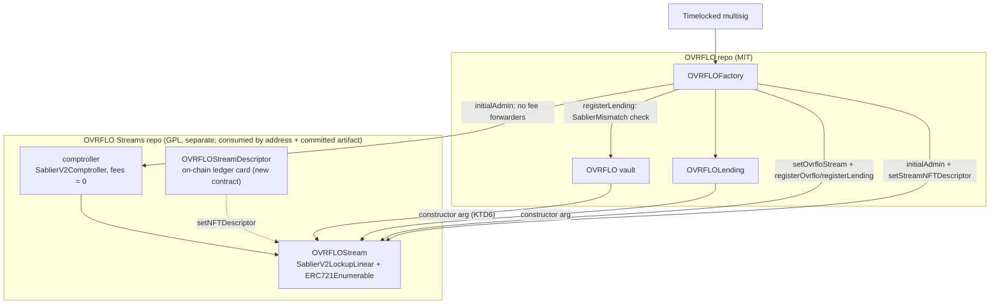
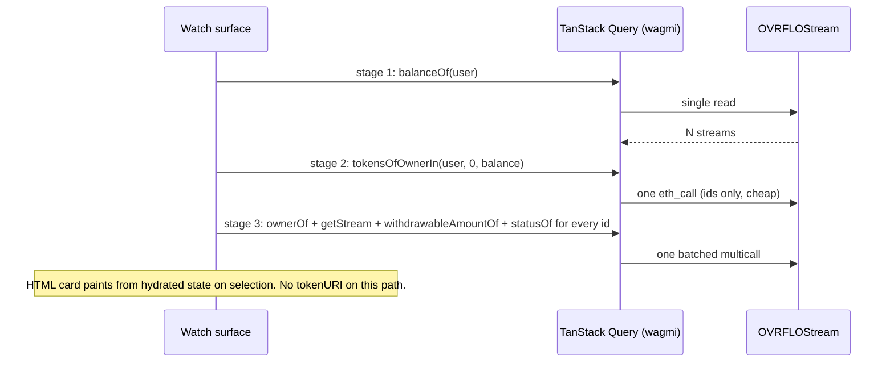

# OVRFLO Streams - Plan

## Goal Capsule

- **Objective:** Replace Sablier entirely with OVRFLO Streams. The Solidity contract name stays `SablierV2LockupLinear` (R1). The deployed ERC721 identity is `OVRFLOStream` (KTD5). The fork is the full v1.1.2 tree: LockupDynamic stays in-repo and is never deployed. Enumerable and a custom on-chain ledger-card NFT descriptor ship with the Linear lockup. Delivery is fork-first, then migrate through OVRFLO, OVRFLOLending, and the watch surface as a full vertical slice.
- **Authority hierarchy:** This plan > `docs/solutions/patterns/ovrflo-critical-patterns.md` > the minimality ladder in `docs/solutions/patterns/solidity-implementation-discipline.md`. Frontend work follows `docs/solutions/patterns/ovrflo-web-standard.md`.
- **Execution profile:** Two repos. Phase A units target the new fork repo (created by U1); Phase B and C units target this repo. Fork-first sequencing is a hard ordering constraint — no Phase B/C unit starts until U1-U4 are green.
- **Open blockers:** None. The wallet `tokenURI` SVG ships with no animation. Markets paints the ledger card in HTML and runs a CSS light band on the filled part of the progress bar (4s loop). The Vested ticker is local-clock math. A motion design on the SVG itself may be explored later via descriptor swap (R5).
- **Stop conditions:** Any evidence the v1.1 withdraw ACL cannot be preserved byte-for-byte; any Enumerable interaction that changes withdraw/transfer semantics; any fork deployable that cannot fit EIP-170 under the profile it actually deploys under. Surface and stop rather than adapt.
- **Product Contract preservation:** `PRODUCT.md` amended 2026-08-13 — collateral streams now name OVRFLO Streams rather than the Sablier deployment, and the log-scan sentence is replaced by the contract's own holder list. Product Contract unchanged from the brainstorm; its Outstanding Questions are resolved into KTD1/KTD5/KTD6 below, with descriptor data precision deferred to U3 as directional guidance.

---

## Product Contract

### Summary

Fork Sablier v2-core v1.1.2 into its own GPL repo as OVRFLO Streams, changing the deployed logic in exactly three ways: ERC721 becomes ERC721Enumerable (plus a paginated view helper), the NFT descriptor becomes a custom on-chain ledger card, and `create*` admits only a registered OVRFLO vault (`ovrfloInfo(msg.sender)`). LockupDynamic stays in the tree but is never deployed. Nothing is renamed: upstream identifiers stand in the fork (R1) and in this repo (R9), so the fork's diff against v1.1.2 stays reviewable. The only rename is the deployed ERC721 `name`/`symbol` (KTD5), which is all a user ever sees. The fork is completed first, then everything migrates: OVRFLO, OVRFLOLending, tests, seeding, docs, and the frontend rebind by address. The watch surface paints the ledger card in HTML as the stream's detail view. Wallet `tokenURI` is the still on-chain SVG of the same card.

### Problem Frame

OVRFLO's stream layer is currently the canonical Sablier v1.1 deployment. Sablier Labs has wound down protocol development and accelerated its BUSL-to-GPL license transition, which removes both the reason to depend on their deployment and the barrier to forking. Meanwhile the frontend deleted its indexers (2026-07-31) and discovers held streams by log-scanning — the one discovery path that resists browser-side reads — and the stream NFT's artwork is Sablier's, not renderable as OVRFLO's own instrument. Owning the stream layer solves all three at once: the roadmap stops depending on a sunsetting company, held-stream discovery becomes two contract reads, and the NFT art becomes a canonical OVRFLO artifact shared by wallets and the watch surface.

### Key Decisions

- **Canonical naming.** (session-settled: user-directed — the layer, repo, and product name is "OVRFLO Streams"; an individual stream is an "OVRFLO Stream"; `OVRFLOStream` is the identifier form, used only as an identifier and never glued to another noun in prose. Never write `OVRFLO-STREAM` or any hyphenated or all-caps variant. **Amended 2026-08-14:** this rule governs prose, product naming, and the deployed ERC721 identity only. It does *not* rename source identifiers — see R1 for the fork and R9 for this repo, both of which keep upstream names.)
- **Fork first, then migrate.** (session-settled: user-directed — obtain the v1.1.2 source and complete the fork's modifications first; only then migrate the OVRFLO repo, docs, and frontend.)
- **Fork v2-core v1.1.2 exactly; never the newer Lockup codebase.** (session-settled: user-directed — chosen over the newer GPL Lockup rewrite: v1.1's `withdraw` ACL (sender / NFT owner / approved operator only) is the load-bearing fact behind the disproof of the twice-raised third-party-withdrawal finding in `docs/audit/rejected-findings-record.md`; the newer Lockup's public withdraw-to-recipient path would resurrect it.)
- **Full-tree fork; LockupDynamic kept in-repo, never deployed.** (session-settled: user-directed — revised from delete-Dynamic after research showed upstream's test harness deploys both lockups and parameterizes shared tests over both: deleting Dynamic means restructuring the whole test tree, while keeping it costs only dead code. Deployment is Linear-only either way.)
- **Own repo under GPL-3.0-or-later; the OVRFLO repo stays MIT.** (session-settled: user-directed — chosen over an in-repo directory: the GPL boundary becomes the repo boundary; ABI interaction is not derivation.)
- **ERC721 becomes ERC721Enumerable.** (session-settled: user-directed — chosen over keeping plain ERC721 with a side registry: `balanceOf` + `tokenOfOwnerByIndex` gives indexerless held-stream discovery that natively tracks ownership through pledge/return transfers.)
- **Descriptor direction: ledger card.** (session-settled: user-directed — chosen over dot-ribbon, progress-arc, overflow-vessel, and combined directions across four visual-probe rounds: one segmented progress bar plus typographic data rows; densest reading and cheapest to render fully on-chain.)
- **The card is the stream's detail view; list rows keep the dot-ribbon idiom.** (session-settled: user-directed — chosen over replacing the streams lens rows with a card grid: rows scan better in bulk, and the existing watch-surface plan's row spec stays unchanged.)
- **Full replacement of the deployment, not aliasing.** (session-settled: user-directed — chosen over pointing at canonical Sablier: OVRFLO Streams fully replaces the Sablier deployment as the bound address and as the identity users see in their wallet. **Amended 2026-08-14:** the replacement is of the *deployment and the user-facing identity*, not of source identifiers. R1 and R9 keep upstream names in both repos. Provenance is recorded deliberately: audit records name Sablier v2-core v1.1.2 as the upstream source, because the withdraw-ACL disproof depends on that lineage staying legible.)
- **Zero protocol fees; factory is stream admin; the Safe reaches it only through factory forwarders.** (session-settled: user-directed — revises the earlier “Safe is admin at construction” wiring. Full admin control over the stream layer stays a goal; fees stay pinned to zero; admin is wired like every other OVRFLO contract: the factory is `initialAdmin` on `OVRFLOStream` and on the comptroller. The Safe owns the factory (`Ownable2Step`) and never calls the lockup or the comptroller. The factory forwards only the live lockup admin call (`setNFTDescriptor`). It does not forward `transferAdmin`, so stream admin cannot move, the same way lending `owner()` stays the factory because no `transferOwnership` forwarder exists.)
- **Mint gate is `ovrfloInfo(msg.sender)`, not `setMinter`.** (session-settled: user-directed — `msg.sender` is the vault that calls `create*`. The stream contract is not in `ovrfloInfo`. The lockup view-calls the factory; a zero treasury reverts, matching `_requireKnownOvrflo` at `src/OVRFLOFactory.sol:326-328`. There is no minter slot and no `setMinter`. One `OVRFLOStream` serves every registered vault. The factory stores that address; `registerOvrflo` and `registerLending` revert unless the vault and market bind it. (session-settled: user-directed 2026-08-14 — store the canonical stream on the factory.))
- **Pre-launch swap; no migration tooling.** (session-settled: user-approved — nothing is deployed anywhere that needs migrating off canonical Sablier.)
- **No external re-audit of the fork.** (session-settled: user-directed — the logic diff is surgical and documented; the v1.1 code is battle-tested and the existing ACL analysis carries over.)
- **PRB-Math stays in the fork.** `@prb/math` 4.0.2 is load-bearing in v1.1's vesting and fee math. The OVRFLO repo's no-PRB-Math rule governs that repo; the fork records this as a scoped exception rather than rewriting proven math.
- **Log-scan discovery is deleted, not kept as fallback.** Held streams come from Enumerable; pledged streams already come from `borrowerLoanCount`/`borrowerLoanAt` contract reads. One discovery mechanism per fact.

### Requirements

**Phase 1 — the fork (OVRFLO Streams repo)**

- R1. A new GPL-3.0-or-later repo contains the full Sablier v2-core v1.1.2 source tree, logic-identical except for the changes in R2-R4, with the seven BUSL-1.1 file headers updated to reflect the converted GPL grant. **Upstream identifiers are not renamed** — contracts, abstracts, interfaces, libraries, errors, NatSpec, and comments keep their v1.1.2 names, so `git diff v1.1.2 -- src/` shows only the intended diffs. `OVRFLOStream` throughout this plan names the *deployed identity*, not a Solidity contract name: the deployed contract is `SablierV2LockupLinear` with the ERC721 `name`/`symbol` of KTD5. The same holds for the comptroller — deployed identity "OVRFLO Streams comptroller", Solidity contract `SablierV2Comptroller`. The single exception is the descriptor: it is new code, not upstream code, so naming it costs no diff and its Solidity contract name **is** `OVRFLOStreamDescriptor` (U3). (session-settled: user-directed 2026-08-14 — chosen over a tree-wide rebrand, which measured 983 identifier replacements across 117 files. The rename buys presentation; it costs the upstream diff permanently, and a reviewable diff against v1.1.2 is what lets an auditor confirm the fork is "v1.1.2 plus three changes" in one command and lets a future v1.1.2 advisory be triaged in seconds. Renaming later costs the same as renaming now; the diff, once spent, does not come back.)
- R1b. The fork's diff against `v1.1.2` stays small, and every file in it is accounted for. The fork README carries a "Deviations from upstream v1.1.2" table; every file that `git diff --stat v1.1.2 -- src/` reports appears in that table, and every table row names the cause — R2, R2b, R3, R4, or the license conversion. Nothing changes for naming alone. The table is the reviewed artifact; the diff is what falsifies it. A reviewer enumerates every deviation from audited upstream code without reading the tree.
- R2. The Linear lockup (`SablierV2LockupLinear`) inherits OZ ERC721Enumerable; its two transfer-hook overrides gain the required `super` calls so Enumerable's index bookkeeping runs on every mint, transfer, and burn. A view-only pagination helper `tokensOfOwnerIn(owner, start, stop)` returns the owner's ids for enumeration indices `[start, stop)` in one call — name, range convention, and bounds semantics salvaged from ERC721AQueryable (MIT); implemented as a pure view loop over Enumerable's own functions (no state, no ACL surface). Note the adaptation: ERC721A's original ranges over token ids; ours pages the owner's enumeration indices.
- R2b. Every `create*` entry point view-calls `IOVRFLOFactoryRegistry(factory).ovrfloInfo(msg.sender)` and reverts when `treasury == address(0)`, matching `_requireKnownOvrflo` at `src/OVRFLOFactory.sol:326-328`. `msg.sender` is the vault that mints. The stream contract is not in `ovrfloInfo`. The lockup declares `address public immutable factory`, set at construction to the same address as `initialAdmin` (the factory); the getter is `factory()`. The fork declares its own minimal registry interface — the single `ovrfloInfo(address)` getter, returning the three fields in the order `OVRFLOFactory` declares them (`treasury`, `underlying`, `ovrfloToken`; `src/OVRFLOFactory.sol:67-71`) — and does not import this repo. Reading the field positionally is safe because the factory is immutable and the lockup binds one factory immutably at construction, so the two cannot drift apart. The main repo adds no accessor for this; the existing public mapping getter is the interface. There is no `minter` storage and no `setMinter`. Users, the lending market, and the Safe are not create callers. R2b does not pin `params.sender` or `params.asset` — those stay vault `deposit` plus `StreamPricing.requireEligible` and the R12 filter. Nothing else gains a caller check — withdraw, transfer, approve, and burn stay as in v1.1.
- R2c. Fork-repo inherited create tests do not use `OVRFLOFactory`. Their setup deploys a mock registry as `factory` / `initialAdmin` whose `ovrfloInfo` returns a non-zero treasury for any non-zero argument, so upstream create-from-user suites keep running. Production `ovrfloInfo` returns zeros for an unknown vault.
- R3. The v1.1 `withdraw` access control is preserved byte-for-byte: only the stream sender, NFT owner, or approved operator can withdraw; no public withdraw path exists.
- R4. A custom NFT descriptor renders the ledger card entirely on-chain from live stream state: streamed percentage, segmented progress bar, streamed and remaining amounts, rate per day, days remaining, the calendar end date (the date the loan concludes), asset symbol, stream id, status, and OVRFLO Streams branding — no external assets or URLs. Strings read from external contracts (the asset symbol) are length-capped, character-whitelisted, and fall back safely. R2b admits only a registered vault as `msg.sender`. It does not pin `params.sender` or `params.asset`. Sender and asset correctness stay vault `deposit` plus `StreamPricing.requireEligible` (borrow) and the R12 filter. Symbol sanitization still runs because the descriptor is hot-swappable, and it keeps `tokenURI` total.
- R5. The descriptor remains hot-swappable: deploy a replacement, then the Safe calls the factory forwarder in R19, which calls the lockup's `setNFTDescriptor`. The Safe does not call the lockup.
- R6. The comptroller deploys with all fees at zero. Admin applies to the comptroller and `OVRFLOStream` only — the descriptor is stateless and admin-less by design. Production, local seed, and devnet set the **factory** as `initialAdmin` on both at construction. Upstream `Adminable` is one-step with no `acceptAdmin`, unlike Ownable2Step on the factory, so a wrong construction admin is unrecoverable — do not pass the Safe or the deployer. Fork-repo inherited tests keep using their own test sender as admin (R2c); that suite never talks to `OVRFLOFactory`.
- R7b. **The fork repo will be public, and the inherited suite cannot go with it.** 155 `test/` files are `UNLICENSED` (OQ1), and `test/Base.t.sol` and `test/utils/Defaults.sol` are among them. Every test written for R2, R2b, and R4 must therefore stand on its own harness — its own setup, its own fixtures, no import of upstream's base or defaults — or the public repo ships tests that cannot compile. The inherited suite stays a **local-only** gate: it proves the fork did not break upstream behavior on the implementer's machine and in the private mirror, and it never runs in public CI. State that limitation in the fork README rather than letting a reader assume the public test count is the whole story.
- R7. The fork repo's test suite is the inherited v1.1.2 upstream suite with two named exceptions — the descriptor test tree (14 unit files, the integration token-uri tests, and `NFTDescriptorMock`) is *replaced* because it drives internals the new descriptor does not have, and `test/utils/Precompiles.sol` + its test are *deleted* (135 KB of pinned upstream bytecode, BUSL-headered, whose `deployCore` returns a non-Enumerable lockup) — plus a third named exception: the inherited create tests are adapted per R2c rather than deleted. New tests cover only the diffs: Enumerable behavior across mint/transfer/burn, descriptor `tokenURI` validity across stream states, and a contract-size gate for every fork deployable — `SablierV2LockupLinear`, `SablierV2Comptroller`, and `OVRFLOStreamDescriptor` — against the EIP-170/EIP-3860 caps.

**Phase 2 — migration (OVRFLO repo)**

- R8. The vault's stream-layer binding, the lending market's constructor binding, and the factory's registration checks all bind to one `OVRFLOStream` deployment. The factory stores that address (`ovrfloStream`, new storage plus a one-shot `setOvrfloStream`). `registerOvrflo` and `registerLending` revert unless the candidate binds `factory.ovrfloStream()`. This is **not** an on-chain duplicate of multisig work: the factory's stated architecture is register-don't-construct, where every registration re-verifies on-chain the constructor-arg bindings that construction fixed. `oracle` is the exact precedent — a factory-wide value that `registerOvrflo` checks candidates against via `OracleMismatch` (`src/OVRFLOFactory.sol` constructor and registration path). `ovrfloStream` has the same shape and gets the same treatment; it cannot be a constructor immutable only because the factory is deployed before the lockup that binds it. Today's inline hardcode at `src/OVRFLO.sol:117` makes all vaults agree for free, and KTD6 removes that guarantee — R8 is what replaces it. One consequence must be written down and carried into U7's docs: **after KTD6, matching audited vault bytecode no longer implies a correct stream binding.** Identical audited creation code with a hostile constructor argument produces a vault whose constructor grants that address unlimited ovrfloToken approval (`src/OVRFLO.sol:293`). The vault is inert for deposits until registered and the Safe's existing checklist covers constructor args, so this is not a protocol hole — but from KTD6 onward, registration in `ovrfloInfo` is the only safe "is this a real vault" predicate, and bytecode identity is not. The frontend and any future integrator must be told this.
- R9. Sablier-named identifiers in the OVRFLO repo and frontend are **not** renamed. `ISablierV2LockupLinear`, `sablierLL`, `sablier`, `SablierMismatch`, `SABLIER_LOCKUP_ADDRESS`, `SABLIER_ADDR`, and `MockSablier` keep their names; what changes is the **value** each resolves to and the interface's member list (U5). The vocabulary sweep is retired. (session-settled: user-directed 2026-08-14 — the rename is churn with no functional effect: this repo never compiles the fork (KTD1), so fork-internal naming is invisible here, and the deployed identity users see is the ERC721 `name`/`symbol` of KTD5. Renaming stays available later at unchanged cost.) The one non-negotiable documentation consequence is R11.
- R10. Local seeding (`script/seed-local.sh`) and production follow the Deploy sequence in High-Level Technical Design. The suite's pinned canonical address constants (`test/fizz/Base.sol`, fork tests) rebind to the fork's deployment.
- R11. `docs/audit/sablier-interface-contract.md`, `docs/audit/rejected-findings-record.md`, and `AGENTS.md` are updated from the canonical deployment to the fork — same ACL table, with provenance recorded as "fork of Sablier v2-core v1.1.2" — so the audit record stays live. This survives R9's retirement and is the load-bearing documentation change: the twice-disproven H-2/H-1 finding rests on the withdraw ACL of the contract at `0xAFb979d9afAd1aD27C5eFf4E27226E3AB9e5dCC9`, and `sablierLL` no longer resolves there. The fork preserves the v1.1 ACL byte-for-byte (R3), so the disproof still holds — but a reviewer who reads "sablier", checks the canonical deployment, and reaches the right answer has done so by luck rather than from evidence. State the address change, name the fork as the bound contract, and cite R3.

**Phase 2 — migration (web/)**

- R12. Held-stream discovery uses `balanceOf` + the paginated `tokensOfOwnerIn` view (R2) on `OVRFLOStream`; the log-scan module (`web/lib/discovery/stream-discovery.ts`) and its event-intersection approach are removed. Hydrated results render only streams whose sender is a registered OVRFLO vault **and** whose asset is that vault's ovrfloToken — both halves, matching `renderEligibleStream` at `web/hooks/useStreams.ts:85`. The stricter borrow-route predicate at `:101` stays separate.
- R13. Pledged-stream/loan discovery continues through existing `borrowerLoanAt`/`borrowerLoanCount` contract reads; no indexer or log scan remains anywhere in stream or loan discovery.
- R14. The streams lens keeps its dot-ribbon rows per the existing watch-surface plan; selecting a stream paints the ledger card in HTML as the detail view, from already-hydrated stream state. Wallet `tokenURI` is a still SVG: no SMIL, no CSS animation, gold frontier on a streaming bar, ink on settled and depleted. Structure is locked: 24-segment bar; the last filled streaming cell is gold (ink elsewhere); the depleted variant swaps "Days left" for "Withdrawn". HTML uses app font tokens; SVG stays generic monospace — that split is intentional, not drift. The HTML layout anchor is `.scratch/design/ovrflo-stream-ledger-card.html`. Markets HTML runs a CSS light band along the filled part of the progress bar on a 4 second loop. The band's base state is fully transparent and clipped to the fill. Under `prefers-reduced-motion: reduce`, the band is off and `RollingNumber` decorative transitions freeze; the vested value still comes from local math. The wallet image shows a finished bar. Bar segment count and the percent label come only from last-hydrated `streamedAmountOf` (or the equivalent batch field). The HTML fill is a snapshot from last hydration — selection, remount/visibility-regain, or a mutable-storage change — never a timer (KTD9). `RollingNumber` alone uses the local clock; hero vested and card bar may diverge between 15s polls by design. Markets does not fetch `tokenURI` to paint the card. The live ticker (`RollingNumber`, local clock, `web/lib/payoff.ts`) is the sole ground truth for streamed value. (session-settled: user-directed 2026-08-14 — motion is the bar band in Markets HTML, not SMIL in the NFT.)
- R15. The frontend's stream-layer address configuration points at the `OVRFLOStream` deployment.
- R16. The lens reads the holder's full id list and hydrates every stream in one pass, with no paging control and no truncation warning. It carries a defensive ceiling on the id count: `MAX_ENUMERATION_IDS` (`500n` in `web/lib/lending-math.ts`), the same constant `useBorrowerBook` already uses. Past that ceiling the book reads unavailable, never partial and never empty, because a partial list of financial positions is worse than an honest refusal. The ceiling is not expected to bind: dead streams are hidden from display, and R17 removes some of them at settlement. No lens count is displayed, since the region brief's copy rules forbid one and the id count would over-count what the lens filters out. The detail card paints only the selected stream, from hydrated state.
- R17. At settlement, on every path that returns the NFT (`close`, and `repay` when remaining is zero), `OVRFLOLending` disposes of the pledged stream one of two ways: it burns the stream when the stream is empty, and returns it otherwise. Decide the branch after money movement, never inside a draw. `claim` can empty the stream while the loan stays open; a later full repay must not return that depleted NFT. The burn is best-effort — if it reverts for any reason the market returns the stream instead, because the settlement's money movement must never depend on the disposal. The burn happens before any transfer back, since the market must still own the token to burn it. The burn's job is the wallet list: Markets already hides empty rows (KTD2), but a returned depleted NFT still sits in the holder's wallet and in `balanceOf`. Keep `Closed(uint256 indexed loanId, uint128 drawn)`. Also emit `StreamDisposed(uint256 indexed loanId, address indexed borrower, uint256 streamId, bool burned)` on both branches. A burn `Transfer` to `address(0)` does not carry the borrower. Foundry asserts the `StreamDisposed` topic.
- R18. The burn is a tidiness measure, not a bound on the holder's list. A loan's draw only empties a stream on an exact-value alignment, and a borrower can leave a residual deliberately by repaying one wei before settlement. The lens therefore carries its own bound (R16) and does not rely on R17.
- R19. `OVRFLOFactory` is `initialAdmin` on the lockup (`SablierV2LockupLinear`, deployed identity `OVRFLOStream`) and on the comptroller (`SablierV2Comptroller`). It stores the canonical lockup address and exposes one `onlyOwner` forwarder for the live lockup admin call, matching the `setLendingFee` shape at `src/OVRFLOFactory.sol:291-297`:
  - `setOvrfloStream(address stream)` — revert if already set, on a zero address, or on `stream.code.length == 0`; require `ISablierV2LockupLinear(stream).factory() == address(this)`, `admin() == address(this)`, and `comptroller.admin() == address(this)`; store `ovrfloStream`. The factory is deployed before the lockup, so this call cannot be a constructor argument. A wrong set is unrecoverable; the deploy sequence reads `factory.ovrfloStream()` back (SC23).
  - `setStreamNFTDescriptor(address descriptor)` — revert on a zero descriptor or `descriptor.code.length == 0`, then `ISablierV2LockupLinear(ovrfloStream).setNFTDescriptor(descriptor)`. **It takes no vault argument** (amended 2026-08-14). One lockup serves every registered vault, so a vault parameter would select nothing while making the call look vault-scoped — an operator could believe they were repainting one vault's NFT art and repaint every vault's, on a Safe transaction that is hard to rehearse. The factory already holds the address; use it.
  The factory does **not** expose forwarders for `transferAdmin` (lockup or comptroller), `setComptroller`, `claimProtocolRevenues`, `setProtocolFee`, `setFlashFee`, or `toggleFlashAsset`. Those functions stay `onlyAdmin` on the fork contracts; with admin = factory and no forwarder they are unreachable code. `registerOvrflo` reverts unless `factory.ovrfloStream()` is set and `vault.sablierLL() == factory.ovrfloStream()`. `registerLending` verifies vault and lending bind the same stream and that it equals `factory.ovrfloStream()`. It does **not** re-check `stream.factory()` or `stream.admin()` (amended 2026-08-14): `setOvrfloStream` already verified both, `factory` is immutable, and `admin` cannot move because no `transferAdmin` forwarder exists — so re-checking them on a per-market path is dead code. `comptroller.admin() == address(this)` is the one genuinely new check and moves into `setOvrfloStream`, where the lockup is adopted. `ISablierV2LockupLinear` gains `factory()`, `admin()`, `comptroller()`, and `setNFTDescriptor`. **Each binding failure gets its own error** (amended 2026-08-14). `SablierMismatch` keeps its existing meaning — vault and lending bind different streams — and does not absorb the new checks. Add `StreamNotCanonical` (candidate binds a stream other than `factory.ovrfloStream()`), `StreamFactoryMismatch`, `StreamAdminMismatch`, and `ComptrollerAdminMismatch`. Four bytes each, and in a deploy sequence where a wrong value is unrecoverable the revert is the operator's only diagnostic — one error covering four distinct failures is a real debuggability loss.

### Acceptance Examples

- AE1. **Covers R2, R12.** Given a seeded local fork where a user has deposited twice, when the watch surface loads with no indexer process running, then both OVRFLO Streams appear under the Streams lens via Enumerable reads alone.
- AE2. **Covers R12, R13.** Given a user pledges a stream via `borrow`, when the watch surface refreshes, then the stream leaves the held list (NFT now owned by the market) and the loan appears through `borrowerLoanAt` — nothing is lost and nothing double-lists.
- AE3. **Covers R4, R14.** Given any live stream, when its row is selected, then the detail view shows the ledger card with percentage, amounts, rate, end date, and status matching on-chain state. Markets may run the CSS band on the filled bar. A wallet fetching `tokenURI` at the same state sees the same figures without the band. With a mocked clock advance and no hydration refresh, the hero ticks and bar percent and cells stay fixed.
- AE4. **Covers R3.** Given an address that is neither sender, NFT owner, nor approved operator, when it calls `withdraw` on any stream, then the call reverts exactly as on canonical v1.1.
- AE5. **Covers R1b.** Given the completed fork, when `git diff --stat v1.1.2 -- src/` is run in the fork repo, then every file it reports appears in the README's "Deviations from upstream v1.1.2" table with its cause named, and no file changes for naming alone. The expected set at completion is: the seven license-converted files from U1 (`SablierV2Comptroller`, `SablierV2LockupDynamic`, `SablierV2LockupLinear`, `abstracts/SablierV2Base`, `abstracts/SablierV2FlashLoan`, `abstracts/SablierV2Lockup`, `libraries/Helpers`), both lockups for R2b's create gate, `SablierV2LockupLinear` and its lockup abstract for R2, a new `src/interfaces/IOVRFLOFactoryRegistry.sol`, the deleted `SablierV2NFTDescriptor.sol` plus its now-orphaned `libraries/NFTSVG.sol` and `libraries/SVGElements.sol`, `libraries/Errors.sol` for the orphaned descriptor error, and the new `src/OVRFLOStreamDescriptor.sol`. (Replaces the retired vocabulary sweep: R9 no longer renames, so a "Sablier" sweep would return the whole tree by design.)
- AE6. **Covers R17.** Given a stream that settlement drew to empty — constructed so the gross price divides evenly by the fill unit — when the loan settles, then the market burns the stream and it leaves the holder's list. Given a stream with any residual, when the loan settles, then the stream returns and stays in the list. Given a burn that reverts, when the loan settles, then the money movement still completes and the stream returns.
- AE7. **Covers R12.** Given a hydrated stream whose sender is not a registered vault, or whose asset is not that vault's ovrfloToken, when the Streams lens renders, then that stream does not appear. R2b does not pin sender or asset, so the filter is load-bearing. The scenario is arranged with mocked reads.
- AE8. **Covers R6, R19.** Given a registered vault whose stream layer has `admin() == factory`, when the factory owner calls `setStreamNFTDescriptor` with a new descriptor, then the lockup's descriptor updates. When the factory owner calls `setNFTDescriptor` on the lockup directly, the call reverts. When any address other than the factory calls `transferAdmin` on the lockup or the comptroller, the call reverts. The factory has no `transferAdmin` forwarder.
- AE9. **Covers R2b.** Given an address whose factory `ovrfloInfo` treasury is zero, when that address calls any `create*` on `OVRFLOStream`, then the call reverts. Given a registered vault, when `OVRFLO.deposit` calls `create*` (`msg.sender` is the vault), then the stream mints.
- AE10. **Covers R8, R19.** Given `factory.ovrfloStream()` is unset, when `registerOvrflo` is called, the call reverts. Given `factory.ovrfloStream()` is set, when `registerOvrflo` is called with a vault bound to a different stream, the call reverts. When `registerLending` is called with a market bound to a different stream than `factory.ovrfloStream()`, the call reverts. When `setOvrfloStream` is called a second time, the call reverts.

### Success Criteria

- The E2E suite passes on a seeded local fork with no indexer and no log-scan code path in the tree.
- The descriptor renders a valid data-URI SVG for every reachable stream status (streaming, settled, depleted) with zero external references.

### Scope Boundaries

- LockupDynamic deployment — the contract stays in the fork repo, its tests running with the suite but is never deployed; only `OVRFLOStream`, the comptroller, and the descriptor ship.
- Migration tooling of any kind — pre-launch swap; nothing live moves.
- Indexers or log-scan fallbacks — removed outright.
- Marketplace or brand art beyond the ledger card. Visual tokens may be refined at build time; segment count, gold frontier, depleted Withdrawn row, and snapshot-vs-ticker split are locked in R14/U9.
- Vault logic changes — rebinding only (KTD6's constructor-arg change is binding plumbing, not logic). `OVRFLOLending` is the one exception: R17 adds the settlement burn.
- Continued support for the canonical Sablier deployment anywhere in the stack.
- List paging and virtualization — the list holds only live streams, so the lens reads all of them.

### Dependencies / Assumptions

- Sablier's BUSL-to-GPL transition is accelerated and effective — the v1.1.2 sources are forkable under GPL now. U1 converted the seven BUSL file headers. The remaining BUSL-1.1 file is `test/utils/Precompiles.sol`; U2 deletes it (SC1).
- OpenZeppelin versions no longer collide. The fork compiles only in its own repo against its own 4.9.2 pin, which is what its inherited tests verified against. This repo keeps 4.9.0 for its own sources and never links the fork's.
- `@prb/math` 4.0.2 remains a fork dependency (Key Decisions).
- Read batching relies on wagmi's `useReadContracts` (viem multicall under the hood) with the default mainnet Multicall3, which also exists on the seeded local mainnet fork.

### Sources / Research

- `docs/audit/sablier-interface-contract.md` — the pinned v1.1 ACL table the fork must preserve; `docs/audit/rejected-findings-record.md` — why the v1.1-exact fork is load-bearing.
- Sablier v2-core `v1.1.2` tag (github.com/sablier-labs/v2-core) — fork source of truth; do not source from `main` or newer Lockup tags. `v1.1.2` is annotated, so `git rev-parse v1.1.2` returns the tag object `b1b7f168295fcb6122a8279bd66eae82f3a66d46`, which is not a commit. The commit is `a4bf69cf7024006b9a324eef433f20b74597eaaf` (2023-12-19); cite that in provenance.
- `ERC721AQueryable` (github.com/chiru-labs/ERC721A, MIT) — interface precedent for the pagination helper; verified signature `tokensOfOwnerIn(address owner, uint256 start, uint256 stop)` returning ids in `[start, stop)`.
- `docs/plans/2026-08-11-003-feat-watch-surface-markets-experience-plan.md` — the streams-lens row spec R14 keeps.
- `web/hooks/useBorrowerBook.ts` — the staged, budgeted enumeration pattern KTD2 mirrors; `web/lib/discovery/stream-discovery.ts` + `web/hooks/useStreams.ts` — the log-scan path R12 removes.

---

## Planning Contract

### Key Technical Decisions

- KTD1. **The fork is a drop-in replacement consumed by address, exactly as the canonical deployment is today.** (session-settled: user-directed — chosen over a git submodule: this repo has never compiled Sablier. It holds an interface and calls a deployed address, and that works. The fork changes nothing about that shape.) The repo carries a committed `OVRFLOStream` artifact — ABI plus deployment bytecode — beside the interface, stamped with the fork commit hash and the solc settings that produced it. All three deployables get one — the lockup, the comptroller, and the descriptor — in Foundry artifact shape, so the cheatcodes accept them. Each committed artifact and its provenance file carry GPL-3.0-or-later notices, a Corresponding Source pointer (fork repo tag and commit), and a statement that the object code is GPL even though surrounding MIT sources that only call by address are not derivative. Seeding and fork tests deploy from that bytecode with `cast send --create` and `vm.getCode`; `forge create` cannot deploy a contract this repo does not compile, and `vm.etch` must never be used for it, because the constructor never runs and the factory immutable would carry another deployment's value. `foundry.toml` gains read access to the artifact directory, without which the cheatcode reverts. The frontend generates types from the ABI through a direct contract entry, not the Foundry plugin, which globs a compiled output directory and would match nothing while exiting zero. Four consequences follow, and each replaces a submodule-era rule: the fork compiles only in its own repo under its own profile, so there is no two-profile divergence; OpenZeppelin resolves to the fork's own 4.9.2, which is the version its tests verified against; the fork's size gate lives in the fork repo, because nothing here compiles it; and the test fixtures keep their mock rather than constructing the real contract.
- KTD2. **Held-stream discovery reads the holder's list, then the state of every stream on it** (`web/hooks/useBorrowerBook.ts` is the staging pattern): stage 1 `balanceOf` (single read), stage 2 `tokensOfOwnerIn` for the ids, stage 3 per-stream state (`ownerOf`, `getStream`, `withdrawableAmountOf`, `statusOf`) batched for every id in one pass. No stage is capped or staged by viewport. Viewport staging was considered and dropped: the entry gate reads "ids ready, zero rows hydrated" as confirmed-empty, so it would route a holder to first-run with no row left to trigger hydration. `ownerOf` stays in the set as the ownership gate: `getStream` never reverts for a stream the caller no longer owns, so without it a pledged stream renders in Streams *and* as a loan. Markets paints the selected stream's ledger card from already-hydrated state. It does not fetch `tokenURI` on the watch path. The lens shows a stream only when its `getStream` sender is a registered OVRFLO vault **and** its asset is that vault's ovrfloToken — both halves, matching `renderEligibleStream` at `web/hooks/useStreams.ts:85`; the stricter borrow-route predicate at `:101` stays separate. Empty streams are hidden from the list. Two failure shapes are benign shrinkage — an out-of-bounds index read and a `notNull` revert on a burned id — and both drop that one stream, keep the rest, and reconcile next poll; neither flips the book unavailable. Stream ids stay `bigint` end-to-end into the detail view's read args, because wagmi hashes `5n` and `5` to different query keys and a coerced id risks mis-encoded calldata. All merged calls share identical `query.enabled` predicates (W5); results live in TanStack Query only (W2); amounts use bigint-only math (B3).
- KTD3. **Inherit the upstream v1.1.2 test suite; write new tests only for the diffs.** (session-settled: user-directed — chosen over authoring a fresh suite: the inherited tests already prove withdraw ACL, vesting math, comptroller, and ERC721 basics; new coverage is limited to Enumerable, descriptor, and the size gate.)
- KTD4. **No paging control and no virtualization for the streams lens.** (session-settled: user-directed — revised from load-more paging after review showed the staged variant deadlocks the entry gate and that no observer or virtualization machinery exists anywhere in `web/`.) R17's burn is tidiness only; R16's defensive ceiling is the bound, so the lens renders every live row up to that ceiling.
- KTD5. **The rename is limited to the deployed ERC721 identity.** `name` and `symbol` are constructor-baked string literals with no setter; they are the only names a user ever sees, in their wallet and on any marketplace. They become `"OVRFLO Stream"` / `"OVRFLOStream"`, replacing `"Sablier V2 Lockup Linear NFT"` / `"SAB-V2-LOCKUP-LIN"`. **Ordering is binding:** the upstream descriptor dispatches on the symbol string, so the values cannot change until U3 has replaced the descriptor. No source identifier anywhere is renamed — not in the fork (R1), not in this repo or the frontend (R9). Block explorers will show the verified contract name as `SablierV2LockupLinear`; that is accepted, standard for forks, and does not reach the product surface. (session-settled: user-directed 2026-08-14 — supersedes the earlier tree-wide rename table.)
- KTD6. **The vault's stream-layer binding becomes a constructor argument, mirroring OVRFLOLending.** Today `src/OVRFLO.sol:117` initializes the immutable inline with the canonical Sablier address, which pre-existed the vault. `OVRFLOStream`'s address is not known at authoring time, so the inline hardcode would force a deploy-then-edit-source-then-deploy loop. A constructor arg keeps the immutable, and the factory's existing registration check (`SablierMismatch`) still verifies vault and lending bind to the same stream layer. Deploy scripts and test fixtures pass the address explicitly.
- KTD7. **Seeding follows the Deploy sequence.** `script/seed-local.sh` runs the numbered Deploy sequence below. Against Anvil, factory, vault, and lending use `forge create` + `cast send` (never `forge script --broadcast` — foundry#11714). The three fork contracts use `cast send --create` from the committed artifacts (KTD1). The `SABLIER=` variable is load-bearing (the seeded borrow's stream-NFT approval step uses it), so it is rebound to the deployed `OVRFLOStream` address — not renamed, not deleted.
- KTD8. **ABI codegen includes the fork artifact.** `web/wagmi.config.ts` reads the committed `OVRFLOStream` ABI so `web/lib/generated.ts` carries typed reads for `balanceOf`, `tokensOfOwnerIn`, `getStream`, `withdrawableAmountOf`, and `tokenURI`. The ABI is a checked-in file, not a build product of this repo, so codegen does not depend on compiling the fork.
- KTD9. **The app computes the streamed value; one cadence polls the fields a person changes.** (session-settled: user-directed — revised 2026-08-14: drop the 5s ETHSKILLS Rule 5 cadence. Rule 5 is for interactive confirmation loops. A linear vest is local math. Mutation reads use the app's existing `READ_INTERVAL_MS` (15s).) A stream's `sender`, `asset`, `startTime`, `endTime`, `cliffTime`, and `amounts.deposited` never change after creation, so the app computes the streamed value from them and the **local clock** (`RollingNumber` plus `web/lib/payoff.ts`), which is how Sablier's own app shows progress. RPC does not drive the ticker. The stream batch polls at **`READ_INTERVAL_MS` (15_000)** to catch fields a person changes: `amounts.withdrawn`, `amounts.refunded`, cancel, deplete, and owner (pledge/return). `getStream` returns fixed and changing fields in one struct, so the first successful read caches the fixed values and the same interval covers mutations. Splitting cadences would save nothing: a multicall already bundles the batch. The card is never polled. ETHSKILLS Rule 5 ("~2-5s for interactive apps") does not apply to this vest. Three rules follow. The app clock read stays on its existing cadence for skew (`SKEW_MAX_SAMPLE_AGE_SECONDS` in `web/lib/payoff.ts`); the ticker does not wait on that read. The client formula stays display-only — no withdraw amount, max button, or gate derives from it, because the on-chain formula truncates twice and the client formula truncates once. And staleness needs its own bound: this app marks data stale only when a read fails, so U8 adds an age bound, following `projection.md:75`'s disposition that a set past its bound is **discarded** rather than shown behind a warning. That rule's home is the entry this plan deletes, so U8 relocates it into `chain.stream-truth` under the same ADR that records the trust move. Wiring needs a seam that does not exist today: add `dataUpdatedAt` on `ReadOutcomeMetadata`, thread it through `sourceFromOutcome`, and add `now` and `maxAgeMs` on `FreshnessInput`, so `BorrowFlow`'s signing gate can see it. Freshness caption and `signingAllowed` are **per lens** (streams / borrowed / supplied), not a merge of every source. U8 aligns the pledged-stream hook to the same cadence, or records why that hook may differ.

### High-Level Technical Design

Deployment and binding topology after migration:

**Deploy sequence (binding).** Production, local seed, and devnet use this order. After each deploy, read the named getters and fail the script on mismatch (SC23). Anvil seed uses `forge create` + `cast send` for factory, vault, and lending (compiled in this repo, CP#2). It deploys the three fork contracts with `cast send --create` from the committed artifacts (KTD1), the same path production uses. Production deploys the factory with `forge script --broadcast` (`script/OVRFLO.s.sol`). `vm.etch` is forbidden.

1. Deploy `OVRFLOFactory(safe, pendleOracle)`. Read `owner() == safe` and `oracle() == pendleOracle`.
2. Deploy the comptroller — Solidity contract `SablierV2Comptroller(factory)`, deployed identity "OVRFLO Streams comptroller" — with all fees at 0. Read `admin() == factory`.
3. Deploy `OVRFLOStreamDescriptor` (the one contract in the fork with an OVRFLO Solidity name, per U3). Read `code.length > 0`. The descriptor has no admin.
4. Deploy the lockup — Solidity contract `SablierV2LockupLinear(factory, comptroller, descriptor)`, deployed identity `OVRFLOStream`. Read `admin() == factory` and `factory() == factory`. Read the comptroller and descriptor bindings.
5. The Safe calls `setOvrfloStream(stream)`. This verifies `stream.factory()`, `stream.admin()`, and `comptroller.admin()` all equal the factory (R19). Read `factory.ovrfloStream() == stream`. A second call reverts (`Covers AE10.`).
6. Deploy `OVRFLO`. Pass the factory as the existing `admin` argument. Add `stream` as the new last argument (KTD6). Read `factory()` and `sablierLL()` on the vault (R9: that getter keeps its name). Do not add `ovrfloStream()` on the vault — that getter lives on the factory.
7. Off-chain: the vault creation transaction matches the audited artifact. The Safe calls `registerOvrflo(vault)`. On-chain: `vault.sablierLL() == factory.ovrfloStream()`. After this call, `ovrfloInfo(vault)` is non-zero and that vault can mint. There is no `setMinter` transaction. An address with treasury zero calling `create*` reverts (`Covers AE9.`).
8. Deploy `OVRFLOLending(factory, vault, stream)`. Read `owner() == factory` and the stream binding equals `vault.sablierLL()`.
9. Off-chain: the lending creation transaction matches the audited artifact. The Safe calls `registerLending(lending)`. On-chain: the bound stream equals `factory.ovrfloStream()`, and `SablierMismatch` still proves vault and lending bind the same stream address. Do not re-check `stream.factory()`, `stream.admin()`, or `comptroller.admin()` — step 5 already did (R19).
10. The Safe calls `prepareOracle`, waits until the TWAP window is ready, then `addMarket`, then `setLendingTickSpacing`.
11. Write the deployment artifact: factory, vault, lending, stream. Frontend `required()` on the stream address.

Do not pass the Safe or the deployer as `initialAdmin` on the lockup or the comptroller. Fork-repo inherited tests are not this sequence: they pass a mock registry as `factory` / admin (R2c).

Staged discovery (one hydration pass, no paging):

### Assumptions

- The inherited v1.1.2 suite compiles and passes unmodified, since nothing is renamed; LockupDynamic stays in the tree and is never deployed. Upstream test helpers (PRB test utils and friends) come along as fork dev-dependencies.
- Fizz fixtures keep the mock and existing etch behaviour (KTD1). Real `OVRFLOStream` bytecode is constructed only in U6 seed and fork tests, never via `vm.etch`.
- The lens carries a defensive ceiling on the id count, set in U8. R17's burn does not bound the list — it fires only on an exact-value alignment and a borrower can defeat it with a one-wei repay — so the ceiling is the bound. Reaching it renders the book unavailable, never partial.
- Index stability: `tokenOfOwnerByIndex` order shifts on transfers (swap-and-pop). viem chunks large read batches, so stage-2 reads may straddle block boundaries; consistency comes from dedup by stream id across chunks and poll cycles (batch size is tunable if stricter atomicity is ever wanted), so a mid-cycle transfer causes at worst one stale row until the next 15s poll.

### Open Questions

**Resolved during the sweep (kept for provenance)**

- OQ1 (resolved 2026-08-14 — implemented, not open). Upstream's `test/` tree is SPDX `UNLICENSED`: Sablier granted no rights over it, and the BUSL→GPL fast-forward converts only files that were BUSL, so it grants nothing there. **The settled approach is non-conveyance, and it is already built.** The fork is a plain local clone, not a GitHub fork; the 155 `UNLICENSED` files are retained locally for verification and are never distributed. Full history including them lives in a local bare mirror at `~/ovrflo-streams-full.git`, and a pristine copy in `~/ovrflo-streams-inherited-tests-v1.1.2.tar.gz`. The repo **will be public**, which makes two things binding rather than optional: (1) the public repo is created from a scrubbed branch — `fork/bring-up` carries all 155 files in history, so pushing it publishes them and a later deletion commit does not retract them; use an orphan commit or `git filter-repo --invert-paths`, gated by a pre-push check that `grep -rl "SPDX-License-Identifier: \(UNLICENSED\|BUSL-1.1\)"` over the publish tree returns empty; (2) `LICENSE.md` gets the scope note in SC4. The earlier GitHub-ToS §D.5 reasoning is withdrawn — it was scoped to reproduction *through* GitHub's forking feature and does not reach a local clone.
- OQ2 (resolved — burn at settlement). Whether a stream ends depleted is a function of borrow ratio: a loan near the stream's face value draws it empty at settlement, while a smaller loan returns a live residual stream to the borrower. `OVRFLOLending` already holds the NFT through the loan and knows which case it is at `close`/`repay`, so it burns a depleted stream instead of returning a dead token — enumeration stays clean at the source, with no lens-side policy and no user-facing burn affordance. U5 runs R17 on both return paths: `close`, and `repay` when `remaining == 0`. `claim` can empty the stream while the loan stays open; a later full repay must not return that depleted NFT. This is a logic change in `OVRFLOLending` (main repo, not the fork). The 2026-08-14 review keeps R17 in the first slice: Markets already hides empty rows; a returned depleted NFT still sits in the wallet.
- OQ3 (resolved 2026-08-14 — factory stores the canonical stream). `setOvrfloStream` is `onlyOwner` and once. `registerOvrflo` and `registerLending` revert unless the candidate binds `factory.ovrfloStream()`.
- OQ4 (resolved 2026-08-14 — user-directed). The fork repo is a separate project, the same way canonical Sablier is today. This repo does not compile it, vendor it, or choose its package manager. Fork-repo npm vs vendored helpers is not an OVRFLO decision.
- OQ5 (resolved 2026-08-14 — user-directed). `supportsInterface(IERC4906)` stays as v1.1 left it (undeclared / false). Do not add interface advertising outside R2–R4.

**Deferred to implementation**

- None. Fork-repo tooling (OQ4) and `IERC4906` (OQ5) are settled.

### Sweep Contracts

Rules from the 2026-08-13 ignorance-lens sweep (8 lenses: on-chain SVG, ERC721Enumerable internals, Foundry build, Sablier lifecycle, wagmi/viem reads, fixture fidelity, GPL mechanics, deploy ops). Each is review-blocking for its owning unit. Rules whose absence would have made plan text wrong are already point-fixed above; these are the additions.

**Fork bring-up (U1)**
- SC1. Delete `test/utils/Precompiles.sol` and its test: 135 KB of pinned upstream bytecode under a BUSL header, whose `deployCore()` returns a non-Enumerable lockup that would silently stand in for ours. **Ownership moved to U2 (2026-08-14):** U1 shipped without it, so the file is still present and is the fork's only remaining BUSL-1.1 header. Do it in U2's first commit — it removes five of the six known-red tests in the `test-optimized` baseline, which makes real Enumerable regressions readable.
- SC2. Record the right to fork with a reproducible citation — `license-dates.sablier.eth`, text key `eth.sablier.license-change-date`, resolved value and resolution date — not press coverage. The pointer named inside v1.1.2's own LICENSE.md is dead.
- SC3. Ship a dated "Changes from upstream v1.1.2" notice distinct from the provenance line (GPL §5(a) requires stating modification and date, separately from lineage).
- SC4. The fork's `LICENSE.md` is currently the bare GPL-3.0 text, which is exactly the blanket claim this rule forbids — the three-way split lives only in `README.md`, and license detectors, package registries, and anyone skimming the repo root read `LICENSE.md`. Add a scope note at its head: the GPL grant covers `src/`, `script/`, `vendor/`, and the GPL-headered test utilities; the remaining `test/` files are upstream's under their own headers and are not conveyed. Open as of 2026-08-14. Committed artifacts under this MIT repo carry the same GPL-3.0-or-later notices and Corresponding Source pointer as KTD1.

**Enumerable swap (U2)**
- SC5. Commit `forge inspect SablierV2LockupLinear storage-layout` to the fork README: layout diverges from the canonical deployment, so slot-addressed fixtures against it are invalid.
- SC6. `totalSupply()` is the live-NFT count, not the stream count (`nextStreamId - 1`); NatSpec must say so, since Enumerable's interface flag invites explorers to read it.
- SC7. `_beforeConsecutiveTokenTransfer` does not exist on OZ 4.9.0's `ERC721` (only inside `ERC721Consecutive`, which the fork does not inherit) — nothing to override, no search needed.

**Descriptor (U3)**
- SC8. Treat `cliffTime == startTime` as *no cliff* and render no cliff row — v1.1 stores `cliff: 0` that way, and the newer Sablier's `cliffTime = 0` encoding is a version-confusion trap of the same family as the withdraw ACL.
- SC9. Build PENDING and CANCELED fixtures with `createWithRange`/`cancelable: true` in the fork repo — OVRFLO's own create params make both unreachable, so the status matrix cannot be exercised from vault-originated streams.

**Migration (U5)**
- SC10. Add one fizz property against the existing mock: for every actor, `balanceOf` equals the suite's ownership-filtered mirror and `tokensOfOwnerIn(actor, 0, balanceOf)` is exactly that id set. Prune burned ids from `actorStreams` in the closure sweep, or `_actorStream`'s `ownerOf` reverts once R17 burns anything. The pledge/return churn is the only place enumeration meets adversarial ordering, and `Base.sol`'s "Sablier exposes no per-owner enumeration" comment becomes false — the mirror silently turns into an unchecked second source of truth.
- SC23. Document each contract's constructor arguments in the provenance file. With no source in this repo, three places encode them from memory, and `Adminable` is one-step, so a swapped `initialAdmin` is unrecoverable. Production and seed pass the factory address, never the Safe and never the deployer. Every deploy reads `admin()` back and fails on mismatch — the seed script already does this elsewhere.
- SC24. Derive the stream address rather than accept it. The deployment verifier copies unknown fields through untouched, so a supplied address would ship unverified inside a document that reads as verified. Read it from the vault, check the code is non-empty, cross-check the lending market's binding, and add it to the identity field list and the environment gate.

**Audit continuity (U7)**
- SC12. Extend the preserve-exactly set from the withdraw ACL alone to the S1-S5 rows of `docs/audit/sablier-interface-contract.md`, including `createWithDurations` cliff encoding (vault `deposit` passes `durations.cliff: 0`; v1.1 stores that as `cliffTime == startTime`), the consume-side check `StreamPricing.requireEligible` (`CliffPresent` when `cliffTime != startTime`), the withdraw-hook branch predicate, and `getStream`'s SETTLED `isCancelable` normalization. Do not treat `StreamPricing.sol:209` as the create-side arithmetic — that line is the consume-side check.
- SC13. **Zero protocol fees are immutable by construction, not policy — claim this, do not undersell it.** Admin on the lockup and comptroller is the factory; `Adminable` is one-step; the factory forwards `setNFTDescriptor` and nothing else, and deliberately has no `transferAdmin` forwarder. So `setProtocolFee`, `setFlashFee`, and `toggleFlashAsset` can never be called by anyone — not the Safe, not a future owner, not a compromised owner. A `transferStreamAdmin` forwarder was considered and **rejected 2026-08-14 (user-directed)**: it would hand back the ability to enable fees, which is the same post-deploy mutability the project rejected when it chose Sablier V2 over V4. It buys nothing in return — the only thing an immovable admin forecloses is a *replacement* factory adopting an existing lockup, and anyone replacing the factory is deploying a new system with its own contracts. Art swaps through the current factory keep working for as long as it is the admin, which is forever. Human control is unaffected: the factory is `Ownable2Step`, so a Safe rotation carries stream admin with it. The live stream-admin surface is the factory: `setOvrfloStream` (once) and the R19 forwarder `setStreamNFTDescriptor`. `setComptroller`, `claimProtocolRevenues`, and the comptroller fee setters (`setProtocolFee`, `setFlashFee`, `toggleFlashAsset`) stay on the fork contracts as `onlyAdmin` and are **not** forwarded, so they cannot succeed once admin is the factory. `transferAdmin` is likewise unforwarded. Do not add a generic factory `execute`. `claimProtocolRevenues` pays `msg.sender`; if it were ever forwarded, tokens would land on the factory, which has no sweep — another reason it stays unforwarded while fees are zero.

**Test harness (U8, U9, U10)**
- SC11. **U8 owns this, not U5.** A fix in the fork repo is invisible here until the artifact is regenerated and staged, so the gate needs a runner and a comparand, not just a stamp. Put a check in `web/package.json`'s `pretest` — the existing `check-wagmi-dedupe` script is the precedent — that rebuilds the fork at the stamped tag and compares bytecode. The fork must set `bytecode_hash = "none"`, or metadata makes the rebuild differ by construction. Keep the stamp in a sibling provenance file rather than inside the artifact, so review reads something diffable, and add `.gitattributes` marking the artifact generated — a 50KB hex line otherwise lands in every diff, including the immutable build's own diff comparison. U5 commits the three artifacts; U8 adds the pretest compare.
- SC16. There is no transport mock in `web/`. Every hook test mocks the `wagmi` module above TanStack, so timer and cache behaviour cannot be observed. Assert the options object passed to the mocked hook instead — one merged batch carries `READ_INTERVAL_MS` (15s); fixed fields are client-cached after first success.
- SC17. Simulate a failed read as a `{status:"failure"}` entry inside the results array, mixed with successes — not as a rejected promise. `web/tests/hooks/useLending.test.ts:8` is the shape (`const failure = (error) => ({ status: "failure" as const, error })`). Do not copy `web/tests/hooks/useBooks.test.tsx:13` — that line is the success helper.
- SC18. Multi-render behaviour needs `rerender()` with changed mock returns between renders. A single-render assertion passes without exercising it.
- SC19. `npm --prefix web run test` already runs `pretest` (npm lifecycle). Name `pretest` in this unit's verification so an explicit `npx vitest` path cannot skip the banned-pattern, ABI-dedupe, and SC11 bytecode gates. Do not claim that `npm run test` skips `pretest`.
- SC20. Every E2E stream Given arranged outside the app's write flow ends with the `the frontend re-syncs with chain state` step (`web/tests/e2e/steps/common.ts:65`).

**Fork dependencies (U1)**
- SC21. `solarray` has no git tag and no license file. It is one import-free helper used by six retained test files. Inline the helper and drop the dependency rather than vendoring unlicensed code into a public repo.
- SC22. **Superseded 2026-08-14.** The premise was that solady is test-only and leaves with the descriptor tests. It does not: U3's descriptor uses `DateTimeLib.timestampToDate` for the calendar end date, so solady becomes *runtime* code. Move it from `devDependencies` to `dependencies` in U3 rather than removing it.

**Discovery and card (U8, U9)**
- SC14. `useReadContracts` batches only within one hook call, so the list's state reads stay in one query rather than splitting into several that each poll independently.
- SC15. A descriptor hot-swap emits `BatchMetadataUpdate`, which wallets honor and this app can no longer hear; the descriptor address (or a pinned version) belongs in the card's cache key so the app is not the worse renderer of its own artifact.

---

## Implementation Units

| U-ID | Title | Key files | Depends on |
|---|---|---|---|
| U1 | Fork repo bring-up | fork repo (new) | — |
| U2 | ERC721Enumerable swap | fork: lockup abstract | U1 |
| U3 | Ledger-card descriptor | fork: descriptor | U1 |
| U4 | Fork deploy wiring | fork: deploy script | U2, U3 |
| U5 | Main-repo rebind | src/, interfaces/, test/ | U4 |
| U6 | Seeding + fork tests | script/, test/fork/ | U5 |
| U7 | Docs and audit rebind | docs/, AGENTS.md | U5 |
| U8 | Discovery swap | web/hooks/, web/lib/ | U5 |
| U9 | Watch surface card and rows | web/components/watch/ | U8, U5 |
| U10 | E2E streams coverage | web/tests/e2e/ | U9 |

### U1. Fork repo bring-up

- **Goal:** The OVRFLO Streams repo exists: full v1.1.2 source, unrenamed, inherited tests green against a recorded baseline.
- **Status: complete (2026-08-14), commits `e56dc1fe`..`cf75c264` in the sibling repo `OVRFLO-Streams` on branch `fork/bring-up`.** Seven BUSL headers converted; `LICENSE.md` is now the GPL text; `CHANGES.md` carries the dated GPL §5(a) modification notice (SC3). AE5 verified: `git diff --stat v1.1.2 -- src/` is seven files, seven SPDX lines, no code. Baseline recorded in the fork's README before any change, both runs excluding `test/fork/*` (no `MAINNET_RPC_URL` bound): 624/625 under `forge test --no-match-path "test/fork/*"`, 619/625 under the same path filter with `FOUNDRY_PROFILE=test-optimized`, with both failure sets characterized as pre-existing (a `MemoryOOG` toolchain artifact in a LockupDynamic test, and the five `Precompiles_Test` bytecode-equality tests that R7 deletes). `upstream` is push-disabled; a bare local mirror at `~/ovrflo-streams-full.git` holds full history including the inherited suite; `~/ovrflo-streams-inherited-tests-v1.1.2.tar.gz` holds all 155 UNLICENSED files pristine.
- **Requirements:** R1, R6 (naming per KTD5).
- **Dependencies:** none.
- **Files:** New repo, upstream paths unchanged — `src/SablierV2LockupLinear.sol` (the deployed lockup), `src/SablierV2Comptroller.sol`, `src/SablierV2LockupDynamic.sol`, `src/SablierV2NFTDescriptor.sol`, shared abstracts/libraries/types, `test/` (inherited suite), `foundry.toml`, `LICENSE.md` (GPL-3.0-or-later), `CHANGES.md` (dated GPL §5(a) modification notice, SC3), `README.md` (provenance, license split, deviations table, recorded baseline).
- **Approach:** Import the `v1.1.2` tag verbatim (never `main`). Keep the full tree — LockupDynamic included, never deployed — so the shared test harness needs no surgery. **Rename nothing** (R1): no identifier, NatSpec, or comment changes, so the inherited suite runs unmodified and `git diff v1.1.2` stays readable. The ERC721 name/symbol move in U3, not here, because the *old* descriptor dispatches on the symbol string and would revert `tokenURI` the moment it changes. Update the seven BUSL headers to the converted GPL grant, and mirror upstream's actual three-way license split rather than one blanket claim. Record the pre-change test baseline before touching anything — without it, "a failing inherited test means the fork broke something" is not a true statement. The fork keeps upstream's npm dependency set as-is; nothing outside the fork repo compiles it (KTD1), so no vendoring is needed. `solarray` is the one exception, and it is a prerequisite to the first build rather than a pre-publication cleanup: upstream pins `github:evmcheb/solarray#0625e7e`, which no longer resolves, so `pnpm install` fails outright on a clean checkout. It also carries no license and no tag. Vendor a fresh reimplementation of the helpers the suite calls (`uint256s`, `addresses`, `uint128s`, `uint40s`; max arity 3, 3, 7, 7) and remap `solarray/` at it so no call site changes. The retained inherited suite must match the recorded baseline after the R2c fixture adaptation — from that point a deviation from baseline means the fork broke logic, **except** for the bytecode-pinned and descriptor-pinned tests named in R7, which are legitimately replaced or deleted. Run `FOUNDRY_PROFILE=test-optimized forge test` as a second gate: several upstream tests (including the bytecode-equality and `tokenURI` golden tests) are profile- or address-gated and pass vacuously under a plain `forge test`.
- **Patterns to follow:** Upstream v1.1.2 repo layout and its own foundry profile. The fork repo is the sole compile and deploy origin (KTD1), so its own settings are the ones that ship and there is no second profile to reconcile.
- **Test scenarios:** Inherited suite green under both `forge test` and `FOUNDRY_PROFILE=test-optimized forge test`, matching the recorded baseline exactly (this is the unit's primary verification). Because nothing is renamed, any deviation from baseline is a real regression, not a rename artifact.
- **Verification:** `forge build` and `forge test` green in the fork repo against the recorded baseline counts.

### U2. ERC721Enumerable swap

- **Goal:** The Linear lockup enumerates ownership on-chain without changing any transfer or withdraw semantics. The Solidity name stays `SablierV2LockupLinear` (R1). `OVRFLOStream` is the deployed ERC721 identity (KTD5), not a contract rename in this unit.
- **Requirements:** R2, R2b, R2c, R3, R7.
- **Dependencies:** U1. (U3 is *not* a dependency: KTD5 moved the ERC721 `name`/`symbol` change into U3, so nothing here needs the new descriptor. U2 and U3 can run in parallel; U4 serializes them before deploy wiring.)
- **Files:** fork repo — the lockup abstract (base declaration, both transfer hooks, `tokenURI`'s `override(IERC721Metadata, ERC721)` list), a new `src/interfaces/IOVRFLOFactoryRegistry.sol`, both lockups' `create*` entry points, `test/` additions for enumeration. **Do not touch the `ERC721(...)` constructor calls** — the name and symbol strings stay upstream's until U3.
- **Approach:** Inherit ERC721Enumerable; change `_beforeTokenTransfer` to `override(ERC721, ERC721Enumerable)`, drop `view`, name the `batchSize` parameter and forward it verbatim (never a literal `1` — that silently deletes Enumerable's batch guard), call `super._beforeTokenTransfer(...)` before the transferability check; keep `_afterTokenTransfer`'s metadata-update behavior with its super call. Add the `tokensOfOwnerIn(owner, start, stop)` view helper (R2) — a bounds-clamped loop over `tokenOfOwnerByIndex`. Declare the registry interface as a new file `src/interfaces/IOVRFLOFactoryRegistry.sol`, holding only the `ovrfloInfo(address)` getter with the field order `OVRFLOFactory` declares (`treasury`, `underlying`, `ovrfloToken`; `src/OVRFLOFactory.sol:67-71`). A standalone file reads better in the diff than an interface inlined in the lockup, and AE5 expects it by that path. Set `address public immutable factory` from the same constructor argument as `initialAdmin`. At the start of every `create*` (Linear `createWithDurations` / `createWithRange`, and LockupDynamic's two), view-call `ovrfloInfo(msg.sender)` and revert when `treasury == address(0)` (R2b). There is no `setMinter`. Fork-repo tests deploy a mock registry as `factory` / admin per R2c. Leave the `ERC721(...)` constructor calls alone — changing the symbol before U3 replaces the descriptor reverts every `tokenURI` call (the upstream descriptor dispatches on the symbol string at `src/SablierV2NFTDescriptor.sol:290-296`). Nothing else gains a caller check. No other logic changes — the withdraw ACL body is untouched (stop condition if that proves impossible).
- **Patterns to follow:** `ERC721AQueryable` (`chiru-labs/ERC721A`, `contracts/extensions/ERC721AQueryable.sol`, MIT) — salvage the `tokensOfOwnerIn` name, the `[start, stop)` range convention with `start < stop` required, and its clamping behavior; the implementation here loops OZ Enumerable's per-owner index, not ERC721A's packed-storage id scan.
- **Test scenarios:** Happy: mint two streams → `balanceOf` 2, `tokenOfOwnerByIndex` returns both ids. Transfer: pledge-shaped `transferFrom` moves the id between owners' enumerations atomically. Burn: a burned depleted stream leaves both owners' enumerations, and afterwards `tokenURI`/`ownerOf` revert while `getStream` still succeeds. `withdrawMaxAndTransfer`: enumeration mutates correctly including the contract-recipient hook case. `supportsInterface`: ERC721, ERC721Metadata, and ERC721Enumerable all report true. `IERC4906` stays unadvertised, matching v1.1 — do not add a report for it (OQ5). `totalSupply()` diverges from `nextStreamId - 1` after a burn. Creation gate: a caller whose mock `ovrfloInfo` treasury is zero reverts on every `create*`; a caller with non-zero treasury mints (`Covers AE9.`). There is no `setMinter` selector. Identity is unchanged here and asserted in U3, not U2: `symbol()` still returns the upstream value, so inherited `tokenURI` tests stay green. Edge: non-transferable stream still reverts transfer (hook check preserved). Helper: `tokensOfOwnerIn` returns exact pages, clamps out-of-range windows, reverts on `start >= stop`, and returns empty for a zero-balance owner. Regression: inherited withdraw ACL tests still green (`Covers AE4.`).
- **Verification:** New enumeration tests plus the full inherited suite green; `SablierV2LockupLinear` runtime and initcode pass the size gate post-swap (the Enumerable addition is the one change that grows the lockup's bytecode). `forge inspect` uses that Solidity name, not `OVRFLOStream`.

### U3. Ledger-card descriptor

- **Goal:** `OVRFLOStreamDescriptor` renders the locked ledger-card direction fully on-chain, and the deployed ERC721 identity becomes OVRFLO's.
- **Requirements:** R4, R5, R7 (KTD5).
- **Dependencies:** U1.
- **Files:** fork repo — `src/OVRFLOStreamDescriptor.sol` (new; the upstream `src/SablierV2NFTDescriptor.sol` is deleted, not edited, so the diff reads as a replacement), the now-orphaned `src/libraries/NFTSVG.sol` and `src/libraries/SVGElements.sol` (deleted with it — nothing else imports them), `src/libraries/Errors.sol` (drop the orphaned `SablierV2NFTDescriptor_UnknownNFT`), size-gate test (mirroring `test/DeploySize.t.sol`'s cap-loop pattern), descriptor tests, and the lockup's `ERC721(...)` constructor call.
- **Naming:** the descriptor is the one contract in the fork that is not upstream code, so naming it costs no diff. Its Solidity contract name **is** `OVRFLOStreamDescriptor`. Every other contract keeps its upstream name (R1).
- **Identity change (KTD5), and it belongs here:** once the upstream descriptor is gone, the symbol string no longer dispatches anything, so `ERC721("Sablier V2 Lockup Linear NFT", "SAB-V2-LOCKUP-LIN")` becomes `ERC721("OVRFLO Stream", "OVRFLOStream")` in the same unit. Doing it earlier reverts `tokenURI` (the upstream descriptor dispatches on the symbol at `src/SablierV2NFTDescriptor.sol:290-296`); doing it later leaves a window where the deployed identity and the descriptor disagree. There is no setter — a wrong value here survives to mainnet. LockupDynamic's own `ERC721("Sablier V2 Lockup Dynamic NFT", "SAB-V2-LOCKUP-DYN")` is left untouched: it is never deployed, so nothing user-facing reads it, and changing it would demand a second identity KTD5 does not supply.
- **Approach:** Implement the descriptor interface's single `tokenURI` view: JSON metadata with embedded data-URI SVG — 24-segment progress bar plus typographic rows (streamed %, streamed/remaining amounts, rate per day, end date, asset symbol, stream id, status) and OVRFLO Streams branding. The bar's fill is a static snapshot derived from `streamedAmountOf`, never from a render-time timestamp — streamed amount is frozen for canceled and depleted streams. The card emits no `<animate>` element at all (R14). A streaming bar marks the last filled cell in gold; settled and depleted bars are ink. The emitted root carries `xmlns`, numeric `width`/`height`, a matching `viewBox`, and `preserveAspectRatio`; the first painted child is an opaque full-viewBox rect, so the card stays readable on a white background, in print, and in forced-colors mode. The font stack ends in the generic `monospace` keyword and names no face the app loads, because an image cannot load the app's fonts. Asset symbol and any external-contract string are sanitized per R4 (length cap, character whitelist, safe fallback). Neither OZ 4.9 `Strings` nor PRB-Math renders decimals, and upstream truncates with integer division (a realistic ~0.027/day rate would print `0`) — so U3 owns a fixed-point renderer: split integer/fraction, zero-pad to `decimals`, truncate to 4 significant digits. Render both the days remaining and the calendar end date. The depleted variant swaps "Days left" for "Withdrawn". `solady`'s `DateTimeLib.timestampToDate` provides the conversion. This **promotes** solady from a test-only dev dependency to a runtime one — move it from `devDependencies` to `dependencies`, because the descriptor is deployed code. This supersedes SC22, which assumed solady left the tree with the descriptor tests. Every row carries an explicit character budget with upstream-style clamps and `textLength`/`lengthAdjust`, calibrated against the widest plausible fallback font rather than the author's local one — SVG text neither wraps nor shrinks. Status maps to a card variant per state. The vault's own create parameters — `cancelable: false`, `cliff: 0`, and a start at the current block — are what make `PENDING` and `CANCELED` unreachable. R2b restricts the caller, not the parameters, so the two are separate facts. The card therefore ships three variants (streaming, settled, depleted), and the status mapping stays **total**: an unexpected status renders a fallback variant rather than reverting `tokenURI`. No external references of any kind, and none of upstream's `external_url` envelope.
- **Patterns to follow:** Upstream descriptor's string-building approach for gas-safe SVG assembly; `test/DeploySize.t.sol` for the size gate.
- **Test scenarios:** One `tokenURI` validity test per status state (decodes as JSON, values match seeded stream state) (`Covers AE3.`). The vault's create parameters make `PENDING` and `CANCELED` unreachable in production, so those fixtures go; a totality test still asserts every status value maps to a variant. Solidity can only check text, so U3 also exports golden outputs per status; U9's web tests parse them with `DOMParser` and assert no parser-error node. That is the only real well-formedness gate in the stack. Hostile symbol: a mock ERC20 whose symbol carries quotes, angle brackets, and oversize length yields valid, inert JSON/SVG. No animation: no status variant emits an `<animate>` element. Root element: the emitted root carries `xmlns`, `width`, `height`, `viewBox`, and `preserveAspectRatio`, and the first painted child covers the full viewBox with an opaque fill. Fonts: no emitted `font-family` names a face under `web/public/fonts/`. Formatting: a sub-1-token/day rate and a sub-1-token streamed amount both render real digits, not `0` or `< 1`. Overflow: maximum-length values in every row stay inside the card. Burned id: `tokenURI` reverts (construct the depleted case without burning). Edge: zero-streamed and fully-streamed render sane bars. Size gate: descriptor runtime and initcode under the EIP-170/EIP-3860 caps, mutation-tested by temporarily lowering the cap.
- **Verification:** Descriptor tests green; `forge build --sizes` shows headroom.

### U4. Fork deploy wiring

- **Goal:** Fork-repo deploy script and README match the constructor order in the Deploy sequence (comptroller → descriptor → lockup). Production and seed pass `initialAdmin` = factory (R6).
- **Requirements:** R6.
- **Dependencies:** U2, U3.
- **Files:** fork repo — deploy script, README deploy section.
- **Approach:** Constructor order matches Deploy sequence steps 2–4. Fees pinned zero at deploy. `initialAdmin` and immutable `factory` are the same constructor argument; production and seed set both to the factory. Fork-repo tests may still pass a mock registry as admin / `factory` so the inherited suite can call `onlyAdmin` and `create*` without `OVRFLOFactory` (R2c). Smoke-verify `setNFTDescriptor` from that test admin post-deploy. Document that OVRFLO production never uses that direct call — it uses `setStreamNFTDescriptor` on the factory after `setOvrfloStream` (HTD step 5). `registerOvrflo` is not a prerequisite for the forwarder.
- **Test scenarios:** Deploy-order test: fresh deployment ends with `admin() == factory()`, `factory()` equal to the configured factory, zero fees, descriptor wired, and `create*` succeeding only for an address the mock (or registered vault) admits. Test expectation beyond that: none — remaining behavior is covered by U1-U3 suites. The full Deploy sequence, including factory-first and `registerOvrflo`, is U6. Factory-forwarder behavior is U5 (AE8).
- **Verification:** Scripted deploy against a local Anvil produces a working stream layer.

### U5. Main-repo rebind

- **Goal:** The OVRFLO repo binds the fork deployment, the interface carries the members R17 and R19 call, and `close` plus a completing `repay` dispose of depleted streams. **No identifiers are renamed** (R9). Unit, fuzz, and invariant suites stay on the existing mock (KTD1). Real fork bytecode is proven in U6.
- **Requirements:** R8, R17, R19 (KTD1, KTD6).
- **Dependencies:** U4.
- **Files:** `artifacts/OVRFLOStream.json` (lockup — committed ABI + bytecode + provenance stamp), `artifacts/SablierV2Comptroller.json`, `artifacts/OVRFLOStreamDescriptor.json` (KTD1: all three deployables), `interfaces/ISablierV2LockupLinear.sol` (members added, name unchanged), `src/OVRFLO.sol`, `src/OVRFLOLending.sol`, `src/OVRFLOFactory.sol`, `script/lib/OVRFLOTestFixtures.sol` and `script/lib/OVRFLOSeedRunner.sol` (both construct the vault — they break at compile time on KTD6's new arg), `test/fizz/Base.sol`, `test/fizz/mocks/MockSablier.sol` (extended, not renamed), `test/mocks/LendingMocks.sol` + `test/helpers/LendingMockFixture.sol` (extended only — see Approach), `test/DeploySize.t.sol`, `test/OVRFLO.t.sol` (zero-address guard family), unit tests. Commit U3's descriptor golden fixtures beside the fork artifact stamp so U9 can parse them.
- **Approach:** Commit the fork artifact with its provenance stamp (KTD1). `interfaces/ISablierV2LockupLinear.sol` keeps its name and path; it gains `burn(uint256)`, `isDepleted(uint256)`, `factory()`, `admin()`, `comptroller()`, and `setNFTDescriptor` — R17 calls the first two, R19 calls the last four. Vault's binding becomes a constructor arg (KTD6) — immutable stays, inline hardcode goes; `SablierMismatch` keeps its name and its existing vault/lending address-equality check, and does **not** absorb R19's new checks — those get distinct errors (`StreamNotCanonical`, `StreamFactoryMismatch`, `StreamAdminMismatch`, `ComptrollerAdminMismatch`) so a failed Safe deploy step names its own cause. Add `setOvrfloStream` and `setStreamNFTDescriptor` on `OVRFLOFactory` per R8 and R19. `registerOvrflo` and `registerLending` require `factory.ovrfloStream()` set and equal to the candidate's stream binding. They do not re-check `stream.factory()`, `stream.admin()`, or `comptroller.admin()` — those stay on `setOvrfloStream` (R19). Do not add forwarders for `transferAdmin`, `setComptroller`, `claimProtocolRevenues`, or comptroller fee setters, and add a test that the factory ABI has no such selectors. The fizz fixtures keep `MockSablier` — this repo never compiled Sablier and does not compile the fork either, so the fixture mechanism is unchanged and neither the etch behaviour nor the storage layout moves. The mock gains `burn` and `isDepleted`, and its `withdraw` latches depletion the way `SablierV2LockupLinear` does, or R17's branch cannot be exercised. `MockLendingSablier` gains the same two and stays a deliberate injection harness. `MockLendingSablier` (`test/mocks/LendingMocks.sol`) **stays**, unrenamed. It is a deliberate state-injection harness whose levers (a stored `withdrawable` scalar, minting `withdraw`, caller-chosen stream ids) real vesting cannot provide, and the invariant suite's warp-and-vest excursions depend on them; its fidelity counterpart is U6's fork tests, not the invariant runner. Run R17 on every path that returns the NFT: `close`, and `repay` when `remaining == 0`. `claim` can empty the stream while the loan stays open (harvest withdraw in `src/OVRFLOLending.sol`). A later full repay then transfers the NFT without a draw of its own (`repay` at remaining zero). After the money movement, if the stream reports empty, burn; otherwise transfer back. Wrap the burn so a revert falls through to the transfer. Never derive the branch from a zero withdrawable or a zero outstanding — both are true of live streams, and the burn would revert. Emit `StreamDisposed` per R17 on both branches; keep `Closed(loanId, drawn)`. Three test helpers read ownership after close or a completing repay and would revert on a burned token — the fizz `_actorStream` helper plus two in the Foundry invariant suite — so add a try-or-zero accessor and a burned-id set they skip. Guard the new constructor arg: revert on `address(0)` and require `code.length > 0`, since the mismatch check passes when both bindings are zero. NatSpec that names the stream layer says "OVRFLO Stream". Regenerate `.gas-snapshot` — Enumerable adds ~5 storage writes per mint and touches every pledge/return.
- **Patterns to follow:** the existing `interfaces/ISablierV2LockupLinear.sol` boundary — a hand-kept interface against a deployed address; error-naming convention in `docs/solutions/patterns/ovrflo-coding-standard.md`.
- **Test scenarios:** Full existing unit/fuzz/invariant suites green against the existing mock (primary). New: factory registration still reverts `SablierMismatch` when vault and lending bind different stream layers, unchanged by this plan. `registerOvrflo` reverts when `factory.ovrfloStream()` is unset or the vault binds a different stream (`Covers AE10.`). `registerLending` reverts when the bound stream is not `factory.ovrfloStream()` (`Covers AE10.`). It does not re-check `stream.factory()`, `stream.admin()`, or `comptroller.admin()` — those stay on `setOvrfloStream`. `setOvrfloStream` reverts on a second call, a zero address, a code-less address, and a stream whose `factory()`, `admin()`, or comptroller `admin()` is not the factory — each with its own error. ABI shape: a test pins `ovrfloInfo(address)`'s selector and its three-address return tuple with `treasury` first. The fork reads that field positionally from a hand-written interface (R2b), `src/StreamPricing.sol:9-19` holds a third hand-written copy, and no compiler links any of them to the struct — so a field reorder would today be caught by nothing, and the mint gate would keep passing while reading `underlying`. One test covers all three copies. Add NatSpec at `src/OVRFLOFactory.sol:67` naming the off-repo consumer and stating that `treasury` stays field 0. Mint gate against the factory + mock stream: a deposit from the registered vault mints; a `create*` from an unregistered address reverts (`Covers AE9.` at unit level). `Covers AE8.` factory owner updates the descriptor through `setStreamNFTDescriptor`; a direct lockup `setNFTDescriptor` from that owner reverts; factory ABI has no `transferAdmin` selector; a zero or code-less descriptor reverts. Close emits `StreamDisposed` with borrower and burned flag on both branches (`Covers AE6.` at unit level against the mock). A completing `repay` after `claim` has emptied the stream burns and emits `StreamDisposed` with `burned = true`. A completing `repay` on a residual stream transfers the NFT back and emits `StreamDisposed` with `burned = false`. A burn that reverts still completes the money movement and returns the stream (`Covers AE6.`). `Covers AE4.` third-party withdraw against the real fork is U6.
- **Verification:** `forge build` then `forge test` green; `FOUNDRY_PROFILE=invariant forge test --match-contract OVRFLOLendingInvariant` green; `forge build --sizes` diffed against pre-change values for the four existing deployables.

### U6. Seeding + fork tests

- **Goal:** Local seeding and the fork-test suite run against a deployed `OVRFLOStream`.
- **Requirements:** R6, R10, R19 (KTD7).
- **Dependencies:** U5.
- **Files:** `script/seed-local.sh`, `script/OVRFLO.s.sol` (production runbook rewrite — its comment block *is* the operator runbook), `script/SeedDevnet.s.sol`, `script/lib/OVRFLOSeedRunner.sol`, `tools/scripts/bootstrap-devnet.sh`, `script/local-stress-test.sh`, `tools/scripts/walkthrough-local.sh`, `test/fork/*.sol`, `tools/scripts/write-deployment-artifact.mjs`, `tools/scripts/write-env.sh`, `foundry.toml` (artifact read permission), `web/scripts/verify-deployment-input.mjs`, `test/helpers/VaultMockHelpers.sol`, `web/app/risk/riskCopy.ts`.
- **Approach:** Follow the Deploy sequence (High-Level Technical Design). Against Anvil, factory, vault, and lending use `forge create` + `cast send` (CP#2 — never `forge script --broadcast`). The three fork contracts use `cast send --create` from the committed artifacts (KTD1). `SeedDevnet.s.sol` / `OVRFLOSeedRunner` deploy those three via `vm.getCode` of the committed artifacts, not `forge create` of a local contract name. The `SABLIER=` variable is load-bearing (the seeded borrow's stream-NFT approval step uses it), so it is rebound to the freshly deployed `OVRFLOStream` address — not renamed, not deleted. The deployed address flows through the existing deployment pipeline — `tools/scripts/write-deployment-artifact.mjs` gains a stream field and `tools/scripts/write-env.sh` emits `NEXT_PUBLIC_SABLIER_LOCKUP_ADDRESS` — mirroring how the vault and lending addresses reach the frontend. The devnet path (`SeedDevnet.s.sol` via `bootstrap-devnet.sh`) legitimately uses `forge script --broadcast` — CP#2 is Anvil-only, do not rewrite it. The address must reach the frontend through `required()` validation in *both* runtime profiles and the artifact's chain-verified field set: an absent env var currently degrades to `address(0)`, whose `balanceOf` returns 0 and renders the lens ready-empty — the silent-empty outcome R16 forbids, arriving through config rather than discovery. Rewrite `script/OVRFLO.s.sol`'s comment block as the operator runbook for the Deploy sequence, including `cast send --create` for the fork artifacts, `setOvrfloStream` after lockup deploy, a `forge verify-contract` recipe with pinned settings and the GPL license id, and the complete production `NEXT_PUBLIC_*` list. Fork tests deploy `OVRFLOStream` onto the mainnet fork in `setUp` instead of binding the canonical address, but keep one differential test that runs the S1-S5 probes against both our deployment and canonical Sablier (still resident at the pinned fork block) and asserts identical outcomes — otherwise the audit record's falsifier becomes our code asserting against itself — mainnet-fork realism now covers Pendle; the stream layer is ours everywhere.
- **Test scenarios:** `bash script/seed-local.sh` produces a working book end-to-end (deposit → stream → borrow), asserts the seeded vault's binding is not the canonical Sablier address (on a mainnet fork a missed rebind succeeds against live upstream code rather than reverting), and asserts `ovrfloStream.admin()` and `comptroller.admin()` equal the factory, and `factory.ovrfloStream()` equals the seeded stream. After seed, an address whose `ovrfloInfo` treasury is zero calling `create*` reverts (`Covers AE9.` against the production registry, not the R2c mock). `Covers AE4.` third-party withdraw revert through the lending market's settlement path against the real fork bytecode. Fork tests green under `MAINNET_RPC_URL`, including the S1-S5 differential probe. Edge: fork tests still self-skip without the env var. Config: a missing stream address fails the boot loudly instead of rendering an empty lens.
- **Verification:** Seeded local fork boots; `forge test --match-path "test/fork/*" --fork-url $MAINNET_RPC_URL` green.

### U7. Docs and audit rebind

- **Goal:** The audit record, agent docs, and vocabulary reflect the fork without losing the Sablier provenance the ACL disproof needs.
- **Requirements:** R11, R19.
- **Dependencies:** U5.
- **Files:** `x-ray/x-ray.md`, `x-ray/entry-points.md`, `x-ray/invariants.md`, `x-ray/architecture.svg`, `AUDIT.md`, `PROPERTIES.md`, `docs/audit/sablier-interface-contract.md`, `docs/audit/rejected-findings-record.md`, `AGENTS.md`, `README.md`, `CONCEPTS.md`.
- **Approach:** Five documents beyond the audit set state what the stream layer is and sat outside every earlier list. `x-ray/x-ray.md`, `entry-points.md`, and `invariants.md` describe call chains by the live interface name, and `AUDIT.md` instructs reviewers to trust them above everything else — while its own scope table says OVRFLO does not modify Sablier, which becomes exactly false. `PROPERTIES.md` carries four active properties citing the stream field. `x-ray/architecture.svg` has a label that needs redrawing rather than renaming. Same ACL table, provenance line "fork of Sablier v2-core v1.1.2"; AGENTS.md's finding summaries updated to name the fork deployment with its upstream lineage; Record the registration trust shift: `registerOvrflo` and `registerLending` require `vault.sablierLL()` / lending stream equal `factory.ovrfloStream()`. `SablierMismatch` still proves vault and lending bind the same stream. The Safe still checks creation bytecode off-chain (existing register checklist). `x-ray/entry-points.md` gains the factory `setOvrfloStream` and `setStreamNFTDescriptor` rows and records that lockup/comptroller `onlyAdmin` calls other than that forwarder are intentionally unreachable. Rescope AGENTS.md's "no PRB-Math anywhere in the codebase" fact to the main repo's own `src/`, with the fork recorded as the scoped exception.
- **Test scenarios:** Test expectation: none — documentation unit. R11's address-change statement is the gate: `docs/audit/` names the fork as the bound contract, states that `sablierLL` no longer resolves to `0xAFb979d9afAd1aD27C5eFf4E27226E3AB9e5dCC9`, and cites R3 for why the withdraw-ACL disproof still holds.
- **Verification:** Every document that describes the stream layer names the fork deployment and its upstream lineage, and `docs/audit/` states the address change per R11. No sweep gate — R9 retired it.

### U8. Discovery swap

- **Goal:** Held-stream discovery is staged, budgeted Enumerable reads; the log-scan path is gone.
- **Requirements:** R12, R13, R15, R16 (KTD2, KTD8).
- **Dependencies:** U5 (compiled fork artifact for ABIs and unit tests); U6 only gates the env-pipeline wiring of R15 and end-to-end verification.
- **Files:** `web/hooks/useStreams.ts` (rewritten), `web/package.json` (SC11 pretest bytecode compare), `web/lib/discovery/stream-discovery.ts` (deleted), `web/lib/discovery/log-scanner.ts` (deleted — `useStreams` is its sole consumer), `web/lib/config.ts`, `web/wagmi.config.ts`, `web/lib/generated.ts` (regenerated), `web/lib/watch-entry.ts` (statuses unchanged, source changes), plus the rebind/deletion touchpoints: `web/lib/storage.ts` (scan-checkpoint helpers removed), `web/lib/abis.ts` (`sablierLockupAbi` and its consumers `web/components/borrow/BorrowFlow.tsx`, `web/components/watch/useLoanStreams.ts`), `web/lib/browser-runtime.ts` (log-scan gate), `web/lib/invalidate.ts`, `web/lib/live-action-plan.ts`, `web/hooks/useWriteFlow.ts` (address-constant consumers), `web/lib/actions/convert.ts` (deposit's touched resources), `web/lib/query-keys.ts` (dead stream key factories; the two interval constants), `web/lib/read-outcome.ts` and `web/lib/freshness.ts` and `web/hooks/useFreshness.ts` (the `dataUpdatedAt` seam and the age bound), `web/app/page.tsx` and `web/components/borrow/SelectStream.tsx` and `web/lib/lending-math.ts` (declared readers of the deleted keys), `docs/adr/0002-*.md` (new), `docs/maps/state/keys/projection.md` and `chain-reads.md` and `schedule.md` and `view-state.md`, `docs/maps/ui/watch.md` and `docs/maps/ui/borrow.md` (both document the copy this unit rewrites), `web/tests/fixtures/SablierV2LockupLinear.verified-abi.json` and `web/tests/lib/abis.test.ts` (a golden fixture pinning the old interface), tests under `web/tests/`.
- **Approach:** Reimplement `useStreams` on the `useBorrowerBook` staging pattern: `balanceOf` → id read → one batched state read, identical `query.enabled` predicates per merged batch (W5), results in Query cache only (W2), bigint-only math (B3). Per KTD9 the fixed stream parameters are cached from the first successful read; the whole batch polls at `READ_INTERVAL_MS` (15s). The ticker is local-clock math, not this poll. Retain and re-export the existing `renderEligibleStream` and `borrowRouteEligibleStream` predicates with their current tests (`web/tests/hooks/useStreams.test.ts` covers matured-series and dust-remaining cases) rather than reimplementing eligibility inline. Empty streams are hidden; benign-shrinkage handling per KTD2. Five further items this unit owns:
  - Delete the machinery the swap orphans: `streamKeys.candidates`, `streamKeys.truth`, `streamKeys.held`, and `scheduleHeldStreamsRetry`. Do **not** delete the `sablier` field on `TouchedResource.stream`. `web/lib/actions/types.ts` still carries it. Writers are `web/lib/actions/borrow.ts`, `web/lib/actions/claim.ts`, `web/lib/actions/positions.ts`, and `web/hooks/useWriteFlow.ts`. `web/lib/live-action-plan.ts` `marketContext` sets `sablier: SABLIER_LOCKUP_ADDRESS` as market snapshot context, not as a TouchedResource reader. Rebind that address constant to the env-piped stream address from U6. Do not treat the field as a naming-sweep leftover (R9). Among convert actions, only `deposit` gains a stream resource. `wrap` and `unwrap` create none. Borrow, claim, and position actions already carry `{kind:"stream"}`.
  - Add `{kind:"stream"}` and the stream-layer address to `depositDefinition`'s touched resources (`web/lib/actions/convert.ts`). `docs/maps/state/keys/projection.md:88` already claims deposit invalidates stream discovery; it does not, and the old 15s timer hid that. Audit `wrap`, `unwrap`, and `claim` the same way.
  - Fix the freshness caption: `useFreshness` resets `lastSuccessAt` from the clock on every tick, so `EVENTS AS OF` advances even while the source reads error. Add `dataUpdatedAt` on `ReadOutcomeMetadata` (the type does not carry it today) and thread it through `sourceFromOutcome`. Caption and `signingAllowed` are per lens (streams / borrowed / supplied), not a merge of every source.
  - Write `docs/adr/0002-*.md` for the trust-domain move from `projection` to `on-chain`, and update `docs/maps/state/keys/projection.md`, `schedule.md`, and `view-state.md`, whose entries name the deleted modules as writers.
  - Rebuild the file list from `docs/maps/state/functions/INDEX.md` rather than from grep. INDEX names these readers of the deleted keys: `useStreams.ts`, `web/app/page.tsx`, `Wall.tsx`, `web/components/watch/StreamDetail.tsx`, and `web/components/borrow/SelectStream.tsx`. `web/lib/query-keys.ts` and `web/lib/lending-math.ts` also appear. U9 owns `StreamDetail.tsx` paint, but U8 must stop it reading deleted keys. Remove the localStorage scan checkpoints along with the log scanner (enumeration needs none). The config constant reads `NEXT_PUBLIC_SABLIER_LOCKUP_ADDRESS` from the deployment pipeline (U6), never a hardcoded literal; regenerate ABIs including the fork lockup (KTD8).
- **Patterns to follow:** `web/hooks/useBorrowerBook.ts` staging and fail-closed budget; `web/lib/query-keys.ts` cadence.
- **Test scenarios:** Happy: all ids enumerated, all state hydrated in one batch, book ready (`Covers AE1.`). Empty streams: a drained stream still in the list is hidden from the lens. Poll options: one merged batch carries `READ_INTERVAL_MS` (15s); fixed fields are client-cached after first success (assert the options object passed to the mocked wagmi hook — the repo mocks above TanStack, so behaviour cannot be timed). Spoof exclusion: a stream whose sender is not a registered vault never renders (`Covers AE7.`). Ceiling: `balanceOf` above `MAX_ENUMERATION_IDS` (`500n`) flips the book unavailable, never partial. Shrinkage: balance shrinks between stages → failed indices dropped, book stays rendered, reconciles next poll. Burned id: a `notNull` revert on one enumerated id drops that row only — the book does not flip unavailable. Pledge: stream owned by the market disappears from held enumeration next poll (`Covers AE2.`). Failure: id batch RPC failure → book unavailable, never empty. Edge: zero streams → ready-empty (a confirmed zero is not a failure). Disconnected wallet: no reads fire.
- **Verification:** `npm --prefix web run pretest` and `npm --prefix web run test` green; no log-scan code path remains (assert via mocked wagmi hook options or deleted-module grep — there is no transport mock in `web/`).

### U9. Watch surface card and rows

- **Goal:** The streams lens shows every live row and the detail view paints the ledger card in HTML.
- **Requirements:** R14, R16 (KTD4, KTD9, KTD13 from the watch-surface plan).
- **Dependencies:** U8, U5.
- **Files:** `web/components/watch/Wall.tsx`, `web/components/watch/StreamDetail.tsx`, `web/components/watch/WatchApp.tsx` (reuse `watch-back` and `url.deselect()`), component tests, U3 golden fixtures staged in U5.
- **Approach:** The Streams lens renders every live row at once; there is no count, no paging control, and nothing hidden. Selecting a stream moves focus into the detail region. Below 1024px, reuse watch KTD13: list→detail with the existing `watch-back` control; URL carries `?stream=`; browser Back deselects; row activation and back are keyboard reachable (`Enter`/`Space` on the row, back button focused on enter). Cite `WatchApp.tsx` and `useNarrowViewport` as the pattern to extend. Rows keep the dot-ribbon idiom untouched. The degraded state's recovery text is rewritten with `OVRFLOStream`-specific guidance, because the current copy points users at Sablier's address. `StreamDetail` paints the ledger card in HTML from hydrated stream state. Layout matches U3 and `.scratch/design/ovrflo-stream-ledger-card.html`: status, 24-segment bar, streamed/remaining, rate, days left (Withdrawn on depleted), end date, asset, id. HTML uses app font tokens; SVG stays generic monospace. A streaming bar marks the last filled cell in gold; a CSS light band travels along the filled part on a 4s loop, clipped to the fill; settled and depleted bars omit the band. Bar segment count and the percent label come only from last-hydrated `streamedAmountOf`. `RollingNumber` alone uses the local clock. Under `prefers-reduced-motion: reduce`, the band is off and `RollingNumber` decorative transitions freeze; the vested value still paints. Accessibility: card root `aria-label` includes stream id and status; the segmented bar is `role="meter"` with `aria-valuemin="0"`, `aria-valuemax="100"`, `aria-valuenow` from the hydrated snapshot percent, and `aria-valuetext` with streamed/remaining amounts; the decorative band wrapper stays `aria-hidden="true"`; hero `RollingNumber` keeps `role="timer"`. Card states: (1) book LOADING — no stream detail; (2) row selected while the batch is in flight — keep the prior card, never an empty shell; (3) hydration success — paint the card; (4) selected id burned or missing — terminal "stream closed"; (5) freshness discard (`signingAllowed` false) — card figures stay visible with the existing stale borrow copy, bar still the last successful snapshot. The wallet `tokenURI` SVG stays still and is not the Markets paint path — do not sandbox the detail card as an ``. The existing live ticker, facts list, borrow CTA, and pledge-loan link continue to render alongside the card. Optional: a background `tokenURI` fetch may still run as a parity check against the HTML figures, keyed on mutable storage, never on a timer (KTD9), `refetchInterval: false`. That fetch is a test/dev check and never the render path.
- **Test scenarios:** Happy: selecting a row paints the HTML card for that id with figures from hydrated state (`Covers AE3.`). Structure: 24 segments; gold on the last filled streaming cell; depleted shows Withdrawn, not Days left. Band: present on streaming, absent on settled/depleted, absent under reduced motion. Ticker: `RollingNumber` remains the live vested value. Snapshot: with a mocked clock advance and no hydration refresh, the hero ticks and bar percent and cells stay fixed. Reduced motion: band off and ticker decorative transitions static, vested value still correct. Refresh: a withdraw updates the HTML fill; quiet poll cycles do not rebuild the card from `tokenURI`. Narrow: below 1024px, selection swaps the screen, `watch-back` returns, URL carries `?stream=`, Enter/Space activate the row. Error: a missing stream renders a terminal "stream closed" state. Loading: selected row while batch in flight keeps the prior card. Stale: `signingAllowed` false leaves figures visible. Identity: the selected id stays `bigint`. Edge: selection change ignores a stale paint. Golden: U9 parses U5-staged U3 fixtures with `DOMParser` and asserts no parser-error node.
- **Verification:** Component tests green; manual seeded-fork check that Markets shows the band and a wallet does not.

### U10. E2E streams coverage

- **Goal:** The vertical slice is proven end-to-end on the seeded fork with a handful of streams on the existing seed. Many-streams stress is not an E2E gate.
- **Requirements:** R12, R14, R16; success criteria.
- **Dependencies:** U9.
- **Files:** `web/tests/e2e/streams.feature` (new), step definitions in `web/tests/e2e/steps/`, fixtures in `web/tests/e2e/fixtures/`.
- **Approach:** New feature file (none exists for streams today) with scenarios drawn from the acceptance examples. E2E covers a handful of streams only; the current seed path is single-stream by construction with a fixed-literal fee approval, so a large fixture would inflate every bootstrap. Every stream Given arranged outside the app's write flow ends with the `the frontend re-syncs with chain state` step (`web/tests/e2e/steps/common.ts:65`). Respect the E2E environment contract in `docs/agents/testing.md` (single shared fork, `BOOT_NO_UI=1` bootstrap, wallet-runtime swap).
- **Test scenarios:** `Covers AE1.` discovery with no indexer. `Covers AE2.` pledge moves a stream from Streams to Borrowed. `Covers AE3.` detail view renders the card. `Covers AE6.` a full-value loan settles and the stream leaves the list; a partial loan settles and the stream stays. Error state: RPC interruption renders the degraded streams state, not an empty lens.
- **Verification:** `npm --prefix web run test:e2e` green against the seeded fork.

---

## Verification Contract

| Gate | Command | Applies to |
|---|---|---|
| Fork build + inherited suite | `forge build && forge test` **and** `FOUNDRY_PROFILE=test-optimized forge test` (fork repo) | U1-U4 |
| Fork size gate | size-gate test in the fork repo, covering all three deployables under the profile that deploys them | U2, U3 |
| Contract size | `forge test --match-contract DeploySize` — the lending market's deliberate-ceiling reserve is 512 B (`test/DeploySize.t.sol:20`) and R17's branch spends from it; re-measure before U5 rather than trusting the declared figure | U5 |
| Maps gate | `npm --prefix web run lint:maps` — presence rule plus the generated state index | U8, U9 |
| Web pre-test gates | `npm --prefix web run pretest` — banned patterns, ABI dedupe, and SC11 bytecode compare. `npm --prefix web run test` already runs `pretest`. Name `pretest` so a raw `npx vitest` path cannot skip the gates. | U8, U9 |
| Main build + tests | `forge build && forge test` | U5, U6 |
| Invariants | `FOUNDRY_PROFILE=invariant forge test --match-contract OVRFLOLendingInvariant -vvv` | U5 |
| Fork tests | `forge test --match-path "test/fork/*" --fork-url $MAINNET_RPC_URL` | U6 |
| Seeding | `bash script/seed-local.sh` boots a working book | U6 |
| Web unit | `npm --prefix web run test` | U8, U9 |
| Web build | `npm --prefix web run build` | U8, U9 |
| E2E | `BOOT_NO_UI=1 npm --prefix web run bootstrap:local` then `npm --prefix web run test:e2e` | U10 |
| Fork diff accounting | `git diff --stat v1.1.2 -- src/` in the fork repo; every reported file appears in the README deviations table with its cause named (`Covers AE5.`) | U2, U3, U4 |
| Publish gate | over the scrubbed publish tree, `grep -rl "SPDX-License-Identifier: \(UNLICENSED\|BUSL-1.1\)"` returns empty (OQ1) | before first public push |

---

## Definition of Done

- All ten units verified per their Verification lines; every Acceptance Example (AE1-AE10) demonstrably holds on the seeded local fork.
- The fork repo's inherited suite plus diff tests are green; the descriptor passes its size gate.
- No user-facing text, and no address constant's *value*, still points at the canonical Sablier deployment. Source identifiers keep their upstream names by design (R1, R9) — there is no naming sweep. `docs/audit/` and `AGENTS.md` name the fork as the bound contract with its Sablier v2-core v1.1.2 lineage and cite R3 (R11).
- The fork repo's public tree contains no `UNLICENSED` or `BUSL-1.1` file, and `LICENSE.md` carries the scope note (OQ1, SC4).
- No log-scan or indexer code path remains reachable in `web/`.
- Abandoned-attempt and experimental code from the run is removed; the diff contains only the plan's work.
- `CONCEPTS.md` and memory-facing docs reflect the shipped naming: "OVRFLO Streams" the layer, "OVRFLO Stream" a single stream, `OVRFLOStream` the identifier form. No hyphenated or all-caps variant appears anywhere.

## Deferred / Open Questions

### From 2026-08-14 review

Contradiction pass 2026-08-14 (load-bearing only). First fold: HTD step 9 and U5 tests match R19; U5 runs R17 on `close` and completing `repay`; Goal Capsule and U2 Goal keep `SablierV2LockupLinear` as the Solidity name; U8 keeps `TouchedResource.stream.sablier`. Second fold: R17 names both return paths; HTD step 6 reads `sablierLL()` not `ovrfloStream()`; `setOvrfloStream` bullet includes `comptroller.admin()`; SC12 cites deposit `cliff: 0` plus `requireEligible`; SC19 no longer claims `npm run test` skips `pretest`. Third fold: R19 names `SablierV2Comptroller`; R2/U2/R7 size-gate the Solidity names; Dependencies match U1/SC1 on BUSL; U5 commits three artifacts; SC17 cites `useLending.test.ts`; SC11 is U8; U8 INDEX includes `StreamDetail.tsx`; U1 status is the sibling repo name; U4 descriptor forwarder follows `setOvrfloStream`.

- **KTD9 freshness and ADR work scope-creeps into U8** — KTD9 / U8 (P2, scope-guardian, confidence 75)

  U8 is titled Discovery swap but also owns dataUpdatedAt threading, FreshnessInput changes, BorrowFlow signing-gate wiring, useFreshness scoping, a new ADR, and projection.md trust relocation. That is a second vertical concern bundled into the Enumerable cutover unit and increases blast radius beyond R12.

- **U5 bundles too many binding concerns for one unit** — U5 / Implementation Units (P2, scope-guardian, confidence 75)

  U5 combines artifact commit, rebind, KTD6 constructor plumbing, R19 factory forwarder, R17 settlement burn, mock enumeration fidelity, and gas-snapshot regeneration. Failure or rework in one concern blocks the entire Phase B entry gate after U4.
