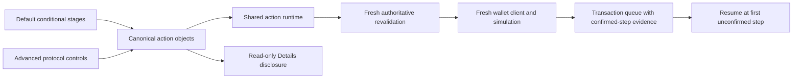
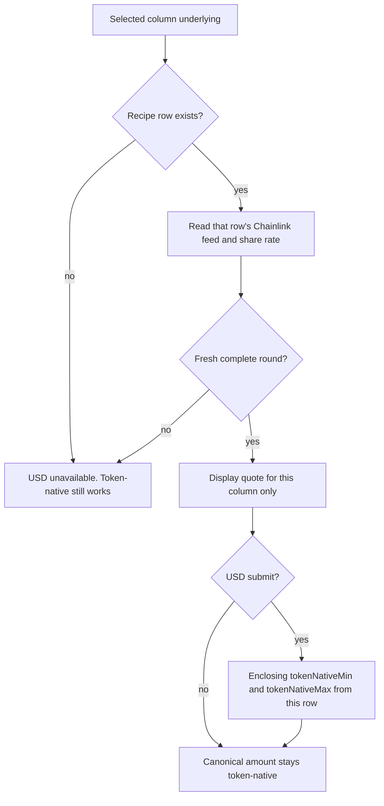
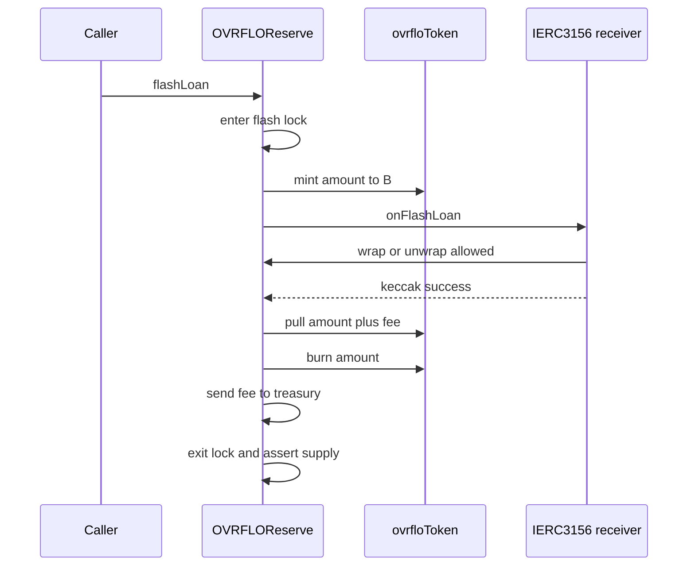
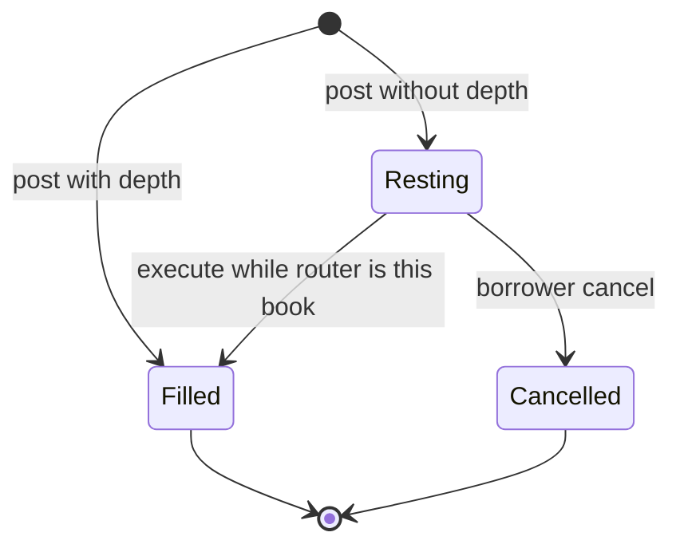
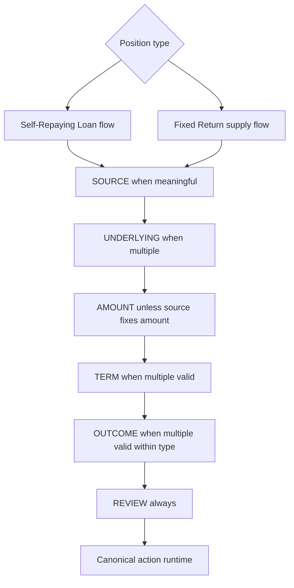
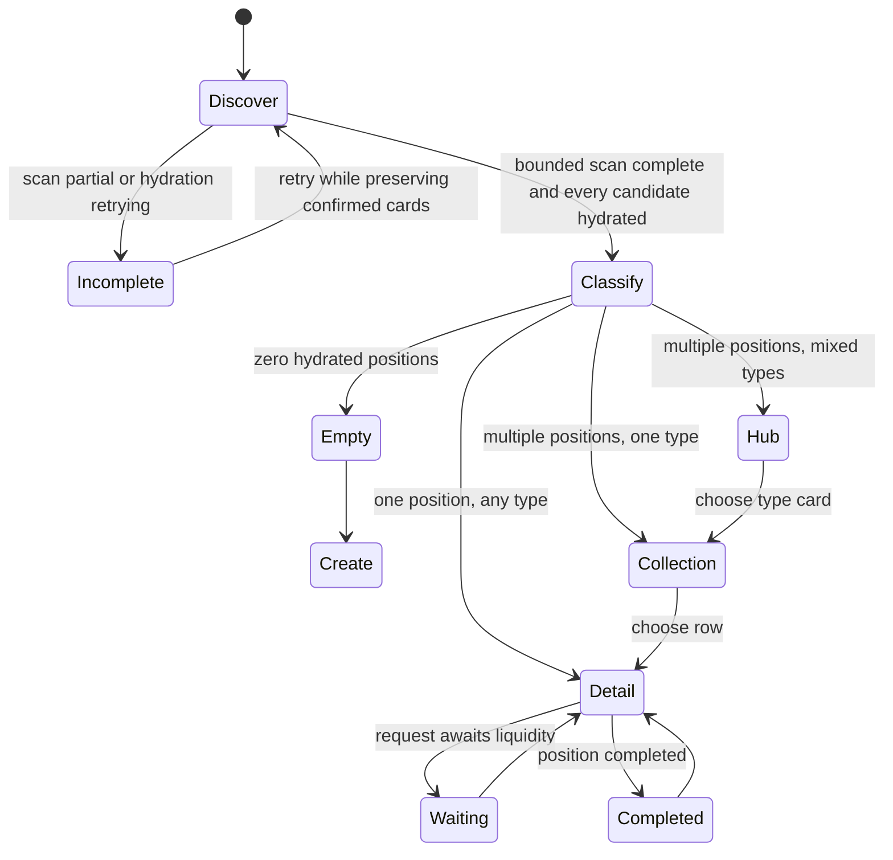
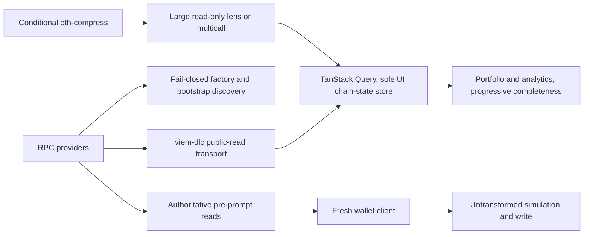
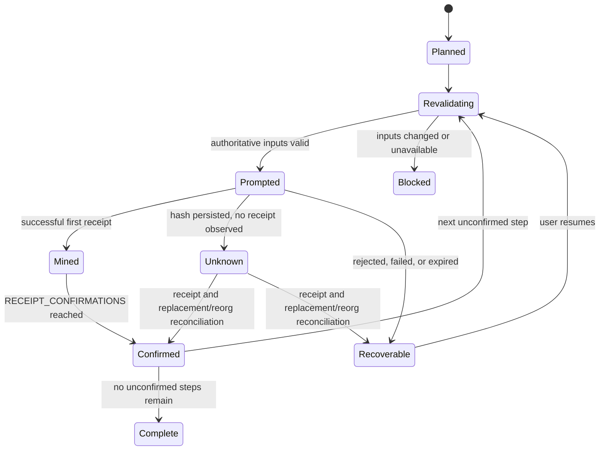

# Denomination switch, wrap-reserve module, and per-underlying columns — reconciliation plan

## Goal Capsule

**Agent cockpit.** Read `docs/agents/system.md` before this file. This plan is the **target** column wiring and Default / Advanced product. Live `src/` still has vault-owned wrap, underlying-denominated lending, and PT flash until CS1 lands. Do not implement from a sentence that blends live and target.

**Objective.** Reconcile the 2026-08-22 implementation handoff and the newest four user-provided frontend reference boards against the live repo. Sequence the result into changesets that can each be swept, implemented, and audited as a unit. CS1 remains the coherent protocol change: ovrfloToken denomination everywhere, reserve extraction via nested constructors, two-minter token with ERC20Permit, factory registration plus `replaceLending`, PT flash-loan removal, lending asset switch plus a factory-set router/`onBehalfOf` hook, FREI-PI checks on wrap and deposit, and only the correctness-critical web sync. CS4 replaces the frontend visual system and information architecture with the boards' `Default` / `Advanced` model while preserving one canonical action runtime. CS5 adds resilient public reads through pinned `@morpho-org/viem-dlc`. CS6 conditionally evaluates read-only `eth-compress`. CS7 migrates web quality tooling without weakening existing gates.

**Product authority.** For visual design, interaction model, portfolio states, and disclosed `Default` concepts, the newest four user-provided frontend reference boards override conflicting earlier attachments, the primary handoff, earlier plan text, and the pre-correction design record. `DESIGN.md` now converts those decisions into the normative design system; the boards are acceptance evidence, not an implementation-time fallback. The boards also supersede `PRODUCT.md` Operating Context only for CS4's `Default` information architecture. They do not alter Solidity, contract behavior, canonical action/runtime truth, authoritative read rules, recovery semantics, compression constraints, or tooling decisions. Where a source conflicts with live code, raise the discrepancy and apply § Key Decisions. The handoff authorizes event/error catalog changes per critical pattern #21. Trust ranking otherwise follows `docs/agents/system.md`, then `docs/agents/onboarding.md` §0.

**Execution profile.** Solidity/Foundry, shell seed tooling, and a browser-only statically exported Next.js frontend. No app server is introduced. CS1 verification keeps the clean `forge build` then `forge test` order. CS4-CS7 add web unit, E2E, runtime-read, performance-contract, and tooling parity gates without mixing those additions into CS1.

**Stop conditions.** Stop and surface if: (a) any live mainnet deployment must be preserved in place (KD11 assumes fresh-generation deployment); (b) the OVRFLO-Streams fork cannot be redeployed against a new factory because its mint gate reads the factory registry positionally at `src/OVRFLOFactory.sol:87-91`; (c) the two-minter registration checks cannot be expressed without touching the 3-field `OvrfloInfo` tuple; (d) the lending asset switch touches `_fillTick` or `StreamPricing` math; (e) `test/DeploySize.t.sol` fails after the vault constructor embeds reserve and token creation code; (f) the lending runtime canary fails after the asset switch plus router hook, in which case drop the hook and surface rather than weakening the canary; (g) Hosted Convert CORS, CSP, static export, or Router V4 allowlist checks fail at implementation; (h) a USD submit uses a missing recipe or another column's quote; (i) `Your OVRFLO` cannot remain the single `Default` portfolio label; (j) a Fixed Return supply position cannot be classified and hydrated authoritatively; (k) the bounded portfolio scan cannot distinguish incomplete from empty; (l) CS3 is unavailable for no-liquidity request states; (m) safe recovery would require exposing hidden protocol mechanics in `Default`; (n) shared visual scoping would create separate `Default` and `Advanced` design systems; (o) CS6-U2 cannot install npm `eth-compress@0.4.0` with `_esm` browser files, or the production client bundle loads `index.node.js`; or (p) a CS7 pin in KD20 is unpublished, the documented config path is unsupported by that pin, type-aware Oxlint appears, or TypeScript 7 enters `web/package.json`. The amended-scope completeness critic and the final documentation review completed 2026-08-31. CS6/CS7 pins were recorded 2026-09-01.

**Open blockers.** None in the plan text. CS6 and CS7 code wait for owner start-OK on tickets 21 and 23. That is start authorization, not a missing pin. Hosted Convert and execution-grade USD are pinned in KD17. CS4 no-liquidity request states depend on CS3.

**Readiness (CS6/CS7 pins folded 2026-09-01).** The whole plan is implementation-ready from this file. CS1 was swept 2026-08-24. CS2, CS3, Hosted Convert, and USD were pinned 2026-08-31. CS6 and CS7 pins are KD19 and KD20. An implementer starts CS1 immediately. Do not start CS6 or CS7 until the owner records start-OK on that ticket. Do not re-research pins.

---

## Problem Frame

The handoff describes a target architecture. The repo implements a different one. Both are internally consistent; the work is a migration, not a patch. The deltas, grounded in `src/`:

1. **Fee/escrow denomination.** Today the deposit fee is charged in underlying via a second approval (`src/OVRFLO.sol:462-467`), and the lending book escrows and pays out underlying: `supply` pulls `IERC20(underlying)` (`src/OVRFLOLending.sol:436`), `withdraw` refunds underlying (`:467`), `borrow` pays net and fee in underlying via `_payUnderlying` (`:527-528`, `:1231-1235`). Obligations, `repay`, and `claim` are already ovrfloToken-denominated (`:645`, `:741-743`), and `StreamPricing` is asset-agnostic (`src/StreamPricing.sol:109-160`). The switch changes escrow/payout plumbing, not pricing math.
2. **Wrap/unwrap location.** The vault owns `wrappedUnderlying`, `wrap`, `unwrap`, `sweepExcessUnderlying` (`src/OVRFLO.sol:111`, `:363-407`). The handoff moves all of it to one reserve contract per underlying.
3. **Mint authority.** `OVRFLOToken` has a single immutable `owner` set to the constructing vault (`src/OVRFLOToken.sol:19-28`; construction at `src/OVRFLO.sol:297`). The handoff requires two immutable minters (vault + reserve) fixed at token construction, with no admin path ever.
4. **PT flash loan exists.** The handoff says "Do not build: PT flash loans. Never" — but the repo ships one (`src/OVRFLO.sol:526-566`), with tests across unit/fuzz/attack/invariant/fork suites.
5. **Registration.** `registerOvrflo` currently relies on the vault constructing its token: "Token ownership needs no check … holds by construction" (`src/OVRFLOFactory.sol:166-167`). After CS1 the vault still constructs the column children (KD5); registration grows explicit minter and reserve binding checks anyway.
6. **Constructor cycle in the handoff.** The handoff says the token needs both minter addresses at construction, so the vault can no longer construct its own token, and offers "CREATE2 prediction or deploy-token-first." That cycle exists only if all three contracts are deployed from the outside. Nested constructors remove the cycle (KD5).

**Discrepancies between the handoff and the repo, resolved in this plan:**

| # | Handoff claim | Repo / session reality | Resolution |
|---|---|---|---|
| D1 | "Do not build: PT flash loans. Never" | PT flash facility exists (`src/OVRFLO.sol:526-566`) | Remove it in CS1, first commit (KD1) |
| D2 | `quote()` returns grossPrice, obligation, fee, net, residual in one call | `previewBorrow` returns `(actualBorrow, feeAmount, obligation)` (`src/OVRFLOLending.sol:561-564`) | No contract change; frontend composes (KD12) |
| D3 | Vault can no longer construct its token; CREATE2 or token-first | Vault already constructs its token (`src/OVRFLO.sol:297`) | Vault creates the reserve; the reserve creates the token (KD5). CREATE2 and nonce-precomputed CREATE are rejected |
| D4 | "delete sweepExcessUnderlying from the vault (or repoint…, admin decision)" | `sweepExcessUnderlying` exists on vault + factory forwarder (`src/OVRFLO.sol:363`, `src/OVRFLOFactory.sol:282`) | Move the body to the reserve; delete it from the vault; keep the factory forwarder name (KD3) |
| D5 | Request book is `loan.borrower`; core unchanged | `borrow` sets `loan.borrower = msg.sender` and `_disposeStream` returns to that address (`src/OVRFLOLending.sol:508`, `:1248-1259`) | Factory-set `router` plus `onBehalfOf` in CS1 (KD10). Request book does not keep a routing table |

---

## Alternatives considered (architecture level)

- **Keep the PT flash loan, frozen, remove later.** Rejected: the denomination switch outlaws its underlying-denominated fee path, and keeping it means the vault keeps an underlying fee leg. "Never" is the handoff's settled word; CS1 is the cheapest moment to honor it.
- **Denominate lending in underlying, switch only the deposit fee.** Rejected: leaves two assets in the lending book and forfeits single-asset accounting.
- **Token-first under nonce-precomputed plain-CREATE addresses** (GLM draft KD5). Rejected: the cycle exists only under all-external construction. Nonce discipline is a silent footgun until `registerOvrflo` reverts. Nested constructors keep today's deploy shape: one `new OVRFLO(...)`, then register.
- **CREATE2 prediction of vault/reserve/token.** Rejected: a CREATE2 address depends on initcode content, and each side's initcode would embed the other's address. No computable fixed point. Unnecessary once constructors nest.
- **Vault constructs the token and takes a predicted reserve address.** Rejected: still needs prediction. The winning chain predicts nothing: the reserve is `msg.sender` at token construction.
- **All-external children for factory-philosophy purity.** Rejected by user sign-off. The vault already constructs its token. Nesting the reserve extends that exception by one level. Registration remains the admission gate.
- **Per-user operator mapping on the lending market** (`isOperator[account][operator]`). Rejected: the router cannot spend the human's assets. The stream comes from the router's own escrow. A mapping doubles the byte cost for a harm that cannot occur.
- **Request book as `loan.borrower` plus permissionless `settle`.** Rejected: the stream returns to the book and sits there until someone sweeps. The CS1 hook deletes that table and that failure. Fallback if the lending canary fails: drop the hook and use this design; do not weaken the canary.
- **A second lending contract that mirrors the book for borrowers.** Rejected: a request carries one indivisible stream NFT and dies on first fill. Tick-tape/epoch machinery exists for lazy pro-rata across partial fills. A mirror book is the full audit surface with none of that reason.
- **In-place migration of a live deployment.** Rejected as impossible: fee asset, escrow asset, token mint authority, and factory checks are constructor-level. The unit of migration is a fresh column (KD11).
- **Separate write models for `Default` and `Advanced`.** Rejected: two action grammars would drift on approvals, simulation, receipts, partial completion, and request-book semantics. Both disclosure levels compile into the same canonical action and runtime objects (KD16/KD17).
- **An app server for hosted conversion or read aggregation.** Rejected: the frontend remains browser-only and statically exported. A hosted integration that cannot satisfy that boundary is not adopted.
- **Use viem-dlc or eth-compress to transform wallet writes.** Rejected: both additions are limited to public reads. Every wallet prompt reacquires a fresh wallet client and receives the exact reviewed, simulated transaction for that step (KD17-KD19).
- **Adopt eth-compress because compressed calldata is smaller in theory.** Rejected: request-body wire bytes, request latency, and provider acceptance are measured first; response compression is recorded separately and cannot justify adoption. State-override transformation remains an evaluation until package provenance, benchmark evidence, and decoded-result equivalence justify it (KD19).
- **Wait for unpublished `eth-compress@0.5.0` or git-install `f1df09b9cb12b3a4a72019db544bac258ba9f7de`.** Rejected (owner 2026-09-01): CS6 evaluates the published npm package. `0.4.0` ships `compress_call`, the 1150-byte skip, and browser `_esm` files. Unpublished 0.5.0 is source-only and is not the install target.
- **Git-install unpublished 0.5.0 at `f1df09b9cb12b3a4a72019db544bac258ba9f7de`.** Rejected: that commit has no `_esm` / `_cjs` / `_types`. Its build uses TypeScript 7.0.2.
- **Replace ESLint and the formatter in one unclassified pass.** Rejected: ESLint and Oxlint run in parallel until every difference is classified and parity is proven. Formatter output lands separately as formatting-only (KD20).
- **`npx ultracite init`.** Rejected: init writes agent files, including `AGENTS.md`. CS7 writes `web/oxlint.config.ts` and `web/oxfmt.config.ts` by hand from KD20.
- **Spread Ultracite `core.ignorePatterns` into Oxlint.** Rejected: ultracite 7.10.7 includes `**/generated`, which matches `web/lib/generated.ts` and `web/lib/generated/`. ESLint currently lints those files. Oxlint must lint them too.

---

## Key Decisions

### KD1 — PT flash loan is removed in CS1, as the first commit

Delete from `OVRFLO.sol`: `flashLoan`, `flashFeeBps`, `flashLoanPaused`, `setFlashFeeBps`, `setFlashLoanPaused`, `FLASH_FEE_MAX_BPS`, `FLASH_CALLBACK_SUCCESS`, events `FlashLoaned`/`FlashFeeBpsSet`/`FlashLoanPausedSet`, errors `FlashPaused`/`ExceedsDeposited`/`FlashCallbackFailed` (the `src/OVRFLO.sol:526-566` block). Delete factory forwarders `setFlashFeeBps`/`setFlashLoanPaused` (`src/OVRFLOFactory.sol:290-301`) and `interfaces/IFlashBorrower.sol`. The vault drops `ReentrancyGuard` inheritance: `flashLoan` is its only `nonReentrant` user (`src/OVRFLO.sol:20`, `:526`). Test deletions: `test/OVRFLOFlashLoan.t.sol`, `test/fork/OVRFLOFlashLoanFork.t.sol`, the flash members of `test/OVRFLOFuzz.t.sol`, `test/OVRFLOAttackScenarios.t.sol`, `test/OVRFLOInvariant.t.sol`, `test/fizz/` (flash handlers, `MockFlashBorrower`, GL-06's `mockFlashBorrowerAddr` holder). This commit is pure removal and must land before reserve extraction so later diffs do not mix deletion with the structural move. ERC-3156 ovrfloToken flash mint in the reserve is CS2.

### KD2 — Deposit fee comes out of the minted ovrfloToken; events and slippage use the net

In `deposit`: compute `feeAmount = StreamPricing.fee(toUser, info.feeBps)` as today, then mint `toUser - feeAmount` to the depositor and `feeAmount` to `TREASURY_ADDR` (skip the zero-fee mint), instead of the underlying `safeTransferFrom` at `src/OVRFLO.sol:464-467`. Implementation shape, stated so the dry run cannot pick the other leg: depositor receives one mint of `toUser - feeAmount`, treasury receives one mint of `feeAmount`; no post-mint transfer; `FeeTaken` fires once alongside the split. `feeBps` stays ceiling-capped by the factory (`FEE_MAX_BPS = 100`), so `toUser - feeAmount` cannot underflow.

One rule: the event, the slippage guard, and the preview describe what the user received.

- `minToUser` bounds the net mint (`toUser - feeAmount`).
- `Deposited.toUser` is that net amount.
- `FeeTaken` is kept; its `token` field value changes from `underlying` to `ovrfloToken` (catalog change authorized by the handoff as the dated decision, pattern #21). The fee is paid in minted ovrfloToken, so KD13's equality holds by construction: treasury gain equals depositor deduction, and no ovrfloToken ever exists outside the mint split.
- `previewDeposit` returns net `toUser` and `feeAmount` in ovrfloTokens. NatSpec today says "Fee amount in underlying tokens user must pay" (`src/OVRFLO.sol:627`) — rewrite that sentence.

The deposit flow needs exactly one approval (PT).

### KD3 — `OVRFLOReserve` is factory-administered and holds `wrappedUnderlying`

One `OVRFLOReserve` per underlying. CS1 creates it from the vault constructor (KD5). CS1 surface:

- Immutables: `factory` (admin), `underlying`, `vault`, `ovrfloToken` (set after the reserve constructs the token).
- Storage: `wrappedUnderlying`.
- `wrap(amount)` — port of `src/OVRFLO.sol:379-392` verbatim (reserve increment before `transferFrom`, strict balance-delta check), then KD8's FREI-PI assert.
- `unwrap(amount)` — port of `:396-407` verbatim (reserve-bounded, burn before transfer), then KD8's FREI-PI assert.
- `sweepExcessUnderlying(to)` `onlyAdmin` — port of `:363-371`: balance minus reserve, `NoExcess` when zero. Same dust case as today (a direct underlying transfer). Delete the function from the vault.
- Events `Wrapped`/`Unwrapped`/`ExcessUnderlyingSwept` move with the code.
- No reentrancy guard on `wrap`/`unwrap` — parity with the vault's current posture. Port `test_ReentrantUnderlyingCannotDoubleSpendReserveDuringUnwrap` (`test/OVRFLOWrapUnwrap.t.sol:229`).
- ERC-3156 flash mint lands here in CS2; the CS1 contract is shaped so that addition is additive (no `wrappedUnderlying` interaction: wrap/unwrap on `OVRFLOReserve` never touch the flash-mint path).

The vault deletes `wrappedUnderlying`, `wrap`, `unwrap`, `sweepExcessUnderlying`. The vault **keeps** the `underlying` immutable — it remains the column's identity asset (Pendle SY binding in `addMarket` at `src/OVRFLOFactory.sol:251`, duplicate-underlying registration at `:180`). Post-CS1 the vault holds no underlying balances; the reference is identity, not custody. `sweepExcessPt` stays on the vault (PT backing is a vault concern; its `UnknownPT` guard is unchanged, pattern #11).

Known accepted stranding window, documented so it is not re-raised: a direct underlying transfer to the reserve lands outside `wrappedUnderlying` and is recoverable only by multisig `sweepExcessUnderlying`. This is identical to today's dust case on the vault (`:363-371`) and moves with the code; it is not a new exposure.

The factory forwarder `sweepExcessUnderlying(ovrflo, to)` keeps its name and retargets `OVRFLOReserve(ovrfloToReserve[ovrflo]).sweepExcessUnderlying(to)`.

### KD4 — `OVRFLOToken` gets two named immutable authorities and ERC20Permit

Replace the single `owner` (`src/OVRFLOToken.sol:19-28`) with:

- `address public immutable vault`
- `address public immutable reserve`

Constructor: `OVRFLOToken(string name_, string symbol_, address vault_)` plus OZ `ERC20Permit(name_)`. `vault = vault_`. `reserve = msg.sender` (the constructing `OVRFLOReserve`). The modifier admits either; error renamed `NotMinter()`. No setter, no gate, no timelock, no transfer. Both authorities get both `mint` and `burn` (the vault burns on `claim`; the reserve burns on `unwrap` and, in CS2, on flash-mint repay).

Rejected naming: `minter0`/`minter1`. Named getters match the roles. The handoff forbids a third minter, so numbered slots buy nothing.

**Permit.** OZ `ERC20Permit` is constructor-only. After the denomination switch, `supply` and `repay` both pull ovrfloTokens; permit turns those into a signature plus one pull. Do **not** add `supplyWithPermit` or `repayWithPermit` on `OVRFLOLending` (canary headroom; permit-in-contract has a known griefing wrinkle). The frontend submits `permit` and the action as two calls or a wallet batch.

Record in `VAULT_SECURITY.md`: two contracts can burn any holder's balance. The reserve only burns `msg.sender` in `unwrap`. That is the same trust shape as today's vault, now split across two contracts.

### KD5 — Deploy recipe: vault creates the reserve; the reserve creates the token

No CREATE2. No nonce prediction. One transaction from the deployer:

```
EOA/script
  |  new OVRFLO(admin, treasury, underlying, name, symbol, oracle, stream)
  v
OVRFLO constructor
  1. reserve = new OVRFLOReserve(admin, underlying, name, symbol, address(this))
       |
       v
     OVRFLOReserve constructor
       2. token = new OVRFLOToken(name, symbol, vault)
            vault  = vault_          (arg)
            reserve = msg.sender      (OVRFLOReserve)
       3. ovrfloToken = token        (immutable)
  4. ovrfloToken = reserve.ovrfloToken()
  5. IERC20(ovrfloToken).approve(stream, type(uint256).max)   // keep src/OVRFLO.sol:301
```

The token↔reserve cycle never appears: the reserve learns the token by creating it, and the token learns the reserve because the reserve is `msg.sender`. The token is constructed with the OZ `ERC20Permit(name_)` base per KD4 — the `ERC20` and `ERC20Permit` constructors must receive the same `name_` string (EIP-712 domain).

The deploy runbook in `script/OVRFLO.s.sol` (steps 6–7) stays "deploy `OVRFLO`, then `registerOvrflo(vault)`." Step 6 gains reads: `vault.reserve()`, `reserve.ovrfloToken() == vault.ovrfloToken()`, `token.vault() == vault`, `token.reserve() == reserve`. The artifact gains `reserve`.

**Reserve provenance for clients is factory discovery, not env.** The web derives `reserve` from a third bootstrap multicall leg — `factory.ovrfloToReserve(vault)` next to `ovrfloToLending` (`web/lib/protocol-bootstrap.ts:193-206`; the result-pairing arithmetic at `:217-224` becomes `* 3`), feeding a `reserve` field on `VaultInfo`. This preserves the settled factory-only-anchor rule (the `OBSOLETE_ENV_VARS` posture at `web/lib/config.ts:28-34` and `:203-212`); a second static anchor would reintroduce the pattern that rule killed and silently mis-target under multi-vault. The deployment-artifact `reserve` field and seed-time echoes are tooling convenience only; **do not add `NEXT_PUBLIC_OVRFLO_RESERVE`** to the client env contract — add it to the obsolete list instead. The E2E harness keeps reading `deployments/local.json` as today.

`test/DeploySize.t.sol` `_artifacts()` gains `OVRFLOReserve`. The vault's initcode now embeds reserve+token creation code; the vault's runtime shrinks (wrap/unwrap/flash deleted). Both caps have large margins. A cap failure is a stop condition, not a silent absorb.

### KD6 — Factory registration stays one-argument; `OvrfloInfo` stays frozen

`registerOvrflo(address ovrflo)` keeps its arity. After the existing checks (`src/OVRFLOFactory.sol:169-191`) the factory reads `reserve = vault.reserve()` and `token = vault.ovrfloToken()`, then:

- token and reserve carry runtime code (`code.length > 0`) — else `NoCode`. Without this, staticcalls against an EOA revert as a generic ABI-decode error instead of a catalog error (same pattern as `setOvrfloStream`, `src/OVRFLOFactory.sol:370-372`).
- `reserve != address(0)` — else `ReserveMismatch`.
- `OVRFLOToken(token).vault() == ovrflo` and `.reserve() == reserve` — else `TokenMinterMismatch`.
- `OVRFLOReserve(reserve).ovrfloToken() == token`, `.underlying() == underlying`, `.factory() == address(this)`, `.vault() == ovrflo` — else `ReserveMismatch`.

Record the reserve in a **separate** `mapping(address => address) public ovrfloToReserve`. Do **not** extend `OvrfloInfo`: field 0 (`treasury`) is read positionally by the off-repo OVRFLO Streams mint gate (`src/OVRFLOFactory.sol:87-91`; the fork destructures `(treasury,,)` at its `_requireKnownOvrflo`). A tuple-length change would break that cross-repo ABI. The mapping is deliberately **write-once**, like `ovrfloStream` and per-series approval: a flawed `OVRFLOReserve` is a fresh-column-plus-migration problem under pattern #9, not an in-place replace — the contract custodies `wrappedUnderlying`, and migrating that counter through a broken `OVRFLOReserve` defeats the point of replacement. Accepted consequence, documented here so the implementer does not "fix" it. KD9's tuple-comment instruction exists for this same compatibility reason, not custody.

`registerLending` is unchanged. The lending constructor keeps reading the frozen `ovrfloInfo` tuple, including the `underlying_` nonzero check (`src/OVRFLOLending.sol:333-336`), and stops storing `underlying`. Comment why the tuple still carries `underlying`: compatibility with the off-repo mint gate's positional read, not custody.

The on-chain binding checks prove wiring at admission; they do not prove code identity. The multisig creation-code checklist stays the code-identity gate: rewrite the `registerOvrflo` NatSpec checklist for three creation transactions (vault embeds reserve+token), delete the stale "Token ownership needs no check" sentence, replace it with the minter/reserve binding list above, and extend the audited-artifact item to cover the reserve and token creation txs explicitly. Do not add on-chain bytecode-identity checks (factory size; multisig already validates).

Flash forwarders are deleted (KD1).

### KD7 — `replaceLending` on the factory; the reserve is deliberately not replaceable

A registered vault cannot admit a second lending market (`LendingExists`, `src/OVRFLOFactory.sol:210`). A flawed lending market would otherwise brick that column's lending forever, and pattern #9 (`underlyingToOvrflo`) also blocks a full-column redeploy.

Add `replaceLending(address newLending)` `onlyOwner`:

1. Run the same on-chain verification as `registerLending` (`src/OVRFLOFactory.sol:204-215`) against the candidate.
2. Require the vault already has a lending market; otherwise this is a first registration — use `registerLending`.
3. Repoint `ovrfloToLending[vault] = newLending`.
4. Set `lendingToOvrflo[newLending] = vault`.
5. **Keep** `lendingToOvrflo[old] = vault`. `_requireKnownLending` (`:403-405`) keys off that mapping, so factory admin forwarding (fee, treasury, APR bounds, tick spacing, and `setLendingRouter`) still reaches the old market while its loans wind down through permissionless `repay`/`close`/`claim`.
6. Append the new market to `lendings` / `lendingCount`.
7. Emit `LendingReplaced(vault, old, newLending)`.

Do not pause the old market. Do not add a vault-level unregister. Pattern #9 stays: a flawed *vault* is a new-column plus voluntary migration, not an in-place replace. Document that property.

Web wind-down of a replaced market (owner pin 2026-09-01). Today `web/lib/protocol-bootstrap.ts` reads one `ovrfloToLending[vault]` per vault. After `replaceLending`, that read returns only the new market. Loans and supply positions in the old market would vanish from the web while `repay`/`close`/`claim` still run on chain. The pin:

- Bootstrap (CS1-U7) enumerates `lendings(i)` for `i < lendingCount` and maps each market to its vault with `lendingToOvrflo`. A market is `retired` when `ovrfloToLending[vault] != market`. `VaultInfo.lending` stays the active market or `null`. `VaultInfo.retiredLendings` lists the retired markets for that vault. No client env variable is added.
- Portfolio discovery and hydration (CS4-U2) read positions from the active market and every retired market. A position in a retired market keeps its type and status and gains the `retired market` marker.
- Named state `retired market` (CS4-U5): the position shows `repay`, `close`, `claim`, and liquidity withdraw as valid actions. `supply`, `borrow`, and request `post` against a retired market are not offered. `Default` copy: "This position continues on a replaced market. You can finish or withdraw it. New positions use the current market."
- A request book bound to a retired market keeps `cancel`. `execute` on that book reverts under KD14's router gate after the Safe sets the new market's router.
- Runbook (CS1-U4 docs): deploy the new market, `registerLending` style verification runs inside `replaceLending`, then `setLendingRouter` on the new market once CS3 deploys a book bound to it.

The same argument does **not** extend to `replaceReserve`, and this plan closes it on purpose (user decision 2026-08-24): a lending market winds down through permissionless `repay`/`close`/`claim` and holds only streams mid-loan, while `OVRFLOReserve` custodies `wrappedUnderlying`. Replacing a broken `OVRFLOReserve` means migrating that counter through the contract being replaced — replacement is not executable in exactly the failure cases that motivate it. Mitigation is audit depth on the smallest contract in CS1's surface. `ovrfloToReserve` stays write-once (KD6).

### KD8 — FREI-PI on wrap, unwrap, and deposit; skip borrow

The implementation-discipline FREI-PI gate applies. Only the protocol-invariant checks that earn their gas:

- **`OVRFLOReserve` `wrap` and `unwrap`:** end-of-function `wrappedUnderlying <= IERC20(underlying).balanceOf(address(this))`. This is the peg as a checked fact.
- **Vault `deposit`:** end-of-function `marketTotalDeposited[market] <= IERC20(info.ptToken).balanceOf(address(this))`. `toUser + toStream == ptAmount` holds by construction in `_computeSplit` (`src/OVRFLO.sol:418-423`) — do not restate it.
- **Flash mint (CS2):** `totalSupply` after equals `totalSupply` before. Non-negotiable in CS2-U1.
- **Lending `borrow`:** skip. `obligation <= remaining` is already enforced by the gross-price cap (`src/StreamPricing.sol:52-59`). The fuzz conservation property covers token flow.

Cost accounting: each retained assert is one SLOAD plus one cold `balanceOf` (~2,600 gas) on every wrap, unwrap, or deposit. Accepted by design — the peg is checked, not assumed. Do not relitigate per call.

### KD9 — `OVRFLOLending` drops `underlying`; escrow, payout, and fee become ovrfloToken

Mechanics, all plumbing-level (the pricing path is untouched):

- Delete the `underlying` immutable (`src/OVRFLOLending.sol:118-119` declaration, `:343` store); the constructor keeps reading `ovrfloInfo(core)` and stores `treasury`/`ovrfloToken` only (KD6). The constructor's `underlying_` nonzero check (`:336`, within the read block `:333-337`) stays.
- `supply`: `_pullExact(IERC20(ovrfloToken), …)` (`:436`). `withdraw`: pay `IERC20(ovrfloToken)` (`:467`).
- `borrow`: `_payUnderlying` becomes `_payToken` paying `IERC20(ovrfloToken)` to the attributed borrower and the treasury (`:527-528`, `:1231-1235`).
- `repay`/`claim`/`close`/`proceeds`/`received`: unchanged — already ovrfloToken (`:645`, `:741-743`).
- `_fillTick`, `obligationForFill`, `requireEligible`, UNIT/MIN bounds: unchanged (`:1135-1178`, `src/StreamPricing.sol`).
- UNIT rounding is not part of this change. Supply still reverts `NotUnitAligned` (`:410`). Borrow principal still floors to UNIT (`:1161-1162`). Obligation still ceils. Claims still floor per position; dust still strands in `proceeds` (`:743`). Do not "fix" that dust — it is the residue of pro-rata without enumeration.
- Events keep their shapes; NatSpec "underlying" wording becomes "ovrfloToken". `IOVRFLOFactoryRegistry.ovrfloInfo` NatSpec ("underlying used for fee payment", `src/StreamPricing.sol:13`) is corrected — wording only, the tuple is untouched.

Lenders arrive with ovrfloTokens (deposit, wrap, or DEX). Borrowers draw ovrfloToken. The treasury accrues ovrfloToken fees it can itself lend (`setTreasury` exists at `:391-395`).

### KD10 — Factory-set router and `onBehalfOf` on `borrow` (CS1)

Add to `OVRFLOLending`:

- `address public router` (zero until set).
- `setRouter(address router_)` `onlyOwner`. Factory forwards as `setLendingRouter`. One event `LendingRouterSet`. It accepts zero to disable the on-behalf path and any nonzero Safe-selected router. There is no identity or allowlist check. The slot is settable so a flawed request book can be replaced after CS3 ships. The factory is the multisig trust boundary: the Safe validates intent, while this setter stores the selected value. Until the Safe sets the request-book address, whoever holds the slot controls attribution; off-chain deployment verification treats `router` as part of the verified surface. Declare `router` **after** the last existing storage variable: raw-slot test constants (`TICKS_SLOT`, epoch-slot arithmetic at `test/OVRFLOLending.t.sol`) are recomputed from the regenerated golden, and the `exposed_epochState` cross-checks stay as the loud-failure guard.

Change `borrow` to take a final `address onBehalfOf` (`src/OVRFLOLending.sol:495`). Attribution:

```
address borrower = msg.sender == router ? onBehalfOf : msg.sender;
if (borrower == address(0)) revert ZeroAddress();
```

A non-router caller is always the borrower, even if that caller passes a wrong `onBehalfOf`. The frontend may pass the user address on every self-borrow. A leftover argument does not revert a good loan.

When `msg.sender == router`, revert if `onBehalfOf == address(0)` (the `borrower == address(0)` check). The router pulls the stream from its own escrow (`transferFrom(msg.sender, …)` stays at `:526`). Pay proceeds to `borrower`, not `msg.sender`. Index `borrowerLoanAt` / `borrowerLoanCount` under `borrower`. `_disposeStream` already returns to `loan.borrower` (`:1248-1259`) — no change there.

Two adjacent surfaces this decision touches:

- **`Borrowed` must emit the attributed borrower**, not `msg.sender` (today `src/OVRFLOLending.sol:530-532` logs `msg.sender`; the `Loan` struct stores it at `:508`). Loan lists, print-anchor analytics, and the request-book UI all key off this event. The event keeps its three indexed topics (`loanId`, `borrower`, `market`); `borrower` now carries the attributed address. No new indexed parameter is possible — the EVM caps an event at three indexed fields, and all three are spent.
- **`previewBorrow` keeps its four-argument signature** (`src/OVRFLOLending.sol:561-564`). It is a pricing view with no attribution; only `borrow` grows `onBehalfOf`.

Trust note, stated so the implementer does not add a check: `setRouter` accepts zero or any nonzero address. The factory is the multisig trust boundary; the router it sets can attribute loans to arbitrary addresses (indexing, events, payouts). That power is the same power the Safe already holds over every factory forwarder, accepted as part of KD10 — no on-chain identity or allowlist constraint is added.

If `test_Lending_RetainsRuntimeHeadroomCanary` fails after this hook plus the asset switch, drop the hook, keep the asset switch, and surface. Do not lower `LENDING_RUNTIME_CANARY`. The CS3 fallback is then GLM's routing table plus `settle`.

### KD11 — Deployment consequence: full fresh generation, including a new lockup

The lockup's `create*` gate reads `ovrfloInfo(msg.sender)` from the factory registry, and `setOvrfloStream` requires `lockup.factory() == address(this)` (`src/OVRFLOFactory.sol:369-381`). A new factory (KD6/KD7 change it) therefore requires a fresh OVRFLO Streams lockup from the sibling repo, plus fresh vault/reserve/token/lending. CS1 **blocks mainnet launch** and invalidates existing devnet/testnet stacks (re-seed). Nothing in this plan migrates a live stack in place.

### KD12 — Frontend: denomination alignment rides with CS1; the product UX is CS4

CS1 includes the minimal correctness sync only: supply/borrow flows flip the escrow asset (branded money `WstethWei` → `OvrfloWei` on the supply path), the deposit review drops the underlying fee approval, wrap/unwrap calls and the `wrappedUnderlying` read retarget the reserve, `borrow` calldata gains `onBehalfOf`, and E2E fixtures plus seeded-wallet funding update. Permit is available. CS1 may keep approve-plus-pull. Do not add the `Default` / `Advanced` product model, broad read-plane work, hosted conversion, composite recovery, or quality-tooling migration to CS1.

The handoff's §7 UX is replaced and extended by KD16-KD20 and CS4-CS7. There is no `quote()` view (D2); presentation composes authoritative reads without inventing a contract call. "How many lenders ahead" remains a read-only lens candidate, not a core Solidity function. Every state-touching CS4 item follows `docs/solutions/patterns/ovrflo-web-standard.md` and writes the scratch intent capsule required by `docs/maps/SCHEMAS.md` §4.

### KD13 — Solvency and reserve invariants are re-derived, spanning the column

- **Column solvency (replaces the combined check in `docs/agents/onboarding.md` §5):** `ovrfloToken.totalSupply() <= Σ_pt.balanceOf(vault) + underlying.balanceOf(reserve)` — the PT term sums the vault's balance across **every approved series**, not one market's PT (`addMarket` admits many; a single-series check silently passes while another series' backing is missing). Per-origin equality also holds: `totalSupply == Σ marketTotalDeposited + reserve.wrappedUnderlying`. The fizz property `property_vault_combined_solvency` (GL-07) is rewritten against vault+reserve.
- **Wrap reserve:** `wrappedUnderlying <= underlying.balanceOf(reserve)`; unwrap never spends PT; wrap/unwrap conservation. The three invariants in `test/OVRFLOWrapUnwrap.invariant.t.sol:180-192` port to a reserve suite.
- **Lending escrow:** `invariant_EscrowSolvency` (`test/OVRFLOLendingInvariant.t.sol:1471`) flips asset: `ovrfloToken.balanceOf(lending)` vs unfilled + proceeds. `invariant_MoneyRecipients` (`:1693`) asserts borrower and treasury payouts in ovrfloToken. Fizz GL-04 (`property_underlying_flow_ghosts`) re-expresses over ovrfloToken flow through the lending market.
- **Vault post-CS1:** `invariant_PtBalanceGteDeposited` (`test/OVRFLOInvariant.t.sol:305`) survives; the underlying-reserve invariants (`:296`, `:314`) leave the vault suite.

### KD14 — Flash mint (CS2) and borrow request book (CS3) are later units in this plan

CS2 and CS3 live in this file after CS1. `(session-settled: user-directed — chosen over separate CS2/CS3 plans: if this plan introduces the work, this plan implements it.)` Do not land CS2 or CS3 inside CS1 commits.

CS2 (after CS1 U2 and U4): ERC-3156 `maxFlashLoan`/`flashFee`/`flashLoan` of ovrfloToken inside `OVRFLOReserve`. Use OpenZeppelin `IERC3156FlashLender` / `IERC3156FlashBorrower` under `lib/openzeppelin-contracts/contracts/interfaces/`. `(session-settled: user-directed — chosen over DssFlash `cap - totalSupply()` as the economic bound: per-call `amount <= flashMintMax`.)` Constants:

- `FLASH_MINT_MAX_CEILING` is `1_000_000 * 10**18` (one million whole ovrfloToken).
- `flashMintMax` launches at `0` (mint disabled until the Safe raises it through the factory timelock).
- `FLASH_FEE_MAX_BPS = 9`.
- `flashFeeBps` launches at `0`.
- `maxFlashLoan(token)` returns `0` when `token` is not `ovrfloToken`, when a flash is entered, or when `flashMintMax` is `0`. Otherwise it returns `min(flashMintMax, type(uint256).max - IERC20(ovrfloToken).totalSupply())`. The `type(uint256).max - totalSupply()` term is an overflow guard only.
- `flashLoan` reverts when `amount` is `0` or `amount > maxFlashLoan(token)`.
- Fee when nonzero: pull `amount + fee` from the receiver, burn `amount`, send `fee` to the column treasury from those already-pulled tokens. KD8 still holds: `totalSupply` after equals `totalSupply` before.
- Flash-only lock on the reserve. Wrap, unwrap, and vault `deposit` stay ungarded and callable in the callback. No vault-wide lock. No pause flag: `flashMintMax == 0` disables mint.
- Factory forwarders: `setReserveFlashMintMax(ovrflo, max)` and `setReserveFlashFeeBps(ovrflo, bps)`, `onlyOwner`, after `_requireKnownOvrflo`. `setReserveFlashMintMax` reverts above the ceiling. `setReserveFlashFeeBps` reverts above 9.

CS3 (after CS1 U3 and U4): the borrow request book as a thin router. Contract name `OVRFLORequestBook` at `src/OVRFLORequestBook.sol`. Mechanics:

- Escrow: borrower posts stream + terms (`market`, `aprBps` — the exact tick the borrower chose; `targetBorrow`; `minAcceptable`) via plain `transferFrom` (never `safeTransferFrom` — mirroring the borrow escrow rationale at `src/OVRFLOLending.sol:486-488`). Escrowed streams are never drawn from. The book calls `setApprovalForAll(lending, true)` on the lockup once in its constructor so core `borrow` can pull the escrowed stream.
- The borrower picks the tick; the book acts on their behalf (owner decision 2026-09-01; Default/Advanced plan §9 and §13: the displayed result maps to one exact 25 bps tick, and OVRFLO never recommends or substitutes another tick). The book stores `aprBps` and fills at that tick only. There is no ceiling, no tick search, no `tickDepths` scan, and no "cheapest tick" logic in the book. `Default` sets `minAcceptable` so the fill is full-or-wait; `Advanced` may loosen `minAcceptable`. Both are web policy, not book logic.
- `cancel(requestId)` — borrower-only, callable anytime while the request rests; returns the escrowed stream intact (plain `transferFrom` back). Cancel is the only exit for a resting request, and KD10's router-replace rationale depends on it: after a swap, resting escrow comes home by owner choice instead of waiting for fillable depth (resting escrow returns by owner choice through `cancel`, which never consults the router slot).
- Post-or-execute: at post time, if core `borrow` at the stored `aprBps` clears `minAcceptable`, fill immediately (one call). Otherwise the request rests. `execute(requestId)` is permissionless and fills at the stored `aprBps` only; when depth at that tick still cannot clear `minAcceptable`, `execute` reverts and the request keeps resting.
- Post-time fill-or-rest algorithm (owner pin 2026-09-01). `post` must not wrap core `borrow` in `try/catch`: `borrow` reverts for ineligible streams, invalid ticks, and empty depth with different errors. A blanket catch would treat every revert as "no depth yet," so the book would escrow a stream the lending market will never accept and record it as a resting request. The lending market's own checks are not affected. The pinned order is:
  1. `post` reverts when `lending.router() != address(this)`. A retired book accepts no new escrow.
  2. `post` runs `StreamPricing.requireEligible(lockup, vault, market, streamId)` and requires `remaining >= lending.MIN_STREAM_AMOUNT()`. Any failure reverts `post`. An ineligible or dust stream never rests. The book binds `vault` as `factory.lendingToOvrflo(lending)` in its constructor.
  3. `post` calls `lending.previewBorrow(market, aprBps, targetBorrow, streamId)` inside `try/catch`. On success with `actualBorrow - feeAmount >= minAcceptable`, the book calls core `borrow(..., minAcceptable, onBehalfOf = human)` and fills. On success below `minAcceptable`, the request rests. On revert with selector `EmptyTick` or `BelowMinimum`, the request rests. On any other revert (`InvalidTick`, `SpacingUnset`, `ZeroTarget`, eligibility errors), `post` re-reverts with the same revert data.
  4. `execute` has no `try/catch`. It calls core `borrow` directly; every core revert surfaces unchanged.
- Escrow approval targets the book. `post` pulls the stream with `lockup.transferFrom(human, book, streamId)`, so the human approves the book (`approve(streamId)` or `setApprovalForAll(book)`), not the lending market. The web's ERC-721 authorization leg on the request path names the book as spender.
- Resting truth: while a request rests, the book is the stream recipient. The fork's withdraw ACL (plan R3) means no party withdraws the stream's vested ovrfloToken until `cancel` returns the stream or the loan closes. `remaining` does not change while resting. A resting request whose series reaches maturity cannot fill: `execute` reverts `SeriesMatured`; `cancel` is the exit. CS4-U5 waiting copy states both facts.
- `execute` calls core `borrow(..., onBehalfOf = human)` from the book (`msg.sender == router`). Proceeds go to the human. The stream returns to the human at close. The book holds nothing after a successful execute except still-resting requests. No `loanId -> borrower` table. No `settle`.
- Remaining face is read live at fill time; no snapshot. Fees: none in the book; the core's fill-time borrower fee is the only fee, now in ovrfloToken via KD9.
- Before CS3 ships, seed and production both call `setLendingRouter` on the factory after the book is deployed. After the swap (or a zero-set), a retired book loses the on-behalf path — the market attributes its borrow to `msg.sender` (the book itself, since `msg.sender != router`), so proceeds and the returned stream land inside the book's own contracts. The CS3 book therefore gates **every leg that calls core borrow** (post-time immediate fill and `execute`) on `lending.router() == address(this)`; borrowers exit resting requests through `cancel`, which never consults the slot.
- Events (indexed topics as written):
  - `RequestPosted(uint256 indexed requestId, address indexed borrower, address indexed market, uint256 streamId, uint16 aprBps, uint256 targetBorrow, uint256 minAcceptable)`
  - `RequestFilled(uint256 indexed requestId, uint256 indexed loanId, uint256 actualBorrow)` — fires on post-time immediate fill and on later `execute`
  - `RequestCancelled(uint256 indexed requestId, address indexed borrower)`
- The factory does not register the book. `DeploySize` gates `OVRFLORequestBook`. Seed deploys the book, then calls `setLendingRouter`. CS4 must not fake a request before this contract exists.

### KD15 — README fixes ship immediately (CS0)

`README.md:490`: `lending.getfoundry.sh` → `book.getfoundry.sh`. `README.md:471`: roadmap line "Built after the Lending establishes a market APR" → "Built after the lending market establishes an APR". No other content change in CS0.

### KD16 — Frontend boards govern the `Default` / `Advanced` product model

Use the exact labels `Default` and `Advanced` everywhere. Earlier lowercase product naming is superseded. The newest four frontend reference boards supersede the earlier chooser concept and the earlier attachment's PT-purchase interpretation of Fixed Returns. They also supersede `PRODUCT.md` Operating Context only for CS4's `Default` information architecture. `DESIGN.md` is normative; the boards are acceptance evidence for implementation.

`Default` begins with two position types:

- **Self-Repaying Loans.** This flow can offer one or more user-meaningful loan outcomes. `Total OVRFLO now` remains net deposit mint plus net immediate borrow when immediate liquidity is executable. If liquidity is unavailable, the position becomes a waiting request under KD14 and never claims immediate receipt.
- **Fixed Returns.** This is the `Default` presentation of OVRFLOLending supply positions. It is a separate mirrored create flow, not a loan outcome. The user supplies ovrfloToken to a selected APR tick. Before match, funds rest and remain withdrawable; `Default` shows `Waiting` and never promises the target return. `No borrower demand yet` is a waiting supply state. After match, show exact contractual return and date only when authoritative position and loan reads establish them. A Pendle PT acquisition may remain an `Advanced` conversion primitive only if existing product truth supports it. It is not the `Default` Fixed Returns position. A Fixed Return position stores a tape interval, not one loan; it may span multiple matched loans (see the position/`loansOf` overlap semantics in `src/OVRFLOLending.sol`), and its unfilled suffix stays `Waiting` and withdrawable. Show one exact return and date only when one authoritative loan term covers the entire matched amount; otherwise show exact per-loan amounts and dates under a `Multiple completion dates` summary.

Each position-type flow uses this stage grammar:

1. `SOURCE`
2. `UNDERLYING`
3. `AMOUNT`
4. `TERM`
5. `OUTCOME`
6. `REVIEW`

Stage visibility is deterministic:

- `SOURCE` appears only for a meaningful source choice, such as fresh capital versus an eligible existing stream.
- `UNDERLYING` appears only when multiple supported assets exist.
- `AMOUNT` appears unless the selected source fixes the amount.
- `TERM` appears only when multiple valid terms exist.
- `OUTCOME` appears only when multiple valid outcomes exist within the selected position-type flow.
- Stage visibility is deterministic per KD16's prose: `REVIEW` always appears; an all-fixed route opens `REVIEW` directly; zero valid options block with named copy; an upstream change preserves only still-valid dependents, clears the rest, and recomputes visibility.

`Default` navigation is `Your OVRFLO`, `Create`, and `Activity`. Mobile navigation uses the logo and a menu. Wallet and network remain visible but secondary. `Your OVRFLO` is the only `Default` portfolio label. Do not alternate it with `Portfolio`.

`Go to Advanced` is available from desktop account navigation and the mobile menu on every `Default` route; the hub help panel may duplicate it. `Advanced` exposes `Return to Default` in the same global location. `Advanced` is a disclosure level over the current destination, not a separate theme or alternate home. Switching modes preserves the current object or task when supported, or routes to the closest truthful parent and explains the change. Do not invent `Dashboard` or `Markets` destinations unless `PRODUCT.md` or the active surface brief supports them.

**Destination URLs.** The web standard already puts view state in the address bar (`searchParams`, not a second router store). This table is the destination-to-URL contract CS4 must implement. Do not restate that ladder. Paths use a trailing slash (`web/next.config.ts` `trailingSlash: true`). CS1-U7 must not rewrite this table.

| Destination | URL | Notes |
|---|---|---|
| Your OVRFLO hub, empty, or incomplete scan | `/` | Incomplete scan does not change the path and does not write matrix query params from a provisional count |
| Self-Repaying Loan collection | `/?type=loan` | Written only after complete hydration on `/` |
| Self-Repaying Loan detail | `/?lending=<market>&loan=<id>` | Identity stays `(lending, id)` |
| Fixed Return collection | `/?type=fixed` | Written only after complete hydration on `/` |
| Fixed Return detail | `/?lending=<market>&position=<id>` | Same identity rule as today |
| Create (type not yet chosen) | `/create/` | New static-export page. Empty-portfolio Create and the Create nav item land here |
| Create Self-Repaying Loan | `/borrow/` | Existing page. `?stream=` and `?step=` stay |
| Create Fixed Return | `/supply/` | Existing page. `?step=` stays |
| Activity | `/activity/` | New static-export page. The portfolio matrix on `/` does not apply here |
| Wrap, unwrap, PT deposit | `/assets/` | Existing page |
| Risk | `/risk/` | Unchanged |
| Default vs Advanced | no path or query change | Disclosure only. `Return to Default` is the control. Browser Back does not toggle disclosure. Refresh lands in Default on the same destination |

Query keys that survive: `?lending=`, `?loan=`, `?position=`, `?stream=`, `?step=`, `?type=` (`loan` or `fixed` only). Transaction checkpoints (`acknowledge`, `approve`, `sign`, `pending`, `confirmed`) remain unenterable from history: a URL that names one revalidates to review, then drops as today's flow-history map already requires.

Query keys that die: `?lens=`. Ignore it and strip it. Do not keep lens tabs.

The URL must not carry incomplete-scan count, USD display mode, wallet transaction phase, or Advanced disclosure. Those keep their existing non-URL homes.

The portfolio matrix applies only when the path is `/`. After complete hydration on `/`, write the URL for the resulting surface (hub has no `?type=` and no identity params; collection has `?type=`; detail has identity params). If the URL names an entity the hydration does not own, drop those params and apply the matrix. Incomplete scan on `/` preserves a deep-link URL and does not treat that selection as a confirmed route.

Old Markets URLs (`/?lens=borrowed&loan=…`, `/borrow?stream=…` without the trailing slash, and any other pre-CS4 shape) have no compatibility redirects. KD11 is a fresh column and CS4 is a fresh product shell. Unknown query keys are ignored and must not crash.

`Default` portfolio routing is count- and type-driven only after the bounded discovery scan completes and every candidate has been hydrated. Aggregate count and completeness are `projection`. Each position's ownership, type, status, and amount become `on-chain` only after direct hydration. While a scan is partial or retrying, keep a stable incomplete `Your OVRFLO` state, preserve confirmed cards, and never route to empty, detail, or collection from a provisional count. The scanner and its candidates exist only to build the UI; they never feed action gating, which always uses fresh direct reads. Log-derived candidates are UI hints and display data only; every action-critical fact (current ownership, balances, allowances, stream eligibility, loan/request state, router state, executable bounds) is re-read directly from chain before any wallet prompt, and a stale, partial, or missing candidate never blocks or authorizes an action beyond its display effect.

After complete hydration:

- zero positions routes to one empty state with `Create`;
- one position of any type routes directly to that detail;
- multiple positions of one type routes directly to that collection;
- multiple mixed position types routes to the simple `Your OVRFLO` hub with one collection card per type;
- completed and waiting positions remain reachable as meaningful states.

Collections show count, status, decisive values, sorting, and `View all`. Detail shows position type, status, source or principal, the user's current outcome, remaining amount, progress, and expected completion date.

Never sum positions with different token symbols. Aggregate only same-underlying positions. When underlyings differ, show the count and group collection totals by underlying. Activity lists chain-confirmed, user-meaningful protocol actions newest first under the verified-log/read contract, scoped to display: log-derived candidates are UI hints and display data only, and every action-critical fact is re-read directly from chain before any wallet prompt. Pending and rejected wallet attempts stay in transaction status. Partial history is labeled incomplete. Empty activity appears only after the bounded scan completes.

`Default` reveals exact user-meaningful amounts, what remains, completion or payoff timing, progress, plain-language status, and valid next actions. It hides APY, protocols, routes, PT markets, auxiliary positions, approval/calldata mechanics, and internal composite steps. Partial-completion recovery may explain only the user-meaningful completed and remaining actions. `Details` stays read-only and does not reveal the hidden protocol mechanics. `Advanced` may expose exact protocol controls and identifiers supported by product truth. Both disclosure levels compile through KD17.

**Visual foundation.** `DESIGN.md` normatively encodes the boards' cool near-white canvas, white bordered cards, deep navy text, cobalt primary actions and progress, blue loan identity, green-fixed-return identity, amber/red state feedback, modern sans typography, moderate rounded corners, subtle shadows, generous spacing, soft circular icon medallions, slim progress bars, and responsive composition. Token changes require an explicit design-system revision. The boards remain acceptance evidence, not a fallback token source.

This visual decision supersedes gold-only accent, paper/ink one-bit styling, square corners, the ban on cards/radii/shadows, black inversion, mono-heavy labels and navigation, bitmap framing, old all-caps navigation, and watch-wall-first information architecture for CS4. Do not split the product into two visual systems. `Advanced` uses the same shared visual foundation with denser controls.

### KD17 — One canonical action runtime governs composition, recovery, hosted conversion, and executable bounds

`Default` and `Advanced` produce the same typed primitive or action-graph intent before calldata. `createLiveExecutionPlan` consumes that mode-neutral intent. `parseAction` is compatibility-only. UI components may select and explain a product model, but they do not construct ad hoc calldata or bypass `web/hooks/useWriteFlow.ts` and `web/hooks/useTxQueue.ts`.

One mode-neutral action-graph type has a stable graph ID, stable semantic step IDs, ordered dependencies, and a rebuild function per step. Generalize the existing transaction queue rather than create a second composite executor. Clear-to-zero and set-allowance are separate stable authorization steps. After every successful receipt, persist evidence, reacquire the wallet client, rebuild the pending action, and simulate it before the next prompt. Generate a collision-resistant graph ID once when the user accepts a new action attempt; persist it with that attempt before the first prompt; reuse it only when resuming that stored attempt; allocate a new ID when the user intentionally starts the same economic action again. Never let a repeated deposit inherit old confirmed-step evidence. Immediately after a wallet submit returns, persist the pending transaction hash and step identity before waiting for confirmation. On resume, reconcile that hash through the authoritative receipt and replacement/reorg rules before rebuilding or prompting the step; never resubmit while its outcome is unresolved. A throw after `runtime.submit` resolves a hash is an unknown outcome, not a clean failure: the route boundary reconciles the persisted hash through the same receipt and replacement/reorg rules — including `guardConfirmedBalances`-style balance guards — before it offers any reset, and it never claims that no transaction was submitted. Named successor scenario: deposit submits, a render throw lands during receipt processing, the user reloads, and resume reconciles the persisted hash without resubmitting. Transfer-with-reallocation successor scenario: the user intentionally re-enters the same deposit, a fresh graph ID is allocated for the new attempt, and resume keys only on that new ID — the prior attempt's confirmed-step evidence stays intact read-only as audit evidence but is unreachable by the new attempt's resume path, which neither double-prompts nor replays an economically identical confirmed step.

Persist confirmed-step receipts and decoded outputs through the existing throw-tolerant storage layer. Key evidence by factory, chain, account, graph ID, and step ID. When a fresh graph ID is allocated for the same economic action, the old attempt's confirmed-step evidence is retained read-only as audit evidence and excluded from resume keying: resume keys only on the current attempt's graph ID. Confirmed-step status transfers across graph-ID reallocation by economic identity (same action kind, same token, same amounts, same chain): resume starts at the first step not so confirmed, never double-prompts an economically identical step the prior attempt already confirmed, and never replays one. The deposit step decodes `Deposited.streamId` at runtime. A missing or ambiguous event blocks continuation.

Before every wallet prompt, the runtime reacquires a fresh wallet client and revalidates the step's authoritative on-chain inputs, allowance, nonce-sensitive permit state, selected route, token balances, market status, liquidity, slippage bounds, deadline, and current request/router state as applicable. A transaction step is confirmed only after its successful receipt reaches `RECEIPT_CONFIRMATIONS`, currently 2. A first-mined receipt remains pending. Resume starts at the first unconfirmed step and never replays a confirmed step. A position becomes complete, settled, closed, or repaid only after finality and a fresh authoritative state read.

The Self-Repaying Loan composition may include deposit followed by immediate borrow only when the borrow revalidation still proves executable depth before that wallet prompt. `Total OVRFLO now` is the net deposit mint plus net immediate borrow. Otherwise the flow compiles or transitions to KD14's post/wait/cancel request path. Post-time immediate fill, later `execute`, waiting state, and `cancel` remain CS3 behavior. CS4 consumes those canonical actions and does not duplicate request-book logic.

CS4 may execute deposit-plus-borrow without CS3 only when immediate borrow is executable before the first wallet prompt. If no-liquidity continuation would be possible only after deposit, the flow depends on canonical CS3 post/execute/wait/cancel. Without CS3 it blocks before deposit. A borrow-step rebuild loads real routed depth, calls the authoritative stream-eligibility path, and reads current router and request state instead of using placeholders.

Pendle Hosted Convert is a dedicated canonical action and contract kind. `createLiveActionDraft` re-decodes it. It never uses the legacy raw-call compatibility path. `(session-settled: user-directed — chosen over deferral: the Hosted Convert contract is already known and CORS is proven.)` Pinned browser contract (probed 2026-08-31):

- Origin: `https://api-v2.pendle.finance`. Add that origin to `web/scripts/build-csp.mjs` `connect-src`. Do not add a free-form `NEXT_PUBLIC_PENDLE_API_URL` origin.
- Call: `POST https://api-v2.pendle.finance/core/v3/sdk/{chainId}/convert` with a JSON body. Do not call deprecated `GET /v2/sdk/{chainId}/convert`.
- CORS: the Hosted SDK reflects the request `Origin` (including `https://overflow.finance`, `https://www.overflow.finance`, and `http://localhost:3000`) and allows `POST`. No app server.
- Router allowlist: Ethereum Pendle Router V4 `0x888888888889758F76e7103c6CbF23ABbF58F946` only. `routes[0].tx.to` and every `requiredApprovals` spender must equal that address. Do not derive the allowlist from the response.
- Response contract: `action`, `inputs`, `requiredApprovals`, `routes[0].tx.{to,data,from,value}`, `routes[0].outputs`, `routes[0].data`. Reject a response that lacks `routes[0]` or that fails the checks below.
- Local fork: disable Hosted Convert (live quotes drift from the pinned fork). Show a named unavailable state. Do not send the hosted call.
- `enableAggregator` starts `false`. If Convert rejects the pair, a retry with `enableAggregator=true` is allowed only while `tx.to` stays on the allowlist.

Hosted responses remain untrusted input. Before a conversion action reaches the wallet, validate:

- expected chain;
- exact input token and output PT derived from the selected position type, source, underlying, and term;
- router target against the allowlist above;
- calldata selector and decoded semantics against the intended conversion;
- token-native input, output, and slippage bounds;
- deadline freshness; and
- immediate wallet-client simulation after final revalidation.

Stop Hosted Convert at implementation if CORS, CSP, static export, or allowlist checks fail. Do not proxy it through an app server.

**Hosted Convert policy values (owner pin 2026-09-01, from the Default/Advanced implementation plan §15).** Two constants live in one versioned policy module under `web/lib/` (name is a micro-decision; `web/lib/default/policy.ts` matches the source plan). Components import them; nothing else defines them.

- `PENDLE_SLIPPAGE_BPS = 50`. `Default` applies it to every Hosted Convert quote and does not expose a control. `Advanced` may let the user set slippage inside the existing `SLIPPAGE_MIN_BPS`–`SLIPPAGE_MAX_BPS` range in `web/lib/borrow.ts` (10–500 bps). The live `DEFAULT_SLIPPAGE_BPS = 50n` in `web/lib/modal-logic.ts` is the same value; the policy module becomes its single owner.
- `MAX_PENDLE_PRICE_IMPACT_BPS = 100`. Compute price impact from the hosted response (`routes[0].data` price-impact field when present; otherwise expected output versus the quoted spot). A `Default` candidate above the cap is rejected before review with the named state "This amount would move the PT market too much" and two actions: try a smaller amount, or open `Advanced`. `Advanced` shows the impact and does not block on it.
- Changing either constant is a product-policy change: bump the policy module version, update the fixtures that assert the values, and record the change on the ticket. Do not scatter the numbers through components or read them from env.

**Risk acknowledgment gate (owner pin 2026-09-01, from the Default/Advanced implementation plan §6).** One versioned, one-time acknowledgment guards the first write in either disclosure level. Viewing the product never requires it.

- Constant `RISK_DISCLOSURE_VERSION` (positive integer) lives in the same policy module. The storage key is `ovrflo:ack:<chainId>:<factory>:<account>:<version>` through the existing throw-tolerant storage layer. The live `acknowledgmentKey(chainId, account)` in `web/lib/storage.ts` gains `factory` and `version`; a stored acknowledgment for an older version or another factory does not satisfy the gate.
- Timing: show the gate after the user selects a position type and before the first wallet prompt of that attempt. Do not show it on the home or hub. Do not show it again while the stored version matches.
- Copy is the four bullets in the source plan §6 (contracts and external protocols can fail; market conditions can change before confirmation; self-repaying means the pledged stream satisfies the loan and does not remove asset or contract risk; unwrap depends on the live 1:1 wrap reserve) plus, on the Fixed Return path only: "Your fixed rate applies to capital when it is matched. Unfilled capital can wait and does not earn until used." `VIEW FULL RISKS` links to `/risk/`. `I UNDERSTAND` records the key.
- `Advanced` uses the same gate, key, and version. Do not create a second risk system. The `acknowledge` transaction checkpoint in `web/lib/flow-history.ts` stays unenterable from history as today.
- Ownership: the gate rides ticket 17 (runtime, before the first prompt). The two Hosted Convert constants ride ticket 18.

USD is display-only until execution. USD values never enter canonical actions, calldata, or committed receipts. An execution-grade USD request must resolve immediately before submission into reviewed token-native minimum and maximum bounds. `(session-settled: user-directed — chosen over a wstETH-only pin: the protocol has one column per underlying, so USD lookup is per underlying.)`

**Lookup key.** Every USD quote, display or execution, is keyed by the column's `underlying` address from factory/`vault.underlying()`. ovrfloToken of that column uses the same recipe (1:1). PT of an approved series uses the parent column's underlying recipe for USD display only. Never apply one underlying's recipe to another. Never default a missing row to wstETH.

**Recipe table.** A checked-in table (config module, not env) maps `underlying → recipe`. Ticket 18 ships the table and the lookup. A later column joins by adding a reviewed row; it does not invent a second vendor.

Allowed kinds:

- `chainlink-usd-times-share-rate` — Chainlink `{base}/USD` × an on-chain share rate on a named contract (wstETH: stETH/USD × `stEthPerToken` on the underlying).
- `chainlink-usd-direct` — Chainlink `{asset}/USD` when the underlying is the feed asset.
- `chainlink-eth-usd-times-eth-rate` — Chainlink ETH/USD × an on-chain `{asset}/ETH` rate (for ETH-indexed LSTs).

Each row carries: `underlying`, `kind`, Chainlink aggregator address, `feedDecimals`, `heartbeatSeconds`, optional share-rate `{contract, function}`, explorer verification date and URL, and `maxSourceDeviationBps`. Execution `maxAgeSeconds` equals that row's `heartbeatSeconds` with **no** display grace. Display may keep a 120-second grace. Absolute cutoff remains 86400 seconds. `maxBlockLag` is unused; freshness uses `updatedAt` against chain time. Minimum confidence: complete round (`answeredInRound >= roundId`, `answer > 0`, and share-rate `> 0` when the kind uses one). Protocol tokens stay 18 decimals; if `decimals()` is not 18, USD is unavailable.

**First row (launch).** wstETH `0x7f39C581F595B53c5cb19bD0b3f8dA6c935E2Ca0`, kind `chainlink-usd-times-share-rate`, feed `CHAINLINK_STETH_USD` `0xCfE54B5cD566aB89272946F602D76Ea879CAb4a8` (explorer-verified 2026-08-12), `feedDecimals = 8`, `heartbeatSeconds = 3600`, share-rate `stEthPerToken` on the underlying, `maxSourceDeviationBps = 50`.

**Fail closed.** No row, stale round, incomplete round, or `decimals() != 18`: display shows USD unavailable for that column; an execution-grade USD request blocks submission. Token-native amounts still work. Never fall back to the display hook or to another column's quote.

**Hooks.** `useUsdPrice` takes `underlying`. Borrow, supply, watch, and convert pass the selected column's underlying. A mixed `Your OVRFLO` view never sums unlike token units. It may sum USD only across legs whose recipes all resolved; any missing recipe makes that aggregate incomplete.

**Execution resolver.** Separate `web/lib/` module that never imports `useUsdPrice`. Input: `chainId`, `underlying`, `usdQ` (`usd8`). Re-read that row's aggregator (and share-rate if any) immediately before submit. Bypass the display cache. Build `[priceLowQ, priceHighQ]` from the point quote and that row's `maxSourceDeviationBps`:

```
priceLowQ  = priceQ * (10000 - maxSourceDeviationBps) / 10000
priceHighQ = priceQ * (10000 + maxSourceDeviationBps) / 10000
tokenNativeMin = floor(usdQ * 10**assetDecimals / priceHighQ)
tokenNativeMax = ceil(usdQ * 10**assetDecimals / priceLowQ)
```

Integer `mulDiv`-equivalent arithmetic only, never JavaScript `Number`. Canonical actions, calldata, and committed receipts contain no USD.

### KD18 — Pin `@morpho-org/viem-dlc` 0.0.16 as a public-read transport exception

Pin `@morpho-org/viem-dlc` exactly at npm version `0.0.16`. The release tag resolves to full commit `0df02a9a79bce8ed0a98974034d34cf5c8de7e11`; this is package provenance. Commit `7ea8e70…` is retained only as later reviewed documentation context and is not package provenance. Record the package as an explicit runtime-dependency exception. TanStack Query remains the only UI chain-state store. viem-dlc may transport and enrich public reads, but it does not become a second store.

Allowed scope:

- provider failover and per-provider rate limiting in `web/lib/rpc.ts`;
- ordered provider policy for every RPC URL: `maxBlockRange`, `maxRequestsPerSecond`, `maxBurstRequests`, and `maxConcurrentRequests`;
- `logsDivider` for bounded log-range reads;
- selective public-read enrichment and cache reuse behind the existing TanStack Query ownership model; and
- capability-gated deployless lenses after real provider probes in `web/lib/protocol/pin-probe.ts`.

The custom viem-dlc `shouldThrow` preserves the existing stop set for `execution_reverted` and `unknown_block`. Factory and bootstrap discovery in `web/lib/protocol-bootstrap.ts` remain fail-closed. Progressive completeness applies only to portfolio and analytics reads. `web/lib/discovery/portfolio-log-candidates.ts` performs portfolio log-candidate discovery; stream and lending modules hydrate candidates but never call `getLogs`. Missing pages and failed hydration always produce `partialOutcome` with `complete: false`. Remove `StreamBook.complete` or derive it from the outer result so outer-ready and inner-incomplete cannot coexist. The scanner's output is display-only; writes never consult it.

Logs are discovery or analytics hints. They never establish registration, authorization, ownership, balance, allowance, or executable action authority. Deployless lens capability is proven per provider by a real probe, not inferred from client type or chain ID. Keep the hash-pin probe and add a separate provider-and-lens-keyed probe that calls real viem-dlc `policy(...)` with state override.

At every wallet prompt and write boundary, bypass cached public transport state, reacquire a fresh wallet client from the connected wallet, re-read authoritative inputs, and simulate the untransformed write. viem-dlc never transforms, submits, batches, or retries writes.

### KD19 — Evaluate `eth-compress` 0.4.0 conditionally for large read-only calls

Research date: 2026-09-01. Owner re-pin the same day: CS6 uses published npm `eth-compress@0.4.0` (16 March 2026). npm has no `0.5.0`. GitHub commit `f1df09b9cb12b3a4a72019db544bac258ba9f7de` is unpublished 0.5.0 source with no `_esm` artifacts. Do not install that SHA. Do not wait for npm `0.5.0`.

`0.4.0` ships `_esm/index.js` (browser) and `_esm/index.node.js` (Node). Package `main` and the default export are the Node file. The `browser` export map points at `_esm/index.js`. `./compressor` points at `_esm/jit-compressor.js` for both.

**Install rule.** CS6-U1 installs nothing. CS6-U2 may add a runtime dependency only as npm `eth-compress@0.4.0` (exact, no caret) after all of these hold:

1. `npm view eth-compress@0.4.0 version` returns `0.4.0`.
2. The installed package contains `_esm/index.js` and `_esm/jit-compressor.js`.
3. Those two files contain no `node:` specifiers and no `fs` imports.

If any check fails, STOP. Do not git-install. Do not install unpublished `0.5.0`. Do not vendor-build. Do not add TypeScript 7 to `web/package.json`.

**Browser wiring.** Client public-read code imports `compressModule` from `eth-compress` and `compress_call` from `eth-compress/compressor`. That code must live on the browser public-read path so the bundler applies the `browser` export. Do not import `eth-compress` from a Node-only script into the client bundle. STOP if the production client bundle includes `_esm/index.node.js` or a `node:` specifier from this package. Decoded-equivalence tests must load the browser entry (`_esm/index.js`), not `index.node.js`. If Vitest resolves the `node` condition, set test `resolve.conditions` so those tests use `browser`. STOP if tests pass only against the Node entry.

The package skip threshold in the 0.4.0 README is: request payload **under 1150 bytes is not compressed**. If the installed 0.4.0 documents a different constant, STOP and re-pin that constant. Calls under the threshold stay plain.

**Representative calls (named; do not invent a new RPC shape).**

1. Measure, never adopt: the vault-binding `client.multicall` inside `discoverProtocolBootstrap` in `web/lib/protocol-bootstrap.ts`. Factory discovery stays fail-closed and plain.
2. Candidate: `streamsOfOwnerIn` through `lensCall` in `web/lib/protocol/streams.ts` at window `COMPLETE_SET_WINDOW` (`500n`). Do not bench `COMPLETE_SET_UNBOUNDED_MAX`.
3. Candidate: the largest single `readContract` issued by `loadLenderPage` in `web/lib/protocol/lending.ts` on one first-page hydration (`LOANS_OF_PAGE` / `STREAM_PAGE_SIZE` as those files already define them). Do not wrap those reads into a new multicall for the bench.

Never transform wallet writes, including the `multicall` write path in `web/lib/actions/positions.ts`. Never transform simulation or authorization reads.

**Providers.** Use `rpcUrls` from `web/lib/config.ts`: `NEXT_PUBLIC_RPC_URL` plus `NEXT_PUBLIC_RPC_FALLBACK_URLS`. Do not add a bench-only URL. Do not use `NEXT_PUBLIC_HISTORICAL_RPC_URL` for this bench. Measure each URL separately. Do not share burst or concurrency budget across URLs. If `NEXT_PUBLIC_RPC_URL` is unset, STOP.

**CS6-U1 measures plain JSON-RPC POST bodies only.** Record request-body wire bytes, request latency, and provider success class. Record HTTP response `Content-Encoding` (gzip/deflate) in a separate column. Response compression cannot justify `compress_call`. Do not install eth-compress in U1. Do not send `stateDiff` / `compress_call` in U1.

Evidence path: `.scratch/denomination-border-column/cs6-eth-compress-evidence.md`. Required headings, in this order: `Environment`, `Call 1 vault-binding multicall`, `Call 2 streamsOfOwnerIn`, `Call 3 loadLenderPage`, `Verdict`. Each call heading contains one row per URL with wire bytes, three cold latencies, median latency, success class, and response `Content-Encoding`. `Verdict` is exactly `evaluate` or `do not adopt` plus the KD19 rule that produced it.

**U1 verdicts.** Write exactly one of:

- `do not adopt` — every representative body is under the skip threshold, or the 3-run baseline is unstable, or npm `0.4.0` fails the install rule. Cancel ticket 22.
- `evaluate` — npm `0.4.0` passes the install rule, at least one of calls 2 or 3 is at or above the skip threshold, and the 3-run baseline is stable. U1 still does not add the dependency.

**U2 materiality (all must hold on every adopted call).** Adopt `compress_call` only if:

1. Decoded results equal the plain `eth_call` at the same block hash.
2. Request-body wire bytes are strictly less than the plain body.
3. Provider success class is unchanged (HTTP success plus JSON-RPC success versus the plain class).
4. Median wall time of 3 cold runs is not greater than the plain median.

Cold means a new process and no reused HTTP cache. Record `cache: cold`. If three runs disagree on success class or on the sign of the byte delta, STOP. If materiality fails after install, uninstall and record `do not adopt`. Non-adoption is valid.

HTTP gzip of the module without `compress_call` is not adoption evidence.

Every transformed call keeps a same-input, same-block, same-pin plain `eth_call` fallback. Never combine eth-compress state-override transformation and viem-dlc deployless code in one `eth_call`.

Owner start-OK on ticket 21 authorizes CS6 code. It does not re-open these pins.

### KD20 — Migrate web quality tooling through classified parity

Research date: 2026-09-01. Pins (exact, no caret), installed from `web/` as devDependencies:

- `ultracite@7.10.7` (peer: `oxlint ^1.79.0`, `oxfmt >=0.1.0`)
- `oxlint@1.80.0` (engines `^20.19.0 || >=22.12.0`)
- `oxfmt@0.65.0`

Install command: `npm install -D ultracite@7.10.7 oxlint@1.80.0 oxfmt@0.65.0` with cwd `web/`. If the lockfile records any other version for those three names, STOP. If `typescript` in `web/package.json` is not `5.9.3`, STOP. If `oxlint-tsgolint` appears, STOP.

**Do not run `npx ultracite init`.** Init writes agent files, including `AGENTS.md`. Do not enable type-aware Oxlint (`options.typeAware` / `options.typeCheck`). Do not import `ultracite/oxlint/js-plugins`, `ultracite/oxlint/next/js-plugins`, or `ultracite/oxlint/anti-slop` in CS7-U1. Anti-slop stays off until a later unit cites a named repo failure class (KD20 last paragraph).

**Node.** `oxlint.config.ts` needs a Node that executes TypeScript configs (Node v22.18+ or v24+). If `node -v` is below that, STOP. Do not fall back to `.oxlintrc.json`.

**Config paths (hand-written; names are the auto-discovery names Oxlint/Oxfmt document).**

`web/oxlint.config.ts`:

```ts
import { defineConfig } from "oxlint";
import core from "ultracite/oxlint/core";
import next from "ultracite/oxlint/next";
import react from "ultracite/oxlint/react";
import vitest from "ultracite/oxlint/vitest";

export default defineConfig({
  extends: [core, react, next, vitest],
  ignorePatterns: [
    "**/node_modules",
    "**/.git",
    "**/.next",
    "**/out",
    "**/.features-gen",
  ],
  rules: {
    "no-console": ["error", { allow: ["warn", "error"] }],
  },
  overrides: [
    {
      files: ["scripts/**/*.{mjs,js,ts}"],
      rules: { "no-console": "off" },
    },
  ],
});
```

Do not spread `core.ignorePatterns`. ultracite 7.10.7 `core.ignorePatterns` contains `**/generated`, which matches `web/lib/generated.ts` and `web/lib/generated/lens-bytecode.ts`. ESLint currently lints those files (`web/eslint.config.mjs` ignores only `.next/**`, `node_modules/**`, `out/**`, `.features-gen/**`). Oxlint must lint them too. Class D for generated files is allowed only if ESLint already special-cases them; it does not.

Ultracite core sets `"no-console": "off"`. The root `rules` and scripts `overrides` above restore `web/eslint.config.mjs` policy. If Oxlint 1.80.0 rejects the `allow` option, STOP and record a C ledger row. Do not weaken application `no-console` to off.

`web/oxfmt.config.ts`:

```ts
import { defineConfig } from "oxfmt";
import ultracite from "ultracite/oxfmt";

export default defineConfig({
  ...ultracite,
});
```

Spreading Ultracite Oxfmt ignores is allowed: the formatter must not rewrite wagmi output under `web/lib/generated.ts`. If Oxfmt 0.65.0 would rewrite that file or `web/lib/generated/lens-bytecode.ts`, add those two paths to Oxfmt ignore and continue. If `oxfmt --check` does not apply `web/oxfmt.config.ts`, change the scripts to pass `-c oxfmt.config.ts`. If `-c` fails, STOP.

**npm scripts** (cwd `web/`; do not replace `"lint": "eslint ."`):

- `"lint:oxlint": "oxlint"`
- `"fmt:oxfmt": "oxfmt"`
- `"fmt:oxfmt:check": "oxfmt --check"`

Oxfmt default writes. `oxfmt --check` is the check mode.

**Parity scope.** ESLint command remains `eslint .` from `web/`. Oxlint command is `oxlint` from `web/` with the ignore list above. The file sets must match: every path ESLint lints, Oxlint lints, except files Oxlint cannot parse. A parse limitation is class C or E with evidence, not a silent ignore.

**Ledger path.** `web/oxlint-eslint-parity.md`. Columns, in this order: `id`, `eslint-rule`, `oxlint-rule`, `class`, `evidence`, `disposition`. CS7-U1 creates the file with the header row. CS7-U2 fills one row per difference. Do not pre-classify the whole ESLint rule set in this plan.

Run ESLint and Oxlint in parallel until every difference is classified:

- **A:** equivalent rule and equivalent result;
- **B:** equivalent intent with an approved configuration translation;
- **C:** missing parity that blocks ESLint removal;
- **D:** intentional project exception with rationale and owner;
- **E:** false positive, unsupported rule, or obsolete rule with evidence and an explicit keep/drop decision.

ESLint may be removed only when the checked-in ledger has zero unclassified items and zero C items, and fixture proofs preserve no-console plus scripts-override behavior. Do not treat a retained external gate as closure for a C item. Keep TypeScript checking, banned-pattern and dependency gates, maps gates, Vitest, Playwright, axe, and production build checks as separate commands and failure domains.

Adopt Oxfmt separately. Commit its output as formatting-only after the rule migration behavior is green. Run it twice and require the second run to produce no diff. Enable anti-slop rules selectively only when concrete violations or recurring review failures in this repo justify each rule. Record the evidence and expected remediation before enabling it.

Owner start-OK on ticket 23 authorizes CS7 code. It does not re-open these pins.

---

## High-Level Technical Design

### Product model and canonical execution



`Default` and `Advanced` differ in information architecture, disclosure, and control density. The canonical action and runtime layers own approvals, calls, bounds, simulation, receipts, recovery, and request actions. `Default` translates those mechanics into branded outcomes. Its `Details` observes the user-meaningful result without exposing hidden protocol mechanics or mutating the action.

### Per-underlying USD lookup



A second column never reuses the first column's row. Mixed portfolio USD sums only legs whose recipes all resolved.

### Flash mint (CS2)



### Request book (CS3)



### Conditional `Default` flow



Any prior stage with a fixed value collapses. If every prior value is fixed, the position-type route opens `REVIEW` directly. Zero valid options create a named blocking state. `REVIEW` never collapses.

### `Default` portfolio router



Aggregate count and completeness remain projections. Routing waits until the bounded discovery scan completes and direct reads hydrate every candidate's ownership, type, status, and amount. Waiting and completed positions remain reachable. The hub contains one collection card per position type, not a dashboard of unrelated metrics.

### Public-read and write-authority split



Logs and progressive reads may improve portfolio completeness. They never authorize a write. Factory discovery, ownership, balances, allowances, executable bounds, and simulations come from fresh authoritative reads. eth-compress and viem-dlc deployless code never share one `eth_call`.

### Composite recovery states



Confirmed steps and decoded outputs are immutable recovery evidence in the throw-tolerant storage layer. Resume never replays them. Unknown is a distinct state, never folded into Recoverable's restart path: `Prompted` moves to `Unknown` when a hash is persisted but no receipt is observed, including after a throw during receipt processing; `Unknown` resolves to `Confirmed` or `Recoverable` only through the receipt and replacement/reorg reconciliation; and no reset is offered while the outcome is unresolved. Final position status also requires a fresh authoritative state read.

---

## Scope Boundaries

### In scope

- CS0 and CS1 exactly as defined below, with CS1 U7 limited to protocol-correctness synchronization.
- CS2 and CS3 in this plan after CS1, governed by KD14.
- CS4's `DESIGN.md`-normative and board-evidenced shared visual foundation, deterministic `Default` / `Advanced` information architecture, portfolio routing, adaptive create flows, canonical composition, recovery, hosted-conversion validation, request states, responsive behavior, accessibility, and executable token-native bounds.
- CS4 Hosted Convert (pinned origin, POST v3, Router V4 allowlist) and per-underlying USD recipes (KD17).
- CS4's `Fixed Returns` flow as the `Default` presentation of OVRFLOLending supply: ovrfloToken rests at a selected APR tick, stays withdrawable before match, and gains an exact contractual return/date only after authoritative matched-position reads establish both.
- CS5's pinned viem-dlc public-read resilience.
- CS6's evidence-gated eth-compress evaluation and optional adoption.
- CS7's classified Ultracite, Oxlint, and Oxfmt migration.

### Deferred to follow-up work

- A new underlying's USD recipe row (explorer verification, heartbeat, kind, share-rate) is added when that column is onboarded. Launch ships the wstETH row only. Token-native flows do not wait on a recipe.
- CS4's request UI (CS4-U5) may not land ahead of CS3 in this plan. That is sequencing, not a missing plan.
- eth-compress adoption remains conditional. A documented non-adoption decision is a valid CS6 result.

### Outside this plan

- Any app server, hosted proxy, server action, or backend state store.
- viem-dlc or eth-compress transformation of wallet writes.
- Logs as an authorization source.
- Exposing Fixed Returns as a loan outcome, a Pendle PT purchase, or anything other than a supply position in `Default`.
- Editable or write-capable controls inside `Default` Details, or hidden protocol mechanics in that disclosure.
- A second visual system for `Advanced`.
- Type-aware Oxlint, TypeScript 7, or removal of existing independent test and policy gates.

---

## Implementation Units (changesets)

### CS0 — README fixes (KD15)

`README.md` two-line edit. Verify: `grep`. Ships independently. Shipped 2026-09-01 ahead of ticket 01.

### CS1 — Denomination switch + reserve + minters + registration + flash removal + router hook (KD1–KD13, KD12-sync)

Ordered units. Write an intent record before the first code write of each unit. Each commit leaves `forge build && forge test` green except where this list says the token/reserve/vault trio is one compile unit. Note: U3 ships `setRouter` before U4 ships the factory forwarder; on the branch between them the owner reaches the lending market directly. Both land before merge.

- **U1. Delete PT flash** (KD1): `src/OVRFLO.sol`, factory forwarders, `interfaces/IFlashBorrower.sol`, the KD1 test list. Drop `ReentrancyGuard` from the vault. One commit. Pure removal. The ABI-enumerated error catalog test hard-fails when the flash errors leave the ABI — regenerate its expected catalog in the same commit (Lens F: `web/tests/lib/errors.test.ts` enumerates the vault ABI).
- **U2. Token + reserve + vault constructor chain** (KD2, KD3, KD4, KD5, KD8): rewrite `src/OVRFLOToken.sol` (named minters + Permit); add `src/OVRFLOReserve.sol`; change `src/OVRFLO.sol` — nested constructors, fee-from-mint, delete wrap/unwrap/`wrappedUnderlying`/sweep-underlying, FREI-PI on deposit. These three files are one compile unit and one review commit (or a stacked pair: token, then reserve+vault). Tests: rewrite `test/OVRFLOToken.t.sol` (standalone pair; a pranked stand-in reserve constructs the token); port `test/OVRFLOWrapUnwrap.t.sol` and `test/OVRFLOWrapUnwrap.invariant.t.sol` to the reserve; rewrite deposit-fee assertions (`test/OVRFLO.t.sol:262-283`, `:600-622`; `test/helpers/VaultMockHelpers.sol:63-66`). Fork suites consuming `_deployConfiguredSystem` update their seed/approval helpers with the same unit: `test/fork/OVRFLOWrapUnwrapFork.t.sol`, `test/fork/OVRFLOMainnetFork.t.sol`, `test/fork/OVRFLOFactoryMainnetFork.t.sol`, `test/fork/OVRFLOStreamDifferential.t.sol`, `test/fork/OVRFLOLendingMainnetFork.t.sol` (they self-skip without `MAINNET_RPC_URL`, so name them here — the default `forge test` blast radius does not see them; the underlying-fee approval at `test/fork/OVRFLOMainnetFork.t.sol:104-114` disappears under KD2, and the repay funding path at `test/fork/OVRFLOLendingMainnetFork.t.sol:168-174` moves to the reserve). Web-side in U7 but compile-coupled here: `wagmi.config.ts` gains `OVRFLOReserve` (the generated types for the new contract must exist before call sites compile), `web/lib/errors.ts` imports `ovrfloReserveAbi` into its union type and `generatedErrorNames` (rule 8 — without this, reserve reverts lose catalog copy and typed decoding), cache invalidation adds the reserve address to its key set (`web/lib/invalidate.ts`).
- **Storage-golden regeneration (applies to U2, U3, U4, U5):** every contract in the column changes storage — the vault deletes `wrappedUnderlying`; the token gains Permit's nonce mapping; the lending market swaps `underlying` for `router`; the factory gains `ovrfloToReserve`; `OVRFLOReserve` is a new artifact with no golden. Regeneration procedure: append `OVRFLOReserve` to `CONTRACTS` in `tools/scripts/check-storage-layout.sh` (a contract absent from that array gets zero dual-pipeline coverage regardless of Solidity-side tests), run the script (the dual-pipeline check; `test/StorageLayout.t.sol` alone covers only the current pipeline because `foundry.toml` keeps ffi off), regenerate all goldens under `artifacts/tests/storage-layout/` from both pipelines **only via `check-storage-layout.sh --write`** — hand-edited or hand-copied golden files are a deviation to log, because the canonicalizer strips AST-id suffixes and hand-copies reintroduce them — add a `test_StorageLayout_OVRFLOReserve_MatchesGolden` entry plus its golden, and commit the goldens with the unit that changed the layouts.
- **U3. Lending asset switch + router hook** (KD9, KD10): `src/OVRFLOLending.sol`. Tests: flip escrow/payout asserts across `test/OVRFLOLending.t.sol`, `test/OVRFLOLendingInvariant.t.sol`, `test/OVRFLOLendingGas.t.sol`, `LendingFuzz` in `test/OVRFLOFuzz.t.sol`, `test/helpers/LendingMockFixture.sol` (merge `_fundLender`/`_fundRepayer` into one ovrfloToken path), `test/fork/OVRFLOLendingMainnetFork.t.sol`. Add router/`onBehalfOf` unit tests: self-borrow ignores a wrong `onBehalfOf`; router with `onBehalfOf = address(0)` reverts; router attributes, pays, and indexes the human. `Borrowed`'s existing indexed `borrower` topic carries the **attributed** address — no new topic exists (the three-index cap is already spent on `loanId`/`borrower`/`market`); data fields are unchanged. In-repo consumers read only `actualBorrow`/`feeAmount`/`obligation`/`loanId`, and no off-repo ABI carries `Borrowed` (Lens C census). If the lending canary fails, drop KD10 from this commit and surface.
- **U4. Factory** (KD6, KD7): `src/OVRFLOFactory.sol` — `registerOvrflo` binding checks, `ovrfloToReserve`, `TokenMinterMismatch`/`ReserveMismatch`, `replaceLending`, `setLendingRouter`, retargeted `sweepExcessUnderlying`, flash forwarder deletion (if any residue from U1). Tests: `test/OVRFLOFactory.t.sol` — replace `test_VaultConstruction_CreatesAndOwnsToken` (`:211-220`) with minter-binding and `vault.reserve()` tests; add reserve mismatch paths; add `replaceLending` (old market still known; new market is `ovrfloToLending`; second `registerLending` still reverts); port mock forwarders (`test/mocks/MockOvrfloAdmin.sol`).
- **U5. Deploy recipe + tooling** (KD5, KD11): `script/OVRFLO.s.sol` runbook steps 6–9 (6 = deploy vault, 7 = `registerOvrflo(vault)`, 8 = creation-wiring reads (`vault.reserve()`, `reserve.ovrfloToken() == vault.ovrfloToken()`), 9 = binding reads (`token.vault() == vault`, `token.reserve() == reserve`)), `script/seed-local.sh`, `script/lib/OVRFLOTestFixtures.sol` (`_deployConfiguredSystemAs` return tuple grows to `(factory, ovrflo, token, reserve)` — positional destructurers break loudly at compile time), `write-deployment-artifact.mjs` (the artifact's `reserve` field joins the same paired-optional consume rule as `ovrflo`/`lending` — both present or both derived, `tools/scripts/write-deployment-artifact.mjs:27-31`), `test/DeploySize.t.sol` `_artifacts()` gains `OVRFLOReserve`. The client env contract gains nothing (`web/lib/config.ts` unchanged) — reserve reaches the web through bootstrap discovery, not env.
- **U6. Invariant/fuzz re-derivation** (KD13): reserve wrap suite; vault drops underlying-reserve terms; fizz regeneration. Run the fizz-sync path after U2–U4 land. The GL-nn property IDs (GL-02/03/04 asset flip, GL-06 holder set, GL-07 span, GL-09 retarget, GL-30 minter shape) are cited from the current harness read; verify each against `test/fizz/Properties.sol` during the sync rather than trusting the citation. Recompute raw-slot constants from the regenerated lending golden (`TICKS_SLOT`, packed epoch-slot decode in `test/OVRFLOLending.t.sol`) and keep the `exposed_epochState` cross-checks green.
- **U7. Web denomination sync** (KD12): asset flips, reserve retargeting via the new bootstrap discovery leg (KD5 provenance decision — `NEXT_PUBLIC_OVRFLO_RESERVE` is not added), approval-count change, `borrow` `onBehalfOf`, E2E + fixtures. Bootstrap also enumerates `lendings(i)` / `lendingCount` and fills `VaultInfo.retiredLendings` per the KD7 web wind-down pin; before any `replaceLending` the list is empty and nothing else changes. State-touching frontend work: write the scratch intent capsule per `docs/maps/SCHEMAS.md` §4 before the first edit. Do not rewrite destination paths or query keys; that contract is KD16 and CS4.
- **U8. Docs sync**: `README.md` architecture sections, `CONCEPTS.md` (`OVRFLOReserve` entry, three labeled exits, denomination vocabulary), `docs/agents/onboarding.md` §2/§4/§5/§7 combined solvency and live map, `docs/solutions/patterns/ovrflo-critical-patterns.md` (fee denomination; sweep-reserve reasoning moves to the reserve), `VAULT_SECURITY.md` (two burn authorities), `PRODUCT.md` (Operating Context: lender-supply and borrower-proceeds underlying references become ovrfloToken, while `underlying` stays the column identity asset and the wrap/unwrap reserve semantics are unchanged), R-02 rejected-finding pointer follows the sweep to the reserve, `x-ray/` refresh after implementation. Also: the stale reserve-authority lines in `docs/maps/ui/assets.md` and `docs/maps/state/keys/chain-reads.md` (`chain.wrap-reserve` retargets to the reserve read) — the maps-presence gate forces a companion map update with U7 anyway; name the two files so it is not improvised. Keep `AGENTS.md` as the session router. Do not restore an architecture essay into that file.

### CS2 — ERC-3156 flash mint in the reserve (KD14)

CS2 starts after CS1 U2 (reserve exists) and CS1 U4 (factory forwarders exist). Ticket 09 is blocked by 08. Do not mix CS2 into CS1 commits.

#### CS2-U1 — ERC-3156 flash mint of ovrfloToken

**Goal.** `OVRFLOReserve` lends ovrfloToken for one callback under ERC-3156. Supply after the call equals supply before the call. Wrap and unwrap stay callable in the callback.

**Requirements.** KD8 flash-mint FREI-PI, KD14 CS2 constants, signed decision 10 (updated).

**Dependencies.** CS1-U2, CS1-U4.

**Files.** `src/OVRFLOReserve.sol`, `src/OVRFLOFactory.sol`, `test/OVRFLOReserveFlashMint.t.sol`, `test/OVRFLOAttackScenarios.t.sol`, `test/DeploySize.t.sol`, `artifacts/tests/storage-layout/`, `tools/scripts/check-storage-layout.sh`, `web/wagmi.config.ts`, `web/lib/errors.ts`, `CONCEPTS.md`, `docs/agents/onboarding.md`.

**Approach.**

- Implement `IERC3156FlashLender` on `OVRFLOReserve` using the OpenZeppelin interfaces already in `lib/openzeppelin-contracts/contracts/interfaces/`.
- Keep a flash-only entered flag. Do not inherit `ReentrancyGuard` on wrap or unwrap.
- `maxFlashLoan`, `flashFee`, `flashLoan`, ceilings, launch zeros, fee pull/burn/treasury, and factory `setReserveFlashMintMax` / `setReserveFlashFeeBps` follow KD14 exactly.
- Callback success value is the ERC-3156 keccak of `onFlashLoan`. Wrong token, nested flash, `amount == 0`, `amount > maxFlashLoan`, failed pull, and failed callback revert.
- A callback that unwraps then wraps (or deposits) must succeed when `flashMintMax` permits the mint.
- Regenerate the reserve golden after the new storage slots. Do not hand-edit goldens.
- Import `ovrfloReserveAbi` stays in the web error union (already required at CS1-U2); new errors join the catalog in this unit.

**Execution note.** Start with a failing test that `totalSupply` after a successful flash equals `totalSupply` before, including a nonzero-fee case that pays treasury from pulled tokens.

**Patterns to follow.** DssFlash per-call `max` (not `cap - totalSupply` as the economic bound). Current vault flash deletion in CS1-U1 — do not resurrect PT flash. OZ IERC3156, not a local interface.

**Test scenarios.**

1. `token == ovrfloToken`, `flashMintMax > 0`, fee 0: receiver gets `amount`, callback runs, `totalSupply` after equals `totalSupply` before, `flashLoan` returns true.
2. Launch `flashMintMax == 0`: `maxFlashLoan` is 0 and `flashLoan` reverts.
3. `maxFlashLoan` equals `min(flashMintMax, type(uint256).max - totalSupply())` and is 0 for any other token.
4. Nested `flashLoan` from the callback reverts. `maxFlashLoan` is 0 while entered.
5. Wrap and unwrap from the callback succeed and do not share the flash-entered flag.
6. Nonzero fee: pull `amount + fee`, burn `amount`, treasury balance rises by `fee`, `totalSupply` after equals `totalSupply` before.
7. `setReserveFlashMintMax` above `1_000_000 * 10**18` reverts. `setReserveFlashFeeBps` above 9 reverts. Non-factory callers revert.
8. Failed callback return, failed `transferFrom` repay, and `amount == 0` revert and leave supply unchanged.

**Verification.** Focused Foundry tests plus DeploySize and storage-golden gates pass. Web build still compiles after the ABI change.

### CS3 — Borrow request book periphery (KD14)

CS3 starts after CS1 U3 (router hook) and CS1 U4 (`setLendingRouter`). Ticket 10 is blocked by 08. CS4 must not claim a request exists before this contract.

#### CS3-U1 — OVRFLORequestBook

**Goal.** A thin router holds resting borrow requests and fills them through core `borrow` with `onBehalfOf` equal to the human.

**Requirements.** KD10, KD14 CS3 bullets, CS4-U4 no-liquidity gate, CS4-U5 CS3 dependency.

**Dependencies.** CS1-U3, CS1-U4.

**Files.** `src/OVRFLORequestBook.sol`, `test/OVRFLORequestBook.t.sol`, `test/DeploySize.t.sol`, `tools/scripts/check-storage-layout.sh`, `artifacts/tests/storage-layout/`, `script/seed-local.sh`, `script/lib/OVRFLOTestFixtures.sol`, `web/wagmi.config.ts`, `web/lib/errors.ts`, `CONCEPTS.md`.

**Approach.**

- New contract `OVRFLORequestBook`. Constructor binds factory, lending, and stream lockup. It is not factory-registered.
- `post` takes stream plus `market`, `aprBps`, `targetBorrow`, `minAcceptable` with plain `transferFrom`. Never `safeTransferFrom`. Never draw the escrowed stream. The constructor calls `setApprovalForAll(lending, true)` on the lockup once.
- If core `borrow` at the stored `aprBps` clears `minAcceptable` at post, fill in the same call and emit `RequestPosted` then `RequestFilled`. Otherwise the request rests. Follow the KD14 fill-or-rest algorithm: router gate, `StreamPricing.requireEligible` plus `MIN_STREAM_AMOUNT`, `previewBorrow` in `try/catch` that rests only on `EmptyTick` / `BelowMinimum` and re-reverts everything else, then core `borrow` with `minAcceptable`. Never wrap core `borrow` in `try/catch`.
- The human approves the book on the lockup, not the lending market. `post` pulls with `lockup.transferFrom(msg.sender, address(this), streamId)`.
- `execute` is permissionless, fills at the stored `aprBps` only, and emits `RequestFilled`. The book never searches ticks, never reads `tickDepths`, and never picks a tick for the borrower (KD14).
- Every core `borrow` sets `onBehalfOf` to the human and runs only while `lending.router() == address(this)`.
- `cancel` is borrower-only while resting, returns the stream with plain `transferFrom`, never reads the router slot, and emits `RequestCancelled`.
- Event schema is the three events in KD14. No `loanId -> borrower` table. No `settle`. No book fee.
- Seed deploys the book then calls `setLendingRouter`. `DeploySize` gates the new bytecode. Append `OVRFLORequestBook` to `CONTRACTS` before the first golden.

**Patterns to follow.** Lending `borrow` escrow rationale at `src/OVRFLOLending.sol` (plain `transferFrom`). Factory `setLendingRouter` / `router` slot from CS1-U3/U4.

**Test scenarios.**

1. Post with fillable depth: stream leaves the book, loan borrower is the human, proceeds go to the human, `RequestFilled` fires, book holds nothing for that id.
2. Post without depth at the stored tick: stream stays in the book, `RequestPosted` fires, later `execute` fills when depth appears at that tick.
3. `execute` while `lending.router()` is not the book reverts. `cancel` still returns the stream.
3a. Depth exists only at a cheaper tick: `execute` reverts and the request keeps resting. The book does not fill at any tick other than the stored `aprBps`.
4. `cancel` from a non-borrower reverts. After cancel the stream owner is the human.
5. `onBehalfOf` on the core call is the human, never the book.
6. Remaining face is read live at fill; a stale posted `targetBorrow` above remaining face still fills at remaining face or reverts per core borrow rules — the book does not snapshot face.
7. Retired router after `setLendingRouter(0)`: `execute` reverts; `cancel` succeeds. `post` also reverts; no new escrow enters a retired book.
8. Ineligible stream at post (wrong sender, wrong asset, matured series, `remaining < MIN_STREAM_AMOUNT`): `post` reverts with the eligibility error; the stream never enters the book.
9. Invalid tick at post (`InvalidTick`, `SpacingUnset`) or `targetBorrow == 0`: `post` re-reverts with the core error; nothing rests.
10. Depth exists but `actualBorrow - feeAmount < minAcceptable`: `post` rests the request without calling core `borrow`; `RequestFilled` does not fire.
11. Resting request past series maturity: `execute` reverts `SeriesMatured`; `cancel` returns the stream; while resting, `remaining` is unchanged and no party can withdraw the stream's vested ovrfloToken.
12. Approval target: a human who approved only the lending market cannot post; a human who approved the book can.

**Verification.** Foundry tests, DeploySize, storage golden, seed `setLendingRouter`, and web ABI union compile.

### CS4 — `Default` / `Advanced` product UX and canonical composition (KD12, KD14, KD16, KD17)

CS4 is frontend product work. It does not reopen Solidity or broaden CS1. Every unit that touches client state records the scratch intent capsule required by `docs/maps/SCHEMAS.md` §4 before its first write. CS4 may begin after CS1's web correctness sync. Request lifecycle work depends on CS3.

Map ownership is fixed without a new region slug: SHELL owns global navigation and mode reachability; WATCH owns portfolio and activity; BORROW owns Self-Repaying Loans; SUPPLY owns Fixed Returns; REVIEW owns review and receipts; ASSETS owns conversion; RATES owns expert rate controls; FIRST-RUN owns onboarding and risk explanation.

#### CS4-U1 — Replace the shared visual system and information architecture

**Goal.** Establish the boards' shared visual foundation and deterministic `Default` / `Advanced` navigation before feature styling.

**Dependencies.** CS1 U7.

**Files.** `DESIGN.md`, `web/app/globals.css`, `web/components/kit/kit.css`, `web/components/kit/Shell.tsx`, `web/components/MarketsApp.tsx`, `web/components/Footer.tsx`, `web/components/first-run/Chooser.tsx`, `web/app/page.tsx`, `web/app/create/page.tsx`, `web/app/activity/page.tsx`, `web/lib/watch-url.ts`, `web/lib/parse.ts`, `docs/maps/ui/`, `docs/maps/state/keys/`, `PRODUCT.md`, `.impeccable/surfaces/web-app-page-tsx.md`, `web/tests/e2e/borrow.feature`, `web/tests/e2e/supply.feature`, `web/tests/e2e/watch.feature`.

**Approach.**

- Treat `DESIGN.md` as normative and the boards as acceptance evidence. Token changes require an explicit design-system revision.
- Implement KD16's shared cool near-white, navy, cobalt, blue-loan, green-fixed-return visual foundation with `DESIGN.md`'s approved semantic tokens and deterministic layout contract.
- Use moderate radii, subtle shadows, white bordered cards, modern sans type, soft icon medallions, slim progress, generous spacing, and one dominant decision per card.
- Make `Your OVRFLO`, `Create`, and `Activity` the fixed `Default` labels. Mobile uses the logo and menu. Wallet and network remain visible but secondary.
- Implement KD16's destination URL table. Shell hrefs are `/`, `/create/`, and `/activity/`. Add static-export pages for `/create/` and `/activity/`. `/create/` is the type chooser (Self-Repaying Loan → `/borrow/`, Fixed Return → `/supply/`). Copy the table into `DESIGN.md` Navigation and into the view-state map. Do not add a region slug.
- Ignore and strip `?lens=`. Do not write it. Unknown query keys must not crash. Do not add redirects from pre-CS4 URL shapes.
- Expose `Go to Advanced` in desktop account navigation and the mobile menu on every `Default` route. Expose `Return to Default` in the same global location in `Advanced`, preserving the current object or task.
- Treat `Advanced` as disclosure over the current destination. Advanced writes no path and no query param. Do not invent `Dashboard` or `Markets` unless `PRODUCT.md` or the active surface brief authorizes them.
- Apply one visual foundation to both disclosure levels. `Advanced` increases density without reverting to the discarded design system.
- Sync `PRODUCT.md` Operating Context and `.impeccable/surfaces/web-app-page-tsx.md` to the CS4 `Default` information architecture and normative design system. These files are planned blast radius only in this correction pass.
- Update maps under the fixed ownership assignment above. Do not add a region slug.

**Test scenarios.**

1. `Default` navigation renders `Your OVRFLO`, `Create`, and `Activity` at desktop and mobile widths.
2. No `Default` route alternates `Your OVRFLO` with `Portfolio`; unsupported `Dashboard` and `Markets` destinations do not appear.
3. Wallet and network are visible in both disclosure levels but do not compete with the primary page action.
4. Shared cards, buttons, status colors, progress, typography, radii, shadows, and medallions use one token system across `Default` and `Advanced`.
5. Desktop and mobile visual-regression captures satisfy the durable board requirements without asserting JPEG-derived hex values.
6. Every `Default` route exposes `Go to Advanced`; every `Advanced` route exposes `Return to Default` in the same global location and preserves the current object or task where supported.
7. At wide layout, welcome spans, type cards use equal columns, and activity/help use 2:1; below the wide breakpoint, source order stacks.
8. `Your OVRFLO` navigates to `/`, `Create` to `/create/`, and `Activity` to `/activity/`.
9. `/create/` and `/activity/` exist as static-export pages. `/create/` offers the two position types and links to `/borrow/` and `/supply/`.
10. Advanced writes no query param. Refresh on a destination lands in Default.
11. A URL that still carries `?lens=` is ignored and stripped. Unknown query keys do not crash. Pre-CS4 shapes are not redirected.

**Verification.** `DESIGN.md`, shared tokens, and rendered shells agree. No active CS4 rule restores gold-only accent, square one-bit cards, black inversion, mono-heavy/all-caps navigation, bitmap framing, or watch-wall-first IA.

#### CS4-U2 — Route authoritative portfolio states to hub, collection, or detail

**Goal.** Make `Your OVRFLO` show only the portfolio surface justified by authoritative position count, type, and status.

**Dependencies.** CS4-U1 and CS5-U2's authoritative progressive-read contract if CS5 lands first. The router must remain correct without optional enrichment.

**Files.** `web/components/watch/WatchApp.tsx`, `web/components/watch/Wall.tsx`, `web/components/watch/StreamDetail.tsx`, `web/components/watch/BorrowedDetail.tsx`, `web/components/watch/SuppliedDetail.tsx`, `web/components/watch/ClosedLoanDetail.tsx`, `web/app/activity/page.tsx`, `web/lib/watch-url.ts`, `web/lib/parse.ts`, `web/components/assets/AssetsPage.tsx`, `web/lib/discovery/portfolio-log-candidates.ts`, `web/lib/protocol/streams.ts`, `web/lib/protocol/lending.ts`, `web/tests/lib/read-outcome.test.ts`, `web/tests/watch/watch-url.test.ts`, `web/tests/e2e/watch.feature`.

**Approach.**

- Treat aggregate count and completeness as projection. Hydrate every candidate through direct reads before treating ownership, type, status, or amount as on-chain truth.
- Make `web/lib/discovery/portfolio-log-candidates.ts` the only portfolio log-candidate owner. Protocol stream and lending modules hydrate candidate IDs but never call `getLogs`. Scanner output is UI-only: log-derived candidates are display data; they never gate, permit, size, or price an action, and action-critical facts come from fresh direct reads.
- Keep a stable incomplete `Your OVRFLO` state while discovery is partial or retrying. Preserve confirmed cards and suppress empty/detail/collection routing until the bounded scan and every hydration complete. Incomplete scan on `/` does not write `?type=` or identity params from a provisional count. A deep-link URL on `/` is preserved and is not a confirmed route until hydration completes.
- Apply the count/type matrix only when the path is `/`. After complete hydration, write the KD16 URL for the resulting surface. If the URL names an entity the hydration does not own, drop those params and apply the matrix. Empty state's Create control goes to `/create/`.
- Route zero positions to one empty state with `Create`.
- Route one position of any type directly to its detail.
- Route multiple positions of one type directly to that collection.
- Route mixed position types to a simple `Your OVRFLO` hub with one collection card per type.
- Keep waiting and completed positions reachable from the same type collection or direct-detail route.
- Aggregate only same-underlying positions. When token symbols differ, show a count and group totals by underlying instead of summing them.
- Hydrate positions from the active market and from every `VaultInfo.retiredLendings` entry (KD7 web wind-down pin). A retired-market position keeps its type and status and carries the `retired market` marker; it counts in the matrix like any other position.
- Render Activity at `/activity/`. List chain-confirmed, user-meaningful activity newest first. Keep pending and rejected wallet attempts in transaction status. Label partial history incomplete and show activity empty only after the bounded scan completes. The portfolio matrix does not apply on `/activity/`.
- Collections show count, status, decisive values, sorting, and `View all`. Desktop uses dense rows without horizontal overflow.
- Detail shows position type, status, source/principal, current user outcome, remaining amount, progress, expected completion date, and valid next action.

**Test scenarios.**

1. A partial scan or failed hydration remains on the incomplete `Your OVRFLO` state, preserves confirmed cards, and never routes from its provisional count.
2. Zero positions routes to the single empty state and `Create` only after the bounded scan completes.
3. One Self-Repaying Loan routes directly to loan detail.
4. One Fixed Return supply routes directly to fixed-return detail.
5. Multiple Self-Repaying Loans and no other type route directly to the loan collection.
6. Multiple Fixed Return supplies and no other type route directly to the fixed-return collection.
7. Mixed types route to the hub with one collection card per type.
8. Waiting and completed positions remain reachable and retain their meaningful status.
9. Collection sorting changes row order without changing hydrated counts or hiding completed/waiting entries.
10. Different token symbols are never summed; same-underlying groups retain exact totals.
11. Activity is newest-first and chain-confirmed; partial history says incomplete; wallet rejection is not an activity row.
12. After complete hydration, `/` with one loan writes `?lending=` and `?loan=`; one Fixed Return writes `?lending=` and `?position=`; multiple same-type writes `?type=`; mixed hub writes neither type nor identity.
13. A stale `?loan=` or `?position=` for an entity the hydration does not own is stripped and the matrix applies.
14. Incomplete scan on `/` does not add `?type=` or identity params from a provisional count.
15. `/activity/` lists activity and does not apply the portfolio matrix.
16. A loan in a retired market hydrates, routes, and shows the `retired market` marker; the active market's absence of that loan does not hide it.

**Verification.** `web/tests/e2e/watch.feature` covers the zero/one/same-type/mixed-type matrix, reachable waiting/completed states, collection rows, direct detail fields, and the KD16 URL writes on `/` and `/activity/`. `web/tests/watch/watch-url.test.ts` covers parse/serialize for surviving keys and `?lens=` strip.

#### CS4-U3 — Build adaptive position-type flows on canonical actions

**Goal.** Implement separate Self-Repaying Loan and Fixed Return create flows with board-accurate stage collapse and one canonical execution model.

**Dependencies.** CS4-U1 and CS4-U2.

**Files.** `web/app/create/page.tsx`, `web/components/borrow/BorrowFlow.tsx`, `web/components/borrow/AmountStep.tsx`, `web/components/borrow/RateStep.tsx`, `web/components/borrow/ReviewHandoff.tsx`, `web/components/supply/SupplyFlow.tsx`, `web/lib/actions/registry.ts`, relevant supply actions under `web/lib/actions/`, `web/lib/action-runtime.ts`, `web/lib/flow-history.ts`, `web/lib/protocol/streams.ts`, `web/lib/protocol/lending.ts`, `web/tests/lib/actions.test.ts`, `web/tests/lib/action-runtime.test.ts`, `web/tests/e2e/borrow.feature`, `web/tests/e2e/supply.feature`.

**Approach.**

- Use `SOURCE → UNDERLYING → AMOUNT → TERM → OUTCOME → REVIEW`.
- Keep typed create flows on the KD16 paths: Self-Repaying Loan at `/borrow/`, Fixed Return at `/supply/`. `/create/` remains the type chooser from CS4-U1. Keep `?stream=` and `?step=` as surviving query keys. Transaction checkpoints stay unenterable from history.
- Show `SOURCE` only for a meaningful choice such as fresh capital versus eligible existing stream.
- Show `UNDERLYING` only for multiple supported assets.
- Show `AMOUNT` unless the selected source fixes it.
- Show `TERM` only for multiple valid terms.
- Show `OUTCOME` only for multiple valid outcomes inside the selected position type.
- Always show `REVIEW`. Route directly there when every prior value is fixed.
- When an upstream choice changes, preserve a downstream value only if still valid. Clear invalid dependents, recompute visibility, and navigate to the first newly required or blocking stage before `REVIEW`.
- On desktop, show the active decision surface plus a compact completed-choice summary. Treat the six-card board as sequence documentation, not a simultaneous production layout.
- Keep Fixed Returns separate from loan outcomes. Compile it as an OVRFLOLending supply of ovrfloToken to the selected APR tick. Before match, render `Waiting`, explain that funds rest and remain withdrawable, and never promise the target return. After match, reveal exact contractual return/date only from authoritative position/loan reads.
- Produce the same typed primitive or graph intent from equivalent `Default` and `Advanced` choices before calldata. `createLiveExecutionPlan` consumes it; `parseAction` stays compatibility-only.
- Keep one mode-neutral graph type with a stable graph ID, semantic step IDs, ordered dependencies, and per-step rebuild functions. Generalize the existing queue instead of adding another executor. Generate a collision-resistant graph ID once per accepted action attempt; persist it with the attempt before the first prompt; reuse it only when resuming that stored attempt; allocate a new ID when the user intentionally starts the same economic action again. A repeated deposit never inherits old confirmed-step evidence.
- Keep USD and UI-only stage state outside canonical actions.
- After stage navigation, focus the new heading. Inline status retains focus and announces. Back returns focus to the opener.

**Test scenarios.**

1. Self-Repaying Loans and Fixed Returns appear as separate position types.
2. Fixed Return is absent from Self-Repaying Loan `OUTCOME` choices.
3. A fixed eligible existing stream skips `AMOUNT`.
4. Fresh capital with a user-selectable value shows `AMOUNT`.
5. `REVIEW` appears for every valid flow, including an all-fixed direct route.
6. Zero supported underlyings, zero valid terms, or zero valid outcomes shows a named blocking state instead of hiding the stage.
7. `TERM` stays hidden for one valid term and appears for multiple valid terms.
8. `OUTCOME` stays hidden for one valid outcome and appears for multiple outcomes within the selected type.
9. `Default` DOM contains no APY, protocol, router, PT, market, or route labels.
10. `Advanced` may expose supported protocol bindings and compiles the same typed supply or borrow intent as `Default`.
11. A canonical action contains no USD or UI-stage field.
12. Changing an upstream choice preserves only valid dependents, clears invalid ones, and moves to the first newly required or blocking stage.
13. Desktop renders one active decision plus completed-choice summary; mobile renders one decision surface.
14. A Fixed Return submits ovrfloToken supply at the selected APR tick. Unmatched supply is Waiting and withdrawable without a promised return.
15. Matched Fixed Return return/date values render only after authoritative reads establish both.
16. Route/stage transitions and Back satisfy the heading/opener focus contract.
17. A partially filled Fixed Return that matched across multiple loans shows exact per-loan amounts and dates under a `Multiple completion dates` summary, and its unfilled suffix stays `Waiting` and withdrawable.
18. A Fixed Return whose entire matched amount falls under one authoritative loan term shows one exact return and date for the whole amount.
19. Self-Repaying Loan create stays on `/borrow/`; Fixed Return create stays on `/supply/`; `/create/` is only the type chooser; `?step=` round-trips a decision stage and a transaction-checkpoint value is not enterable.

**Verification.** Action and E2E tests prove the exact stage grammar, supply-backed Fixed Returns, hidden `Default` mechanics, supported `Advanced` disclosure, focus behavior, and mode-neutral typed-intent parity.

#### CS4-U4 — Preserve composite recovery, hosted-conversion trust, and the USD boundary

**Goal.** Keep board-level simplicity without weakening pre-prompt revalidation, partial-completion recovery, hosted-response validation, or token-native execution bounds.

**Dependencies.** CS4-U3. Hosted conversion and execution-grade USD follow KD17 (pinned).

**Files.** `web/lib/action-runtime.ts`, `web/lib/actions/registry.ts`, `web/lib/live-action-plan.ts`, `web/lib/convert.ts`, `web/lib/usd.ts`, `web/lib/usd-recipes.ts`, `web/lib/protocol-bootstrap.ts`, `web/lib/wagmi.ts`, `web/scripts/build-csp.mjs`, `web/hooks/useWriteFlow.ts`, `web/hooks/useTxQueue.ts`, `web/hooks/useUsdPrice.ts`, `web/tests/lib/action-runtime.test.ts`, `web/tests/lib/actions.test.ts`, `web/tests/lib/convert.test.ts`, `web/tests/lib/usd.test.ts`, `web/tests/scripts/security-packaging.test.ts`, `web/tests/hooks/useTxQueue.test.tsx`, `web/tests/hooks/useUsdPrice.test.ts`, `web/tests/e2e/borrow.feature`, `web/tests/e2e/supply.feature`.

**Approach.**

- Use one mode-neutral graph type with stable graph ID, semantic step IDs, ordered dependencies, and per-step rebuild functions. Generalize the existing queue.
- Model clear-to-zero and set-allowance as separate stable authorization steps.
- Persist confirmed receipts and decoded outputs through the existing throw-tolerant storage layer, keyed by factory, chain, account, graph ID, and step ID.
- Decode `Deposited.streamId` from the receipt at runtime. Missing or ambiguous events block continuation.
- After each receipt reaches finality, reacquire a fresh wallet client, persist evidence, rebuild the pending action, and simulate immediately before the next prompt.
- Resume at the first unconfirmed step. Never replay a confirmed step.
- Keep first-mined receipts pending. Confirm a step only after successful receipt reaches `RECEIPT_CONFIRMATIONS`, currently 2.
- In `Default`, explain partial completion as what completed, what remains, and the valid next action. Do not expose approvals, calldata, routes, PT identity, or internal step names.
- Make Hosted Convert a dedicated canonical action/contract kind. Re-decode it in `createLiveActionDraft`; never use legacy raw-call. Add the reviewed hosted origin to `web/scripts/build-csp.mjs` and security-packaging tests.
- Validate hosted chain, input/output token, router allowlist, calldata semantics, token-native bounds, and deadline. Stop rather than add an app server if browser CORS/CSP compatibility fails.
- Keep ordinary USD display-only. Resolve any execution-grade USD request in a separate execution-only resolver using KD17's per-underlying recipe table and enclosing-interval formulas. `useUsdPrice` takes `underlying`. Never put USD in canonical actions, calldata, or committed receipts. Never apply the wstETH row to another underlying.
- Rebuild borrow from real routed depth, authoritative stream eligibility, and current router/request state. Do not use placeholder liquidity or request state.
- Permit deposit-plus-borrow without CS3 only when immediate borrow is executable before the first prompt. A no-liquidity continuation depends on canonical CS3 post/execute/wait/cancel; otherwise block before deposit. This dependency is CS3's own blocker list read in reverse: CS3's plan records the same dependency as a stop condition, and neither changeset ships without the other's gate.

**Test scenarios.**

1. Deposit confirms and borrow is rejected. Resume revalidates borrow only and does not replay deposit.
2. A confirmed step followed by account, chain, allowance, liquidity, deadline, or router change blocks or rebuilds only the pending step.
3. A first-mined receipt and a confirmed hash with a failed receipt are not complete.
4. `Default` recovery copy identifies completed and remaining user outcomes without protocol or approval mechanics.
5. Each wrong hosted chain/token/router/semantics/bounds/deadline case fails before prompt.
5a. `Default` applies `PENDLE_SLIPPAGE_BPS = 50` with no control; a candidate above `MAX_PENDLE_PRICE_IMPACT_BPS = 100` is rejected before review with the named state and its two actions; `Advanced` exposes slippage within the existing range and shows impact without blocking.
5b. The first wallet prompt of an attempt is gated by `RISK_DISCLOSURE_VERSION`; a stored acknowledgment for an older version or another factory does not satisfy it; viewing never requires it; `Advanced` shares the gate.
6. A changed hosted response is revalidated and simulated immediately before prompt.
7. Hosted Convert uses its dedicated action/contract kind, is re-decoded by `createLiveActionDraft`, and never enters legacy raw-call.
8. Token/USD display switching changes no canonical amount or calldata.
9. A stale, unavailable, missing-recipe, or other-column USD quote blocks submission instead of reusing the display quote or the wstETH row.
10. `useUsdPrice` and the execution resolver keyed by underlying A never return underlying B's quote.
11. A column with no recipe shows USD unavailable and still accepts token-native submit.
12. Clear-to-zero and set-allowance keep distinct stable step IDs; each next prompt follows receipt persistence, wallet reacquisition, rebuild, and simulation.
13. Receipt storage keys include factory, chain, account, graph ID, and step ID. Throwing storage does not erase runtime progress.
14. Missing or ambiguous `Deposited.streamId` blocks the borrow continuation.
15. Borrow rebuild uses real routed depth, authoritative eligibility, and current router/request reads.
16. Without CS3, no-liquidity deposit-plus-borrow blocks before deposit. With immediate executable borrow, the composition may proceed.
17. Completion, settlement, close, and repayment labels require both finality and a fresh authoritative state read.
18. The USD resolver fixtures prove per-underlying lookup, missing-recipe failure, no cross-column leakage, decimal normalization, freshness, confidence/deviation handling, conservative rounding, and exact token-native bound formulas.
19. A wallet submit that returns unconfirmed persists the pending transaction hash and step identity; resume reconciles the hash through the authoritative receipt and replacement/reorg rules before rebuild or prompt; submission stays suppressed while the outcome is unresolved.
20. Transfer-with-reallocation: the user intentionally re-enters the same deposit; a fresh graph ID is allocated for the new attempt; resume keys only on the current attempt's graph ID; the prior attempt's confirmed-step evidence stays intact read-only as audit evidence, excluded from resume keying, and is never replayed or double-prompted by the new attempt.

**Verification.** Runtime, queue, conversion, and USD tests prove recovery and authority boundaries. Browser-only static export remains intact.

#### CS4-U5 — Cover request, waiting, transaction, and edge states

**Goal.** Give every named state no more than one primary next action and at most one secondary recovery action; optional explorer or learning links remain text actions.

**Dependencies.** CS4-U2 through CS4-U4, plus CS3 for post/execute/wait/cancel.

**Files.** `web/components/kit/SurfaceState.tsx`, `web/components/kit/StatusLine.tsx`, `web/components/kit/RefetchNotice.tsx`, `web/components/kit/SettlementTrace.tsx`, `web/components/borrow/BorrowFlow.tsx`, `web/components/watch/WatchApp.tsx`, `web/components/watch/WatchWrite.tsx`, `web/app/error.tsx`, `web/app/global-error.tsx`, `web/lib/action-runtime.ts`, `web/lib/protocol/lending.ts`, `web/tests/lib/read-outcome.test.ts`, `web/tests/hooks/useTxQueue.test.tsx`, `web/tests/e2e/borrow.feature`, `web/tests/e2e/watch.feature`.

**Approach.**

- Define explicit states for wallet disconnected, unsupported network, no supported underlying, multiple underlyings requiring choice, insufficient balance, amount out of range, no valid terms, market moved, liquidity unavailable, stream ineligible, waiting for liquidity, no borrower demand yet, quote refreshing, transaction rejected, reverted, pending, confirmed, unknown outcome, network/read failure, caught render error, incomplete portfolio, empty portfolio, completed position, PT claim available at maturity, unwrap available when reserve and wallet balance permit, retired-router execute disabled with cancel preserved, and retired market (KD7 web wind-down pin: `repay`, `close`, `claim`, and liquidity withdraw stay valid; `supply`, `borrow`, and request `post` are not offered).
- Treat a caught render error as a named recovery state: the modal boundary's catch point records the region and execution phase, so the recovery state model and copy treat a thrown region like any other failed step and offer the same persisted-attempt resume rather than a blind restart.
- Closing the modal is not cancelling the attempt: the modal body sits inside an error boundary whose close button stays outside it; closing unmounts the body but the flow keeps the pending plan and graph ID, and a reopened body resumes the stored attempt or reallocates a fresh graph ID — it never auto-confirms a latched plan the user did not accept in that attempt.
- Every reset path is a resume: the route-level `web/app/error.tsx` and `web/app/global-error.tsx` reset, the modal error boundary's TRY AGAIN remount, and flow unmount cleanup converge on the single resume contract — reconcile persisted evidence first, resume at the first unconfirmed step, never replay a confirmed step, never re-prompt a step whose outcome is unresolved.
- Allow no more than one primary action and one secondary recovery action. Quote refreshing and transaction pending may have no primary button. Explorer and learning links remain text actions.
- Disable submission while quote refresh or transaction pending. Never submit stale review data.
- Keep waiting requests honest: no borrower demand and no liquidity are active positions, not immediate receipts or empty states. Waiting-for-liquidity copy states that the stream's vested ovrfloToken stays in the stream until the request is cancelled or the loan closes, and that a request past series maturity cannot fill and must be cancelled. The request path's ERC-721 authorization names the book as spender, not the lending market.
- Treat `No borrower demand yet` as an unmatched supply state. Funds remain withdrawable and no target return is promised.
- Keep retired-router execute disabled while preserving borrower cancel under KD14.
- Keep PT claim and unwrap separate: claim requires maturity and PT backing; unwrap depends on wrap reserve and wallet ovrfloToken balance, not maturity.
- Use text and icon in every status. Color is supplementary.

**Test scenarios.**

1. Every named state renders no more than one primary and one secondary action; quote refreshing and pending may render no primary.
2. Quote refreshing and transaction pending suppress all stale submit paths.
3. Transaction rejected, reverted, pending, and confirmed remain distinct and announce the correct next action.
4. Liquidity unavailable can post a request only when CS3 is available; the confirmed request becomes waiting for liquidity.
5. No borrower demand yet remains reachable as an unmatched Fixed Return supply state with a valid next action and withdrawable funds.
6. Market moved requires refreshed review before submission.
7. Retired-router state disables execute and preserves cancel.
7a. Retired-market position offers repay/close/claim/withdraw and never offers supply, borrow, or request post; the `Default` copy is the KD7 sentence.
7b. Waiting-for-liquidity copy names the locked vested ovrfloToken and the maturity limit; the post authorization prompt names the book.
8. Completed position exposes detail; PT claim appears only with maturity and PT backing, while unwrap appears whenever wrap reserve and wallet balance permit.
9. Network/read failure never renders authoritative zero or empty portfolio.

**Verification.** State-table unit coverage and E2E prove action cardinality, stale-submit suppression, request truth, and meaningful completed/waiting states.

#### CS4-U6 — Prove responsive, accessible, and `Advanced`-parity behavior

**Goal.** Make the board-authoritative visual system usable at desktop and mobile widths while preserving exact controls in `Advanced`.

**Dependencies.** CS4-U1 through CS4-U5.

**Files.** `web/app/globals.css`, `web/components/kit/Shell.tsx`, `web/components/kit/DisclosureRow.tsx`, `web/components/kit/EntityRow.tsx`, `web/components/kit/ActionButton.tsx`, `web/components/kit/AmountField.tsx`, `web/components/kit/StatusLine.tsx`, `web/components/MarketsApp.tsx`, `web/tests/e2e/borrow.feature`, `web/tests/e2e/supply.feature`, `web/tests/e2e/deposit-wrap-unwrap.feature`, `web/tests/e2e/watch.feature`.

**Approach.**

- Give mobile primary actions and choice/collection rows a 44px minimum target.
- Make cards, radios, disclosures, menus, and collection rows keyboard operable with visible focus.
- Preserve semantic stage order and heading order when stages collapse.
- Associate field errors and announce them. Use live regions for quote refresh and transaction state.
- Move focus to the new surface heading after route or stage navigation. Keep focus in place for inline status updates. Return focus to the opener on Back.
- Keep the full wallet/address label accessible when the visual value truncates.
- Hide decorative medallions from assistive technology.
- Respect safe areas, reduced motion, and no-horizontal-overflow constraints.
- Show one decision surface at a time on mobile. Keep desktop collections dense and scannable.
- Keep the global mode switch reachable on every route and preserve the current object or task where supported.
- Keep `Advanced` on the shared tokens while exposing only the exact controls and identifiers supported by `PRODUCT.md` or the active surface brief.

**Test scenarios.**

1. Desktop and mobile visual-regression captures match the durable hierarchy, soft blue language, card density, and single-mobile-surface requirements.
2. Axe passes create, hub, collection, detail, waiting, completed, and error states at desktop and mobile widths.
3. Keyboard-only navigation operates cards, radios, disclosures, menus, collection rows, and primary actions with visible focus.
4. Collapsed stages preserve ordered progress semantics and heading order.
5. Field errors are associated and announced.
6. Quote refresh, pending, rejected, reverted, and confirmed changes announce through live regions.
7. Truncated wallet identity retains its full accessible label.
8. Decorative medallions are hidden from the accessibility tree.
9. Mobile safe areas hold, collections do not overflow horizontally, and reduced motion disables nonessential animation.
10. `Advanced` exposes supported exact controls without introducing a separate visual foundation.
11. Route and stage navigation focus the destination heading; inline status retains focus; Back restores opener focus.
12. `Go to Advanced` and `Return to Default` remain globally reachable at desktop and mobile widths.

**Verification.** Axe, keyboard E2E, heading-order assertions, live-region tests, and desktop/mobile regression captures pass across the named surfaces.

**CS4 stop conditions.** Stop if `Your OVRFLO` cannot remain the single `Default` portfolio label; Fixed Return supply cannot be classified and hydrated authoritatively; the bounded scan cannot distinguish incomplete from empty; CS3 is unavailable for no-liquidity request states; safe recovery requires hidden mechanics; visual scope creates two design systems; hosted conversion cannot meet the browser-only trust contract; a USD submit uses a missing recipe or another column's quote; or CORS/CSP/allowlist checks fail at implementation.

**CS4 Definition of Done.** `DESIGN.md` and shared tokens encode the normative cool near-white, soft blue, card-based visual language. `Default` navigation is `Your OVRFLO`, `Create`, and `Activity`, with global mode reachability, on the KD16 destination URLs. Portfolio routing waits for complete bounded discovery and hydration before applying the zero/one/same-type/mixed-type matrix. Self-Repaying Loans and supply-backed Fixed Returns are separate position types. Adaptive create flows use `SOURCE → UNDERLYING → AMOUNT → TERM → OUTCOME → REVIEW` with exact visibility and invalidation rules. Waiting and completed states remain reachable. Every named state has bounded actions. Mobile and desktop behavior, axe, keyboard, focus, headings, live regions, safe areas, overflow, and reduced motion pass. `Default` hides protocol mechanics. `Advanced` shares the foundation and exposes only supported exact controls. Both compile through one canonical runtime without changing protocol behavior. This Definition of Done cannot be claimed until the blockers, completeness critic, and final documentation review close.

### CS5 — viem-dlc read-plane resilience (KD18)

CS5 may proceed after CS1 U7. It must not become a prerequisite for canonical write correctness.

#### CS5-U1 — Pin the dependency and isolate public-read transport

**Goal.** Add reviewed viem-dlc transport without creating a second state store or touching writes.

**Dependencies.** CS1 U7.

**Files.** `web/package.json`, `web/package-lock.json`, `web/lib/rpc.ts`, `web/lib/wagmi.ts`, `web/lib/query-client.ts`, `web/tests/lib/rpc.test.ts`, `web/tests/lib/wagmi-config.test.tsx`, `web/tests/lib/performance-contract.test.ts`.

**Approach.** Pin npm version `0.0.16`; its release tag resolves to full commit `0df02a9a79bce8ed0a98974034d34cf5c8de7e11`. Keep `7ea8e70…` only as later reviewed documentation context. Wrap the package behind the existing RPC public-read seam. Define ordered per-URL policy with `maxBlockRange`, `maxRequestsPerSecond`, `maxBurstRequests`, and `maxConcurrentRequests`. Preserve the existing `execution_reverted` and `unknown_block` stop set in custom viem-dlc `shouldThrow`. Keep TanStack Query as the sole owner of UI chain state. Keep wallet transports and clients outside the wrapper.

**Test scenarios.**

1. Public reads fail over to the next configured provider after a retryable provider failure.
2. Per-provider rate limiting prevents one endpoint from consuming another endpoint's budget.
3. Wallet client creation and writes do not import, wrap, or invoke viem-dlc.
4. Query cache ownership remains in `web/lib/query-client.ts`; transport enrichment does not expose a parallel observable store.
5. The installed dependency resolves to the exact reviewed version and commit provenance.
6. Each configured RPC URL applies the four policy values in order and does not share concurrency or burst budget with another URL.
7. `shouldThrow` preserves the stop behavior for `execution_reverted` and `unknown_block`.

**Verification.** RPC and performance-contract tests prove bounded failover and dependency isolation.

#### CS5-U2 — Add bounded logs and progressive portfolio completeness

**Goal.** Improve streams, lending, and analytics reads while keeping discovery fail-closed.

**Dependencies.** CS5-U1.

**Files.** `web/lib/protocol-bootstrap.ts`, `web/lib/discovery/portfolio-log-candidates.ts`, `web/lib/protocol/streams.ts`, `web/lib/protocol/lending.ts`, `web/lib/rpc.ts`, `web/tests/lib/rpc.test.ts`, `web/tests/lib/read-outcome.test.ts`, `web/tests/scripts/banned-patterns.test.ts`, `web/tests/e2e/watch.feature`.

**Approach.**

- Use `logsDivider` for bounded provider-compatible log ranges.
- Give portfolio `getLogs` calls to `web/lib/discovery/portfolio-log-candidates.ts` only. Stream and lending modules hydrate candidate IDs and never call `getLogs`. Update the banned-pattern fixture to permit only that owner. Log reads serve UI discovery and activity display only; action gating and simulation never consume them.
- Apply selective enrichment and cache reuse only to portfolio or analytics queries.
- Every missing page or failed hydration returns `partialOutcome` with `complete: false`. Do not convert partial discovery into an empty authoritative result.
- Remove `StreamBook.complete` or derive it from the outer result so outer-ready and inner-incomplete cannot coexist.
- Keep factory/bootstrap registry discovery fail-closed.
- Treat logs as candidate identifiers only. Confirm current ownership, loan/request state, balances, and authorization through authoritative calls.

**Test scenarios.**

1. An oversized log range is divided and merged without duplicate or missing candidate identifiers.
2. One provider fails mid-range. Portfolio output is explicitly partial until fallback completes.
3. A log indicates an old owner, but an authoritative read indicates transfer. The current read wins.
4. Factory discovery fails on any required registration leg and never returns a partially trusted registry.
5. `Your OVRFLO` renders available position sections progressively without enabling writes from incomplete data.
6. A missing page or one failed candidate hydration yields `partialOutcome` and `complete: false`.
7. The banned-pattern fixture rejects `getLogs` outside the named discovery owner.
8. No result can be outer-ready while an inner `StreamBook` reports incomplete.

**Verification.** Read-outcome tests distinguish complete, partial, unavailable, and failed-closed results. Watch E2E never treats logs as ownership authority.

#### CS5-U3 — Probe deployless capability and preserve wallet boundaries

**Goal.** Use deployless lenses only on providers that prove support, with plain reads and fresh wallet clients as fallbacks.

**Dependencies.** CS5-U1.

**Files.** `web/lib/protocol/pin-probe.ts`, `web/lib/protocol/streams.ts`, `web/lib/protocol/lending.ts`, `web/lib/wagmi.ts`, `web/hooks/useWriteFlow.ts`, `web/tests/lib/protocol/pin-probe.test.ts`, `web/tests/lib/rpc.test.ts`, `web/tests/lib/read-outcome.test.ts`, `web/tests/hooks/useWriteFlow.test.tsx`.

**Approach.**

- Run a real harmless provider probe for each deployless capability. Cache capability, not returned chain authority.
- Keep the hash-pin probe and add a separate provider-and-lens-keyed probe using real viem-dlc `policy(...)` with state override.
- On unsupported or ambiguous responses, use the same-pin plain read path.
- Reacquire a fresh connected-wallet client at each prompt and revalidate authoritative state independently of the public-read cache.
- Never transform or retry a wallet write through viem-dlc.

**Test scenarios.**

1. A provider that claims compatibility but rejects the real probe is capability-gated off.
2. A provider supports one deployless lens but not another. Each capability is gated independently.
3. Probe timeout or malformed response falls back to plain reads.
4. A provider capability changes during the session. Subsequent reads recover without changing write semantics.
5. The wallet account or chain changes after a public read. The new wallet client and fresh authoritative state govern the prompt.
6. The same provider may pass the hash-pin probe and fail one lens `policy(...)` state-override probe; only that provider/lens pair is disabled.

**Verification.** Pin-probe and write-flow tests prove provider-specific capability gating and a strict public-read/write boundary.

**CS5 stop conditions.** Stop if exact pin provenance cannot be reproduced, viem-dlc requires a second UI store, discovery cannot remain fail-closed, or any integration path transforms wallet writes.

**CS5 Definition of Done.** The npm 0.0.16 pin resolves to `0df02a9a79bce8ed0a98974034d34cf5c8de7e11`; public reads have ordered per-provider policy, bounded failover, rate limiting, log division, and selective enrichment; one discovery owner calls `getLogs`; portfolio completeness is progressive and explicit; discovery stays fail-closed; hash and provider/lens `policy(...)` probes run separately; writes always use fresh untransformed wallet clients; named tests pass.

### CS6 — Conditional eth-compress evaluation/adoption (KD19)

CS6 depends on CS5's read-path separation so benchmarks can compare plain, viem-dlc deployless, and eth-compress paths independently.

Do not start CS6 until the owner records start-OK on ticket 21. Pins are KD19. Do not re-research them. Do not git-install. Do not install unpublished `0.5.0`. CS6-U1 does not add `eth-compress` to `web/package.json`.

#### CS6-U1 — Establish the benchmark contract and adoption gate

**Goal.** Measure plain transport on the named representative calls and record `evaluate` or `do not adopt`.

**Dependencies.** CS5-U1 and CS5-U3. Owner start-OK on ticket 21.

**Files.** `.scratch/denomination-border-column/cs6-eth-compress-evidence.md`, `web/tests/lib/performance-contract.test.ts`, `web/tests/lib/rpc.test.ts`. A Node script under `web/scripts/` is allowed for the bench harness. Do not edit `web/package.json` in this unit.

**Approach.**

- Follow KD19. Install nothing.
- Hit the three named representative calls on each URL in `rpcUrls` from `web/lib/config.ts`. Record request-body wire bytes, request latency, and provider success class. Record response `Content-Encoding` separately.
- Run 3 cold processes per call per URL. Record `cache: cold`. If success class or byte-delta sign disagrees across the three, STOP.
- Apply the U1 verdict rule in KD19. Write it in the evidence file.
- Do not send `stateDiff` or `compress_call`.

**Test scenarios.**

1. The evidence file lists the three named calls, each URL, wire bytes, latency, success class, response encoding, and cache condition.
2. Call 1 (vault-binding multicall) is measured and marked never-adopt.
3. `streamsOfOwnerIn` uses `COMPLETE_SET_WINDOW`, not `COMPLETE_SET_UNBOUNDED_MAX`.
4. A below-threshold body is recorded as below-gate and stays plain.
5. Unstable 3-run baseline produces STOP, not `evaluate`.
6. `web/package.json` has no `eth-compress` entry after this unit.

**Verification.** The evidence file exists, names `evaluate` or `do not adopt`, and matches KD19. On `do not adopt`, ticket 22 is cancelled.

#### CS6-U2 — Adopt only the proven read-only path with equivalent plain fallback

**Goal.** If CS6-U1 says `evaluate`, install npm `0.4.0` under KD19, apply materiality, and keep the dependency only if every conjunct holds.

**Dependencies.** CS6-U1 verdict `evaluate`.

**Files.** `web/package.json`, `web/package-lock.json`, `web/lib/rpc.ts`, `web/lib/protocol/streams.ts`, `web/lib/protocol/lending.ts`, `web/tests/lib/rpc.test.ts`, `web/tests/lib/read-outcome.test.ts`, `web/tests/lib/performance-contract.test.ts`, `.scratch/denomination-border-column/cs6-eth-compress-evidence.md`.

**Approach.**

- Re-run the KD19 install-rule checks. If `0.4.0` is missing or artifacts fail, STOP. Do not git-install. Do not install unpublished `0.5.0`.
- Install with cwd `web/`: `npm install eth-compress@0.4.0` as a runtime dependency.
- Wire `compressModule` / `compress_call` per KD19 browser wiring. STOP if the client bundle includes `index.node.js`.
- Restrict `compress_call` to U1 candidate calls 2 and/or 3 that met the skip threshold. Call 1 stays plain.
- Keep a same-input, same-block, same-pin plain `eth_call` fallback.
- Select either eth-compress transformation or viem-dlc deployless code for a call. Never compose both.
- Apply the four U2 materiality conjuncts. If any fail, uninstall and record `do not adopt`.
- Compare decoded semantic results, not just successful transport.

**Test scenarios.**

1. Each adopted call returns a decoded result equivalent to the plain call at the same block hash.
2. Unsupported state overrides, provider rejection, malformed compressed results, or decode failure use the plain fallback.
3. A call selected for viem-dlc deployless execution cannot also select eth-compress.
4. Factory/bootstrap (including call 1), authorization reads, transaction simulation, and wallet writes never enter the transformed path.
5. Calls below the skip threshold remain plain.
6. `npm ls eth-compress` is `0.4.0` on keep, or the package is absent on `do not adopt`.
7. The production client bundle does not contain `_esm/index.node.js`.

**Verification.** Equivalence and fallback tests pass on each URL in `rpcUrls`. Post-adoption performance still clears KD19 materiality. Non-adoption leaves no eth-compress runtime code or dependency.

**CS6 stop conditions.** Stop if owner start-OK is missing; npm `0.4.0` fails the install rule; the client bundle loads `index.node.js`; TypeScript 7 enters `web/package.json`; git or unpublished `0.5.0` install is proposed; baseline is unstable; decoded results diverge; plain fallback cannot be kept; or any write/authorization/simulation path would be transformed.

**CS6 Definition of Done.** The evidence file states `evaluate` then final `adopt`, or `do not adopt`. On adoption, npm `0.4.0` is installed, only threshold-passing calls 2 and/or 3 transform, the client bundle uses the browser entry, plain fallback and semantic equivalence are proven, and viem-dlc deployless code is never combined in the same call. On non-adoption, no eth-compress runtime code or dependency remains.

### CS7 — Web quality-tooling migration (KD20)

CS7 is independent of protocol behavior and lands after feature changes to avoid mixing lint and formatting churn with CS1-CS6.

Do not start CS7 until the owner records start-OK on ticket 23. Pins, paths, ignore list, scripts, and ledger path are KD20. Do not run `npx ultracite init`. Do not re-research pins.

#### CS7-U1 — Add Ultracite, Oxlint, and Oxfmt commands without removing gates

**Goal.** Introduce the new native rule families and tools alongside the current checks.

**Dependencies.** CS1–CS5 feature code settled for the migration baseline: tickets 08, 13, 14, 18, and 20 resolved. Ticket 21 closed with `evaluate` or `do not adopt`. Owner start-OK on ticket 23. Do not wait on tickets 09, 10, or 22 (their web footprint is an ABI union entry).

**Files.** `web/package.json`, `web/package-lock.json`, `web/oxlint.config.ts`, `web/oxfmt.config.ts`, `web/oxlint-eslint-parity.md`, `web/tests/scripts/banned-patterns.test.ts`, `web/tests/lib/performance-contract.test.ts`. Read `web/eslint.config.mjs`; do not edit it in this unit.

**Approach.**

- Confirm `node -v` is v22.18+ or v24+. Confirm TypeScript stays `5.9.3`.
- Install the three exact pins from KD20. Write the two config files exactly as KD20 shows them.
- Add the three npm scripts from KD20. Leave `"lint": "eslint ."` in place.
- Create `web/oxlint-eslint-parity.md` with the six-column header only.
- Run ESLint and Oxlint over the KD20 ignore list. Confirm `web/lib/generated.ts` and `web/lib/generated/lens-bytecode.ts` remain in both file sets.
- Preserve no-console policy via the KD20 `rules` / `overrides`. If Oxlint rejects `allow`, STOP and add a C row; do not turn application `no-console` off.
- Keep TypeScript, banned-pattern, dependency, maps, Vitest, Playwright, axe, and build checks separately runnable.
- Do not enable type-aware Oxlint. Do not import js-plugins or anti-slop.

**Test scenarios.**

1. A representative console violation still fails in application code and remains allowed only where the existing scripts override permits it.
2. React, Next, and Vitest fixture violations are checked by the intended native rule family.
3. Running lint does not implicitly replace TypeScript, tests, accessibility, maps, dependency, or build gates.
4. Dependency inspection proves no TypeScript 7 or type-aware Oxlint path was introduced.
5. `npm ls ultracite oxlint oxfmt` matches `7.10.7`, `1.80.0`, and `0.65.0`.
6. ESLint and Oxlint report over the same include/exclude file set, including generated ABI files.
7. `AGENTS.md` is still the session router (no init rewrite).

**Verification.** Existing and new scripts run independently, and current policy fixtures retain their expected pass/fail behavior.

#### CS7-U2 — Classify ESLint/Oxlint differences and prove parity

**Goal.** Remove ESLint only after every behavior difference has an A-E disposition and no parity gap is hidden.

**Dependencies.** CS7-U1.

**Files.** `web/oxlint-eslint-parity.md`, `web/package.json`, `web/oxlint.config.ts`, `web/eslint.config.mjs`, and `web/tests/scripts/banned-patterns.test.ts`.

**Approach.**

- Run ESLint and Oxlint over the same checked-in source/test scope.
- Record every rule and finding difference in `web/oxlint-eslint-parity.md` as A, B, C, D, or E under KD20. Classify from this run. Do not invent rows for rules that did not differ.
- Fix B translations. Keep ESLint while any C exists. Give D and E entries evidence plus an explicit owner-approved decision.
- Enable an anti-slop rule only when named repo evidence shows the failure class and the proposed rule catches it without unacceptable false positives.
- Remove ESLint configuration and dependency only after the parity record is complete and the independent gates remain.

**Test scenarios.**

1. Same-source runs produce a complete classified difference set with no unmatched finding.
2. A C gap keeps the ESLint command active.
3. A D exception is narrow and does not suppress unrelated files. Generated ABI is not D unless ESLint already ignored it (it does not).
4. An E decision includes a reproducer or rule-support reference rather than an unexplained disable.
5. No-console and scripts-override fixtures behave identically before and after any ESLint removal.
6. Any unclassified or C ledger entry blocks ESLint removal.

**Verification.** The checked-in parity ledger has zero unclassified items and zero C items. No-console and scripts-override fixture proofs pass. If parity is not achieved, ESLint remains and CS7 records the blocker.

#### CS7-U3 — Land formatting-only output and prove idempotence

**Goal.** Adopt Oxfmt without hiding semantic changes.

**Dependencies.** CS7-U2 and all behavior-changing CS7 edits.

**Files.** `web/package.json` plus only files changed by `npm --prefix web run fmt:oxfmt`.

**Approach.** Commit formatter output separately from dependency, rule, or behavior changes. Review the formatting-only diff for semantic movement. Run `fmt:oxfmt` twice and require the second run to produce no diff. Prove check mode with `fmt:oxfmt:check`.

**Test scenarios.**

1. The first formatter run produces only syntactic formatting changes.
2. The second formatter run is idempotent.
3. TypeScript, independent policy gates, Vitest, Playwright, axe, and production build results are unchanged after formatting.
4. `web/lib/generated.ts` and `web/lib/generated/lens-bytecode.ts` are not rewritten.

**Verification.** The formatting commit contains no logic or configuration change and all independent checks pass.

**CS7 stop conditions.** Stop if owner start-OK is missing; a KD20 pin is unpublished or the lockfile drifts; Node cannot execute `oxlint.config.ts`; type-aware Oxlint or TypeScript 7 appears; `ultracite init` is proposed; ignorePatterns would drop ESLint-linted generated files; no-console policy cannot be expressed; any C or unclassified ledger row remains; or formatter output cannot be isolated.

**CS7 Definition of Done.** KD20 pins and config files are in use; Ultracite native rule families, Oxlint, and Oxfmt are installed and separately runnable over the same scope; `web/oxlint-eslint-parity.md` has zero unclassified and zero C entries; ESLint is removed only after no-console and scripts-override fixtures prove parity; independent gates remain; no type-aware Oxlint or TypeScript 7 appears; formatter output is separate and idempotent; anti-slop rules have concrete repo evidence.

### Not built

PT flash (removed, KD1), underlying flash loans (deferred indefinitely — flash-mint-plus-unwrap covers the use case; revisit only with a deep reserve, and then only with a vault-wide lock and internal-counter accounting), keepers/bounties anywhere, a second borrower-side lending market, per-user operator approvals, `supplyWithPermit` wrappers.

---

## Verification Contract

1. `forge build` then `forge test` keeps the full suite green post-CS1. This remains the required clean-build-before-tests order and is not replaced by any web tooling change.
2. `FOUNDRY_PROFILE=invariant forge test --match-contract OVRFLOLendingInvariant` and the reserve/vault invariant contracts prove KD13's re-derived properties at 500 runs / depth 40.
3. `bash script/seed-local.sh` deploys a vault that creates its reserve and token, registers with `registerOvrflo(vault)`, and writes `deployments/local.json` with `reserve`. `BOOT_NO_UI=1 npm --prefix web run bootstrap:local` still gates E2E and no app server appears.
4. `test/DeploySize.t.sol` passes with `OVRFLOReserve` gated against EIP-170/EIP-3860 caps. The lending canary still holds, or KD10 is dropped and logged without weakening the canary.
5. `bash tools/scripts/check-storage-layout.sh` is green after CS1 U2 through CS1 U5. Factory, token, vault, reserve, and lending have generated and committed goldens.
6. Web verification remains layered:
   - CS1 U7: `npm --prefix web run test`, production build, and the existing E2E suite prove the minimal denomination/reserve/calldata sync.
   - CS4: `web/tests/lib/actions.test.ts`, `web/tests/lib/action-runtime.test.ts`, `web/tests/hooks/useTxQueue.test.tsx`, `web/tests/e2e/borrow.feature`, `web/tests/e2e/supply.feature`, `web/tests/e2e/deposit-wrap-unwrap.feature`, and `web/tests/e2e/watch.feature` prove normative hierarchy, complete-scan portfolio routing, adaptive-stage invalidation, supply-backed Fixed Returns, mode-neutral typed intents, composite recovery, hosted-response rejection, request/error states, execution-only USD resolution, finality, separate exits, desktop/mobile responsiveness, keyboard operation, and axe.
   - CS5: `web/tests/lib/rpc.test.ts`, `web/tests/lib/protocol/pin-probe.test.ts`, `web/tests/lib/read-outcome.test.ts`, `web/tests/scripts/banned-patterns.test.ts`, and `web/tests/lib/performance-contract.test.ts` prove ordered per-provider policy, bounded logs, one `getLogs` owner, progressive completeness, fail-closed discovery, separate hash and provider/lens policy probes, and write isolation.
   - CS6: `.scratch/denomination-border-column/cs6-eth-compress-evidence.md` plus performance-contract and RPC tests capture request-body wire bytes, request latency, provider success class, separately reported response compression, the four materiality conjuncts, `evaluate` then final `adopt` or `do not adopt`, plain fallback, and decoded equivalence. Non-adoption leaves no dependency.
   - CS7: `web/oxlint-eslint-parity.md`, no-console/scripts-override fixtures, Ultracite/ESLint/Oxlint parity, TypeScript, `web/tests/scripts/banned-patterns.test.ts`, dependency/maps gates, Vitest, Playwright, axe, and production build remain separate. Oxfmt's second run is diff-free. `npx ultracite init` never ran.
7. Named successor scenarios (test accountability — each names the scenario, not just the unit):
   - *Fee-from-mint*: depositor approves only the PT; treasury ends with exactly `feeAmount` ovrfloToken; `Deposited.toUser` and the user's balance equal `toUser - feeAmount`; no party's underlying balance changes during `deposit`; `minToUser` equal to the net passes and one wei above the net reverts.
   - *Zero-fee skip-mint*: with fee zero, treasury balance is unchanged, no mint reaches the treasury, and the depositor receives the full gross — the branch must not silently mint dust or revert on a zero transfer-to-self.
   - *Reserve round trip*: wrap 10 wstETH at `OVRFLOReserve`, unwrap 7 — `wrappedUnderlying` 3 remains, totalSupply tracks, vault underlying balance is zero throughout; unwrap beyond the counter reverts `InsufficientReserve`.
   - *Nested constructors*: after `new OVRFLO(...)`, `token.vault() == vault`, `token.reserve() == vault.reserve()`, `reserve.ovrfloToken() == vault.ovrfloToken()`; a third address cannot mint or burn. The token suite (`test/OVRFLOToken.t.sol`) covers minter/Permit behavior against a standalone-constructed pair; the vault-construction bindings live in the factory/vault suites — do not duplicate both directions in every file.
   - *Registration*: a hostile vault whose token `reserve()` is not `vault.reserve()` reverts `TokenMinterMismatch`; a candidate whose reserve reports a foreign factory reverts `ReserveMismatch`; `registerOvrflo` still takes one argument; registration asserts `ovrfloToReserve(ovrflo) != address(0)` for the admitted column.
   - *Lending single-asset*: `supply` moves ovrfloToken into escrow and touches no underlying; `borrow` pays net ovrfloToken to the attributed borrower and fee ovrfloToken to the treasury.
   - *Router hook*: a non-router caller who passes `onBehalfOf = other` still owns the loan; a router call with `onBehalfOf = human` pays and indexes the human and returns the stream to the human on close; a router call with `onBehalfOf = address(0)` reverts.
   - *replaceLending*: after replace, `ovrfloToLending` is the new market; `registerLending` still reverts `LendingExists`; factory `setLendingFee` still reaches the old market; an old-market loan can `repay`/`close`/`claim`.
   - *Retired market wind-down* (web): bootstrap lists the old market in `VaultInfo.retiredLendings`; a loan there hydrates and routes with the `retired market` marker; repay/close/claim/withdraw are offered; supply, borrow, and request post are not.
   - *Request book fill-or-rest*: an ineligible stream never rests (post reverts); `EmptyTick` / `BelowMinimum` from `previewBorrow` rest the request; any other core revert surfaces from `post`; a post that clears `minAcceptable` fills in the same call; `post` on a retired router reverts.
   - *Flash mint conservation*: successful ERC-3156 mint on the reserve leaves `totalSupply` unchanged; nested flash reverts; wrap in the callback succeeds; `flashMintMax == 0` disables mint.
   - *Request book attribution*: post or execute sets core `onBehalfOf` to the human; proceeds and returned stream go to the human; the fill happens only at the borrower's stored `aprBps` (depth at a cheaper tick does not fill); `execute` while `router` is not the book reverts; `cancel` still returns the stream.
   - *Permit*: an EIP-2612 signature lets a lender `supply` without a prior `approve` transaction (two calls or a batch); a non-minter still cannot mint.
   - *Product-mode parity*: equivalent `Default` and `Advanced` choices produce the same typed primitive or graph intent before calldata; `createLiveExecutionPlan` consumes it; `parseAction` remains compatibility-only; `Default` hides protocol mechanics and its read-only `Details` cannot change the action.
   - *Portfolio routing*: partial or retrying discovery preserves confirmed cards in an incomplete `Your OVRFLO` state and does not route; only complete bounded discovery plus full hydration applies zero-to-empty, one-to-detail, multiple-same-type-to-collection, and mixed-to-hub routing; waiting and completed positions remain reachable.
   - *Destination URLs*: `Your OVRFLO` is `/`, `Create` is `/create/`, `Activity` is `/activity/`; typed create stays `/borrow/` and `/supply/`; complete hydration on `/` writes the KD16 query for that surface; stale identity params are stripped; `?lens=` is ignored and stripped; Advanced writes no query param; pre-CS4 shapes are not redirected.
   - *Position types*: Self-Repaying Loans and Fixed Returns are separate create flows; Fixed Return never appears in the loan `OUTCOME` choices.
   - *Conditional stages*: `SOURCE`, `UNDERLYING`, `AMOUNT`, `TERM`, and `OUTCOME` follow KD16's individual visibility rules; `REVIEW` always appears; all-fixed routes directly to review; zero valid options block with named copy; changing an upstream choice preserves only valid dependents and moves to the first newly required or blocking stage.
   - *Fixed-source amount*: an eligible existing stream with a chain-fixed amount skips `AMOUNT`; fresh capital with a selectable amount does not.
   - *Immediate-total honesty*: net deposit mint plus net immediate borrow is shown only when both are executable; unavailable liquidity becomes a waiting request and never an immediate receipt.
   - *Fixed return supply*: the canonical action supplies ovrfloToken to the selected APR tick; unmatched funds remain withdrawable and show Waiting without a promised return; exact contractual return/date appears only after authoritative matched-position reads.
   - *Composite resume*: the graph keeps stable graph/step IDs and ordered dependencies; after one step reaches two confirmations and the next fails or is rejected, persisted receipt and decoded evidence prevent replay; each next step reacquires the wallet, rebuilds, and simulates. Confirmed-step status transfers across graph-ID reallocation by economic identity (same action kind, token, amounts, chain): resume starts at the first step not so confirmed and never replays or double-prompts an economically identical confirmed step.
   - *Authorization sequence*: clear-to-zero and set-allowance are separate stable steps; receipt persistence and rebuild occur between prompts.
   - *Deposit output decode*: a unique `Deposited.streamId` continues the graph; missing or ambiguous event output blocks it.
   - *Hosted-response hostility*: Hosted Convert uses its dedicated canonical kind, is re-decoded in `createLiveActionDraft`, and rejects every wrong chain/token/router/semantics/bounds/deadline case before prompt; CSP/security packaging covers the reviewed origin.
   - *Hosted policy values*: `Default` slippage is exactly `PENDLE_SLIPPAGE_BPS = 50` with no control; a quote at 101 bps impact is rejected before review and a quote at 100 bps passes; `Advanced` sets slippage within 10–500 bps and is not blocked by impact; both constants have one owner module.
   - *Risk gate*: the first wallet prompt of a new attempt is blocked until `I UNDERSTAND` stores `ovrflo:ack:<chainId>:<factory>:<account>:<version>`; bumping `RISK_DISCLOSURE_VERSION` or changing the factory re-requires it; browsing the hub, collections, and detail never shows it; the Fixed Return path adds the matched-capital sentence.
   - *USD boundary*: display denomination changes no canonical action; lookup is keyed by column `underlying`; a missing recipe or a quote from another column blocks USD execution; the execution-only resolver applies that row's freshness, deviation band, and token-native min/max formulas; USD appears in neither calldata nor committed receipt.
   - *Default disclosure*: the rendered `Default` DOM contains no APY, protocol, router, PT, market, route, approval, calldata, or simulation-diagnostic labels.
   - *State-action contract*: every named error, waiting, pending, confirmed, incomplete, empty, and completed state has at most one primary action and one secondary recovery action; text links may provide learning or explorer access; refreshing and pending suppress submit and may have no primary.
   - *Finality*: first-mined receipts remain pending; successful receipts become confirmed only at `RECEIPT_CONFIRMATIONS`; Completed/settled/closed/repaid also requires a fresh authoritative state read.
   - *Separate exits*: PT claim requires maturity and PT backing; unwrap remains available whenever wrap reserve and wallet ovrfloToken balance permit one-to-one redemption.
   - *Cross-underlying totals*: unlike token symbols are never summed; collections group totals by underlying.
   - *Activity truth*: newest-first activity contains only chain-confirmed user-meaningful actions; partial history is incomplete, and rejected wallet attempts remain transaction status.
   - *Responsive access*: desktop/mobile visual regression, axe, keyboard navigation, heading order, route/stage heading focus, inline focus retention, Back focus restoration, live regions, full accessible wallet labels, safe areas, overflow, reduced motion, and global mode reachability satisfy CS4-U6.
   - *Read authority*: log-derived candidates lose to current authoritative ownership and state; partial analytics never enable a write; discovery remains fail-closed. Log-derived candidates never appear in any wallet prompt, simulation, or calldata path; they are display data.
   - *Unknown-outcome resolution*: a hash persisted with no observed receipt — including after a throw during receipt processing — becomes a distinct unknown-outcome state; it resolves to confirmed or recoverable only through the receipt and replacement/reorg reconciliation, and no reset is offered while the outcome is unresolved.
   - *Read policy and ownership*: each provider uses ordered range/rate/burst/concurrency policy; only the named discovery owner calls `getLogs`; missing pages and hydration failures return incomplete partial outcomes.
   - *Compression isolation*: CS6-U1 installs nothing and records `evaluate` or `do not adopt`. Adopted transformed reads equal the plain fallback at the same block hash. No call combines eth-compress with viem-dlc deployless code. Factory bootstrap (representative call 1) stays plain. npm `0.4.0` is the only install path. The client bundle uses `_esm/index.js`, not `index.node.js`.
   - *Tool parity*: CS7 uses KD20 pins, `web/oxlint.config.ts`, `web/oxfmt.config.ts`, and `web/oxlint-eslint-parity.md`. ESLint remains until the ledger has zero unclassified and zero C entries; no-console/scripts override fixtures pass; Oxfmt's second run is idempotent. `npx ultracite init` never runs.
   - *Post-submit throw reconciliation*: deposit submits, a render throw lands during receipt processing, the user reloads, and resume reconciles the persisted hash without resubmitting; no path claims no transaction was submitted.
   - *Modal close keeps the attempt*: closing the modal unmounts the body while the flow keeps the pending plan and graph ID; a reopened body resumes the stored attempt or reallocates a fresh graph ID and never auto-confirms a latched plan the user did not accept in that attempt.
   - *Reset is resume*: the route-level `web/app/error.tsx` and `web/app/global-error.tsx` reset, the modal error boundary's TRY AGAIN remount, and flow unmount cleanup converge on the single resume contract — reconcile persisted evidence first, resume at the first unconfirmed step, never replay a confirmed step, never re-prompt a step whose outcome is unresolved.
8. Diff review compares `git diff --stat` against the predicted blast radius before each changeset is called done. CS7 formatter output is reviewed in a separate formatting-only diff. The final review confirms CS1 contains no broad CS4-CS7 UI/read/tooling work. The amended-scope completeness critic and final documentation review already ran (2026-08-31). CS6 and CS7 still wait on their owner gates.

## Definition of Done

**CS1.** All contracts compile and the full Foundry suite, re-derived invariants, and regenerated fizz properties pass. The seed smoke deploys the nested column and registers with one-argument `registerOvrflo`. DeploySize gates all five deployables. The minimal web sync and docs no longer describe the pre-switch architecture. CS1 does not absorb CS4-CS7 work.

**CS4.** `DESIGN.md` is normative. Portfolio routing waits for complete discovery and hydration. Self-Repaying Loans and supply-backed Fixed Returns remain separate. Adaptive stage invalidation, state coverage, global mode reachability, finality, separate exits, mobile behavior, and accessibility are proven. `Advanced` shares the foundation and exposes only supported exact controls. Hosted Convert uses the pinned origin and Router V4 allowlist. USD lookup is per-underlying with fail-closed missing rows.

**CS5.** The CS5 Definition of Done under that changeset is satisfied after its fresh sweep. The public-read transport never becomes write authority or a second chain-state store.

**CS6.** The CS6 Definition of Done requires the evidence file and either npm `eth-compress@0.4.0` under KD19 or evidence-backed non-adoption. Git install is not a path.

**CS7.** The CS7 Definition of Done requires KD20 pins, the two config files, `web/oxlint-eslint-parity.md` with zero unclassified and zero C entries, and no-console/scripts-override fixture proof. Tool migration does not remove or merge independent correctness, accessibility, policy, or build gates.

**Whole plan.** The unified artifact is implementation-ready from this file. CS6 and CS7 code wait for owner start-OK on tickets 21 and 23. CS0-CS7 are complete only when every active changeset has met its own dependencies, stop conditions, named scenarios, verification, and Definition of Done. Every deviation is logged on the ticket with its reason. Do not edit this plan to absorb an implementation deviation.

## Decisions already signed

These were open in an earlier draft. They are closed:

1. Fresh-generation posture (KD11) — CS1 re-seeds everything, including a new lockup from the OVRFLO-Streams repo.
2. Reserve name — `OVRFLOReserve` (supersedes `OVRFLOBorder`, user 2026-08-31). `ovrfloToken` is the wrapper; this contract holds `wrappedUnderlying`.
3. `minToUser` — net-of-fee bound (KD2).
4. PT flash removal — CS1 first commit (KD1), not deferred to CS2.
5. Deploy recipe — nested constructors (KD5), not nonce-CREATE or CREATE2.
6. `registerOvrflo` arity — one argument; factory reads `vault.reserve()` (KD6).
7. Token getters — `vault()` / `reserve()`, not `minter0` / `minter1` (KD4).
8. `replaceLending` and the router hook — CS1 (KD7, KD10), not a later factory/lending reopen. All later products use one canonical runtime (KD17).
9. Request-book identity — core `onBehalfOf`; no `settle` table (KD10, KD14). Post/execute/wait/cancel stays coupled to CS3 and its CS4 UI.
10. CS2 constants and USD recipes — pinned 2026-08-31 in KD14 and KD17. Flash mint launches at `max = 0`, ceiling one million whole ovrfloToken, `FLASH_FEE_MAX_BPS = 9`. USD is a per-underlying recipe table, not a wstETH singleton. CS6 benchmark decision stays explicit and is not inferred from this item.
11. Destination URLs (KD16, user 2026-08-31) — the KD16 table is the path and query contract. Standing web rules still put view state in the address bar; they do not pick these destinations.
12. CS6/CS7 pins (KD19, KD20, 2026-09-01) — npm `eth-compress@0.4.0` is the only install (owner re-pin the same day; unpublished 0.5.0 is not the target); Ultracite/Oxlint/Oxfmt versions, config files, ignore list, scripts, and `web/oxlint-eslint-parity.md` are pinned. Owner start-OK starts the code, and does not re-open the pins.

The newest four frontend reference boards additionally settle the CS4 visual foundation, `Default` information architecture, separate Self-Repaying Loan and Fixed Return position types, supply-backed Fixed Return semantics, adaptive six-stage grammar, portfolio routing matrix, state presentation, responsive behavior, and accessibility direction. They supersede `PRODUCT.md` Operating Context only for CS4's `Default` information architecture. `DESIGN.md` is the normative implementation contract; the boards are acceptance evidence. These decisions bind the amended scope. CS6 and CS7 code wait for owner start-OK. Hosted Convert and per-underlying USD are pinned in KD17.

## Sweep Contracts

### Inherited CS1 sweep record

The 2026-08-24 sweep covered the inherited CS1 scope only. It did not review KD16-KD20 or CS4-CS7. Per `docs/solutions/patterns/ignorance-lens-sweep.md`, its round-1 lenses were storage/interface, security, test accountability, and web/docs/tooling. The completeness critic returned STOP with three point fixes, which were folded. The dry-run implementer pass completed the same day after an evidence walk resumed from a rate-limit interruption. Its final verdict was BUILD-READY WITH NOTES, with those notes folded into the CS1 text. The rules below remain binding. Rules 1–12 are the CS1 sweep contracts. Rules 13–14 bind CS6 and CS7 (added 2026-09-01). The 2026-08-24 CS1 sweep did not review KD16–KD20.

### Sweep rules — binding

1. **Reserve permanence (KD6/KD7, user decision).** `ovrfloToReserve` is write-once. Do not add `replaceReserve`, an `OVRFLOReserve` unregister, or `wrappedUnderlying`-migration tooling "for completeness." A flawed `OVRFLOReserve` is a fresh-column-plus-migration problem under pattern #9; replacement is not executable through broken custody anyway. Successor scenario: if an audit finds an `OVRFLOReserve` defect post-CS1, the ticket starts from KD7's closing paragraph — it does not reopen this decision.
2. **Reserve provenance (KD5).** The web learns `reserve` from factory discovery only (`ovrfloToReserve` bootstrap leg into `VaultInfo`). No `NEXT_PUBLIC_OVRFLO_RESERVE`; no second static anchor; env/artifact reserve values are seed-tooling convenience. Successor scenario: any new per-vault client binding follows the same chain-derived boot model.
3. **Goldens are generated, never hand-edited (storage bullet).** Golden changes go through `check-storage-layout.sh --write` after both pipelines agree; hand-copied or hand-tweaked golden files are a logged deviation even when the diff looks right. The `CONTRACTS` array edit precedes any new contract's first golden. Successor scenario: every future new deployable repeats both steps.
4. **Raw-slot constants follow the golden (KD10/U6).** After the lending storage edit, recompute `TICKS_SLOT` and packed epoch-slot decode arithmetic from the regenerated golden before touching test logic; keep the `exposed_epochState` cross-checks green as the loud-failure guard. Never fix a shifted-slot failure by editing the constant to make a vacuous pass — verify the decoded values still cross-check.
5. **Code identity stays off-chain (KD6).** On-chain registration checks prove wiring; the multisig creation-code checklist proves code identity for all three creation transactions (vault, reserve, token). Do not add on-chain bytecode-identity checks and do not let "the factory verifies it now" erode checklist discipline on the two new children.
6. **Router trust posture (KD10).** `setRouter` accepts zero to disable or any nonzero Safe-selected address; attribution power belongs to whoever holds the slot until the Safe changes or clears it. No identity check, no allowlist. Deployment verification covers `router` as part of the verified surface.
7. **Fee equality is structural (KD2/KD13).** Fee-from-mint means treasury gain equals depositor deduction with no token outside the mint split; tests assert the split, not a re-derived conservation proof.
8. **Compile-coupled web edits land with their unit (U1/U2/U7).** The error-catalog regeneration rides U1; `wagmi.config.ts`, the `ovrfloReserveAbi` import into `web/lib/errors.ts` (union type plus `generatedErrorNames`), and invalidation ride U2; call-site flips ride U7. Without the U2 import, every reserve revert loses catalog copy and typed decoding and no gate notices — the coverage loop only checks names the union already contains. The web build is U7's gate, not U2's or U3's: U2 removes `wrap`/`unwrap`/`wrappedUnderlying` from the vault ABI and U3 adds `onBehalfOf` to `borrow`, so the web call sites cannot compile until U7 flips them (owner decision 2026-09-01).
9. **Maps layer is named blast radius (U7/U8).** `docs/maps/ui/assets.md` and `docs/maps/state/keys/chain-reads.md` update with U7 (reserve authority retarget); do not let the maps-presence gate discover them.
10. **Flash mint bound (KD14).** `amount <= flashMintMax` is the economic cap. `type(uint256).max - totalSupply()` is overflow guard only. Launch `flashMintMax = 0`. Two agents must not invent `cap - totalSupply()` as the user-facing max.
11. **USD is per underlying (KD17).** Lookup keys `vault.underlying()`. A missing row fails closed. Never apply the wstETH recipe to another column. A new series adds a reviewed recipe row; it does not reuse wstETH by default.
12. **AGENTS.md is the session router (U8).** Combined solvency and the live contract map live in `docs/agents/onboarding.md`. U8 must not restore an architecture essay into `AGENTS.md`. Hydra findings and landmines stay. Successor scenario: ticket 08 acceptance forbids restoring that essay.
13. **eth-compress is npm `0.4.0` only (KD19).** CS6-U1 installs nothing. CS6-U2 installs only npm `eth-compress@0.4.0` after the artifact checks. Do not git-install `f1df09b9cb12b3a4a72019db544bac258ba9f7de`. Do not wait for npm `0.5.0`. Do not vendor-build with TypeScript 7. The client bundle must use `_esm/index.js`. Representative call 1 stays plain. Successor scenarios: ticket 21 evidence file; ticket 22 install or uninstall.
14. **Ultracite without init (KD20).** Pins are `ultracite@7.10.7`, `oxlint@1.80.0`, `oxfmt@0.65.0`. Config files are `web/oxlint.config.ts` and `web/oxfmt.config.ts`. Ledger is `web/oxlint-eslint-parity.md`. Never `npx ultracite init`. Never spread `core.ignorePatterns` (it drops `web/lib/generated.ts`). Never type-aware Oxlint, js-plugins, or TypeScript 7. Successor scenarios: tickets 23–25.

### Proven absences

Recorded so later lenses do not re-open settled ground:

- **`OvrfloInfo` freeze:** field 0 is read positionally by the fork's mint gate (`SablierV2Lockup._requireKnownOvrflo` destructures `(treasury,,)`); separate mapping (KD6) is correct. Tuple comment cites compatibility, not custody.
- **Cross-version layout compat:** no proxies; no cross-version raw-slot assertions remain (the fizz harness uses real `registerLending`, no factory-slot grafts); immutables never appear in goldens. Fresh generation (KD11) needs nothing more.
- **ERC20Permit:** OZ 4.9 slots land in the regenerated token golden automatically; EIP-712 domain needs name-consistent constructors (KD4 satisfies); no address-derivation assumption exists anywhere (plain CREATE, no CREATE2 prediction).
- **ABI changes:** no off-repo consumers of `borrow`, `Borrowed`, `FeeTaken`, `previewBorrow`, or `registerOvrflo` shapes; deployment-artifact selectors cover stream/factory only. `generated.ts` decoding survives shape-preserving event changes.
- **Two-minter burn authority, nested-constructor trust, flash removal residue, hostile-candidate admission:** cleared by the security lens; admission weakness is closed by rule 5, not new checks.

CS2 and CS3 are later units in this plan. Their binding rules are KD14 plus the CS2-U1 and CS3-U1 test scenarios.

### 2026-08-24 amended-scope review record (incomplete)

This correction pass ran four amended-scope lenses: frontend decision accuracy; action runtime and trust boundaries; read-plane and tooling provenance; and documentation/design-system accuracy. It did not rerun or replace the inherited CS1 sweep. It point-fixed verified contradictions and recorded the contracts below.

This 2026-08-24 record is historical. The 2026-08-31 amended-scope sweep record supersedes the incomplete claim below it. Do not treat USD, Hosted Convert, CS2, or CS3 as open owner gates. The 2026-09-01 pin record supersedes CS6/CS7 as missing-plan gates. Remaining CS6/CS7 wait is owner start-OK, not missing pins.

The amended-scope sweep was not complete on 2026-08-24. The required completeness critic had not yet walked CS4-CS7. USD, Hosted Convert, eth-compress, and CS7 pins remained blockers on that date. The 2026-08-31 pass closed the critic, Hosted Convert, USD recipes, CS2, and CS3. The 2026-09-01 pass closed CS6/CS7 pin text. The unified artifact is implementation-ready. CS6/CS7 code still wait for owner start-OK.

### 2026-08-31 amended-scope sweep record (this pass)

Folded 2026-08-31. Five amended-scope lenses ran — frontend decision accuracy; action runtime and trust boundaries; read-plane and tooling provenance; design accuracy; and the completeness critic — and their material findings are folded into KD16-KD20, CS4-U1-U6, CS5-U1-U3, and the Verification Contract. The scanner-scope decision is recorded as AS10, a later owner correction that takes the next stable ID without renumbering AS1-AS9. The inherited CS1 sweep record (2026-08-24) is untouched. The error-boundary recovery lens has run and its four findings are folded (KD17 recovery rules, CS4-U4/CS4-U5, and Verification Contract item 7); the final documentation review has run and its findings — the AS1 precedence rule, readiness scoping, the CS4 gate deciders, and the CS3/CS4 cross-links — are folded. A later same-day fold pinned CS2, CS3, Hosted Convert, and per-underlying USD in this file. CS0-CS3 and ticket 18 are implementation-ready. CS6/CS7 pin text was still open on this date; the 2026-09-01 record closed it.

Final critic pass (this record): the checkpoint-grammar × state-machine cross-product lens ran; its three findings are folded (superseded graph-ID evidence in KD17's attempt rules, confirmed-step status transfer across graph-ID reallocation in KD17 and the Verification Contract, and the distinct unknown-outcome state in the composite recovery state diagram); the doc-review pass's mechanical fixes are folded (U5 step pairing, CS4-U4's dependencies line, KD16's stage-visibility compression, and the KD3/KD14 inlined citations); remaining named lenses (build reproducibility, timezone/DST presentation) were re-ranked as marginal or already covered, and long-session/deploy-skew was previously absorbed; the completeness critic's formal verdict is STOP at diminishing returns. CS6/CS7 pin text was still open on this date; see the 2026-09-01 record.

### Amended-scope rules recorded by the 2026-08-24 pass

- **AS1 — Normative design authority.** `DESIGN.md` is the implementation contract. The newest four boards are acceptance evidence for visual design, interaction, portfolio states, and disclosed `Default` concepts. Token changes require an explicit design-system revision. They supersede `PRODUCT.md` Operating Context only for CS4's `Default` information architecture. `DESIGN.md` and the sweep rules bind implementation; the boards are acceptance evidence and never override them. Where a board conflicts with `DESIGN.md`, `DESIGN.md` prevails and the board is recorded as superseded.
- **AS2 — Fixed Return means supply.** `Default` Fixed Returns are OVRFLOLending supply positions. Users supply ovrfloToken at an APR tick. Unmatched funds remain withdrawable and show Waiting without a promised return. Exact return/date requires authoritative matched-position reads. PT acquisition, if still supported, remains an `Advanced` conversion primitive.
- **AS3 — Portfolio routing waits for complete hydration.** Aggregate count/completeness is projection. Position ownership/type/status/amount is on-chain only after hydration. Partial and retrying scans preserve confirmed cards in a stable incomplete surface and never route from provisional counts. Unlike token symbols are never summed.
- **AS4 — Stage and mode behavior is deterministic.** Upstream changes preserve only still-valid dependents, clear the rest, recompute visibility, and focus the first newly required/blocking stage. Desktop shows one active decision plus completed-choice summary. Global mode switching is reachable on every route, preserves the object/task where supported, and never invents alternate homes. Destination paths and surviving query keys follow the KD16 URL table.
- **AS5 — One typed action graph and finality contract.** Equivalent modes produce one typed primitive or graph intent before calldata. One graph type owns stable graph/step IDs, dependencies, rebuilds, receipts, and decoded outputs. Authorization steps remain distinct. Every next prompt follows finality, persistence, wallet reacquisition, rebuild, and simulation. First-mined is pending; position completion also requires a fresh authoritative read.
- **AS6 — Hosted conversion, USD, and no-liquidity gates.** Hosted Convert is a dedicated re-decoded canonical kind with reviewed CSP origin. The execution-only USD resolver looks up a per-underlying recipe, then owns normalization, freshness, confidence/deviation, rounding, and token-native formulas. A missing recipe fails closed for that column. Deposit-plus-borrow blocks before deposit if immediate borrow is not executable and canonical CS3 continuation is unavailable.
- **AS7 — Read ownership and provenance.** viem-dlc npm 0.0.16 provenance is `0df02a9a79bce8ed0a98974034d34cf5c8de7e11`. Per-provider policy includes range, sustained rate, burst, and concurrency. One discovery owner calls `getLogs`; hydration modules do not. Missing pages or hydration failures are incomplete partial outcomes. Hash and provider/lens state-override probes remain separate. Scanner output is UI-only; it never enters write paths.
- **AS8 — Dependency and tooling pins are explicit.** eth-compress evaluation uses KD19: npm `0.4.0` only, U1 installs nothing, call 1 stays plain, materiality is the four conjuncts, evidence lives at `.scratch/denomination-border-column/cs6-eth-compress-evidence.md`. Response compression cannot justify adoption. CS7 uses KD20 pins, config files, ignore list, scripts, and `web/oxlint-eslint-parity.md`. ESLint removal requires zero unclassified and zero C entries plus no-console/scripts-override fixture proof. `npx ultracite init` is forbidden.
- **AS9 — Recovery and exits stay truthful.** One primary action is a maximum, not mandatory. Obsolete actions keep authoritative recovery available. PT claim requires maturity and PT backing. Unwrap depends on wrap reserve and wallet ovrfloToken balance, not maturity. Route/stage changes focus headings; inline status retains focus; Back restores opener focus.
- **AS10 — Scanner scope.** The event-log scanner is UI infrastructure: portfolio candidate discovery and activity display for the connected wallet. It never authorizes, gates, or sizes any action; all action-critical reads are direct and fresh. Log-derived candidates are UI hints and display data only; every action-critical fact (current ownership, balances, allowances, stream eligibility, loan/request state, router state, executable bounds) is re-read directly from chain before any wallet prompt, and a stale, partial, or missing candidate never blocks or authorizes an action beyond its display effect. (Recorded 2026-08-31 as a later owner correction — additive, not a renumber; AS9 was already assigned, so this rule takes the next stable ID without renumbering.)

### 2026-09-01 CS6/CS7 pin record

Targeted decision-sufficiency fold only. Did not rerun the ten-lens CS1 sweep.

Walked CS6-U1, CS6-U2, CS7-U1, CS7-U2, and CS7-U3 as the implementer. Facts checked on 2026-09-01: npm `eth-compress` latest `0.4.0`; `0.5.0` 404; git `f1df09b9cb12b3a4a72019db544bac258ba9f7de` has version `0.5.0` and no `_esm` artifacts; ultracite `7.10.7`, oxlint `1.80.0`, oxfmt `0.65.0`; Ultracite `core.ignorePatterns` includes `**/generated`; Ultracite core sets `no-console` off; `npx ultracite init` writes `AGENTS.md`. Owner correction later the same day: CS6 installs npm `0.4.0`. Unpublished 0.5.0 is not the target.

Folded into KD19, KD20, CS6, CS7, AS8, and sweep rules 13–14:

- Git-source install is not a runtime. Do not wait for npm `0.5.0`.
- npm `0.4.0` is the published install. Client code must resolve the `browser` export (`_esm/index.js`), not `index.node.js`.
- Materiality is four conjuncts, not a percentage. Representative calls are named. Call 1 is measured and never adopted.
- U1 verdict is `evaluate` or `do not adopt`. Final adopt is U2.
- Do not copy `core.ignorePatterns`. Do not run ultracite init. Config file bodies are in KD20.
- Do not pre-classify every ESLint rule. U2 classifies from a real same-source run.

Left as micro-decisions (threshold 3): bench script filename under `web/scripts/`; rpc helper names; ledger row prose; npm install order of the three CS7 packages; which existing test file grows a fixture.

Owner start-OK on tickets 21 and 23 starts code. It is not a missing pin.

Completeness for this pin pass: STOP at diminishing returns. A later-underlying USD recipe remains an owner gate and is not CS6/CS7.

### 2026-09-01 owner corrections (pre-implementation)

Recorded before ticket 01 started; no unit was implementing. Seven point fixes, no renumbering:

- **KD14 / CS3-U1:** the borrower chooses the exact `aprBps`; the book fills at that tick only. `maxAprBps` ceiling and "cheapest tick" search are removed. Source: Default/Advanced implementation plan §9 and §13 (customer picks the result; OVRFLO never substitutes a tick).
- **Sweep rule 8:** the web build is U7's gate. U2 and U3 do not run or gate on it.
- **CS7-U1 dependencies:** named as tickets 08, 13, 14, 18, 20 plus 21's verdict. Ticket 18 was missing.
- **CS0:** shipped as its own README commit; removed from ticket 08.
- **KD17 policy pins:** `PENDLE_SLIPPAGE_BPS = 50`, `MAX_PENDLE_PRICE_IMPACT_BPS = 100`, and the versioned risk acknowledgment gate (`RISK_DISCLOSURE_VERSION`, key includes factory) were carried in from the Default/Advanced implementation plan §6 and §15. The plan named "slippage bounds" without a number; ticket 18 would have stopped on it. Constants ride ticket 18; the gate rides ticket 17.
- **KD14 / CS3-U1 fill-or-rest algorithm:** the plan said "if core `borrow` clears `minAcceptable`, fill" without saying how the book learns that. `previewBorrow` reverts `EmptyTick` / `BelowMinimum` on no depth, and a `try/catch` around core `borrow` would also swallow eligibility and tick errors, so the book would take custody of a stream the lending market will never accept and show it as "waiting for liquidity." The lending market itself is unchanged; it rejects that stream on every attempt. The pin orders router gate, `StreamPricing.requireEligible`, `previewBorrow` in `try/catch` (rest only on those two selectors), then core `borrow`. `post` on a retired router reverts. Escrow approval targets the book. Resting truth (locked vested tokens, maturity) is stated for CS4-U5. Rides ticket 10; copy rides ticket 19.
- **KD7 web wind-down:** `web/lib/protocol-bootstrap.ts` reads one `ovrfloToLending[vault]`; after `replaceLending` the old market's positions would vanish from the web. Bootstrap now enumerates `lendings(i)` into `VaultInfo.retiredLendings` (ticket 07), CS4-U2 hydrates retired-market positions (ticket 15), CS4-U5 gains the `retired market` state (ticket 19), and the runbook note rides ticket 04.

### Remaining sweep exit criteria

The completeness critic and final documentation review have already run (2026-08-31 record). The 2026-09-01 pin fold added signed decision 12 and sweep rules 13–14 without renumbering D1-D5, KD1-KD20, CS0-CS7, CS1 U1-U8, CS2-U1, CS3-U1, existing CS4-CS7 namespaced unit IDs, Verification items 1-8, signed decisions 1-11, inherited sweep rules 1-12, or AS1-AS10. No remaining plan-text blocker. CS6 and CS7 code wait for owner start-OK. USD and Hosted Convert are pinned in KD17. CS2 and CS3 are units in this file.
