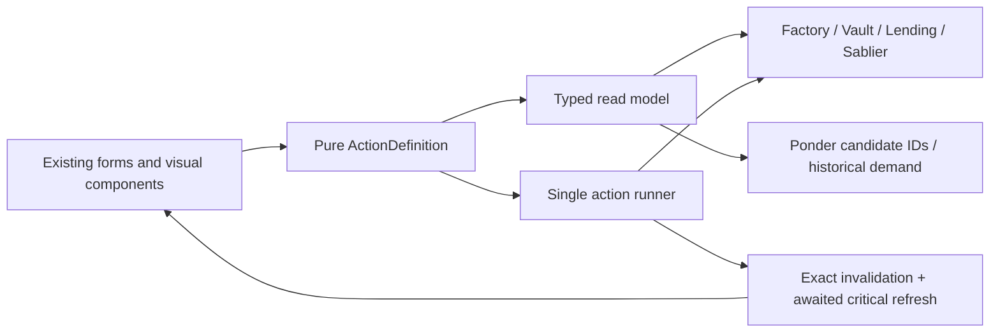

# OVRFLO frontend architecture research

**Date:** 2026-07-29  
**Scope:** `web/`, `tools/ponder/`, frontend-facing project documentation, current ecosystem standards, and public DeFi frontend peers  
**Method:** Read-only architecture and defect review; no code changes and no test execution

## Outcome

OVRFLO’s remaining frontend defects are predominantly structural—15 of 16 current/open defect classes map to four weak boundaries—but those boundaries are narrow enough for a headless refactor rather than a frontend rewrite.

## Research log

- Reviewed the current workspace at commit `cb6770dbbe900583dfd728ea81694197734deb7c`, including every file under `web/app`, `web/lib`, `web/hooks`, `web/components`, and the Ponder source/read API.
- Read the audit and decision history, especially:
  - [2026-07-28 application audit](../dogfood-reports/audit-2026-07-28.md)
  - [Frontend decision map](../frontend-decision-map.md)
  - [Audit remediation plan](../plans/2026-07-28-002-fix-audit-2026-07-28-remediation-plan.md)
  - [Scaffold-ETH pattern-adoption plan](../plans/2026-07-28-003-refactor-web-adopt-se2-patterns-plan.md)
  - [Current proposed web findings plan](../plans/2026-07-29-001-fix-web-review-findings-plan.md), which was present but untracked during this review and therefore is not shipped state.
  - Required audit disproofs, the Sablier interface record, critical patterns, and relevant `docs/solutions/` records.
- Checked the installed stack: Next 16.2.11, React 19.2.4, wagmi 3.7.3, viem 2.55.5, TanStack Query 5.90.12, and Reown AppKit 1.8.23.
- Compared against current primary documentation:
  - [ETHSKILLS Frontend UX](https://ethskills.com/frontend-ux/SKILL.md), [Indexing](https://ethskills.com/indexing/SKILL.md), [Frontend Playbook](https://ethskills.com/frontend-playbook/SKILL.md), and [QA](https://ethskills.com/qa/SKILL.md).
  - [Next.js Server and Client Components](https://nextjs.org/docs/app/getting-started/server-and-client-components), [error handling](https://nextjs.org/docs/app/getting-started/error-handling), and [production checklist](https://nextjs.org/docs/app/guides/production-checklist).
  - [wagmi simulation](https://wagmi.sh/react/api/hooks/useSimulateContract), [receipt waiting](https://wagmi.sh/react/api/hooks/useWaitForTransactionReceipt), and [multicall reads](https://wagmi.sh/react/api/hooks/useReadContracts).
  - [viem `simulateContract`](https://viem.sh/docs/contract/simulateContract) and [TanStack post-mutation invalidation](https://tanstack.com/query/v5/docs/framework/react/guides/invalidations-from-mutations).
- Inspected four current peer repositories at pinned commits:
  - OpenPendle `d852dc0600f8`, 2026-07-29.
  - Uniswap Interface `a69a38c2fab8`, 2026-07-23.
  - Aave Interface `ff5e64b3ed2b`, 2026-07-29.
  - Morpho Lite Apps `54abf77e8fc6`, 2026-04-22.

### Research limitations

- Pendle Finance does not expose its hosted application source in its public organization, so OpenPendle is the closest public Pendle-compatible peer. It is community-built and explicitly unaffiliated with Pendle Finance.
- The repository cannot prove which generated CSP Vercel ultimately serves. That deployment behavior remains **Needs Verification** with `vercel build` or production headers.
- External RPC/provider configuration is only visible through repository defaults; infrastructure-level fallbacks may exist outside the repo.

## Current architecture map

| Subsystem | Entry points and ownership | Authority/read surface | Invariants currently enforced? |
|---|---|---|---|
| App shell | [`layout.tsx`](../../web/app/layout.tsx), [`page.tsx`](../../web/app/page.tsx), `opengraph-image.tsx`, `globals.css` | Static-exported App Router shell | **Yes:** server layout/page with an interactive client leaf is a sound RSC boundary. **No:** route/global error and loading files are absent. |
| Runtime/providers | [`Providers.tsx`](../../web/components/Providers.tsx), `WalletRuntime.tsx`, [`wagmi.ts`](../../web/lib/wagmi.ts), `query-client.ts`, `config.ts` | Reown connector; wagmi/TanStack client; one mainnet RPC | **Partial:** mainnet and `ssr: true` are explicit; missing factory can become zero; transport has no fallback. |
| ABI/domain support | `abis.ts`, generated typed ABI, `types.ts`, `format.ts`, `errors.ts` | Compile-time ABI and frontend representation | **Mostly:** typed calls and product-specific revert mapping are strong. |
| Pure action/domain logic | `borrow.ts`, `claim-all.ts`, `convert.ts`, `demand.ts`, `lending-math.ts`, `modal-logic.ts`, `positions.ts`, `router.ts` | Frontend-computable selection, grouping, formatting, and display math | **Partial:** useful pure planners exist, but they do not own the complete action preconditions or final call. |
| Market discovery | [`useOvrflos.ts`](../../web/hooks/useOvrflos.ts), [`useAllMarkets.ts`](../../web/hooks/useAllMarkets.ts), `useMarketSymbols.ts` | Live factory/vault contract reads | **No completeness guarantee:** failed subcalls can become zero, disappear, or produce an apparently empty protocol. Enumeration is capped at 100 vaults. |
| Lending configuration and liquidity | [`useLending.ts`](../../web/hooks/useLending.ts), [`useLendingLiquidity.ts`](../../web/hooks/useLendingLiquidity.ts), `lending-math.ts`, `router.ts` | Live OVRFLOLending reads; frontend ladder aggregation | **No:** failed params default to valid domain values; global IDs 1–500 are scanned oldest-first. |
| Loan and pool positions | [`useLoanBook.ts`](../../web/hooks/useLoanBook.ts), [`useBorrowerLoans.ts`](../../web/hooks/useBorrowerLoans.ts) | Live lending/Sablier reads | **No:** owner completeness is not guaranteed; failed withdrawable reads become zero; borrower loans poll a global 500-ID window. |
| Held streams | [`ponder.ts`](../../web/lib/ponder.ts), [`useHeldStreams.ts`](../../web/hooks/useHeldStreams.ts) | Ponder discovers IDs; Sablier supplies `getStream`, `ownerOf`, and `withdrawableAmountOf` | **Authority yes, completeness no:** the indexer is correctly only a hint, but discovery silently stops at 100 and a failed withdrawable read becomes zero. |
| Demand/indexer health | `useBorrowDemand.ts`, [`useIndexerSync.ts`](../../web/hooks/useIndexerSync.ts) | Historical Ponder activity plus chain-head comparison | **Yes:** historical demand is not represented as contract truth; unavailable and stale are explicit. |
| Action UI | [`ActionModal.tsx`](../../web/components/ActionModal.tsx), `MarketDetail.tsx`, `RateLadder.tsx` | Six form families own local input, reads, preconditions, approvals, writes, and terminal rendering | **No single policy owner:** the 1,729-line modal is the principal drift hotspot. |
| Write lifecycle | [`useWriteFlow.ts`](../../web/hooks/useWriteFlow.ts), `useApprovalWriteFlows.ts`, `useZeroFirstApprove.ts`, [`useTxQueue.ts`](../../web/hooks/useTxQueue.ts) | wagmi write, receipt polling, zero-first fallback, queue sequencing | **Mostly:** receipt status is checked and double-submit after confirmation is prevented. **Missing:** mandatory final-call simulation; chain injection can be overridden by call arguments. |
| Cache/refetch | [`invalidate.ts`](../../web/lib/invalidate.ts), `query-keys.ts`, `useStaleRecovery.ts` | Contract-address-scoped wagmi invalidation and held-stream retries | **Yes, with a gap:** scoping and indexer-lag retries are good; success is not held until critical refetches settle. |
| UI composition | `MarketsApp`, `MarketsTable`, `MarketRowDetail`, `PositionList`, `PositionSummary`, `ClaimAllModal`, `CopyValue`, `TruncationNotice`, modal error/focus hooks | Presentation plus orchestration | **Mixed:** modal-local error containment is good; async completeness is not consistently propagated to summary/empty states. |
| Ponder ingestion | `SablierV2LockupLinear.ts`, `OVRFLOLending.ts`, `logic.ts`, schema/config | Sablier lifecycle and borrower-pool creation events | **Yes for intended scope:** no protocol balance or executable state is made authoritative. |
| Ponder API | [`api/index.ts`](../../tools/ponder/src/api/index.ts) | `/streams`, `/demand`, framework `/status`; CORS and per-instance rate limit | **Partial:** narrow read surface is good; `/streams` has a fixed limit and no cursor/completeness indicator. |
| Verification/deploy | Vitest, Playwright/Gherkin, CSP scripts, static-export verification | Unit/E2E/build checks | **Partial:** broad local tests exist; coverage is informational and excludes components, primary Reown flow is replaced by a build-time mock in E2E, and no CI executes E2E. |

## Required flow trace

| Flow | Current pipeline | Correct authority | Structural failure point |
|---|---|---|---|
| Browse markets | `page → Providers → MarketsApp → useAllMarkets → MarketsTable` | Factory/vault chain reads | Loading, failed subcalls, and genuine zero markets can converge on `NO APPROVED MARKETS`. |
| Expand market | `MarketsTable → MarketRowDetail → balances + lending + streams + PositionList` | Chain for balances/positions; Ponder only for stream IDs | A single expanded row fans into repeated global lending scans. |
| Supply | `SupplyForm → ladder/balance/allowance → approve → supplyLiquidity → receipt → scoped invalidation` | Final action contract call | Approval and action validity are separately encoded; no mandatory fresh simulation. |
| Borrow | `Ponder stream IDs → Sablier ownership → scanned display ladder → quote/gatherLiquidity → NFT approval → createBorrowerLoanPool` | Sablier ownership and lending `quote/gatherLiquidity` | The display ladder scans only oldest 500 positions, so liquidity may exist on-chain but have no selectable UI tick. |
| Repay | `RepayForm → useBorrowerLoans → balance/allowance → approve → repayLoan → receipt` | Lending loan record and ERC-20 state | Loan discovery scans oldest 500 IDs every two seconds; approval ignores some final-action blockers. |
| Matured claim | `ConvertForm → wallet balance → claim` | Vault `marketTotalDeposited` and `claimablePt` | MAX uses the wallet balance rather than series capacity. |
| Claim all | `PositionSummary → per-market loan/pool hooks + held streams → planClaimAll → ClaimAllModal → useTxQueue` | Complete, resolved live position set | Unavailable or truncated stream discovery can vanish from the plan while the UI still reports `ALL CLAIMS CONFIRMED`. |
| Confirm → invalidate → rerender | `receipt.status → invalidateOnChainReads → scheduled stream retries` | Confirmed receipt, then fresh queries | This is substantially correct. The old H-3 confirmation re-arm defect is fixed; confirmation-to-cache is no longer the dominant root cause. |

## Invariant status

| Invariant | Status |
|---|---|
| Connected wallet must be on mainnet before acting | **Enforced in UI**, and writes default to mainnet; the write helper still permits a caller-provided `chainId` to override the default. |
| Receipt fetch success is not transaction success | **Enforced** through `receipt.data.status`. |
| Action remains locked after confirmation | **Enforced** in current forms. |
| Confirmed write triggers scoped invalidation | **Enforced**. |
| Indexer identifies candidates but never supplies executable current state | **Enforced** for streams and demand. |
| A settled empty result is distinguishable from loading, unavailable, or partial | **Not enforced** consistently. |
| Approval can only proceed when the final action is otherwise valid | **Not enforced** consistently. |
| Exact final call is simulated against fresh state before signing | **Not enforced**. |
| Every amount is positive and within the contract-computable capacity | **Not enforced**. |
| PT/ovrfloToken amounts are 18 decimals | **Intentionally enforced by protocol assumption**; dynamic token decimals are not required here. |
| Every owner can discover every recoverable lending position at any protocol size | **Not enforced; known open H-4/H-5**. |

## Bug classes and root causes

Counting distinct current/open product defect classes—not raw historical tickets, already-fixed findings, visual polish, or the disproven Sablier finding—gives:

| Root boundary | Defect classes | Count | Structural? |
|---|---|---:|---|
| Discovery, completeness, and remote-data semantics | H-4 request explosion; H-5 oldest-500 invisibility; 100-stream truncation; failed withdrawable→zero; failed multicall→default/drop; loading/error→empty markets; incomplete Claim All→complete success | 7 | Yes |
| Action-definition ownership | Approval gates diverge from action gates; matured-claim MAX regression; negative amount reaches wallet encoding | 3 | Yes |
| Transaction executor | No mandatory final-call simulation; expected chain is a default rather than an unoverrideable invariant | 2 | Yes |
| Runtime/deployment boundary | CSP source/build artifact drift; zero factory accepted in production; one RPC with no fallback | 3 | Yes |
| Local component defect | Unnamed borrow-stream `<select>` | 1 | No |

Therefore **15 of 16 classes, or about 94%, collapse into four structural boundaries**. This does not imply that 94% of the code is wrong: the failures are highly concentrated.

### Healthy versus unhealthy duplication

Healthy duplication:

- The same wagmi hook mounted in multiple components with identical query keys; TanStack dedupes the network request.
- Separate read batches where their `enabled` predicates differ.
- A separate pure OVRFLO planner per action type.
- Separate Ponder endpoints for unrelated historical questions.

Unhealthy duplication:

- Repeating final-action preconditions in approval buttons and submit buttons.
- Each form independently owning optimistic allowance, terminal state, chain, simulation, and invalidation policy.
- Each hook inventing its own meaning for failed subcalls.
- Repeating global ID enumeration in summary, detail, table, and modal branches.

The rule should be: **duplicate rendering and domain-specific derivation when useful; never duplicate safety, authority, completeness, or transaction lifecycle policy.**

## Peer architecture board

| Peer | Concrete modules examined | Copy/adapt | Reject |
|---|---|---|---|
| OpenPendle | [`actions.ts`](https://github.com/ggmatch-mod/open-pendle/blob/d852dc0600f829fe2fc19bb67a59b35c0eb86b67/app/src/lib/actions.ts), [`txflow.ts`](https://github.com/ggmatch-mod/open-pendle/blob/d852dc0600f829fe2fc19bb67a59b35c0eb86b67/app/src/lib/txflow.ts), [`hooks.ts`](https://github.com/ggmatch-mod/open-pendle/blob/d852dc0600f829fe2fc19bb67a59b35c0eb86b67/app/src/lib/hooks.ts), `catalog.ts`, `useMarketCatalog.ts` | Pure `ActionPlan`; one approval/check/simulate/send state machine; latch plan/account/chain while sending; discovery artifacts carry coverage/completeness; live contract reads remain authoritative. This matches its documented [static browser/RPC architecture](https://docs.openpendle.com/reference/architecture). | Its multi-chain and permissionless-market machinery is unnecessary for mainnet-only, multisig-approved OVRFLO. |
| Uniswap | [`steps/types.ts`](https://github.com/Uniswap/interface/blob/a69a38c2fab83be09b7d4113094a49b385810c5e/packages/uniswap/src/features/transactions/steps/types.ts), [`useFreezeWhileSubmitting.ts`](https://github.com/Uniswap/interface/blob/a69a38c2fab83be09b7d4113094a49b385810c5e/packages/uniswap/src/features/transactions/swap/stores/swapFormStore/hooks/useFreezeWhileSubmitting.ts), [`executeSwapService.ts`](https://github.com/Uniswap/interface/blob/a69a38c2fab83be09b7d4113094a49b385810c5e/packages/uniswap/src/features/transactions/swap/services/executeSwapService.ts) | Typed transaction steps; freeze reviewed values while submitting; separate execution service from form rendering. | Sagas, remote trading-plan API, cross-chain plans, wallet-call variants, and the overall monorepo abstraction weight. |
| Aave | [`useTransactionHandler.tsx`](https://github.com/aave/interface/blob/ff5e64b3ed2bfafcaff0791f3e5a9c38d04d534b/src/helpers/useTransactionHandler.tsx), [`TxActionsWrapper.tsx`](https://github.com/aave/interface/blob/ff5e64b3ed2bfafcaff0791f3e5a9c38d04d534b/src/components/transactions/TxActionsWrapper.tsx), [`useApprovalTx.tsx`](https://github.com/aave/interface/blob/ff5e64b3ed2bfafcaff0791f3e5a9c38d04d534b/src/hooks/useApprovalTx.tsx) | Shared presentational transaction shell, explicit approval/reset states, and a common receipt handler. | Aave still repeats approvals and invalidations inside individual action modules. That is evidence for centralization, not a structure OVRFLO should reproduce. |
| Morpho Lite | [`use-contract-events.ts`](https://github.com/morpho-org/morpho-lite-apps/blob/54abf77e8fc6398cbb117dd12f5d9efd202fd7c8/packages/uikit/src/hooks/use-contract-events/use-contract-events.ts), [`transaction-button.tsx`](https://github.com/morpho-org/morpho-lite-apps/blob/54abf77e8fc6398cbb117dd12f5d9efd202fd7c8/packages/uikit/src/components/transaction-button.tsx), [`borrow-sheet-content.tsx`](https://github.com/morpho-org/morpho-lite-apps/blob/54abf77e8fc6398cbb117dd12f5d9efd202fd7c8/apps/lite/src/components/borrow-sheet-content.tsx) | Event-range queries expose contiguous completeness, adapt to provider limits, cache exact ranges, and invalidate exact keys. | Its bare `TransactionButton` writes without simulation and leaves each caller responsible for refetching; that is too weak for OVRFLO. |

OpenPendle is the highest-affinity reference: Pendle mechanics, static deployment, chain simulations, exact approvals, browser RPCs, and explicit discovery coverage. It also confirms that a static dApp does not require a server-heavy architecture.

## Implementable target architecture

The smallest useful redraw is entirely headless:



### 1. Typed read results

Wrap existing hooks rather than replacing wagmi:

```text
ReadResult<T> =
  loading
  | ready { data, complete: true, source, block }
  | partial { data, failures, source, block }
  | unavailable { error, cached? }
```

Rules:

- Failed subcalls never become `0`, `1`, or absent rows.
- `complete` is required before aggregate actions such as Claim All.
- Successful siblings may remain visible in `partial` state.
- Ponder responses include cursor/`hasMore`; a multi-page failure is unavailable, never a shorter successful list.
- Current contract state remains the authority for every displayed or actionable value.

### 2. One pure action definition per action

Move the policy already spread across `ActionModal.tsx` into small OVRFLO-specific modules:

```text
web/lib/actions/
  supply.ts
  borrow.ts
  deposit.ts
  claim-matured.ts
  wrap.ts
  unwrap.ts
  adjust-rate.ts
  repay.ts
  claim-pool.ts
  claim-stream.ts
```

Each definition owns only:

- Parsed domain input.
- Required fresh reads.
- Preconditions and user-facing failure reason.
- Required approval(s).
- Final call builder.
- Contracts/assets/query keys touched.
- Receipt interpretation.

This can be a simple discriminated object, not an inheritance framework or generic form builder.

### 3. A single action runner

The runner should own this state machine:

```text
disconnected
→ wrong-network
→ checking
→ needs-approval
→ approving
→ revalidating
→ simulating
→ wallet-signing
→ confirming
→ refreshing
→ success | error
```

Properties:

- Approval inherits every final-action precondition except “allowance is sufficient.”
- The account, chain, and action plan are latched once signing starts.
- Immediately before the wallet prompt, refresh required reads and call `simulateContract`.
- Write the exact request returned by simulation.
- Chain ID is applied after caller data, or removed from the caller-facing type, so call sites cannot override it.
- Receipt status distinguishes confirmed success from on-chain revert.
- Success is not exposed until critical chain keys have invalidated and settled.
- Indexer-backed discovery gets the existing delayed retries, without refreshing unrelated chain reads.

### 4. Claim All composes the same runner

Keep `planClaimAll` and the current visible queue, but:

- Require a complete position read model before planning.
- Re-plan each next leg after the preceding receipt and critical refresh.
- Execute every queue row through the same action runner.
- If streams are unavailable, either block the aggregate or explicitly call it “claim pool shares”; it must never report unqualified “all claims confirmed.”

### 5. State ownership rules

- Forms own raw text, selected tick/stream, disclosure state, and visual copy.
- Action definitions own validation and call derivation.
- Read hooks own loading/partial/unavailable semantics.
- The runner owns chain, approval, simulation, signing, confirmation, and cache refresh.
- Ponder owns candidate enumeration and historical activity only.
- Contracts own present eligibility, balances, ownership, capacity, quote, and execution.

### 6. Adding a new action

A new action should require:

1. A pure action-definition module with table tests for valid/invalid inputs.
2. A registry entry naming its component and accent/copy.
3. A form that supplies input and renders the runner state.
4. Receipt decoding only if the action needs a product-specific success summary.
5. No new approval, write, receipt, or invalidation hook.

That makes “add action” a bounded domain task instead of another transaction subsystem.

### What remains OVRFLO-specific

Do not generalize away:

- Pendle PT is 18 decimals.
- `0` means unlimited deposit cap.
- Series approval/maturity and `marketTotalDeposited` semantics.
- `claimablePt` and cross-market ovrfloToken fungibility.
- Sablier NFT ownership and v2-core behavior.
- Loan-pool fair recovery and self-repaying obligations.
- Self-match exclusion.
- `quote`/`gatherLiquidity` as the authoritative borrow path.
- Ponder’s intentionally narrow stream/demand surface.
- Factory-admin and multisig-approved market assumptions.

## Prioritized findings

### P0

No P0 finding. No current frontend path was found that directly enables theft or bypasses an on-chain security boundary.

### P1 — Owner discovery still has a protocol-size cliff

`enumerateIds` keeps IDs 1–500, and the three lending hooks build global scans from it. Positions and tick depth created after that window remain unreachable through the UI, while request cost grows with protocol history. See [`lending-math.ts`](../../web/lib/lending-math.ts), [`useLendingLiquidity.ts`](../../web/hooks/useLendingLiquidity.ts), [`useLoanBook.ts`](../../web/hooks/useLoanBook.ts), and [`useBorrowerLoans.ts`](../../web/hooks/useBorrowerLoans.ts).

This is not solvable by reorganizing React components. Under the settled decision to keep Ponder limited to streams/demand, eliminating it requires reopening the declined per-user lending indexes and bounded `gatherLiquidity` contract work. Otherwise it is accepted residual risk and must be described as such.

**Checked against:** audit H-4/H-5; [KTD11 explicitly records both as open](../plans/2026-07-28-002-fix-audit-2026-07-28-remediation-plan.md). This is known, not a new finding.

### P1 — Incomplete reads are still represented as complete financial state

Examples:

- Stream discovery defaults to 100 IDs with no pagination in [`ponder.ts`](../../web/lib/ponder.ts).
- `/streams` has a maximum limit and no cursor/`hasMore` in [`api/index.ts`](../../tools/ponder/src/api/index.ts).
- Withdrawable failures become `0n` in [`useHeldStreams.ts`](../../web/hooks/useHeldStreams.ts), [`useLoanBook.ts`](../../web/hooks/useLoanBook.ts), and [`useBorrowerLoans.ts`](../../web/hooks/useBorrowerLoans.ts).
- Lending configuration failures become APR `0` or next ID `1` in [`useLending.ts`](../../web/hooks/useLending.ts).
- Market loading/failure is discarded before the empty table renders.
- `PositionSummary` does not consume held-stream `unavailable`/`stale`, allowing pool-only Claim All success over an incomplete portfolio.

This boundary explains five current findings and is the best first refactor target.

**Checked against:** the proposed July 29 plan Tasks 2, 3, 8, 9, and 10. Known and independently confirmed.

### P1 — Deployed CSP depends on a mutable/stale source artifact

The build writes environment-derived CSP and inline hashes into a committed `web/vercel.json`; its current contents include localhost origins and build-specific hashes. A local build therefore dirties source, and it is not documented that Vercel re-reads a mutated `vercel.json` after the build command.

A static build artifact should carry the generated CSP, and build verification should compare the final header artifact with exported HTML.

**Checked against:** the proposed July 29 plan Task 1 and the static-export discussion in [the frontend decision map](../frontend-decision-map.md). The deployment outcome itself is **Needs Verification**.

### P2 — Action validity has no single owner

[`ActionModal.tsx`](../../web/components/ActionModal.tsx) owns parsing plus six form implementations. The same action is represented independently by:

- Display validation.
- Approval-button gating.
- Submit-button gating.
- Optimistic approval state.
- Contract-call arguments.

That allowed invalid approvals, the matured-claim MAX regression, and negative amounts to survive otherwise extensive tests. The regression is especially probative: WEB-009 had previously recorded the claim-cap fix, but the replacement `ConvertForm` did not carry the invariant forward.

**Checked against:** July 29 Tasks 5, 7, and 11; `web/reviews/issues-and-fixes.md` WEB-009. Known individual bugs; the common action-definition boundary is the architectural synthesis.

### P2 — The write engine lacks binding simulation and does not strictly own chain selection

`useWriteFlow` writes directly after display-time reads. It does not run a final `simulateContract`, even though viem and wagmi explicitly support simulation→write using the returned request. Additionally, [`useWriteFlow.ts`](../../web/hooks/useWriteFlow.ts) constructs `{ chainId: configuredChainId, ...args }`, so a caller can override the intended chain.

Current call sites do not appear to pass a conflicting chain, and the UI’s chain guard fixes the former audit H-2. This is a latent invariant weakness, not evidence of a presently exploitable wrong-chain path.

**Checked against:** [Scaffold-ETH adoption plan R1–R8](../plans/2026-07-28-003-refactor-web-adopt-se2-patterns-plan.md), earlier production-readiness plans, ETHSKILLS, and official wagmi/viem documentation. Known planned gap; still unimplemented.

### P2 — Runtime configuration can degrade into a confident empty app

[`config.ts`](../../web/lib/config.ts) accepts a missing production factory as the zero address, while [`wagmi.ts`](../../web/lib/wagmi.ts) configures a single optional HTTP transport. A missing factory looks like no markets; a rate-limited RPC feeds the same partial/zero semantics discussed above.

Required production configuration should fail the build, and production reads should use a prioritized fallback transport. Public fallbacks should be chosen deliberately rather than silently relying on wagmi defaults.

**Checked against:** July 29 Task 4 and SE2-plan R6–R8. Known.

### P3 — App-level recovery and verification records have drifted

The App Router contains no `error.tsx`, `global-error.tsx`, or `loading.tsx`, even though [`next-best-practices-audit.md`](../../web/reviews/next-best-practices-audit.md) records them as fixed. Next’s current production guidance recommends catch-all error handling and loading boundaries.

Other assurance drift:

- `issues-and-fixes.md` describes deleted, pre-rewrite components.
- [`vitest.config.ts`](../../web/vitest.config.ts) makes coverage informational and covers only `lib/**` and `hooks/**`.
- [The E2E README](../../web/tests/e2e/README.md) explicitly defers CI.
- E2E uses a build-time wallet runtime seam, so it does not exercise the production Reown connection path.

These are not the root cause of protocol behavior, but they make regressions easier to reintroduce and harder to detect.

**Checked against:** current file inventory, Next.js official guidance, and current review/testing records. The stale status claims are newly reconfirmed.

### P3 — Borrow stream selector has no accessible name

The dynamic stream `<select>` in [`ActionModal.tsx`](../../web/components/ActionModal.tsx) has no associated label or ARIA name.

This is the one clearly local current defect: add a visible label and a modal-level accessibility test.

**Checked against:** July 29 Task 6. Known.

## Known and intentional — do not “fix”

- Audit H-4/H-5 are known open because the user declined the Solidity index/bounded-gather change.
- The 2026-07-28 audit’s Sablier-withdrawal H-1 is disproven for the deployed v2-core v1.1 contract; do not re-raise it from newer Sablier documentation.
- Pendle PT and the supported wstETH path are intentionally 18 decimals. Do not introduce generalized dynamic-decimal plumbing.
- Cross-market ovrfloToken fungibility is a feature. The frontend must cap a series claim, not prevent cross-market holdings.
- Ponder should remain a discovery/history surface, not an authority for balances, ownership, eligibility, or executable values.
- Static export is intentional. Do not add a request-time Next server merely to solve CSP or data-flow issues.
- The current server `layout/page → client Providers/MarketsApp` boundary is sound. A rewrite into server data fetching would not help a wallet-driven static dApp.
- Scoped post-confirmation invalidation is already implemented and should be retained.
- The old confirmed-button re-arm and indexer-as-truth defects are fixed. They should not be used as evidence that the current write/cache or trust boundary is absent.
- Duplicate hook mounts with matching wagmi query keys are not automatically duplicate RPC requests; TanStack deduplication is meaningful.
- Read batches with different enablement predicates should remain separate.
- `0 = unlimited` deposit cap is intentional.
- The zero Reown project-ID fallback is a documented local-build choice; the production factory/RPC checks are the critical build gate.

## Migration sequence

1. **Baseline the invariants without changing UI.**
   - Add regression tests for complete/partial/unavailable reads, approval inheriting action validity, positive amounts, claim capacity, simulation failure without wallet prompt, chain override refusal, and awaited refresh.
   - Update stale review records only after behavior is proven.

2. **Introduce typed read completeness around existing hooks.**
   - Paginate `/streams`.
   - Stop zero/default/drop conversion on failed subcalls.
   - Propagate partial state into markets, ladder, positions, and Claim All.
   - This removes the largest current defect cluster without component redesign.

3. **Extract action definitions from `ActionModal.tsx`.**
   - Start with Convert, Borrow, and Repay because they contain all three demonstrated drift patterns.
   - Keep visual markup and local input state unchanged.
   - Make approval and submit render from the same precondition result.

4. **Upgrade `useWriteFlow` into the single runner.**
   - Revalidate required reads.
   - Simulate the exact final call.
   - Pin chain unoverrideably.
   - Latch account/plan while pending.
   - Wait for receipt, invalidate exact keys, and await critical refresh before success.
   - Route `useTxQueue` through the same executor.

5. **Split the modal only after policy extraction.**
   - Move form renderers into separate files for maintainability.
   - Do not use the split itself as the fix; a six-file version with duplicated policy would preserve the same defects.

6. **Harden runtime and deploy artifacts.**
   - Fail production builds on missing factory/RPC/indexer configuration.
   - Add configured RPC fallback and batching.
   - Generate CSP only into deploy artifacts and verify it against the exported HTML.
   - Restore route/global recovery boundaries and add CI for unit/build checks; run seeded E2E where infrastructure permits.

7. **Make the lending-discovery decision explicit.**
   - If the declined contract work remains declined, record H-4/H-5 as accepted residual limitations and improve direct-contract recovery guidance.
   - If “no owner position may become unreachable” is required, reopen the minimal per-user lending indexes plus bounded/cursored `gatherLiquidity`. No frontend-only reorganization can prove that invariant under the present contract interface.

## Verdict

**Keep the current frontend and visual design; perform a targeted redraw of the headless read-model and transaction-policy boundaries.**

A greenfield rebuild would discard working strengths: typed ABIs, OVRFLO-specific planners, product error mapping, live-chain stream hydration, scoped invalidation, receipt-status handling, queue sequencing, static deployment, and the current accessibility work. Local one-off fixes alone are also insufficient because the same policy drift has already reappeared across component rewrites.

The right scope is between those extremes: retain `app`, presentation components, wagmi, TanStack, Reown, and the narrow Ponder service; centralize completeness semantics, action definitions, and transaction execution. That is the smallest migration that removes whole recurring bug classes without changing the product’s visual design or settled protocol decisions.
