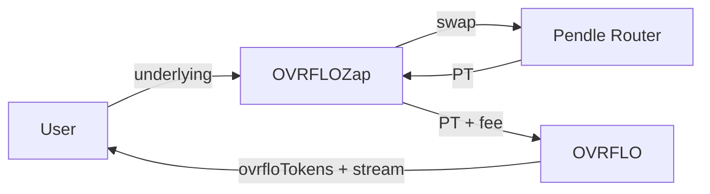

# OVRFLO Zap Contract Plan

## Overview

Build a zap contract that lets users deposit **underlying** (e.g., wstETH) in one transaction. The zap will:

1. Swap underlying to PT via Pendle Router
2. Deposit PT into OVRFLO (fee paid in underlying)

Users approve the zap for underlying only; no separate PT or fee approvals.

---

## Flow



---

## Fee Split Logic

OVRFLO charges `feeAmount = toUser * feeBps / 10000` in underlying. The zap must hold back enough underlying for the fee before swapping.

**Approach:** Conservative split, then refund excess.

1. Read `feeBps` from `ovrflo.series(market)`
2. `swapAmount = underlyingAmount * 10000 / (10000 + feeBps)` — reserve the rest for fee
3. Swap `swapAmount` to PT via Pendle
4. `feeAmount = ovrflo.previewDeposit(market, netPtOut).feeAmount`
5. Require `underlyingAmount - swapAmount >= feeAmount`
6. Deposit into OVRFLO (pulls PT + fee from zap)
7. Refund any excess underlying to user

---

## Dependencies

Add Pendle as a Foundry dependency:

```bash
forge install pendle-finance/pendle-core-v2-public --no-commit
```

Or use a minimal interface if you prefer not to add the full repo. Required interfaces:

- **IPAllActionV3** (or equivalent): `swapExactTokenForPt(receiver, market, minPtOut, approx, tokenInput, limit)`
- **TokenInput**, **ApproxParams**, **LimitOrderData** structs
- **IPMarket**: `readTokens()` to get PT address for approvals

Pendle Router address (Ethereum mainnet): `0x888888888889758F76e7103c6CbF23ABbF58F946`

---

## Zap Contract Interface

```solidity
// src/OVRFLOZap.sol

function zapIn(
    address vault,           // OVRFLO contract
    address market,         // Pendle market
    uint256 underlyingAmount,
    uint256 minOvrfloOut    // min toUser (slippage)
) external returns (uint256 toUser, uint256 toStream, uint256 streamId);

function previewZap(
    address vault,
    address market,
    uint256 underlyingAmount
) external view returns (
    uint256 netPtOut,
    uint256 toUser,
    uint256 toStream,
    uint256 feeAmount,
    uint256 swapAmount
);
```

---

## Implementation Details

### 1. Zap state / config

- Pendle Router address (immutable)
- No vault whitelist; any OVRFLO + approved market works

### 2. `zapIn` steps

1. Pull `underlyingAmount` from `msg.sender` (user must approve zap)
2. Read `(,, underlying, feeBps)` from `ovrflo.series(market)` — validate market is approved
3. `swapAmount = underlyingAmount * 10000 / (10000 + feeBps)`
4. Approve router for `swapAmount`, call `swapExactTokenForPt` with `receiver = address(this)`
5. `netPtOut` = PT balance received
6. `(, , feeAmount, ) = ovrflo.previewDeposit(market, netPtOut)`
7. Require `underlyingAmount - swapAmount >= feeAmount`
8. Approve OVRFLO for PT and underlying
9. `ovrflo.deposit(market, netPtOut, minOvrfloOut)` — OVRFLO pulls PT and fee from zap
10. Refund excess underlying to user
11. Return `(toUser, toStream, streamId)` from the deposit

### 3. Slippage

- `minPtOut` on Pendle swap (0 or small % of expected)
- `minOvrfloOut` on OVRFLO deposit (user's main slippage control)

### 4. Pendle router params

- `ApproxParams`: use default, e.g. `ApproxParams(0, type(uint256).max, 0, 256, 1e14)` (from Pendle docs)
- `LimitOrderData`: empty (no limit orders)
- `TokenInput`: `createTokenInputStruct(underlying, swapAmount)` — need helper or inline struct

### 5. Edge cases

- **feeBps == 0**: `swapAmount = underlyingAmount` (no holdback)
- **Underlying mismatch**: Require `ovrflo.series(market).underlying ==` the token user sends
- **Excess refund**: Use `SafeERC20.safeTransfer` to send leftover underlying back to user

---

## Files to Create

| File | Purpose |
|------|---------|
| `src/OVRFLOZap.sol` | Main zap contract |
| `interfaces/IPendleRouter.sol` | Minimal Pendle router interface + structs (or import from Pendle) |
| `test/OVRFLOZap.t.sol` | Fork tests (Pendle market + OVRFLO) |

---

## OVRFLO Changes

None. The zap only calls existing `deposit` and `previewDeposit`; no OVRFLO changes required.

---

## Open Questions

1. **Chain**: Same router address on Ethereum mainnet; confirm if Arbitrum/other chains needed
2. **Pendle dependency**: Full `pendle-core-v2-public` vs minimal local interfaces (trade-off: completeness vs dependency size)
3. **Router version**: Docs reference `IPAllActionV3`; verify deployed router implements this and exact function signature
